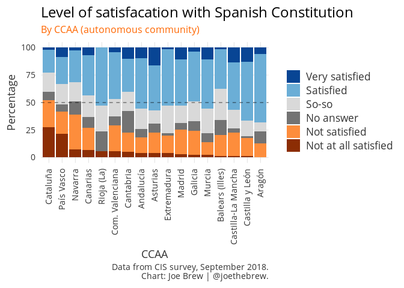
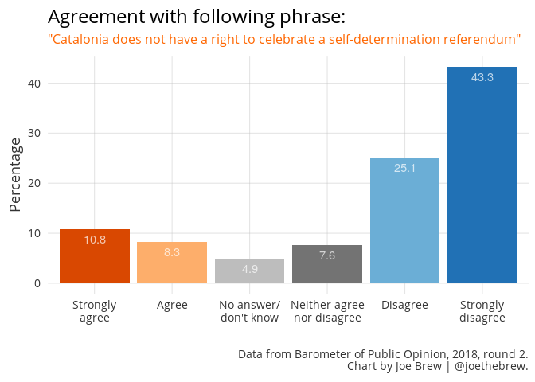

The data are clear: there is a broad consensus among Catalans
================

All sides in the Catalonia crisis agree that Spain is facing a constitutional crisis. And though the proximal cause of that crisis is the collective disobedience of Catalonia's citizenry and government in regards to the October 2017 self-determination referendum, the distal cause (ie, "the cause of the cause") of that disobedience is the perceived illegitimacy of the Constitution, and the broad desire for self-determination. In other words, the "criminal" referendum organized by the Catalan government last October came about because the rulebook which prohibited that referendum (the Spanish Constitution) does not receive sufficient support to guarantee compliance in Catalonia. Support for the Spanish Constitution is low - particularly among Catalans - and support for Catalan self-determination is high.

How low? And how high? Let's dig in.

The question
============

How much support is there for the Consitution of 1978 in Spain and Catalonia?

How much support is there among Catalans for a self-determination referendum?

The data
========

We'll dive into data from the Barometer of Public Opinion from the Center of Opinion Studies (CEO, Catalonia) and the Center for Sociological Research (CIS, Spain).

The results
===========

Satisfaction with the Constitution in Spain
-------------------------------------------

Outside of Catalonia, the overall percentage of Spaniards who are "satisfied" or "very satisfied" with the Spanish Constitution is an absolute majority (51.8%). The unsatisfied minority (the sum of both "not satisfied" and "not at all satisfied") is only 23.4%. In other words, in Spain, the "satisfied" outnumber the "unsatisfied" by a margin of greater than 2 to 1.

Insatisfaction with the Constitution in Catalonia
-------------------------------------------------

If we look just at Catalonia, the opposite pattern emerges. Only 1.75% are "very satisfied" with the Constitution, less than one fourth the rate of high satisfaction in the rest of Spain. And the sum of the "very satisfied" and "satisfied" group rises to only 22.55%.

The percentage of Catalans who are not satisified with the Constitution is over twice that: 52.1%. 24.3% of Catalans are "not satisfied", and 27.8% are not at all satisfied.

Variation in satisfaction with the Constitution in other Autonomous Communities
-------------------------------------------------------------------------------

Of the 17 CCAAs, Catalonia has the highest dissatisfaction rate, exceeding 50%. But it is not the only CCAA where dissatisfaction is greater than satisfaction: in the Basque Country, 41.6% are dissatisfied whereas only 32.9% are satisfied; and in Navarra, 39% are dissatisfied whereas 31.7% are satisfied.

The opposition to self-determination in Spain
---------------------------------------------

In a national survey in October 2018, Spaniards were asked about their preferences for territorial organization, given 5 choices: (i) a centralized state with no autonomy for the regions, (ii) a state with less autonomy than the current status quo, (iii) status quo, (iv) greater autonomy for the regions, (v) the possibility for regions to become independent.

A majority of non-Catalan Spaniards (76.4%) want to keep the status quo or *decrease* the amount of autonomy given to the regions. A full 22.5% want a centralized state with no autonomy for the regions. Only 5% are in favor of granting self-determination to regions.

The consensus for self-determination in Catalonia
-------------------------------------------------

Only 19.1% of Catalans believe that Catalonia does not have a right to a self-determination referendum, whereas 68.4% believe that it does. Removing those who do not answer the question, 78.2% of Catalans believe that Catalonia has a right to a self-determination referendum.

Qualitative reflection
======================

"Social fracture" and its causes
--------------------------------

A common mantra of the political right in Catalonia is that the drive for self-determination has caused unprecedented "social fracture". But the supposed cause of this social fracture, self-determination, is supported by a large majority of Catalans (including many who are opposed to independence).

On the other hand, in a hypothetical referendum on the Spanish Constitution, only 17.4% of Catalans say that they would vote "yes". Even if we remove the 25.6% which don't know or don't answer, the percentage who would vote "yes" would be only 23.4% ("no" would be 76.6%).

Conclusion: the broad consensus
-------------------------------

In a recent address to Congress, Spanish President Pedro Sánchez stated that a "broad consensus" was necessary for a solution to Catalonia's political crisis. But the data are clear: Catalans already share a broad consensus: more than 3/4 are in favor of exercising the right to self-determination, and more than 3/4 are opposed to the Spanish Constitution which prevents them from exercising that right.

It is a strange that the 78% consensus in favor of a self-determination referendum is considered "not enough", but the 23% consensus in favor of the Constitution is considered sufficient for the continued governance of Catalonia. It is also strange that mainstream Spanish political parties and politicians continue to treat the broad desire among Catalans for self-determination as a question of criminal law, rather than politics. As long as a broad majority of Catalans favor self-determination, they will continue to elect politicians who pursue it (within or outside of Spanish law). And as long as a broad majority of Catalans are opposed to the Spanish Constitution, they will continue to elect politicians who create laws outside of it.

A political solution to the Catalan crisis requires recognition that (a) a broad consensus in favor of self-determination already exists, and (b) governing a territory in which fewer than one quarter of the inhabitants approve of the "rules of the game" (the Constitution) is simply unsustainable. Those who are not pursuing a Constitutional reform to permit Catalonia to vote in an agreed upon referendum for Catalonia are either (a) unaware of the data, (b) aware but indifferent to what Catalans want or (c) gaining politically from continued conflict.

Catalan language plots
======================

