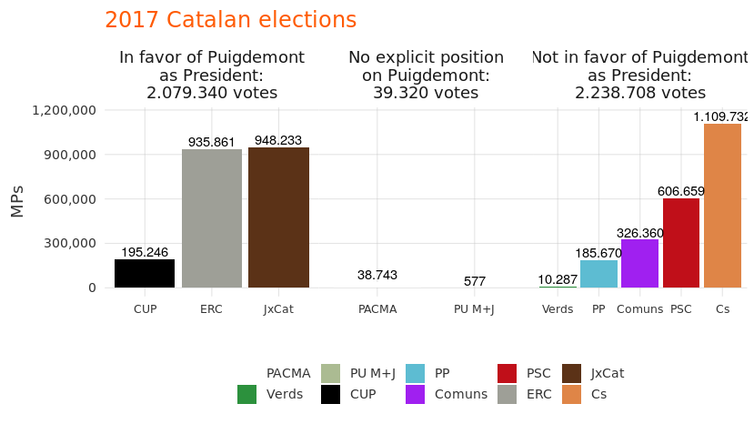
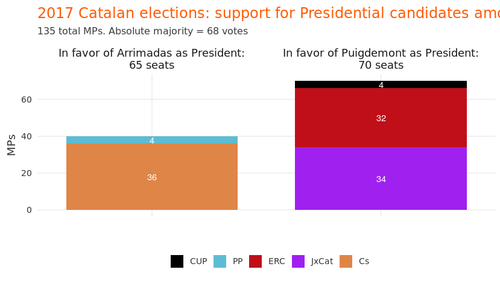
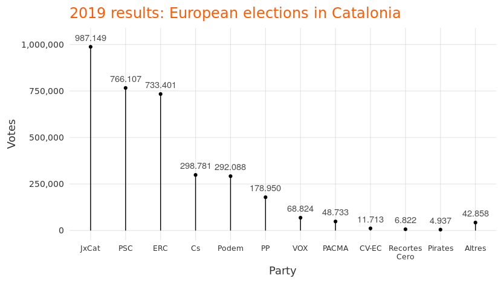
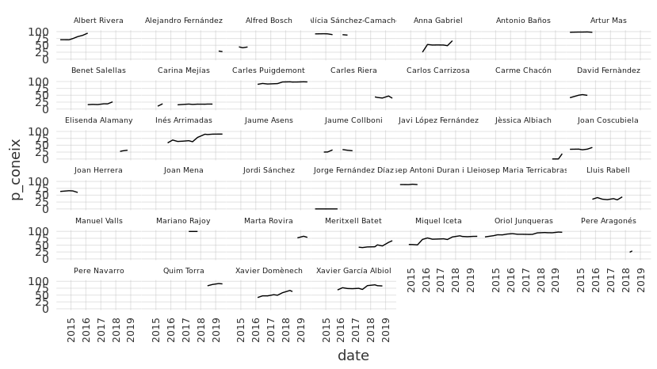
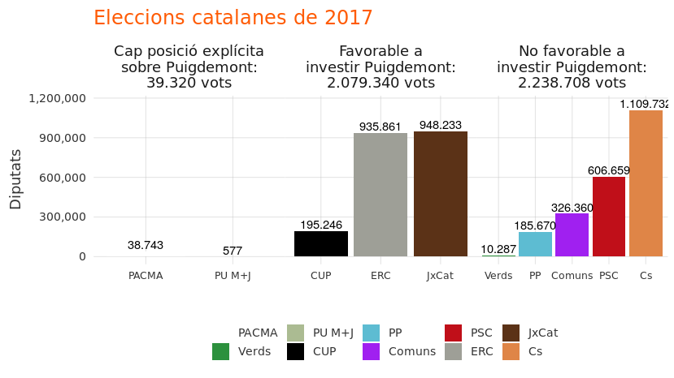
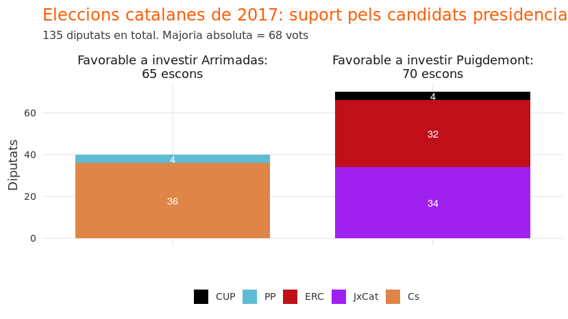
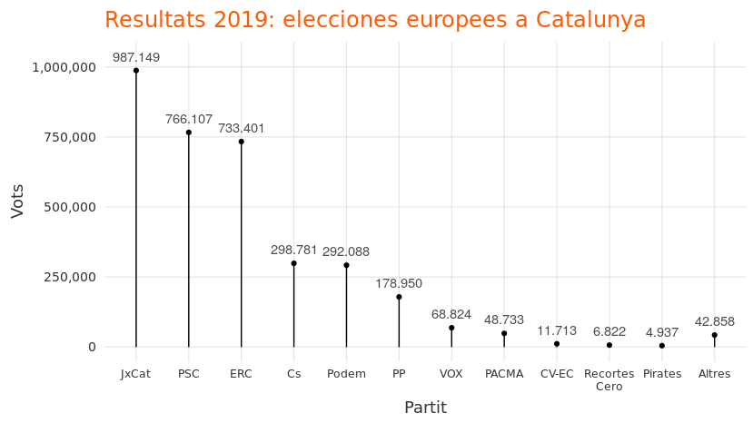

Puigdemont’s political relevance
================

# Alternative title: the persistent difficulty of “apartar Puigdemont”

# Introduction

Two weeks ago, the Spanish newspaper “El País” published [an
article](https://elpais.com/politica/2019/08/06/actualidad/1565101313_277310.html)
which described Carles Puigdemont as isolated, quiet, and increasingly
irrelevant in politics and the international media. The narrative in the
Spanish media of Puigdemont as irrelevant is nothing new. It reflects,
perhaps, an expectation: that the fact that Puigdemont resides abroad
means his influence in Catalan politics will diminish over time.

Whatever your *expectation* is regarding Puigdemont’s relevance, the
narrative of the Catalan politician as “irrelevant” does not reflect the
facts. Whether you like it or not, the data show that Puigdemont remains
Catalonia’s most “relevant” politician. He was the candidate who
received the most votes in Catalonia in the European elections. He is
more talked about - by both his political allies and rivals - than any
other politician. He is more well-known than any other Catalan
politician. And his name is searched for more - in English, Spanish,
French, and German - than any other politician, on platforms like Google
and Wikipedia.

Let’s explore the data in five areas: (1) elections, (2) twitter, (3)
wikipedia, (4) google, (5) surveys.

## 1\. Elections

Following the October 2017 independence referendum, Spain dissolved the
Catalan government, imprisoned several activisits and politicians, and
imposed regional elections. The Spanish Government said it would
[“gladly” accept Puigdemont’s
participation](https://www.europapress.es/nacional/noticia-gobierno-recibiria-agrado-participacion-puigdemont-elecciones-21d-20171028184016.html)
in the December 2017 elections. But once the results came in, that
position changed.

Puigdemont campaigned from abroad. His candidacy received the second
most number of votes.

<!-- -->

However, the candidacy of the party which received the most votes (the
“Citizens’” Inés Arrimadas) was unable to convert the electoral
“victory” into a presidency, since she garnered very little support
among other parties. In fact, “Citizens’” received the most votes
largely because it concerntrated the anti-independence votes into one
party, whereas the pro-independence votes were split evenly between two.

If we translate popular votes into parliamentary support for presidency,
we can see that Puigdemont was - by far- the politician whose candidacy
received the most parliamentary support:

<!-- -->

Fast-forward a year and a half to the May 2019 European parliamentary
elections. Puigdemont again campaigned from abroad. And just weeks
before the elections, [Spain’s electoral body (ilegally) blocked his
candidacy](https://www.politico.eu/article/spanish-electoral-body-blocks-former-catalan-president-carles-puigdemont-from-running-in-eu-election/).
The block was later overruled, Puigdemont was able to run, and he
received more votes from Catalans than any other candidate.

<!-- -->

In other words, for those who believe that elections are the only
reliable source of information on a politician’s relevance, it is clear
that Puigdemont remains relevant.

And for those who seek information beyond just election results, keep
reading…

## 2\. Twitter

Twitter mentions are extremely volatile. One event or sensational
article can send mentions up 10x or 100x.

  - Aggregated over time
  - Retweets and likes per
    tweet

## 3\. Wikipedia

## 4\. Google

## 5\. Surveys

<!-- -->

    Error in eelement_text(size = 6): could not find function "eelement_text"

# Conclusion

The narrative of Puigdemont as “irrelevant” is not based on reality.
Rather, it likely emerges from a form of “wishful thinking”. The same
newspapers whose [editorials advocate for making Puigdemont
irrelevant](https://elpais.com/elpais/2019/04/10/opinion/1554917949_768729.html),
are also the ones who publish stories on his supposed irrelevance. But
stories are cheap and easy, particularly when no data are involved.
Reality, on the other hand, is stubborn. Puigdemont’s persistent
relevance in Catalan politics is something to be acknowledged,
*especially* by those who consider it a problem.

The day after the October 2017 Catalan independence referendum, the
European Commission issued a statement calling on [“all relevant players
to now move very swiftly from confrontation to
dialogue”](https://europa.eu/rapid/press-release_STATEMENT-17-3626_en.htm).
And Spanish President Pedro Sánchez has repeatedly said that his
government is a “government of dialogue”. Yet neither Sánchez, nor any
member of his government, has engaged in any conversation with
Puigdemont since October 2017. That’s nearly two years of simmering
political conflict, with not even one conversation between the
priniciple representatives of the two sides. The European Commission was
right: “all relevant players” need to talk with one another, in order to
craft a solution for the Catalan political crisis. And “all relevant
players”, like it or not, includes Carles
Puigdemont.

# Catalan language plots

<!-- --><!-- --><!-- -->

    Error in make_plot(ca = TRUE): could not find function "make_plot"

    Error in make_plot(ca = TRUE, y = "interactions"): could not find function "make_plot"

    Error in make_another(ca = TRUE): could not find function "make_another"

    Error in make_wiki_plot(language = "ca", since = start_date, people = article_people): could not find function "make_wiki_plot"

    Error in make_wiki_time_plot(people = article_people, language = "ca", : could not find function "make_wiki_time_plot"

    Error in make_wiki_time_plot(people = article_people, language = "ca", : could not find function "make_wiki_time_plot"

# Technical details

Data were gathered from Wikipedia using the `pageviews` R package. Data
were gathered from Twitter using the `twint` package. The code for this
analysis is publicly available
[here](https://github.com/joebrew/vilaweb/tree/master/analyses/wikipedia2).
