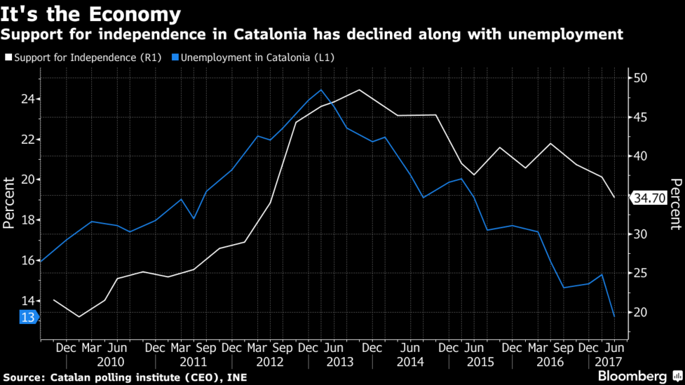

```{r setup, include=FALSE, echo = FALSE}
# Basic knitr options
library(knitr)
opts_chunk$set(comment = NA, 
               echo = FALSE, 
               warning = FALSE, 
               message = FALSE, 
               error = TRUE, 
               cache = FALSE,
               fig.width = 8.64,
               fig.height = 4.86,
               fig.path = 'figures/')
```


```{r}
# Libraries
library(vilaweb)
library(tidyverse)
require(readr)
library(ggrepel)
source('prepare_ceo_data.R')
```

# The theory: a poor economy causes support for Catalan independence

There exists a popular theory that support for Catalan independence is simply a function of the economy. According to this theory, the birth of the independence "procés" coincided with the 2007 global financial crisis, and Catalans' trying to achieve an independent country are largely just frustrated financially. 

This theory was popularized by a mid-2017 [Bloomberg article](https://www.bloomberg.com/news/articles/2017-08-09/catalans-think-twice-about-risks-of-rupture-as-good-life-returns) which stated that support for independence had gone because the unemployment rate had gone down. The article contained the below chart showing the association between the unemployment rate and independentism.



The chart was a hit, getting shared largely on social media in [some media sectors](https://cronicaglobal.elespanol.com/business/relacion-economia-independentismo_86045_102.html). The reason for its success was likely that it offered a simple, straightforward explanation for why so many Catalans wanted to leave Spain. The chart - and the accompanying article - offered a nice, clean, simple, non-political explanation for a political problem. Its popularlity was due not just to its simplicity, but also due to the implicit prognosis:  since the cause of independentism was supposedly economic (and not political), it justified _not_ addressing Catalan independentism politically.


# Problems in the theory

The theory that Catalan independentism is the result of a poor economy is nice. But it's also factually wrong.


```{r}
# Manually define data from telephone surveys (pre 2014)
indy <- tibble(
  date = c('March 2006',
           'July 2006',
           'October 2006',
           'November 2006',
           'March 2007',
           'July 2007',
           'October 2007',
           'November 2007',
           'January 2008',
           'April 2008',
           'June 2008',
           'October 2008',
           'January 2009',
           'April 2009',
           'June 2009',
           'November 2009',
           'January 2010',
           'April 2010',
           'June 2010',
           'October 2010',
           'January 2011',
           'June 2011',
           'October 2011',
           'February 2012',
           'June 2012',
           'October 2012',
           'February 2013',
           'June 2013',
           'November 2013',
           'March 2014',
           'October 2014',
           'December 2014',
           'February 2015',
           'June 2015',
           'October 2015',
           'November 2015',
           'March 2016',
           'June 2016',
           'November 2016',
           'December 2016',
           'March 2017',
           'June 2017',
           'October 2017',
           'April 2018',
           'July 2018',
           'October 2018',
           'March 2019')
)
indy <- indy %>%
  mutate(key = c(rep('Un estat independent', nrow(indy)))) %>%
  mutate(key_en = c(rep('An independent state', nrow(indy)))) %>%
  mutate(grp = '4 response')
indy$value <-
  c(
    # Un estat independent
    13.9, 14.9, 14, 15.9, 14.5, 16.9, 18.5, 17.3, 19.4, 17.6, 16.1,
    17.4, 16.1, 20.9, 19, 21.6, 19.4, 21.5, 24.3, 25.2, 24.5, 25.5,
    28.2, 29, 34, 44.3, 46, 47, 48.5, 45.2, 45.3, 36.2, 39.1, 37.6, 
    41.1, 40, 38.5, 41.6, 38.9, 36.1, 37.3, 34.7, 40.2, 40.8, 38.8,
    38.9, 39.7)
indy$date <- as.Date(gsub(' ', ' 15 ', indy$date), format = '%B %d %Y')
indy$grp <- '4 response'

# Make options for binary question
indy2 <- indy
indy2 <- indy2 %>%
  filter(date >= '2014-12-01') %>%
  mutate(grp = '2 response') %>%
  mutate(value = NA) %>%
  mutate(value = c(44.5, 44.1, 42.9, 46.7, 46.6, 45.3, 42.4,
                   44.9, 45.3, 44.3, 41.1, 43.6, 43.7, 44.9,
                   43.2, 44.1))

indy <- bind_rows(indy, indy2)


# Unemployment data
atur <- read.csv('data/tasa_de_paro_en_cataluña_.csv', sep = ';')
  names(atur) <- c('any', 'period', 'catalunya', 'espanya')
  atur$catalunya <- as.numeric(gsub(',', '.', atur$catalunya, fixed = TRUE))
  atur$espanya <- as.numeric(gsub(',', '.', atur$espanya, fixed = TRUE))
  atur <- atur %>% filter(!is.na(catalunya))
  atur$mes <- (as.numeric(gsub('Trimestre ', '', atur$period)) * 3) - 1
  atur$date <- paste0(atur$any, '-', atur$mes, '-01')
  atur$date <- as.Date(atur$date)  
  
  

bloomberg <- function(ca = FALSE,
                      transformer = 1,
                      response4 = TRUE){
  
  if(response4){
    sub_indy <- indy %>% filter(grp == '4 response')
  } else {
    sub_indy <- indy %>% filter(grp == '2 response')
  }
  
  # combine atur and indy
  combined <- 
    atur %>% dplyr::select(date, catalunya) %>%
    dplyr::rename(value = catalunya) %>%
    mutate(key = 'Atur',
           key_en = 'Unemployment') %>%
    bind_rows(
      sub_indy)
  
  pd <- combined %>%
           filter(date >= min(date[key == 'Un estat independent']))
  pd <- pd %>%
    mutate(value = ifelse(key == 'Un estat independent',
                          value * transformer,
                          value))
  if(ca){
    pd <- pd %>%
      mutate(key = ifelse(key == 'Un estat independent',
                          'Independentisme',
                          key))
    name_left <- 'Atur'
    name_right <- 'Independentisme'
    the_labs <- labs(x = 'Data',
                     y = '%',
                     title = 'Catalunya: Relació entre atur i independentisme',
                     caption = 'Dades del Centre d\'Estudis d\'Opinió i l\nGràfic de Joe Brew | @joethebrew | www.vilaweb.cat.')
  } else {
    pd <- pd %>%
      mutate(key = ifelse(key == 'Un estat independent',
                          '% in favor of\nindependence',
                          'Unemployment'))
    name_left <- 'Unemployment'
    name_right <- '% in favor of independence'
    the_labs <- labs(x = 'Date',
                     y = '%',
                     title = 'Catalonia: Relationship between unemployment and independentism',
                     caption = 'Data from Catalan Centre d\'Estudis d\'Opinió and Spanish Instituto Nacional de Estadística.\nChart by Joe Brew | @joethebrew | www.vilaweb.cat.')
  }
  
  # Overwrite the names
  if(transformer == 1){
  name_left <- '%'; name_right <- ''  
  }
  
  
  g <- 
    ggplot(data = pd,
         aes(x = date,
             y = value,
             color = key)) +
    geom_line() +
    theme_vilaweb() +
    theme(legend.position = 'right') +
    scale_color_manual(name = '',
                       values = as.character(vilaweb::colors_vilaweb()[c(3,5)])) +
    scale_y_continuous(name = name_left,
                       sec.axis = sec_axis(name = name_right,~ . * (1/transformer)))
  if(transformer == 1){
    g <- g +  ylim(0, 50)
  }
  g <- g +
    the_labs +
    theme(plot.title = element_text(size = 14))
  return(g)
}
# bloomberg(transformer = 1)
```


## Problem 1: The chart uses a misleading dual y-axis


Dual y-axis are almost universally dispised by specialists in data visualization. The reason is simple: placing two series on the same plotting space ("superimposition") with two different y-axes gives the chart-maker too much margin to modify (ie, manipulate) a correlation. Lisa Charlotte Rost recently wrote in a [blog post for Datawrapper](https://blog.datawrapper.de/dualaxis/) that data visualizations "should avoid dual axis charts altogether" since dual y-axes give the chart-maker too much "freedom to manipulate axes as they wish, which can lead to first visual impressions which are way off what the data actually says."

The fact that [leaders in the data visualization community](https://twitter.com/hadleywickham/status/711891650058932225?lang=en) are largely critical of dual y-axes is not just a matter of opinion. [Academic studies](https://www.lri.fr/~isenberg/publications/papers/Isenberg_2011_ASO.pdf) have shown that the objective understanding of information via charts is higher when dual charts are avoided. Dual y-axes should be avoided because they facilitate manipulation. In fact, dual y-axes are the fundamental component of all the charts on the [Spurious Correlations website](https://www.tylervigen.com/spurious-correlations), an example of absurd, non-correlated time series charted together to make it seem as if there is a strong correlation.

This is exactly what the Bloomberg chart did: suggest, via a misleading y-axis, that there was a correlation between unemployment and Catalan independentism. Superimposing the series on the same space gives the visual impression of a correlation which is less close in real life than as the chart appears. 

Let's "fix" the Bloomberg chart by putting the two lines on the same y-scale. 

```{r}
bloomberg(ca = FALSE) +
  xlim(as.Date('2010-01-01'), as.Date('2017-06-30'))
```

One little tweak, and the correlation doesn't look so strong, right?

## Problem 2: The correlation doesn't hold up over time


Nearly two years have passed since Bloomberg's article, enough time to tell the extent to which the theory holds up to the test of time. And the simple fact is that it does not. 


The economy has continued to improve since the time of the Bloomberg article, and yet support for Catalan independence has not diminished. 

What follows is a reproduction of the Bloomberg chart, but with more up to date unemployment and independentism data.

```{r}
bloomberg(ca = TRUE, transformer = 1)
```

The unemployment rate in Catalonia has lowered steadily from 2015 through the beginning of 2019 (from 20% down to approximately 11%). During this same time, however, support for Catalan independence has remained steady over time.

## Problem 3: Using the wrong variable to gauge support for independence

The CEO BOP survey regularly asks Catalans about independence via two different questions. One question gives the participant four rsponse options: whether they think Catalonia should be a (i) region,  (ii) autonomy, (iii) state within a federal Spain, or (iv) independent state; the other question simply asks the participant to pick one of two options: for Catalonia to be (i) independent or (ii) not. 

Some Catalans answer the two questions in seemingly contradictory ways. On the one hand, in response to the 4-response question, they say that they want Catalonia to be a State within a federal Spain, and on the other hand they answer the 2-response question saying that they want Catalonia to be an independent state. These apparently nonsensical responses actually make a great deal of sense when one takes into account the fact that preferences are moderated by reality. Many Catalans (according to the 4-response question) would _prefer_ Catalonia to remain part of a radically reformed Spain (a federal State) rather than to become independent, but given the low likelihood of this being possible, state (in the 2-response question) that they want Catalonia to be independent. 

In any case the 2-response question is most useful sociologically, as it most closely reflects the likely result of a referendum. However, the Bloomberg chart used the less reliable 4-response question. Let's "fix" the Bloomberg chart again, this time using the 2-response question (only available December 2014).

```{r}
bloomberg(transformer = 1, response4 = F) +
  facet_wrap(~key) +
  theme(legend.position = 'none')
```

In the above, two things are clear: (1) unemployment has declined steadily and (2) support independentism has remained steady.

## Problem 4: What about the rest of the State?

The theory - that high unemployment fuels the Catalan independence movement - ignores two simple, inconvenient truths: (i) that unemployment is higher in the rest of the Spanish State, and (ii) that independence movements in the rest ofthe Spanish State have not experienced significant growth. The below chart shows unemployment over the last 17 years in both Catalonia and the Spanish State as a whole.

```{r}
atur_plot <- function(ca = FALSE){
  
  pd <- atur %>%
    tidyr::gather(key, value, catalunya:espanya) %>%
    mutate(key = Hmisc::capitalize(key))
  
  if(ca){
    the_labs <- labs(x = 'Data',
                     y = '%',
                     title = 'Atur: Catalunya vs estat espanyol',
                     caption = 'Dades del Instituto Nacional de Estadística \nGràfic de Joe Brew | @joethebrew | www.vilaweb.cat.')
  } else {
    the_labs <- labs(x = 'Date',
                     y = '%',
                     title = 'Unemployment: Catalonia vs. Spanish State',
                     caption = 'Data from Spanish Instituto Nacional de Estadística.\nChart by Joe Brew | @joethebrew | www.vilaweb.cat.')
  }
  
  ggplot(data = pd,
         aes(x = date,
             y = value,
             color = key)) +
    geom_line() +
    theme_vilaweb() +
    scale_color_manual(name = '',
                       values = as.character(vilaweb::colors_vilaweb()[c(3,5)])) +
    the_labs +
    theme(legend.text = element_text(size = 15))
}
atur_plot()
```

## Problem 5: The "ecological" fallacy

Even if the relationship between Catalan unemployment and Catalan independentism were more conceptually and temporally coherent, it would still fail to hold up as a "causal" factor. Why? Because for the theory to be sensical, unemployed Catalans would have to be more pro-independence than employed Catalans. And a simple analysis of the data shows the opposite: that unemployed Catalans are more _against_ independence.

```{r}
charter <- function(ca = FALSE){
  if(ca){
    words <- c('Desocupats', 'Ocupats')
  } else {
    words <- c('Unemployed', 'Not unemployed')
  }
  
  # pd <- df %>%
  #   mutate(atur = ifelse(grepl('turat', atur),
  #                        words[1],
  #                        words[2])) %>%
  #   filter(!atur %in% c('No ho sap', 'No contesta')) %>%
  #   dplyr::filter(indy != 'NS/NC',
  #                 estat != 'NS/NC') %>%
  #   group_by(date, atur, indy) %>%
  #   tally %>%
  #   group_by(date, atur) %>%
  #   mutate(p = n/ sum(n) * 100) %>%
  #   ungroup
  
    pd <- df %>%
    mutate(atur = ifelse(grepl('turat', atur),
                         words[1],
                         words[2])) %>%
    filter(!atur %in% c('No ho sap', 'No contesta')) %>%
    dplyr::filter(indy != 'NS/NC',
                  estat != 'NS/NC') %>%
    group_by(atur, indy) %>%
    tally %>%
    group_by(atur) %>%
    mutate(p = n/ sum(n) * 100) %>%
    ungroup
    
    
  
    if(ca){
    the_labs <- labs(x = '',
                     y = '%',
                     title = 'Atur i independentisme a Catalunya',
                     caption = 'Dades del Centre d\'Estudis d\'Opinió i l\'Institut d\'Estadística espanyol\n\'Ocupats\' inclou estudiants, jubilats, treballadors domèstics no remunerats.\nGràfic de Joe Brew | @joethebrew | www.vilaweb.cat.')
  } else {
    the_labs <- labs(x = '',
                     y = '%',
                     title = 'Unemployment and independentism in Catalunya',
                     caption = 'Data from Catalan Centre d\'Estudis d\'Opinió and Spanish Instituto Nacional de Estadística.\n\'Not unemployed\' includes students, the retired, non-remunerated domestic workers.\nChart by Joe Brew | @joethebrew | www.vilaweb.cat.')
  }
    
    ggplot(data = pd,
           aes(x = atur,
               y = p,
               fill = indy,
               group = indy)) +
      geom_bar(stat = 'identity',
               position = position_dodge(width = 0.8)) +
      geom_text(aes(y = p - 2,
                    label = paste0(round(p, digits = 2), '%')),
                position = position_dodge(width = 0.8),
                color = 'white', alpha = 0.8) +
      theme_vilaweb() +
    the_labs +
    scale_fill_manual(name = '',
                       values = colorRampPalette(RColorBrewer::brewer.pal(n = 8, 'Spectral'))(length(unique(pd$indy))))
  
  # if(ca){
  #   indy_labels <- c('Un estat independent',
  #                              'Un estat dins una Espanya federal',
  #                              'Una CCAA d\'Espanya',
  #                              'Una regió d\'Espanya')
  # } else {
  #   indy_labels <- c('An independent state',
  #                              'A state in a federal Spain',
  #                              'Status quo (a Spanish CCAA)',
  #                              'A region of Spain')
  # }
  # pd$indy <- factor(pd$indy,
  #                   levels = c('Un estat independent',
  #                              'Un estat dins una Espanya federal',
  #                              'Una comunitat autònoma d\'Espanya',
  #                              'Una regió d\'Espanya'),
  #                   labels = indy_labels)
  
  # ggplot(data = pd,
  #        aes(x = date,
  #            y = p,
  #            color = indy)) +
  #   geom_line(alpha = 0.7) +
  #   geom_point(alpha = 0.7) +
  #   facet_wrap(~atur) +
  #   theme_vilaweb() +
  #   the_labs +
  #   scale_color_manual(name = '',
  #                      values = colorRampPalette(RColorBrewer::brewer.pal(n = 8, 'Spectral'))(length(unique(pd$indy)))) +
  #   the_labs +
  #   theme(legend.text = element_text(size = 8)) +
  #   theme(legend.position = 'right') +
  #   geom_smooth(se = FALSE)
}
charter()
```

An analysis which aspires to uncover a supposed causal association by using only group (not individual) level data commits, in scientific terms, the "ecological fallacy". In other words, for an increase in unemployment to be a causal factor in the increased support for independentism at the societal level, then it would be necessary for unemployment to be associated with support for independence at the individual level. But the data show the opposite association.

## Conclusion

The data are clear: a poorly performing economy is clearly not the causal factor for the huge increase in support for independence among Catalans in the last decade. But the economic explanation remains a popular one. It is not entirely clear _why_ the theory has remained so popular (despite data showing the opposite), but I suspect that the following three factors are at play:

1. The theory provides a simple and intellectually satisfying explanation for a social phenomenon which is not simple.  

2. The theory implies that the Catalan political "problem" is economic in nature - not political - and therefore a political solution is not required.  

3. The theory fits nicely into the stereotype of Catalan independentism being driven by selfishness and a lack of solidarity.  

If it's not the economy, then what is the _real cause_ of the recent increase in support for Catalan independence? The causes are most likely multiple (not singular). And an examination of the trends over time show that the rapid increases in support for indepenence coincide more closely with _political_ changes (such as the Spanish Constitutional Court's mid-2010 decision to rewrite the Catalan autonomy statute) than with _economic_ changes. In other words, the "problem" is a _political_ one, not an _economic_ one.

The increase in support for independence falling the Constitutional Court's 2010 decision - and the steady support for independence suggests then - suggests to me that question of Catalan independence is first and foremost political in nature. And political problems require political solutions; after all, correct diagnosis is a prerequisite for a correct prognosis. The continued treatment of the Catalan independence crisis as something other than _political_ (ie, an economic problem, or a criminal problem, or a social problem) only delays a _political_ solution.


# Catalan-language plots

```{r}
bloomberg(ca = TRUE) +
  xlim(as.Date('2010-01-01'), as.Date('2017-06-30'))
```

```{r}
bloomberg(ca = TRUE, transformer = 1)
```

```{r}
bloomberg(ca = TRUE, transformer = 1, response4 = F) +
  facet_wrap(~key) +
  theme(legend.position = 'none')
```

```{r}
atur_plot(ca = TRUE)
```

```{r}
charter(ca = TRUE)
```