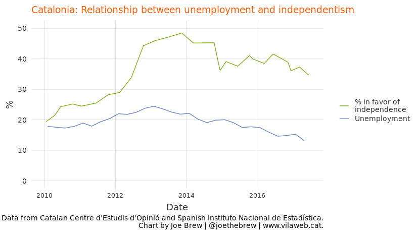
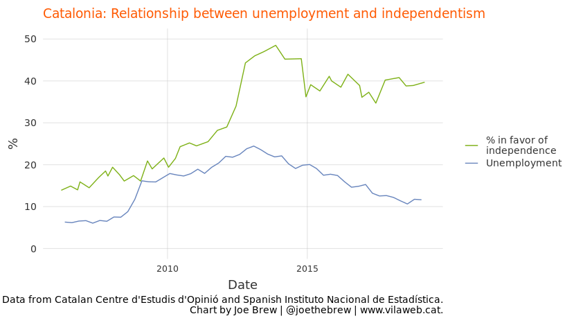
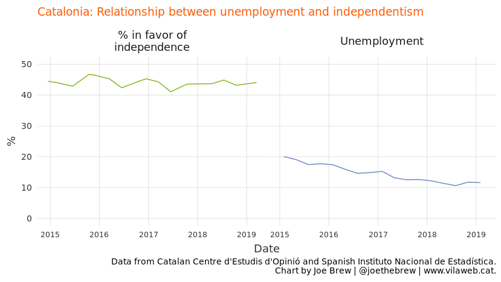
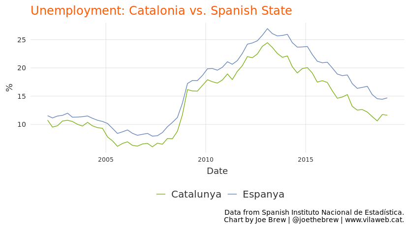
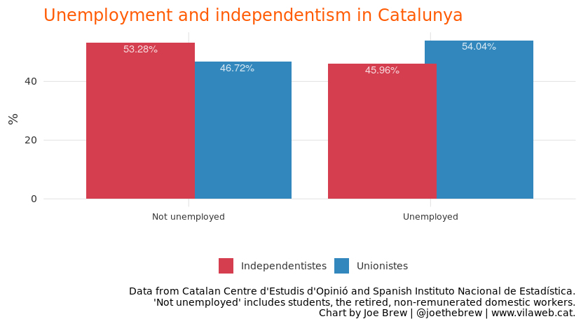
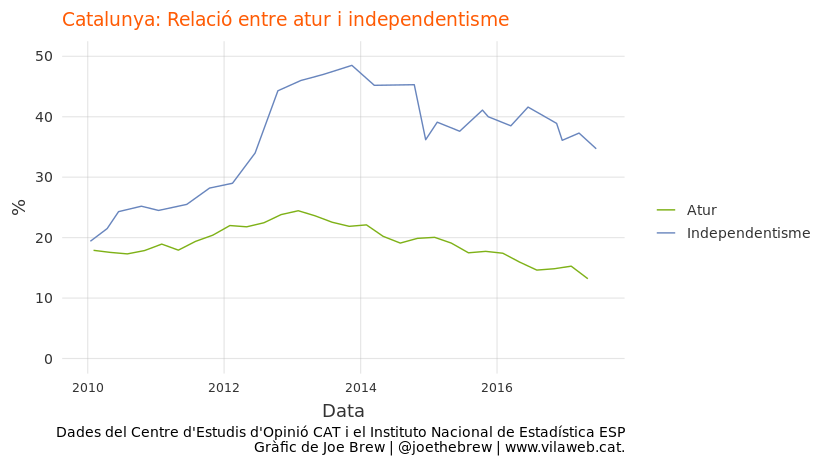
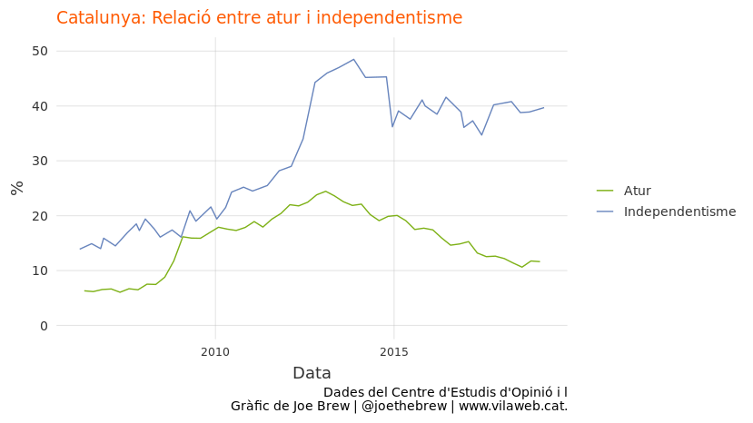
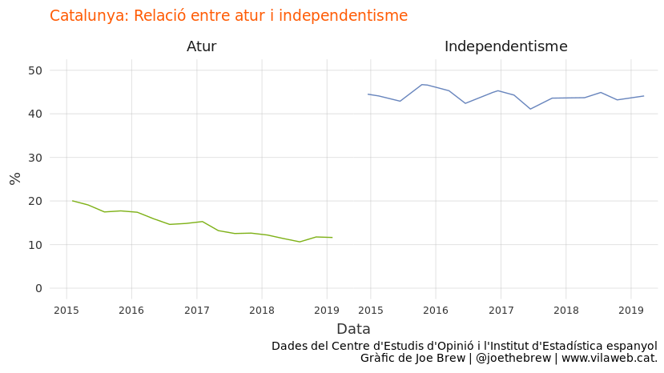
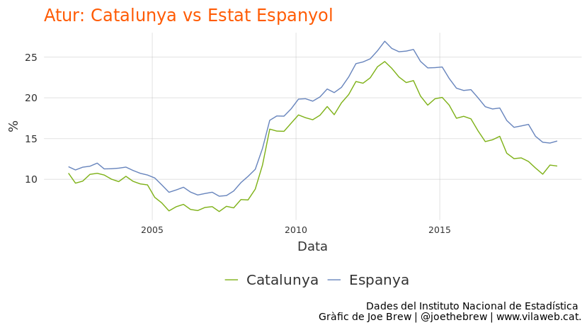
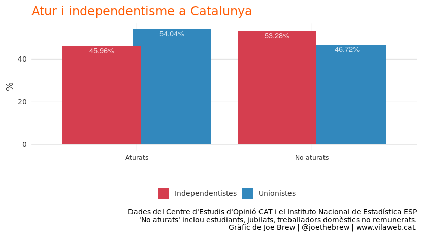

The economy and support for Catalan independence: a false association
================

The theory: a poor economy causes support for Catalan independence
==================================================================

There exists a popular theory that support for Catalan independence is simply a function of the economy. According to this theory, the birth of the independence "procés" coincided with the 2007 global financial crisis, and Catalans' trying to achieve an independent country are largely just frustrated financially.

This theory was popularized by a mid-2017 [Bloomberg article](https://www.bloomberg.com/news/articles/2017-08-09/catalans-think-twice-about-risks-of-rupture-as-good-life-returns) which stated that support for independence had gone because the unemployment rate had gone down. The article contained the below chart showing the association between the unemployment rate and independentism.

The chart was a hit, getting shared largely on social media in [some media sectors](https://cronicaglobal.elespanol.com/business/relacion-economia-independentismo_86045_102.html). The reason for its success was likely that it offered a simple, straightforward explanation for why so many Catalans wanted to leave Spain. The chart - and the accompanying article - offered a nice, clean, simple, non-political explanation for a political problem. Its popularlity was due not just to its simplicity, but also due to the implicit prognosis: since the cause of independentism was supposedly economic (and not political), it justified *not* addressing Catalan independentism politically.

Problems in the theory
======================

The theory that Catalan independentism is the result of a poor economy is nice. But it's also factually wrong.

Problem 1: The chart uses a misleading dual y-axis
--------------------------------------------------

Dual y-axis are almost universally dispised by specialists in data visualization. The reason is simple: placing two series on the same plotting space ("superimposition") with two different y-axes gives the chart-maker too much margin to modify (ie, manipulate) a correlation. Lisa Charlotte Rost recently wrote in a [blog post for Datawrapper](https://blog.datawrapper.de/dualaxis/) that data visualizations "should avoid dual axis charts altogether" since dual y-axes give the chart-maker too much "freedom to manipulate axes as they wish, which can lead to first visual impressions which are way off what the data actually says."

The fact that [leaders in the data visualization community](https://twitter.com/hadleywickham/status/711891650058932225?lang=en) are largely critical of dual y-axes is not just a matter of opinion. [Academic studies](https://www.lri.fr/~isenberg/publications/papers/Isenberg_2011_ASO.pdf) have shown that the objective understanding of information via charts is higher when dual charts are avoided. Dual y-axes should be avoided because they facilitate manipulation. In fact, dual y-axes are the fundamental component of all the charts on the [Spurious Correlations website](https://www.tylervigen.com/spurious-correlations), an example of absurd, non-correlated time series charted together to make it seem as if there is a strong correlation.

This is exactly what the Bloomberg chart did: suggest, via a misleading y-axis, that there was a correlation between unemployment and Catalan independentism. Superimposing the series on the same space gives the visual impression of a correlation which is less close in real life than as the chart appears.

Let's "fix" the Bloomberg chart by putting the two lines on the same y-scale.

One little tweak, and the correlation doesn't look so strong, right?

Problem 2: The correlation doesn't hold up over time
----------------------------------------------------

Nearly two years have passed since Bloomberg's article, enough time to tell the extent to which the theory holds up to the test of time. And the simple fact is that it does not.

The economy has continued to improve since the time of the Bloomberg article, and yet support for Catalan independence has not diminished.

What follows is a reproduction of the Bloomberg chart, but with more up to date unemployment and independentism data.

The unemployment rate in Catalonia has lowered steadily from 2015 through the beginning of 2019 (from 20% down to approximately 11%). During this same time, however, support for Catalan independence has remained steady over time.

Problem 3: Using the wrong variable to gauge support for independence
---------------------------------------------------------------------

The CEO BOP survey regularly asks Catalans about independence via two different questions. One question gives the participant four rsponse options: whether they think Catalonia should be a (i) region, (ii) autonomy, (iii) state within a federal Spain, or (iv) independent state; the other question simply asks the participant to pick one of two options: for Catalonia to be (i) independent or (ii) not.

Some Catalans answer the two questions in seemingly contradictory ways. On the one hand, in response to the 4-response question, they say that they want Catalonia to be a State within a federal Spain, and on the other hand they answer the 2-response question saying that they want Catalonia to be an independent state. These apparently nonsensical responses actually make a great deal of sense when one takes into account the fact that preferences are moderated by reality. Many Catalans (according to the 4-response question) would *prefer* Catalonia to remain part of a radically reformed Spain (a federal State) rather than to become independent, but given the low likelihood of this being possible, state (in the 2-response question) that they want Catalonia to be independent.

In any case the 2-response question is most useful sociologically, as it most closely reflects the likely result of a referendum. However, the Bloomberg chart used the less reliable 4-response question. Let's "fix" the Bloomberg chart again, this time using the 2-response question (only available December 2014).

In the above, two things are clear: (1) unemployment has declined steadily and (2) support independentism has remained steady.

Problem 4: What about the rest of the State?
--------------------------------------------

The theory - that high unemployment fuels the Catalan independence movement - ignores two simple, inconvenient truths: (i) that unemployment is higher in the rest of the Spanish State, and (ii) that independence movements in the rest ofthe Spanish State have not experienced significant growth. The below chart shows unemployment over the last 17 years in both Catalonia and the Spanish State as a whole.

Problem 5: The "ecological" fallacy
-----------------------------------

Even if the relationship between Catalan unemployment and Catalan independentism were more conceptually and temporally coherent, it would still fail to hold up as a "causal" factor. Why? Because for the theory to be sensical, unemployed Catalans would have to be more pro-independence than employed Catalans. And a simple analysis of the data shows the opposite: that unemployed Catalans are more *against* independence.

An analysis which aspires to uncover a supposed causal association by using only group (not individual) level data commits, in scientific terms, the "ecological fallacy". In other words, for an increase in unemployment to be a causal factor in the increased support for independentism at the societal level, then it would be necessary for unemployment to be associated with support for independence at the individual level. But the data show the opposite association.

Conclusion
----------

The data are clear: a poorly performing economy is clearly not the causal factor for the huge increase in support for independence among Catalans in the last decade. But the economic explanation remains a popular one. It is not entirely clear *why* the theory has remained so popular (despite data showing the opposite), but I suspect that the following three factors are at play:

1.  The theory provides a simple and intellectually satisfying explanation for a social phenomenon which is not simple.

2.  The theory implies that the Catalan political "problem" is economic in nature - not political - and therefore a political solution is not required.

3.  The theory fits nicely into the stereotype of Catalan independentism being driven by selfishness and a lack of solidarity.

If it's not the economy, then what is the *real cause* of the recent increase in support for Catalan independence? The causes are most likely multiple (not singular). And an examination of the trends over time show that the rapid increases in support for indepenence coincide more closely with *political* changes (such as the Spanish Constitutional Court's mid-2010 decision to rewrite the Catalan autonomy statute) than with *economic* changes. In other words, the "problem" is a *political* one, not an *economic* one.

The increase in support for independence falling the Constitutional Court's 2010 decision - and the steady support for independence suggests then - suggests to me that question of Catalan independence is first and foremost political in nature. And political problems require political solutions; after all, correct diagnosis is a prerequisite for a correct prognosis. The continued treatment of the Catalan independence crisis as something other than *political* (ie, an economic problem, or a criminal problem, or a social problem) only delays a *political* solution.

Catalan-language plots
======================

