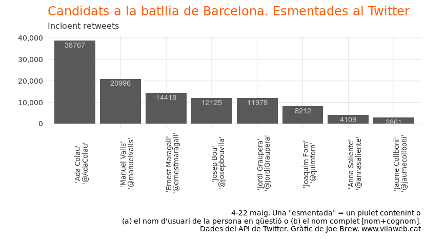
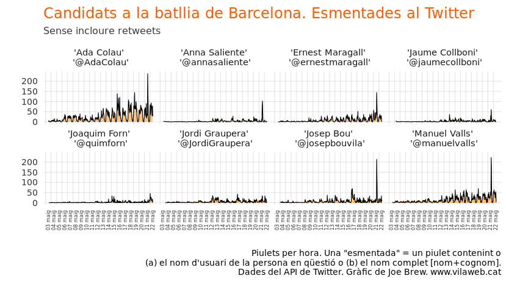
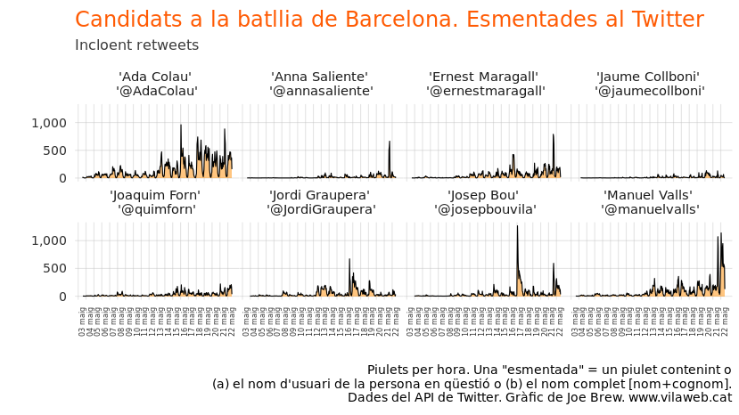
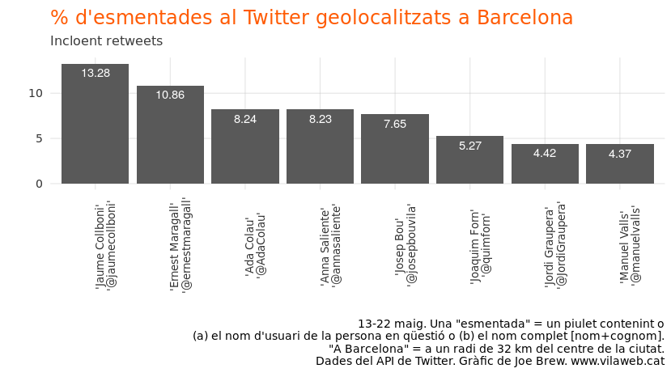
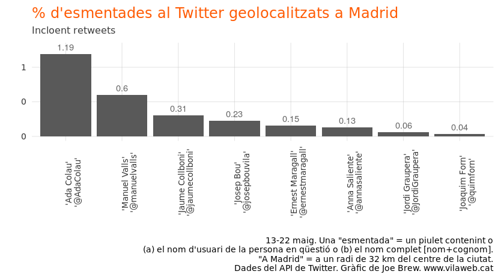
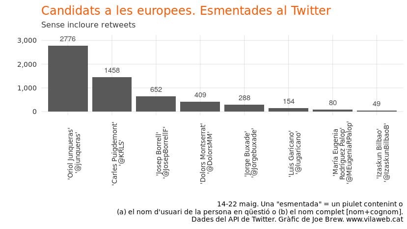
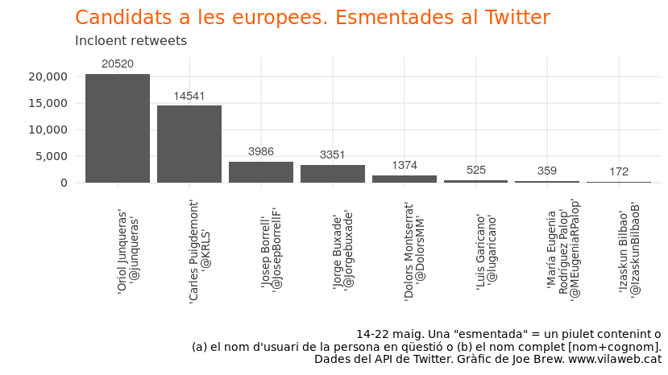
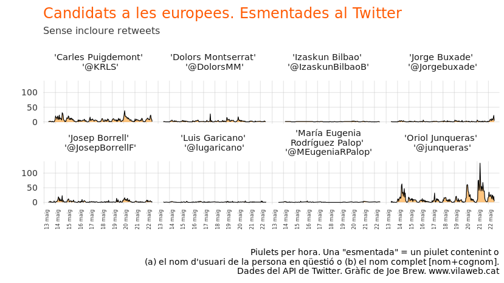
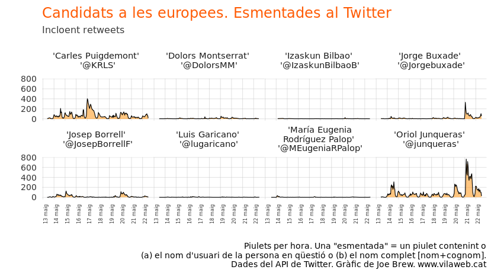

Que ens diu el Twitter sobre els candidats de les eleccions municipals i europees?
================

Introducció
===========

Twitter és la més "política" de les xarxes socials. Gairebé tots els candidats en fan servir, i la propoció política del contingut total és molt més alta que en altres xarxes. Twitter reflecteix la realitat política ([de manera imperfecta i sovint esbiaixada](https://www.vilaweb.cat/noticies/twitter-contra-vida-real-joe-brew/)) i també influeix en ella (per això les campanyes polítiques intenten, de maneres lícites i [a vegades qüestionables](https://www.theatlantic.com/technology/archive/2016/11/election-bots/506072/), aprofitar-s'en per fer "viral" els seus missatges.

Existeix una [línea d'anàlisi](https://www.researchgate.net/publication/313456510_Tweet_sentiment_as_proxy_for_political_campaign_momentum) [de dades](https://www.ncbi.nlm.nih.gov/pmc/articles/PMC5989214/) de Twitter per fer prediccions polítiques. És una "ciència" jove, les dades de Twitter són molt heterogènies al llarg del temps, i hi ha dubtes sobre la generalitzabilitat de les metodes (anàlisi de sentiments, proporcions de retweets vs. piulets originals, etc.) en geografies differents. O sigui, no es pot fer prediccions sòlides; per això, ni m'atraveixo.

Però amb les eleccions europees i municipals d'aqui uns díes, és interessant examinar, visualment, les tendències i els patrons dels piulets relacionats amb els principals candidats. No sugereixo que aquestes tendències prediguin res. Però sí que penso que poden reflectir coses que van més enllà de les enquestes: l'entusiasme, el pes en donar forma al debat polític, la rellevància, etc. Anem a les dades.

Mètodes
=======

Fent servir el API de Twitter, vaig descarregar tots els piulets on s'esmentava o (a) el nom sencer (nom i cognom) del candidat o (b) el nom d'usuari del candidat.

Resultats
=========

Eleccions municipals a Barcelona
--------------------------------

El gràfic següent mostra el nombre de piulets totals esmentant a cada candidat principal a la batllia de Barcelona del 4 fins al 22 de maig.

El següent gràfic és el mateix, però incloent retweets.

No sorprèn que Ada Colau sigui la candidata més esmentada (sent la battle actual). El que sorprèn és que Manuel Valls, que [les enquestes](https://beteve.cat/politica/enquestes-eleccions-municipals-2019-barcelona/) situen en quart o cinquè lloc, arribi al segon lloc en esmentades al Twitter, i que Jaume Collboni (tercer en enquestes) rebi tan poca atenció a la xarxa.

Si mirem el mateix al llarg del temps, és dificil treure cap patró general. L'únic destacable és la pica d'atenció al Josep Bou el día 17, quan el [Jordi Borràs va publicar un document evidenciant que Bou havia militat al partit ultra "Fuerza Nueva"](https://www.vilaweb.cat/noticies/josep-bou-fuerza-nueva-inscripcio/).

Examinant el mateix, però amb retweets, poc és molt destacable, menys la tendència general (de tots el candidats) de rebre més esmentades quan més a prop de la data de les eleccions.

Pocs piulets fan servir la funcionalitat de "geocoding" de Twitter, però és interessant veure quins l'utilitzan i quins no. El gràfic següent mostra el percentatge de tots el piulets del darrers 10 dies esmenant els candidats que son geolocalitzats a Barcelona.

I el següent mostra el percentatge de piulets esmentant els candidats que són geolocalitzats a Madrid.

Eleccions europees
==================

El gràfic següent mostra el nombre de piulets totals esmentant a cada candidat principal a les eleccions europees del 14 fins al 22 de maig.

El següent gràfic és el mateix, però incloent retweets.

En els dos gràfics anteriors, es nota que els principals candidats sobiranistes (Junqueras i Puigdemont) són molt més esmentats que els seus rivals polítics. Notablement, Oriol Junqueras (que havia tingut un impacte en les xarxes bastant reduïda des de la seva detenció) sembla haver recuperat el protagonisme.

Mirem les esmentades al llarg del temps:

És destacable que Junqueras ha rebut tantes esmentades els darrers díes. Una part d'això es deu, molt probablement, a la seva apareixença física al Congrés espanyol. A diferència de fa uns mesos (quan vaig escriure sobre [l'efecte "invisibilitzador" de la presó](https://www.vilaweb.cat/noticies/invisibilitzacio-presos-politics-joe-brew/)) la presència i visibilitat de Junqueras (al judici i al Congrés) sembla haver afectat l'atenció que rep a les xarxes. Però la freqüencia alta d'esmentades de Junqueras no només coincideix amb els dies que va anar al Congrés, sinó també amb els dies anteriors.

El següent gràfic és el mateix, però amb retweets.

Conclusió
=========

Cap. Aneu a votar. I com va dir el gran Nelson Mandela, "May your choices reflect your hopes, not your fears" (que les teves decisions reflecteixin les teves esperances, no les teves pors).
