No, Mr. Sánchez. Brexit is not like Catalan independence.
================

*The data on Brexit and Catalan independence show that the two movements have almost nothing in common*

In a [recent interview](https://amp.theguardian.com/world/2019/apr/03/spanish-pm-pedro-sanchez-brexit-catalan-independence-bid-both-based-on-lies) with major European media outlets, Spanish Prime Minister Pedro Sánchez compared Brexit to the independence movement in Catalonia. This is not the first time Mr. Sánchez has made the comparison. Both [he](https://www.spainenglish.com/2018/12/12/sanchez-catalan-independence-brexit/) and [members of his government](https://thediplomatinspain.com/en/2019/01/brexit-difficulties-show-the-independence-of-catalonia-is-impossible/) make the comparison frequently.

But is there any truth in this comparison? Are Catalans wanting to leave Spain similar to Brits wanting to leave the EU? Do they share similar social or political characteristics? Are they motivated by similar root causes?

Fortunately, there are publicly available data on political attitudes and beliefs which can help us answer these questions. Let's look at data in the following areas to see if Mr. Sánchez is right:

1.  Education
2.  Immigration
3.  Authoritarianism
4.  Welfare
5.  Age
6.  Income

Education
=========

**UK:** In the UK, voting in favor of Brexit was closely correlated with low levels of education. Brits with a university degree were largely opposed to Brexit.

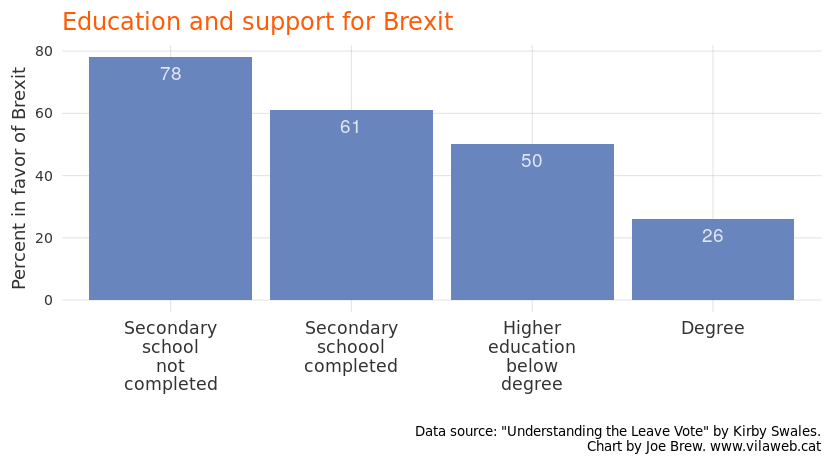

**Catalonia:** In Catalonia, we see the opposite pattern. Those with lower education are most in favor of remaining in Spain, whereas those with high educational attainment are most in favor of independence.

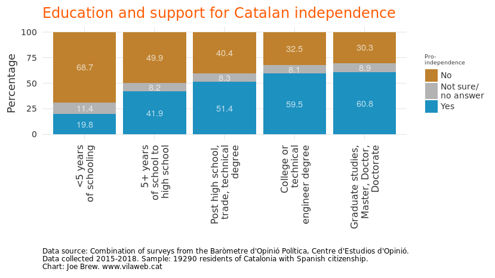

Immigration
===========

**UK:** Those who voted in favor of leaving the UK were significantly more likely than those who voted to remain to select immigration as the main motivation for their vote (47% of leave voters versus 16% of remain voters). The anti-immigrant vote was largely concentrated in favor of Brexit. 66% of voters thought Brexit would lower immigration. In other words, Brexit was largely a vote against immigration.

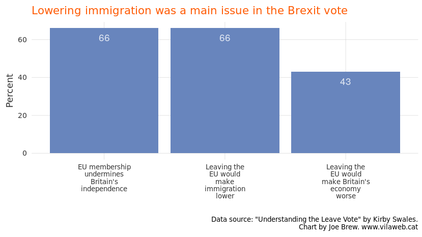

**Catalonia:** Are pro-independence Catalans, like pro-Brexit Britons, opposed to immigration? No - just the opposite. Pro-independence Catalans, unlike pro-Brexit Brits, are pro-immigration. A majority (61%) of pro-independence Catalans "strongly disagree" with the xenophobic phrase that "with so much immigration, it doesn't feel like home anymore". Among anti-independence Catalans, only 49% reject the phrase. Whereas pro-Brexit voters were motivated by anti-immigrant sentiment, pro-independence Catalans are quantifiably more pro-immigrant than their pro-Spain counterparts.

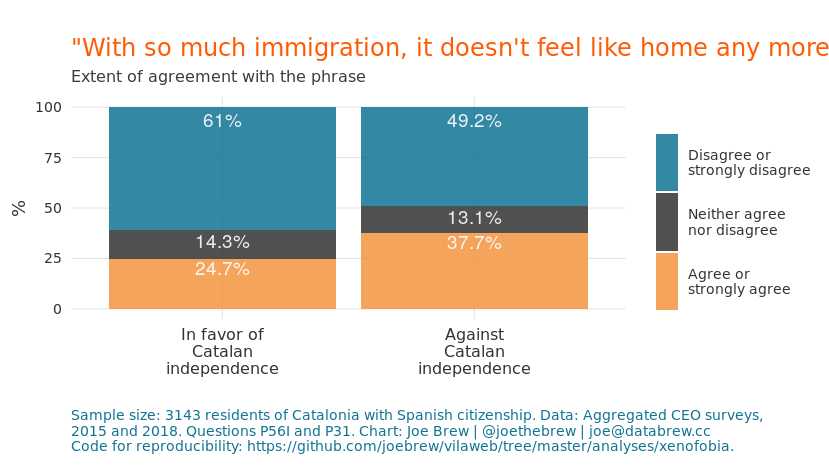

Authoritarianism
================

**UK:** In the UK Brexit vote, “leave” voters exhibited greater authoritarian attitudes than their “remain” counterparts. The pro-Brexit vote was 66% among those who were identified as authoritarian, only 18% among those with libertarian attitudes.

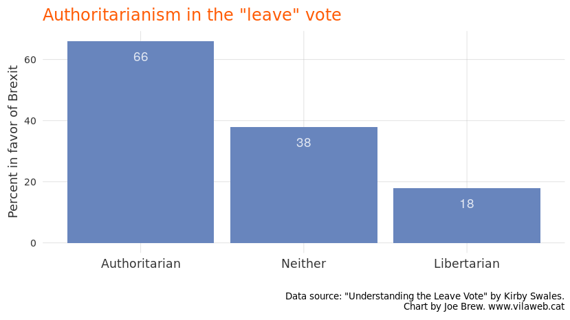

**Catalonia:** Repeated polling in Catalonia shows the opposite. Whereas pro-Brexit voters had more authoritarian tendencies than anti-Brexit voters, pro-independence voters exhibit significantly less authoritarian political beliefs than pro-Spain voters. The below two charts show agreement with authoritarian statements regarding obedience and teaching authority in schools. Pro-independence Catalans show far less authoritarianism than their anti-independence counterparts.

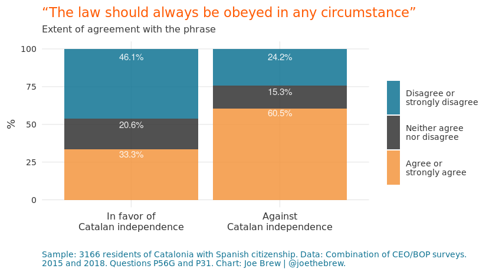

Welfare
=======

**UK:** The pro-Brexit vote was characterized by strong anti-welfare attitudes (ie, brexiteers were largely in favor of reducing State aid to fight inequality). Among anti-welfare voters, 75% were pro-Brexit, whereas only 30% of libertarian Brits voted in favor of Brexit.

**Catalonia:** In the case of welfare, again, Catalan independence voters are opposite to Brexit voters. Whereas those in favor of Brexit largely opposed welfare, those in favor of Catalonia are largely in favor of it. Voters of pro-independence parties are slightly *more* likely to agree that the State should take measures to fight income inequality (below chart).

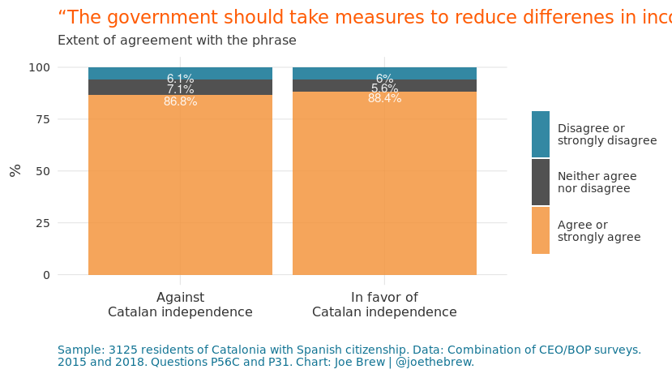

And, relative to anti-independence Catalans, those who are pro-independence are more likely to disagree that taxes should be lowered so as to cut social services (below chart).

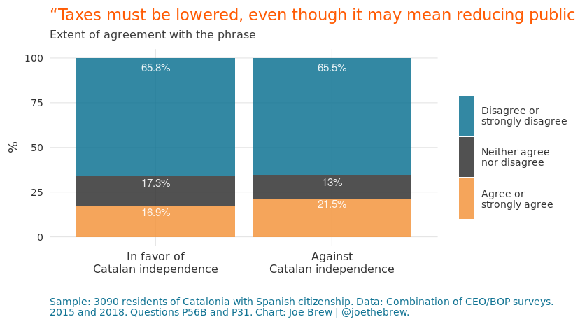

Age
===

**UK:** The Brexit vote was largely driven by the old. Young voters opposed Brexit, and older voters were in favor of it.

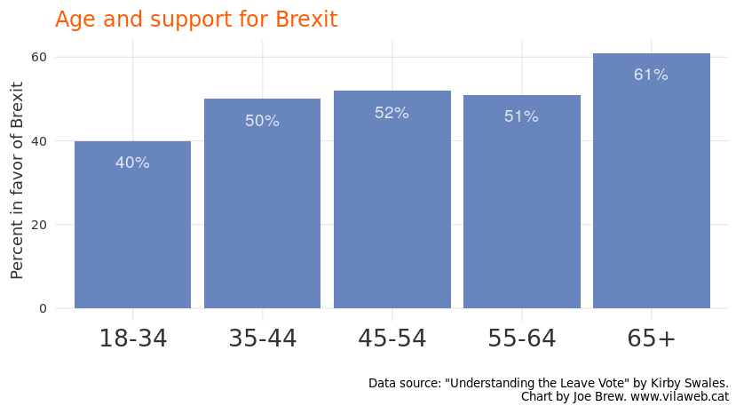

**Catalonia:** When it comes to age, the Brexit-Catalonia comparison again falls apart. Whereas the old were more in favor of Brexit, in Catalonia the old are more in favor of union with Spain. Like anti-Brexit Brits, pro-independence Catalans are largely young.

    Error: $ operator is invalid for atomic vectors

Income
======

**UK:** One of the driving factors of the pro-Brexit vote was low income. Those with lower incomes were significantly more likely to vote in favor of Brexit than those with higher incomes.

**Catalonia:** Again, in Catalonia, the opposite pattern emerges. Those with lower incomes are more likely to be in favor of continued union with Spain; those with higher incomes are more pro-independence.

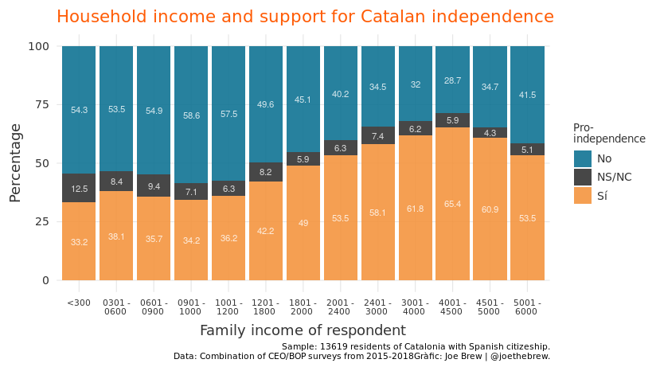

Conclusion
==========

The Spanish Government’s repeated attempts to draw parallels between Brexit and the Catalan independence movement do not stand up to basic scrutiny. The data show that supporters of the two movements share almost nothing in common. In regards to both demographic characteristics (education, age and wealth), as well as attitudes (on immigration, authoritarianism and welfare), Catalans in favor of independence resemble Brits opposed to Brexit, not those in favor of it.

Why, then, does the Spanish government continue to insist on the Brexit-Catalonia comparison? Perhaps it’s because the more obvious, and factually correct, comparison would be between Catalonia and Scotland. Unlike those who voted in favor of Brexit, [those who voted in favor of Scottish independence](https://www.bbc.com/news/uk-scotland-glasgow-west-34283948) were (i) younger, (ii) better educated, and (iii) less religious than those who voted against independence. Just like in Catalonia.

Perhaps the reason that the Spanish Government constantly compares Catalan independence with Brexit, instead of the more obvious comparison with Scotland, is that the comparison with Scotland provokes the inevitable question: why not settle the Catalonia-Spain issue like Scotland and the UK did? Why not allow, like the UK did for Scotland, a mutually agreed-upon, binding referendum, voted on by all Catalans?

The Spanish Government’s response so far to this obvious question has been muted or relied on a strange form of legalistic circular thinking (we don’t want a referendum because it’s illegal, and we won’t legalize it because we don’t want it). Though the anti-referendum arguments do well in Spanish electoral politics, they aren’t very effective outside of Spain. This, perhaps more than any other reason, is why Spain wants to keep the spotlight on the failures of a chaotic Brexit, rather than on the successes of the orderly Scottish independence referendum.

In his criticism of Brexit and Catalan independence, Pedro Sánchez said that 'engaging in campaigns or political projects based on lies eventually leads societies down a blind alley'. If Mr. Sánchez truly seeks to engage with the truth, he should reflect on the data on Catalan independence, and put a stop to the frequent and factually misleading comparisons with Brexit. If there are legitimate reasons for denying Catalans the right of self-determination, a right which was granted to Scots, Mr. Sánchez should highlight those legitimate reasons, and explain why Catalonia is different from Scotland. But his current approach of campaigning against Catalan independence based on false information is not only politically irresponsible; it leads societies, as Mr. Sánchez himself has said, "down a blind alley".

Catalan-language plots
======================

### Education

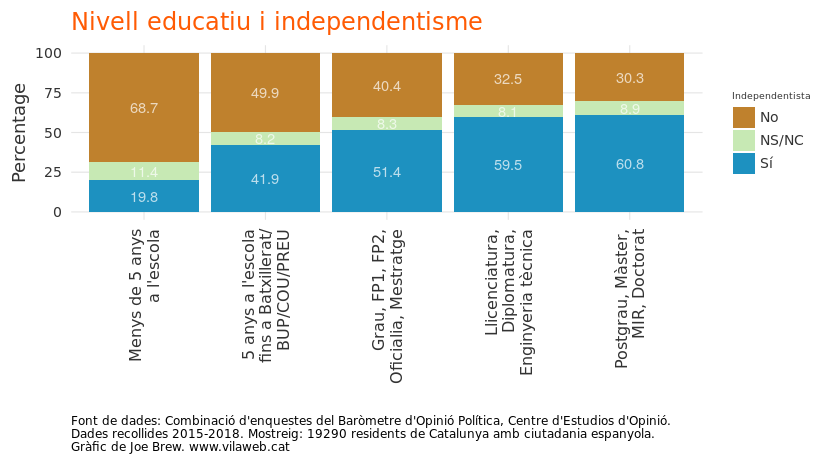

### Immigration

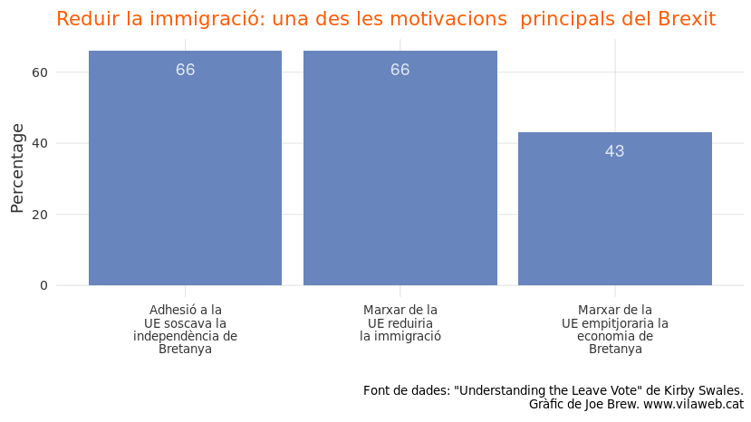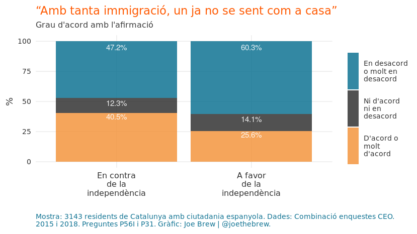

### Authoritarianism

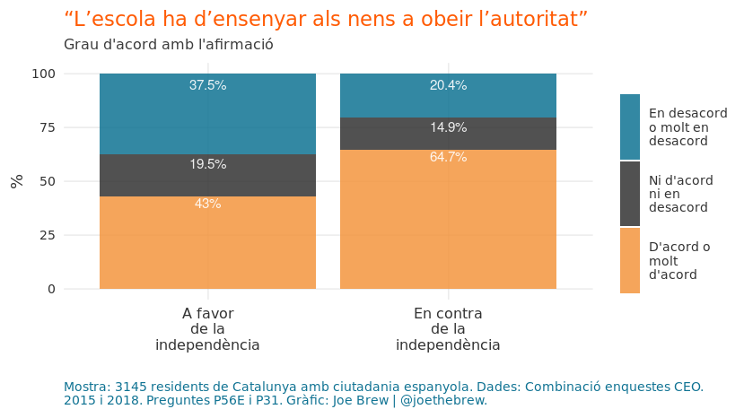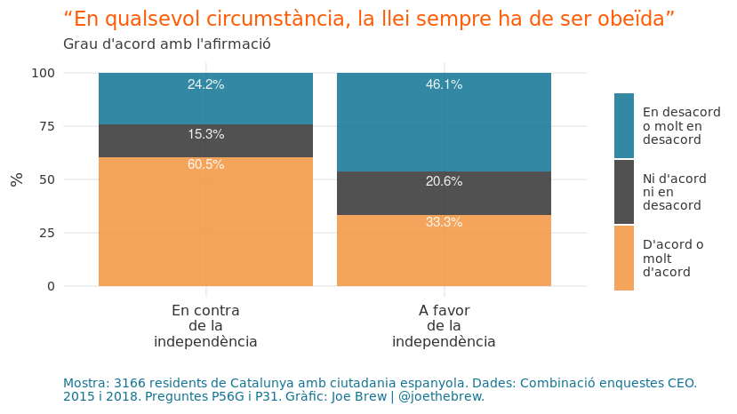

Welfare
-------

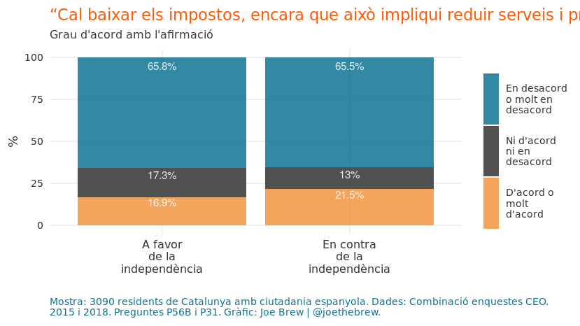

Age
---

    Error: $ operator is invalid for atomic vectors

Income
------

