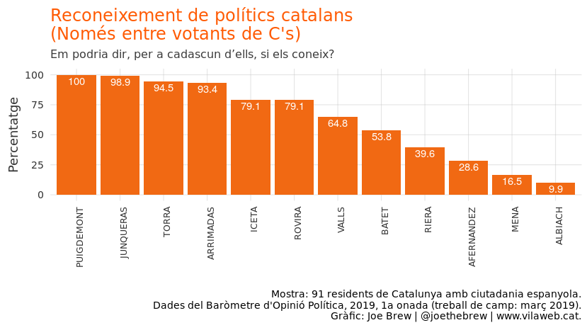
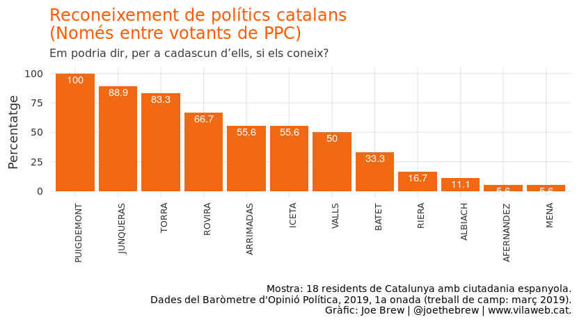
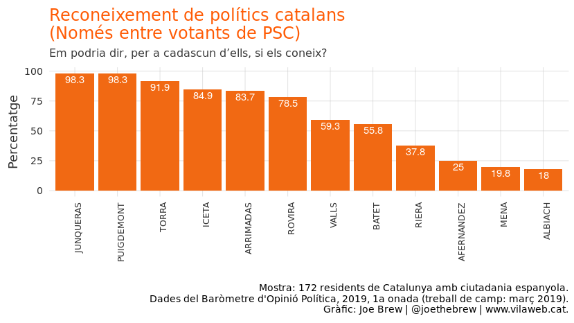
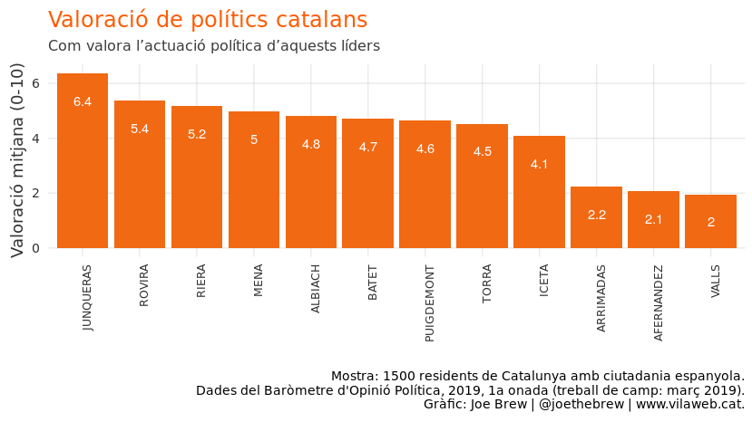
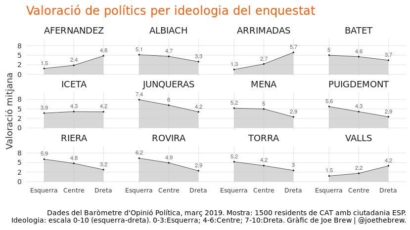
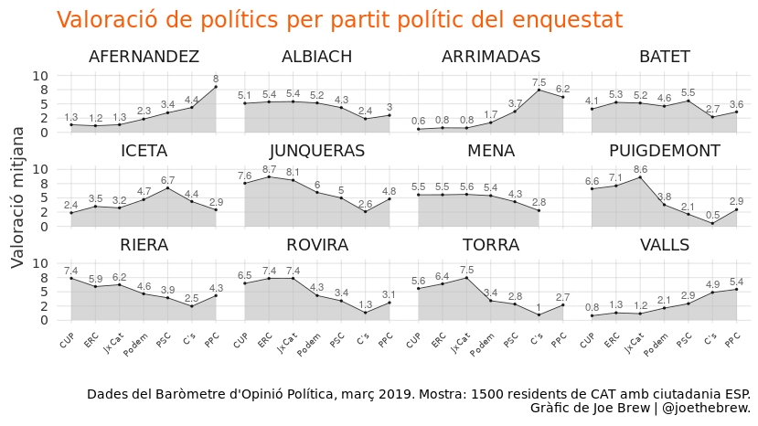
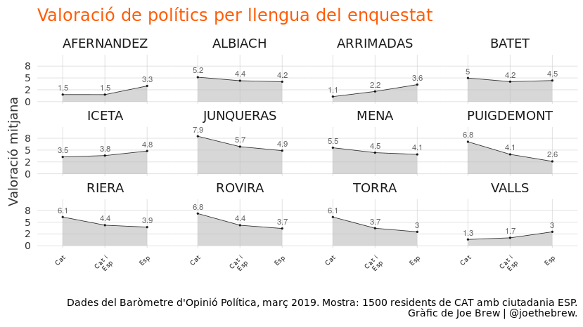

Què pensen els catalans dels seus polítics i les seves institucions?
================

Introducció
===========

Mètodes
=======

Resultats
=========

Reconeixement
-------------

Reconeixement per partit
------------------------

### C's

### Catalunya en Comú Podem

### La CUP

### ERC

### Junts per Catalunya

### PPC

### PSC

Valoració
=========

Valoració per ideologia política del enquestat
----------------------------------------------

Valoració de polítics per independentisme del enquestat
-------------------------------------------------------

Valoració de polítics per partit polític del enquestat
------------------------------------------------------

Valoració de polítics per llengua del enquestat
-----------------------------------------------

