# What kind of crisis?

There is a crisis in Catalonia - that much is clear. But knowing what
*kind* of crisis Catalonia is going through depends on who you ask. To
many Catalans, it’s a political crisis *between Catalonia and Spain*, in
which the [pro-referendum majority in
Catalonia](https://www.vilaweb.cat/noticies/les-dades-son-clares-el-consens-per-a-la-solucio-ja-existeix-entre-els-catalans/)
has been blocked by the anti-referendum majority in Spain from carrying
out its political project. To Spanish PM Pedro Sánchez, it’s a crisis of
“convivencia” (coexistence) *between Catalans thesmelves*, in which the
half in favor of independence has sought to “impose” its political
project on the half opposed. And the Spanish justice system is treating
it as crisis of violent crime, having imprisoned most of the former
members of the Catalan government on charges of “rebellion”.

But what is the true nature of the crisis in Catalonia? Beyond the
rhetoric of politicians, why is Catalonia going through major political
turmoil whereas other areas - Andalucia, Flanders, Texas, Brittany - are
not.

Current events in Catalonia reflect a *crisis of legitimacy* more than
anything else. Both the Head of State who rules over Catalonia
symbolically, and the Spanish Constitution which rules over Catalonia
juridically, receive the support of fewer than half of Catalans. The
“Statute of Autonomy”, the legal contract which governs the
relationship between Catalonia and Spain, is not the same version as the
one approved by Catalans via a popular vote in 2006 (that version had
parts stricken from it by Spanish Courts). And even the transition from
fascism to democracy in the late 1970s, a point of pride for most
Spaniards, is seen by most Catalans as having been poorly carried out.

Democratic legitimacy stems not just from the *existence* of a set of
laws, but also from a general *acceptance* of the system by which the
laws are generated. For example, in the USA, though nearly half of
voters are unsatisfied with the outcome of any specific presidential
election, significant majorities in *every* one of the 50 States approve
of the system by which the voting took place. The reason democracies can
be considered more “legitimate” than autocracies is not that the former
are governed by rules and the latter aren’t (in fact, both have rules,
and autocracies can very much fit the definition of “estado de derecho”
- “rule of law”); rather, it’s that the processes and rules which govern
society are perceived and accepted by the population as appropriate and
fair (aka “legitimate”).

The political framework governing Catalonia does not receive enough
popular support among Catalans to ensure political stability. This much
is obvious from simply observing the last few years of Catalan and
Spanish politics (a contested referendum in the first case, 4 national
elections in less than 4 years in the latter). In other words, the
Catalan crisis is a crisis of “legitimacy”. This is not simply an
opinion: it’s a fact backed up by data on the subject.

Let’s explore those data. Specifically, let’s examine survey data
regarding how Catalans feel about Spain’s transition to democracy, the
Spanish Constitution, the possibility of favorable negotiations with
Spain, and the principle of self-determination. Here we go.

## The transition to democracy

Following the death of dictator Francisco Franco in 1975, Spain began
it’s multi-year [transition to
democracy](https://en.wikipedia.org/wiki/Spanish_transition_to_democracy)
(known simply as “La Transición” in Spanish). This involved opening up
to free elections, replacing fascist institutions with nominally
democratic ones, allowing for political parties, etc. The “Transition”
was applauded by much of Europe and the United States, but was not
endorsed by all. Controversially, it kept in place the Franco-appointed
Bourbon monarchy, and involved a controversial “Amnesty” law which meant
that crimes committed by the Francoist regime would go uninvestigated
and unpunished.

In 2018, the CIS (the Spanish national Centro de Investigaciones
Sociológicas) asked 3.000 Spaniards whether they thought the transition
was a “source of pride”. For most (more than 80% in non-Catalonia
Spain), it is. But in Catalonia, fewer than half consider the Transition
to be a source of pride.

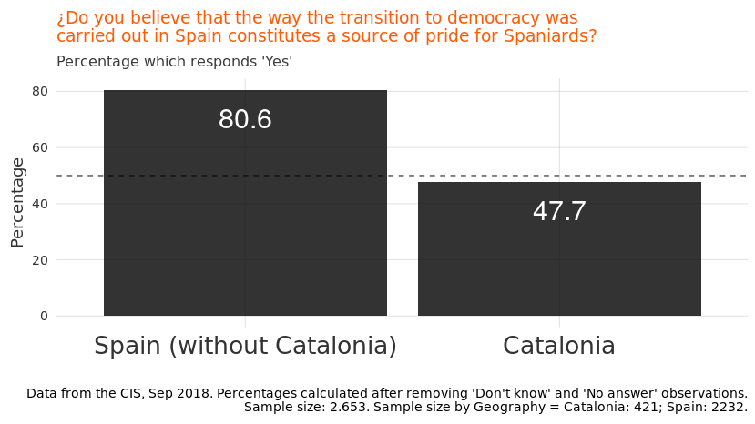<!-- -->

## Endorsement of the Spanish Constitution

It’s not entirely clear why the rates of “pride” in the transition
differ so drastically between Catalans and Spaniards. But it likely has
at least something to do with the most tangible product of that
transition: the Constitution.

The 1978 Constitution was approved in referendum by a vast majority of
Spaniards (including Catalans). At the time of the referendum, the
choice was rather stark (“Yes” meaning a transition to democracy, “No”
meaning political uncertainty with a non-negligible chance of continued
fascist rule). But 40 years later, the percentage of Catalans who are
satisfied (22.6%) is less than half of the satisfaction rate among
Spaniards from the rest of the State (51.8%). Most Catalans (52.1%) are
dissatisfied with the Spanish Constitution.

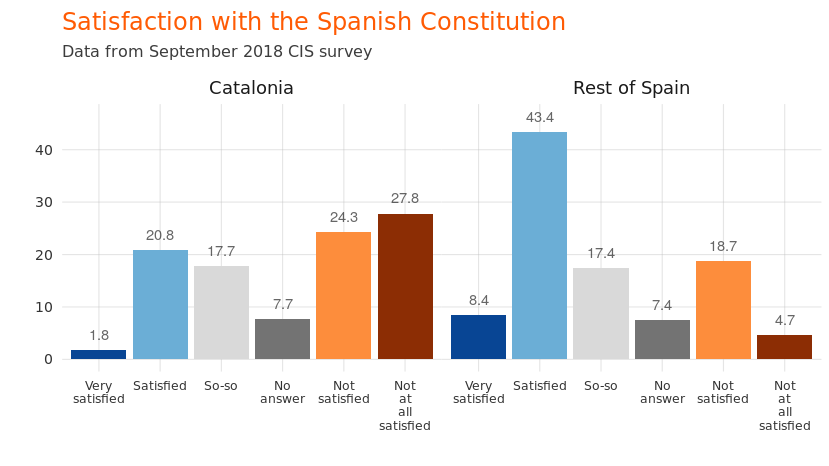<!-- -->

When it comes to the Constitution, Catalonia is not the only part of the
Spanish State with higher levels of dissatisfaction than satisfaction.
The Basque Country and Navarra are similarly dissatisfied with the
State’s *Magna Carta* (note, these regions - like Catalonia - are
historical nations with their own language).

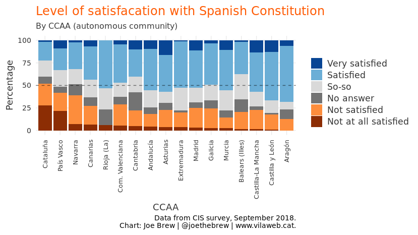<!-- -->

In fact, when asked if they would vote for the Catalan Constitution if
there were a referendum on it now, a large majority of Catalans say that
they would not. Only 17.4% say that they would vote in favor of the
current Constitution.

<!-- -->

## Nostalgia for Franco

It’s not only noteworthy that so few Catalans would vote in favor of the
current Constitution. It’s also interesting to look at *which* Catalans
are for and against the Constitution. The below chart shows how Catalans
would vote if there were a referendum on the 1978 Constitution as a
function of their views on Franco.

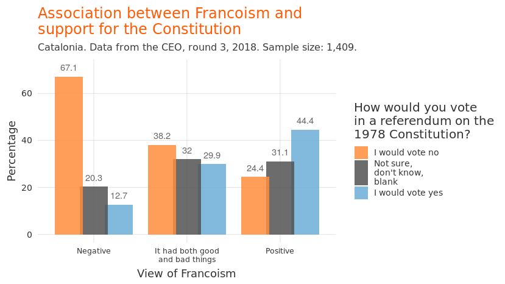<!-- -->

Catalans who think that the Franco period was negative for Catalonia
(the 3 left-most bars) would vote overwhelmingly against the 1978
Constitution (67% vs 12%). Those with mixed views on Franco (the three
middle bars, who say the Franco period had both good and bad aspects)
would also vote against the Constitution (38 vs 30%), albeit not by so
much. The only group where there is a clear pro-Constitution majority is
among those Catalans who say that the Franco period was “positive” for
Catalonia - in this group, “Yes” to the Constitution would win by a
margin of almost two to one.

## The Left-Right divide and the Constitution

Part of the reason pro-Franco attitudes are so entwined with support for
the Spanish Constitution in Catalonia is because the Spanish
Constitution is perceived as partisan by Catalans. In other words,
support for the Constitution is far greater among people who identify as
being on the “right” or “far right” of the political spectrum than among
those who identify as being on the left:

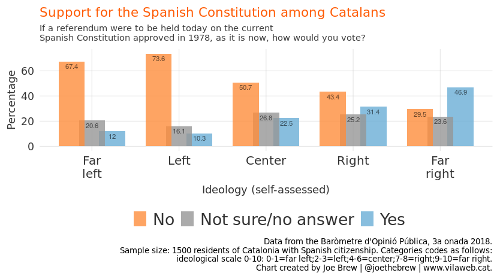<!-- -->

Whereas only 10-12% of leftist Catalans would vote in favor of the 1978
Constitution if there were a referendum held on it today, support
doubles in the political center, triples in the political right, and
quadruples in the political far-right. In other words, the more to the
right, the more support for the Constitution.

The left-right association with support for the Constitution is not
unique to Catalonia. In the rest of the Spanish State, satisfication
with the Constitution is far greater among those who self-classify on
the political “right” than the “left”. The below chart shows
satisfaction with the Spanish Constitution as a function of political
ideology, among people from Spain (not including Catalonia):

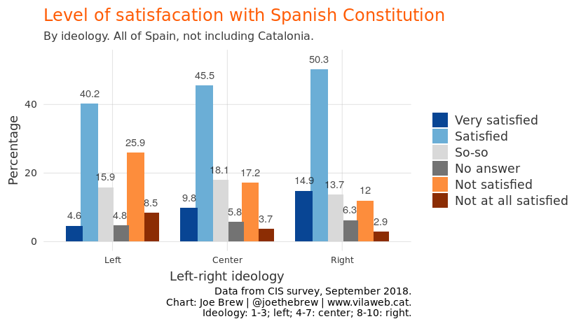<!-- -->

Support for the Constitution in Spain is generally higher than in
Catalonia, but the satisfaction pattern follows the same curve:
Dissatisfaction with the Constitution is high among those on the left
(34.4%), and low among those on the right (14.9%).

## The Left-Right divide and the King

Like with the Constitution, support for the Spanish King is also closely
associated with political ideology among Catalans. The below chart shows
Catalans approval rating for King Felipe de Bourbon (and his
predecessor, Juan Carlos) over the last 5 years.

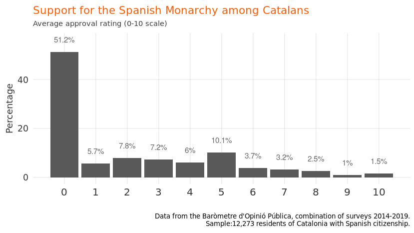<!-- -->

Greater than half of Catalans give the Monarchy a score 0 out of 10.
Only around 1 in 10 give a passing grade (greater than 5).

By ideology, it’s clear where most of the Monarchy’s support comes from.
The average approval rating for the Monarchy (“grau de confiança”) among
the far left is approximately 1 out of 10. But approval is 4 times
higher on the right, and even higher on the far-right:

<!-- -->

## Loss of faith in negotiation

We have established that neither the Spanish Constitution, nor the
Insitution it created (the Spanish Monarchy) receive significant support
in Catalonia. And much of the (relatively low) support for the Monarchy
and Constitution stem from the political right and those who see the
Franco period as “positive”. So, if the Monarchy and Constitution are
both unpopular and politicized, why don’t Catalans work out a deal with
Spaniards to change, reform, depoliticize, or remove them? Why, in 2017,
did Catalans “unilaterally” (ie, without permission from Madrid) carry
out an independence referendum?

The answer is fairly clear: they’ve given up hope that a mutually agreed
upon deal can be worked out.

A large majority of Catalans want a self-determination referendum. Only
19% of Catalans say that Catalonia does not have a right to one:

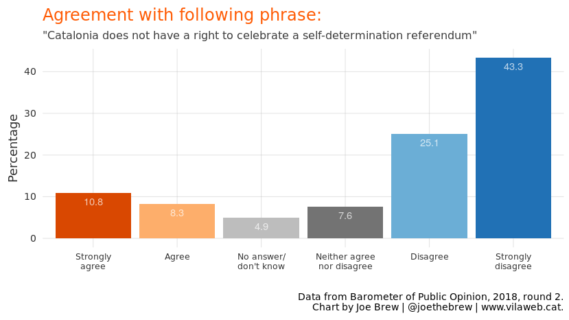<!-- -->

But on the question of a self-determination referendum, the position of
the current Spanish President Pedro Sánchez is identical to that of the
previous President, Mariano Rajoy: “Never”. The refusal to even discuss
self-determination has lead most Catalans to believe that it is unlikely
Spain will ever offer a satisfactory agreement to Catalonia. The below
chart shows how the percentage of Catalans who believe that a
satisfactory offer from the Spanish Government is not probable has grown
from two thirds to three fourths over the last few years:

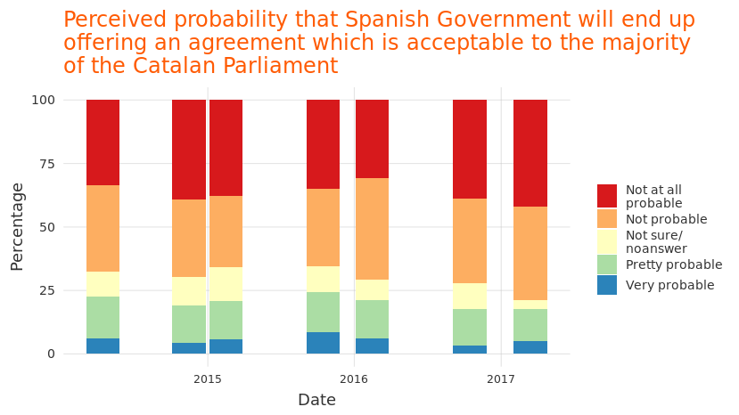<!-- -->

As of the most recent time this question was asked (2017), only 2 in 10
Catalans believed it was probable that Spain would offer an acceptable
political solution to Catalonia. If you were wondering why Catalans
acted “unilaterally”, that’s your answer.

Why are Catalans so sceptical that Spain is capable of making an offer
which will be politically acceptable to them? Two reasons. First, the
Spanish Government has made very clear that self-determination is off
the table, and will not even discuss the issue. Second, outside of
Catalonia, any Spanish politician who proposes the possibility of
independence (or even more autonomy) is committing political suicide.
Why? Because the percentage of Spaniards who are satisfied with the
status quo, or want less autonomy for regions, is a huge majority. The
below chart shows these differences in preferences for territorial
organization:

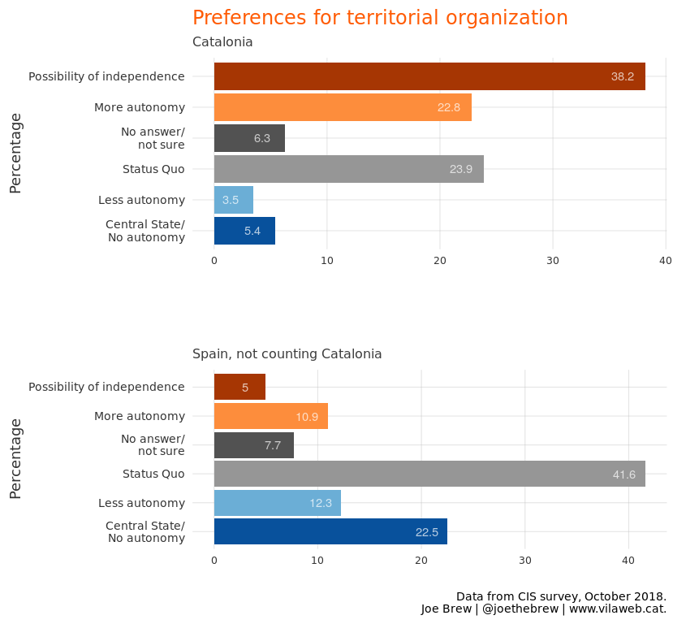<!-- -->

# Conclusion

The political deadlock in Catalonia is not caused by “criminal”
politicians. Nor is the cause of the crisis the economy, a lack of
“convivencia” (coexistence), nationalism, populism, a “coup d’etat”, a
“rebellion”, or any of the other semi-absurd, simplistic, explanations.
The data make very clear what the actual three underlying issues are:

1.  A majority of Catalans want to exercise their right to
    self-determination  
2.  A majority of Spaniards do not want permit them to exercise that
    right  
3.  The institutions and processes by which this conflict could be
    resolved “internally” are not perceived as sufficiently legitimate
    by one side to be effective for both sides

It’s this third point which leads me to describe the Catalonia-Spain
political crisis as one of *legitimacy*. One side (Catalonia) wants
something (self-determination) that the other (Spain) won’t agree to.
And the current framework for deciding how to move forward (the
Constitution) is not accepted by a large majority of one side. And the
supposed “aribtrator” for these kinds of conflicts, the Spanish King, is
also not accepted by a large majority of one side.

If Catalans and Spaniards disagree about territorial organization, the
legitimacy of the Constitution, and the legitimacy of the Monarchy, how
can the conflict be resolved? The current approach of the Spanish State
(insisting that Catalan politicians *disobey* their voters and instead
obey Spanish law) is obviously unsustainable and is already generating
significant political instability for Spain as a whole. For both the
good of Spain and Catalonia, other approaches have to be explored.

Ultimately, what the Spain-Catalonia crisis needs is an *injection of
legitimacy*, a process which is perceived as fair and satisfactory to
both sides. This injection of legitimacy should come in the form of an
external, transparent, binding process, with a mutually accepted
arbitrator, one whose legitimacy is accepted by *both* sides. The
European Union meets this definition and should actively pursue a role
as mediator. If the EU continues to ignore the conflict, or downplay it
as an “internal issue”, the likelihood of further “unilateralism” (both
in the form of Spain taking direct rule over Catalonia, or Catalonia
again voting without Spain’s permission) is increasingly likely.

# Catalan-language charts

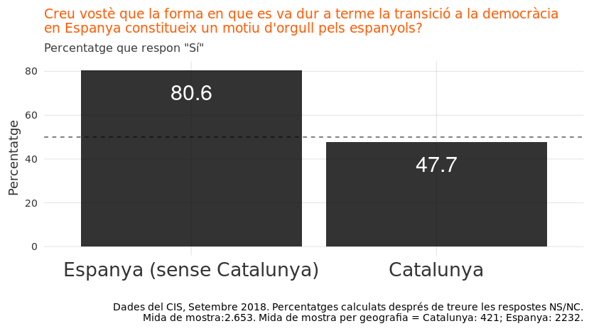<!-- -->

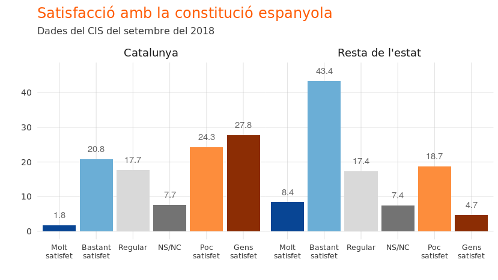<!-- -->

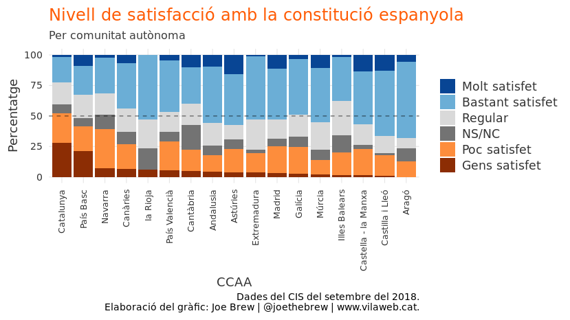<!-- -->

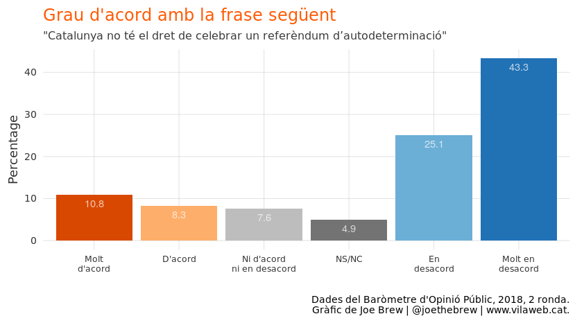<!-- -->

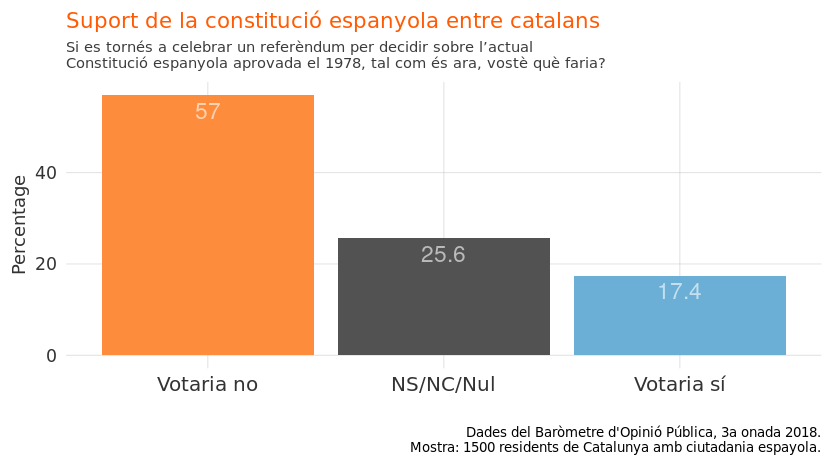<!-- -->

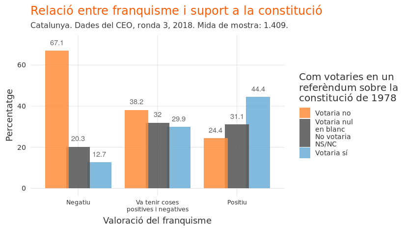<!-- -->

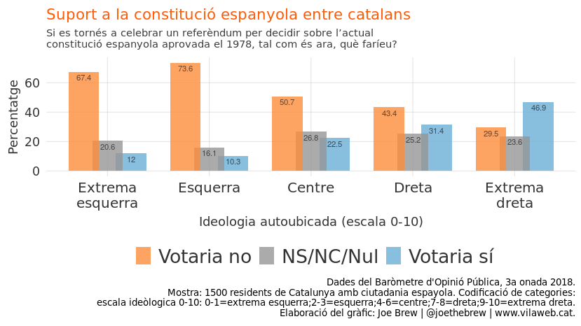<!-- -->

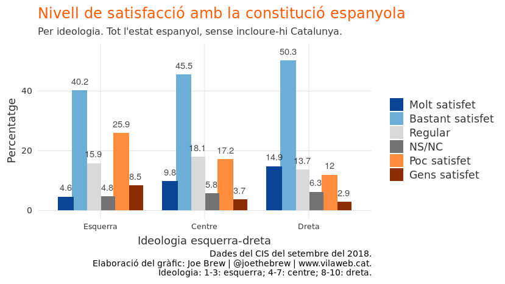<!-- -->

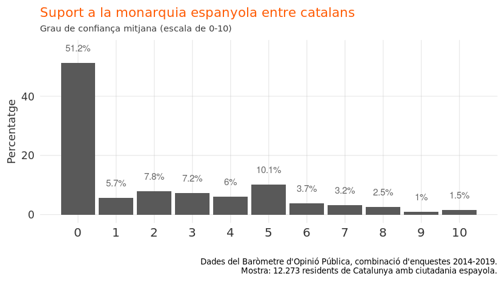<!-- -->

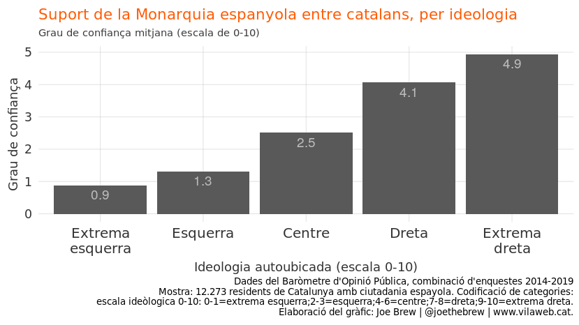<!-- -->

<!-- -->

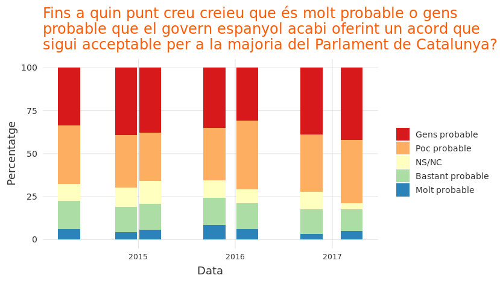<!-- -->

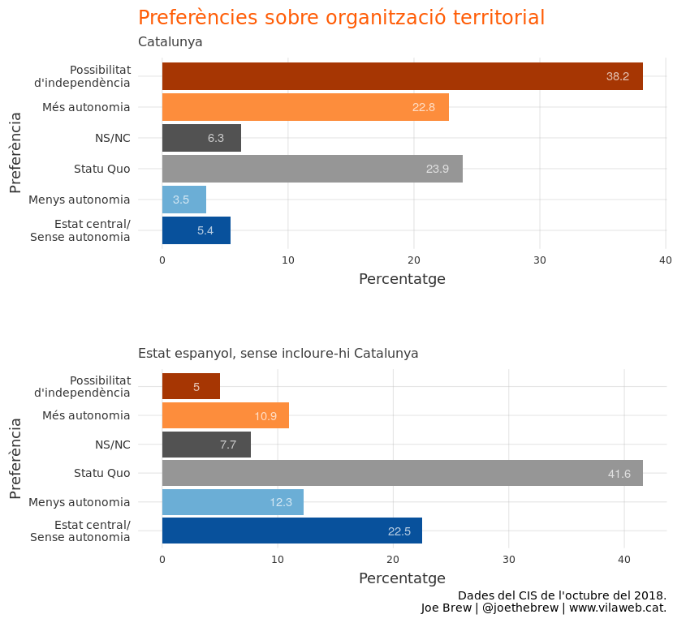<!-- -->

# Technical details

The code for this analysis is publicly available at
<https://github.com/joebrew/vilaweb/tree/master/analyses/crisi_de_legitimitat>.
