73.269 piulets esborrats
================

“Tenían preparadas bombas”, va piular el diputat del PP Alejandro
Fernández al matí del 23 de setembre del 2019. “Cuando advertí de la
‘batasunización’ del movimiento separatista a través de los cdr, me
dijeron de todo. O se corta esto de raíz o tendremos un grave problema.
Repito: tenían bombas”.

Mitja hora després, va esborrar el piulet.

El mateix dia, la diputada de Ciutadans, Inés Arrimadas va piular lo
següent: “Torra llama a apretar y los radicales obedecen. Comandos
separatistas habrían estado organizando acciones violentas con
explosivos mientras millones de catalanes siguen desprotegidos por el
Gobierno de España. Gravísimo. ¿Esto es normalidad, Sr. Sánchez?”. 20
minuts després, va esborrar el piulet. Però una hora després va tornar a
piular el mateix, substituent la paraula “comandos” amb “radicales”.

“Condeno las cargas, faltaría más” va piular el diputat socialista Raúl
Moreno en referència a l’1 d’octubre a la nit del 9 d’agost del 2018 com
a part d’una conversa al Twitter amb l’usuari @xevialde. El 22 de maig
del 2019, va esborrar el piulet. El mateix dia va esborrar centenars
d’altres piulets.

“¿Alguna cosa a decir?” va piular el 25 de setembre del 2019 el regidor
del PP de Badalanoa, Xavier García Albiol, etiquetant al President
català Quim Torra i citant un article de la Vanguardia sobre les
suposades confesions dels CDRs detinguts. “La presidencia de la
Generalitat está en manos de un personaje indigno del cargo que ocupa
capaz de justificar la violencia” va continuar Albiol. Menys de mitja
hora després, va esborrar el piulet.

“Cita aquest tuit amb l’insult en català que mes t’agradi” [va piular
l’usuari ‘CatalanThings’ a la vespra del 3 de gener
del 2017](https://twitter.com/catalanthings/status/816360038499581953).
Una hora i quatorze minuts més tard, el diputat Gabriel Rufían va citar
el piulet afegint ell el texte següent: “Referèndum pactat amb l’estat”.

El 10 d’agost del 2019, 2,5 anys després, Rufián va esborrar el seu
piulet.

“Hem de resistir la inhabilitació de @QuimTorraiPla. No resignar-nos”,
va escriure el diputat de la CUP Albert Botran a la tarda del 3 de
gener. El piulet va sobreviure 7 segons abans de ser esborrat. Uns
minuts més tard, Botran va tornar a piular, però amb un missatge amb més
matissos: “Si el President @QuimTorraiPla decideix plantar cara hem
d’estar al seu costat totes les forces partidàries de
l’autodeterminació, ens agradi més o menys el seu govern…”

In today’s era, social networks are an integral part of politics.
Politicians say what they think and react to the news (and one another)
in real-time. What they do on social media gets recorded in an easily
searchable format forever. Unless, of course, it gets deleted.

Deleting a social network post, such as a tweet, is fairly commonplace.
Normal people do it, and so do politicians. Most deleted tweets occur in
the minutes immediately following the original post, often because of an
error in spelling or grammar. Some were simply accidental touches of the
“retweet” button, corrected by un-retweeting.

But there are other deleted tweets which are of far more interest. That
is, sometimes a politician goes back to a tweet from 1, 2 or even 5
years ago and removes it. This usually goes entirely undetected by the
public. In fact, this is how Twitter (and other social networks) want it
to be: if users can’t control (delete) their content, users might be
more hesitant to generate that content which, ultimately, would be bad
for business.

But public figures, such as politicians, are a different case. What they
say (and tweet) is of public interest, and so is what they delete.
[Politwoops](https://www.politwoops.eu/) is a platform dedicated to
keeping tabs on politicians on Twitter, and capturing their deleted
tweets for the historical record. The Politwoops data is publicly
available and searchable: for example, through Politwoops’ website, one
can easily and quickly see the deleted tweets of [Lorena
Roldán](https://www.politwoops.eu/p/unknown/Lroldansu), [Carles
Puigdemont](https://www.politwoops.eu/p/eu/krls), and others.

# The questions

Which politicians delete their tweets? How many do they delete? How long
after the original tweet do they take them down? What kind of tweets get
deleted?

# The method

Unlike most of the articles I write, there is no “hypothesis” to test
here. Instead, this is *exploratory data* analysis, meaning that the
structure of the analysis is not guided by a pre-designated plan, nor by
a falsifiable premise, but rather by a sort of “wandering” around in the
data. For the sake of transparency, and as a check on my own selection
and confirmation biases, I’ll do my best to document the process here.

Important note: politwoops does not keep track of all politicians. The
deleted tweets of those who are not tracked by the platform are,
unfortunately, lost forever.

# The results

## Data acquisition

**Defining the politicians**: First, I compiled a list of 485
politicians of interest and retrieved their Twitter usernames. This
included (a) all of the representatives in the Catalan Parliament, (b)
all of the representatives in the Spanish Congress, and (c) a few dozen
other political figures of relevance to Catalan and Spanish politics.
The full list of those politicians is available
[here](https://github.com/joebrew/vilaweb/blob/master/analyses/deleted_tweets/data/all_people.csv).

**Retrieving the data**: Next, I retrieved all of the deleted tweets for
all the politicians in my list. Unfortunately, the Politwoops platform
only tracks some politicians, so the final dataset ended up being only
85 politicians (that list is
[here](https://github.com/joebrew/vilaweb/blob/master/analyses/deleted_tweets/data/politwoops_people.csv)).
I wrote some code to fetch the data from the Politwoops platform, and
voilà, 12 hours later I had 73269 deleted tweets in a local database.
The code for this entire process is publicly available
([here](https://github.com/joebrew/vilaweb/blob/master/analyses/deleted_tweets/prepare_data.R))
as well as the data itself
([here](https://raw.githubusercontent.com/joebrew/vilaweb/master/analyses/deleted_tweets/data/deleted_tweets.csv)).

## Basic analysis

Let’s start by examining the number of tweets deleted by each
politician.

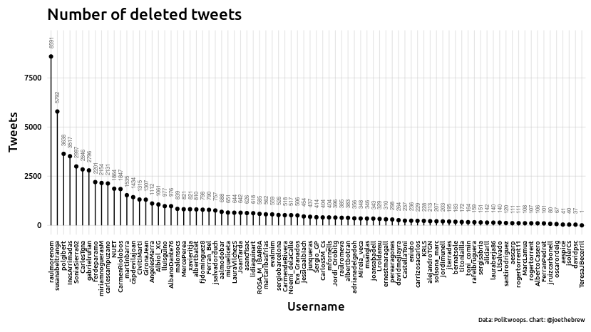<!-- -->

Of course, it should come as no surprise that politicians who tweet more
also delete more. So, let’s examine the number of deleted tweets as a
*percentage* of the number of all tweets sent by that politician (at the
time of their last deleted tweet).

<!-- -->

Interesting: Roger Torrent has apparently deleted 99% of his tweets. But
a manual look at the account being tracked by Politwoops reveals that
they are tracking his old account (rogertorrent11), rather than his
current one (rogertorrent). So, not so interesting after all (I warned
you, this is *exploratory* analysis).

What about “raulmorenom”, Raúl Moreno, a PSC parliamentarian in the
Catalan Parliament? He has deleted 8591 tweets. And what about
‘susanabeltranga’, Susan Beltran García, a representative in the same
chamber for the “Ciutadans” party - she has apparently deleted more than
half her tweets. Pol Gibert (PSC) and Inés Arrimadas (Ciutadans) also
stand out as having high deletion rates.

When did they delete these (thousands of) tweets? What were these tweets
about? Let’s dig in further.

## The importance of “when”

We don’t know exactly why a politician chooses to delete a tweet. But
*when* that tweet is deleted gives us a clue. Generally, a tweet deleted
after just a few seconds was due to an error. A tweet deleted after a
few months or years might be due to a change of opinion. And a series of
many tweets being deleted at the same time suggests a systematic social
media “clean-up”, ie an effort to erase the person’s previous online
presence.

The best way to see these patterns is to literally *see* them. So, let’s
have a look. On [this
page](https://github.com/joebrew/vilaweb/blob/master/analyses/deleted_tweets/plots_when.md)
we’ve generated one chart for each politician. How do you interpret
these charts? Each dot is a month; its positioning on the x-axis
reflects when the tweet was created (more recent tweets to the right,
older tweets to the left); its positioning on the y-axis reflects when
the tweet was deleted (recently deleted tweets towards the top, tweets
deleted a long time ago towards the bottom); its size tells you how many
tweets were deleted for that time combination; and its color refers to
whether they were tweets or retwets. You’ll note a diagonal line going
from the bottom-left to the upper-right: this is the high rate of tweets
that are deleted immediately after their creation.

Perhaps going through one hundred charts is not your idea of an
enjoyable Saturday morning. So, let’s highlight just a few that are
interesting.

### Xavier García Albiol

Albiol is a prolific tweeter, with 15070 tweets on his timeline at the
time of writing. But he is also a prolific deleter (1061 deleted
tweets). His deletion behavior is similar to most people’s: he sometimes
makes a mistake, and deletes the tweet very soon afterwards (hence the
pronounced diagonal line). Most of his deletions are retweets.

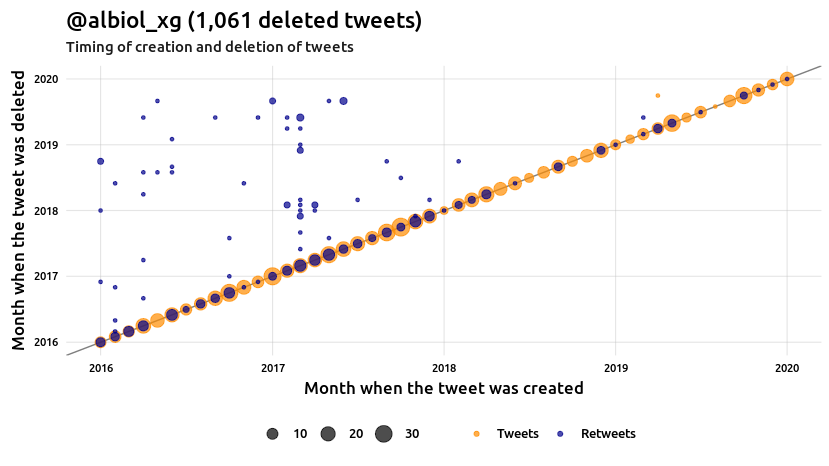<!-- -->

### Carlos Sánchez

The calendar of Sánchez’s deleted tweets is notably different from
Alibol’s. Ones eyes are immediately drawn to the horizontal lines: one
at the beginning of 2019, and one at the beginning of 2020. Horizontal
lines in this kind of chart means deleting many tweets at once. Like
Albiol, nearly all of Sánchez’s deleted tweets are simply removals of
retweets.

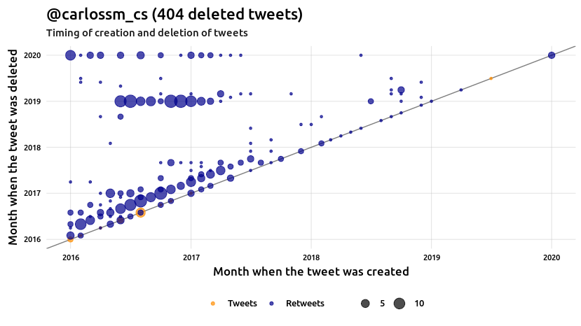<!-- -->

### Fernando de Páramo

On January 6, 2020, at about 8:00PM, it appears that the former
secretary of communication for the Ciutadans party deleted [his twitter
account](https://twitter.com/ferdeparamo) entirely, along with 2201
tweets.

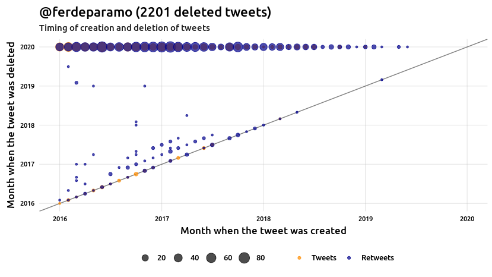<!-- -->

### Gabriel Rufián

Rufián tweets frequently, and also deletes frequently. Most of his
deletions are retweets. There are no clear patterns in his plot,
suggesting that he randomly goes through and cleans up old tweets.

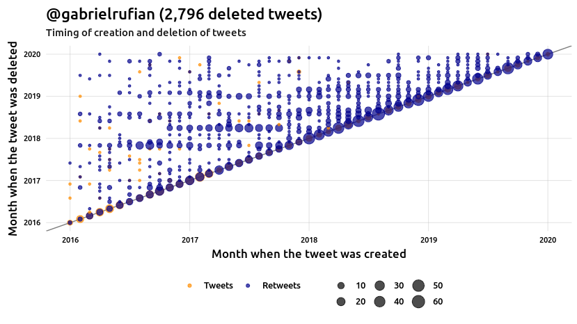<!-- -->

### Inés Arrimadas

From 2016 until mid-2017, Inés Arrimadas appears to have used an
automated tweet deletion service, which deleted here tweets
approximately 3 months after they were written. In fact, all of her
tweets prior to July 22, 2017 have been deleted (in total, this makes
for 3517 deleted tweets). Since then, she now rarely deletes tweets
(apart from those which are tweeted and then immediately retweeted).

<!-- -->

### Oriol Junqueras

Relative to Arrimadas’ 3517 deleted tweets, Junqueras deletes very
little (only 437), mostly retweets.

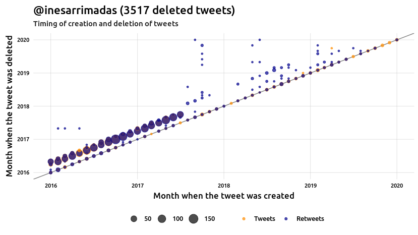<!-- -->

### Carles Puigdemont

Like Junqueras, Puigdemont has deleted relatively few tweets, most of
them retweets.

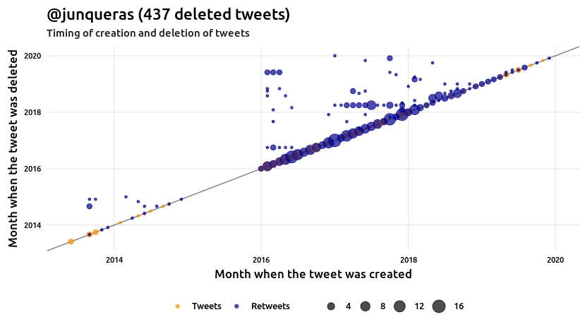<!-- -->

### Miquel Iceta

Iceta is a very prolific tweeter and retweeter (59922 tweets\!). Which
makes it all the more surprising that he has only deleted 651, mostly
retweets. It is curious, however, that he appears to regularly go back
to mid-2015 and delete retweets from that period.

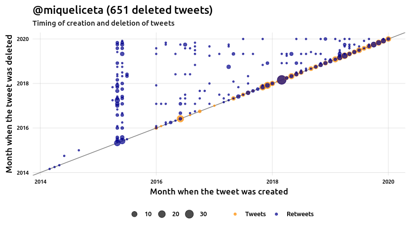<!-- -->

### Miriam Nogueras

Nogueras used to delete more tweets than she does nowadays. And almost
all of her deletions are retweets. Her plot shows a clear pattern of
random, rather than systematic, deletions.

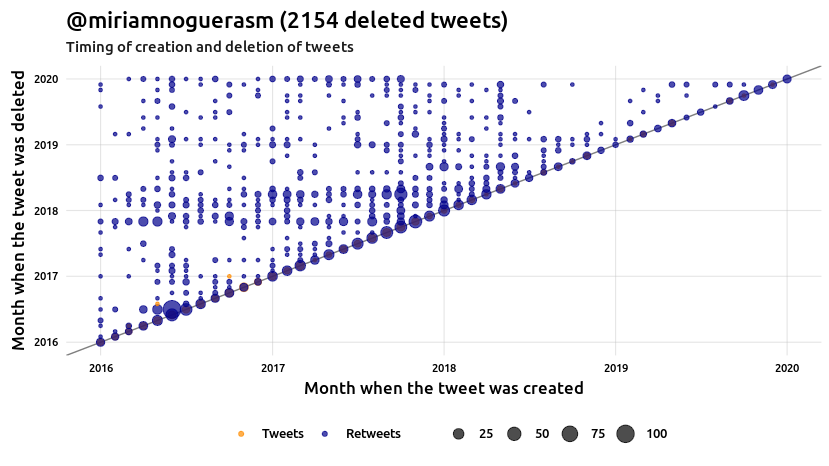<!-- -->

### Pol Gibert

Gibert’s chart is one of the most unique. Two clear lines are visible: a
horizontal line in early 2017 (the horizontal line means that he deleted
many tweets at one time), and a diagonal line above the “real-time” line
(meaning that he had likely set up a software which automatically
deleted tweets after one year).

The horizontal line: May 24, 2017, when he deleted 1892 tweets in one
day.

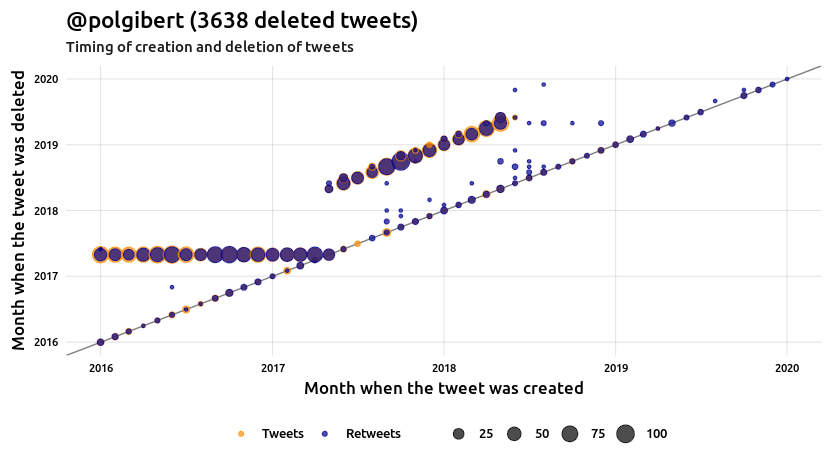<!-- -->

### Raúl Moreno

Moreno also appears to have undergone a social network cleanup on May
22, 2019, a day in which he deleted 7834 tweets.

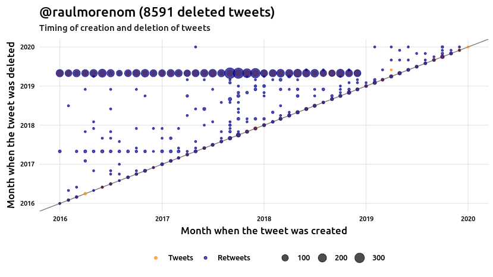<!-- -->

### Further analysis

More interesting than *when* tweets were written and deleted is *what*:
that is, what were the deleted tweets about.

Unless you have a spare 610 hours (the time it would take to read all
73269 tweets at a rate of 30 seconds per tweet), we’ll need to *search*.
And manually exploring deleted tweets by myself is, simply, too big of a
job.

So, rather than explore the 73269 tweets myself, I’ll simply hand them
over to you, the public. You can explore them through the [politwoops
website interface](www.politwoops.eu) if you’d like, but that interface
is built around scrolling through specific politicians, rather than
looking for specific text. So, to faciliate the latter, here’s a simple
web application built for quickly searching (for any text) and filtering
(for the Spanish/Catalan politicians in this analysis):
<https://datacat.cc/piulets>.

Enjoy\!

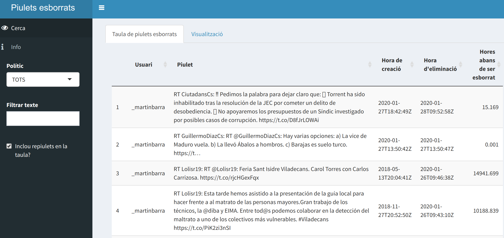

# Technical details

The code for this analysis is publicly available at
<https://github.com/joebrew/vilaweb/tree/master/analyses/deleted_tweets>.

# Plots in Catalan

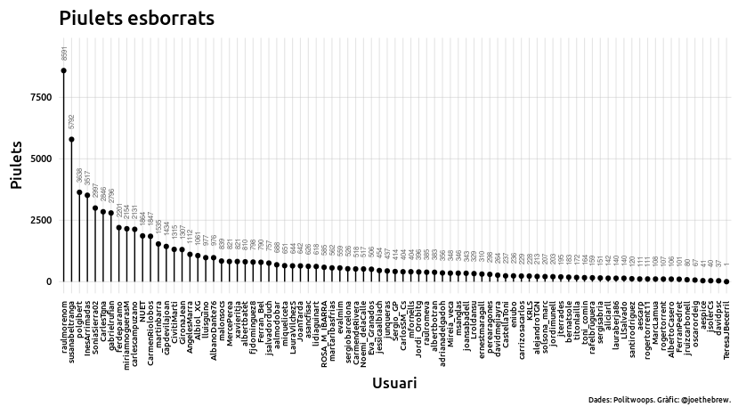<!-- -->

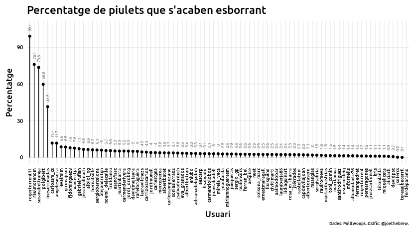<!-- -->

<!-- -->

<!-- -->

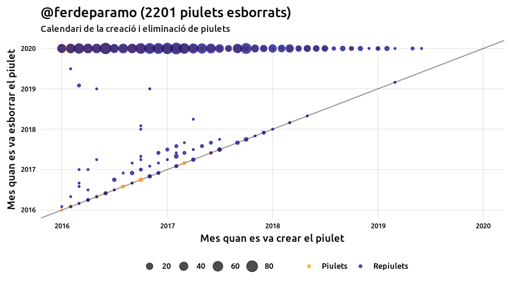<!-- -->

<!-- -->

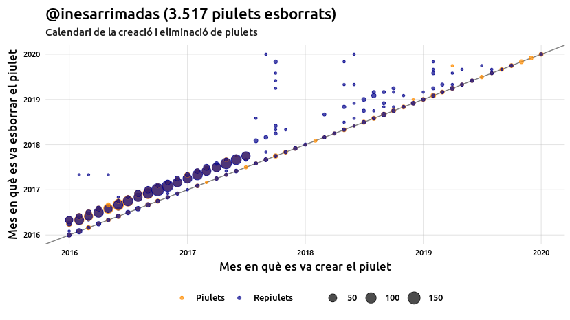<!-- -->

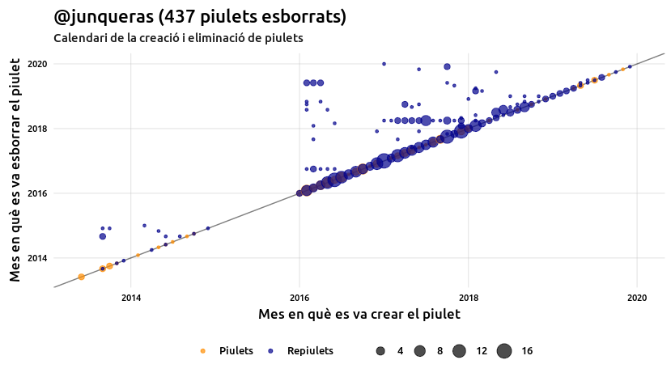<!-- -->

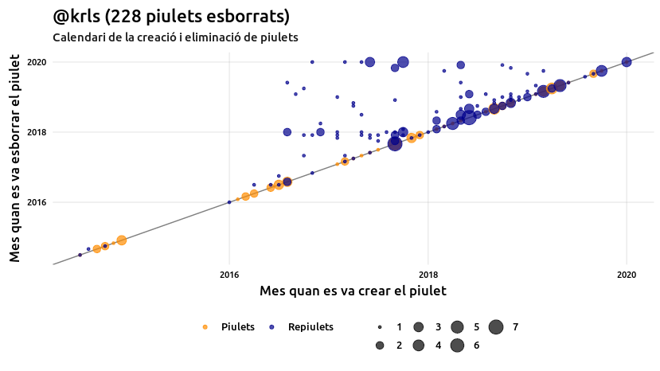<!-- -->

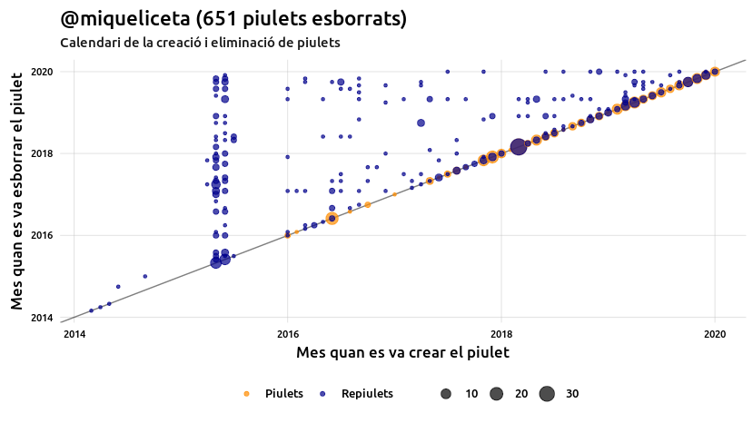<!-- -->

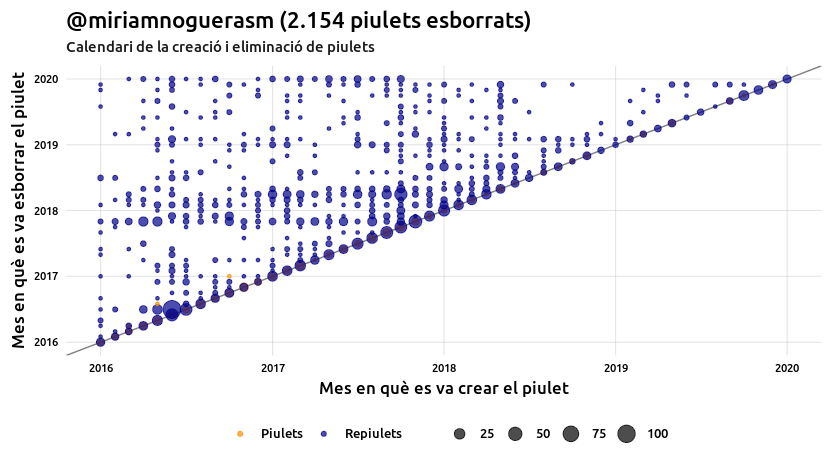<!-- -->

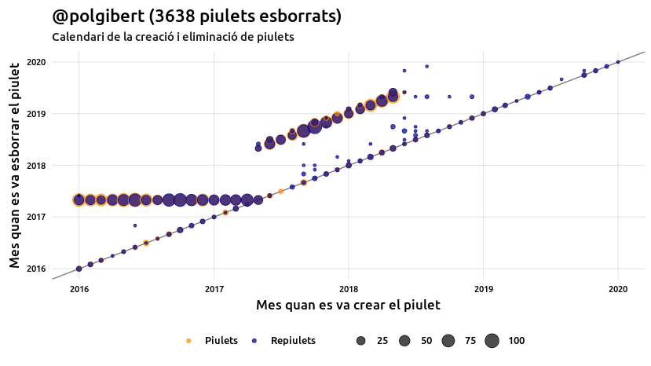<!-- -->

<!-- -->
