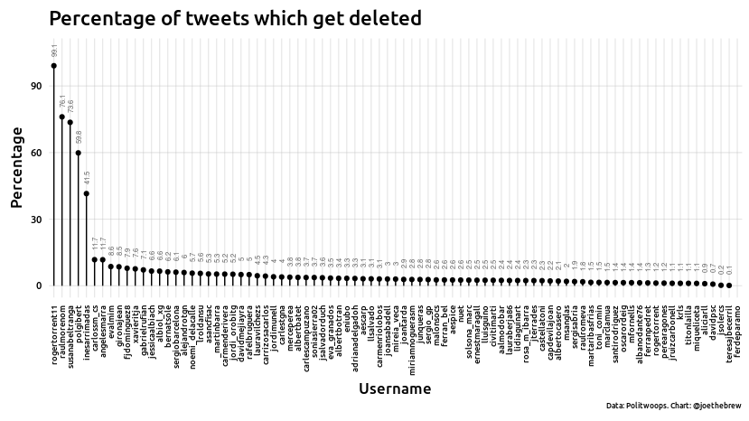

Exposé: els 73.269 piulets esborrats dels polítics catalans i espanyols
================

# Introduction

In today’s era, social networks are an integral part of politics.
Politicians say what they think and react to the news (and one another)
in real-time. What they do on social media gets recorded in an easily
searchable format forever. Unless, of course, it gets deleted.

Deleting a social network post, such as a tweet, is fairly commonplace.
Normal people do it, and so do politicians. Most deleted tweets occur in
the minutes immediately following the original post, often because of an
error in spelling or grammar. Some were simply accidental touches of the
“retweet” button, corrected by un-retweeting.

But there are other deleted tweets which are of far more interest. That
is, sometimes a politician goes back to a tweet from 1, 2 or even 5
years ago and removes it. This usually goes entirely undetected by the
public. In fact, this is how Twitter (and other social networks) want it
to be: if users can’t control (delete) their content, users might be
more hesitant to generate that content which, ultimately, would be bad
for business.

But public figures, such as politicians, are a different case. What they
say (and tweet) is of public interest, and so is what they delete.
[Politwoops](https://www.politwoops.eu/) is a platform dedicated to
keeping tabs on politicians on Twitter, and capturing their deleted
tweets for the historical record. The Politwoops data is publicly
available and searchable: for example, through Politwoops’ website, one
can easily and quickly see the deleted tweets of [Lorena
Roldán](https://www.politwoops.eu/p/unknown/Lroldansu), [Carles
Puigdemont](https://www.politwoops.eu/p/eu/krls). Today’s article is an
exploration of those data.

# The questions

Which politicians delete their tweets? How many do they delete? How long
after the original tweet do they take them down? What kind of tweets get
deleted?

# The method

Unlike most of the articles I write, there is no “hypothesis” to test
here. Instead, this is *exploratory data* analysis, meaning that the
structure of the analysis is not guided by a pre-designated plan, nor by
a falsifiable premise, but rather by a sort of “wandering” around in the
data. For the sake of transparency, and as a check on my own selection
and confirmation biases, I’ll do my best to document the process here.
This exploratory analysis is by no means complete or impartial (nor
could it be); accordingly, I encourage others to explore these data for
themselves.

# The results

## Data acquisition

**Defining the politicians**: First, I compiled a list of 485
politicians of interest and retrieved their Twitter usernames. This
included (a) all of the representatives in the Catalan Parliament, (b)
all of the representatives in the Spanish Congress, and (c) a few dozen
other political figures of relevance to Catalan and Spanish politics.
The full list of those politicians is available
[here](https://github.com/joebrew/vilaweb/blob/master/analyses/deleted_tweets/data/all_people.csv).

**Retrieving the data**: Next, I retrieved all of the deleted tweets for
all the politicians in my list. Unfortunately, the Politwoops platform
only tracks some politicians, so the final dataset ended up being only
85 politicians (that list is
[here](https://github.com/joebrew/vilaweb/blob/master/analyses/deleted_tweets/data/politwoops_people.csv)).
I wrote some code to fetch the data from the Politwoops platform, and
voilà, 12 hours later I had 73269 deleted tweets in a local database.
The code for this entire process is publicly available
([here](https://github.com/joebrew/vilaweb/blob/master/analyses/deleted_tweets/prepare_data.R))
as well as the data itself
([here](https://raw.githubusercontent.com/joebrew/vilaweb/master/analyses/deleted_tweets/data/deleted_tweets.csv)).

## Basic analysis

Let’s start by examining the number of tweets deleted by each
politician.

<!-- -->

Of course, it should come as no surprise that politicians who tweet more
also delete more. So, let’s examine the number of deleted tweets as a
*percentage* of the number of all tweets sent by that politician (at the
time of their last deleted tweet).

<!-- -->

Interesting: Roger Torrent has apparently deleted 99% of his tweets. But
a manual look at the account being tracked by Politwoops reveals that
they are tracking his old account (rogertorrent11), rather than his
current one (rogertorrent). So, not so interesting after all (I warned
you, this is *exploratory* analysis).

What about “raulmorenom”, Raúl Moreno, a PSC parliamentarian in the
Catalan Parliament? He has deleted 8591 tweets. And what about
‘susanabeltranga’, Susan Beltran García, a representative in the same
chamber for the “Ciutadans” party - she has apparently deleted more than
half her tweets. Pol Gibert (PSC) and Inés Arrimadas (Ciutadans) also
stand out as having high deletion rates.

When did they delete these (thousands of) tweets? What were these tweets
about? Let’s dig in further.

## The importance of “when”

We don’t know exactly why a politician chooses to delete a tweet. But
*when* that tweet is deleted gives us a clue. Generally, a tweet deleted
after just a few seconds was due to an error. A tweet deleted after a
few months might be due to a change of opinion. And a series of many
tweets being deleted on the same day suggest a systematic social media
“clean-up”, ie an effort to erase the person’s previous online
presence.

Let’s see if we can find anything interesting in terms of *when*
politicians delete tweets. The chart that follows
shows…

<!-- --><!-- --><!-- --><!-- --><!-- --><!-- --><!-- --><!-- --><!-- --><!-- --><!-- --><!-- --><!-- --><!-- --><!-- --><!-- --><!-- --><!-- --><!-- --><!-- --><!-- --><!-- --><!-- --><!-- --><!-- --><!-- --><!-- --><!-- --><!-- --><!-- --><!-- --><!-- --><!-- --><!-- --><!-- --><!-- --><!-- --><!-- --><!-- --><!-- --><!-- --><!-- --><!-- --><!-- --><!-- --><!-- --><!-- --><!-- --><!-- --><!-- --><!-- --><!-- --><!-- --><!-- --><!-- --><!-- --><!-- --><!-- --><!-- --><!-- --><!-- --><!-- --><!-- --><!-- --><!-- --><!-- --><!-- --><!-- --><!-- --><!-- --><!-- --><!-- --><!-- --><!-- --><!-- --><!-- --><!-- --><!-- --><!-- --><!-- --><!-- --><!-- --><!-- --><!-- --><!-- -->

# Technical details

The code for this analysis is publicly available at
<https://github.com/joebrew/vilaweb/tree/master/analyses/deleted_tweets>.
