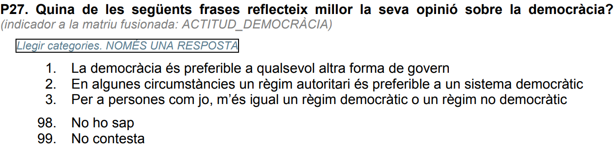

```{r setup, include=FALSE, echo = FALSE}
# Basic knitr options
library(knitr)
opts_chunk$set(comment = NA, 
               echo = FALSE, 
               warning = FALSE, 
               message = FALSE, 
               error = TRUE, 
               cache = FALSE,
               fig.width = 8.64,
               fig.height = 4.86,
               fig.path = 'figures/')
```

```{r}
source('prepare_data.R')
```


# The consensus for democracy?

It's sometimes easy to forget that support for democracy is not universal. Though the [majority of countries are democratic](https://www.pewresearch.org/fact-tank/2019/05/14/more-than-half-of-countries-are-democratic/), most of the world's democracies are [relatively young](https://ourworldindata.org/grapher/age-of-democracies), and dissatisfaction with democracy [is increasing](https://www.pewresearch.org/global/2019/04/29/why-are-people-dissatisfied-with-how-democracy-is-working/). 

Democracy is popular, but unconditional support for it is not universal. Some people prefer more autocratic systems of government. Others are more ambivalent, perhaps preferring democracy in most situations, but not all.  

The Catalonia-Spain political crisis has set off a debate about democracy's principles and rules. Most Catalans want to exercise the right to self-determination through a democratic vote, which Spanish law prohibits. This tension has set off a political crisis not only in Catalonia, but in Spain, with each side (those in favor and against self-determination) accusing the other side of being undemocratic.

Rather than pontificate on whether self-determination (or its prohibition) is "democratic" or not, let's instead examine what Catalans (of different political orientations) themselves say about democracy. That is, instead of giving _my_ opinion on democracy, let's examine theirs.

## Data details

For this analysis, we'll use data from the Centre d'Estudis d'Opinió, a research institute of the Catalan government. We'll focus on a specific question which directly addresses how one feels about democracy:




And we'll cross-examine responses to that question with attitudes and opinions about other political issues.

The question was asked twice: once in June 2018 and again one year later, in June 2019. At each time, the question was asked to 1,500 residents of Catalonia, aged 18 or older, with Spanish citizenship. Let's go.

## Support for democracy among Catalans


# Technical details

The code for this analysis is publicly available at `r self_cite()`.