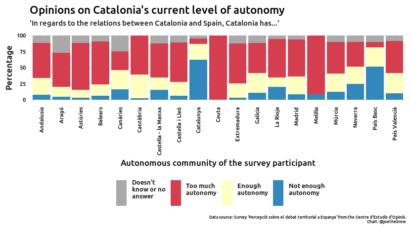
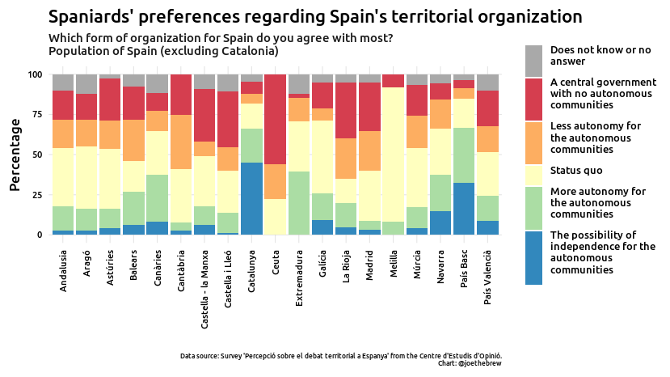
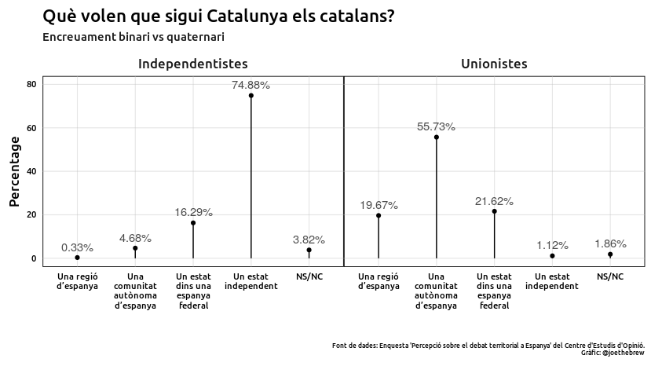
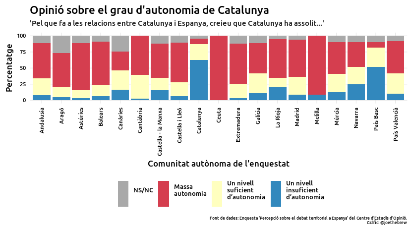
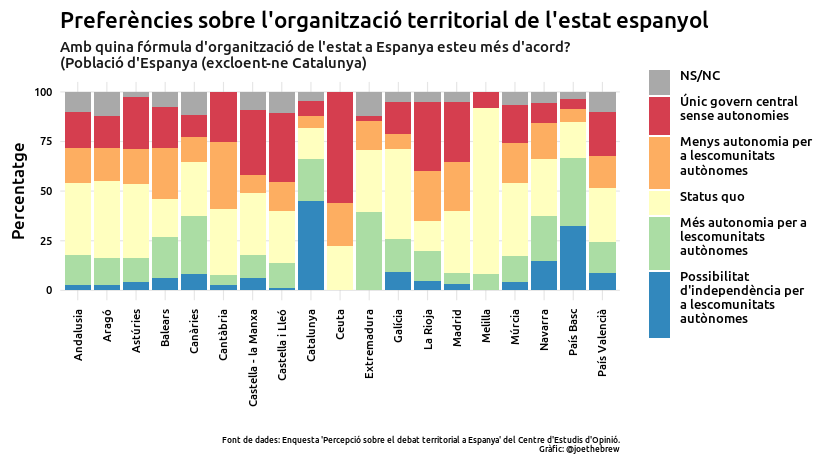

Federalist fantasies: why the Catalonia-Spain territorial conflict won’t
likely be resolved through reform
================

# Introduction

A window of hope has been opened in recent weeks as Spain’s government
has agreed to enter into dialogue with Catalonia’s government. This hope
has been bolstered by the recent admission by Spanish President Pedro
Sánchez that the crisis in Catalonia is indeed “political” (he had
previously maintained that it was a “crisis of coexistence” among
Catalans, not a political problem between Catalonia and Spain).
Recognizing the existence of a problem’s “political” nature implies
recognizing that the problem’s solution must also be “political” (as
opposed to the “judicial” strategy used by the Spanish State to combat
independentism over the last few years).

Given these conditions, an optimist might be led to believe that a
political resolution to the Catalonia-Spain territorial conflict is
coming soon. An optimist might think that Spain would follow the paths
of Canada and the United Kingdom, offering greater decentralization and
autonomy to independence-seeking regions, in order to decrease support
for independence among the inhabitants of those regions. An optimist
might believe that the severity of the ongoing territorial crisis in
Spain will soon lead to a constitutional reform so as to create a
federalist state in which a majority of Catalans are satisfied *within*
the Spanish State, and are no longer advocating for separation.

In fact, the “federalist” solution has long been advocated for by
Catalan socialists as a sort of “third way” between independence and
immobility. The rationale is that “federalism” - or other forms of
decentralization - could satisfy both those independentists who want
more self-government as well as those unionists who want Catalonia to
remain Spanish. An optimist might perceive the current political moment
as the perfect time for Spain to finally roll out its inevitable
federalist reform, thereby satisfying both independentists and
unionists.

Unfortunately, given the underlying electoral arithmetic in Spain and
Catalonia, that optimist would be wrong. Pedro Sánchez cannot “offer”
federalism or decentralization as a solution to Catalans’ calls for more
autonomy, for the same reason he cannot “offer” permitting Catalan
self-determination: a large majority of Spaniards want the opposite. In
other words, the concepts of (a) granting Catalonia more autonomy or (b)
making Spain less centralized, are both “illegal” and extremely
unpopular in most of Spain.

The prospect of a federalist or decentralizing reform might be
politically useful to those who want to difuse the tense situation
between the governments of Spain and Catalonia, but its likelihood of
success is essentially zero. Proposing either (a) an explicit federalist
reform for the entire State or (b) increased autonomy for Catalonia
might capture the support of a majority of Catalans, but it would be
electorally suicidal at the level of the Spanish State.

In this article, I’ll use data to make 2 simple points:

1.  That there is a consensus in Catalonia in favor of more
    self-government and increased autonomy (including options such as
    independence or federalism).

2.  That there is a consensus in Spain (outside of Catalonia) in favor
    of *reducing* Catalonia’s autonomy, and creating a more centralized
    state.

The combination of these points leads to an obvious conclusion: as good
as a federalist “third way” might be (for both Spain and Catalonia),
it’s simply not feasible. In other words, the Catalonia-Spain
territorial conflict has only two *realistic* resolutions: independence
or status quo.

# 1\. The Catalan consensus in favor of more Catalan self-government

In terms of the degree of self-government, a large majority of Catalans
are opposed to the status quo. Fewer than one quarter (24.6%) believe
that Catalonia has achieved a “sufficient” level of autonomy. Just 8.5%
feel that Catalonia has *too much* autonomy, whereas 6 times as many
(62.5%) feel that Catalonia does not have eough autonomy.

<!-- -->

The Catalan consensus for decentralization is very clear; when asked
about their preferences for the territorial organization of Spain,
two-thirds of Catalans (66%) want Spain’s “autonomous communities” to
have either more autonomy or the possibility of independence. Only 16%
want to keep the current system of autonomous communities, and fewer
than 14% want a more centralized Spain.

<!-- -->

Perhaps the most interesting data point on Catalans’ views regarding
territorial organization is the high prevalence of *conditional*
independentists. That is, though many Catalans want independence (49,3%
in favor vs. 41,2% opposed in this particular survey), a significant
percentage (16%) of those Catalans who say they are in favor of
independence (when asked a yes/no question) say that they prefer being a
state in a federal Spain if given the option.

<!-- -->

In other words, offering a “federation” to Catalonia would reduce
support for indepenence to well below 50%. So, if Spain wants to
“defeat” the indepenence movement, why not go with this obvious
option? That brings us to point
2.

# 2\. The Spanish consensus against Catalan self-government and decentralization

Outside of Catalonia, there is a large degree of consensus *against*
granting Catalonia more autonomy, or granting autonomous communities
more generally any more self-government. Even though a large majority of
Catalans want *more* autonomy, 51.1% of Spaniards (outside of Catalonia)
think that Catalonia has *too much* autonomy already.

<!-- -->

If we break the above down by autonomous community, we see that there is
mostly uniformity. Large majorities of each of Spain’s autonomous
communities believe that Catalonia already has *too much* autonomy (the
notable exception being the Basque country, where a majority feel the
opposite).

<!-- -->

Given these data, is a reform in which Catalonia is granted more
autonomy feasible? Of course not. Since most Spaniards feel that
Catalonia has too much autonomy already, the only reform which *might*
have electoral viability would be one in which autonomy was stripped
from Catalonia (case in point: Spain’s suspension of Catalan self-rule
in 2017 and 2018 had large popular support in the rest of Spain, but was
opposed by a majority of Catalans).

Since a “special” deal granting Catalonia more autonomy doesn’t appear
to be electorally possible, perhaps *all of Spain* could undergo a
reform. That way, the Spanish electorate would feel that they are
getting the same “privileges” as Catalans.

This, too, is electorally impossible. Unlike Catalonia, where two-thirds
want a State with more autonomy, in the rest of Spain only a small
minority (22%) want a state with more autonomy for its constituent
parts. A large majority (nearly 70%) want either the status quo or
*less* self-government for Spain’s autonomous regions.

<!-- -->

Again, the Basque country is the exception here (a large majority of
Basques, like Catalans, want a more decentralized State), but it is
relatively so small in terms of population (compared to the rest of the
State), that even its strong preference in favor of more autonomy makes
no significant difference.

<!-- -->

# Conclusion

In the case of the Catalonia-Spain territorial conflict, it’s clear that
both Spaniards and Catalans agree that there is a problem. To Catalans,
the problem is that they don’t have enough self-government, and that the
state they’re in is too centralized. To the rest of the citizens of
Spain (with the notable exception of Basques), the problem is just the
opposite: Catalans have *too much* autonomy and the Spanish state is
*too* decentralized.

The most frequently proposed reform-based solution is giving more
autonomy to Catalonia, or decentralizing the Spanish State. These
proposals are intelligent in the sense that their fulfillment would
likely indeed reduce the support for Catalan independence to a minority.
But Catalan support for a federal Spain is not, unto itself, sufficient
to create a federal Spain; this would require Spanish support. And,
frankly, this is not possible: the data on prefences regarding (a)
Catalonia’s autonomy and (b) the territorial organization of the Spanish
state as a whole show that Spaniards would not accept a solution which
granted Catalonia more autonomy or resulted in a more decentralized
state.

Despite all the talk about federalism or constitutional reform as a
means to resolve the political crisis between Catalonia and Spain,
federalism, constituional reform, and/or decentralization are simply not
realistic given Spanish political majorities. Either (a) the majority of
Catalans in favor of self-determination and greater autonomy need to
change their mind or (b) the majority of Spaniards opposed to
self-determination and greater autonomy need to change their mind. Since
neither is likely to happen, further political deadlock is the most
probable outcome.

“Federalists” often accuse Catalan “independentists” of being
“unrealistic”, since (legal) independence would require a
constitutional reform for which there is not sufficient popular support
in Spain. Ironically, the federalist proposal is, like independence,
both “illegal” and lacking in popular support in Spain. But, unlike
independence (for which there are many historical examples of
“unilateral” success, ie, a country achieving independence without the
permission from the state it leaves), there are no examples of a state
achieving federalism against the wishes of its citizens. In other words,
Spanish federalism is of lower probability than Catalan independence.

What does the lack of decentralizing reformability mean for the future
of the Spain-Catalonia conflict? It’s hard to say, but this much is
clear: Spain won’t employ the reform-based strategies used by the UK and
Canada to push pro-independence Scots and Quebeckers into a minority. It
won’t, because it (electorally) can’t.

Spain’s coalition government will likely continue to wave the flag of
dialogue, as a signal to Catalans that it wants to engage in
constructive reform and reduce political tension; however, given the
majority opposition in the rest of Spain, Sánchez’s government will be
unable to offer anything concrete (doing so would be electoral suicide).
Given the lack of a political offer, the “grace period” given to Sánchez
by pro-independence Catalans will likely come to an end. That is, the
window of hope that Sánchez will resolve the conflict will close when it
becomes clear that the mechanism which could persuade pro-independence
Catalans to switch sides (federalism) is not possible. And, as time
passes and no federalist reform materializes, some anti-independence
Catalans will become disenchanted with the fact that no political
reforms are being made, and will therefore convert to the
pro-independence camp. In other words, the (inevitable) lack of a
federalist solution to the Catalonia-Spain political conflict will most
likely generate *more* support among Catalans for independence from
Spain.

Regardless of how one feels about Catalan independence, it’s important
for all parties to be open to all forms of dialogue, with all relevant
stakeholders, about all possibilities (including those which may not be
one’s first preference). However, it’s also important to be realistic.
And in the case of the Catalonia-Spain territorial conflict, there are,
for all effective purposes, only two possible outcomes: (a) status quo
or (b) independence (without permission). Anything other than that would
require electoral majorities in Spain which simply do not exist.

# Catalan-language charts

<!-- -->

<!-- -->

<!-- -->

<!-- -->

<!-- -->

<!-- -->

<!-- -->

# Data and technical details

All of the data used in this article came from the “Percepció sobre el
debat territorial a Espanya. 2019” survey carried out in Spain and
Catalonia in September-October 2019. The data are openly available at
the website of the Catalan [Centre d’Estudis
d’Opinió](http://ceo.gencat.cat/ca/estudis/registre-estudis-dopinio/estudis-de-la-generalitat/detall/index.html?id=7368).

The code used for this analysis is also publicly available:
<https://github.com/joebrew/vilaweb/tree/master/analyses/fantasies>.
