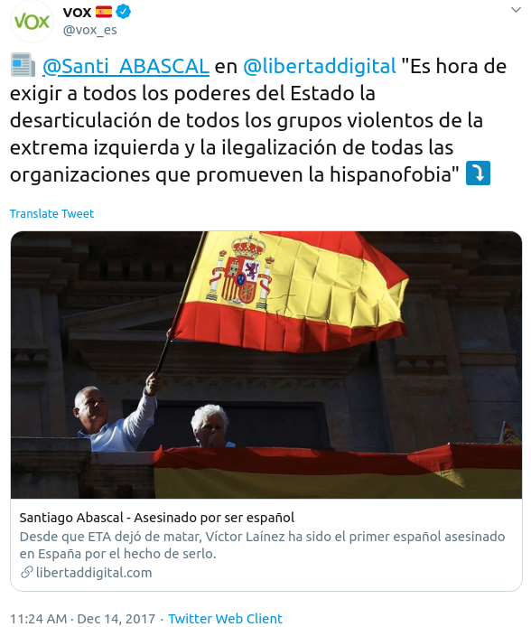
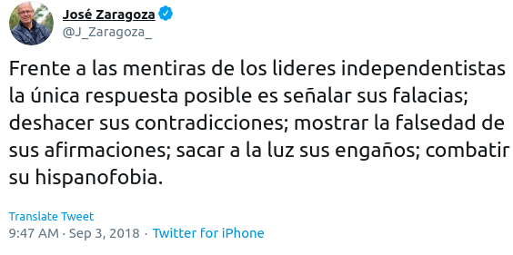
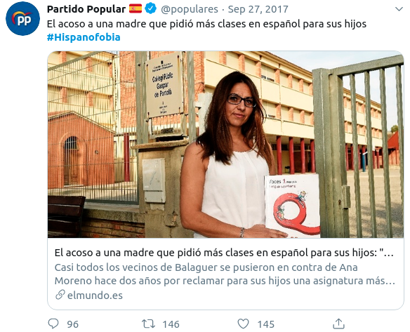
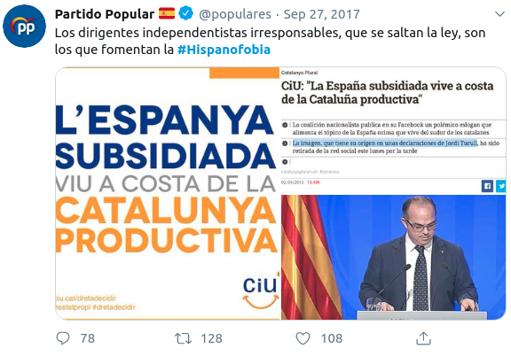
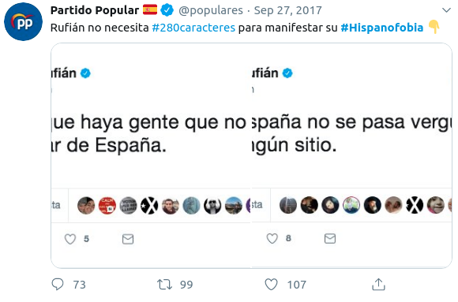
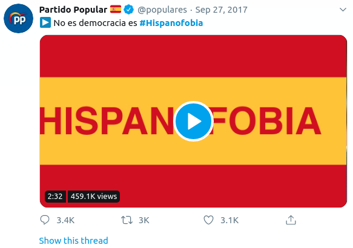

```{r setup, include=FALSE, echo = FALSE}
# Basic knitr options
library(knitr)
opts_chunk$set(comment = NA, 
               echo = FALSE, 
               warning = FALSE, 
               message = FALSE, 
               error = TRUE, 
               cache = FALSE,
               fig.width = 8.64,
               fig.height = 4.86,
               fig.path = 'figures/')
```

```{r}
source('prepare_data.R')
source('prepare_twitter_data.R')
```

# Introduction

If one's only source of information about Catalan society were Spanish politicians, one might conclude that there is a high degree of anti-Spanishness in Catalonia. This belief is widely-held, and appears to be increasing among the public: for example, Google searches in Spain for the term "hispanophobia" increased sharply at the time of the 2017 Catalan independence referendum, and have remained elevated above their pre-referendum levels ever since.

```{r}
plot_google()
```

A similar trend can be detected by examining the frequency of the word "hispanophobia" (and its variants in Catalan and Spanish) on Twitter: after the October 2017 peak in the term, the frequency never quite returned down to its pre-referendum baseline.

```{r}
plot_twitter()
```

The focus on the supposed anti-Spanishness of Catalans has made its way into mainstream Spanish politics. Its main promoters are the Spanish nationalist far right, such as the "Vox" party, which, in a clear reference to Catalan independence parties, has gone so far as to call for the illegalization of "organizations which promote hispanophobia". 




But it's not just the right; politicians of the Spanish socialist party have joined the bandwagon, regularly raising the issue of their opposition to the "supremacism" and "hispanophobia" of Catalans.




Likewise, much of the supposedly centrist "Citizens" party's rise to prominence came from a political discourse focused on the plight of Spanish-speakers in Catalonia. Albert Rivera, for example, tweeted the term dozens of times in reference to Catalonia during his early political career.


Like the other Spanish nationalist parties, the mainstream "Popular" party has repeatedly tried to link the Catalonia with anti-Spanishness. The week before the 2017 Catalan independence referendum, for example, the official Twitter account of the party tweeted the hashtag "#Hispanofobia" 9 times... in just one day.

<table style="width:100%">
  <tr>
    <td></td>
    <td></td>
    <td></td>
  </tr>
    <tr>
    <td></td>
    <td></td>
    <td></td>
  </tr>
      <tr>
    <td></td>
    <td></td>
    <td></td>
  </tr>
</table>


But is the impression based in reality? That is, are Catalans really hispanophobic? Or are the frequent references to Catalan anti-Spanishness the product of a manufactured political campaign actively promoted by politicians?

Fortunately, there are data that directly address the matter. And the data are quite clear on the subject: No, Catalan society is not "anti-Spanish". In fact, an analysis of the data reveals the opposite: Catalans _like_ Spaniards more than Spaniards like Catalans. 

In other words, if Spanish politicians were truly concerned about cultural phobias in their State, they should worry less about what Catalans think of Spaniards and more about what Spaniards think of Catalans.

Let's dig in to the data.

# The question

What is the degree of "hispanophobia" in Catalonia, and of "catalanophobia" in Spain?

# The data

This analysis uses publicly-available survey data collected from 3,600 residents of the Spanish State (800 from Catalonia, 2,800 from the rest of the Spanish State) in late 2019. More details on the data are available at the end of this article.

# The results

## Que pensen els catalans dels espanyols i els espanyols dels catalans?

The below chart shows the average value (on a 1 to 10 scale in which 1 is "I don't like them at all" and 10 is "I like them a lot") of how people from one place (x-axis) feel about people from another place (y-axis).

```{r, fig.height = 7, fig.width = 5.5}
plot_simpatia_matrix(ca = FALSE)
```

If one takes a step back from the plot, two lines are clearly decipherable:

1. A diagonal blue line, going from the bottom left to the top right, showing the relatively high-scores that people of each place give to _themselves_.

2. A horizontal red line in the middle of the chart, showing the large degree of antipathy towards Catalans from residents of the rest of Spain.


```{r, eval = TRUE}
# Sanity check - what people think about one another
pd <- pt %>%
    mutate(ccaa = `Comunitat autònoma`) %>%
    mutate(weight = `Coeficients de ponderació`) %>%
    dplyr::select(contains('Grau de simpatia cap als habitants'),
                  contains('ccaa'),
                  contains('weight'))
  names(pd) <- gsub("Grau de simpatia cap als habitants de cadascuna de les diferents comunitats autònomes:  ", '', names(pd))
  # Make long
  pd <- pd %>% gather(key, value, Andalusos:Ceutencs)
  pd$value <- simpatia_cleaner(pd$value)

# What Spaniards think about Catalans
# weighted
es_to_cat_avg_w <- weighted.mean(pd$value[pd$ccaa != 'Catalunya' & pd$key == 'Catalans'], w = pd$weight[pd$ccaa != 'Catalunya' & pd$key == 'Catalans'], na.rm = T) * 100
# not weighted
est_to_cat_avg_r <- mean(pd$value[pd$ccaa != 'Catalunya' & pd$key == 'Catalans'], na.rm = T) * 100

# What Catalans think about Spaniards
# weighted
cat_to_es_avg_w <- weighted.mean(pd$value[pd$ccaa == 'Catalunya' & pd$key != 'Catalans'], w = pd$weight[pd$ccaa == 'Catalunya' & pd$key != 'Catalans'], na.rm = T) * 100
# not weighted
cat_to_es_avg_r <- mean(pd$value[pd$ccaa == 'Catalunya' & pd$key != 'Catalans'], na.rm = T) * 100

# Pecent below 5: Spaniards to Catalans
sub_data <- pd[pd$ccaa != 'Catalunya' & pd$key == 'Catalans',]
# weighted
es_to_cat_p4_w <- sum(sub_data$weight[which(sub_data$value < 5)], na.rm = TRUE) / sum(sub_data$weight[which(!is.na(sub_data$value))], na.rm = T) * 100
# not weighted
es_to_cat_p4_r <- length(which(sub_data$value < 5)) / length(which(!is.na(sub_data$value))) * 100


# Pecent below 5: Catalans to Spaniards
sub_data <- pd[pd$ccaa == 'Catalunya' & pd$key != 'Catalans',]
# weighted
cat_to_es_p4_w <- sum(sub_data$weight[which(sub_data$value < 5)]) / sum(sub_data$weight[!is.na(sub_data$value)]) * 100
# not weighted
cat_to_es_p4_r <- length(which(sub_data$value < 5)) / length(which(!is.na(sub_data$value))) * 100


# Percent at 0: Spaniards to Catalans
sub_data <- pd[pd$ccaa != 'Catalunya' & pd$key == 'Catalans',]
# weighted
es_to_cat_p0_w <- sum(sub_data$weight[which(sub_data$value == 0)], na.rm = TRUE) / sum(sub_data$weight[which(!is.na(sub_data$value))], na.rm = T) * 100
# not weighted
es_to_cat_p0_r <- length(which(sub_data$value == 0)) / length(which(!is.na(sub_data$value))) * 100

# Percent at 0: Catalans to Spaniards
sub_data <- pd[pd$ccaa == 'Catalunya' & pd$key != 'Catalans',]
# weighted
cat_to_es_p0_w <- sum(sub_data$weight[which(sub_data$value == 0)]) / sum(sub_data$weight[!is.na(sub_data$value)]) * 100
# not weighted
cat_to_es_p0_r <- length(which(sub_data$value == 0)) / length(which(!is.na(sub_data$value))) * 100


```

When Catalans are asked how much they like the residents of the rest of the Spanish State (excluding Catalonia), the average score they give is `r round(cat_to_es_avg_w, digits = 1)`. When Spaniards (excluding Catalans) are asked how much they like Catalans, the average score they give (weighted for sampling bias) is `r round(es_to_cat_avg_w, digits = 1)`.

Perhaps, though, it's wrong to focus on averages. After all, both numbers are above 5, suggesting that both Catalans and Spaniards like each other more than they dislike each other.

So, instead of averages, let's focus on proportions: what is the percentage of Catalans that _dislike_ Spaniards, and what is the percentage of Spaniards that _dislike_ Catalans (we'll consider 0-4 on the 0-10 scale to be "disliking", and will remove from our denominator those who don't give any answer)? 

```{r, fig.height = 7, fig.width = 5.5}
plot_simpatia_matrix(ca = F, var = 'p4', roundy = 0, reverse_color = T) +
  labs(title = "Percentage of people from one place\nwho dislike people from other place",
       subtitle ="% of people from one area who give a score of < 5\n(on a 0-10 scale) to people from the other area")
```

As with the previous chart, the same horizontal-line pattern emerges. That is, with the exception of the Basque Country and Catalonia itself, large percentages of residents of the rest of Spain "dislike" Catalans. In the areas of Castilla (la Mancha and León) and Asturias, more than 1/3 of people dislike Catalans. If we take the whole of Spain (excluding Catalonia), the percentage of people who profess to dislike Catalans is `r round(es_to_cat_p4_w, digits = 1)`.

The percentage of Catalans that dislike Spaniards is comparatively lower: `r round(cat_to_es_p4_w, digits = 1)`%. Even though a relatively high percentage of Catalans say that they dislike those from Madrid (19%), this is still significantly lower than the percentage of people from Madrid who say that they dislike Catalans (28%).

In other words, Catalans are the most disliked people in the Spanish state. But the dislike that many Spaniards feel for Catalans is not bidirectional. In fact, if we break the data down region by region, we say that in _all_ cases, Catalans like the people from each of the state's other 16 regions more than those people like Catalans (Ceuta and Melilla being excluded for reasons of sample size).

```{r, fig.height = 7, fig.width = 5.5}
plot_compare(ca = FALSE)
```

Again, sometimes averages are less interesting than the extremes. And perhaps one could argue that "disliking" somebody (ie, giving them a rating of less than 5 on a 0-10 scale) does not quite constitute a "phobia". So, let's look at the extremes. What is the percentage of people from each area that give a _zero_ on a 0 to 10 scale to people from other areas. Let's see:

```{r, fig.height = 7, fig.width = 5.5}
plot_simpatia_matrix(ca = F, var = 'p0', roundy = 1, reverse_color = T, text_size = 3) +
  labs(title = "Percentage of extreme dislike",
       subtitle ="% of people from one area who give a score of\n0 (0-10 scale) to people from the other area")
```

Again, the same pattern emerges: the horizontal red line. `r round(es_to_cat_p0_w, digits = 1)` percent of people from the rest of the Spanish State say that they "don't like Catalans at all" (0 on a 0-10) scale, whereas only `r round(cat_to_es_p0_w, digits = 1)` of Catalans say the same about Spaniards.


## Why?

Why does such a high portion of Spaniards say that they don't like Catalans at all? 

If the answer were only political, then we would expect that Catalans would dislike Spaniards at a similar rate. But it's not the case; Catalans largely like Spaniards, far more than Spaniards like Catalans. What might explain this?

I don't claim to have the definitive answer to this question, but I believe that the data offers a clear hint about the causal factor behind hatre: _ignorance_.

I don't mean "ignorance" as an insult, but rather as a simple descriptive word to describe lack of familiarity. As any parent of children can tell you, the more you know something, the easier it is to love it (and the harder it is to dislike it). Catalans, to a large extent, _know_ Spanish culture and Spaniards; in addition to a large percentage of them having non-Catalan Spanish ancestry due to (relatively) recent waves of immigration from Southern Spain to Cataolonia, Spanish pop culture has a predominant role (TV, movies, etc.) in Catalonia. The same cannot be said of the extent of Catalan ancestry among non-Catalan Spaniards, nor of the penetration of Catalan pop culture into non-Catalan areas. How many Andalusians have Catalan grandparents? How many Catalan-language films are screened in Madrid theatres? Very few.

Let's test the theory. If ignorance indeed drives hatred, then we would expect that those who are least familiar with Catalonia would be the ones who like Catalans least, and those who are most familiar with Catalonia would like Catalans most.

The below chart shows the assocation between the number of times Spaniards have travelled to Catalonia, and their feelings towards Catalans.


```{r}
plot_viatges_i_simpatia(ca = FALSE)
```

As expected, those who most dislike Catalans are the ones who have never been to Catalonia. Directional causality is a bit difficult to establish here (of course, perhaps the reason they have never gone to Catalonia is their dislike of Catalans!), but the association speaks for itself.

Let's examine the same data, but focusing on "haters": those who give a score of 0 to Catalans (ie, "I don't like them at all"). The below chart shows the percentage of extreme aversion (0 score) by the number of times he/she has travelled to Catalonia.

```{r}
plot_viatges_i_odi(ca = FALSE)
```

Among Spaniards who have been to Catalonia 10 times or more, the percentage which say they "don't like Catalans at all" is relatively low: 3.8%. On the other hand, the group that most professes to dislike Catalans are those who have never been to Catalonia (11.7%).


Ignorance of Catalonia (ie, never having been there) is not only associated with a significantly higher degree of aversion to Catalan people; it also has political implications. For example, among Spaniards, the more one has travelled to Catalonia, the more in favor he/she is of Catalans holding an independence referendum.

```{r}
plot_support_referendum(ca = FALSE)
```

Travel correlates with liking, and liking correlates with granting freedom. A large majority of Spaniards are opposed to a Catalan independence referendum, but much of this opposition is driven by people who say that they _don't like_ Catalans. The below chart shows the association between how much one likes Catalans (0-10 scale) on the x-axis, and their stance on a Catalan independence referendum.

```{r}
plot_simpatia_referendum(ca = FALSE)
```

Among those who dislike Catalans (0-4), only a small minority are in favor of permitting Catalan self-determination. Among those who like Catalans (6+), it is much closer to a 50-50 split.

# Conclusion


# Catalan-language plots

```{r}
plot_google(ca = TRUE)
```

```{r, fig.height = 7, fig.width = 5.5}
plot_simpatia_matrix(ca = TRUE)
```


```{r, fig.height = 7, fig.width = 5.5}
plot_simpatia_matrix(ca = T, var = 'p4', roundy = 0, reverse_color = T) +
  labs(title = "% qui diu que 'em cauen malament'",
       subtitle ="% de persones d\'una comunitat autònoma que posen\nuna puntuació de menys de 5 a les\npersones d\'una altra comunitat autònoma")
```


```{r, fig.height = 7, fig.width = 5.5}
plot_compare(ca = TRUE)
```

```{r, fig.height = 7, fig.width = 5.5}
plot_simpatia_matrix(ca = T, var = 'p0', roundy = 1, reverse_color = T) +
  labs(title = "% qui diu 'Em cauen molt malament'",
       subtitle ="% de persones d\'una comunitat autònoma que diuen que\nles persones de l\'altra comunitat autònoma li\n'cauen molt malament' (0 en escala 0-10)")
```


```{r}
plot_viatges_i_simpatia(ca = TRUE)
```


```{r}
plot_viatges_i_odi(ca = TRUE)
```


```{r}
plot_support_referendum(ca = TRUE)
```


```{r}
plot_simpatia_referendum(ca = TRUE)
```


# Technical details

The data used for this article came from the 'Percepció sobre el debat territorial a Espanya' survey, carried out by the Centre d'Estudis d'Opinió of Catalonia. The raw, person-level data are publicly available online at http://ceo.gencat.cat/ca/inici, as is all the code used for this analysis: `r self_cite()`.