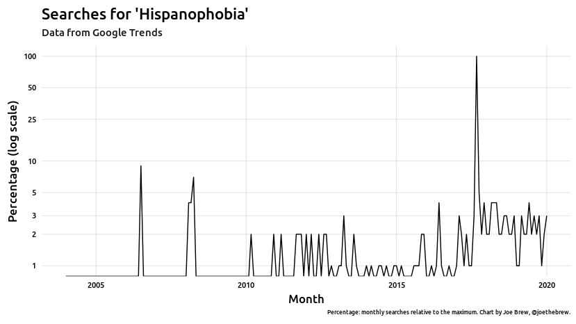
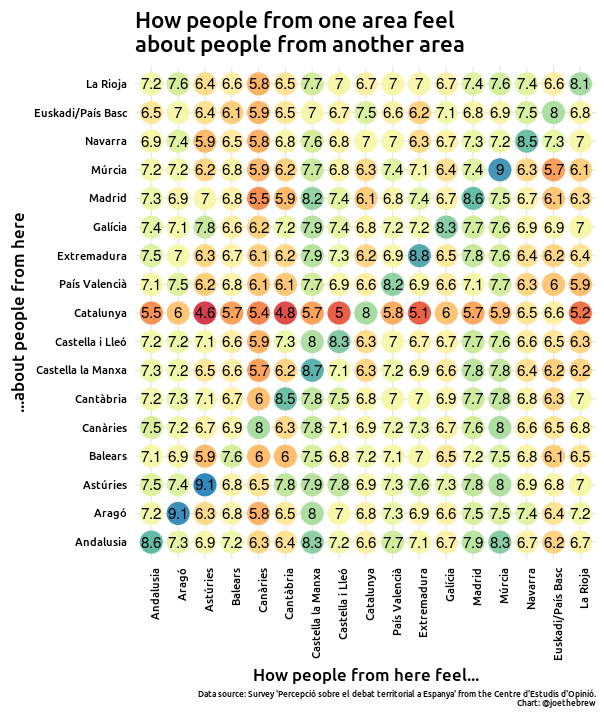
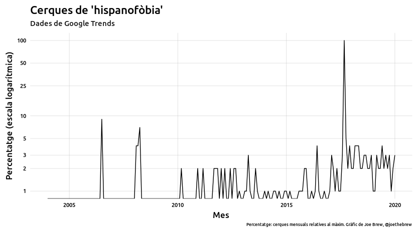
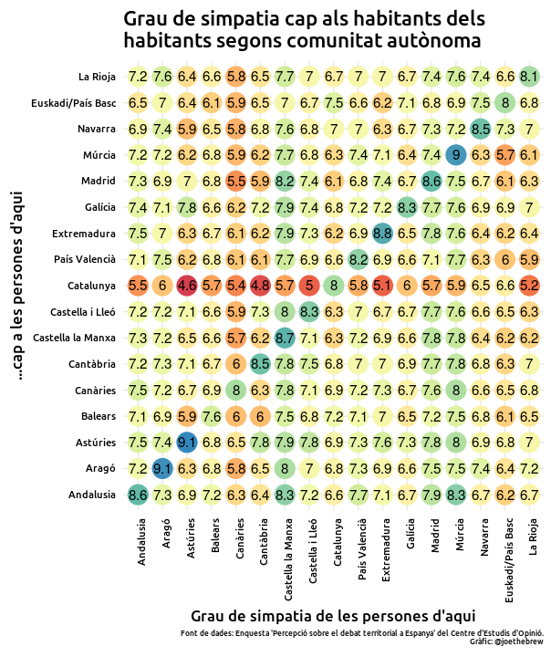
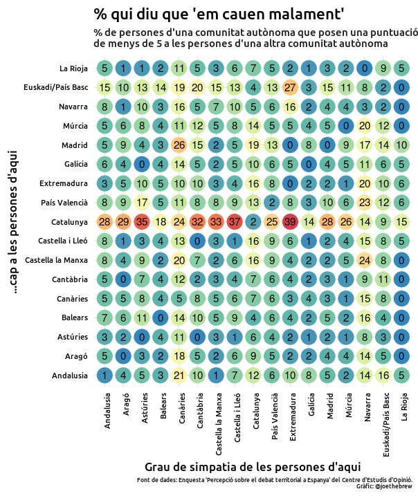
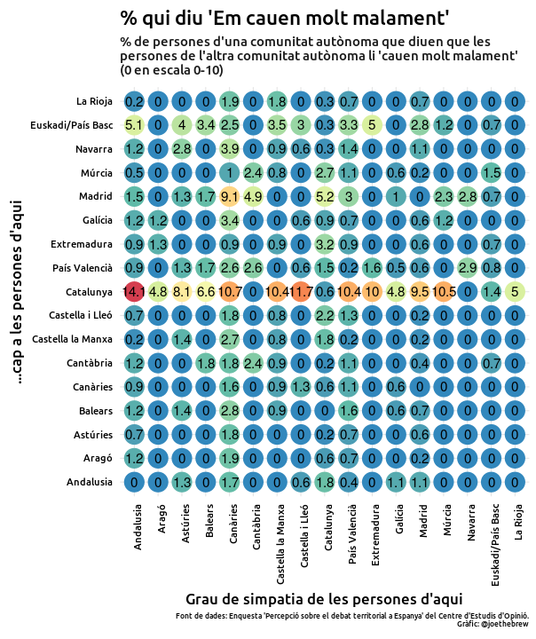
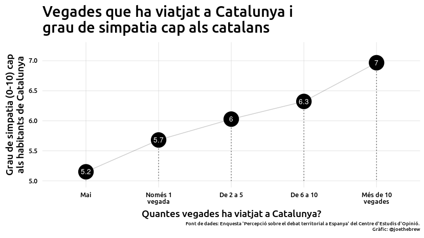
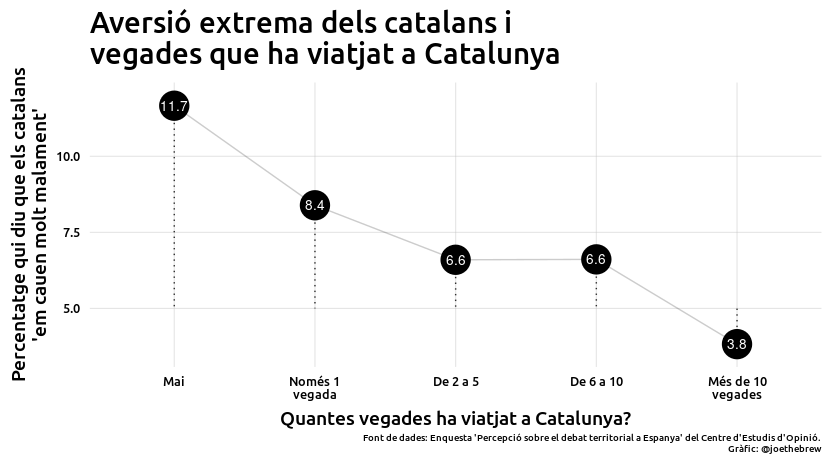
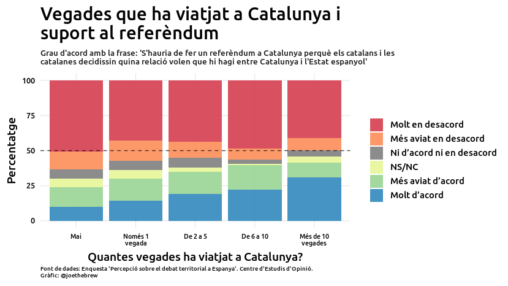

Phobia and philia - the data what Catalans and Spaniards think of one
another
================

# Introduction

If one’s only source of information about Catalan society were Spanish
politicians, one might conclude that there is a high degree of
anti-Spanishness in Catalonia. This belief is widely-held, and appears
to be increasing among the public: for example, Google searches in Spain
for the term “hispanophobia” increased sharply at the time of the 2017
Catalan independence referendum, and have remained elevated above their
pre-referendum levels ever since.

<!-- -->

A similar trend can be detected by examining the frequency of the word
“hispanophobia” (and its variants in Catalan and Spanish) on Twitter:
after the October 2017 peak in the term, the frequency never quite
returned down to its pre-referendum baseline.

<!-- -->

The focus on the supposed anti-Spanishness of Catalans has made its way
into mainstream Spanish politics. Its main promoters are the Spanish
nationalist far right, such as the “Vox” party, which, in a clear
reference to Catalan independence parties, has gone so far as to call
for the illegalization of “organizations which promote hispanophobia”.

But it’s not just the right; politicians of the Spanish socialist party
have joined the bandwagon, regularly raising the issue of their
opposition to the “supremacism” and “hispanophobia” of Catalans.

Likewise, much of the supposedly centrist “Citizens” party’s rise to
prominence came from a political discourse focused on the plight of
Spanish-speakers in Catalonia. Albert Rivera, for example, tweeted the
term dozens of times in reference to Catalonia during his early
political career.

Like the other Spanish nationalist parties, the mainstream “Popular”
party has repeatedly tried to link the Catalonia with anti-Spanishness.
The week before the 2017 Catalan independence referendum, for example,
the official Twitter account of the party tweeted the hashtag
“\#Hispanofobia” 9 times… in just one day.

<table style="width:100%">

<tr>

<td>

</td>

<td>

</td>

<td>

</td>

</tr>

<tr>

<td>

</td>

<td>

</td>

<td>

</td>

</tr>

<tr>

<td>

</td>

<td>

</td>

<td>

</td>

</tr>

</table>

But is the impression based in reality? That is, are Catalans really
hispanophobic? Or are the frequent references to Catalan
anti-Spanishness the product of a manufactured political campaign
actively promoted by politicians?

Fortunately, there are data that directly address the matter. And the
data are quite clear on the subject: No, Catalan society is not
“anti-Spanish”. In fact, an analysis of the data reveals the opposite:
Catalans *like* Spaniards more than Spaniards like Catalans.

In other words, if Spanish politicians were truly concerned about
cultural phobias in their State, they should worry less about what
Catalans think of Spaniards and more about what Spaniards think of
Catalans.

Let’s dig in to the data.

# The question

What is the degree of “hispanophobia” in Catalonia, and of
“catalanophobia” in Spain?

# The data

This analysis uses publicly-available survey data collected from 3,600
residents of the Spanish State (800 from Catalonia, 2,800 from the rest
of the Spanish State) in late 2019. More details on the data are
available at the end of this article.

# The results

## Que pensen els catalans dels espanyols i els espanyols dels catalans?

The below chart shows the average value (on a 1 to 10 scale in which 1
is “I don’t like them at all” and 10 is “I like them a lot”) of how
people from one place (x-axis) feel about people from another place
(y-axis).

<!-- -->

If one takes a step back from the plot, two lines are clearly
decipherable:

1.  A diagonal blue line, going from the bottom left to the top right,
    showing the relatively high-scores that people of each place give to
    *themselves*.

2.  A horizontal red line in the middle of the chart, showing the large
    degree of antipathy towards Catalans from residents of the rest of
    Spain.

When Catalans are asked how much they like the residents of the rest of
the Spanish State (excluding Catalonia), the average score they give is
676.6. When Spaniards (excluding Catalans) are asked how much they like
Catalans, the average score they give (weighted for sampling bias) is
563.4.

Perhaps, though, it’s wrong to focus on averages. After all, both
numbers are above 5, suggesting that both Catalans and Spaniards like
each other more than they dislike each other.

So, instead of averages, let’s focus on proportions: what is the
percentage of Catalans that *dislike* Spaniards, and what is the
percentage of Spaniards that *dislike* Catalans (we’ll consider 0-4 on
the 0-10 scale to be “disliking”, and will remove from our denominator
those who don’t give any answer)?

<!-- -->

As with the previous chart, the same horizontal-line pattern emerges.
That is, with the exception of the Basque Country and Catalonia itself,
large percentages of residents of the rest of Spain “dislike” Catalans.
In the areas of Castilla (la Mancha and León) and Asturias, more than
1/3 of people dislike Catalans. If we take the whole of Spain (excluding
Catalonia), the percentage of people who profess to dislike Catalans is
26.1.

The percentage of Catalans that dislike Spaniards is comparatively
lower: 10.2%. Even though a relatively high percentage of Catalans say
that they dislike those from Madrid (19%), this is still significantly
lower than the percentage of people from Madrid who say that they
dislike Catalans (28%).

In other words, Catalans are the most disliked people in the Spanish
state. But the dislike that many Spaniards feel for Catalans is not
bidirectional. In fact, if we break the data down region by region, we
say that in *all* cases, Catalans like the people from each of the
state’s other 16 regions more than those people like Catalans (Ceuta
and Melilla being excluded for reasons of sample size).

<!-- -->

Again, sometimes averages are less interesting than the extremes. And
perhaps one could argue that “disliking” somebody (ie, giving them a
rating of less than 5 on a 0-10 scale) does not quite constitute a
“phobia”. So, let’s look at the extremes. What is the percentage of
people from each area that give a *zero* on a 0 to 10 scale to people
from other areas. Let’s see:

<!-- -->

Again, the same pattern emerges: the horizontal red line. 9.6 percent of
people from the rest of the Spanish State say that they “don’t like
Catalans at all” (0 on a 0-10) scale, whereas only 1.3 of Catalans say
the same about Spaniards.

## Why?

Why does such a high portion of Spaniards say that they don’t like
Catalans at all?

If the answer were only political, then we would expect that Catalans
would dislike Spaniards at a similar rate. But it’s not the case;
Catalans largely like Spaniards, far more than Spaniards like Catalans.
What might explain this?

I don’t claim to have the definitive answer to this question, but I
believe that the data offers a clear hint about the causal factor behind
hatre: *ignorance*.

I don’t mean “ignorance” as an insult, but rather as a simple
descriptive word to describe lack of familiarity. As any parent of
children can tell you, the more you know something, the easier it is to
love it (and the harder it is to dislike it). Catalans, to a large
extent, *know* Spanish culture and Spaniards; in addition to a large
percentage of them having non-Catalan Spanish ancestry due to
(relatively) recent waves of immigration from Southern Spain to
Cataolonia, Spanish pop culture has a predominant role (TV, movies,
etc.) in Catalonia. The same cannot be said of the extent of Catalan
ancestry among non-Catalan Spaniards, nor of the penetration of Catalan
pop culture into non-Catalan areas. How many Andalusians have Catalan
grandparents? How many Catalan-language films are screened in Madrid
theatres? Very few.

Let’s test the theory. If ignorance indeed drives hatred, then we would
expect that those who are least familiar with Catalonia would be the
ones who like Catalans least, and those who are most familiar with
Catalonia would like Catalans most.

The below chart shows the assocation between the number of times
Spaniards have travelled to Catalonia, and their feelings towards
Catalans.

<!-- -->

As expected, those who most dislike Catalans are the ones who have never
been to Catalonia. Directional causality is a bit difficult to establish
here (of course, perhaps the reason they have never gone to Catalonia is
their dislike of Catalans\!), but the association speaks for itself.

Let’s examine the same data, but focusing on “haters”: those who give a
score of 0 to Catalans (ie, “I don’t like them at all”). The below chart
shows the percentage of extreme aversion (0 score) by the number of
times he/she has travelled to Catalonia.

<!-- -->

Among Spaniards who have been to Catalonia 10 times or more, the
percentage which say they “don’t like Catalans at all” is relatively
low: 3.8%. On the other hand, the group that most professes to dislike
Catalans are those who have never been to Catalonia (11.7%).

Ignorance of Catalonia (ie, never having been there) is not only
associated with a significantly higher degree of aversion to Catalan
people; it also has political implications. For example, among
Spaniards, the more one has travelled to Catalonia, the more in favor
he/she is of Catalans holding an independence referendum.

<!-- -->

Travel correlates with liking, and liking correlates with granting
freedom. A large majority of Spaniards are opposed to a Catalan
independence referendum, but much of this opposition is driven by people
who say that they *don’t like* Catalans. The below chart shows the
association between how much one likes Catalans (0-10 scale) on the
x-axis, and their stance on a Catalan independence referendum.

<!-- -->

Among those who dislike Catalans (0-4), only a small minority are in
favor of permitting Catalan self-determination. Among those who like
Catalans (6+), it is much closer to a 50-50 split.

# Conclusion

# Catalan-language plots

<!-- -->

<!-- -->

<!-- -->

<!-- -->

<!-- -->

<!-- -->

<!-- -->

<!-- -->

<!-- -->

# Technical details

The data used for this article came from the ‘Percepció sobre el debat
territorial a Espanya’ survey, carried out by the Centre d’Estudis
d’Opinió of Catalonia. The raw, person-level data are publicly
available online at <http://ceo.gencat.cat/ca/inici>, as is all the code
used for this analysis:
<https://github.com/joebrew/vilaweb/tree/master/analyses/filiafobia>.
