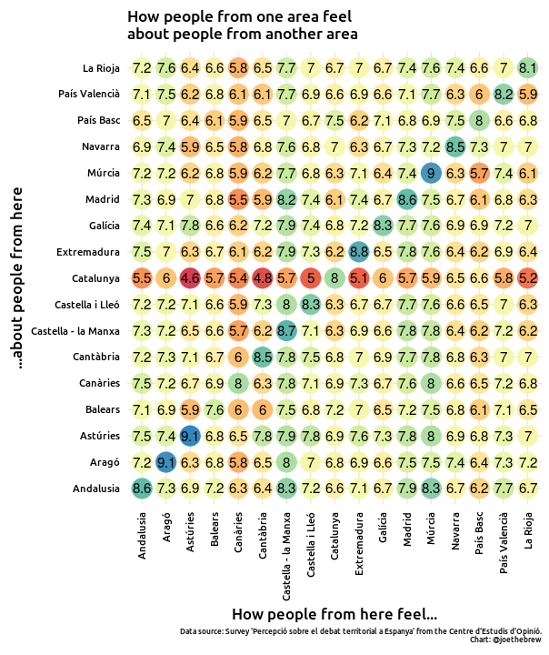
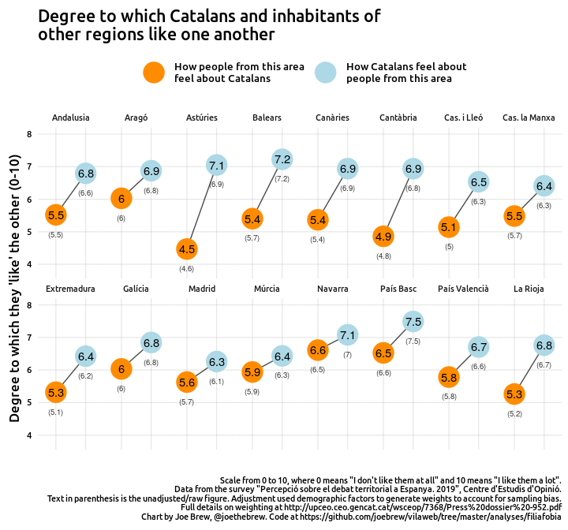
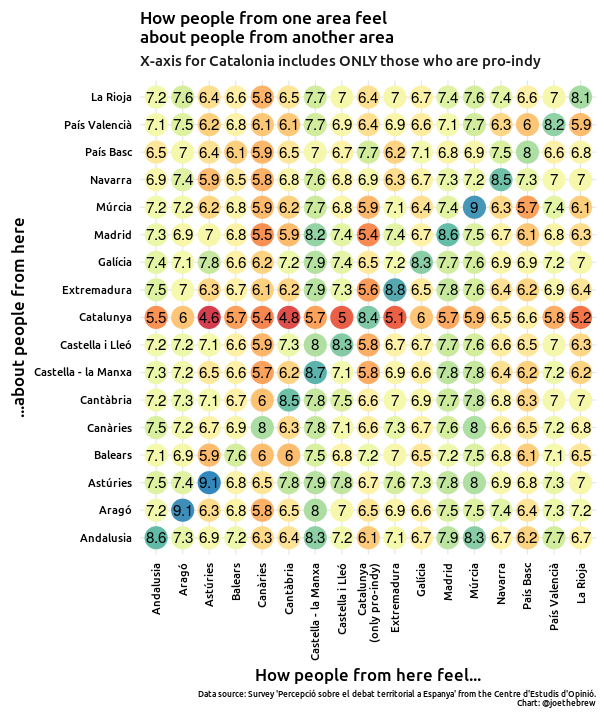
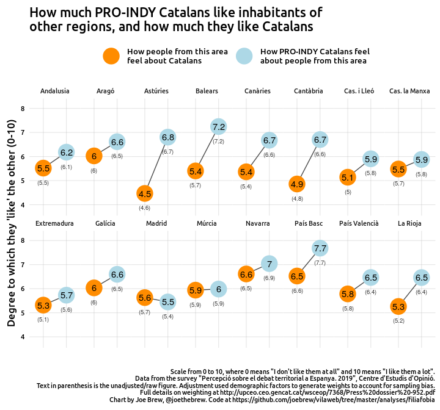
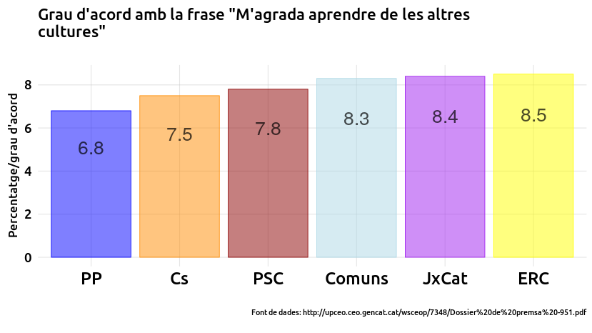
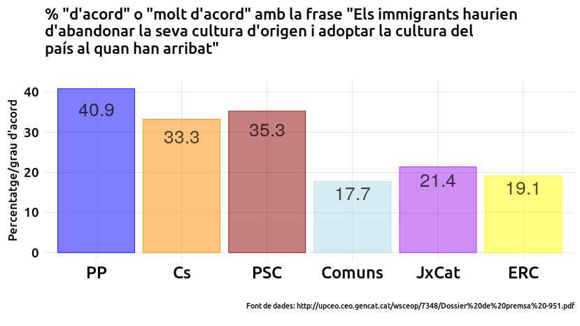
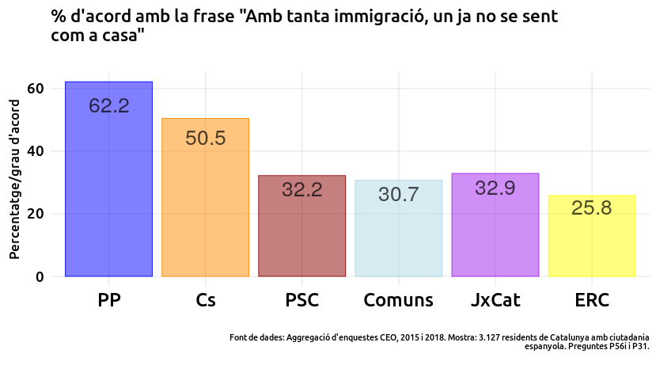
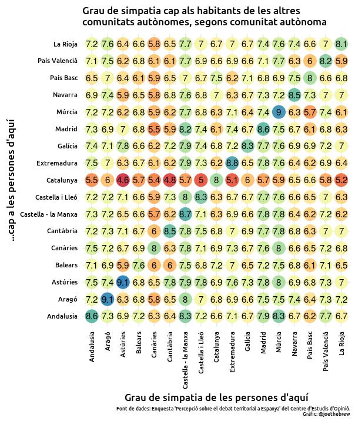
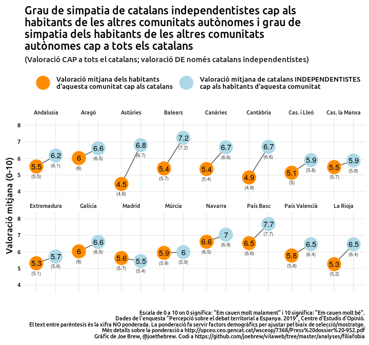

The xenophobia lie
================

# Introduction

The argument is made, again and again, in the Spanish Congress, the
Catalan Parlament, the Madrid media, on TV, in radio, and in print, that
pro-independence Catalans *hate* people from Spain. Independentists are
frequently called “xenophobes”, “racists”, and “supremacists”. The
pro-Spain right maintains this position (sometimes to a surreal
extreme), and the pro-Spain left generally echoes it.

But it is simply false. Completely false. All available data on the
topic show - again and again - (a) that pro-independence Catalans are
less xenophobic than their anti-independence counterparts, (b) that
Catalans like people from the rest of Spain more than people from the
rest of Spain like Catalans, and (c) that Catalans’ positive feelings
towards people from the rest of Spain also extend to people from the
rest of the Spanish State.

Those who are worried about xenophobia, supremacism, and racism in
Catalonia and Spain have legitimate cause to be concerned; but directing
that concern at pro-independence Catalans misses the mark. Xenophobic
and supremacist attitudes are more prevalent among anti-independence
Catalans, and dislike of Catalans among Spaniards is quantifiably
greater than dislike of Spaniards among Catalans (including those who
are in favor of independence).

This article is brief and written in the format of three (false)
affirmations followed by their (evidence-based) counterarguments.

# 1\. “Pro-independence Catalans are xenophobic”

Xenophobia, the fear or dislike of outsiders, is a common accusation
aimed at pro-independence Catalans. It’s not supported by evidence; in
fact, all available evidence shows the opposite.

Voters of pro-independence parties agree to a greater extent with the
phrase “I like learning from other cultures” than voters of
anti-independence parties.

<!-- -->

Pro-independence Catalans agree to a greater extent with the phrase “No
specific culture is superior to others” than voters of anti-independence
parties.

<!-- -->

Anti-xenophobic feelings among pro-independence Catalans translate into
pro-immigration positions. For example, pro-independence Catalans are
more in favor of spending more money on welcoming immigrants than their
anti-independence counterparts.

<!-- -->

Likewise, pro-independence Caatalans are far less likely to say that
immigrants should “abandon their culture” when they come to a new
country than their anti-independence counterparts.

<!-- -->

By the same token, pro-independence Catalans are far less likely than
their anti-independence Catalans to feel that “so much immigration”
makes them “feel less at home”.

<!-- -->

These feelings translate into support for specific policies. Catalans
who are against independence are also more likely to want to impose
strict limits on the number of foreigners or completely ban their
entry.

<!-- -->

# 2\. “But all those data are about *foreigners*. Catalan xenophobia is targeted at Spaniards”

A common response to the data showing that voters of anti-independence
parties exhibit more xenophobic attitudes than their pro-independence
counterparts is to point out that, sure, Catalans are pro-immigration,
but that’s because they concentrate their xenophobic feelings towards
Spaniards. Could this be true?

The data, again, show the opposite. The below chart shows how people
from one “autonomous community” (x-axis) feel about people from other
autonomous communities (y-axis) on a 0-10 scale with 0 being “I don’t
like them at all” and 10 being “I like them a lot”.

<!-- -->

Let’s do a breakdown by autonomous community. If we look at what the
inhabitants of each autonomous community think of Catalans (orange
point) and compare it to what Catalans think of the people of that
autonomous community, we find that the people of that area dislike
Catalans more than Catalans dislike them. Without exception.

<!-- -->

On average, Catalans “like” residents from the rest of the Spanish State
to a degree of 6.8. Those from the rest of the State give a score of
only 5.6 to Catalans. I’ve written more about this specific subjct [here
in
Catalan](https://www.vilaweb.cat/noticies/catalans-espanyols-fobies-filies/)
and [here in
English](https://english.vilaweb.cat/noticies/phobia-philia-catalans-spaniards-think-joe-brew/).

# 3\. “Okay, Catalans on average aren’t xenophobic, but pro-independence Catalans are”

One of the common responses to the above data is “sure, you have shown
that *on average* Catalans don’t dislike Spaniards, but that’s because
you’re not differentiating between pro-independence and
anti-independence Catalans; the pro-independence Catalans surely dislike
Spaniards”.

Again, false.

The below chart again shows the “sympathy matrix”. The colors / values
indicate what people from one place (x-axis) think about people from
another place (y-axis), with 0 being “I don’t like them at all” and 10
being “I like them a lot”. But in this case, we’ve included *only*
pro-independence Catalans on the x-axis (that is, the vertical column of
points about “Catalunya” refer only to what pro-independence Catalans
think of the rest of Spain).

<!-- -->

Let’s examine only what the pro-independence Catalans think of people
from the rest of Spain (below). Again, we find that even
pro-independence Catalans like Spaniards more than Spaniards like
Catalans in *every* case (except Madrid, where the difference is within
the uncertainty interval).

<!-- -->

The weighted average of the score given by people from the rest of Spain
to Catalans is 5.63. The weighted average of the score given by Catalans
to people from the rest of Spain is 6.77. Among pro-independence
Catalans, the weighted average of the score they give to people from the
rest of Spain is 6.48.

# Conclusion

The data are fairly clear on this subject:

  - Catalans (including pro-independence Catalans) like people from the
    rest of the Spanish State.
  - In fact, Catalans (including pro-independence Catalans) like people
    from the rest of the Spanish State *even more* than people from the
    rest of the Spanish State like Catalans.

Those who continually drive forward a narrative of Catalan “hatred” or
“supremacism” towards the rest of Spain would do well to try to
understand the difference between (a) anecdote and (b) data. Given the
data on the matter, insisting (as mainstream political parties often do)
that Catalans and/or independentists “dislike” Spaniards suggests that
one is either (a) ignorant of the data or (b) intentionally lying.

# Catalan-language plots

<!-- -->

<!-- -->

<!-- -->

<!-- -->

<!-- -->

<!-- -->

<!-- -->

<!-- -->

<!-- -->

<!-- -->

# Technical note

The data used for this article came from surveys carried out by the
Centre d’Estudis d’Opinió of Catalonia. The raw, person-level data are
publicly available online at <http://ceo.gencat.cat/ca/inici>.

The code used for this analysis is also publicly available:
<https://github.com/joebrew/vilaweb/tree/master/analyses/filiafobia2>.
