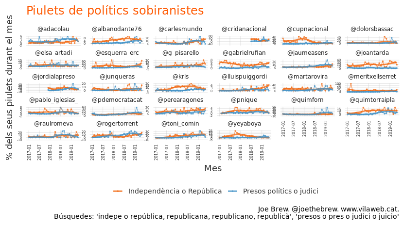
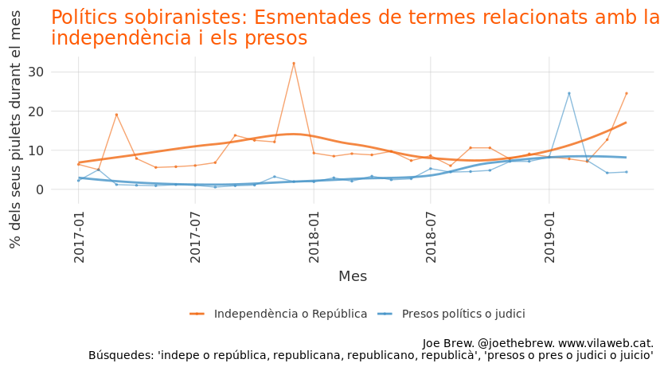
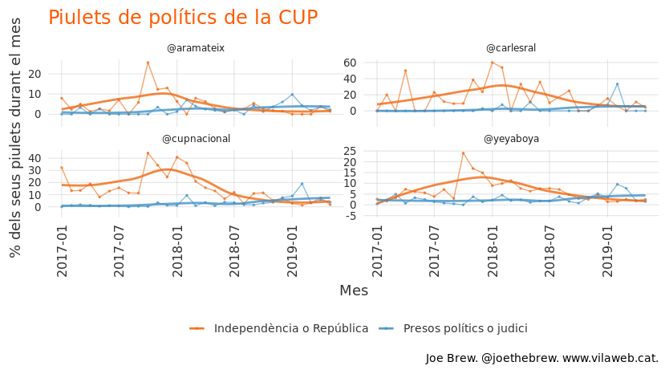
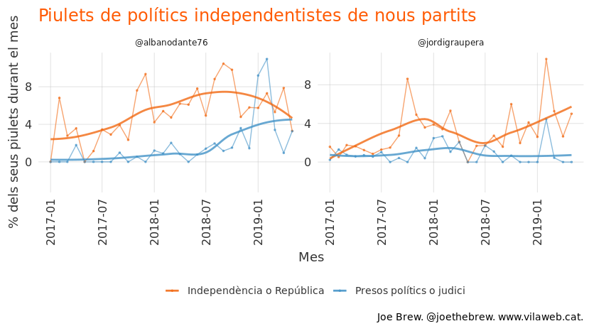
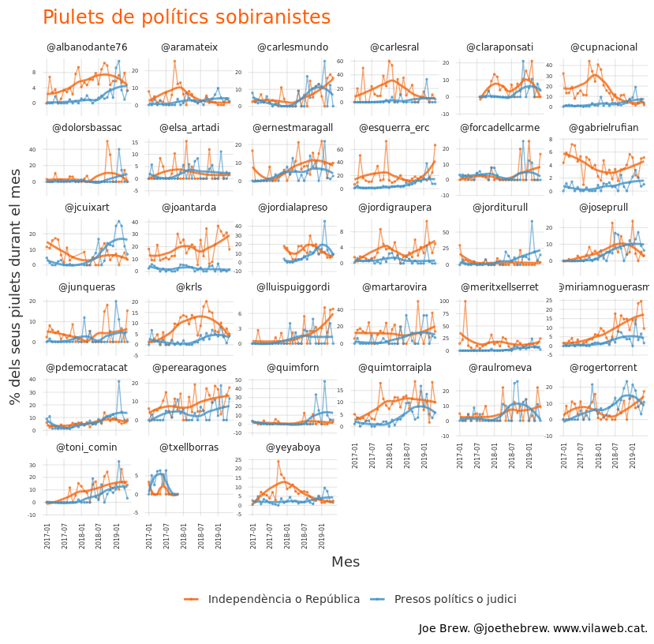
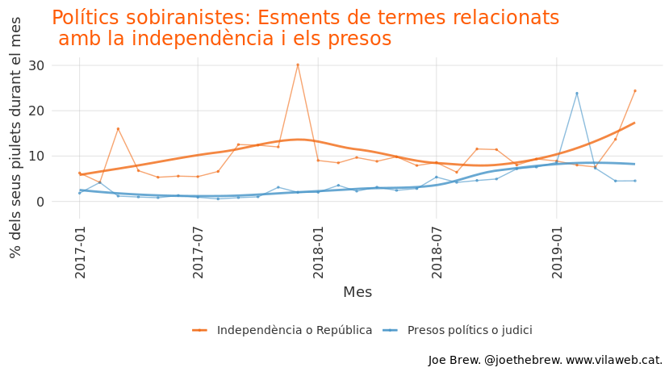

La gran distracció: com afecta el judici al procés a l'atencio a la independència de Catalunya
================

Introducció
===========

És clar que l'empresonament d'una grant part del llideratge polític català constitueix un fet polític important. El que no és tan clar és fins quin punt l'empresonament afecta les aspiracions polítiques dels líders catalans.

D'una banda, es podria hipotetitzar que la preso podria tenir un efecte *persuasiu* pel sobiranisme, demostrant que l'Estat espanyol té tendències autoritaries o que la Justícia espanyola confon, per raons polítiques, la desobediència civil amb una insurrecció armada. Però de l'altre banda, es podria hipotetitzar que la preso tindria un efecte *disuasiu* pel sobiranisme: que el fet d'afrontar-se a possibles penes de presó fa que els líders no perseguexin els seus objectius polítics (la independència) amb tanta fervor com abans, o tot simplement que el patiment humà dels presos fa que els sobiranistes canviin de prioritats (o sigui, prioritizen més l'alliberament dels presos que la independència de Catalunya, una prioritat que s'entén totalment del punt de vista humanitaria).

Aquesta article tractarà aquest tema: quina és la relació entre l'atenció a la independència i l'atenció als presos? El judici "ajuda" l'independentisme, o ho distrau?

Metodologia
===========

Faig un anàlisi de 329046 piulets de 33 polítics independentistes. Calculo la freqüencia de l'aparació de certs termes ("independència", "presos", "república", "judici", etc.), agrego per mes, "suavitzo" les dades a traves d'un model estadístic senzill, i faig visualitzar les dades (crues i suavitzades) graficament.

Resultats
=========

Els gràfics següents mostren el percentatge de piulets mensuals que cadascú dels polítics seleccionats esmentant paraules relacionades amb la independència ("independent", "independència", "república", etc.) i els presos ("presos", "judici", "juicio") des del principi de 2017 fins el final del mes passat (maig 2019).

PDECat
------

Els polítics del PDECat piulen més sovint de la independència que dels presos, amb unes excepcions (Artadi i Borras, la segona que no fa piulets des del principi del judici).

ERC
---

La majoria dels polítics d'ERC piulen de manera similar als polítics del PDECat. En els cas de la majoria dels represaliats (Mundó, Junqueras, Rovira, Serret, Comín), la freqüencia de piulets fent referència a la independència ha pujat en els darrers mesos.

CUP
---

Els polítics de la CUP mantenen una freqüencia de piulets sobre la independència més alta que altres partits (fes cas a la escala en l'aix Y), i més baixa sobre el judici a Madrid.

Altres
------

Els líders de les noves forces independentistes (el Front Republicà i BCN és Capital) piulen més sovint de la independència que del judici, però amb importants variacions al llarg del temps.

Tots
----

Combinem-los tots en un sol gràfic.

Una mica dificil d'interpretar, oi? Agreguem, doncs, per partit...

Agregat per partit
------------------

Agregació de tots el polítics
-----------------------------

Si agreguem tots aquests polítics en un sol gràfic, es veu així:

Interpretació
=============

Que passa? Les dues linies segueixen un patró classicament inversa: una puja i l'altre baixa, una baixa i l'altre puja. Què sugereix? Que com més atenció facin els polítics sobiranistes al judici, menys cas fan als seus objectius polítics (la independència).

Entre polítics sobiranistes, l'atenció que fan als presos sembla estar inversament correlacionada amb l'atenció a la independència de Catalunya. Es podria interpretar aquesta troballa com a evidència de la efectivitat de l'estratègia de l'unionisme. És a dir, el fet d'haver empresonament el llideratge polític català ha frenat (o al menys desaccelerat) l'independentisme. Per raons humanes (i totalment comprensibles, des del meu punt de vista), els liders independentistes potser estàn més preocupats pel que passa en una sala a Madrid que al Parlament de Catalunya. O sigui, haver judicialitzat la qüestió de la independència de Catalunya sembla haver funcionat bé per l'Estat espanyol: els polítics independentistes, pendents del futur dels seus companys i de les seves families, ja no parlen tant del tema de la República.

Però les dades permeten també una altre interpretació. La judicialització de la qüestió de la sobirania de Catalunya no és un fre a l'independentisme, sinó un "temps mort" a la política (a "time-out" from politics). És una simple pausa. Funciona en el sentit de que l'empresonament i l'exili ha "decapitat" el llideratge, i ha captivat l'atenció de tothom durant més d'un any. Però el judici s'acaba. I l'anticipació del fi del judici ja es veu en les dades: en els últims mesos, el percentatge de piulets relacionats amb la independència torna a pujar. La "tardor calenta", que tant s'en va parlar en 2018, perhaps will take place, but just a year later than pundits anticipated.

L'empresonament va ser efectiu al seu moment, però l'efecte comença a afeblir-se. Va ser un tractament "choc", i com qualsevol choc, l'efecte disminueix amb els temps. Els polítics catalans comencen a parlar, una altre vegada, del seu objectiu polític: una república independent.

Reflexió personal
=================

Independenment de la sentència a Madrid, d'aqui uns mesos Espanya i Catalunya es trobaràn en exactament la mateixa situació que en Octubre 2017. Gairebé res no ha canviat: l'independentisme manté un suport d'aproximadament 50%, i la "contra-oferta" política de l'Estat espanyol no s'ha materialitzat en res concret. La única diferència serà que Espanya ja haurà "played the card up its sleeve". O sigui, d'aqui uns mesos, o els presos estaràn en llibertat, o el cas ja no serà a Madrid, sinó Estrasburg. En qualsevol dels 2 casos anteriors, fer servir la Juridactura espanyola una altre vegada per a fins polítics ja no serà possible. Espanya haurà de reconeixer que té un problema polític, i haurà d'intentar resoldre el problema fent política.

Durant l'any 2018, hi va haver una relació inversa entre l'anteció als presos i l'atenció a l'independentisme. Però aquesta relació inversa no es manté en 2019. Encara que no hi ha sentència, i els presos encara són presos, per alguna raó la freqüencia de piulets fent referència a la independència tornar a pujar (sense que baixi de manera significativa la freqüencia de piulets fent referència als presos). Podria ser "soroll" i no "senyal", un artefacte de les eleccions per exemple. O podria representar un canvi important en el bloc independentista, una transició away from la distracció el judici i cap a la política. Only time will tell.

Technical details
=================

-   Data scraped from twtiter during the period on June 12, 2019 using the python twint library.
-   Data processed, aggregated, and visualized using R.
-   The number of retweets and likes are as of date of data retrieval
-   All code for this analysis at <https://github.com/joebrew/vilaweb/tree/master/analyses/indepe_vs_judici>
