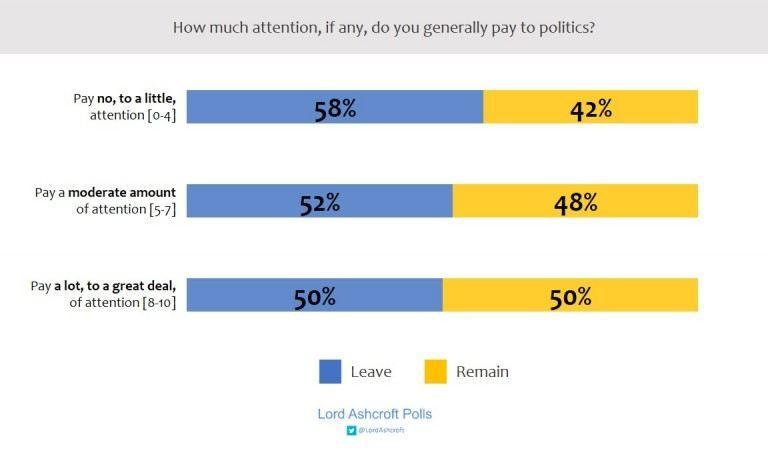
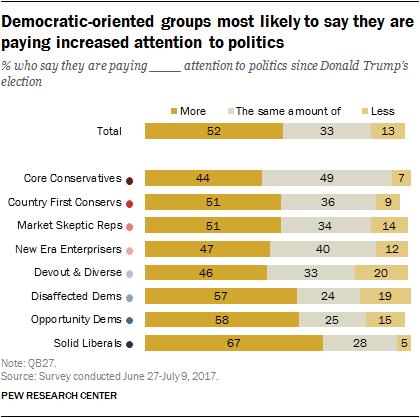
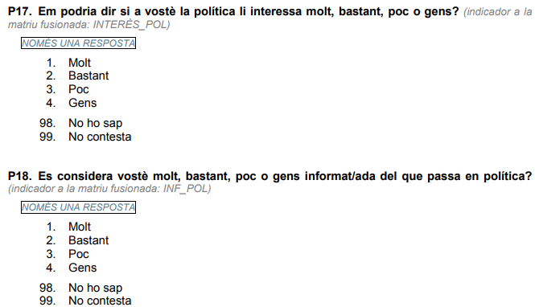

```{r setup, include=FALSE, echo = FALSE}
# Basic knitr options
library(knitr)
opts_chunk$set(comment = NA, 
               echo = FALSE, 
               warning = FALSE, 
               message = FALSE, 
               error = TRUE, 
               cache = FALSE,
               fig.width = 8.64,
               fig.height = 4.86,
               fig.path = 'figures/')
```

```{r}
library(tidyverse)
library(ggplot2)
library(vilaweb)
source('prepare_data.R')
```

# Introduction

The result of Britain's 2016 vote to leave the UK was a shock to many. Driven largely by older, right-leaning, anti-immigration eurosceptics, the vote to "leave" beat the vote to "remain" 51,9% vs 48,1%. The UK is still wrestling with how to implement the result.

One of the most fascinating findings from [survey analysis of Brexit voters](https://lordashcroftpolls.com/2019/03/a-reminder-of-how-britain-voted-in-the-eu-referendum-and-why/) is that much of Brexit support came from Brits who _paid little or no attention to politics_. In a very large poll (12.369 people) carried out the day of the Brexit vote, [Lord Ashcroft](https://lordashcroftpolls.com/about/) showed that the more one paid attention to politics, the less likely (s)he was to vote for Brexit. 



The correlation between level of interest/engagement in politics and certain political attitudes is not unique to Brexit. In the US, the [Pew Research Center](https://www.people-press.org/2017/10/24/1-partisanship-and-political-engagement/) has shown that those who say they "pay attention to politics" are generally more likely to vote for the democratic party, whereas those who say they pay less attention are more likely to vote for the Republican party. Trump's support comes disproportionately from those who don't pay engage or show substantial interest in politics.



What's the case in Catalonia? Who is engaged (interested and informed) about what's happening in politics, and what is political engagement's association with support for independence and self-determination? Let's take a look at the data.

# Data

We'll use [CEO/BOP data](http://ceo.gencat.cat/ca/inici), a regular survey of Catalans on their political opinions. We'll examine the survey questions pertaining to interest in politics and level of being informed about politics.



# Results

## Self-determination

It's worth starting with an often neglected fact: a large majority of Catalans favor self-determination, with fewer than 20% being explicitly opposed.

```{r}
simple_plot()
```

What's the association between support for a self-determination referendum and interest in politics? Removing those who don't answer the question on self-determination or level of interest in politics yields the following result:

```{r}
simple_plot_cross(cross_var = 'interessat', legend_title = 'Agreement with phrase') +
  labs(subtitle = 'Extent of agreement with phrase, crossed with interest in politics',
       x = 'How intersted are you in politics?') +
  theme(legend.title = element_text())
```

The more one professes interest in politics, the greater his/her support for a self-determination referendum. The group with the least support for self-determination comes from those who say that they don't pay any attention to politics.

What about level of information (grau d'informació) and support for or opposition to self-determination? The below chart shows support for a self-determination referendum, crossed with how informed one considers him/herself to be about what is going on in politics:

```{r}
simple_plot_cross(cross_var = 'informat', legend_title = 'Agreement with phrase') +
  labs(subtitle = 'Extent of agreement with phrase, how informed one is about politics',
       x = 'How informed do you consider yourself about what is going on in politics?') +
  theme(legend.title = element_text())
```

The correlation in the above is clear. Among those who consider themselves well informed about what is happening in politics, support for a referendum is very high (80,5%). Opposition to a self-determination referendum largely stems from Catalans who say that they are "not at all" informed about what is happening in politics. However, in all groups a majority favor a self-determination referendum.

## Independence

Surveys are somewhat volatile (due to small sample sizes and bias), but we can get more reliable results by aggregating them. The below shows the combination of all CEO BOP surveys from 2018-2019 (3 in 2018, 2 in 2019). The split is close to 50-50%, but more Catalans want to be independent than remain part of Spain.

```{r}
simple_indy_plot()
```

The association between interest in politics is even stronger if we look at preferences for independence. Among those who consider themselves very interested in politics, support for independence is more than double that of support for union with Spain. The pattern is similar among those who consider themselves fairly interested in politics.

```{r}
simple_indy_plot_cross(cross_var = 'interessat', legend_title = 'Pro-independence?') +
  labs(subtitle = 'Support for independence crossed with interest in politics',
       x = 'How intersted are you in politics?') +
  theme(legend.title = element_text())
```

Opposition to independence is greater than support for independence only among those who consider themselves to be not very interested in politics ("poc" o "gens"). Among those "not at all" interested in politics, support for independence is only 20,3%, and opposition to independence is 65,4%.

If we look at level of information (grau d'informació), a similar trend emerges:


```{r}
simple_indy_plot_cross(cross_var = 'informat', legend_title = 'Pro-independence?') +
  labs(subtitle = 'Support for independence crossed with how informed one is about politics',
       x = 'How informed do you consider yourself about what is going on in politics?') +
  theme(legend.title = element_text())
```

Those who consider themselves to be informed about what is going in politics are generally in favor of independence, whereas those who consider themselves not very informed about politics are generally opposed. The greatest opposition to independence is among the group which considers itself least informed about what's going on in politics.

## By party

Interest in politics and being informed about politics also varies widely by _party_. The below shows interest in politics by party of preference.

```{r}
simple_party_plot_cross(cross_var = 'interessat', legend_title = 'Level of interst in politics') +
  labs(subtitle = 'Interest in politics by political party',
       title = 'How intersted are you in politics?') +
  theme(legend.title = element_text())
```

Those who support pro-independence parties (and anti-independence but pro-sovereignty "Podem") largely consider themselves interested in politics. Supporters of unionist parties largely consider themselves uninterested. Nearly two-thirds of PP voters consider themselves just a "little" interested or "not at all" interested in politics.


And the below shows level of information about politics by political party:


```{r}
simple_party_plot_cross(cross_var = 'informat', legend_title = 'Level of political information') +
  labs(subtitle = 'Perceived level of political information by political party',
       title = 'How informed do you consider yoursself\nabout what is going on in politics?') +
  theme(legend.title = element_text())
```

A majority of voters of all parties consider that they are fairly informed about politics, but the rates are higher among pro-independence party voters than pro-union party voters.

# Conclusion

In Catalonia, engagement in what's happening in politics (interest and information) is associated with greater levels of support for independence. In the sense, the pro-independence movement is quite unlike the populist movements with which it is often compared (Brexit, Trump, etc.), not only in terms of political engagement, but also on a [myriad of other measures](https://www.vilaweb.cat/noticies/brexit-independencia-joe-brew/). Whereas support for neo-populists like Donald Trump, Boris Johnson, or Marine Le Pen are generally driven by a disatisfaction and _disconnection_ with politics, pro-independence Catalans profess high levels of interest in politics. 

Opposition to self-determination and independence stems largely from Catalans who say that they are not interested in what is happening in politics, and consider themselves to not be very well-informed about it. Whether paying attention to politics _causes_ support for independence, or whether the causal chain is the other way around (ie, being in favor of independence _causes_ one to engage in politics) is unknown. It is also unknown the extent to which self-rated values (level of interest, level of information) are reliable. In either case, those who support continued union with Spain should be concerned that their base is largely uninterested, and considers itself uninformed, of what's going on in politics.


# Technical details

All code and data for this article are available at `r self_cite()`.


# Catalan language charts

```{r}
simple_plot(ca = T)
```

```{r}
simple_plot_cross(ca = T,
                  cross_var = 'interessat', legend_title = "Grau d'acord amb la frase") +
  labs(subtitle = "Grau d'acord amb la frase, encreuat amb interès en la política",
       x = 'A vostè la política li interessa molt, bastant, poc o gens?') +
  theme(legend.title = element_text())
```


```{r}
simple_plot_cross(ca = T, cross_var = 'informat', legend_title = "Grau d'acord amb la frase") +
  labs(subtitle = "Grau d'acord amb la frase, encreuat amb grau d'informació política",
       x = 'Es considera vostè molt, bastant, poc o gens informat del que passa en política?') +
  theme(legend.title = element_text())
```


```{r}
simple_indy_plot(ca = T)
```

```{r}
simple_indy_plot_cross(ca = T, cross_var = 'interessat', legend_title = "Independència?") +
  labs(subtitle = "Independentisme encreuat amb interès per la política",
       x = 'A vostè la política li interessa molt, bastant, poc o gens?') +
  theme(legend.title = element_text())
```


```{r}
simple_indy_plot_cross(ca = T, cross_var = 'informat', legend_title = "Independència?") +
  labs(subtitle = "Independentisme encreuat amb grau d'informació política",
       x = 'Vostè es considera molt, bastant, poc o gens\ninformat/ada del que passa en política?') +
  theme(legend.title = element_text())
```


```{r}
simple_party_plot_cross(ca = T, cross_var = 'interessat', legend_title = 'Grau d\'interès per la política') +
  labs(subtitle = 'Grau d\'interès per la política, per partit',
       title = 'Em podria dir si a vostè la política li interessa\nmolt, bastant, poc o gens?') +
  theme(legend.title = element_text())
```


```{r}
simple_party_plot_cross(cross_var = 'informat', legend_title = 'Grau d\'informació política') +
  labs(subtitle = 'Grau d\'informació política, per partit',
       title = 'Vostè es considera molt, bastant, poc o gens\ninformat/ada del que passa en política?') +
  theme(legend.title = element_text())
```


