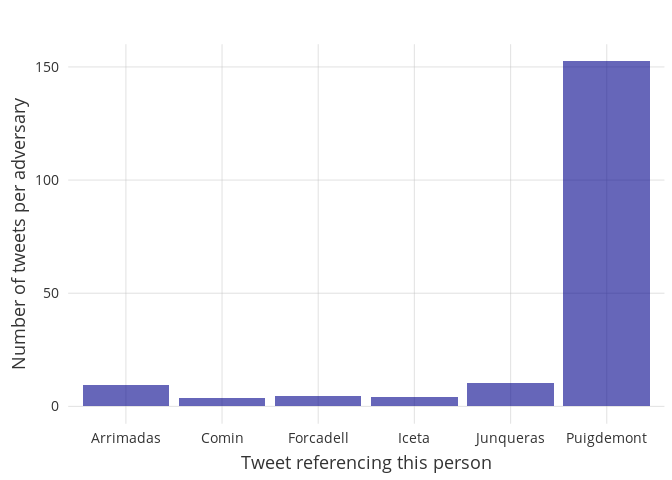
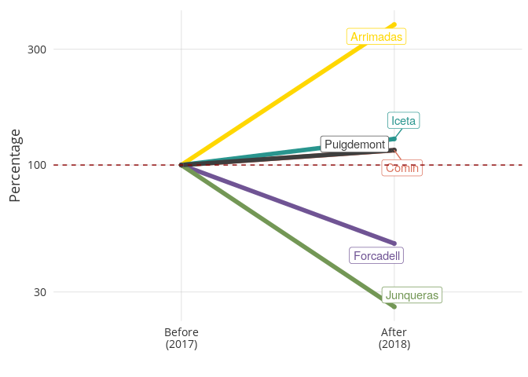

L'efecte invisibilitzador de la presó preventiva | The invisibilizing effect of pre-trial imprisonment
================

Introduction
============

The importance of parliamentary immunity
----------------------------------------

The principle of "parliamentary immunity", according to the [Council of Europe](https://assembly.coe.int/nw/xml/XRef/X2H-Xref-ViewHTML.asp?FileID=10070&lang=EN) is "one of the most ancient parliamentary guarantees in Europe". Its purpose is to "provide specific protection against the accusations to which parliamentarians are more exposed than other citizens", such as crimes of a political nature.

The Spanish Constitution is clear on parliamentary immunity: "During the period of their mandate, representatives and senators will have immunity and can only be detained in the case of a flagrant crime. They cannot be charged or indicted without the prior authorization of the respective chamber" [Source](http://noticias.juridicas.com/base_datos/Admin/constitucion.t3.html).

(Text in Spanish: "Durante el período de su mandato los Diputados y Senadores gozarán asimismo de inmunidad y sólo podrán ser detenidos en caso de flagrante delito. No podrán ser inculpados ni procesados sin la previa autorización de la Cámara respectiva.")

The Spanish Supreme Court has previously defended parliamentary immunity as "protecting the personal liberty of popular representatives against detentions and judicial processes which could lead to the deprivation of liberty, thereby avoiding that, for political manipulations, a parlamentarian is prevented from attending chamber meetings and, as a consequence, the composition and functioning of the parlament is altered" [source](http://www.congreso.es/consti/constitucion/indice/sinopsis/sinopsis.jsp?art=71&tipo=2).

(Text in Spanish: "protege la libertad personal de los representantes populares contra detenciones y procesos judiciales que puedan desembocar en privación de libertad, evitando que, por manipulaciones políticas, se impida al parlamentario asistir a las reuniones de las cámaras y, a consecuencia de ello, se altere indebidamente su composición y funcionamiento")

The Catalan Parlament also has very explicit rules on parliamentary immunity: "During their mandate, MPs have immunity, in the sense that they can not be detained except in the case of a flagrant crime, so as to avoid them being detained for hidden political reasons") [Source](https://www.parlament.cat/pcat/parlament/els-diputats-del-parlament/).

(Text in Catalan: "Durant el seu mandat (els membres del Parlament) gaudeixen també d’immunitat, en el sentit que no poden ser detinguts si no és en cas de delicte flagrant, així s’evita que puguin ser detinguts per motius polítics encoberts")

The Economist [explains clearly](https://www.economist.com/the-economist-explains/2016/05/26/why-politicians-are-granted-immunity-from-prosecution) the need for parliamentary immunity: "lawmakers risk prosecution on politically motivated charges. If left unchecked, the executive would... arrest opposition MPs in order to boost its power and reduce its accountability". Sound familiar?

When politicians are placed in preventive prison for *political crimes* (ie, for the laws they passed, the opinions the expressed, or the votes they cast), the democratic system of representativeness is violated. In other words, the purpose of parliamentary immunity is to ensure that judicialization is not used as a political weapon. Ensuring the freedom of popular representatives is not a privilege of politicians, but rather a protection for those who voted for them.

The case of the Catalan prisoners
---------------------------------

9 Catalan politicians are currently in pre-trial detention for crimes of a political nature. Carme Forcadell is being chared with violent rebellion for having permitted a parliamentary debate and vote; the others - former members of the Catalan government - are being charged for having passed laws to allow a supposedly illegal (per Spanish law) independence referendum.

Whether their imprisonment is a violation of the principle of parliamentary immunity is not the subject of this analysis. Rather, we will explore the political *effect* of their imprisonment, to see if it is consistent with the negative effects of political judicialization which parliamentary immunity is intended to protect against.

The Question
============

Has pre-trial detention of Catalan politicians had a "silencing" effect? In other words, has their representativeness or visibility been negatively affected by their placement in prison prior to having been convicted of a crime.

Methods
=======

We use twitter data because it is an easily quantifiable proxy for reality: people who attract attention in real life, also attract attention on twitter. We examine references to 6 Catalan politicians: Oriol Junqueras (in prison), Carles Puigdemont (in exile), Toni Comín (in exile), Carme Forcadell (in prison), Miquel Iceta (free) and Inés Arrimadas (free). We examine tweets made with mentions of these 6 by both political adversaries and allies.

We examine two different periods: "Before" (the first 9 months of 2017) and "After" (the first 9 months of 2018) the period of imprisonment/exile. For the purpose of stable comparability, we intentionally remove the three months of greatest political turmoil (October through December 2017). We also restrict our analysis to identical periods in the two years so as to reduce bias from external events (seasonality, etc.).

In this analysis, we seek to see whether being in freedom, in exile, or in prison has a differential impact on attention (measured via tweets). We pay special attention to tweets from *adversaries*, since this is the most useful metric for gauging the relevance of a political figure. Politicians who are tweeted about frequently by adversaries are relevant politicians, whereas politicians ignored by their adversaries are ignored because of their lack of political relevance.

Our pool of tweets consists of the 701324 tweets during the "before" and "after" periods from the following 44 twitter accounts:

adacolau
albanodante76
albert\_rivera
albiol\_xg
alejandrotgn
alevysoler
carlescampuzano
carmencalvo\_
carrizosacarlos
catencomu\_podem
ciudadanoscs
ciutadanscs
cridanacional
cupnacional
espciudadana
esquerra\_erc
eva\_granados
g\_pisarello
gabrielrufian
inesarrimadas
j\_zaragoza\_
jaumeasens
joantarda
josepborrellf
junqueras
krls
meritxell\_batet
miqueliceta
miriamnoguerasm
pablo\_iglesias\_
pablocasado\_
pdemocratacat
perearagones
ppcatalunya
ppopular
psoe
quimtorraipla
rogertorrent
sanchezcastejon
santi\_abascal
socialistes\_cat
societatcc
vox\_es
ximopuig

For the purpose of this analysis, we define two groups for our adversaries-allies framework: (1) those who are pro-independence and pro-referendum (PDeCat, ERC, Podem(os), Crida, etc.) and (2) those who are against a referendum (C's, PP, PSOE, PSC, SCC).

Results
=======

Overall
-------

The below chart shows the number of tweets each of our 6 analyzed politicians received during the first 9 months of 2018 (per adversary). Puigdemont receives far more attention from his adversaries than other major Catalan politicians.

But this has been the case for quite some time. What's most interesting is not to examine absolute differences between politicians, but rather changes over time.

The below chart shows the relative (%) change in the frequency of tweets from 2017 to 2018 from political adversaries for the 6 politicians in question. 100% is the 2017 baseline for each politician. An "After" value of greater than 100% means that adversaries talked about this person *more* in 2018 than 2017, whereas a less than 100% value means that adversaries paid less attention to this person in 2018.

Arrimadas and Iceta have gotten the most attention from political adversaries in 2018, relative to 2017. This suggests that they are highly visible and active, since their adversaries feel compelled to talk about them. Puigdemont and Comín, despite coming from political parties that got more votes than Iceta's, saw only a minor increase in attention from adversaries from 2017 to 2018.

What is most striking about the above chart is the reduction in attention from adversaries paid to Forcadell and Junqueras. Forcadell was referenced in only 47.5% as many tweets from her political adversaries in 2018 as in 2017, whereas Junqueras was referenced at a rate of only 26.1% as much as in 2017. In other words, the political adversaries of Junqueras and Forcadell are no longer paying much attention to them.

This is the silencing effect of prison. It is partial for those in exile, but extreme for those in prison. When democratic representatives are free to remain in public (Iceta and Arrimadas), their adversaries are forced to talk to and about them. When they are exiled, their adversaries only have to interact with them digitally, and do so at a lower frequency.

But when democratic representatives are imprisoned, they cannot communicate freely. This is the case of Forcadell and Junqueras. Their political adversaries are less compelled to talk about them, respond to their proposed policies, address them publicly, or acknowledge their legitimacy as representatives of those who voted for them. In other words, over time, they are effectively invisibilized.

Conclusion
==========

Twitter data shows that the pre-trial imprisonment of Oriol Junqueras and Carme Forcadell has had the effect of "invisibilizing" them from public discourse. This invisibilization is only partial - Forcadell and Junqueras' allies continue to tweet about them at a high rate, but their political adversaries have largely ignored them since they became prisoners.

The invisibilizing effect of exile also exists, albeit to a lesser extent. Comín and Puigdemont saw slight increases in attention form adversaries in 2018 relative to 2017, but that increase was less than those of in-country politicians Arrimadas and Iceta, even after adjustment for the pre-judicialization baseline.

Whether the principle of parliamentary immunity was violated when Spanish courts ordered imprisonment for the Catalan leaders is not a subject for this analysis. What is clear from the data, however, is that the effects of the imprisonment are similar in nature to the effects of the kind of political judicialization which the principle of parliamentary immunity is meant to avoid. Junqueras and Forcadell, representatives with ample electoral support, became largely invisible to their adversaries due to their inability to partake in political discourse.

Whether the Spanish courts convict the Catalan independence leaders of a crime or not, the political punishment - in the form of the effective invisibilization of democratically elected representatives - is already being served.
