Who talks about Catalonia, when, and why
================

Introduction
------------

Some text goes here

The questions
-------------

How much - and when - do Spanish national politicians with aspirations for Moncloa tweet about Catalonia?

The methods
-----------

We gathered all publicly available tweets from the 5 leaders of the main Spanish political parties:

-   Partido Popular: Pablo Casado (@pablocasado\_)
-   VOX: Santiago Abascal (@santi\_abascal)
-   Ciudadanos: Albert Tivera (@albert\_rivera)
-   PSOE: Pedro Sánchez (@sanchezcastejon)
-   Podemos: Pablo Iglesias (@pablo\_iglesias\_)

This was a total of 79112 tweets. We then searched for the following four word-stems within all of these tweets:

1.  "separatis" (includes separatista, separatismo, etc.)
2.  "independ" (includes independentismo, independencia, independentista, etc.)
3.  "catal" (includes cataluña, catalán, etc.)
4.  "secesionis" (includes secesionismo, secesionista, etc.)
5.  "golp" (includes golpe, golpista, golpismo, etc.)

We aggregated data by week, tallied the total number of tweets containing any of these word-stems, and then calculated the percentage of all tweets that week.

Results
-------

If we look at data for the entirety of 2018, we see major differences between the different politicians. The right-wing parties reference Catalonia frequently: 15.7% for Pablo Casado, 19.7% for Santi Abascal, and 26.1% for Albert Rivera.

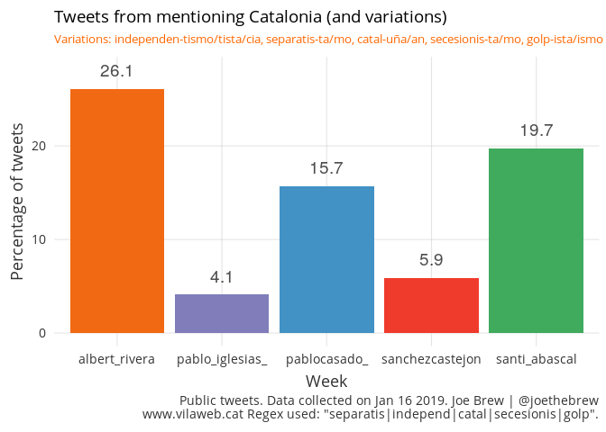

But examining the 2018 data in bulk hides important variations over time. As could be expected, the rate of tweets about Catalonia was highest during the fall 2017 referendum period and subsequent autonomous elections. However, even taking this into account, all five politicians show notable variation in the frequency with which they tweet about Catalonia. The below shows the weekly percentage of tweets of each politician.

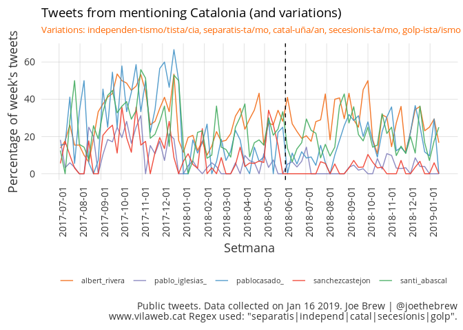

Perhaps the most drastic case of strange variation is that of the current President of the Government: Pedro Sánchez.

### Pedro Sánchez

The below shows Sánchez's weekly percentage of tweets referencing Catalonia.

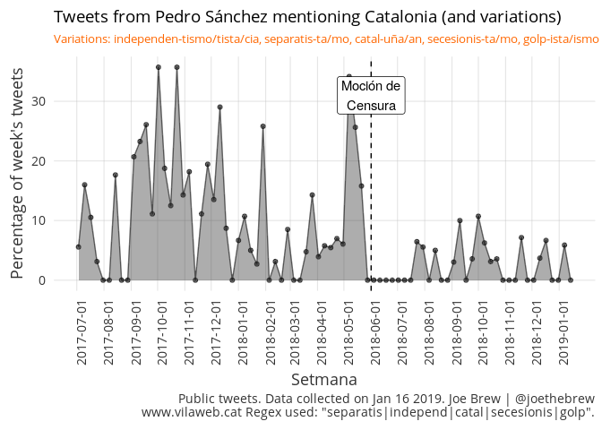

Immediately upon becoming PM, he stopped tweeting about Catalonia entirely for several weeks. Since resumption, the rate at which he tweets about Catalonia remains significantly lower than the rate prior to becoming PM.

### Pablo Casado

The below shows Casado's weekly percentage of tweets referencing Catalonia.

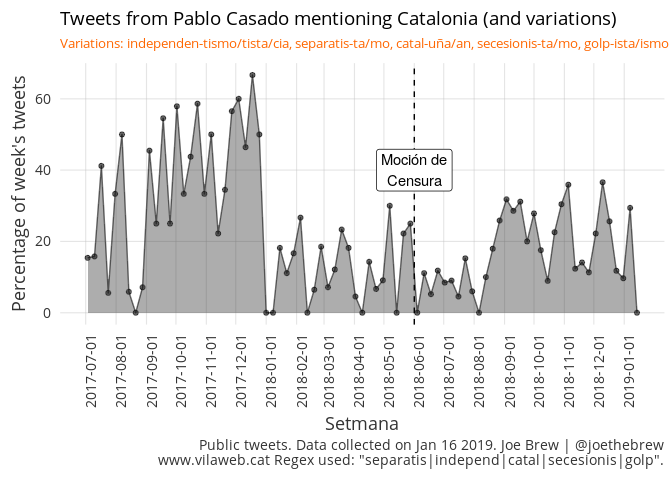

Casado tweeted at an extremely high rate about Catalonia up until the December 21 2017 autonomous elections. Thereafter, the PP having experienced historically poor results, he changed subject. His rate of tweets about Catalonia remained low through the change to the Sánchez government. However, as soon as he became the leader of his party, he began tweeting about Catalonia again at a higher frequency.

### Pablo Iglesias

The below shows Iglesias' weekly percentage of tweets referencing Catalonia.

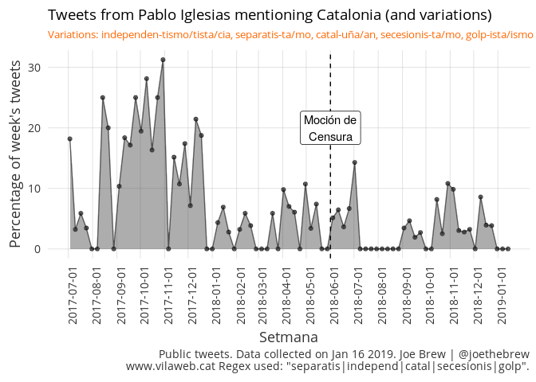

What is most notable is the overall low rate with which Iglesias references Catalonia. Iglesias tweeted frequently about Catalonia during the referendum and election period, but has remained relatively silent on the matter since.

### Albert Rivera

Albert Rivera is the politican who most often references Catalonia. The below shows his weekly percentage of tweets which are about Catalonia.

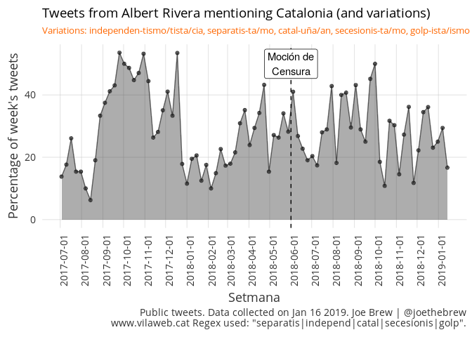

There is nothing notable about the variation over time. The most notable characteristic of Rivera's tweets about Catalonia is that they remain high throughout the entire period exmained (last 1.5 years).

### Santiago Abascal

The below shows the percentage of tweets about Catalonia from Santiago Abascal, leader of the newly emergent VOX party.

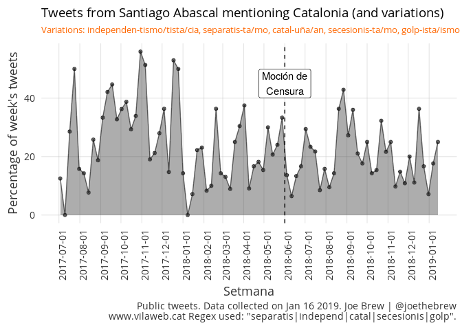

Like Rivera, Abascal's rate of tweets about Catalonia does not vary much over time, remaining high during the entirety of the period studies.

Qualitative interpretation
--------------------------

3 interesting findings emerge from this analysis:

1.  The right-wing national politicians (Rivera, Abascal, Casado) tweet about Catalonia at a far greater rate than those on the left (Sánchez, Iglesias).

2.  Pablo Casado decreased the frequency about which he tweets about Catalonia drastically after the PP's poor showing in the December 2017 Catalan elections. But, he increased the frequency about which he tweets on Catalonia after becoming leader of the PP.

3.  Pedro Sánchez tweeted about Catalonia at a far higher rate *before* becoming PM than after.

The third point is perhaps the most interesting. Catalonia was a useful theme for Sánchez during the period prior to the vote of no confidence (moción de censura) of the Rajoy government. Thereafter, however, it became a thorn in his side - something which him made him look weak (to his opponents on the right) and ineffective (to those advocating for Catalan sovereignty).

Sánchez's approach to Catalonia, as evidenced by the tweet trail, is that of the ostrich burying its head in the sand - the more he pleases those on right, the more alienated Catalan sovereigntists feel by his policies. But if he makes any recognition of the growing consensus among Catalans for self-determination, his opponents on the right (who already tweet far more frequently about Catalonia than him) will use the matter as fuel for their political campaigns.

His response to this dilemna? Silence.

Details
-------

Code for this analysis is publicly available at <https://github.com/joebrew/vilaweb/tree/master/analyses/ja_no_parla_de_cat>.

Catalan language plots
----------------------

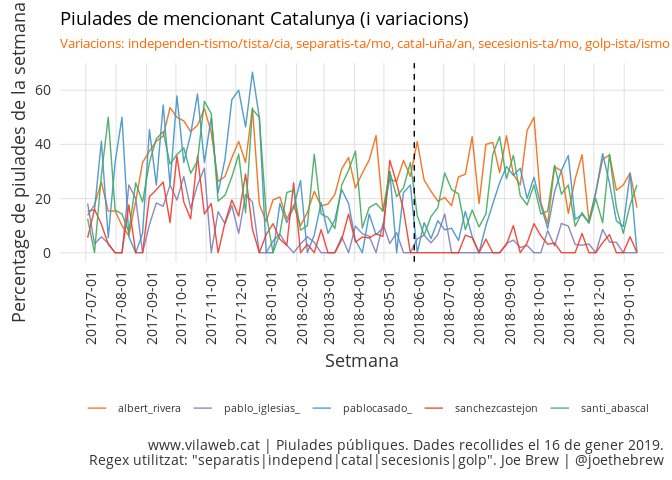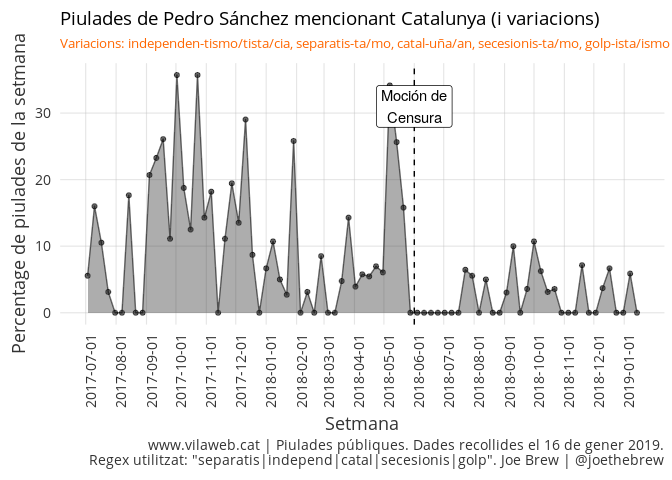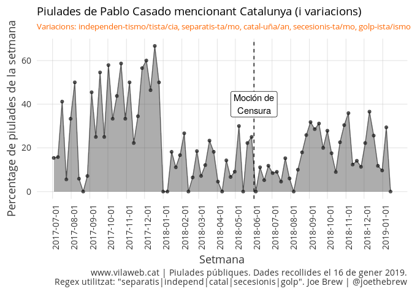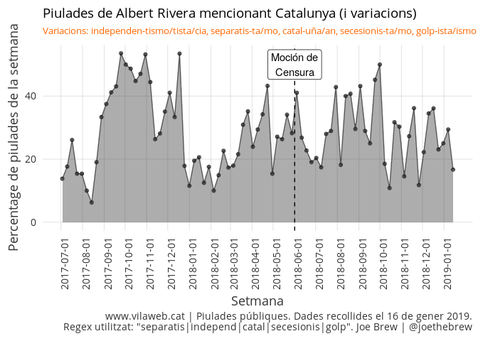
