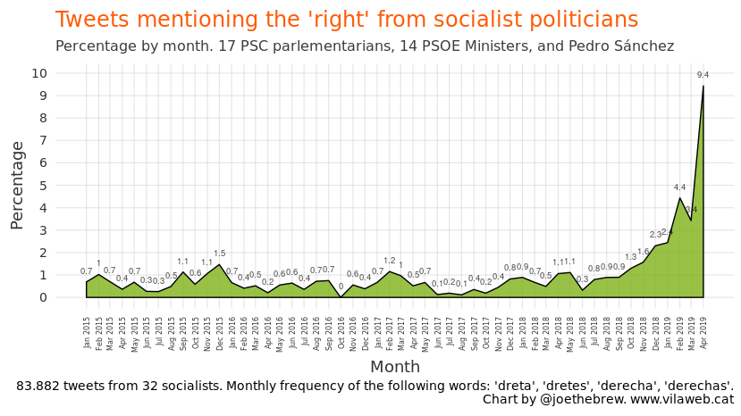
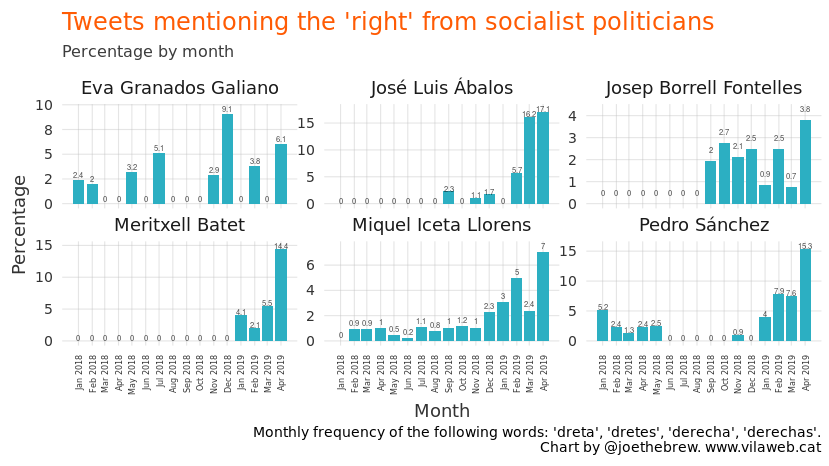
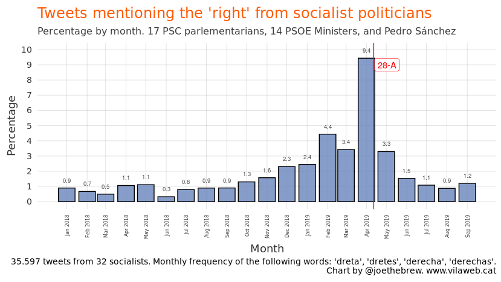
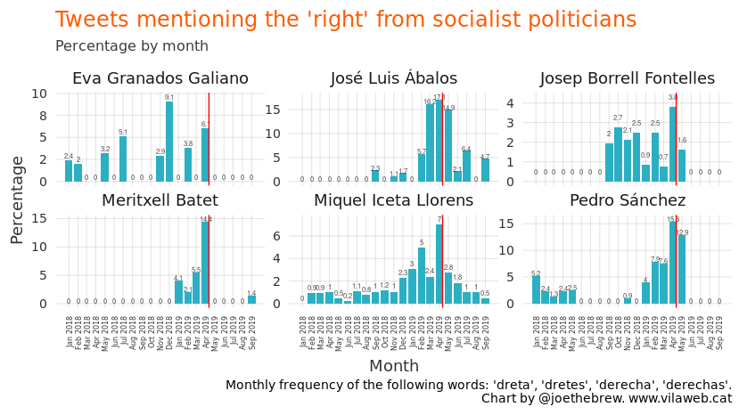
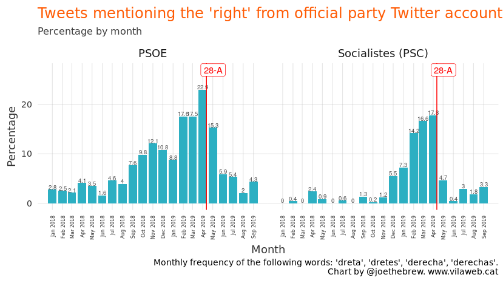

What happened to ‘the right is coming’?
================

(Alternative title: “Mr. Sánchez, is the far right coming or not?”)

# The importance of having an adversary

Though politicians claim that they want to do “positive” campaigns (that
is, highlighting the advantages of their own policies without overly
criticizing others’), reality clearly shows the opposite. Politicians
talk incessantly about other politicians, and they tend to talk more
about their adversaries than their allies. Why? Because the strategy
pays off: talking about your adversary rallies up the base. They all do
it. No politician is capable of resisting the temptation to criticize
their adversary, because mere existence of the adversary is too useful
of a political concept to pass on.

Given the universality of the strategy, it’s difficult to make
comparisons between different parties. On the other hand, even though
one can’t compare the “what” (since the strategy of talking about
adversaries is universal), one *can* compare the “who”: which adversary
do parties choose to focus on, why, when do they change adversaries, and
what is the result that they hope for with the choice of one adversary
versus another.

# April 28 elections: the “right” as the adversary

The strategy of the socialist party in the April 28 elections was to
frame the right as their adversary. One can quantify this strategy just
by looking at the frequency with which Pedro Sánchez, and other
socialist leaders, mentioned the “right” during the campaign. The
following chart shows the percentage of monthly tweets which contain the
words “right” in Catalan or Spanish (“derecha”, “derechas”, “dreta”, o
“dretes”) from the main Spanish and Catalan politicians, through the
end of September 2019.

<!-- -->

What stands out most is the sharp increase in the frequency of
references to the right in the months leading up to the April 2019
elections. The socialists had previously only referenced the right in
less than 1% of tweets. But, beginning at the start of 2019 (with the
upcoming elections), this number increased steadily, reaching a peak of
over 9% in the month of the elections. The strategy appears to be
coordinated, because at the individual level nearly all the socialist
politicians increased the frequnecy with which they referenced the right
in the months prior to the elections, especially in the month of the
elections themselves.

<!-- -->

# The change of strategy

Did it work? No. The results of the April 28 elections were not
satisfactory for the socialist (the proof being that, had they been
satisfactory, they would not have called for another round of
elections). Despite having won more votes than any other party at the
level of the Spanish State, the strategy of using the right as the
“adversary” left them in an uncomfortable position: having positioned
themselves as the brake on the “trifachito”, the only political forces
left with which they could form a government were the pro-sovereignty
ones, and Sánchez did not want to have a government which depended on
people who were in favor of Catalonia’s self-determination.

Since positioning themselves as the opposite of the “right” left them
without the possibility of forming a government, the socialists decided
to change their strategy. Since (i) they did not want to form a
government with the pro-sovereignty forces and (ii) it’s very unlikely
that they would obtain an absolute majority, there’s only one other
possibility: they plan to make a deal with one of the three parties
which they previously referred to as the “trifachito”. And if they
consider that having to make a deal with the right is inevitable (this
is the case), then painting the picture f the right as the “adversary”
is no longer such a useful strategy.

With only 6 weeks until the November 10 elections, the change in
strategy is clear: they don’t talk about the right any more because the
right is who they plan to govern with. Let’s take a look at the rate of
mentions of the right over the last few months:

<!-- -->

The change in strategy is similarly clear at the individual level. For
example, neither Eva Granados, nor Josep Borrell, nor Pedro Sánchez
mentioned the right even once on Twitter from May through September. And
those who still do reference the right do so at a much lower rate than
prior the April 28 elections:

<!-- -->

The strategy of not talking about the right can be observed in the
socialist party’s official accounts (both Spanish and Catalan), where
the percentage of tweets which reference the right has fallen
drastically since the elections, and appears not to be increasing,
despite the fact that the November 10th elections are only weeks away:

<!-- -->

# Conclusion

Is the right coming or not? Why does Pedro Sánchez no longer talk about
“the right and its three initials”? Why does Miquel Iceta no longer
talk about the fear of a “francostein” government? Why have ALL the
socialist politicians, both in Catalonia as well as the restr of the
Spanish State, stopped referencing the right as their political
adversary? Why did they stop talking about the right completely?

The answer is clear: in order to prevent groups which are in favor of
self-determination from influencing Spain’s government, Sánchez will
have to make a deal with the right. And since this option is not popular
among his voters, he needs to simply avoid the topic so as to not
demotivate them. But carrying out an electoral campaign without an
adversary and without saying who you plan to form a government with is
very difficult, especially in the case of repeat elections in which the
abstention factor will be crucial.

Since they can no longer use the “right” as their adversary (since they
will be their future colleagues in government), which adversary can the
socialists use to try to motivate people to go vote? If the “fear” that
the far right is coming didn’t work well enough as a strategy, what
other group might produce enough “fear” for people to go vote for
Sánchez in November. The last few weeks have made the answer to this
question very clear: Catalonia, its “violence”, its “terrorists”, and
its “insurrectional” government.

# Technical details

  - The Twitter accounts analyzed were all of the socialist
    parlementarians in the Catalan Parlament as well as all the
    Ministers of the Sánchez government with a known Twitter account:

| Name                         | Twitter          |
| :--------------------------- | :--------------- |
| Pedro Sánchez                | sanchezcastejon  |
| Carmen Calvo                 | carmencalvo\_    |
| Josep Borrell                | JosepBorrellF    |
| Dolores Delgado              | LolaDelgadoG     |
| María Jesús Montero          | mjmonteroc       |
| José Luis Ábalos             | abalosmeco       |
| Isabel Celaá                 | CelaaIsabel      |
| Magdalena Valerio            | mvalerio\_gu     |
| Luis Planas                  | LuisPlanas       |
| Meritxell Batet              | meritxell\_batet |
| Teresa Ribera                | Teresaribera     |
| Nadia Calviño                | NadiaCalvino     |
| Carmen Montón                | CarmenMonton     |
| Pedro Duque                  | astro\_duque     |
| Miquel Iceta i Llorens       | miqueliceta      |
| Eva Granados Galiano         | eva\_granados    |
| Ferran Pedret i Santos       | ferranpedret     |
| Rafel Bruguera Batalla       | rafelbruguera    |
| Carles Castillo Rosique      | carlestgna       |
| Assumpta Escarp Gibert       | aescarp          |
| Ramon Espadaler i Parcerisas | ramon\_espadaler |
| Pol Gibert Horcas            | polgibert        |
| Rosa Maria Ibarra Ollé       | rosa\_m\_ibarra  |
| Raúl Moreno Montaña          | raulmorenom      |
| Marta Moreta Rovira          | martamoreta      |
| Esther Niubó Cidoncha        | eniubo           |
| Òscar Ordeig i Molist        | oscarordeig      |
| David Pérez Ibáñez           | davidpsc         |
| Alícia Romero Llano          | aliciarll        |
| Beatriz Silva Gallardo       | beasilva9        |
| Jordi Terrades i Santacreu   | jterrades        |

  - Tweets through September 30, 2019.
  - All the code for this analysis is publicly available:
    <https://github.com/joebrew/vilaweb/tree/master/analyses/english>.
