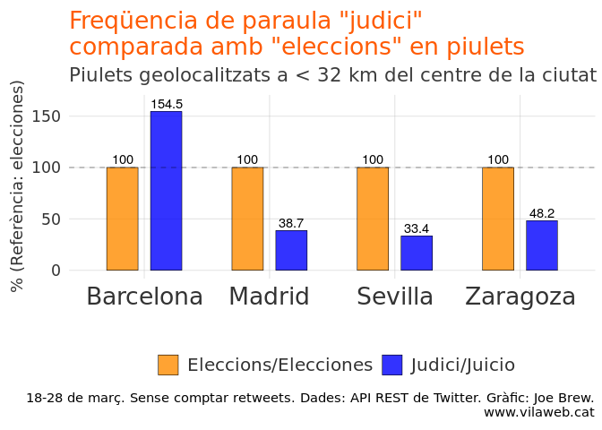
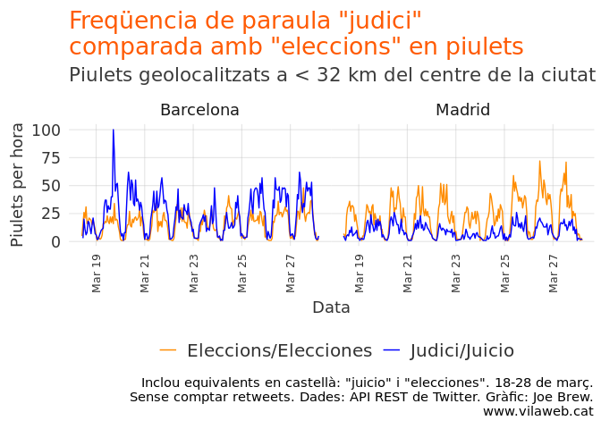
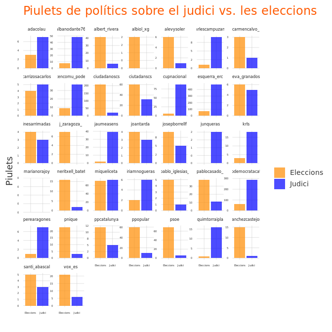
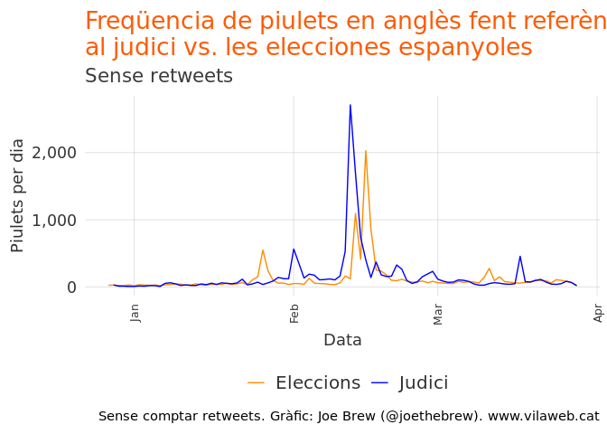
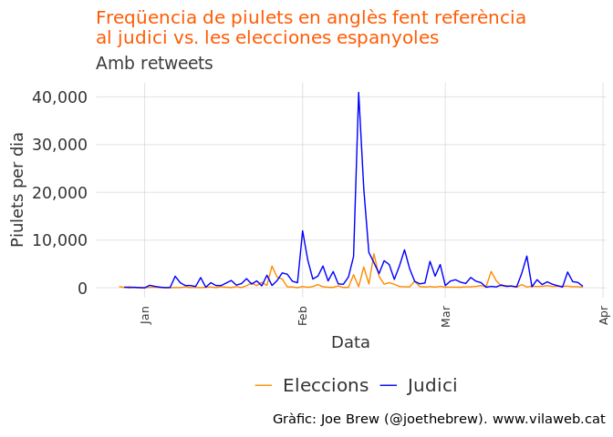
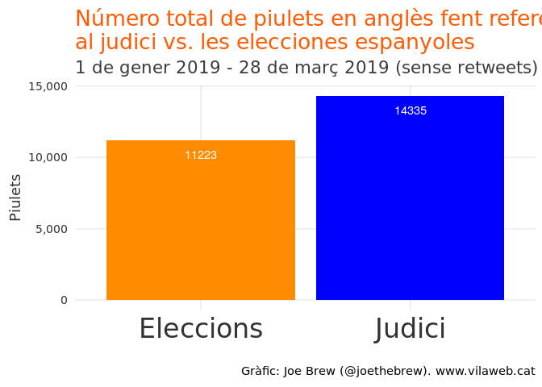
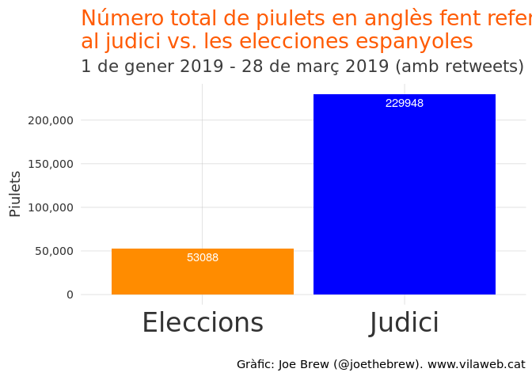

La desconnexió entre Espanya i Catalunya: El judici i les eleccions
================

Introducció
===========

El judici del procés ha captivat tot l'Estat espanyol. Hi ha alguns que ho miren amb indignació, pertorbats per l'us de la Judicatura per resoldre qüestions fonamentalment polítiques i enfurismats per l'applicació de la presó preventiva. De l'altre, hi ha gent que s'engorulleix de l'acció de l'Estat de dret i celebran que els "copistes" o "rebels" violents catalans que havien intentant "liquidar" Espanya s'enfronten a una Justicia independent. Sigui quina sigui la seva política, tots parlen de la transcendència del judici, i sembla haver un reconeixement universal que està en joc no només són les vides dels acusats, sinó els futurs polítics de Catalunya i Espanya.

He notat, en converses amb amics espanyols i catalans, que el nivell d'interès en el judici del procés és molt different: els meus amics catalans en parlen moltíssim, i els meus amics espanyols poc. Seria interessant saber, pensava, si això és una diferència només entre els meus amics (un mostreig relativament petit), o si és una característica general de les societats catalanes i espanyoles en aquest moment.

Qui parla del judici? Com podem saber-ho? Que podem inferir de les diferències? Aquest article breu tracta d'aquestes preguntes.

Metodes
=======

Per compensar per la "mida de la mostra" massa petita entre coneguts, vaig recopilar dades d'una font de persones més gran: twitter. Vaig descarregar TOTS el piulets dels últims 10 dies que mencionaven les paraules "judici" o "juicio" i eran geolocalitzables a 4 ciutats de l'Estat espanyol: Barcelona, Madrid, Sevilla, Zaragoza (a menys de 32 kilómetres del centre de la ciutat). Per fer un "control", vaig descarregar també tots els tuits de les mateixes zones que contenien la paraula "eleccions" o "elecciones".

Si la meva impressió anecdótica fos acertada, m'esperaria a veure una proporció judici-eleccions més alta a Catalunya que a la resta de l'Estat. Anem a veure els resultats.

Resultats
=========

Tots els piulets dels últims 10 dies
------------------------------------

El gràfic següent mostra la diferència entre piulets sobre les elecciones (taronja) i el judici (blau) en les 4 ciutats examinades. Les dades han sigut transformades/ajustades per que el número de piulets fent referència a les eleccions sigui la "referència" per cadascuna de les ciutats 100% (per que puguem fer comparacions entre ciutats de poblacions de tamany diferent). O sigui, una barra blava a 100% voldria dir que en aquella ciutat es fan exactament la mateixa quantitat de piulets sobre el judici que les eleccions. Una barra blava més alta que 100% vol dir que es parla més del judici, i una barra menor de 100% vol dir que es parla més de les eleccions.

Barcelona és la única ciutat on es parla més del judici que de les eleccions. Per cada 2 piulets escrits a Barcelona sobre les eleccions, s'ecriuen 3 sobre el judici.

A les altres ciutats, la freqüencia (ajustada) de piulets sobre el judici és molt menor. A Madrid, la freqüencia ajustada de piulets sobre el judici és 4 vegades menor que a Barcelona. La bretxa és encara més a Sevilla (4,6 vegades menor). A Zaragoza es parla més del judici que a les altres 2 ciutats de l'Estat, però encara s'escriuen 2 piulets sobre les eleccions per cada piulet sobre el judici a Zaragoza.

La comparació Barcelona-Madrid és la més interessant perquè són de tamany més similar i comparteixen un nivell sociodemogràfic més comparable. Mirem la freqüencia de piulets per hora a les dues ciutats:

És clar que el tema del judici atrau a molt menys atenció a Madrid que les eleccions. I a Barcelona, el contrari.

Tots els piulets dels polítics
------------------------------

Potser una de les causes potencials de la discrepància Catalunya-Espanya en quant a l'atenció que es para al judici té a veure amb els polítics. O sigui, si els líders polítics no en parlen molt, és normal que els seus seguidors també en parlen poc.

El gràfic següent mostra la quantitat de piulets que mencionen "eleccions" o "judici" de polítics espanyols i catalans

Amb poques excepcions, els polítics sobiranistes parlen molt més del judici que les eleccions, mentres que els polítics en contra de la autodeterminació parlen més de les eleccions. Fins i tot VOX (i el seu líder Santiago Abascal) parlen més de les eleccions que del judici, encara que siguin ells una part oficial del judici. Els no-independentistes catalans del PSC, PPC, i Ciutadans parlen més del judici que els no-independentistes espanyols, però encara parlen més de les eleccions que del judici.

Atenció internacional
---------------------

És interessant també veure l'atenció internacional al judici i a les elecciones del 28-A. Encara que la majoria dels piulets no són geolocalitzats, es pot utilitzar la llengua com una aproximació de la "internacionalitat" (considerant, per aquest análisi, la definició limitada de "internacional" com a "un piulet en anglès").

Vaig recopilar tots els piulets que feien referència al judici del procés o a les eleccions espanyoles a traves de dues búsquedes senzilles (detalls al final de l'article). Aqui els piulets per hora en anglès mencionant els dos temes:

El gràfic anterior només pren en compte el número de piulets individuals, i no els "retweets". És important també analitzar els retweets perquè reflecteix l'impacte i l'abast dels piulets. Aquí el mateix gràfic però amb retweets.

Les variacions al llarg del temps son massives i fa que sigui difícil veure la totalitat. Doncs, agreguem tots els piulets en anglès sobre els dos temes del 1 de gener fins al 28 de març. Aquí el resultat:

En el gràfic anterior es veu que es parla més de 25% més del judici que les eleccions en piulets en anglès.

Com haviem comentat anteriorment, és important prendre en compte també els retweets per entendre l'abast de les converses. El gràfic següent mostra el número de piulets en anglès que fan referència al judici i les eleccions, COMPTANT els retweets.

La diferència és enorme. Al nivell internacional, es parla 4 vegades més del judici que de les eleccions.

Conclusió
=========

Resume de resultats
-------------------

-   A Catalunya es parla molt més del judici que de les eleccions. A la resta de l'Estat, es parla més de les elecciones que del judici.

-   Els polítics sobiranistes catalans parlen més del judici que de les eleccions. Els polítics catalans no sobiranistes parlen més de les eleccions. Els polítics no catalans parlen molt poc del judici, i molt més de les eleccions.

-   Al nivell internacoinal, com a Catalunya, es parla molt més del judici que de les eleccions.

Reflecció personal
------------------

No sé exactament perquè es parla tan poc del judici a la resta de l'Estat espanyol. Si hi hagués una rebel-lió violenta, "un cop d'estat", o un esforç de "liquidar la democracia espanyola", em sembla que el judici dels rebels hauria d'atraure l'atenció de tots.

Però no és el cas. A Catalunya, i a la resta del món, el judici està sent un objecte d'atenció importantíssima. Pero a Espanya, per lo que hem vist en les dades de twitter, es parla poc. La confirmació d'aquesta diferència es denota quan un fa una ullada als titulars dels diaris principals de Catalunya i de l'Estat: en els primers, el judici; en els segons, les eleccions.

La diferència en atenció reflecteix una "desconnexió" entre Espanya i Catalunya. Segons aquest análisi, els catalans i els espanyols no comparteixen la mateixa opinió sobre la importancia relativa dels esdeveniments. Els esdeveniments principals d'un lloc ja no es consideren tan importants a l'altre.

Però aquest análisi ens ensenya que la desconnexió va més enllà de Catalunya i Espanya. Mentres que l'Estat s'absorbeix en el dia a dia de la campanya electoral, sembla que l'atenció internacional està absorbida pel judici. En quant al judici, la desconnexió no és entre Espanya i Catalunya - és entre Espanya i la resta del món.

Detalls
=======

La búsqueda de piulets internacionals sobre el judici es va fer així:

    "'trial' AND ('catalan' OR 'catalonia' OR 'separatist' OR 'independence'"

La búsqueda de piulets internacionals sobre les eleccions es va fer així:

    "('election' OR 'elections') AND ('spain' OR 'spanish' OR 'catalan' OR 'catalonia'"

Tot el codi per aquest análisi és publicament accessible a: <https://github.com/joebrew/vilaweb/tree/master/analyses/judici_vs_eleccions>.
