La generació de l’1 d’Octubre
================

# Introduction

The other day, a friend told me that her daugther was part of the
“October 1st generation”. She was referring to the October 1, 2017
Catalan independence referendum in which police from Spain were sent to
suppress the vote (and used violence against voters to do so, in many
cases). What she meant was this: that a generation of young people “came
to age” around October 1st 2017, and that the event changed them (in
regards to their support for independence) more than others.

And it got me to thinking: is it true? Were the young particularly
“affected” by the police violence of October 1, 2017? Did support for
independence increase differentially across demographic groups? Let’s
dig into the data.

# The data

Let’s start with the basics: support for independence among Catalans
increased significantly following the October 1, 2017 referendum. The
below shows the number of Catalans in favor of independence as a
percentage of all Catalans (removing those with no opinion or who don’t
answer the question).

<!-- -->

Polls are volatile due to sample size, selection effect, etc. So let’s
aggregate the year (three polls) prior to the referendum and the year
(three polls) after the referendum for a clearer take on the effect of
the referendum itself:

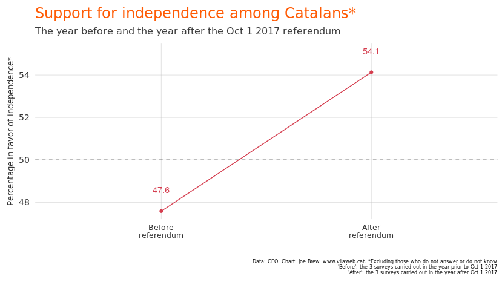<!-- -->

The increase in support for independence from the year prior to the
referendum to the year after the referendum is large. The question is:
in which groups did that increase take place? Let’s have a look:

## By age

I anticipated that the young, whose opinions are still not fully formed
and are therefore more “impressionable” would have been more “affected”
by October 1 than other age groups. But this isn’t the case: the
increase in support for independence following the referendum was
similar across all age groups:

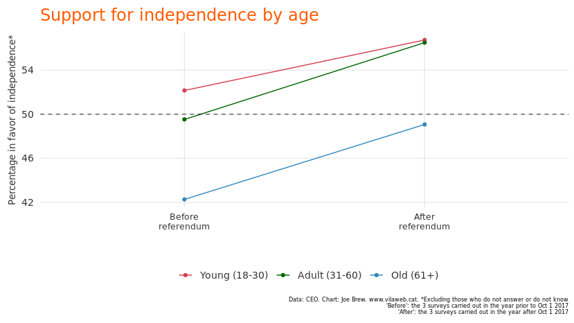<!-- -->

In fact, the results are similar even among the very young. Yes, support
for independence is greater among them than those who are older, but the
*increase* in support for independence following the referendum was
similar (if not less) among the very young than others.

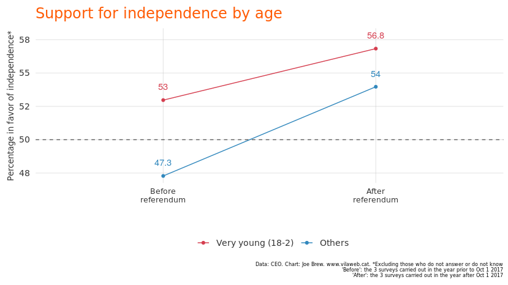<!-- -->

## By geography

The increase in support for independence following the referendum was
similar across provinces.

<!-- -->

## By language

The language which one considers to be his or her “own” is one of the
strongest predictors for support or opposition to independence. In the
year before and year after the referendum, the three major language
groups (Catalan, Spanish, and both) all showed increased support for
independence. Though in percentage *points* the increase was greatest
among Catalan-speakers, in terms of relative growth the increase was
greatest among Spanish speakers:

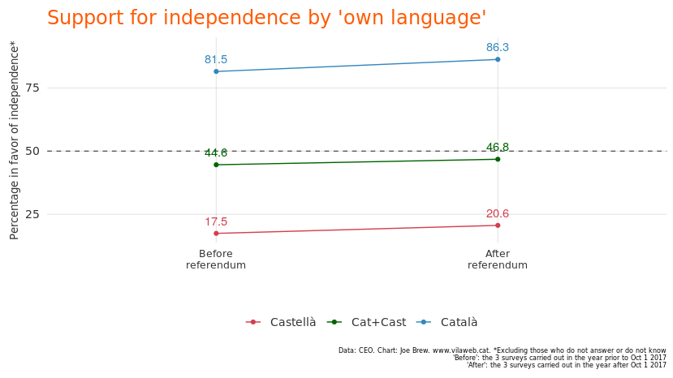<!-- -->

## By birthplace of grandparents

Following the October 1 referendum, independence increased among
Catalans with 0 grandparents born in Catalonia all the way to those with
all 4 born in Catalonia. The increase was most pronounced, however,
among those Catalans with no grandparents born in Catalonia.

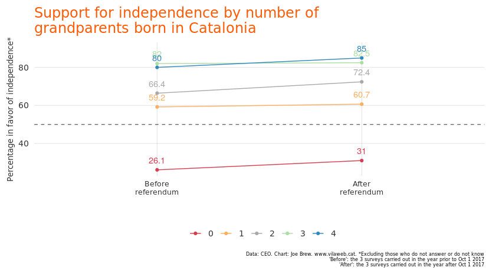<!-- -->

## By party

Support for independence by preferred political party was virtually
unaltered by the October 1st referendum (this could be, at least in
part, due to the fact that those from one party who changed their mind
on independence may also have changed their party).

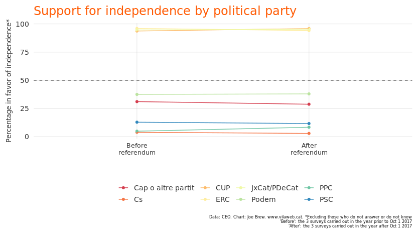<!-- -->

## By extent of being informed about politics

The only group who saw support for independence go *down* from the year
before to the year after the referendum was among those who said that
they paid no attention “at all” to what is going on in politics.

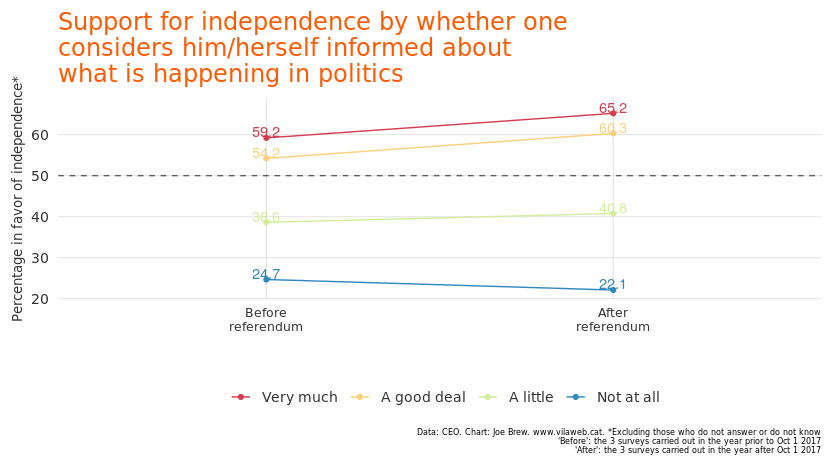<!-- -->

## By extent of being interest in politics

As with being informed, being interested in politics meant larger
increases in support for independence following the referendum. The only
group which saw a decrease in support for independence after the
referendum were those who said there were “not at all” interested in
politics.

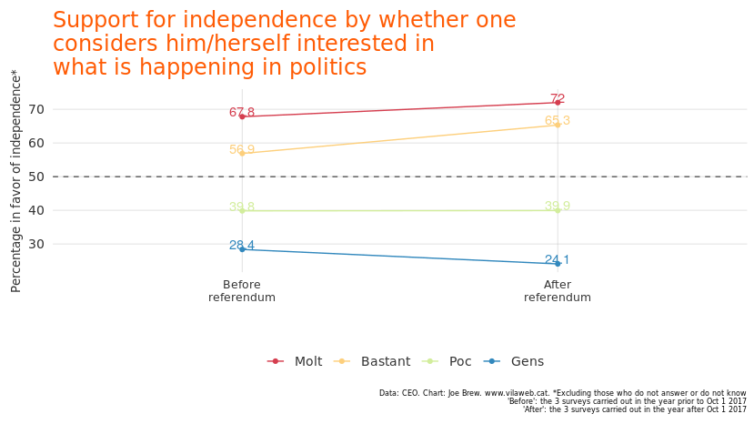<!-- -->

## By left-right ideology

In the CEO surveys, Catalans rate themselves on a 0-10 left-right
ideological scale (we’ve classified 0-1 as “far left”, 2-4 as “left”, 5
as “centre”, 6-8 as “right” and 9-10 as “far right”). Among all
ideological groups, support for indendence increased as a result of the
referendum, except for one: among those who consider themselves “far
right”, support for independence decreased substantially.

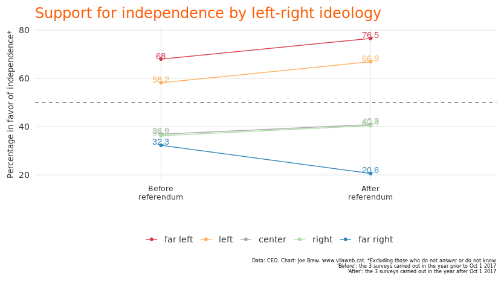<!-- -->

## By place of birth

Catalans born in Catalonia have the highest support for independence,
but Catalans born in the rest of Europe, outside of Europe, and in Spain
also showed a substantial increase for support for independence
following the referendum:

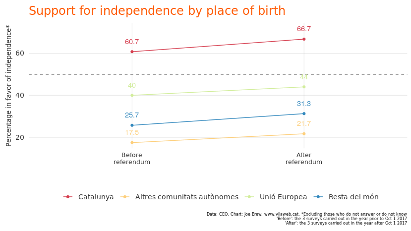<!-- -->

# Conclusion

If we consider the “October 1st generation” to be those Catalans whose
support for independence increased following the events of October 1st,
then, well, it’s a bit hard to distinguish who gets the title. The
“October 1st generation”, it appears, consists of both young and old,
those born in Catalonia and elsewhere, those who speak Spanish or
Catalan, and those in different geographies. The referendum was
associated with a decrease in support for independence among some groups
(the far right and those who say that they are not interested in or
informed about politics), but the increase was largely transversal.

This reality contrasts starkly with the referendum being portrayed as a
“violation” of the rights of Catalans. For example, Spain’s Minsitry
of Foreign Affairs is sending documents to foreign journalists saying
that organizing the referendum [“deprived Catalans of
rights”](https://twitter.com/joethebrew/status/1162322097668009985).
Whether this statement is true or not, it’s clear that most Catalans
don’t feel that way - if they did, support for independence would have
*decreased* as a result of the referendum, not *increased*.

In any case, to the extent that this brief analysis has shown anything
at all, it’s this: “the October 1st generation” isn’t exclusive to one
age group, identity, or demographic. Relative to the year prior to the
referendum, support for independence increased substantially in the year
after the referendum, *among* many groups, including some who are
generally hostile to independence.

# Technical details

All code and data for this article are available at
<https://github.com/joebrew/vilaweb/tree/master/analyses/la_generacio_1_oct>.

# Catalan language charts

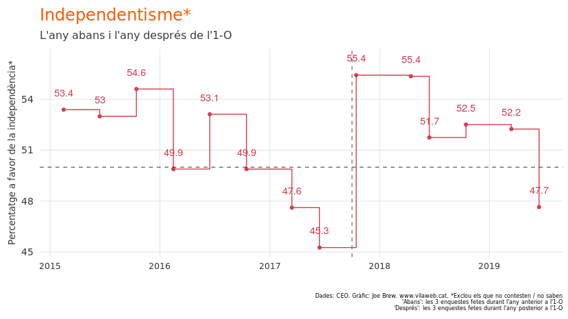<!-- -->

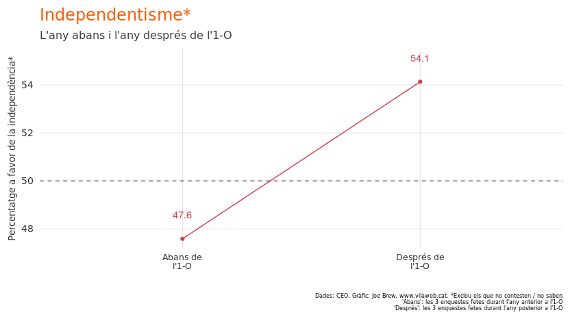<!-- -->

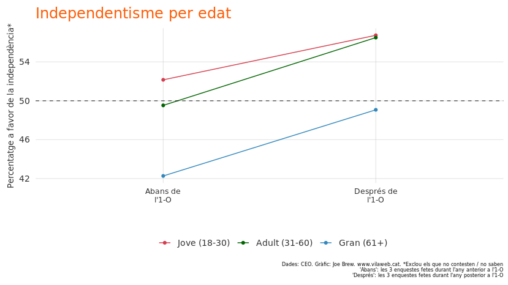<!-- -->

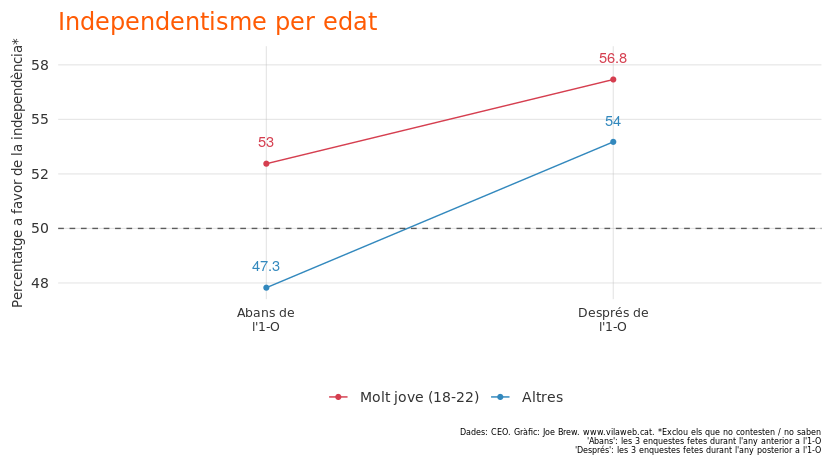<!-- -->

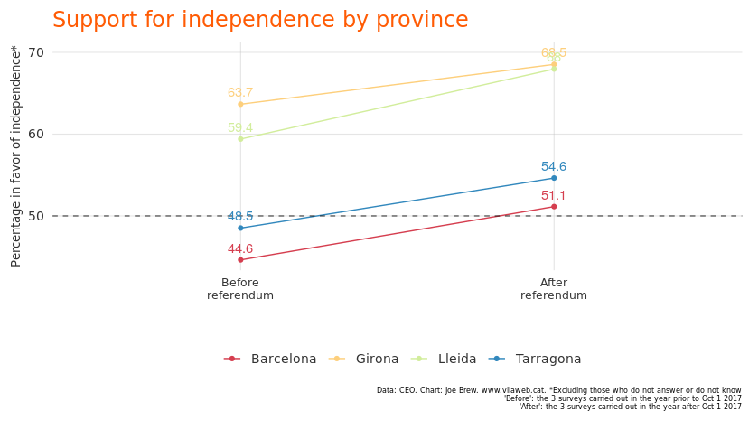<!-- -->

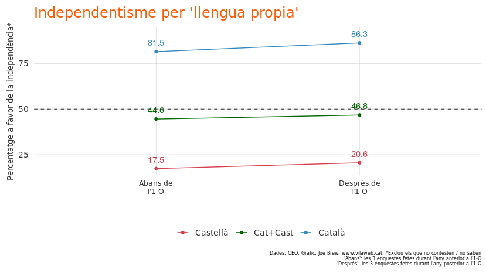<!-- -->

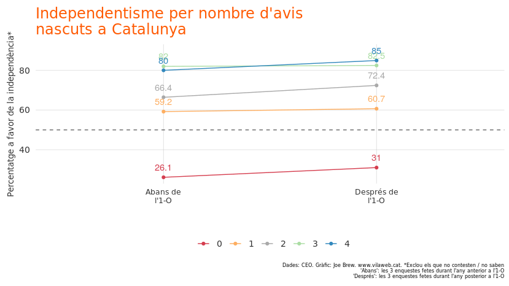<!-- -->

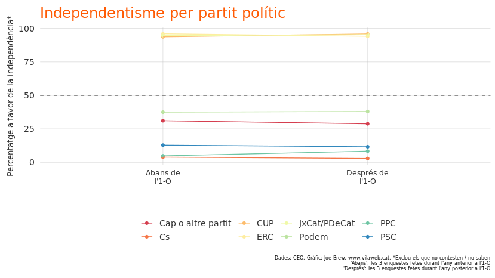<!-- -->

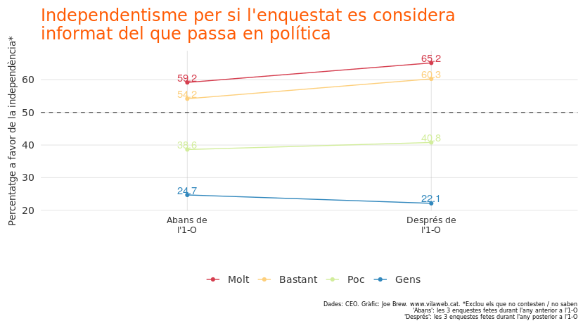<!-- -->

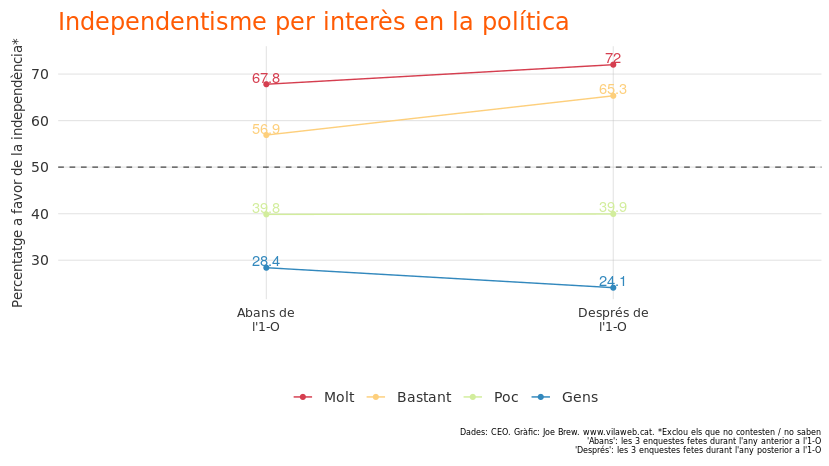<!-- -->

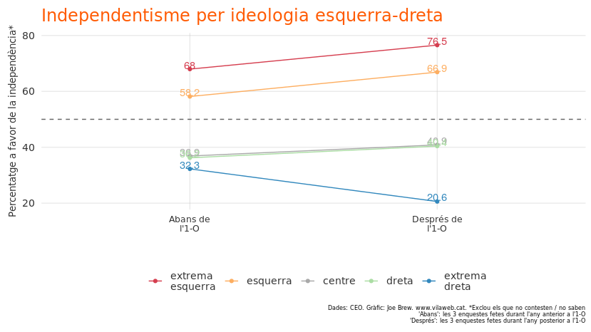<!-- -->

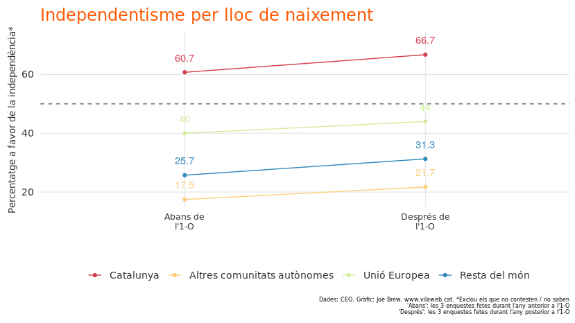<!-- -->
