The Catalan independence movement and the left-right division
================

(Alternative title: "Is the Catalan independence movement right-wing?")

Introduction
============

"Their only support comes from far right nationalists" tweeted Inés Arrimadas (of the pro-Spain Ciudadanos party) about the Catalan independence movement ("Sus únicos apoyos son nacionalistas-extrema derecha"). "An ultranationalist, right-wing supremacist" is how socialist Eva Granados described pro-independence Catalan President Quim Torra ("un ultranacionalista supremacista de derechas"). "A servile right-winger" is how her socalist colleague, José Zaragoza, described Torra ("un derechista servil"). "PDCat is a right-wing party: neither social, nor progressive", wrote anti-independence Catalan jurist Argelia Queralt, in reference to one of the largest Catalan independence parties ("PDCat és un partit de dretes. Ni social, ni progre").

<table style="width:100%">
<tr>
    <td>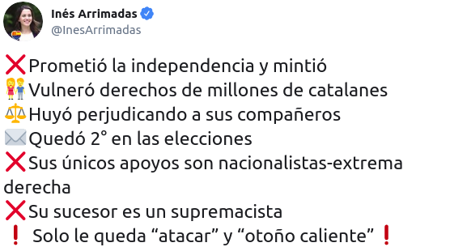</td>
    <td>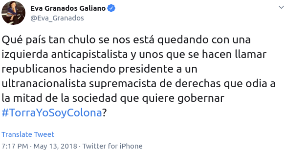</td>

</tr>
    <tr>
    <td>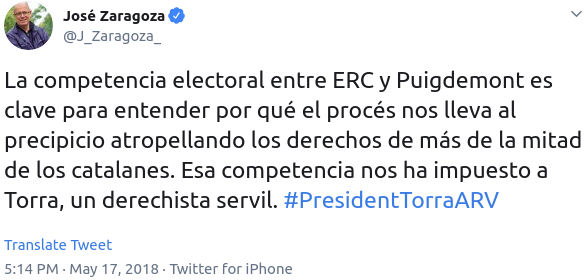</td>
    <td>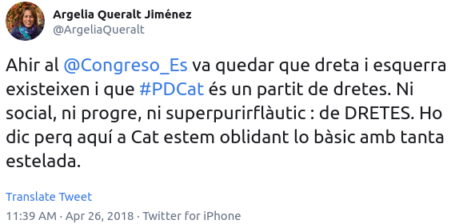</td>

</tr>
</table>
If one read only the words of the opponents of Catalan independence, (s)he would reasonably conclude that the Catalan independence movement is a right-wing movement, like British nationalism in the form of Brexit, French nationalism in the form of Marine Le Pen's National Front, or the American nationalism embedded into Donald Trump's branch of the Republican party.

But is it? Is the Catalan independence movement "right-wing"? Let's explore the data.

The question
------------

What is the relationship between the left-right ideological scale and positions on the independence of Catalonia?

The methods
-----------

We'll examine survey data to uncover the relationship between both the left-right poltical spectrum and favorability of the independenceof Catalonia. The terms "left" and "right" are notoriously slippery. For our purposes, we'll examine the following areas:

-   Left vs. right positioning on the self-assessed ideological scale
-   Economic growth and the environment
-   Government involvement in the economy
-   Taxes and social services
-   Inequality and wealth redistribution
-   Attitudes towards immigration
-   Attitudes towards euthanasia
-   Clericalism

The results
-----------

### The left-right scale

The Baròmetre d'Opinió Política, carried out by the Centre d'Estudios d'Opinió, has surveyed Catalans on their views on independence and their left-right orientation regularly since 2015. Over the course of four years, 17981 representatively sampled Catalans have given responded to the questions on ideology and independence.

The below chart shows the aggregation of those 17981 responses. The x-axis shows self-positioning on the left-right scale, and the y-axis shows the percentage.

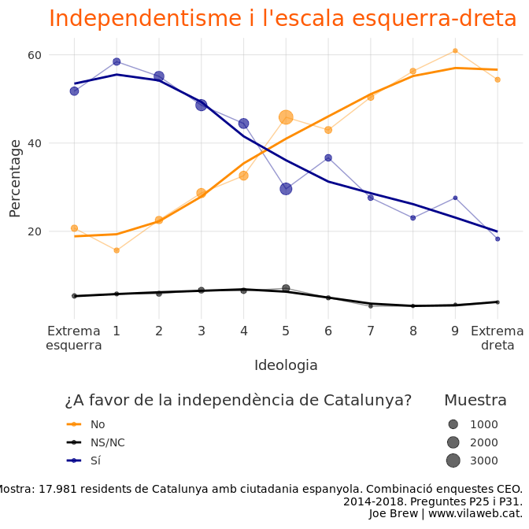

In the above chart, there is a clear association between left-leaning ideology and pro-independence attitudes.

### Policies and independentism

A common (and legitimate) critique of "self" positioning on a left-right scale is the fact that individuals might misclassify themselves. That is, perhaps pro-independence Catalans *think* they are left-leaning, but actually support right-leaning policies. Could this be true? Let's look at how independentism correlates with specific policies for the answer.

#### Economic growth and the environment

A stereotypical difference between the left and right is the differential priorities between the environment and the economy. The political left generally favors economic protection over economic growth, whereas the political right values economic growth more. In both early 2015 and mid-2018, 3000 Catalans were asked whether economic growth should have priority over environmental protection. The aggregation of these two surveys show that independentists value the environment more whereas unionists value the economy more (below chart).

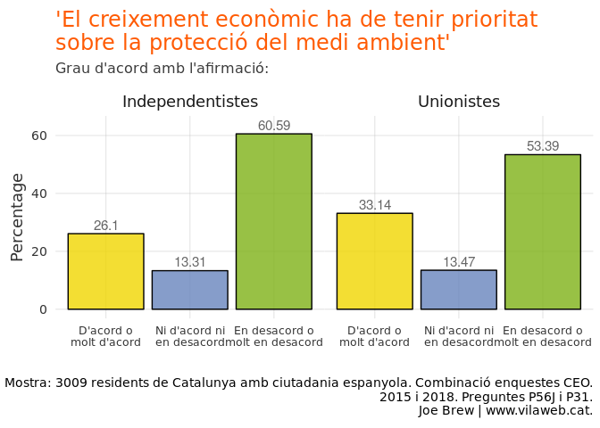

26% of independentists value economic growth over the environment, whereas 33% of unionists do. Clearly, on the issue of the environment, independentism is more to the left than unionism.

#### Government interference in the economy

A classic left-right distinction is the extent to which someone believes the government should intervene in the economy. The political left general favors an active role of the government in managing the economy, whereas the political right is generally more "laissez-faire". In early 2015 and mid 2018, 3000 Catalans were surveyed on precisely this matter. The results are below.

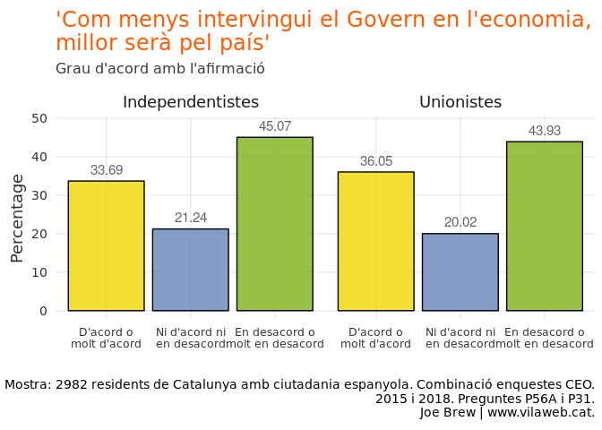

#### Taxes and social services

The political left generally favors higher taxes, so as to provide more social services. The political right generally favors lower taxes, even though this means less social services. Let's see what Catalan unionists and independentists say about the social services - taxes trade-off (below chart)

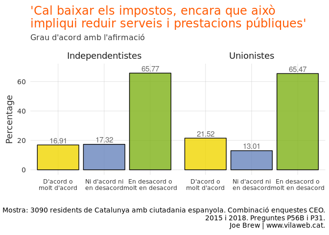

On the measure of taxes and social services, independentists and unionists are similar. That said, unionists are slightly to the right (21.5% of unionists in favor of reducing taxes vs. 16.9% of independentists).

#### Inequality and government intervention

The political left generally feels that the government should take active measures to reduce inequality. The political right generally does not. Let's see what Catalans say on the matter (below):

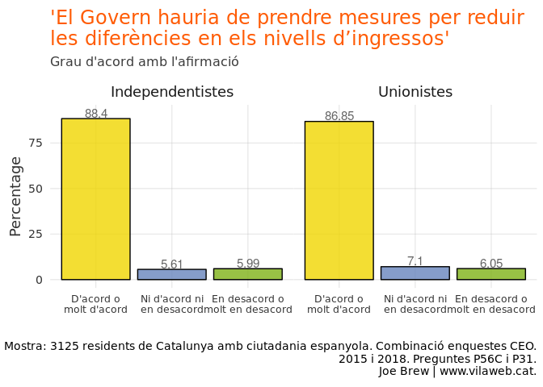

Clearly, both left- and right-leaning Catalans largely favor government measures to reduce inequality. Though very similar, the percentage of pro-independence Catalans who favor lowering inequality (88.4%) is slightly higher than the percentage of unionists (86.7%). In other words, on this matter, independentism is again to the left of unionism (albeit insignificantly).

#### Homosexual rights

Another left-right fissure are political rights for homosexuals. In general, the political left favors conferring on homosexuals the same political rights and recognition as that which is given to heterosexuals. The political right, on the other hand, has historically shown more opposition to equal rights/recognition for homosexuals. More than 3,000 Catalans have been polled on the question of homosexual adoption. Let's examine their responses (below).

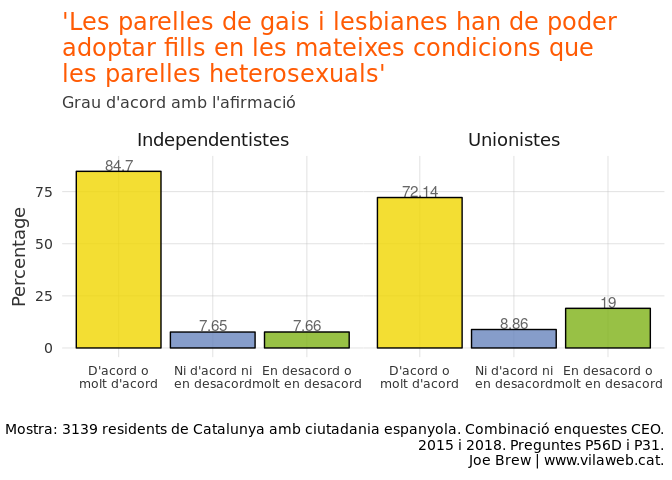

Among both Catalan independentists and unionists, a majority favor allowing gay and lesbian couples to adopt in the same condition as heterosexual couples. However, the rate is much higher among independentists (84.7%) than unionists (72.1%). Again, on this issue, independentism is to the left of unionism.

#### Immigration

Typically, the left is more receptive to immigration, whereas the right is generally more opposed. The below shows how Catalans feel about immigration, based on 2 rounds of asking whether one "feels at home with so much immigration" (asked in early 2015 and mid 2018).

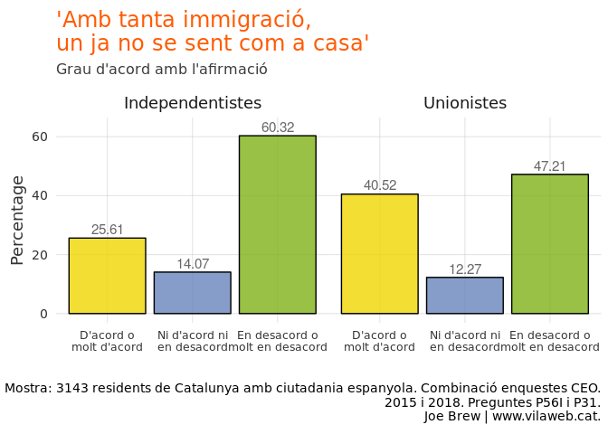

The percentage of unionists who don't feel "at home" due to "so much immigration" is much higher among unionists (40.5%) than independentists (25.6%). Again, on the issue of immigration, independentism is to the left of unionism.

#### Euthanasia

Euthanasia - the decision to end one's life - is generally more favored by the left than the right. The below shows how Catalans feel about euthanasia, broken down by their view on independence.

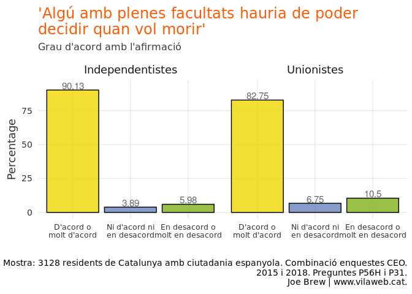

Catalan society is largely pro-euthanasia, both on the left and the right. However, independentists are more pro-euthanasia (90.1%) than unionists (82.8%). Again, independentism is more to the left of unionism.

#### Clericalism

The political left has a long tradition of anti-clericalism, whereas the political right has generally been more comfortable with religion. Let's say the breakdown between independentists and unionists in terms of how they feel about the mix of religion and politics.

    Error: <text>:48:0: unexpected end of input
    46:            y = p)) +
    47:  
       ^

Both unionist and independentist Catalans are mostly opposed to religious influence in politics, but independentists are more opposed than unionists. In other words, again, independentism is more to the left than unionism.

#### Party positioning

In Catalonia, it is fairly to typical to associate the CUP, Podem(os), PSC, and ERC with the left, Ciutadans with the center, and PDeCat and PP to the right. However, if we look closer at the data on ideological positioning, we say that this stereotype does not hold up for all parties.

The PSC and PDeCat are the two parties which are most misclassified. Over the last few years, PDeCAT voters have moved to the left (from an average ideological position of 4.9 to 4.2), whereas PSC voters have moved an equal distance to the right (3.5 to 4.2). As of 2018, PDeCAT and PSC were identically located (4.2) on the left-right scale.

Conclusion
==========

The data are clear: on both self-perceived and objective political measures, the Catalan independence movement is more to the left than its unionist counterpart.
