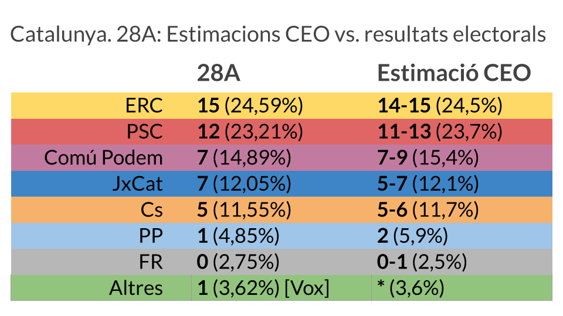
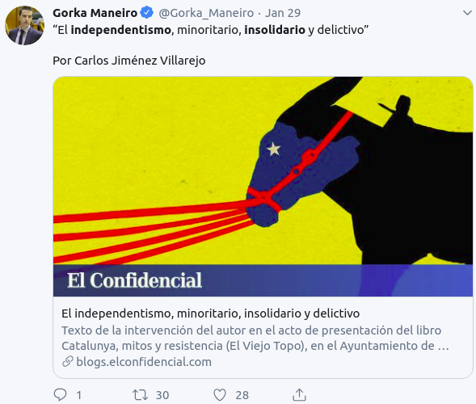
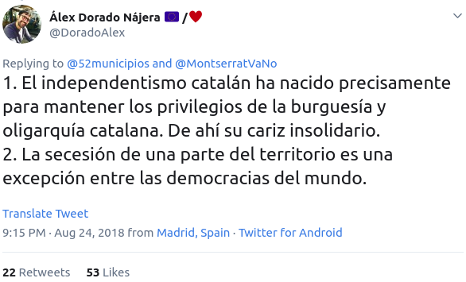
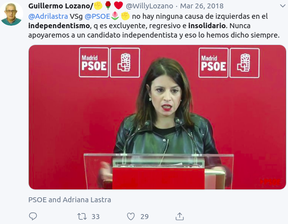
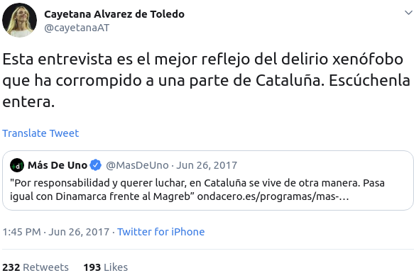
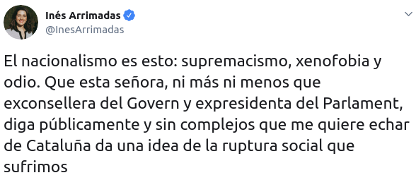
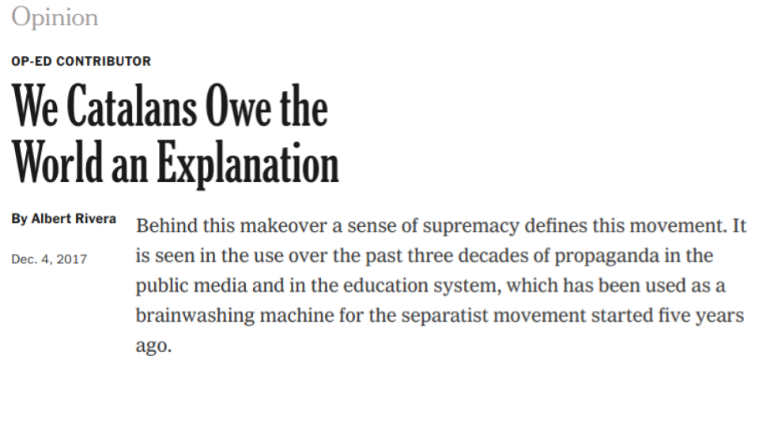
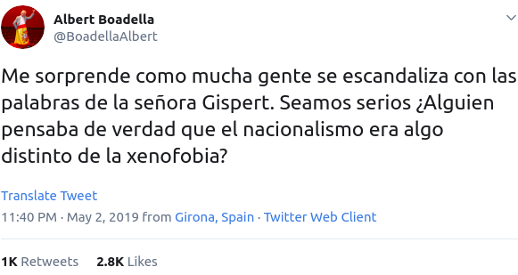

```{r setup, include=FALSE, echo = FALSE}
# Basic knitr options
library(knitr)
opts_chunk$set(comment = NA, 
               echo = FALSE, 
               warning = FALSE, 
               message = FALSE, 
               error = TRUE, 
               cache = FALSE,
               fig.width = 8.64,
               fig.height = 4.86,
               fig.path = 'figures/')
```


```{r}
# Libraries
library(vilaweb)
library(rtweet)
library(tidyverse)
library(databrew)
library(waffle)
library(ggplot2)
source('functions.R')
```

```{r}
ceo <- vilaweb::ceo
new_ceo <- vilaweb::new_ceo
# Read in Apr 2019 CEO data
dfx <- haven::read_sav('../../data-raw/ceo/Microdades anonimitzades -919.sav')
# Non-democratic
# Minority
```

# Introduction

## Unquantifiable statements

"Verifiability"  and "falsifiability" are basic principles of science. To understand the world, scientists generate theories and then verify these theories by trying to falsify them. This method - the scientific method - requires that theories be "falsifiable" by nature. For example, Bertrand Russell's famous (satirical) theory that a [miniature teapot is orbiting the sun](https://en.wikipedia.org/wiki/Russell%27s_teapot) but is too small to be viewed by telescopes is not falsifiable (there is no way to disprove it) and therefore, not scientific.

Some statements are unquantifiable and, by extension, unfalsifiable. Take, for example, this statement: "Donald Trump is a good President". I happen to disagree with it, but I can not _demonstrate_ that it is a false statement because the adjective "good" is a question of personal opinion. Like the existence of Bertrand's Russell's teapot, the "goodness" or "badness" of Trump is unfalsifiable.

Unquantifiable statements are conjectural, unknowable, or simply subjective. These statements are abundant in politics. There is nothing wrong with these statements, per se, but discussions around them are generally not very productive. One person affirms something unquantifiable, the other affirms the opposite, and the conversation ends, with no agreed-upon basis for truth or even a mutual method for evaluating the other's perspective.

We've all had these conversations; and we all know that they lead to nowhere.

## Quantifiable statements

Fortunately, not everything is unquantifiable. Much of what is said in politics _is_ quantifiable, and therefore, falsifiable. Strangely, even though data exist to contrast certain affirmations with reality, very few bother to explore the data. Politicians repeat phrases (many of them demonstrably false) over and over again, leaving citizens with the impression that either (a) the false statement is true or (b) the false statement is simply a matter of opinion (ie, that the affirmation is unquantifiable or unknowable), when in fact it is not a matter of opinion.

What a shame that we continue to let our politicians manipulate us in this way. We live in the most data-rich era of history - when claims are made, they should be put to the test. Falsifiable claims should be falsified (if false) and verified (if true). Quantitative claims should be quantified. 

## Catalonia and quantifiably false statements

As someone who keeps my eye on Catalan and Spanish politics, I have been amazed at the level of falsehoods that are repeated, routinely, with almost no response from data journalism. Many people treat quantifiably false statements as simple matters of opinion - but they are not! One can think whatever they want about the "goodness" of a politician or the "desirability" of a political outcome; but there are certain areas where the data simply do not support certain interpretations.

There is another word for these quantifiably false statements: lies. In this article, I'd like to explore five of them.

# Methods

For this analysis I'll use data from the Baròmetre d'Opinió Política (BOP) of the Catalan Centre d'Estudis d'Opinió (CEO). It is by far the best source of political data on Catalonia, not just because the survey is carried out in person (whereas most newspaper surveys are done by telephone, causing a significant level of bias), but also because the raw data are publicly available [here](http://ceo.gencat.cat/ca/barometre/detall/index.html?id=7008).

My confidence in the BOP recently increased after comparing its estimates for the April 28 elections (based on fieldwork done in March) with the outcome of the April 28 elections: the level of accuracy is astounding:

<table style="width:100%">
  <tr>
    <td></td>
  </tr>
</table>

In addition to being rigorously sampled, the BOP also publishes its raw data, meaning that it can be downloaded, analyzed, etc. by anyone. This has the advantage of allowing for the "crossing" (encruament) of different variables (which is precisely what I do in this analysis).


# Results


## Lie number 1: The Catalan independence movement is non-democratic

Catalan sovereigntists are frequently accused by their pro-Spain counterparts of not being democratic. At its most extreme, this accusation crystalizes into the affirmation that wanting to vote on a divisive issue is equivalent to a "coup against _democracy_". 

But are pro-independence Catalans less "democratic" than their pro-union counterparts? There is no straightforward way to quantify how "democratic" one is, but good data on the subject do exist. For example, in mid-2018 the BOP asked 1500 Catalans how they felt about democracy as a system of government.

The below chart shows the results of that survey. Most Catalans of all ideologies prefer democracy, but the rate of saying "democracy is always preferable to any other form of government" is significantly higher among pro-independence Catalans.

```{r}
democracy(ca = FALSE)
```

In other words, pro-independence Catalans cannot be accused of being "non-democratic" if one takes into account the data on opinions on democracy.

## Lie number 2: The Catalan independence movement is anti-solidarity

Unlike the previous affirmation, this one is most often lodged by the Spanish unionist left. The accusation is that the Catalan independentist movement emerges from a strong desire among Catalans to share less of their resources with others (ie, be less "solidary").

<table style="width:100%">
  <tr>
    <td></td>
    <td></td>
  </tr>
    <tr>
    <td></td>
    <td></td>
  </tr>

</table>

Is it true? Do Catalans in favor of independence exhibit attitudes less akin to solidarity than those opposed?

The data show otherwise. Catalans - both those in favor and against independence - are very much in favor of economic solidarity. For example, an overwhelming percentage support government efforts to reduce income inequality (with slightly _more_ independentists in favor than unionists):

```{r}
var_cat(ca = FALSE, var = 'P56C',
        position = 'dodge') 
```


By the same token, a majority of Catalans (both for and against independence) are opposed to lowering taxes if it means reducing public services. The percentage that does want to lower taxes and reduce public services is actually greater among anti-independence Catalans than pro-independence Catalans:

```{r}
var_cat(ca = FALSE, var = 'P56B')
```

In other words, both pro- and anti-independence Catalans exhibit largely solidary attitudes. The differences between the two groups are minor, but where there are differences the pro-independence Catalans are slightly _more_ solidary than their anti-independence compatriots.

## Lie number 3: The Catalan independence movement is right-wing

This, to me, is one of the most surprising accusations made against the Catalan independence movement. Survey after survey shows that the Catalan left is overwhelmingly pro-independence and the Catalan right is overwhelmingly pro-union.

```{r}
left_right(ca = FALSE)
```

As if this weren't enough, we can also examine how Catalans of different political stripes evaluate their political leaders. Take, for example, the average rating given to pro-independence politicians by Catalans as a function of their political ideology. Note that all receive significantly higher ratings from the left than the right.

```{r}
plot_val_pol(who = c('JUNQUERAS',
                     'PUIGDEMONT',
                     'TORRA',
                     'ROVIRA')) +
  labs(subtitle = 'Pro-independence politicians')
```

Now compare the previous chart with rating of Catalan pro-union politicians by ideology of survey respondents. Note that all (including those who aspire to be "centrist" or "leftist") actually receive higher ratings from right-wing Catalans.

```{r}
plot_val_pol(who = c('ARRIMADAS', 'FERNANDEZ',
                     'VALLS', 'ICETA')) +
    labs(subtitle = 'Pro-union politicians')

```

In terms of quantifying who is "right-wing", another measure is nostalgia for the previous right-wing dictator, Francisco Franco. The percentage of Catalans who believe Franco had "positive" aspects is significantly higher among voters of pro-union parties than in the pro-independence bloc.

```{r}
franco(ca = FALSE)
```

Finally, one last measure of right-wingness is positioning on social issues. For example, on the quesiton of homosexual rights, pro-independence Catalans are far more progressive/leftist than their pro-union counterparts:

```{r}
var_cat(ca = FALSE, var = 'P56D')
```


## Lie number 4: The Catalan independence movement is xenophobic 

Some politicians, particularly those on the political right, frequently accuse the Catalan independence movement of being xenophobic and supremacist. 


<table style="width:100%">
  <tr>
    <td></td>
    <td></td>
  </tr>
    <tr>
    <td></td>
    <td></td>

  </tr>

</table>


Are they right? Xenophobia and supremacism are difficult, but not impossible, to quantify. Forunately, the BOP asks a question which gets right to the heart of the matter: the extent to which one agrees with the (blatantly xenophobic) following phrase: "With so much immigration, one no longer feels at home".

The data (below) show that there is indeed a great deal of xenophobia in Catalonia (nearly one and three Catalans don't feel "at home" due to immigration). However, the rate of xenophobia is 1.6 times higher among those _opposed_ to independence than those in favor.

```{r}
var_cat(ca = F, var = 'P56I')
```

If we examine by party, we can better pinpoint the source of xenophobia in Catalonia. Ironically, the parties whose politicians most frequently accuse independentists of being "xenophobic" are, in fact, the parties with the greatest rates of xenophobia. A majority of the supporters of both the PP and C's in Catalonia express xenophobic sentiments in regards to immigration.

```{r}
var_cat(ca = F, var = 'P56I', by_party = TRUE, size = 3) +
  theme(axis.text.x =element_text(size = 10))
```

## Lie number 5: Catalans don't really want a referendum on independence

Pro-union Catalan politician Miquel Iceta recently stated that with the Socialist party there "will not be independence, nor a referendum on independence, because Catalans don't want it" ([Video](https://twitter.com/joethebrew/status/1119300919831814144)).

This statement is simply false.

In regards to the number of Catalans who want independence, the most recent data suggest that more do than don't.

```{r}
indy_plot()
```

In a hypothetical yes-no referendum, in other words, independence would win by 4.6 percentage points.

```{r}
indy_plot(treure = TRUE) +
  labs(subtitle = "Removing the 'not sure'/'no answer' responses")
```

Iceta is not only wrong about whether Catalans want independence (it's close, at least), he's especially wrong in suggesting that Catalans don't want a referendum. They do. 78,7% agree with the phrase that "Catalans have a right to decide their future as a country through a referendum".

```{r}
ref_plot(treure = F)
```

What's especially strange about Iceta's assertion is that the percentage of Catalans _in his own party_ that support a referendum is greater than 50%.


```{r}
ref_party_plot()
```


# Conclusion

Reality should not be a partisan issue. One doesn't have to be pro-independence to want to clearly understand what the independence movement is. In fact, those who consider Catalan independentism to be a problem should be the _most_ concerned about the repeated lies and mischaracterizations of the movement. After all, the correct "treatment" for a "problem", requires a correct "diagnosis" of what the problem is.

Is the independence movement xenophobic, non-democratic, anti-solidarity, right-wing, and minority? No. The data are clear that it is none of these things. However you personally feel about the question of who should govern Catalonia, you should care about truth in political discourse, and be concerned about lies. A solution to the current crisis in Catalonia will come through when all stakeholders recognize reality for what it is, and then create legislation which fits with that reality. Though distorting reality can sometimes lead to short-term electoral gains, it will never lead to long-term political solutions. 

# Catalan-language charts


```{r}
democracy(ca = T)
```


```{r}
var_cat(ca = T, var = 'P56C',
        position = 'dodge') 
```


```{r}
var_cat(ca = T, var = 'P56B')
```

```{r}
left_right(ca = T)
```


```{r}
plot_val_pol(ca = T, who = c('JUNQUERAS',
                     'PUIGDEMONT',
                     'TORRA',
                     'ROVIRA')) +
  labs(subtitle = 'Polítics independentistes')
```


```{r}
plot_val_pol(ca = T, who = c('ARRIMADAS', 'FERNANDEZ',
                     'VALLS', 'ICETA')) +
    labs(subtitle = 'Polítics unionistes')

```


```{r}
franco(ca = T)
```


```{r}
var_cat(ca = T, var = 'P56D', size = 3)
```


```{r}
var_cat(ca = T, var = 'P56I')
```

```{r}
var_cat(ca = T, var = 'P56I', by_party = TRUE, size = 3) +
  theme(axis.text.x =element_text(size = 10))
```


```{r}
indy_plot(ca = T)
```


```{r}
indy_plot(ca = T, treure = TRUE) +
  labs(subtitle = "Traient els 'NS/NC'")
```


```{r}
ref_plot(ca = T, treure = F, size = 3)
```


```{r}
ref_party_plot(ca = T)
```


