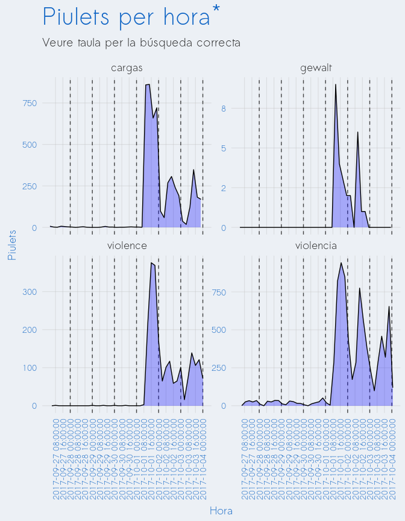

Analysis of Twitter: October 1 2017
================

-   [Search strategy](#search-strategy)
-   [Visualization](#visualization)
-   [Technical details](#technical-details)

Search strategy
===============

| search\_string | full\_string                                                                                                                                                                                                                                                           | start\_date | end\_date  |
|:---------------|:-----------------------------------------------------------------------------------------------------------------------------------------------------------------------------------------------------------------------------------------------------------------------|:------------|:-----------|
| violencia      | (("violencia" OR "violentos" OR "violents" OR "violentas" OR "violentes") AND ("Barcelona" OR "Cataluña" OR "Catalunya" OR "catalanes" OR "catalanas" OR "catalans" OR "catalanes" OR "catalán" OR "España" OR "español" OR "españoles" OR "española" OR "españolas")) | 2017-09-27  | 2017-10-04 |
| cargas         | (("càrregues" OR " càrrega" OR "cargas" OR "carga") AND ("agents" OR "agentes" OR "guàrdia civil" OR "guardia civil" OR "policía" OR "policia" OR "policíaca" OR "policiaca" OR "policíacas" OR "policiaques" OR "policial" OR "policials" OR "policiales"))           | 2017-09-27  | 2017-10-04 |
| violence       | (("police") AND ("violence" OR "violent") AND ("Barcelona" OR "Spain" OR "Catalan" OR "Catalonia"))                                                                                                                                                                    | 2017-09-27  | 2017-10-04 |
| gewalt         | (("polizei" OR "polizesten") AND ("gewalt" OR "gewalttätigkeit" OR "heftig" OR "kräftig") AND ("Barcelona" OR "Spanien" OR "Spanisch" OR "Katalanisch" OR "Katalonien"))                                                                                               | 2017-09-27  | 2017-10-04 |

Visualization
=============

Technical details
=================

-   Data scraped from twtiter on June 28, 2019using the python twint library.
-   Data processed, aggregated, and visualized using R.
-   The number of retweets and likes are as of date of data retrieval
-   All code for this analysis at <https://github.com/joebrew/vilaweb/tree/master/analyses/oct1/>
