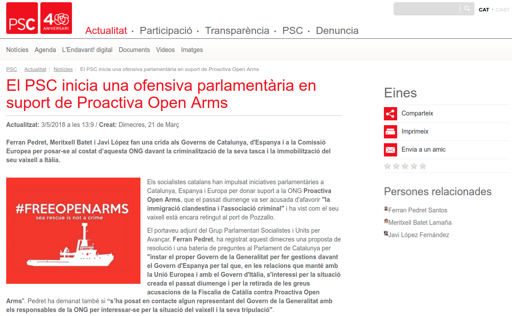
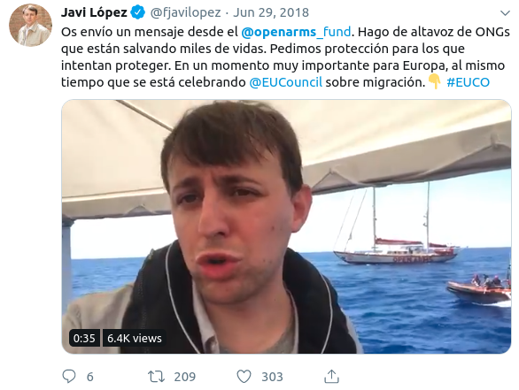
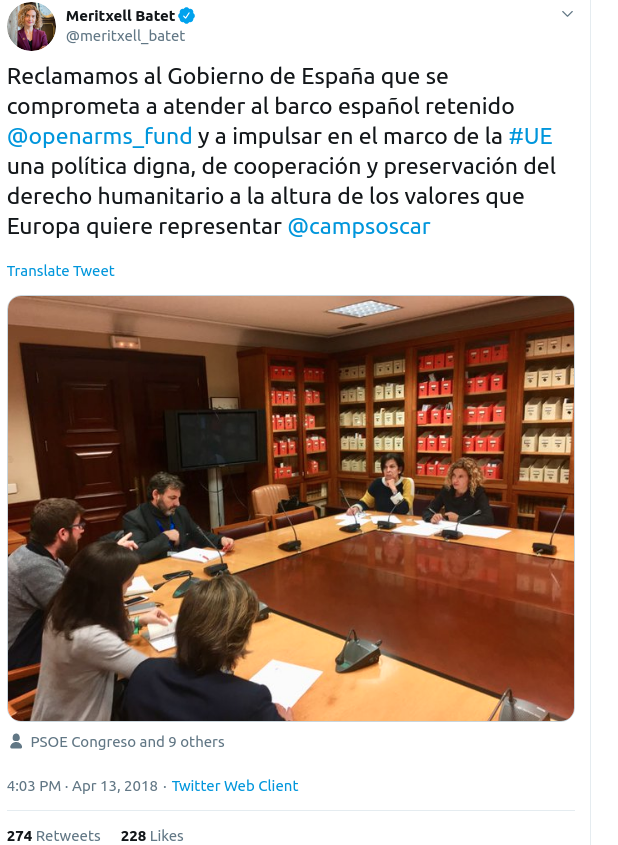
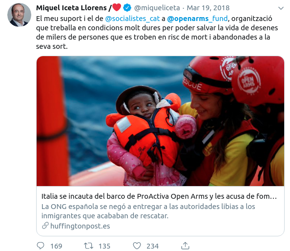
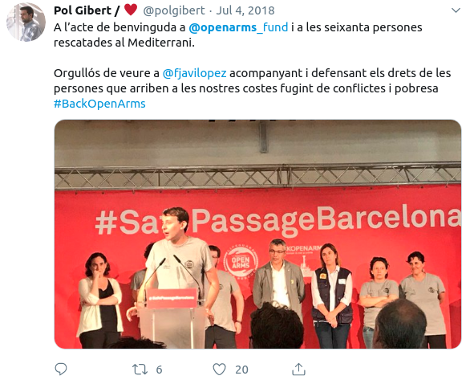
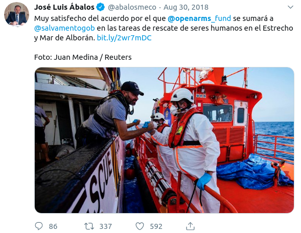
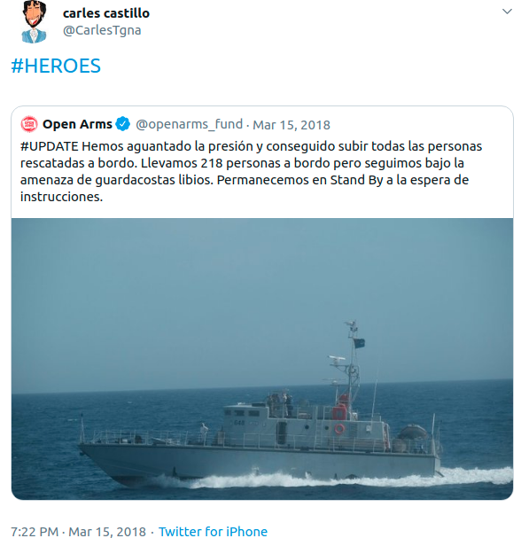
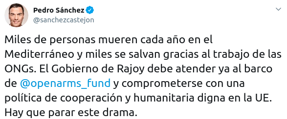

```{r setup, include=FALSE, echo = FALSE}
# Basic knitr options
library(knitr)
opts_chunk$set(comment = NA, 
               echo = FALSE, 
               warning = FALSE, 
               message = FALSE, 
               error = TRUE, 
               cache = FALSE,
               fig.width = 8.64,
               fig.height = 4.86,
               fig.path = 'figures/')
```

```{r}
library(tidyverse)
library(ggplot2)
source('prepare_data.R')
```

# Open Arms and the Socialists in 2018

The Mediterranean is, according to the [International Organization for Migration](https://www.reuters.com/article/us-europe-migrants/mediterranean-by-far-worlds-deadliest-border-for-migrants-iom-idUSKBN1DO1ZY), "by far the world's deadliest border". Thousands of human beings die every year trying to reach Europe in unsafe, overcrowded boats. They come seeking a better life for themselves and their families, often fleeing from war, persecution, or desperate poverty.

[Open Arms](https://www.openarms.es/ca/qui-som) is an NGO dedicated to rescuing migrants at sea. In the Mediterranean, the organization has rescued nearly 30.000 people.

Open Arms has faced many legal and administrative challenges carrying out its work. EU members states have been reluctant to provide safe ports for harbor. The Italian Government - [and the Spanish Government](https://www.lavanguardia.com/vida/20190703/463276395606/gobierno-espana-open-arms-multa-rescatar-migrantes.html) - have threatened, on multiple occasions, massive fines for carrying out rescue work. 

In March 2018, for example, the vessel was [detained in Italy](https://elpais.com/elpais/2018/03/19/inenglish/1521451743_096188.html) for supposedly "promoting illegal immigration". During this time, many politicians expressed outrage. How could it be that a humanitarian vessel dedicated to saving lives could be stuck in port for legal reasons?

Politicians from the Catalan Socialist Party (PSC) were particularly outraged. The PSC issued [a statement](http://www.socialistes.cat/ca/noticia/el-psc-inicia-una-ofensiva-parlamentaria-en-suport-de-proactiva-open-arms) declaring a "parlementary offensive in support" of Open Arms' work. 



Ferran Pedret and Meritxell Batet called on the future Catalan government to work with the Spanish government to ensure that Open Arms could continue its work. Javi López, the MEP of the PSC, requested before the European Commission that the Italian Government release Open Arms. Meritxell Batet, now Minister of Territorial Policy for the Spanish State, pointed out that "systematic human rights violations and abuses" were taking place in Libya, and therefore Open Arms needed a European port. The Spanish socialists, too, spoke up on behalf of Open Arms. Pedro Sánchez, the leader of the Socialist Party (he was not yet president of at the time), denounced the thousands of deaths in the Mediterranean and stated that ["The Government of Rajoy should attend to the Open Arms boat and committ itself to a cooperation and humanitarian poliucy worth of the EU"](https://twitter.com/sanchezcastejon/status/984872600190021632), [multiple times](https://twitter.com/sanchezcastejon/status/975764844451385345).


In other words, in 2018, prior to Pedro Sánchez becoming president, and even into the early days of his presidency, the Socialists were actively engated in speaking out in favor of the humanitarian work being carried out by Open Arms. Then 2019 came. And...

# Open Arms and the Socialists in 2019

In 2019, something changed. It wasn't Open Arms, which continued its work rescuing migrants in the Mediterranean. Rather, it was the Socialists. In January of 2019, after Pedro Sánchez had come to power, his government began doing exactly what the Italian government had done in 2018 (and which the Socialists so vocally spoke out against): [blocking Open Arms from doing its work](https://www.elperiodico.com/es/sociedad/20190114/bloqueo-open-arms-barcelona-7244207).

And then the Socialists stopped talking about Open Arms. They did not denounce it for supposedly violating maritime law (the excuse the Socialist government used to block its work). They did not applaud it for saving lives (as they had done in 2018). They simply went silent. Completely silent.

Fast-forward to August 2019. Open Arms rescued several hundred migrants in the Mediterranean at the beginning of the month and then floated, aimlessly, in the Mediterranean for two weeks. No European government would grant entry into its waters. The Socialists, now in power in Spain, who had been so "contundent" (strong) on the issues both of (a) applauding Open Arms and (b) not returning migrants to [Libya, where human rights violations were taking place](http://www.socialistes.cat/ca/noticia/el-psc-inicia-una-ofensiva-parlamentaria-en-suport-de-proactiva-open-arms), were silent.  For two weeks, as the Open Arms sought a safe port for the hundreds of migrants aborad, the same party which only one year earlier had declared a "parlamentary offensive" in support of Open Arms, was completely silent.

What happened? When and why did the Socialists decided to stop expressing solidarity with Open Arms? Who talked about Open Arms in 2018? And in 2019? Let's dig into the data.

# Methods

For this analysis, we'll look at _all_ tweets of Socialists who are either (a) PSOE Ministers in the Sánchez government, (b) PSC Parlementarians in the Catalan Parliament, or PSC/PSOE Members of European Parliament. This list is made up of the following people / twitter handles:

```{r}
x <- socialists[!is.na(socialists$username),] %>% dplyr::select(full_name, username) 
x$username <- paste0('`', x$username, '`')
x <- x %>% dplyr::rename(`  ` = full_name, ` ` = username)
kable(x)
```

The following Socialist ministers/parlamentarians were excluded, since they don't have publicly-known Twitter accounts:

```{r, results = 'asis'}
cat(paste0(sort(unique(socialists$full_name[is.na(socialists$username)])), collapse = '\n'))
```

A total of `r length(sort(unique(tl$username)))` accounts were examined for the entirety of 2018-2019 (through August 15), resulting in a total of `r nrow(tl)` tweets. A tweet was classified as "being about Open Arms" if it contained any of the following:

```
Open Arms
OpenArms
open arms
openarms
```

# Results

Mentions of Open Arms dropped drastically among Spanish and Catalan Socialists from 2018 to 2019:

```{r}
make_chart(ca = FALSE)
```


Most Socialists did not mention Open Arms on Twitter either year. But among those that ever mentioned Open Arms on Twitter, rates were higher in 2018 than 2019 among all but two of the `r length(unique(tl$username))`:

```{r}
make_other_chart(ca = FALSE)
```

In other words, despite their enthusiasm for and solidarity with Open Arms' work in 2018, and despite the crew and rescued individuals of Open Arms spending the first two weeks of August in the Mediterranean with no port, Spanish and Catalan socialists were extremely silent on the topic. Only two Socialists mentioned Open Arms during the period from January 1 through August 14, 2019, and the mentions were not the enthusiastic endorsements or expressions of solidarity as before.

### Socialists' mentions of Open Arms, 2018

```{r}
tl %>% filter(year == 2018, openarms) %>% dplyr::select(date, time, username, name, tweet) %>% arrange(date) %>% kable
```

### Socialists' mentions of Open Arms, 2019

```{r}
tl %>% filter(year == 2019, openarms) %>% dplyr::select(date, time, username, name, tweet) %>% arrange(date) %>% kable
```


# Interpretation

Why? What happened? What compelled Spanish and Catalan socialists to be so adamently vocal about the cause of Open Arms in 2018, and so stunningly silent in 2019? 

What compelled MEP Javi Lopez to spend [five days aboard Open Arms in 2018](https://twitter.com/fjavilopez/status/1013172893101051904) and to [request that the NGO be given human rights awards for its work](https://twitter.com/fjavilopez/status/1049602644749242368) only to say _nothing_ about Open Arms during the two weeks it was without safe harbor in August 2019?



Why did Socialist President of Congress nMeritxell Batet call on the Spanish Government to take action for the cause of Open Arms when that Spanish Government was in the hands of another party, but say nothing about Open Arms when the Spanish Government was in the hands of her own party?



Why did PSC President Miquel Iceta offer his "support" for the work of Open Arms in 2018, but say nothing about Open Arms during the 2-week period during which Spain refused to offer safe harbor?\



Why did Catalan parliamentarian Pol Gibert tweet the "BackOpenArms" hashtag from the welcoming reception for Open Arms in 2018, but say nothing during their two weeks of peril at sea in 2019?



Why did Spanish Minister of Development, Jose luis Ábalos, express his satisfaction with the rescue work of Open Arms in August 2018, but say nothing about their work a year later, when they needed a safe port at which to disembark?



Why did Catalan Parlamentarian Carles Castillo call the workers of Open Arms "Heroes" in March 2018, only to sit by silently during their plight in 2019?



Why did Spanish President Pedro Sánchez applaud the work of Open Arms and call on his predecssor to "stop this drama" (in reference to not letting Open Arms do rescue operations) in 2018, only to refuse a safe port in 2019?



Could it be that the `r length(unique(tl$username))` socialists examined feel that Open Arms, whose principles many of them enthusiastically applauded in 2018, has abandoned its principles? Could it be that they feel that the work that Open Arms is doing is wrong?

If so, why not say that? Why not condemn Open Arms for "breaking maritime law" or "encouraging illegal immigration"? Why not say "hey, we were wrong in 2018, Open Arms is bad!"? Why the silence? 

I don't know the answer to these questions. I don't know why the Socialists have decided to abandon Open Arms, both on Twitter and in reality. What I _do_ know is this: the high degree of uniformity in the Socialists' silence on the subject in 2019 is _not_ suggestive of spontaneity. Someone in the media should ask if Socialists have been given top-down instructions not to talk about Open Arms. And if so, why?


# Catalan-language plots


```{r}
make_chart(ca = TRUE)
```


```{r}
make_other_chart(ca = TRUE)
```


# Technical details


Data were gathered from twitter using the python `twint` package, and stored in a local database using the instructions in the set-up of the R `vilaweb` package (https://github.com/joebrew/vilaweb). The code for this analysis is publicly available [here](`r self_cite()`).