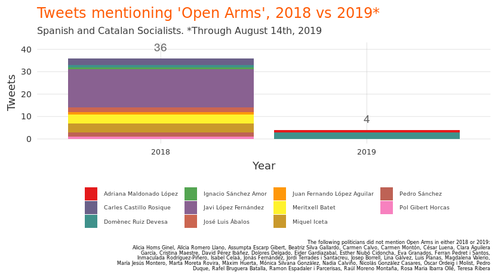
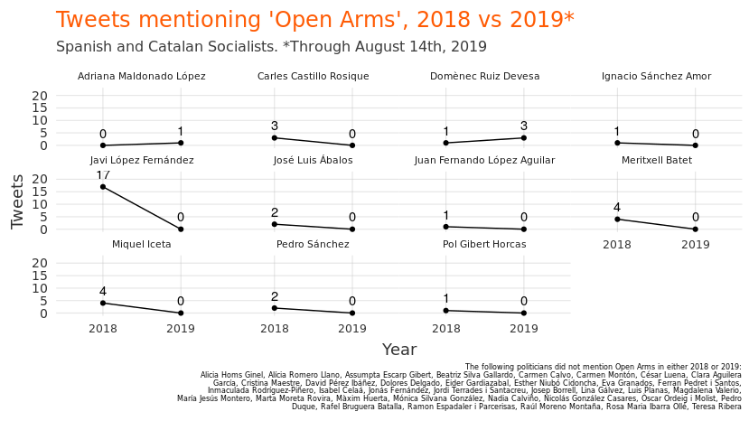

Quantifying hypocrisy: the case of Open Arms and the Spanish Socialists
================

# Open Arms and the Socialists in 2018

The Mediterranean is, according to the [International Organization for
Migration](https://www.reuters.com/article/us-europe-migrants/mediterranean-by-far-worlds-deadliest-border-for-migrants-iom-idUSKBN1DO1ZY),
“by far the world’s deadliest border”. Thousands of human beings die
every year trying to reach Europe in unsafe, overcrowded boats. They
come seeking a better life for themselves and their families, often
fleeing from war, persecution, or desperate poverty.

[Open Arms](https://www.openarms.es/ca/qui-som) is an NGO dedicated to
rescuing migrants at sea. In the Mediterranean, the organization has
rescued nearly 30.000 people.

Open Arms has faced many legal and administrative challenges carrying
out its work. EU members states have been reluctant to provide safe
ports for harbor. The Italian Government - [and the Spanish
Government](https://www.lavanguardia.com/vida/20190703/463276395606/gobierno-espana-open-arms-multa-rescatar-migrantes.html)
- have threatened, on multiple occasions, massive fines for carrying out
rescue work.

In March 2018, for example, the vessel was [detained in
Italy](https://elpais.com/elpais/2018/03/19/inenglish/1521451743_096188.html)
for supposedly “promoting illegal immigration”. During this time, many
politicians expressed outrage. How could it be that a humanitarian
vessel dedicated to saving lives could be stuck in port for legal
reasons?

Politicians from the Catalan Socialist Party (PSC) were particularly
outraged. The PSC issued [a
statement](http://www.socialistes.cat/ca/noticia/el-psc-inicia-una-ofensiva-parlamentaria-en-suport-de-proactiva-open-arms)
declaring a “parlementary offensive in support” of Open Arms’ work.

Ferran Pedret and Meritxell Batet called on the future Catalan
government to work with the Spanish government to ensure that Open Arms
could continue its work. Javi López, the MEP of the PSC, requested
before the European Commission that the Italian Government release Open
Arms. Meritxell Batet, now Minister of Territorial Policy for the
Spanish State, pointed out that “systematic human rights violations and
abuses” were taking place in Libya, and therefore Open Arms needed a
European port. The Spanish socialists, too, spoke up on behalf of Open
Arms. Pedro Sánchez, the leader of the Socialist Party (he was not yet
president of at the time), denounced the thousands of deaths in the
Mediterranean and stated that [“The Government of Rajoy should attend to
the Open Arms boat and committ itself to a cooperation and humanitarian
poliucy worth of the
EU”](https://twitter.com/sanchezcastejon/status/984872600190021632),
[multiple
times](https://twitter.com/sanchezcastejon/status/975764844451385345).

In other words, in 2018, prior to Pedro Sánchez becoming president, and
even into the early days of his presidency, the Socialists were actively
engated in speaking out in favor of the humanitarian work being carried
out by Open Arms. Then 2019 came. And…

# Open Arms and the Socialists in 2019

In 2019, something changed. It wasn’t Open Arms, which continued its
work rescuing migrants in the Mediterranean. Rather, it was the
Socialists. In January of 2019, after Pedro Sánchez had come to power,
his government began doing exactly what the Italian government had done
in 2018 (and which the Socialists so vocally spoke out against):
[blocking Open Arms from doing its
work](https://www.elperiodico.com/es/sociedad/20190114/bloqueo-open-arms-barcelona-7244207).

And then the Socialists stopped talking about Open Arms. They did not
denounce it for supposedly violating maritime law (the excuse the
Socialist government used to block its work). They did not applaud it
for saving lives (as they had done in 2018). They simply went silent.
Completely silent.

Fast-forward to August 2019. Open Arms rescued several hundred migrants
in the Mediterranean at the beginning of the month and then floated,
aimlessly, in the Mediterranean for two weeks. No European government
would grant entry into its waters. The Socialists, now in power in
Spain, who had been so “contundent” (strong) on the issues both of (a)
applauding Open Arms and (b) not returning migrants to [Libya, where
human rights violations were taking
place](http://www.socialistes.cat/ca/noticia/el-psc-inicia-una-ofensiva-parlamentaria-en-suport-de-proactiva-open-arms),
were silent. For two weeks, as the Open Arms sought a safe port for the
hundreds of migrants aborad, the same party which only one year earlier
had declared a “parlamentary offensive” in support of Open Arms, was
completely silent.

What happened? When and why did the Socialists decided to stop
expressing solidarity with Open Arms? Who talked about Open Arms in
2018? And in 2019? Let’s dig into the data.

# Methods

For this analysis, we’ll look at *all* tweets of Socialists who are
either (a) PSOE Ministers in the Sánchez government, (b) PSC
Parlementarians in the Catalan Parliament, or PSC/PSOE Members of
European Parliament. This list is made up of the following people /
twitter handles:

|                              |                   |
| :--------------------------- | :---------------- |
| Pedro Sánchez                | `sanchezcastejon` |
| Carmen Calvo                 | `carmencalvo_`    |
| Josep Borrell                | `JosepBorrellF`   |
| Dolores Delgado              | `LolaDelgadoG`    |
| María Jesús Montero          | `mjmonteroc`      |
| José Luis Ábalos             | `abalosmeco`      |
| Isabel Celaá                 | `CelaaIsabel`     |
| Magdalena Valerio            | `mvalerio_gu`     |
| Luis Planas                  | `LuisPlanas`      |
| Meritxell Batet              | `meritxell_batet` |
| Teresa Ribera                | `Teresaribera`    |
| Màxim Huerta                 | `maximhuerta`     |
| Nadia Calviño                | `NadiaCalvino`    |
| Carmen Montón                | `CarmenMonton`    |
| Pedro Duque                  | `astro_duque`     |
| Miquel Iceta                 | `miqueliceta`     |
| Eva Granados                 | `Eva_Granados`    |
| Ferran Pedret i Santos       | `FerranPedret`    |
| Rafel Bruguera Batalla       | `rafelbruguera`   |
| Carles Castillo Rosique      | `CarlesTgna`      |
| Assumpta Escarp Gibert       | `aescarp`         |
| Ramon Espadaler i Parcerisas | `Ramon_Espadaler` |
| Pol Gibert Horcas            | `polgibert`       |
| Rosa Maria Ibarra Ollé       | `ROSA_M_IBARRA`   |
| Raúl Moreno Montaña          | `raulmorenom`     |
| Marta Moreta Rovira          | `MartaMoreta`     |
| Esther Niubó Cidoncha        | `eniubo`          |
| Òscar Ordeig i Molist        | `oscarordeig`     |
| David Pérez Ibáñez           | `davidpsc`        |
| Alícia Romero Llano          | `aliciarll`       |
| Beatriz Silva Gallardo       | `BeaSilva9`       |
| Jordi Terrades i Santacreu   | `jterrades`       |
| PSC                          | `socialistes_cat` |
| PSOE                         | `PSOE`            |
| Lina Gálvez                  | `linagalvezmunoz` |
| Javi López Fernández         | `fjavilopez`      |
| Inmaculada Rodríguez-Piñero  | `RodriguezPinero` |
| Eider Gardiazabal            | `EGardiazabal`    |
| Nicolás González Casares     | `nicogoncas`      |
| Cristina Maestre             | `crismaestre`     |
| César Luena                  | `cesarluena`      |
| Clara Aguilera García        | `ClaraAguilera7`  |
| Ignacio Sánchez Amor         | `NachoSAmor`      |
| Mónica Silvana González      | `MonicaSilvanaG`  |
| Juan Fernando López Aguilar  | `JFLopezAguilar`  |
| Adriana Maldonado López      | `_AMaldonado_`    |
| Jonás Fernández              | `jonasfernandez`  |
| Alicia Homs Ginel            | `aliciahoms`      |
| Domènec Ruiz Devesa          | `DomenecD`        |

The following Socialist ministers/parlamentarians were excluded, since
they don’t have publicly-known Twitter accounts:

Estrella Durá Ferrandis Fernando Grande-Marlaska Iban García del Blanco
Iratxe García Isabel García Muñoz Javier Moreno Sánchez José Guirao
Margarita Robles María Luisa Carcedo Reyes Maroto

A total of 47 accounts were examined for the entirety of 2018-2019
(through August 15), resulting in a total of 44115 tweets. A tweet was
classified as “being about Open Arms” if it contained any of the
following:

    Open Arms
    OpenArms
    open arms
    openarms

# Results

Mentions of Open Arms dropped drastically among Spanish and Catalan
Socialists from 2018 to 2019:

<!-- -->

Most Socialists did not mention Open Arms on Twitter either year. But
among those that ever mentioned Open Arms on Twitter, rates were higher
in 2018 than 2019 among all but two of the 47:

<!-- -->

In other words, despite their enthusiasm for and solidarity with Open
Arms’ work in 2018, and despite the crew and rescued individuals of Open
Arms spending the first two weeks of August in the Mediterranean with no
port, Spanish and Catalan socialists were extremely silent on the topic.
Only two Socialists mentioned Open Arms during the period from January 1
through August 14, 2019, and the mentions were not the enthusiastic
endorsements or expressions of solidarity as
before.

### Socialists’ mentions of Open Arms, 2018

| date       | time     | username         | name                     | tweet                                                                                                                                                                                                                                                                                                                                                                                                                                                 |
| :--------- | :------- | :--------------- | :----------------------- | :---------------------------------------------------------------------------------------------------------------------------------------------------------------------------------------------------------------------------------------------------------------------------------------------------------------------------------------------------------------------------------------------------------------------------------------------------- |
| 2018-03-15 | 19:22:41 | carlestgna       | carles castillo          | \#HEROES <https://twitter.com/openarms_fund/status/974340812921298945> …                                                                                                                                                                                                                                                                                                                                                                              |
| 2018-03-15 | 17:16:36 | carlestgna       | carles castillo          | .@UEmadrid @EU\_Commission @JunckerEU <https://twitter.com/openarms_fund/status/974315603271081984> …                                                                                                                                                                                                                                                                                                                                                 |
| 2018-03-18 | 23:38:14 | nachosamor       | Nacho Sánchez Amor       | Muy preocupado por la situación del barco de rescate de inmigrantes africanos @openarms\_fund . La criminalization de las ONGs de rescate no solo es un error político, es una desenfoque ético. Todo mi apoyo.                                                                                                                                                                                                                                       |
| 2018-03-19 | 17:04:02 | sanchezcastejon  | Pedro Sánchez            | Salvan vidas y remueven conciencias. Seguimos con preocupación el caso de @openarms\_fund y esperamos que se clarifique lo antes posible. La gestión de la inmigración es un desafío inaplazable para la Unión Europea. <https://www.eldiario.es/desalambre/Italia-inmoviliza-inmigrantes-Open-Arms_0_751375298.html> … @eldiarioes                                                                                                                   |
| 2018-03-19 | 14:18:23 | miqueliceta      | Miquel Iceta Llorens /❤️ | El meu suport i el de @socialistes\_cat a @openarms\_fund, organització que treballa en condicions molt dures per poder salvar la vida de desenes de milers de persones que es troben en risc de mort i abandonades a la seva sort. <https://www.huffingtonpost.es/2018/03/19/italia-se-incauta-del-barco-de-proactiva-open-arms-y-les-acusa-de-fomentar-la-inmigracion-ilegal_a_23389156/> …                                                         |
| 2018-03-20 | 12:41:55 | fjavilopez       | Javi López               | Organitzacions com @openarms\_fund estan defensant el dret a la vida i al salvament marítim cada dia, al mar, jugant-se la vida i de forma altruista. No podem permetre que es criminalitzi a qui estant suplint les carències dels estats. \#FreeOpenArms <http://www.europapress.es/internacional/noticia-quince-eurodiputados-espanoles-piden-bruselas-actue-retiren-cargos-contra-ong-proactiva-20180319165840.html> … pic.twitter.com/P3nSwqXE9y |
| 2018-03-20 | 10:54:53 | jflopezaguilar   | Juan F López Aguilar     | Solidaridad con Open Arms, y energica dnuncia dsde el Parl Eur d la aberrante distirsion del Derecho europeo (la “Faciltation Directive”) q permite criminalizar la accion humanitaria q rescata vidas en la mar. Inaceptable. Los prcedimientos abiertos deben archivarse d inmediato\!                                                                                                                                                              |
| 2018-03-21 | 18:16:37 | meritxell\_batet | Meritxell Batet          | El @socialistes\_cat inicia una ofensiva parlamentària en suport de Proactiva Open Arms <http://www.socialistes.cat/ca/noticia/el-psc-inicia-una-ofensiva-parlamentaria-en-suport-de-proactiva-open-arms> … @openarms\_fund @FerranPedret @fjavilopez pic.twitter.com/CTx1uVuog7                                                                                                                                                                      |
| 2018-03-21 | 18:10:25 | meritxell\_batet | Meritxell Batet          | 🔴 Presentamos preguntas escritas al Gobierno para saber si están realizando las gestiones oportunas para que Italia retire los cargos contra @openarms\_fund y reconocer la labor de esta ONG en el Mediterráneo \#Congreso pic.twitter.com/iSOApALuh6                                                                                                                                                                                                |
| 2018-03-21 | 18:24:51 | miqueliceta      | Miquel Iceta Llorens /❤️ | El PSC inicia una ofensiva parlamentària en suport de Proactiva Open Arms <http://www.socialistes.cat/ca/noticia/el-psc-inicia-una-ofensiva-parlamentaria-en-suport-de-proactiva-open-arms> …                                                                                                                                                                                                                                                         |
| 2018-03-21 | 18:19:24 | miqueliceta      | Miquel Iceta Llorens /❤️ | El PSC inicia una ofensiva parlamentària en suport de Proactiva Open Arms <http://www.socialistes.cat/ca/noticia/el-psc-inicia-una-ofensiva-parlamentaria-en-suport-de-proactiva-open-arms#.WrKUFFExsOQ.twitter> …                                                                                                                                                                                                                                    |
| 2018-04-13 | 21:15:00 | sanchezcastejon  | Pedro Sánchez            | Miles de personas mueren cada año en el Mediterráneo y miles se salvan gracias al trabajo de las ONGs. El Gobierno de Rajoy debe atender ya al barco de @openarms\_fund y comprometerse con una política de cooperación y humanitaria digna en la UE. Hay que parar este drama. <https://twitter.com/ambbatet/status/984794193204785153> …                                                                                                            |
| 2018-04-13 | 16:07:55 | meritxell\_batet | Meritxell Batet          | .@openarms\_fund Reclamamos que se respeten los derechos fundamentales y se cumplan los derechos internacional y marítimo y pedimos a la UE respuestas acertadas para evitar lo más importante: las muertes en el Mediterráneo @gpscongreso \#freeopenarms pic.twitter.com/gNt9FUG2aV                                                                                                                                                                 |
| 2018-04-13 | 16:03:26 | meritxell\_batet | Meritxell Batet          | Reclamamos al Gobierno de España que se comprometa a atender al barco español retenido @openarms\_fund y a impulsar en el marco de la \#UE una política digna, de cooperación y preservación del derecho humanitario a la altura de los valores que Europa quiere representar @campsoscar pic.twitter.com/Rtd6Yuk9QD                                                                                                                                  |
| 2018-04-16 | 12:11:05 | fjavilopez       | Javi López               | Celebrem que tornin l’Open Arms a @openarms\_fund. Salvar vides de morir ofegades no és un delicte, és humanitat. Aquella que falta a alguns governs, com el nostre, que només ha complert amb el 13,7% de les persones que es va comprometre a acollir. <http://www.ccma.cat/324/lopen-arms-podra-tornar-al-mar-despres-dun-mes-immobilitzat-per-la-justicia-italiana/noticia/2850375/> …                                                            |
| 2018-06-25 | 15:16:30 | fjavilopez       | Javi López               | Desgarradora crónica de @Gabriela\_Schz para @desalambre desde el buque de la ONG @openarms\_found. Han intentado hasta el último minuto rescatar a más de 1000 personas pero la insolidaridad ha ganado la partida, cobrándose eso sí almenos 10 muertes. <https://m.eldiario.es/desalambre/Open-Arms-Mediterraneo-Italia-Malta_0_785671800.html> …                                                                                                  |
| 2018-06-28 | 18:43:22 | fjavilopez       | Javi López               | 📰 Our observatory mission with @openarms\_fund in the @nytimes \! “A Spanish rescue ship set sail Thursday for international waters carrying four European parliamentarians as EU nations bickered over managing migrant flows across the Mediterranean Sea.” <https://www.nytimes.com/aponline/2018/06/28/world/europe/ap-eu-europe-aid-ship.html> …                                                                                                 |
| 2018-06-28 | 18:15:46 | fjavilopez       | Javi López               | He tenido la oportunidad de conversar con @julia\_otero en @Juliaenlaonda sobre la misión de observación que estamos haciendo en el \#Astral de @openarms\_fund al mismo tiempo que se celebra la cumbre \#EUCO para reclamar un sistema de asilo común europeo <https://soundcloud.com/user-862705465/julia-en-la-onda-el-eurodiputado-javi-lopez-en-el-astral-28-06-2018> …                                                                         |
| 2018-06-28 | 12:22:23 | fjavilopez       | Javi López               | ⛵️ En el Astral de @openarms\_fund\! Me he sumado a una misión de observación de los trabajos de rescate que realizan en el Mediterráneo central. Ver sus dificultades, la desprotección de los que protegen y la necesidad de encontrar verdaderas soluciones europeas y seguras\! pic.twitter.com/CNEH4FeH86                                                                                                                                        |
| 2018-06-29 | 17:14:38 | fjavilopez       | Javi López               | Os envío un mensaje desde el @openarms\_fund. Hago de altavoz de ONGs que están salvando miles de vidas. Pedimos protección para los que intentan proteger. En un momento muy importante para Europa, al mismo tiempo que se está celebrando @EUCouncil sobre migración.👇 \#EUCO pic.twitter.com/mPh5lSJS8u                                                                                                                                           |
| 2018-06-29 | 00:56:01 | fjavilopez       | Javi López               | Después de día y medio de travesía nos hemos encontrado con el barco @openarms\_fund . Pasaremos los próximos días en el \#Astral siguiendo las labores de rescate. El mar está tranquilo esta noche, pero las ONGs y voluntarios no descansan. \#bonanit \#migrationEU pic.twitter.com/gVpwECghPU                                                                                                                                                    |
| 2018-06-30 | 23:30:16 | fjavilopez       | Javi López               | Rumbo a Barcelona. En el Astral junto al Open Arms. Quedan 3 días de travesía pero zarpamos con la satisfacción de acompañar a @openarms\_fund y haber vivido las miserias y esperanzas que se entrelazan en el Mediterráneo. <https://elpais.com/internacional/2018/06/30/actualidad/1530378576_622029.html> …                                                                                                                                       |
| 2018-06-30 | 12:57:34 | fjavilopez       | Javi López               | El @openarms\_fund rescatando 59 vidas en el Mediterráneo. 4 de ellos son menores y 2 de ellos no acompañados. Están todos sanos y a salvo. Proceden de hasta 14 nacionalidades distintas. Hoy he podido vivir la realidad del día a día del Open Arms. \#migrationEU pic.twitter.com/aKv00BxBTh                                                                                                                                                      |
| 2018-06-30 | 10:03:46 | fjavilopez       | Javi López               | Ayer 100 personas murieron en el naufragio de una patera frente a las costas libias. El @openarms\_fund podría haberlas rescatado pero fue ignorado por las autoridades libias e italianas. @campsoscar nos cuenta en este video que no se les dejó actuar.👇🏻 pic.twitter.com/xKq3XhLTft                                                                                                                                                              |
| 2018-07-01 | 10:34:53 | fjavilopez       | Javi López               | “Estáis a salvo. Bienvenidos” @Gabriela\_Schz relata desde el @openarms\_fund el rescate de ayer y el pánico y la esperanza de los supervivientes hasta que no reconocen a sus salvadores y los relacionan con una ONG y con Europa. Esta vez, con España. <https://www.eldiario.es/desalambre/Open-Arms-rescata-personas-Mediterraneo_0_787771356.html> …                                                                                            |
| 2018-07-02 | 15:33:29 | fjavilopez       | Javi López               | Hoy desde el Astral hemos vuelto al barco Open Arms. Continuamos en ruta a BCN pero muchos lo hacen con un largo camino a sus espaldas. Un camino que ha podido durar años, plagado de conflictos, abusos o sueños en busca de oportunidades. Esta tarde bordeamos el sur de Cerdeña. pic.twitter.com/SdIEtYhv9O                                                                                                                                      |
| 2018-07-03 | 18:02:05 | fjavilopez       | Javi López               | Rumbo a Barcelona ahora pasamos por el norte de Menorca junto al Open Arms. Mañana llegaremos a puerto. Para muchos el fin de un largo camino y la oportunidad de un nuevo inicio. Os recomiendo que sigáis a las periodistas a bordo: @RenataBritoAP @mariamartind @Gabriela\_Schz pic.twitter.com/2cbvYCGjWY                                                                                                                                        |
| 2018-07-04 | 19:04:47 | polgibert        | Pol Gibert / ♥️          | A l’acte de benvinguda a @openarms\_fund i a les seixanta persones rescatades al Mediterrani. Orgullós de veure a @fjavilopez acompanyant i defensant els drets de les persones que arriben a les nostres costes fugint de conflictes i pobresa \#BackOpenArms pic.twitter.com/f3Wa9kTXrZ                                                                                                                                                             |
| 2018-07-04 | 19:17:13 | fjavilopez       | Javi López               | Ya en Barcelona pero muchas personas no han podido llegar a este puerto seguro. Muchas otras no llegaran en un futuro si no hacemos una verdadera política europea de refugio. Gracias @openarms\_fund por abrir los brazos a quienes buscan refugio; por abrirnos los ojos a los demás. pic.twitter.com/4a4bEYFf6r                                                                                                                                   |
| 2018-07-04 | 13:39:16 | fjavilopez       | Javi López               | Esta ha sido la larga travesía que hemos realizado con Astral de la mano del Open Arms. La travesía de los puertos cerrados y la mezquindad de algunos gobiernos. Pero la travesía de la esperanza y la solidaridad al llegar a casa. pic.twitter.com/Fplt4CS2a2                                                                                                                                                                                      |
| 2018-07-18 | 21:15:03 | carlestgna       | carles castillo          | “Pas Libye, pas Libye”, repite como rezando, una letanía susurrada con un hilo de voz. “Pas \#Libye”. <https://twitter.com/openarms_fund/status/1019572287094362112> …                                                                                                                                                                                                                                                                                |
| 2018-08-06 | 12:38:14 | domenecd         | Domenec Ruiz Devesa      | No estaría de más que la Comisión Europea dijera alguna cosa sobre el cierre de los puertos en Italia. Aunque sea agosto. <https://twitter.com/openarms_fund/status/1026414430148616192> …                                                                                                                                                                                                                                                            |
| 2018-08-29 | 22:28:11 | abalosmeco       | José Luis Ábalos         | Hoy me he reunido con el director y fundador de @openarms\_fund, @campsoscar. Esta ONG ha rescatado en el mar a decenas de miles de personas desde 2015. Es encomiable la enorme labor humanitaria que realizan. pic.twitter.com/OUmM9C3faX                                                                                                                                                                                                           |
| 2018-08-30 | 11:55:47 | abalosmeco       | José Luis Ábalos         | Muy satisfecho del acuerdo por el que @openarms\_fund se sumará a @salvamentogob en las tareas de rescate de seres humanos en el Estrecho y Mar de Alborán. <https://bit.ly/2wr7mDC>  Foto: Juan Medina / Reuters pic.twitter.com/8GFMfJFatm                                                                                                                                                                                                          |
| 2018-09-03 | 10:00:55 | miqueliceta      | Miquel Iceta Llorens /❤️ | El ‘Open Arms’ se une a Salvamento para rescatar inmigrantes, Elsa García de Blas <https://elpais.com/politica/2018/08/29/actualidad/1535565087_278838.html?id_externo_rsoc=TW_CC> … via @elpais\_espana                                                                                                                                                                                                                                              |
| 2018-10-09 | 12:09:05 | fjavilopez       | Javi López               | Acabo de votar en la Comisión de Exteriores @Europarl\_ES para que se conceda el Premio Sájarov a las ONG que protegen los Derechos Humanos y salvan vidas en el Mediterráneo. Una oportunidad para reconocer su gigantesca labor desde las instituciones. @openarms\_fund @campsoscar pic.twitter.com/L77E0dZRbO                                                                                                                                     |

### Socialists’ mentions of Open Arms, 2019

| date       | time     | username     | name                   | tweet                                                                                                                                                                                                                                                                                                                                                   |
| :--------- | :------- | :----------- | :--------------------- | :------------------------------------------------------------------------------------------------------------------------------------------------------------------------------------------------------------------------------------------------------------------------------------------------------------------------------------------------------ |
| 2019-08-09 | 09:19:38 | *amaldonado* | Adriana Maldonado/♥️🇪🇺 | David Sassoli, el presidente de la Eurocámara pide a Juncker ayuda urgente para el Open Arms <http://www.noticiasdenavarra.com/2019/08/08/mundo/el-presidente-de-la-eurocamara-pide-a-juncker-ayuda-urgente-para-el-open-arms> … via @NoticiasNavarra                                                                                                   |
| 2019-08-13 | 13:50:56 | domenecd     | Domenec Ruiz Devesa    | A Europa la forman sus Estados, sí, pero también sus instituciones, sus ciudadanos, su historia, su cultura, y su sociedad civil, como la propia Open Arms. Europa somos todos. Rigor y precisión, nunca están de más. <https://twitter.com/JavierPGomez/status/1161211291358433280> …                                                                  |
| 2019-08-13 | 08:43:36 | domenecd     | Domenec Ruiz Devesa    | La labor que hacéis es encomiable pero no vuestra constante descalificación de “Europa”, así, en general. El presidente del Parlamento Europeo ha pedido a la Comisión Europea que actúe y ésta a su vez se ha dirigido a los Estados. No olvidemos que quien viola normas es Salvini. <https://twitter.com/openarms_fund/status/1161162758911664128> … |
| 2019-08-14 | 18:53:20 | domenecd     | Domenec Ruiz Devesa    | Yo más bien diría “Salvini” donde pone “Europa”. Por otro lado celebro que la justicia italiana permita que el Open Arms se dirija a Lampedusa. <https://twitter.com/openarms_fund/status/1161531778093527040> …                                                                                                                                        |

# Interpretation

Why? What happened? What compelled Spanish and Catalan socialists to be
so adamently vocal about the cause of Open Arms in 2018, and so
stunningly silent in 2019?

What compelled MEP Javi Lopez to spend [five days aboard Open Arms
in 2018](https://twitter.com/fjavilopez/status/1013172893101051904) and
to [request that the NGO be given human rights awards for its
work](https://twitter.com/fjavilopez/status/1049602644749242368) only to
say *nothing* about Open Arms during the two weeks it was without safe
harbor in August 2019?

Why did Socialist President of Congress nMeritxell Batet call on the
Spanish Government to take action for the cause of Open Arms when that
Spanish Government was in the hands of another party, but say nothing
about Open Arms when the Spanish Government was in the hands of her own
party?

Why did PSC President Miquel Iceta offer his “support” for the work of
Open Arms in 2018, but say nothing about Open Arms during the 2-week
period during which Spain refused to offer safe harbor?  

Why did Catalan parliamentarian Pol Gibert tweet the “BackOpenArms”
hashtag from the welcoming reception for Open Arms in 2018, but say
nothing during their two weeks of peril at sea in 2019?

Why did Spanish Minister of Development, Jose luis Ábalos, express his
satisfaction with the rescue work of Open Arms in August 2018, but say
nothing about their work a year later, when they needed a safe port at
which to disembark?

Why did Catalan Parlamentarian Carles Castillo call the workers of Open
Arms “Heroes” in March 2018, only to sit by silently during their plight
in 2019?

Why did Spanish President Pedro Sánchez applaud the work of Open Arms
and call on his predecssor to “stop this drama” (in reference to not
letting Open Arms do rescue operations) in 2018, only to refuse a safe
port in 2019?

Could it be that the 47 socialists examined feel that Open Arms, whose
principles many of them enthusiastically applauded in 2018, has
abandoned its principles? Could it be that they feel that the work that
Open Arms is doing is wrong?

If so, why not say that? Why not condemn Open Arms for “breaking
maritime law” or “encouraging illegal immigration”? Why not say “hey, we
were wrong in 2018, Open Arms is bad\!”? Why the silence?

I don’t know the answer to these questions. I don’t know why the
Socialists have decided to abandon Open Arms, both on Twitter and in
reality. What I *do* know is this: the high degree of uniformity in the
Socialists’ silence on the subject in 2019 is *not* suggestive of
spontaneity. Someone in the media should ask if Socialists have been
given top-down instructions not to talk about Open Arms. And if so, why?

# Catalan-language plots

<!-- -->

<!-- -->

# Technical details

Data were gathered from twitter using the python `twint` package, and
stored in a local database using the instructions in the set-up of the R
`vilaweb` package (<https://github.com/joebrew/vilaweb>). The code for
this analysis is publicly available
[here](https://github.com/joebrew/vilaweb/tree/master/analyses/openarms).
