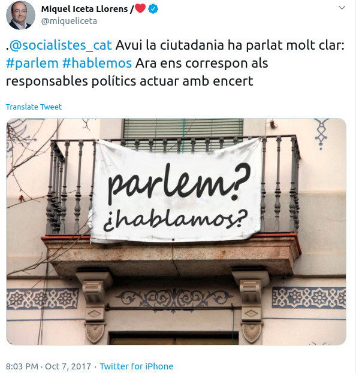
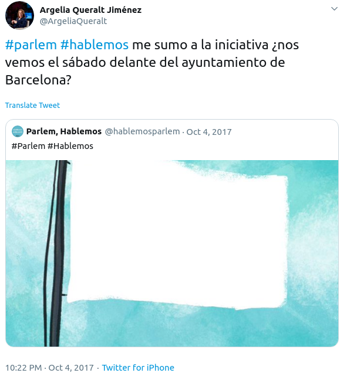
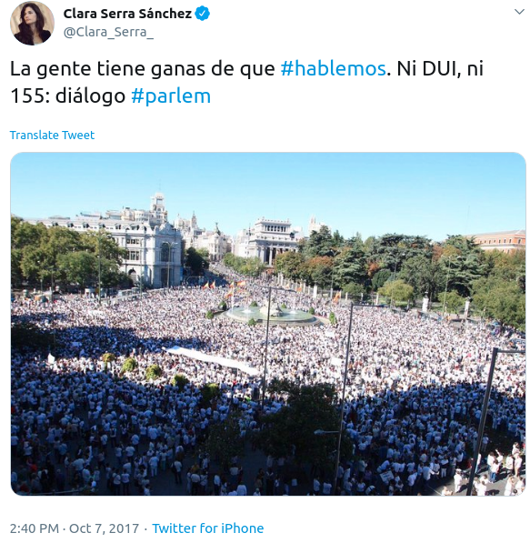
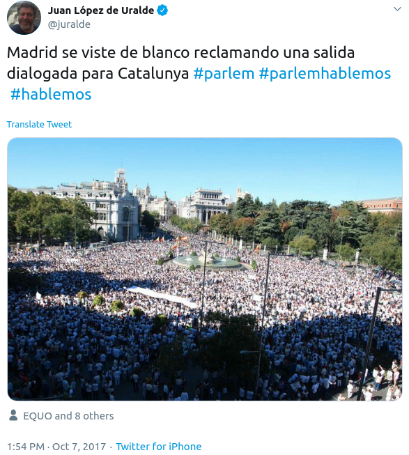
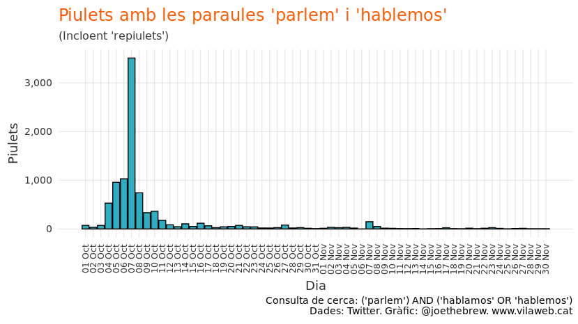
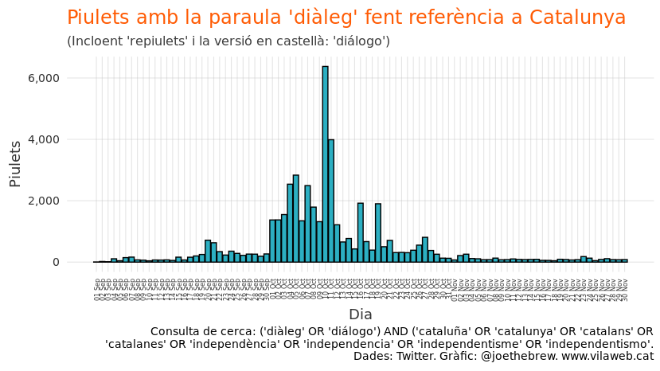
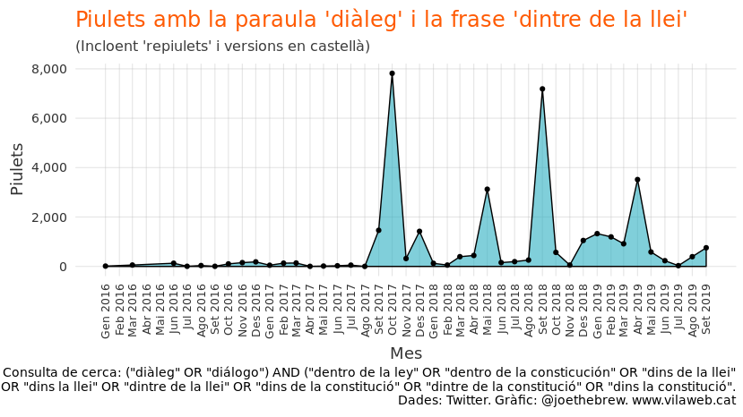
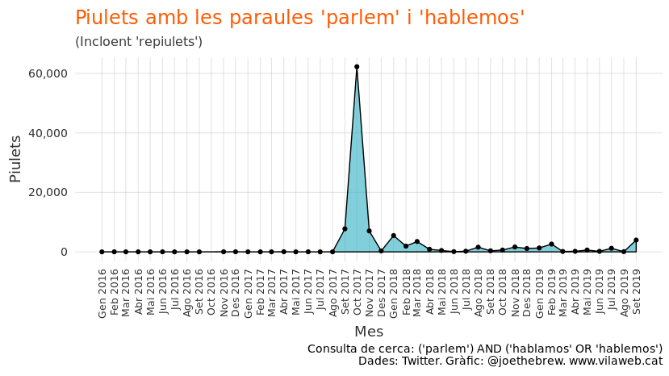
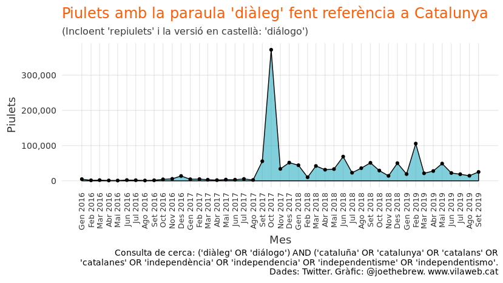

La efectivitat de la desobediència: quantificant l’efecte
‘Parlem/Hablemos’
================

# Introducció

El diàleg és necessari per prevenir i per resoldre de manera pacífica
els conflictes polítics. Això és una obvietat que es pot confirmar amb
l’estudi de qualsevol episodi conflictiu de l’història humana. El
diàleg és fonamental, no només per entendre “l’adversari” polític, sinó
també per trobar punts en comú, construir consensos amplis, i crear un
camí a seguir en un context de bloqueig polític.

Una altre cosa òbvia: des de fa dos anys, no hi hi diàleg real a
Catalunya. Els interlocutors que una banda (l’independentisme) considera
legítims estan a la presó i a l’exili. Cap representant del govern
espanyol ha mantingut tans sols una conversa amb els caps dels
principals partits independentistes catalans (Carles Puigdemont i Oriol
Junqueras) des de 2017. I en les poques converses que es fan entre els
representants de l’estat i els representants de l’independentisme (per
exemple, la conversa a Pedralbes entre Quim Torra i Pedro Sánchez), una
banda (l’unionisme) prohibeix d’antuvi parlar de la proposta de l’altre
banda.

El diàleg que exclogui tan sols *parlar* del que vol l’altre no és
diàleg real, sinó monòlegs simultanis. Per trobar una solució dialogada
a un bloqueig polític (el que hi ha, evidentment, en el conflicte
català-espanyol), s’ha de:

1.  Reconèixer la legitimitat de l’altre (l’interlocutor “adversari”)  
2.  Acceptar considerar les propostes de l’altre (parlar de tot)  
3.  Mantenir, al llarg del temps, una disposició oberta i una voluntat
    d’arribar a una solució

En el cas del conflicte polític català-espanyol, cap d’aquestes tres
condicions s’estan complint. Però no ha sigut sempre el cas\! Fa dos
anys, en els dies posteriors al referèndum de l’1 d’octubre, hi ha haver
un clam pel diàleg, no només dels liders independentistes, sinó també de
gran part dels líders unionistes (i, a més, de l’Unió Europea). Però amb
l’empresonament de gairebé la totalitat d’una banda del que hauria sigut
la taula de diàleg, aquesta finestra d’oportunitat es va tancar.

# El moment “parlem/hablemos”

El moviment “parlem/hablemos” va néixer després de les manifestacions
del 3 d’octubre del 2017, arribant al seu bec el dia 7 d’octubre amb una
multitudinària manifestació a Barcelona (i, en menor mesura, a altres
ciutats de l’estat espanyol). Els seus principals promotors /
protagonistes van ser dels socialistes, però també va comptar amb el
suport de diversos partits polítics, sobre tot els progresistes.

<table style="width:100%">

<tr>

<td>

</td>

<td>

</td>

</tr>

<tr>

<td>

</td>

<td>

</td>

</tr>

</table>

Fem un recompte de piulets esmentant la frase “parlem” i “hablemos” per
tenir una idea del naixement del moviment, i de la seva desaparació:

<!-- -->

El moviment “parlem/hablemos” va ser un moment només. Va néixer i morir
practicament a la mateixa setmana.

# La mort del “diàleg”

Si analitzem la freqüència de la paraula “diàleg” en piulets que fan
referència a Catalunya, es nota un patró similar. L’1 d’octubre va
provocar una pujada important en els clams pel diàleg, però a mig
octubre ja començava a baixar. A finals d’octubre, amb la confirmació de
la judicialització total del conflicte (els políticos presos i
exiliats), la freqüència dels esments de “diàleg” va tornar als seus
nivells pre-1 d’octubre.

<!-- -->

# El naixement (i llarga vida) de la frase “dintre de la llei”

A l’octubre del 2017 va néixer una nova frase: “diàleg dintre de la
llei”. La frase és essencialment sense sentit, ja que si la solució al
conflicte ja fos “dintre de la llei” no hi hauria conflicte. A més,
dialogar per sí ja és “dintre de la llei” (no hi ha cap llei que
prohibeix dialogar, fins i tot de coses il-legals). També és una frase
sense sentit perquè implica que el diàleg polític no pot abordar coses
“fora de la llei”, quan en realitat fer política és precisament, i per
definició, això: crear i canviar lleis.

Però a diferència de les morts prematures de les onades de
“parlem-hablemos” i “diàleg”, el concepte de “diàleg dintre de la
llei” va engantxar. La seva presència a les xarxes, gairebé inexistent
abans de l’octubre del 2017, s’ha mantingut alta des de llavors.

<!-- -->

L’ús de la frase “diàleg dintre de la llei” va sorgir com a resposta als
clams pel diàleg. Era una manera d’acceptar el principi del diàleg en la
forma, però no en el contingut. La frase, només utilitzada per aquells
que s’oposen a canviar la llei sobre la qüestió de l’autodeterminació,
va sobreviure no perquè afavoreix el diàleg, sinó perquè restringeix el
concepte del diàleg a acceptar les condicions de només un dels dos
costats del conflicte polític. “Dintre de la llei” no vol dir estar
disposat a canviar la llei, sinó acceptar que no es canviarà.

# El contexte 2 anys després

Si analitzem els clams pel diàleg 2 anys després de l’1 d’octubre, el
panorama és força desolador. La combinació de les paraules “parlem” i
“hablemos”, tan revindicats al mes d’octubre del 2017, ha desaparegut
de l’espai pùblic (i la gran majoria de les referències actuals no són
clams sinó crítiques de la seva desaparació):

<!-- -->

I les referències a la necessitat del “diàleg” a Catalunya també van
rebaixar moltíssim des del mes d’octubre del 2017:

<!-- -->

# Conclusió

Què ha passat? Per què el moment “parlem/hablemos” va durar tan poc? Per
què les referències al “diàleg” van pujar tant a l’octubre del 2017,
però van baixar tant després? La resposta és clara: en els primers dies
d’octubre, hi va haver un reconeixement ampli de la gravetat del
conflicte català-espanyol, i de la seva naturalesa *política*. I davant
un problema *polític*, cal que hi hagi diàleg.

Però en els dies posteriors a la manifestació “parlem-hablemos” es va
consolidar entre diferents poders polítics una altre manera
d’afrontar-se a la qüestió catalana: no com un problema polític (que
requeriria diàleg i negocació, com tots els problemes polítics), sinó
com un problema de *criminalitat*. Al curt termini, judicialitzar el
conflicte era una estratègia bril-liant: tractar el referèndum com una
rebel-lió o un alçament violent no només li treia legitimitat política,
sinó també justificava poder “decapitar” el llideratge català a través
de la presó preventiva.

Judicialitzar el conflicte català, tot i que fos efectiu al curt termini
per frenar la independència, també va provocar uns problemes. Primer,
calia construir [un relat d’una violència que no va
existir](https://www.vilaweb.cat/noticies/els-dirigents-unionistes-no-van-parlar-de-violencia-durant-els-dies-doctobre-on-ara-diuen-que-hi-va-haver-violencia-les-dades/).
Segon, calia justificar el fet que el govern espanyol desoia la demanda
de la Comissió Europea per que [“all relevant players move very swiftly
from confrontation to
dialogue”](https://www.reuters.com/article/us-spain-politics-catalonia-eu/eu-urges-spain-to-talk-to-catalans-condemns-violence-idUSKCN1C712P).
Com poder explicar a una Europa que demanava “diàleg” amb “tots els
actors rellevants” que els representants de l’estat espanyol no només no
parlaven amb els liders independentistes, sinó que els posava en presó?

Resumim-ho: hi va haver només un moment en els darrers anys on hi havia
un clam a favor del diàleg real de sectors contraris a la independència:
les primeres setmanes d’octubre. És a dir, la desobediència civil (i la
incertesa política provocada per ella) va crear un contexte favorable al
diàleg real. Davant aquesta incertesa va néixer el moment
“parlem/hablemos”. En aquest moment, la Unió Europea, el PSOE, els
Comuns, i altres sectors polítics cridaven a un diàleg entre tots els
actors rellevants, sense esmentar frases sense sentit com “dintre de la
llei” o aplicar-hi precondicions.

Però pocs dies després, l’empresonament/l’exili dels interlocutors
legítims d’una de les dues bandes del conflicte va acabar amb la
incertesa (al curt termini). I la manca d’incertesa va acabar amb la
necessitat de diàleg. Els unionistes que pocs dies abans demanaven
diàleg entre Rajoy i Puigdemont, ara veien que parlar amb Puigdemont no
era necessari.

Però evitar el diàleg real (o sigui, un diàleg que inclogui les
propostes de tots els actors rellevants) té un cost al llarg termini: la
no-resolució de conflictes polítics. I pensis el que pensis de
l’autodeterminació de Catalunya, és clar que el conflicte polític no
s’ha resolt. No cal ser independentista per reconéixer que les
estratègies empleats pels governs de Rajoy i Sànchez (155,
empresonaments, exili, judicialització, negativa a tan sols *parlar*
d’un referèndum d’autodeterminació, encara que la gran majoria de
catalans ho vulgui) no han sigut molt efectius.

La sentència del judici contra el procés sortirà d’aqui poc. És una
oportunitat no només per l’independentisme, sinó per tots aquells que
pensen que un dialèg real seria bo per Catalunya i per Espanya. Tot i
que la incertesa política, per sí sola, no és desitjable, la realitat
dels darrers anys demostra que només és en un contexte d’incertesa
política que el govern espanyol esta disposat a dialogar amb els
interlocutors de l’independentisme. Si la reacció a la sentència
consisteix en un grau de desobediència civil (el que promou, per
exemple, el “tsunami democràtic”) prou significatiu per provocar
incertesa política, és probable que aquella incertesa provocarà (com va
fer a l’octubre del 2017) una finestra d’oportunitat pel diàleg.

# Detalls tècnics

The code for this analysis is publicly available at
<https://github.com/joebrew/vilaweb/tree/master/analyses/parlem_hablemos>.
