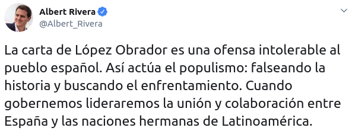
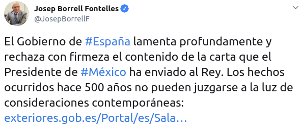
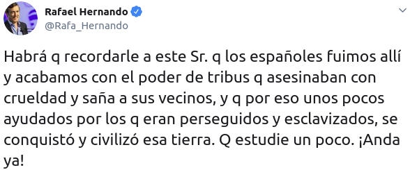
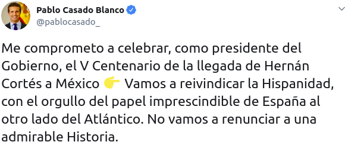
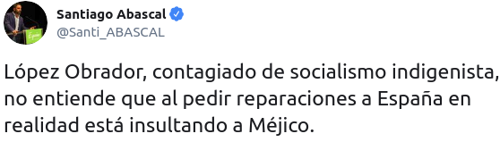
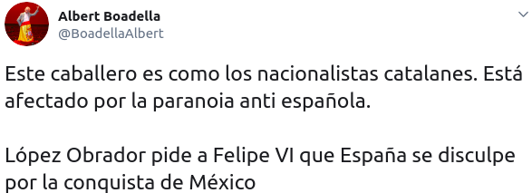

```{r setup, include=FALSE, echo = FALSE}
# Basic knitr options
library(knitr)
opts_chunk$set(comment = NA, 
               echo = FALSE, 
               warning = FALSE, 
               message = FALSE, 
               error = TRUE, 
               cache = FALSE,
               fig.path = 'figures/')
```


```{r}
# Libraries
library(vilaweb)
library(rtweet)
library(tidyverse)
library(databrew)
library(translateR)
library(sentimentr) # https://github.com/trinker/sentimentr
require(RPostgreSQL)
require(readr)  
library(ggrepel)
require(DBI)
library(ggtern)
  
```

```{r, fig.height = 8}
# # Get most recent tweets from our people of interest
keep_names <- c('albert_rivera',
                'albiol_xg',
                'alejandro_tgn',
                'alevysoler',
                'carmencalvo_',
                'carrizosacarlos',
                'ciudadanoscs',
                'ciutadanscs',
                'eva_granados',
                'inesarrimadas',
                'j_zaragoza_',
                'josepborrellf',
                'marianorajoy',
                'meritxell_batet',
                'miqueliceta',
                'pablocasado_',
                'ppcatalunya',
                'ppopular',
                'psoe',
                'sanchezcastejon',
                'santi_abascal',
                'vox_es')

keep_names2 <- c('esquerra_erc',
                 'pnique',
                 'pdemocratacat',
                 'krls',
                 'adacolau',
                 'albanodante76',
                 'carlescampuzano',
                 'catencomu_podem',
                 'quimtorraipla',
                 'cupnacional',
                 'jaumeasens',
                 'joantarda',
                 'junqueras',
                 'miriamnoguerasm',
                 'pablo_iglesias_',
                 'perearagones')
people <- c(keep_names, keep_names2)
if(file.exists('tl.RData')){
  load('tl.RData')
} else {
  # Connect to the db
  pg = DBI::dbDriver("PostgreSQL")
  con = DBI::dbConnect(pg, dbname="twitter")
  tl <- RPostgreSQL::dbGetQuery(
    con,
    paste0("SELECT * FROM twitter")
  )
  save(tl, file = 'tl.RData')  
  dbDisconnect(con)
  }
tl_original <- tl

tl <- tl %>% filter(username %in% people)

# Read in google sheet with keys
library(gsheet)
if(!'goog.RData' %in% dir()){
  goog_people <- gsheet::gsheet2tbl(url = 'https://docs.google.com/spreadsheets/d/1k6_AlqojK47MMqzuFYAzBnDfYXysmUgSseaKvHTb3W4/edit#gid=1425313388')
  save(goog_people,
       file = 'goog.RData')
} else {
  load('goog.RData')
}


tl <- tl %>% filter(username %in% goog_people$username)

# Join the google data
tl <- tl %>%
  left_join(goog_people)

# Keep only a defined set
keep_people <- 
    c('adacolau',
  'albanodante76',
  'albert_rivera',
  'albiol_xg',
  'alevysoler',
  'carlescampuzano',
  'carmencalvo_',
  'carrizosacarlos',
  'eva_granados',
  'inesarrimadas',
  'j_zaragoza_',
  'jaumeasens',
  'joantarda',
  'josepborrellf',
  'junqueras',
  'krls',
  'marianorajoy',
  'meritxell_batet',
  'miqueliceta',
  'miriamnoguerasm',
  'pablo_iglesias_',
  'pablocasado_',
  'pdemocratacat',
  'perearagones',
  'pnique',
  'quimtorraipla',
  'sanchezcastejon',
  'santi_abascal')

tl <- tl %>%
  filter(username %in% keep_people)

find_perdo <- function(x){
  x <- tolower(x)
  grepl('perdó|perdo|disculp', x)
}

tl$perdo <- find_perdo(tl$tweet)
```

# Introducció

Fa unes setmanes, el president de Mexique Andrés Manuel López Obrador, va demanar al Felipe de Borbón que demani perdó per la conquesta de Mexique, i els abusos dels indígenes a mans dels colons espanyols. Personalment, amb independència dels motius polítics de López Obrador, em sembla una petició força raonable. Hi ha una llarga sèrie d'abusos ben documentats per actors oficials de la Corona, Felipe de Borbón representa aquesta Corona, i no és sense precedents que un cap d'Estat demani perdó per actes comesos pel Estat (Obama [va demanar perdó a Guatemala](https://www.bmj.com/rapid-response/2011/11/03/president-obama-apologises-over-guatemala-syphilis-study-international-co-) per una violació de principis étics en un estudi médic, Justin Trudeau [va demanar perdó als indígenes](https://www.bbc.com/news/av/world-us-canada-42119158/trudeau-apology-to-aboriginal-children) de l'Estat canadenc, el papa [va demanar perdó als africans pel paper dels cristians en l'esclavitud](https://www.nytimes.com/1985/08/14/world/pope-apologizes-to-africans-for-slavery.html), etc.).

No em va sorprendre que Felipe de Borbón no va demanar perdó. L'ultim "perdó" de la Casa Real (pel que sàpigui jo) va ser del rei anterior, Juan Carlos, [pel seu viatge de caça a Africa en 2012](https://edition.cnn.com/2012/04/18/world/europe/spain-king-apology/index.html. No hauria de sorprendre que una Casa Real que mai ha demanat perdó ni pel suport _personal_ a una dictadura feixista no demani perdó pels actes de fa 500 anys.

El que em va sorprendre va ser les reaccions ferotges de polítics espanyols. Des del PSOE al VOX, hi va haver un rebuig general i sorrollós a la demanda del perdó.

Albert Rivera va classificar la carta del president mexicà com a "una ofensa intolerable". Josep Borrell va dir que el Govern de Sànchez "lamenta profundamente y rechaza con firmeza" la petició. Rafael Hernando, portaveu del PP al Congreso, va anar més lluny, presumint de que Espanya "civilizó esa tierra". Pablo Casado va expresar un sentiment semblant, revindicant "la hispanidad" i "la admirable historia" de Espanya a las Américas. Santiago Abascal (VOX) va atribuir la petició de López Obrador al fet que estava "contagiado de socialismo indigenista". Albert Boadella va rebuijar la demanda de perdó perquè el president de Méxic "és como los nacionalistas catalanes".

<table style="width:100%">
  <tr>
    <td></td>
    <td></td>
  </tr>
    <tr>
    <td></td>
    <td></td>
  </tr>
  </tr>
    <tr>
    <td></td>
    <td></td>
  </tr>

</table>

Veient tot això ha fet preguntar-me sobre la curiosa relació que tenen alguns amb el concepte del "perdó". És una paraula tan senzilla, i un concepte tan important a l'historia occidental. Però, pel que sembla, alguns tenen molta dificultat a demanar perdó. Tan en la vida política com en la vida personal, la relació que tenen les persones amb la paraula "perdó" diu molt.

Inspirat per això, m'he posat a veure les dades. Quins polítics diuen "perdó", com, i per què? Això és el tema de l'article d'aquesta setmana. Anem a les dades.

# Mètodes

Vaig descarregar `r nrow(tl)` piulets dels comptes de `r length(keep_people)` polítics catalans i espanyols. Per identificar referències al concepte del "perdó", vaig fer una cerca automatitzada per les paraules "perdó", "diculpes", etc., en castellà i català (els detalls técnics d'aquesta cerca es troben al final d'aquest article).

Dels `r nrow(tl)` piulets, només `r length(which(tl$perdo))` (`r round((length(which(tl$perdo)) / nrow(tl)) * 100, 1)`%) van ser identificats com piulets que es referien al "perdó". 

