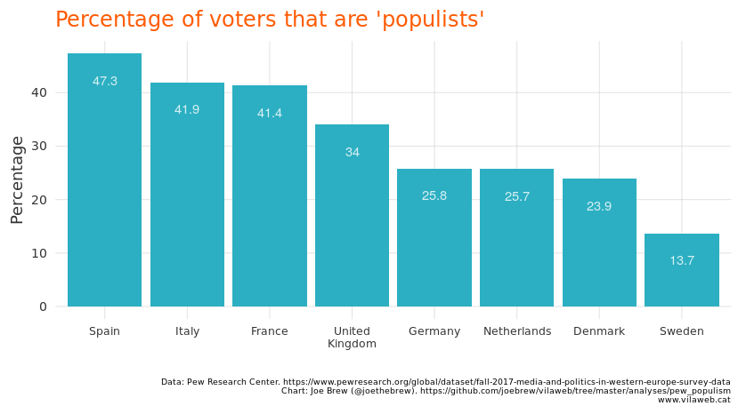
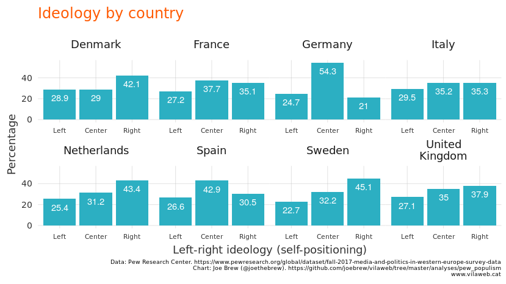
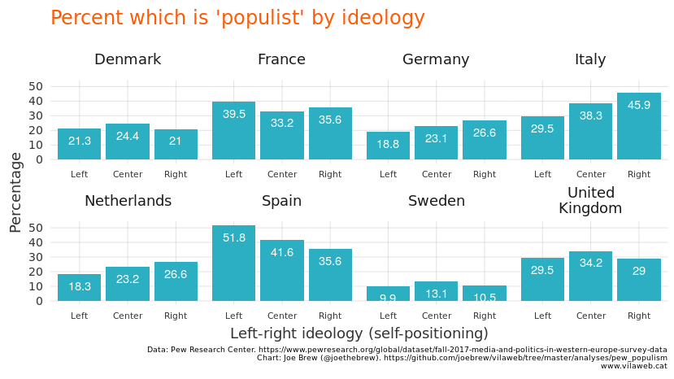
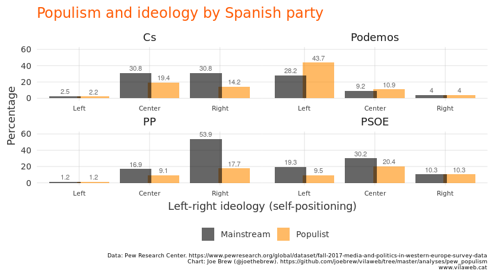
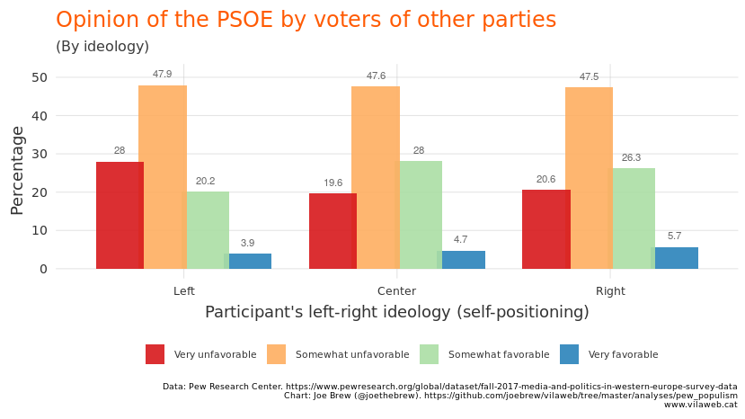
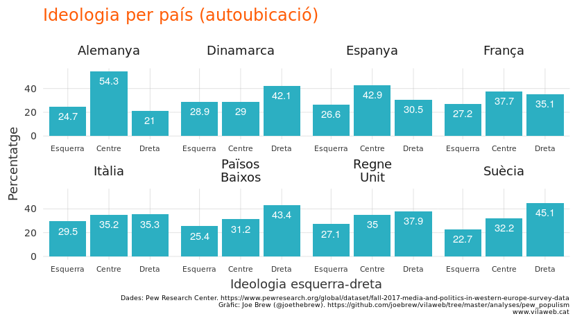
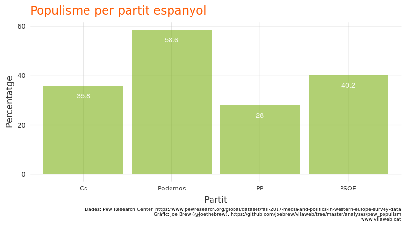
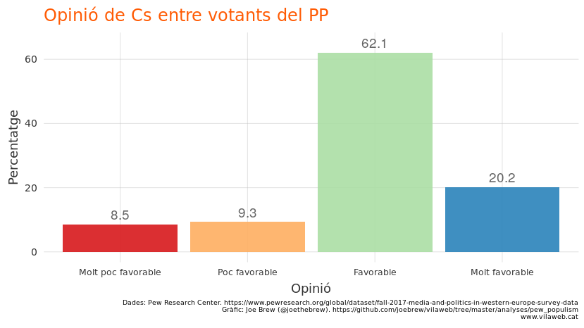
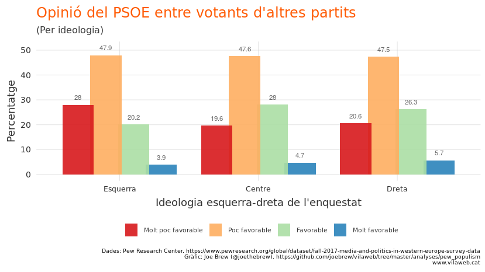

Populism, the right, and the PSOE
================

# Introduction

One of the challenges of analyzing politics is the lack of comparability
between different countries. Political cultures, political systems, and
political concepts, even when they share a similar vocabularly, are
often radically different from one place to another. Terms like “left”
and “right”, “mainstream” and “populist”, “conservative” and “liberal”,
etc. are thrown around regularly, but the extent to which a Spanish
“liberal” is equivalent to an American “liberal”, for example, is
questionable. Words mean different things in different places.

Because of these differences, and because so much political polling and
research is done at the level of the State, international-level data is
of particular interest. In late 2017, the [Pew Research
Center](https://www.pewresearch.org/global/2018/07/12/in-western-europe-populist-parties-tap-anti-establishment-frustration-but-have-little-appeal-across-ideological-divide/)
carried out a study on the political attitudes of more than 16.000
Europeans from 8 countries. The Center has now made the data [publicly
available](https://www.pewresearch.org/download-datasets/), allowing for
the exploration of variables on populism and left-right ideology,
*across countries*.

That’s what this article is about. Let’s have a look at the data on
populism and left-right ideology in European countries.

## The prevalence of populists

The PEW Research Center defines as “populist” someone who says both (i)
that ordinary people would do as good or a better job at solving the
country’s problems as elected officials and (ii) that most elected
officials don’t care what people like me think. The prevalence of these
populist varies widely by country. In Germany, the Netherlands, and
Denmark, only 1 in 4 voters are populist; in Sweden, it’s even lower. In
Southern Europe, however, rates of populism are much higher. Of the 8
countries surveyed, Spain had the highest rate, with nearly half of
Spanish voters be classified as “populist”.

<!-- -->

## The left-right ideological divide

PEW asked survey participants to classify themselves on a 0-6 left-right
scale, with 0-2 being considered “left”, 3 being “center, and 4-6
being”right". The breakdown by country is below:

<!-- -->

## Populism and the left-right axis

Here’s where things get interesting. In most European countries,
populist attitudes are concentrated on the political right or evenly
spread across ideologies. But in Spain, populism is heavily concentrated
on the political left. The below chart shows the prevalence of populist
attitudes (y-axis) by self-classified ideology (x-axis).

<!-- -->

Why might Spain have such a high prevalence of populism on the left, and
a (relatively) lower prevalence of populism on the right? I don’t know.
But let’s recall the two measures PEW uses to determine whether someone
is populist or not: the belief (i) that ordinary people would do as good
or a better job at solving the country’s problems as elected officials
and (ii) that most elected officials don’t care what people like me
think.

Both of these attitudes reflect a disconnect between citizens and the
institutions meant to represent them. Whether the cause of this
alienation is due to (a) simple perception vs. (b) truly
disproportionate representation is unknown.

## Populism by party in Spain

Per the PEW definition, the percentage of populist voters by Spanish
political parties is below:

<!-- -->

## Ideology and left-right populism

If we look at the breakdown of ideology and populism by party, a few
things emerge. First, the accusation that Podemos is a “populist” party
largely conforms with the data (more than half of its voters match PEW’s
definition of “populist”). Second the general notion that the PSOE is
“leftist” does not conform to the data: fewer than 30% of PSOE voters
self-identify on the political left, per the wording of the PEW
question. Third, the marketing of Ciudadanos as a “centrist” party is
also contradicted by the data: nearly half of Cs voters self-identify on
the right.

<!-- -->

## So, the PSOE is not to the left?

No, the PSOE is not to the left.

The PEW data shows that PSOE voters are largely centrist, with even a
sizable minority (1 of every 5) to the right. This is consistent with
how Spaniards who do *not* vote for the PSOE view the PSOE. Allow me to
explain…

Left-leaning voters generally think fondly of left-leaning parties, even
when not their own. And right-leaning voters generally think fondly of
right-leaning parties, even when not their own. For example, voters of
the PP (a right-wing party) have largely positive opinions about
Ciudadanos (another right-wing party).

<!-- -->

But what happens when we look at non-PSOE voters’ opinions of the PSOE?
If the PSOE were a truly “leftist” party, we would expect that those on
the political left would have more favorable views of the PSOE than
those on the political right. Instead, we see the opposite: those on the
political left have a *more unfavorable* view of the PSOE than those on
the political right\!

<!-- -->

## What about Catalonia?

The PEW sample was too small to make inference regarding Catalan
parties. Fortunately, good data *is* available on Catalonia on many of
the same topics. The results of this analysis - that the PSOE does not
display characteristics of a “leftist” party, despite claims to the
contrary - are consistent with [voter-level data in Catalonia on the
same
subject](https://www.vilaweb.cat/noticies/no-el-psc-no-es-mes-desquerres-que-el-pdecat/).
And in regards to populism, though the rate of populist attitudes (per
the PEW classification) is high in the Spanish State, [populist
characteristics are generally low among pro-independence
Catalans](https://www.vilaweb.cat/noticies/independentisme-populisme-joe-brew/).

## Conclusion

The terms “left”, “right”, and “populist” are thrown around all too
easily. PSOE leaders generally use the term “left” or “progressive” [to
describe the PSOE
itself](https://twitter.com/search?q=from%3Asanchezcastejon%20izquierda&src=typed_query),
and [“populist” to describe the PSOE’s
adversaries](https://twitter.com/search?q=from%3Asanchezcastejon%20populistas&src=typed_query).
But an examination of the data show that this narrative is disconnected
from reality. 40% of PSOE voters are “populist”, a much higher figure
than the average of the 8 European countries examined by PEW. And both
the PSOE party, and its voters, are not left-leaning, according to both
favorability ratings by ideology as well as self-positioning on an
ideological scale.

## Technical note

For the purposes of reproducibility and transparency, all code and data
used for this article is publicly available online at
<https://github.com/joebrew/vilaweb/tree/master/analyses/pew_populism>

# Catalan-language plots

<!-- -->

<!-- -->

<!-- -->

<!-- -->

<!-- -->

<!-- -->

<!-- -->
