Is the Catalan independence movement “populist”?
================

## Introduction

Opponents of Catalan independence often describe the movement as
“populist”. The intent of this characterization is to highlight
similarities between the Catalan indpendence movement and populist
movements with generally negative reputations, such as Brexit, Marine Le
Pen’s National French, Donald Trump’s Republican party, the right-wing
Spanish party Vox, Latin American Chavismo, etc.

“Populist” is hard to define, and multiple definitions exist. It is, to
some researchers, an ideology (Arter 2010). To others, it is an oratory
“style” (Moffitt and Tormey 2013). The definition is so loose that one
expert on the topic says “any political actor who is in the news
frequently for a substantial amount of time probably runs the risk of
being labeled ‘populist’ sooner or later” (Bale, Kessel, and Taggart
2011).

Since it is nearly impossible to define *what* populism is, it’s nearly
impossible to say whether a movement, party, or person is itself
“populist”. Too many definitions exist, allowing anyone to make the
case that their political opponents are “populists”.

So, let’s take another approach. Rather than focusing on (the impossible
question of) *what* populism is, let’s instead focus on *who* populists
are. Reliable data exist in multiple countries on the demographic,
social, and political characteristics of those who support movements
that are generally recognized as being populist in nature (UK Brexit,
Trump, etc.). An overview of the academic literature regarding the *who*
of modern populism reveals five general characteristics:

1.  *Low education*: Populism receives most support from those with low
    education (Waller et al. 2017).

2.  *Low income*: Populism receives most support from those with low
    incomes (Pikkety 2018).

3.  *Xenophobia*: Populism receives most support from those who are
    opposed to immigration and outsiders (Rydgren 2003).

4.  *Unhappiness*: Populism receives most support from those who are
    discontent, not only with politics, but with life/society in general
    (Spruyt, Keppens, and Van Droogenbroeck 2016).

5.  *Authoritarianism*: Populist movements often aspire for more “mano
    dura” practices (penal populism), stemming from authoritarian
    attitudes about obedience and the law, etc. (Pratt and Miao 2018)

## The question

Is the Catalan independence movement “populist”?

## The methods

We’ll examine survey data from Catalonia related to the above 5
characteristics in an effort to understand the extent to which it is
factually accurate to classify independentism as “populist” or not,
based on the extent to which the views of pro- and anti-independence
Catalans match the 5 characteristics described above.

## The results

### Finding 1: Education

Low levels of education are associated with support for populist
policies and politicians in both developing and developed countries.
*Chavismo* in Venezuela, for example, was a movement largely driven by
the uneducated. [Support for Donald
Trump](https://fivethirtyeight.com/features/education-not-income-predicted-who-would-vote-for-trump/)
in the 2016 US presidential elections was highest in areas with low
education (even after adjusting for income). And votes in favor of
Brexit largely came from those without high levels of education (below):

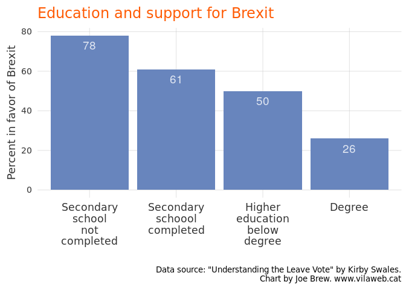<!-- -->

If the Catalan independence movement were “populist” in nature, we would
expect that those in favor of independence - like their populist
counterparts elsewhere - would have low levels of education. But when we
actually examine the data, the opposite trend appears. The below chart
shows the association between support for independence and level of
education. The association is strong and clear: the more one is
education, the more in favor he/she is of indepenence:

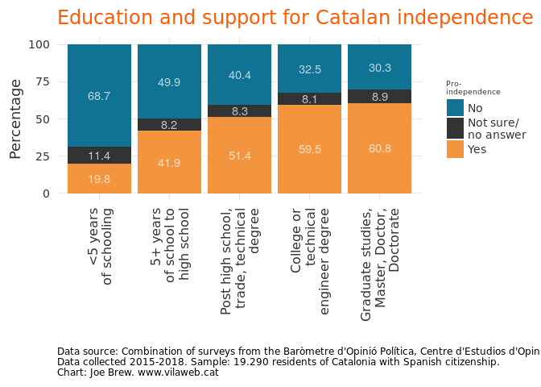<!-- -->

### Finding 2: Income

Income and education are closely correlated. It is should come as no
surprise then that since the bulk of support for union with Spain in
Catalonia comes from those with low levels of education, it also comes
from those with low income. In other words, there is truth to the
accusation that the Catalan independence movement is a movement of the
elites or rich: it is\! But a movement cannot be simultaneously
“populist” and “elitist”, since a general characteristic of populist
movements is counterposing the people and the elites.

The below chart shows the association between income and support for
indepenence in Catalonia. If the indepenence movement were “populist” in
nature, we would expect support to greatest among those with low levels
of education. Instead, we see the opposite pattern: in the lowest income
groups (0 to 1200 euros per month), support for union with Spain is
majority. But among the wealth (2000 or more euros per month), support
for independence is high.

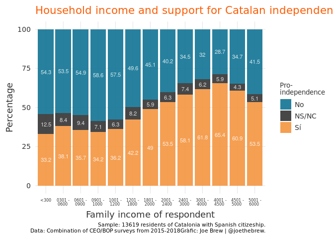<!-- -->

### Finding 3: Xenophobia

One issue associated with populism is xenophobia. Populist movements
often use binary rhetoric which juxtaposes “us” and “them”. Because of
the “separatist” nature of the Catalan independence movement, the
accusation that the movement is xenophobic and populist in nature is
frequent.

But the data, again, show the opposite. When asked whether they agree or
disagree with the xenophobic phrase “with so much immigration, one no
longer feels at home”, a majority of pro-indepenence Catalans (60.3%)
disagree, and only one quarter (25.6%) agree. But among Catalans in
favor of union with Spain, only a minority reject the xenophobic phrase
(47.2%) and 4 in 10 (40.5%) agree with it. In other words, to the extent
that we accept that xenophobia is an integral part of populism, we must
also accept that Catalan unionism is more “populist” than Catalan
independentism.

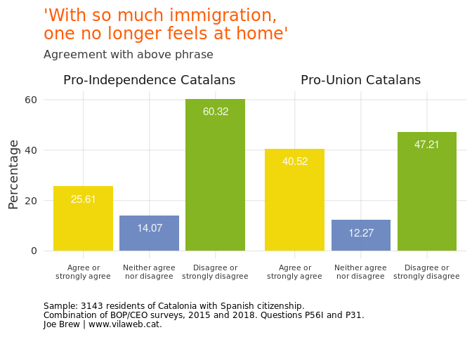<!-- -->

### Finding 4: Unhappiness

Populism thrive on general discontent. According to Spruyt et al,
“populism is embedded in deep feelings of discontent, not only with
politics but also with societal life in general” (Spruyt, Keppens, and
Van Droogenbroeck 2016). Accordingly, if Catalan independentism were
populist, we would expect that pro-independence Catalans would be less
happy than their anti-indepenence counterparts. Is this the case?

No. Catalans of all political stripes are generally happy witht their
personal lives (average of approximately 7 of 10 on a 0-10 scale). But
pro-independence Catalans are actually *slightly happier* than their
pro-union counterparts. Again, this does not fit the pattern of populist
movements elsewhere.

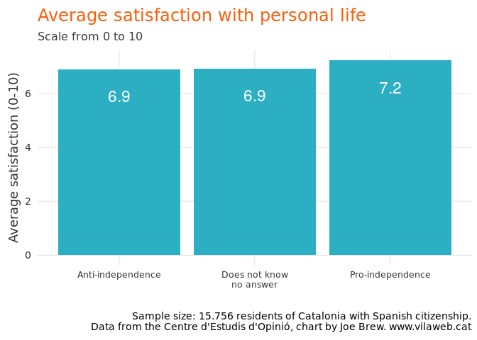<!-- -->

### Finding 5: Authoritarianism

Movements generally considered to be populist often exhibit a
“hard-line” stance on crime, and seek high levels of obedience from
their followers. The authoritarian nature of these movements is no
secret: one of the keys to Trump’s electoral success was his “law and
order” attitude, and analysis of the attitudes of Brexit voters in the
UK also show an authoritarian tilt:

<!-- -->

Do we find this same attachment to authoritarianism among Catalan
independentists? Gauging authoritarian attitudes is not straightforward,
but data do exist on the subject. For example, when asked about the
extent to which schools should teach children to obey authority, Catalan
unionists exhibit much higher degrees of authoritarian attitudes than
their independentists counterparts:

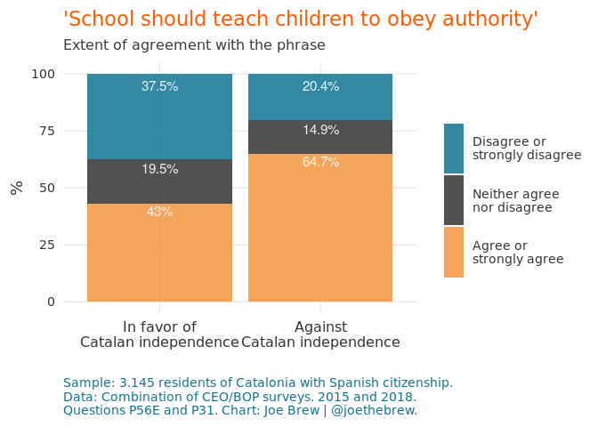<!-- -->

By the same token, the rate of Catalans who say that “the law should
always be obeyed in any circumstances” is nearly twice as high among
anti-independence Catalans than their pro-independence counterparts.

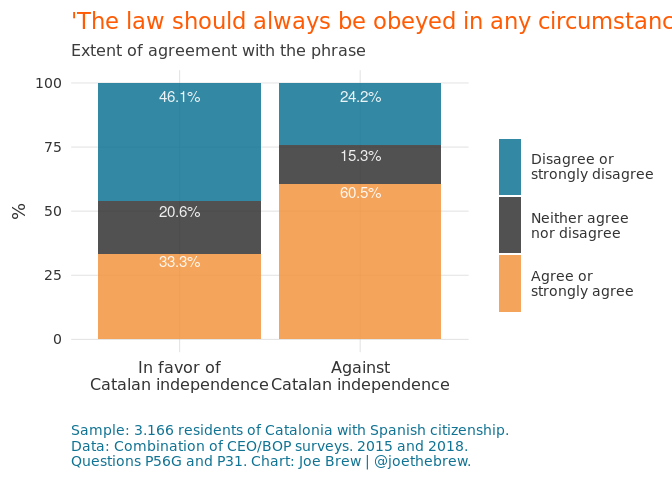<!-- -->

In other words, if the Catalan independence movement were “populist”, we
would expect that it would share with other populist movements an
affection for obedience, law, and order. But the data show, once again,
the opposite.

## Conclusion

The term “populist” is problematic, since no commonly accepted
definition exists. By focusing on *who* populists are, rather than
*what* they are, we can get around the problem of not having a clear
definition, and instead dive right into the more relevant question:
whether people who support Catalan independence are like supporters of
populist movements elsewhere.

In this regard, the Catalan independence movement is not populist.
Relative to Catalans in favor of continued union with Spain,
pro-independence Catalans are (i) more educated, (ii) wealthier, (iii)
less xenophobic, (iv) more satisfied with their personal lives, and (v)
less authoritarian. In fact, by these measures, the pro-union movement
appears to embody populist tendencies much more than the
pro-independence movement. Catalans in favor of union with Spain exhibit
all five of the characteristics of populist movements elsewhere: they
are (i) less educated, (ii) less wealth, (iii) more xenophobic, (iv)
less satisfied with their personal lives and (v) more authoritarian.

One could argue that the cultural “identity” issue of Catalan
independentism makes the movement *inherently* populist. That is, since
Catalan-speakers and those who self-identify as more Catalan than
Spanish are generally pro-independence, this makes independentism
“populist”. This is a common refrain in Spanish politics: that Catalan
independentists are populist since their politics are driven by
identity. But if one accepts such a thesis, then unionism must also be
considered equally “populist” since its support also relies on clumping
by language and culture: those who speak Spanish mainly and who
self-identify as Spanish largely vote for unionist policies.

Ultimately, the “populist” label is so devoid of meaning, so
controversial in content, and so flexible as to be applied to almost any
political movement. Perhaps, then, the term simply should not be used. I
personally avoid it entirely (with the notable exception of this
article) because of its lack of agreed-upon meaning.

But if we (society) are going to use the term “populism”, then we should
use so with at least some degree of rigor, and in line with the reality
of objective data. And the data are clear on this matter: the Catalan
independence movement is many things - but it is not
populist.

## Catalan-language plots

<!-- -->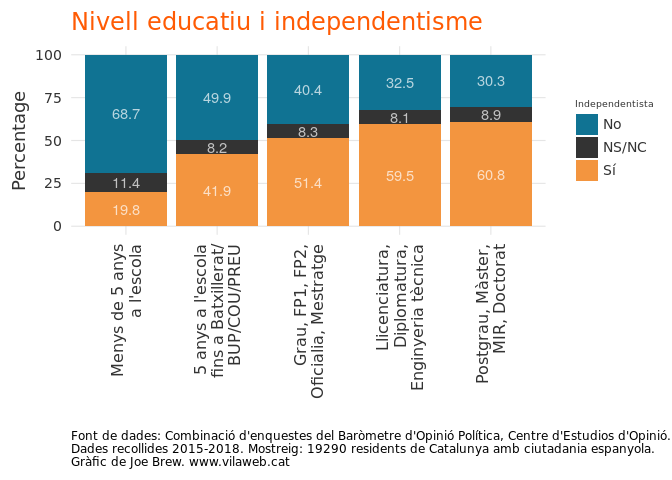<!-- -->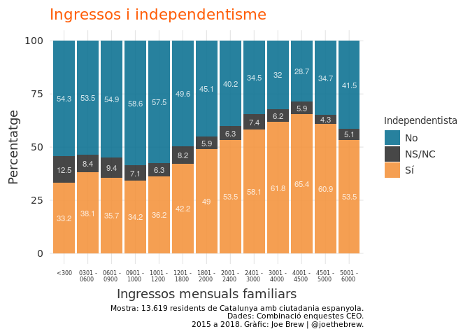<!-- -->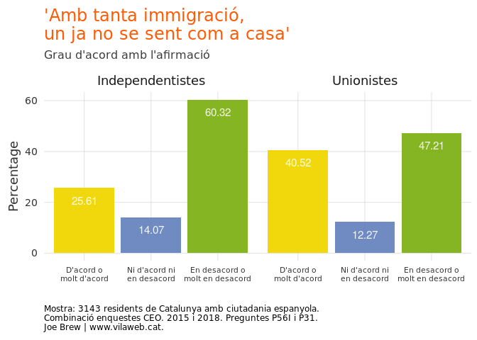<!-- -->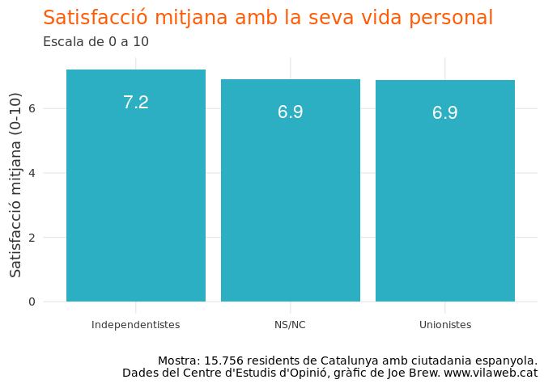<!-- -->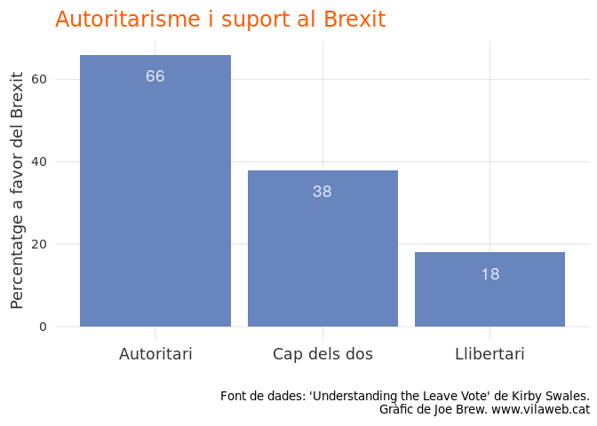<!-- -->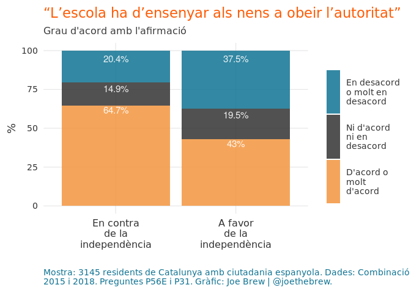<!-- -->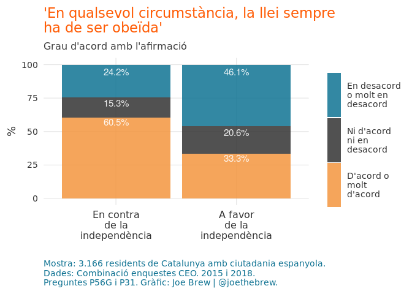<!-- -->

## Bibliography

Arter, David. 2010. “The Breakthrough of Another West European Populist
Radical Right Party? The Case of the True Finns.” *Government and
Opposition* 45 (4). Cambridge University Press (CUP): 484–504.
<https://doi.org/10.1111/j.1477-7053.2010.01321.x>.

Bale, Tim, Stijn van Kessel, and Paul Taggart. 2011. “Thrown Around with
Abandon? Popular Understandings of Populism as Conveyed by the Print
Media: A UK Case Study.” *Acta Politica* 46 (2). Springer Science;
Business Media LLC: 111–31. <https://doi.org/10.1057/ap.2011.3>.

Moffitt, Benjamin, and Simon Tormey. 2013. “Rethinking Populism:
Politics, Mediatisation and Political Style.” *Political Studies* 62
(2). SAGE Publications: 381–97.
<https://doi.org/10.1111/1467-9248.12032>.

Pikkety, Thomas. 2018. “Brahmin Left Vs Merchant Right: Rising
Inequality & the Changing Structure of Political Conflict.” *World
Inequality Lab Working Papers*, no. 7 (March). WID.
<http://piketty.pse.ens.fr/files/Piketty2018.pdf>.

Pratt, John, and Michelle Miao. 2018. “The End of Penal Populism; the
Rise of Populist Politics” 45 (4).
<https://www.researchgate.net/publication/324834150_The_End_of_Penal_Populism_The_Rise_of_Populist_Politics>.

Rydgren, Jens. 2003. “Meso-Level Reasons for Racism and Xenophobia.”
*European Journal of Social Theory* 6 (1). SAGE Publications: 45–68.
<https://doi.org/10.1177/1368431003006001560>.

Spruyt, Bram, Gil Keppens, and Filip Van Droogenbroeck. 2016. “Who
Supports Populism and What Attracts People to It?” *Political Research
Quarterly* 69 (2). SAGE Publications: 335–46.
<https://doi.org/10.1177/1065912916639138>.

Waller, Richard, Steven Hodge, John Holford, Marcella Milana, and Sue
Webb. 2017. “Political Populism and Adult Education.” *International
Journal of Lifelong Education* 36 (4). Informa UK Limited: 383–86.
<https://doi.org/10.1080/02601370.2017.1343346>.

