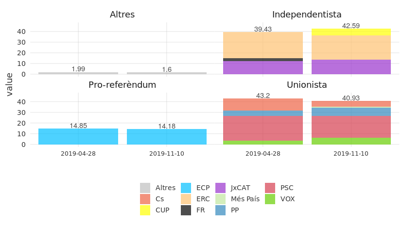
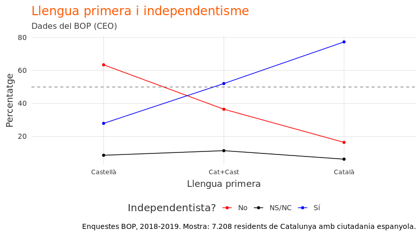
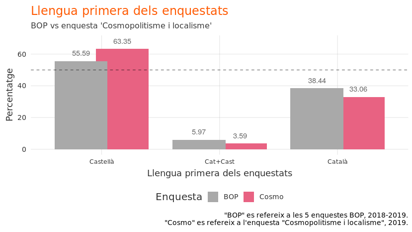
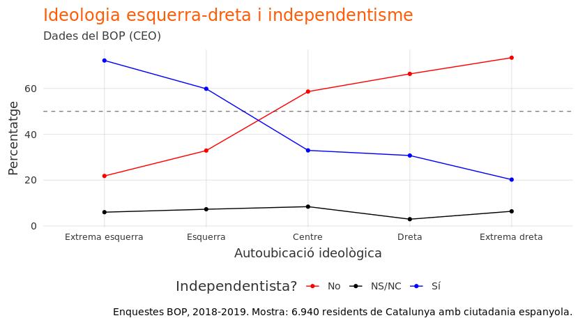
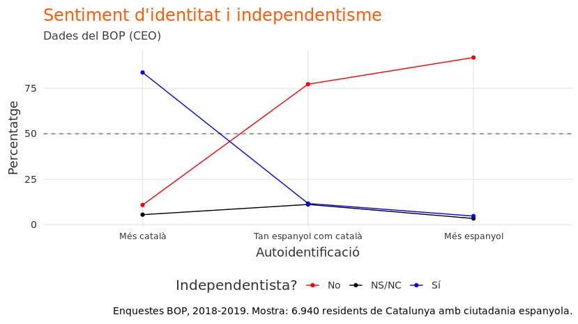
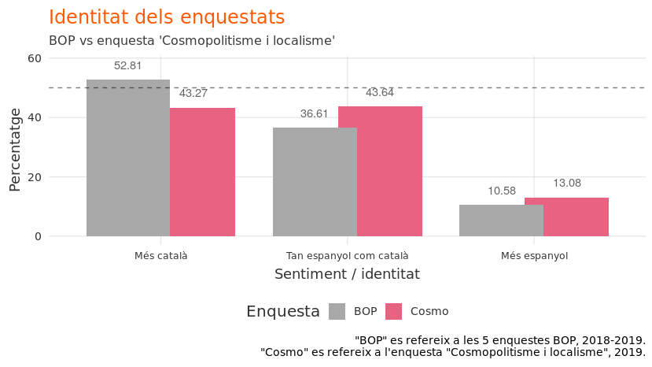
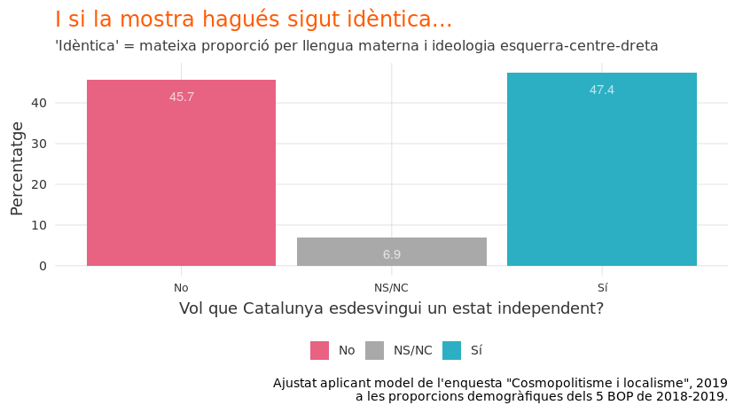

# Quants independentistes hi ha en aquest moment?

En les darreres dues setmanes, hi ha dues dades sobre el suport per a
una Catalunya independent aparentment contradictòries:

1.  Un creixement important de l’independentisme en les eleccions
    espanyoles del 10-N.

2.  Una baixada important de l’independentisme en l’última enquesta del
    Centre d’Estudis d’Opinió (“Cosmopolitisme i localisme a Catalunya”)

## Limitacions

**Limitacions del 10-N**: Cap de les dues fonts és definitiu. En les
eleccions del 10-N, es votaba sobre molts assumptes - no només
l’independentisme - i per tant hi ha hagut probablament (a) persones a
favor de l’independència que van votar per partits no independentistes,
i (b) persones en contra de l’independència que van votar per partits
independentistes. A més, històricament, existeix a Catalunya un vot
“dual” a Catalunya: comparades amb les eleccions parlamentàries (i a
les enquestes), els catalans voten més per partits espanyols (que són
tots no independentistes) en les eleccions espanyoles. Finalment, a
diferència de les enquestes, en les eleccions, les dades no són
disponbiles al nivell individual: es pot analitzar coses al nivell
municipal, o fins i tot el nivall d’una secció censal, però no es pot
veure exactament si els que van votar, per exemple, si una persona que
va votar pel partit A al congrés va votar el mateix partit pel senat o
no (en estadística, això es diu la “falacia ecològica”).

**Limitacions de les enquestes**: En quant a la medició de preferències
sobre un assumpte polític específic (per exemple, l’independència de
Catralunya), les enquestes tenen un avantatge important: es pot
preguntar sobre temes específics. Però, a diferència de les eleccions,
les enquestes són (a) relativament petites, (b) susceptibles a diferents
tipus de biaix, i (c) relativament volàtiles: canvis en la mostra poden
convertir-se en canvis en els resultats, sense que ningú de la població
a la qual la mostra pretén representar hagi canviat.

## El valor del CEO

A diferència de moltes enquestes que es publiquen als diaris, el CEO
publica *totes* les microdades de les enquestes. Aquesta transparència
permet a qualsevol persona anar al [web del
CEO](http://ceo.gencat.cat/ca/inici), descarregar les dades d’una
enquesta (o vàries), i mirar - per ella mateixa - qui deia què a quines
preguntes. I a més de publicar les dades mateixes, el CEO també publica
tots els detalls de mostreig, el que permet contextualitzar les dades
segons la manera en la qual van ser recollides.

## La pregunta?

Com podem reconciliar (a) la pujada en el suport a l’independència en
les eleccions del novembre amb (b) la baixada en el suport a
l’independència en la darrera enquesta del CEO? Quans
independentistes hi ha?

## La resposta

Les dades de les eleccions del 10-N no donen per molta anàlisi que no
s’ha fet ja.

<!-- -->

## Llengua

La llengua és intimament correlacionada amb l’independentisme. Per
exemple, en els anys 2018-2019, aquesta ha sigut la relació entre
llengua primera (la que es parlava a casa de petit) i suport a
l’independència de Catalunya:

<!-- -->

Que passaria en una enquesta, doncs, si es seleccionés a més persones de
llengua primera castellana (~30% independentista) i menys persones de
llengua materna catalana (~80% independentista)? Evidentment, pujaria en
els resultats el percentatge en contra de l’independència. I això és
exactament el que va passar. Mireme la llengua primera dels enquestats
BOP comparada amb les de l’enquesta cosmopolitana:

<!-- -->

Realment el percentatge de catalans de llengua materna castellana va
pujar 8% en els darrers mesos? Clar que no. La llengua primera no canvia
al llarg de la vida\! El que ha canviat és la mostra de l’enquesta.

## Eix ideològic

Tant les enquestes del BOP com l’enquesta “Cosmopolitisme i localisme”
pregunten sobre l’autoubicació ideològica dels enquestats en una escala
de 0 (extrema esquerra) a 10 (extrema dreta). Historicament, aquest eix
ideològic està molt correlacionat amb l’independentisme: com més
autoubicat a l’esquerra, més independentista. Per tant, si es
seleccionés a més gent de la dreta, els resultats reflectarian una
baixa de suport a l’independència - i és exactament el que va passar.

Mirem, primer, la relació històrica esquerra-dreta /
independentisme-unionisme:

<!-- -->

Però què va passar en l’enquesta “Cosmopolitisme i localisme”? El
percentatge de catalans que s’autoubiquen en la dreta política (6 o més
en l’escala de 0-10) va pujar significativament.

<!-- -->

Realment el percentatge de catalans que s’autoubiquen en la dreta
política va duplicar? Probablement pas. El més probable és que la
darrera enquesta va sobreamplificar de persones de la dreta política (el
que va tenir un impacte, logicament, en els resultats sobre
l’independentisme).

Mirem-ho d’una altra manera. El gràfic següent és l’autoubicació
ideològica dels enquestats al llarg del temps.

<!-- -->

Els catalans realment van fer un gir radical a la dreta ens els darrers
mesos? Poc probable.

## Identitat

L’identitat i les opinions sobre l’independència van també de la mà. Com
més autoidentificació espanyola, més unionista; com més
autoidentificació catalana, més independentista. Aquesta és la relació
independentisme i identitat, historicament:

<!-- -->

La gent canvia sovint d’identitat? No. Per tant, quan hi ha canvis
d’identiat signifactius en unes enquestes, el més probable no és que
la societat canvia, sinó que el mostreigos són diferents (i per tant,
incomparables). Si es selecciona per una enquesta més gent de sentiment
“català”, l’independentisme pujaria; de la mateixa manera, si es
seleccionés per una enquest més gent de sentiment “espanyol”,
l’independentisme apareixeria molt baix.

Què va passar en la darrera enquesta publicada pel CEO? Mirem-ho:

<!-- -->

Curiós, oi? Ens uns pocs mesos, el percentage de catalans que es
considera més català que espanyol realment va baixar 10%? Perdoneu les
repetcions, però no. Els sentiments identitaris canvien molt poc, i mai
de manera ràpida. Les diferències entre les enquestes BOP i l’enquesta
“Cosmopolitisme i localisme” no reflecteixen canvis en la societat
catalana, sinó canvis en un mostreig de 1.500 persones.

## I si la mostra no hagúes canviat…?

Intentem salvar les dades, o al menys ajustar-les de manera per què
siguin comparables al llarg del temps. Si acceptem com a fets que (a) la
llengua materna i l’ideològia (esquerra-dreta) són els factors
principals que determinen la posició d’algú sobre l’independència de
Catalunya i (b) que és molt, molt poc probable que les freqüències
d’aquestes variables hagin canviat significativament ens els darrers
anys, ens permet fer l’analisi següent: (i) crear un model estadístic
bàsic, basat en la darrera enquesta (“Cosmopolitisme i localisme”) on
l’independentisme és una funció de llengua + ideologia i després (ii)
aplicar aquest model a la mostra “normal” del BOP (o sigui, la
combinació de les 5 enquestes BOP de 2018-2019). Ho fem?

<!-- -->

Fent aquest ajust, l’independentisme seria al 47,4% mentres l’unionisme
seria al 45.

O (a) Catalunya ha canviat significativament en quant al seu perfil
ideologic i llengua materna o (b) la mostra de la darrera enquesta és
qualitativament diferent de la mostra dels BOP. En resum:
l’independentisme és, més o menys, igual que fa un any o dos.

## Conclusió

Les enquestes del CEO són molt útils precisament perquè, a diferència de
moltes enquestes publicades pels diaris, publiquen les microdades (el
que permet un analisi que va més enllà dels resultats “crus”). I
qualsevol comparació minimament rigurosa de les dades de l’enquesta de
“Cosmopolitisme i localisme” amb les dades del BOP hauria de prende ne
compte les diferències ideológiques i lingüístiques entre les mostres,
com que aquestes diferències poden determinar, en gran part, els suport
o rebuig a l’independentisme.

Un analisi de les dades de les BOP dels darrers anys i l’enquesta
“Cosmopolitisme i localisme” deixa clar que la darrera és esbiaixada
d’una manera que *sobrereflexiona* la dreta i els catalans d’origen
castellanoparlant mentres que *infravalora* l’esquerra i els
catalanoparlants, comparada amb els BOP. Això, logicament, té
conseqüències importants alora de calcular el suport a
l’independència. El 42% (el chifre que surt en els titulars de tots
els diaris) prové d’un analisi que ignora les característiques del
mostreig, i les seves conseqüències.

Quan es ponderen les dades per ajustar pels esbiaixos més importants
(llengua, lloc de naixement, i provincía), com [va fer el Roger
Tugas](https://www.naciodigital.cat/noticia/191129/dades/ocultes/ceo/apunten/si/guanyaria/referendum),
l’independentisme i l’unionisme estan a basicament el mateix nivell (45%
cadascú). O sigui, quan es tracta les dades d’una manera crítica, no
consta una baixada significativa en el suport a l’independència, sinó
uns moviments adins del marge d’error estadístic. Altrament dit, un
analisi rigorós de les dades d’aquesta enquesta porta a la mateixa
conclusió que un analisi de qualsevol de les enquestes dels darrers
anys: que el nivell de suport a l’independència no ha tingut canvis
significatius en els darrers anys.

Però clar, els conceptes “ponderació”, “esbiaix”, “sobrerepresentació”,
i “marge d’error” no fan bons titulars. 42%? Això sí que és un bon
titular. Així que prepareu-vos a sentir, una i altra vegada, aquest
chifre - fins que surti la propera enquesta (on hi haurà molt
probablament una suposada “pujada” en suport a l’indepèndencia només
degut al principi de “la regressió a la mitjana”).

# Technical details

The code for this analysis is publicly available at
<https://github.com/joebrew/vilaweb/tree/master/analyses/quants_indepes>.
