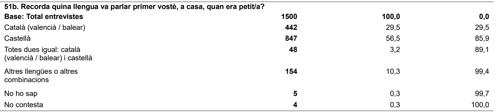

# Aclariment: comparació de llengua primera entre l’enquesta “Cosmpolitisme i localisme” i el “Baròmetre d’Opinió Política”

## Context

He rebut preguntes sobre alguns xifres en l’article ["Un 41%
d’independentistes només? Si us plau, una mica de
rigor](https://www.vilaweb.cat/noticies/41-dindependentistes-si-us-plau-una-mica-de-rigor/),
sobre tot en referència a la comparació en les distribucions per llengua
primera entre els enquestats de la darrera enquesta del CEO
(“Cosmpolitisme i localisme”) i els enquestats de les 5 darreres
enquestes del Baròmetre d’Opinió Política (2018-2019). Concretament, em
refeixo al segon gràfic de l’article
(aqui):

Els dubtes són ben fonamentats, i la causa dels dubtes és la manca d’una
explicació clara (per part meva) d’una part de la metodolgia de
l’anàlisi.

## El dubte: els chifres del gràfic no corresponen amb la taula freqüència

La taula de freqüència que apareix en les [“taules
estadístiques”](http://upceo.ceo.gencat.cat/wsceop/7348/Taules%20estad%C3%ADstiques%20-951.pdf)
per la pregunta 51b de l’enquesta “Cosmpolitisme i localisme” és
aquesta:

La distribució entre enquestats de llengua primera castellana, catalana,
i ambdues - respectivament - es de 56,5%, 29,5 i 3,2%. En el gràfic de
l’article, però, els xifres son: 63,35%, 33,06% i 3,59%.

La pregunta, doncs, és **per què en el gràfic surten xifres diferents
que els de la taula de freqüència?**

## La resposta: l’exclusió dels “NS”, “NC”, i parlants d’altres idiomes

El tema que m’interessava per aquest anàlisi era la proporció relativa
de persones de llengua primera castellana vs. catalana. Per això, pels
càlculs pel gràfic en qüestió, s’ha tret els 5 enquestats que no sabien
la seva llengua primera (0,3%), els 4 enquestats que no contestaven
(0,3%) i els 154 enquestes que parlaven altres llengües o combinacions
(10,3%). Havent tret aquestes observaciones, es va *recalcular* els
percentatges, i el resultat és el que es veu en el gràfic en
qüestió.

| Llengua primera | Enquestats | Mostra completa (%) | Traient altres llengües i NS/NC (%) |
| :-------------- | ---------: | ------------------: | ----------------------------------: |
| Castellà        |        847 |               56.47 |                               63.35 |
| Cat+Cast        |         48 |                3.20 |                                3.59 |
| Català          |        442 |               29.47 |                               33.06 |

Per fer la comparació amb les 5 enquestes BOP, es va aplicar exactament
la mateixa metodologia (o sigui, es va treure totes les observaciones
“NS”, “NC”, i altres idiomes per fer els càlculs).

## Per què treure els “NS”, “NC” i altres llengües?

El tema d’interés d’aquest article era la relació entre factors
sociodemogràfics (com la llengua) i el suport a l’independència. Com que
hi ha poques dades històriques sobre els parlants d’altres llengües i
l’independentisme (perquè el BOP exclou la majoria d’aquestes
persones, perquè - com jo - no son ciutadans), no hi havia prou base per
intentar estimar la probabilitat de ser independentista segons la
llengua per aquest grup. Per tant, vaig restringir l’anàlisi només en la
proproció relativa entre persones de llengua primera castellana,
catalana, i les dues, traient els altres grups.

## La causa de la confusió? Jo

La font original de la confusió, sóc jo. En l’article, no vaig explicar
ni que s’havia tret aquests grups, ni per què. I s’hauria d’haver
explicat. Les decisions metodològiques sempre són qüestionable, i per
això han de ser sempre transparents. Agraeixo als que m’escriuen, i
sobre tot als que em critiquen, perquè m’ajudeu a millorar.

En tot cas, pels lectors detallistes, publico tot el codi de tots
aquests anàlisi a la meva pàgina github
(<https://github.com/joebrew/vilaweb>), i d’aquest article
especificament a
<https://github.com/joebrew/vilaweb/tree/master/analyses/quarantaun>.
