44%?
================

# Introduction

The most recent CEO/BOP data, a regular survey of Catalans on their
political opinions, showed a decline in the support among Catalans for
independence. Among the 1500 Catalans surveyed, 725 (48,3%) opposed
independence and 660 (44%) were in favor, with 115 (7,7%) not sure or
unwilling to answer.

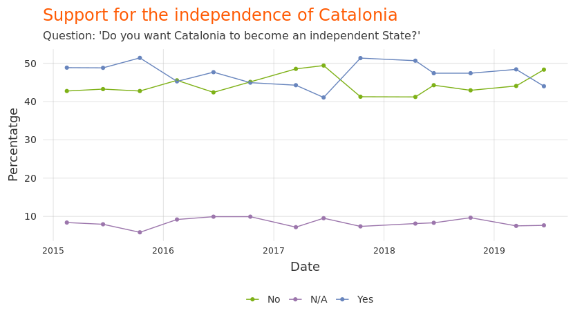<!-- -->

The decline in support for independence attracted a great deal of media
attention. News outlets which generally do not report in detail on the
BOP survey [published
headlines](https://elpais.com/ccaa/2019/07/26/catalunya/1564132750_826665.html)
about the decline in support for independence. On social networks like
Twitter, pundits began the process of explaining *why* suppoprt for
Catalan independence had fallen.

The decline in support for indepenence was abrupt: only 3 months
earlier, support for independence was 48,4%, and opposition to it was
44,1%. And the number of Catalans in favor of independence has been
higher than those opposed consistently since mid-2017. Given this, a
reasonable person might ask: what caused this rapid decline in support
for independence? Let’s dig into the data and see.

# How the BOP constructs its sample

The BOP survey is, by far, the most rigorous and transparent regular
survey of political attitudes among Catalans. But, like all surveys,
it’s subject to potential bias introduced by sample selection, as well
as a general margin of error. Since the BOP is fully transparent (ie,
all of the microdata is published), we can quantify that potential bias
to help us understand the extent to which large changes in results are a
function of (a) changes among the population or (b) changes among the
sample.

For example, let’s look at the province of survey participants over
time.

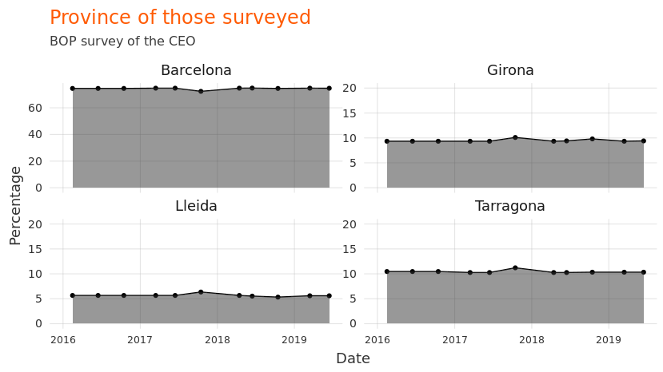<!-- -->

You’ll note that (a) the breakdown closely reflects the true territorial
distribution of Catalans and (b) it remains constant over time. That’s
because the CEO controls this variable closely, making sure to sample in
a way that ensures that the selected population closely reflects the
*true* population.

The CEO also closely controls variables like municipality size, age,
sex, and place of birth. That’s because (as we’ve shown previously in
the column), these demographic factors play an important role in forming
people’s opinions on political matters. For example, if a CEO poll
included only people born in Catalonia, support for independence would
appear significantly *higher* than true support for independence. By the
same token, if a CEO poll over-sampled among Catalans born in Spain,
support for the PP would appear higher than than the true support for
the PP. For these reasons, when the sample differs slightly from the
true population, the CEO applies a simple statistical technique called
“weighting” (ponderació), which essentially gives more or less weight
to individuals’ responses depending on how representative that
individual’s demographic characteristcs are of the population as a
whole. This technique has the effect of “cancelling out” potential
sample bias.

But here’s the thing: it’s difficult - if not impossible - to know
exactly which variables should be used to “adjust” the sample. And even
if you control and adjust for important variables like place of birth,
you may still - by pure chance alone - get a random selection which is
not representative in terms of other variables.

The sudden increase in support for union with Spain, and drop in support
for independence, can be interpreted in one of two ways: (1) that
something has happened, politically, which has changed the minds of many
pro-independence Catalans, making them now anti-indpendence, or (2) that
the selected sample for the most recent BOP is a “bad draw”, ie, it does
not accurately reflect Catalonia’s population. Which is it?

There is plenty of evidence for theory 1 (that people changed their
minds). Perhaps the Socialists winning the April elections at the State
level made some independentists change their minds. Or perhaps discord
among pro-independence parties has caused some to change sides.

But an examination of the data shows that there is perhaps more evidence
for theory 2 (that the most recent BOP sample is misrepresentative).
Let’s examine it.

# The June 2019 CEO poll

The June 2019 BOP’s sample was slightly different than previous BOP
polls in 3 ways that likely affected the results in regards to support
for independence:

1.  The poll had more than the usual number of people whose parents were
    born in the rest of Spain.  
2.  The poll had more than the usual number of people who
    self-identified as Spanish.  
3.  The poll had more than the usual number of people who considered
    Spanish, not Catalan, as their “own” language.

### Parents’ place of birth

The below shows the association between parents’ place of birth and
support for independence.

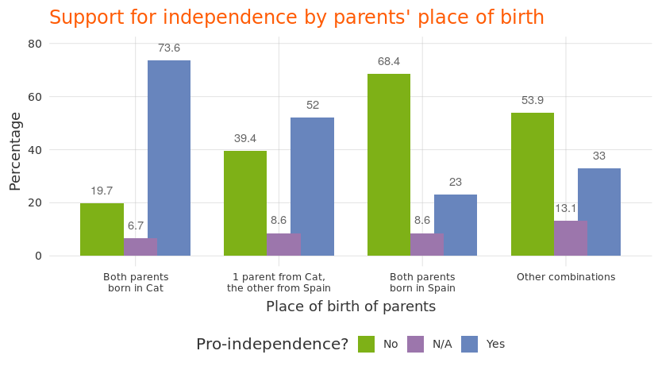<!-- -->

Catalans with 1 or more parents born in Catalonia are largely
pro-independence, whereas Catalans with both parents born outside of
Catalonia are largely anti-independence. Why is this relevant? Because
in the most recent BOP poll, the percentage of Catalans with 1 or more
parents born in Catalonia declined significantly.

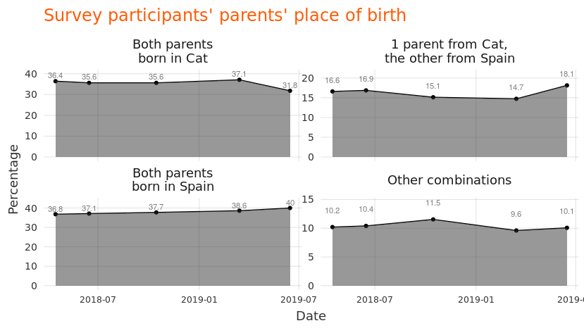<!-- -->

Did the percentage of Catalans with two parents born in Catalonia really
decline from 37 to below 32% in the space of just a few months? Probably
not. This change does *not* reflect a change in the Catalan population,
but is rather suggestive of a change in the BOP sample.

### Cultural self-identification

Cultural identification is closely correlated with opinions on
independence. Catalans who self-identify as mostly or only Catalan are
more pro-independence than Catalans who feel Spanish. Support for
Catalan independence is 95% among those that feel only Catalan, but only
5% among those that feel only Spanish.

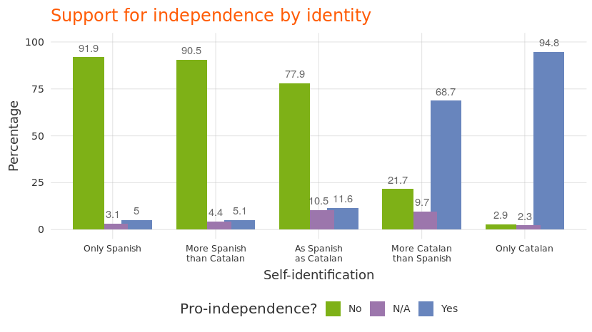<!-- -->

What happened in the most recent BOP poll? There were declines in the
percentage of Catalans who felt more Catalan than Spanish or only
Catalan, and increases in the percentage of Catalans who felt more
Spanish than Catalan, or only Catalan.

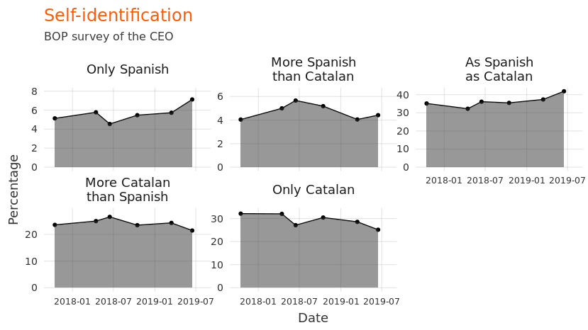<!-- -->

Did the cultural identity of Catalonia really change this much in a few
short months? Again, probably not. Rather, these changes likely have to
do more with the BOP’s sample than they do with the population as a
whole.

### Language

Language, like cultural identification and parents’ place of birth, is
closely correlated with feelings on independence. Among Catalans who
consider Spanish to be their language, only 22% favor independence;
however, among Catalans who consider Catalan to be their language, 77%
want independence.

<!-- -->

What happened in the most recent BOP poll? The percentage of survey
participants who considered Catalan to be their language dropped, and
the percentage who considered Spanish to be their langauge increased.

<!-- -->

Again, at the risk of being repetitive, did the percentage of Spanish
speakers in Catalonia really increase significantly in the last few
months? No, probably not. Rather, the BOP’s sample changed, not
Catalonia’s population.

# What if the sample had been different?

Did suppport for union with Spain really increase from 44% to 48% in
just a few months? Most likely not. Much of the increase in support for
union with Spain in the most recent BOP can be attributed to the
increases in the sample of demographic groups which are generally
supportive of union with Spain: those with no parents born in Catalonia,
those who self-identify as Spanish, and those who consider Spanish to be
their language.

One could argue that in the last few months Catalan society also
underwent large changes in their ancestry, cultural identity, and
linguistic preferences. But this is unlikely. What is more likely is
that the BOP poll, through pure chance, slightly oversampled from a
demographic that is anti-independence.

What would the most recent poll results have looked like if the
demographic characteristics examined here were identical to those of the
previous 4 polls (late 2017 through early 2019)? That is, what if the
sample had \_not\_changed. Let’s see.

We can “adjust” our sample so as to make it so that the most recent BOP
poll’s sample population is more similar to the previous 4. For example,
we can weigh our sample by the “self-identification” variable (whether
one feels more Catalan or Spanish) so that our sample is identical to
the previous four BOP surveys. If we do that, the percentage in favor of
independence is significantly higher than the percentage opposed.

    Error: Evaluation error: object 'previous4' not found.

If we instead adjust for “own language”, we get a much more even split.

    Error: Evaluation error: object 'previous4' not found.

And if we adjusted by parents’ place of birth, support for union is
greater than support for independence (albeit with less of a gap than in
the most recent survey).

    Error: Evaluation error: object 'previous4' not found.

# Conclusion

What is the *true* support for independence in Catalonia? It’s
unknowable (since Spain won’t permit a fair vote), but the yes-no split
likely remains at approximately the 50-50 mark.

Did support for independence decline drastically in the last few months?
Probably not. Rather, the most recent BOP poll disproportionately
represented groups that are adverse to independence (Spanish-speakers,
those with no parents from Catalonia, and those who self-identify as
Spanish). If we “correct” the sample to make it more in line with
previous BOP polls, we find that support for independence is also more
in line with previous BOP polls. In other words, there was no change in
support for independence - only a chance in the demographic
characteristics of the survey participants.

What will the next poll show? Given the [“regression toward the mean”
phenomenon](https://en.wikipedia.org/wiki/Regression_toward_the_mean),
the next BOP poll will probably consist of a more normal and
representative sample, and will therefore likely show support for
indendence at numbers similar to previous
polls.

# Catalan-language plots

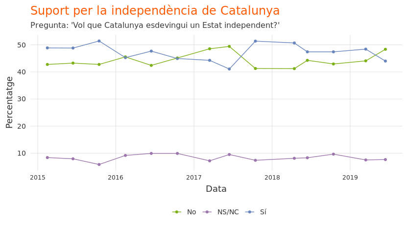<!-- --><!-- --><!-- -->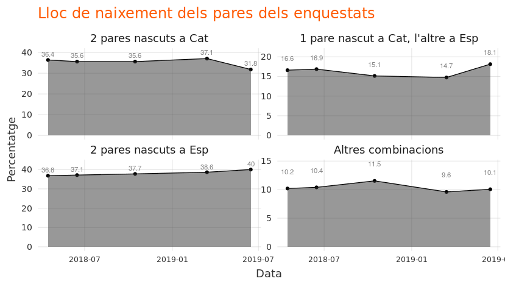<!-- --><!-- -->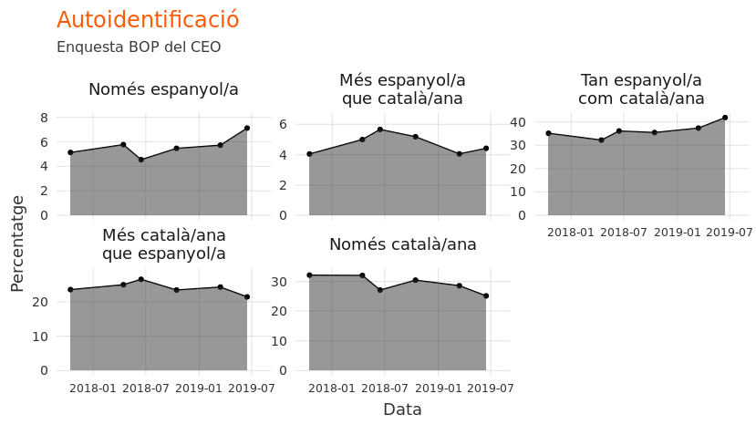<!-- -->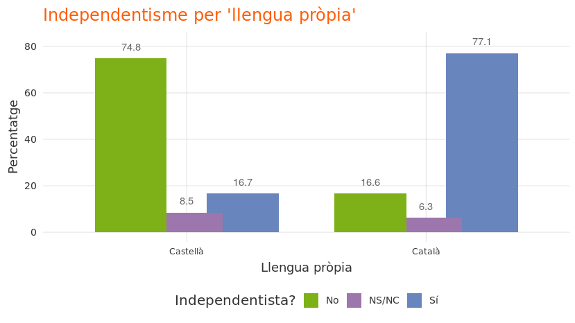<!-- -->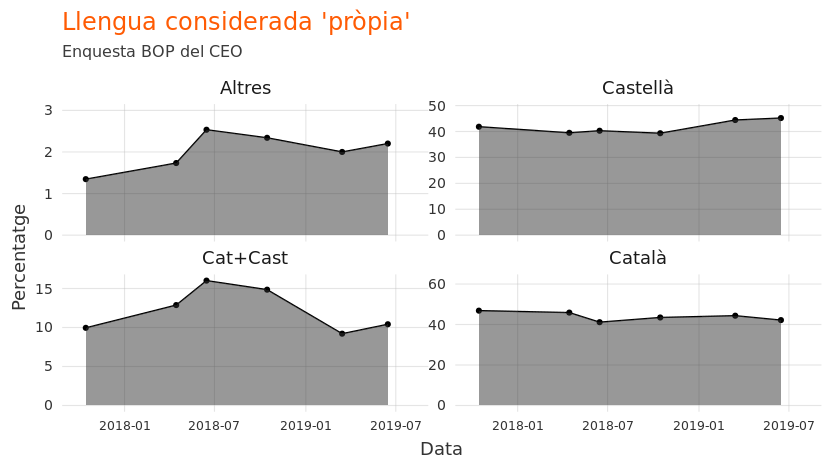<!-- -->
