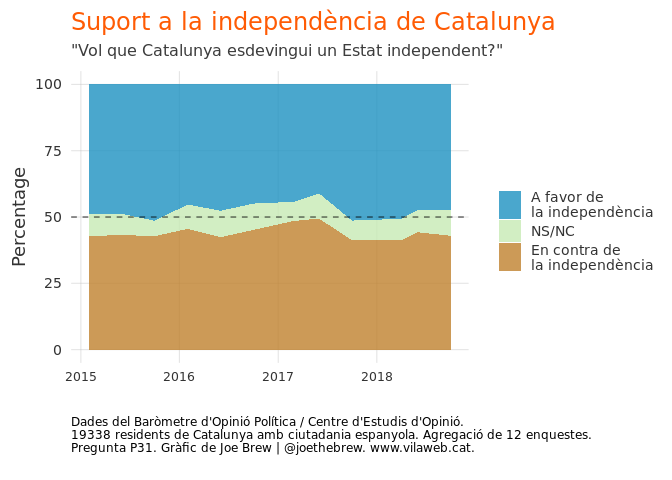
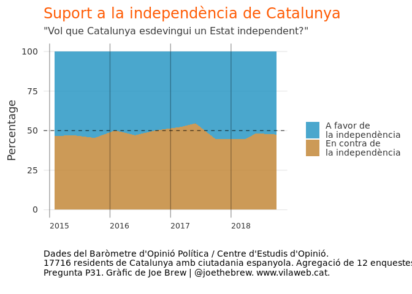
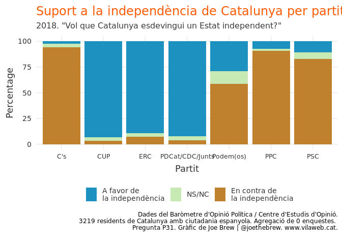
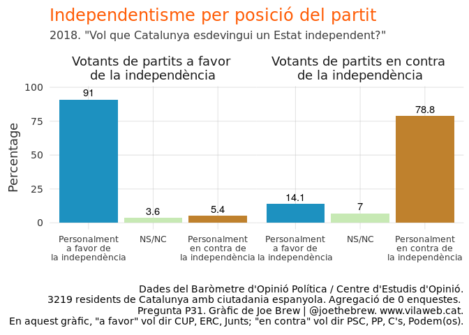

47%, no. 53%.
================

(Alternative title: "L'independentisme ja té majoria social")

Introduction
============

In Catalan politics, the most frequently cited number is 47%. That is the percentage of the popular vote obtained by explicitly pro-independence parties (JxCat, ERC, CUP) in both the September 2015 and December 2017 autonomous elections (\*in 2017, including the foreign vote, it's actually close to 48%, but we'll leave that detail for now).

The 47% number is referenced most frequently by [anti-independence politicians](https://twitter.com/miqueliceta/status/648797449167970304), but it is also cited regularly by [international media](https://www.nytimes.com/2017/12/21/world/europe/catalan-separatists-keep-majority-in-regional-vote.html) and even [pro-independence politicians](http://www.totsantcugat.cat/actualitat/politica/torrent-no-hi-ha-cap-independentista-que-es-conformi-amb-un-47-7-hem-de-ser-mes_205053102.html), often suggesting that Catalans in favor of independence are a minority, or implying that a majority (53%) of Catalans are opposed to independence.

Is this true? Is Catalan independentism a minority movement within Catalonia? Do most Catalans oppose independence from Spain?

Conceptual foundations
======================

Elections are, of course, the best way to gauge popular sentiment. But it is important to recall that elections are contested between parties (which have *many* ideas), and not specific policies. When someone votes for a party or candidate, this does not mean that (s)he agrees with all the positions of that party.

Let's discuss an example. In 2016, Donald Trump - who has called climate change "fake science" - received 46.1% of the popular vote. Does this mean that only 54% of Americans believe in climate change? No, of course not. [Surveys show](https://www.apa.org/monitor/2018/02/numbers) that 71% of Americans accept the reality of climate change (and only 13% deny it). In other words, many Americans who voted for Trump *disagreed with him on this specific issue*. They voted for Trump, despite their disagreement on this issue, because the general election was about *many* issues, not just one.

In the above example, using election results for the purposes of understanding support for a specific issue is a mistake. Could it be that using autonomous election results as a means to measure support for independentism is also mistake? Let's explore the data.

The methods
===========

We examine survey data to uncover views on Catalan independence by political party. Specifically, we analyze situations in which party position on the specific issue of Catalan independence differs from the position of voters of that party. We use the Baròmetre d'Opinió Política, since it is the largest and most methodologically rigorous of regular surveys carried out in Catalonia.

The results
===========

### Overall support for independence

The below chart shows the responses of 19338 Catalans to the question "Do you want Catalonia to become an independent State?", asked at 12 points over the last 4 years, regarding independence.

In the above chart, the percentage in favor of independence (blue) hovers between 41 and 52%, whereas the percentage opposed to independence (brown) never crosses the 50% threshold. It would be erroneous to assume that those who don't answer the question (grey-green) are uniformly opposed to independence. Given the total uncertainy as to their opinion (or as to whether they have an opinion at all), the best way to gauge overall support is to simply remove them. This most realistically reflects the result of a hypothetical referendum.

In the above, having removed the non-respondents, we see that the pro-independence majority ranges from 51% to 55% over the course of 2018. We end up with an approximate 53.12% majority in favor of independence aggregating all survey rounds carried out in 2018.

### Then why 47% in elections?

If 51-55% of Catalans are in favor of independence, then why do independentist parties receive only 47-48% of the popular vote in elections? The answer to this question is rather simple: *because many voters of pro-union parties are pro-independence*.

Let's dig in. The below chart shows opinions on independence by party allegiance. One look at the chart reveals a very important truth: the percentage of people who are opposed to their party's stance on independence is greater among unionist parties than independentist parties.

The most striking examples in the above are the PSC and Podem(os). A full 11% of PSC voters are pro-independence (the equivalent of 11.7% if we remove the non-respondents). Among Podem(os) voters, the percentage which are pro-independence is 29.1% (33.2% in a hypothetical referendum).

Let's aggregate a bit more and examine the opinions of voters crossed with the positions of their parties. The below shows independentism (y-axis)

The above chart shows that only 5.4% of voters of pro-independece parties are anti-independence. However, 14.1% of voters of anti-independence parties are pro-independence. This discrepancy explains why independentism is greater than 50%, even though independence parties receive less than 50% of the vote.

Conclusion and reflection
-------------------------

In the above analysis, we have seen that personal opinions on independence do not always align with the official party positions. 91% of the voters of pro-independence parties are personally pro-independence, but only 78.8% of anti-independence parties are themselves anti-independence. In an agreed upon (pactat) referendum, these "cross-over" voters would push the pro-independence vote into a clear majority. In other words, "yes" would win a Catalan independence referendum with equal participation between the blocks.

Why is it that there are so many more "cross-over" voters among unionist parties as compared to independentist parties? The data examined here don't provide the answer, but there are a few possibilities worth considering:

-   The unionist parties are much larger than pro-independence parties throughout Spain, and get more attention in Spanish media. This could result in some people with pro-independence tendencies identifying more readily with a larger, Spanish national parties.
-   Two of the unionist parties (PP and C's) are significantly to the right of the independentist parties [data here](https://www.vilaweb.cat/noticies/dada-joe-brew-independentisme-dreta-esquerra/). So, a conservative, right-leaning, pro-independence individual may choose to vote for one of the unionist right-wing parties, even though he disagrees with that party on the specific question of Catalan independence (since he/she will agree with most of their other policies).

-   Catalan socialist politicians, who have historically been in favor of self-determination until recently, have taken a more explicit anti-independence stance so as to garner votes at the Spanish national level (rather than a more nuanced stance which would better represent diversity on the question of independence among their voting base).

-   The Podem(os) party and its variants should simply not be considered "unionist".
