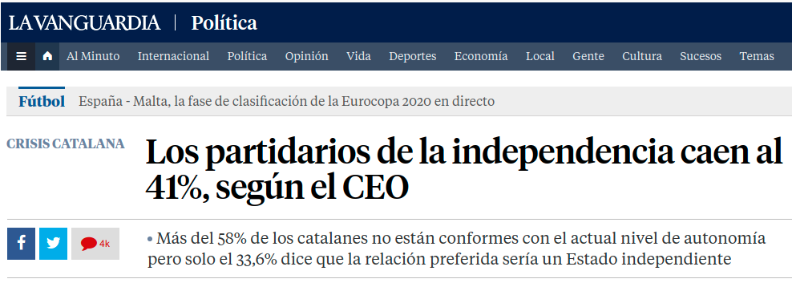
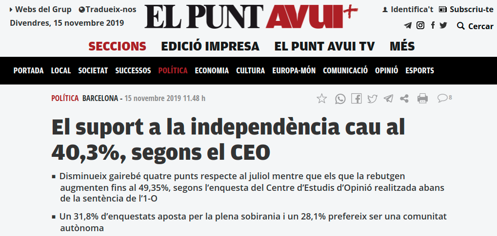

```{r setup, include=FALSE, echo = FALSE}
# Basic knitr options
library(knitr)
opts_chunk$set(comment = NA, 
               echo = FALSE, 
               warning = FALSE, 
               message = FALSE, 
               error = TRUE, 
               cache = FALSE,
               fig.width = 8.64,
               fig.height = 4.86,
               fig.path = 'figures/')
```

```{r}
source('prepare_data.R')
```


# 41? Si us plau, una mica de rigor

### La gran "noticia" de la setmana


Els resultats de la darrera enquesta publicada ("Enquesta: Cosmopolitisme i localisme a Catalunya") pel Centre d'Estudios d'Opinió han dominat molts titulars aquests dies, tant al nivell de l'estat espanyol que a Catalunya. 

<table style="width:100%">
  <tr>
    <td></td>
    <td></td>
  </tr>
    <tr>
    <td></td>
    <td></td>
  </tr>
</table>

La notícia sembla rellevant, i el missatge és clar: l'independentisme cau. "Se hunde". Per visualitzar aquesta suposada caiguda, El País fins i tot va publicar [en el seu article](% mutate(source = 'BOP') %>% filter(date >= '2018-01-01') %>%
  mutate(xx = llengua_primera) %>%
  filter(!is.na(xx)) %>%
  group_by(xx, indepe) %>%
  tally %>%
  group_by(xx) %>%
  mutate(p = n/ sum(n) * 100) %>%
  filter(!xx %in% c('NS/NC', 'Altres'))

ggplot(data = pd,
       aes(x = xx,
           y = p,
           color = indepe,
           group = indepe)) +
  geom_line() +
  geom_point() +
  theme_vilaweb() +
  labs(x = 'Llengua primera',
       y = 'Percentatge',
       title = 'Llengua primera i independentisme',
       subtitle = 'Dades del BOP (CEO)',
       caption = 'Enquestes BOP, 2018-2019. Mostra: 7.208 residents de Catalunya amb ciutadania espanyola.') +
  geom_hline(yintercept = 50, lty = 2, alpha = 0.5) +
  scale_color_manual(name = 'Independentista?',
                     values = c('red', 'black', 'blue')) 
```

Que passaria en una enquesta, doncs, si es seleccionés a més persones de llengua primera castellana (~30% independentista) i menys persones de llengua materna catalana (~80% independentista)? Evidentment, pujaria en els resultats el percentatge en contra de l'independència. I això és exactament el que va passar. Mireme la llengua primera dels enquestats BOP comparada amb les de l'enquesta cosmopolitana:

```{r}

pd <- bop %>% mutate(source = 'BOP') %>% filter(date >= '2018-01-01') %>%
  bind_rows(cosmo %>% mutate(source = 'Cosmo')) %>%
  mutate(xx = llengua_primera) %>%
  filter(xx %in% c('Castellà', 'Cat+Cast', 'Català')) %>%
  filter(!is.na(xx)) %>%
  group_by(source, xx) %>%
  tally %>%
  group_by(source) %>%
  mutate(p = n / sum(n) * 100)

ggplot(data = pd,
       aes(x = xx,
           y = p,
           group = source, 
           fill = source)) +
  geom_bar(stat = 'identity', position = position_dodge(width = 0.7)) +
  theme_vilaweb() +
  geom_text(aes(label = round(p, digits = 2), y = p +5),
            position = position_dodge(width = 0.7), alpha = 0.6) +
  labs(y = 'Percentatge',
       x = "Llengua primera dels enquestats",
       title = "Llengua primera dels enquestats",
       subtitle =  "BOP vs enquesta 'Cosmopolitisme i localisme'",
       caption = '"BOP" es refereix a les 5 enquestes BOP, 2018-2019.\n"Cosmo" es refereix a l\'enquesta "Cosmopolitisme i localisme", 2019.') +
  geom_hline(yintercept = 50, lty = 2, alpha = 0.5) +
  scale_fill_manual(name = 'Enquesta',
                     values = c('darkgrey', vilaweb::colors_vilaweb()[2])) 
```

Realment el percentatge de catalans de llengua materna castellana va pujar 8% en els darrers mesos? Clar que no. La llengua primera no canvia al llarg de la vida! El que ha canviat és la mostra de l'enquesta.

## Eix ideològic

Tant les enquestes del BOP com l'enquesta "Cosmopolitisme i localisme" pregunten sobre l'autoubicació ideològica dels enquestats en una escala de 0 (extrema esquerra) a 10 (extrema dreta). Historicament, aquest eix ideològic està molt correlacionat amb l'independentisme: com més autoubicat a l'esquerra, més independentista. Per tant, si es seleccionés a més gent de la dreta, els resultats reflectarian una baixa de suport a l'independència - i és exactament el que va passar.

Mirem, primer, la relació històrica esquerra-dreta / independentisme-unionisme:

```{r}
pd <- bop %>% mutate(source = 'BOP') %>% filter(date >= '2018-01-01') %>%
  # bind_rows(cosmo %>% mutate(source = 'Cosmo')) %>%
  filter(!is.na(axis_simple)) %>%
  group_by(axis_simple, indepe) %>%
  tally %>%
  group_by(axis_simple) %>%
  mutate(p = n / sum(n) * 100)

ggplot(data = pd,
       aes(x = axis_simple,
           y = p,
           color = indepe,
           group = indepe)) +
  geom_line() +
    geom_point() +
  theme_vilaweb() +
  labs(x = 'Autoubicació ideològica',
       y = 'Percentatge',
       title = 'Ideologia esquerra-dreta i independentisme',
       subtitle = 'Dades del BOP (CEO)',
       caption = 'Enquestes BOP, 2018-2019. Mostra: 6.940 residents de Catalunya amb ciutadania espanyola.') +
  geom_hline(yintercept = 50, lty = 2, alpha = 0.5) +
  scale_color_manual(name = 'Independentista?',
                     values = c('red', 'black', 'blue')) 
```

Però què va passar en l'enquesta "Cosmopolitisme i localisme"? El percentatge de catalans que s'autoubiquen en la dreta política (6 o més en l'escala de 0-10) va pujar significativament.

```{r}
pd <- bop %>% mutate(source = 'BOP') %>% filter(date >= '2018-01-01') %>%
  bind_rows(cosmo %>% mutate(source = 'Cosmo')) %>%
  filter(!is.na(axis_super_simple)) %>%
  group_by(source, axis_super_simple) %>%
  tally %>%
  group_by(source) %>% 
  mutate(p = n / sum(n) * 100)

ggplot(data = pd,
       aes(x = axis_super_simple,
           y = p,
           group = source, 
           fill = source)) +
  geom_bar(stat = 'identity', position = position_dodge(width = 0.7)) +
  theme_vilaweb() +
  geom_text(aes(label = round(p, digits = 2), y = p +5),
            position = position_dodge(width = 0.7), alpha = 0.6) +
  labs(y = 'Percentatge',
       x = "Ideologia de l'enquestat",
       title = "Ideologia dels enquestats",
       subtitle =  "BOP vs enquesta 'Cosmopolitisme i localisme'",
       caption = '"BOP" es refereix a les 5 enquestes BOP, 2018-2019.\n"Cosmo" es refereix a l\'enquesta "Cosmopolitisme i localisme", 2019.') +
  geom_hline(yintercept = 50, lty = 2, alpha = 0.5) +
  scale_fill_manual(name = 'Enquesta',
                     values = c('darkgrey', vilaweb::colors_vilaweb()[2]))
```


Realment el percentatge de catalans que s'autoubiquen en la dreta política va duplicar? Probablement pas. El més probable és que la darrera enquesta va sobreamplificar de persones de la dreta política (el que va tenir un impacte, logicament, en els resultats sobre l'independentisme).


Mirem-ho d'una altra manera. El gràfic següent és l'autoubicació ideològica dels enquestats al llarg del temps. 

```{r}
pd <- bop %>% mutate(source = 'BOP') %>% filter(date >= '2016-01-01') %>%
  bind_rows(cosmo %>% mutate(source = 'Cosmo')) %>%
  filter(!is.na(axis)) %>%
  group_by(source, date) %>%
  summarise(val = mean(axis, na.rm = T))

ggplot(data = pd,
       aes(x = date,
           y = val)) +
  geom_line() +
  geom_point(aes(color = source), size = 2) +
  theme_vilaweb() +
  coord_flip() +
  scale_y_continuous(breaks = seq(0, 10, 0.1)) +
  scale_x_date(breaks = sort(unique(pd$date)), labels = format(sort(unique(pd$date)), '%Y-%m')) +
  labs(x = 'Data',
       y = 'Ubicació ideològica, equerra (0) - dreta (10)') +
  scale_color_manual(name = 'Enquesta',
                     values = c('darkgrey', vilaweb::colors_vilaweb()[2]))
```

Els catalans realment van fer un gir radical a la dreta ens els darrers mesos? Poc probable.

## Identitat

L'identitat i les opinions sobre l'independència van també de la mà. Com més autoidentificació espanyola, més unionista; com més autoidentificació catalana, més independentista. Aquesta és la relació independentisme i identitat, historicament:

```{r}

pd <- bop %>% mutate(source = 'BOP') %>% filter(date >= '2018-01-01') %>%
  # bind_rows(cosmo %>% mutate(source = 'Cosmo')) %>%
  filter(!is.na(identificacio_simple)) %>%
  group_by(identificacio_simple, indepe) %>%
  tally %>%
  group_by(identificacio_simple) %>%
  mutate(p = n / sum(n) * 100)

ggplot(data = pd,
       aes(x = identificacio_simple,
           y = p,
           color = indepe,
           group = indepe)) +
  geom_line() +
    geom_point() +
  theme_vilaweb() +
  labs(x = 'Autoidentificació',
       y = 'Percentatge',
       title = 'Sentiment d\'identitat i independentisme',
       subtitle = 'Dades del BOP (CEO)',
       caption = 'Enquestes BOP, 2018-2019. Mostra: 6.940 residents de Catalunya amb ciutadania espanyola.') +
  geom_hline(yintercept = 50, lty = 2, alpha = 0.5) +
  scale_color_manual(name = 'Independentista?',
                     values = c('red', 'black', 'blue')) 
```

La gent canvia sovint d'identitat? No. Per tant, quan hi ha canvis d'identiat signifactius en unes enquestes, el més probable no és que la societat canvia, sinó que el mostreigos són diferents (i per tant, incomparables). Si es selecciona per una enquesta més gent de sentiment "català", l'independentisme pujaria; de la mateixa manera, si es seleccionés per una enquest més gent de sentiment "espanyol", l'independentisme apareixeria molt baix.

Què va passar en la darrera enquesta publicada pel CEO? Mirem-ho:

```{r}
pd <- bop %>% mutate(source = 'BOP') %>% filter(date >= '2018-01-01') %>%
  bind_rows(cosmo %>% mutate(source = 'Cosmo')) %>%
  filter(!is.na(identificacio_simple)) %>%
  group_by(source, identificacio_simple) %>%
  tally %>%
  group_by(source) %>% 
  mutate(p = n / sum(n) * 100)

ggplot(data = pd,
       aes(x = identificacio_simple,
           y = p,
           group = source, 
           fill = source)) +
  geom_bar(stat = 'identity', position = position_dodge(width = 0.7)) +
  theme_vilaweb() +
  geom_text(aes(label = round(p, digits = 2), y = p +5),
            position = position_dodge(width = 0.7), alpha = 0.6) +
  labs(y = 'Percentatge',
       x = "Sentiment / identitat",
       title = "Identitat dels enquestats",
       subtitle =  "BOP vs enquesta 'Cosmopolitisme i localisme'",
       caption = '"BOP" es refereix a les 5 enquestes BOP, 2018-2019.\n"Cosmo" es refereix a l\'enquesta "Cosmopolitisme i localisme", 2019.') +
  geom_hline(yintercept = 50, lty = 2, alpha = 0.5) +
  scale_fill_manual(name = 'Enquesta',
                     values = c('darkgrey', vilaweb::colors_vilaweb()[2]))
```

Curiós, oi? Ens uns pocs mesos, el percentage de catalans que es considera més català que espanyol realment va baixar 10%? Perdoneu les repetcions, però no. Els sentiments identitaris canvien molt poc, i mai de manera ràpida. Les diferències entre les enquestes BOP i l'enquesta "Cosmopolitisme i localisme" no reflecteixen canvis en la societat catalana, sinó canvis en un mostreig de 1.500 persones.

## Conclusió

Un analisi de les dades de les BOP dels darrers anys i l'enquesta "Cosmopolitisme i localisme" deixa clar que la darrera és esbiaixada d'una manera que _sobrereflexiona_ la dreta i els catalans d'origen castellanoparlant mentres que _infravalora_ l'esquerra i els catalanoparlants. Això, logicament, té conseqüències importants alora de calcular el suport a l'independència. El 41% (el chifre que surt en els titulars de tots els diaris) prové d'un analisi que ignora les característiques del mostreig, i les seves conseqüències.

Quan es ponderen les dades per ajustar pels esbiaixos més importants (llengua, lloc de naixement, i provincía), com [va fer el Roger Tugas](https://www.naciodigital.cat/noticia/191129/dades/ocultes/ceo/apunten/si/guanyaria/referendum), l'independentisme i l'unionisme estan a basicament el mateix nivell (45% cadascú). O sigui, quan es tracta les dades d'una manera crítica, no consta una baixada significativa en el suport a l'independència, sinó uns moviments adins del marge d'error estadístic. Altrament dit, un analisi rigorós de les dades d'aquesta enquesta porta a la mateixa conclusió que un analisi de qualsevol de les enquestes dels darrers anys: que el nivell de suport a l'independència no ha tingut canvis significatius en els darrers anys.

Però clar, els conceptes "ponderació", "esbiaix", "sobrerepresentació", i "marge d'error" no fan bons titulars. 41%? Això sí que és un bon titular. Així que prepareu-vos a sentir, una i altra vegada, aquest chifre - fins que surti la propera enquesta (on hi haurà molt probablament una suposada "pujada" en suport a l'indepèndencia només degut al principi de "la regressió a la mitjana").

# Technical details

The code for this analysis is publicly available at `r self_cite()`.