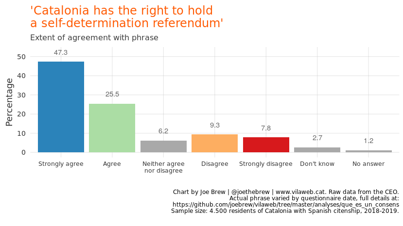
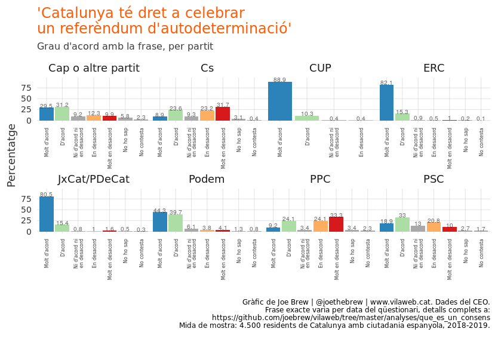

Only 19% of Catalans oppose a self-determination referendum
================

# Introduction

The similarities between Scotland and Catalonia are obvious:

  - Both Catalonia and Scotland are currently part of States generally
    recognized as functioning democratic societies (Spain and the
    U.K.)  
  - Similar size (Catalonia = 7,6 million, Scotland = 5,4 million)  
  - Both have a strong sense of “national” identity  
  - Approximately half of Scots and half of Catalans want an independent
    State  
  - Both Scots and Catalans are largely pro-EU  
  - Both Scots and Catalans have their own language (though Catalan is
    far more widely spoken than Gaelic)

When Scots decided to vote on the question of independence in 2014, it
was a relatively undramatic event. No judges ordered ballot boxes to be
siezed. No police were sent from the rest of the U.K. to beat voters. No
Scottish activists were placed in prison. A trial for “rebellion” was
not held in London. A referendum simply took place, the votes for “No”
outnumbered those for “Yes”, and life went on.

With Brexit on the horizon, a majority of Scots want to vote on the
question of independence again. And they likely will. And, like the 2014
vote, nobody will be beaten, nobody will be arrested, nobody will be
brought to the State’s capital for a political trial, and the question
of the U.K.’s “governability” will likely be unaffected by both the
process and the outcome of the next Scottish self-determination
referendum.

The same cannot be said for Catalonia and Spain. The leaders of the main
pro-independence Catalan parties have spent more than a year and half in
“preventive” prison for organizing the 2017 Catalan referendum, and
Spain’s political stability is increasingly doubtful (acting President
Pedro Sánchez was unable to obtain a majority in congress last month,
and Spaniards may go to the national polls for the fourth time in five
years this fall). The outcome of the Catalan referendum - and Spain’s
reaction to it - has been largely negative for all parties. Why, then,
has Spain not simply taken the approach of the U.K?

The simple, ubiquitous answer from the Spanish government is because
“it’s illegal”, a response which begs the obvious follow-up
question: if the law is the problem, why not change it? Why not make it
explicitly legal for Catalans to exercise the same rights as Scots,
thereby avoiding uncertainty and ensuring adequate respect for the
principle of self-determination?

According to Pedro Sánchez, the acting Spanish President, [Catalonia
will “never” be independent and there will “never” be a
referendum](https://twitter.com/joethebrew/status/1119312745869053953).
According to Miquel Iceta, the leader of the Catalan branch of the
anti-independence Spanish Socialist Party, there should not be a
recognized referendum because [“Catalans don’t want
one”](https://twitter.com/joethebrew/status/1119300919831814144). The
position of the Spanish government is that there is not sufficient
consensus to even consider a referendum in Catalonia.

Here’s the thing, though. There already does exist a consensus among
Catalans. It existed in 2017, when they were beaten and jailed for
attempting to vote. It continued to exist in 2018, as Catalan political
leaders waited in pre-trial prison. And exists right now, in 2019, per
the most recent polling data. Catalans - including many who do not want
independence - want what Scotland has: the ability to decide their form
of government for themselves. They want a referendum.

# The data

The Baròmetre d’Opinió Política of the Centre d’Estudis d’Opinió
occasionally asks Catalans whether they feel that Catalonia has a right
to hold an independence referendum. Since the 2017 referendum, the
question has been asked 3 times, in 3 different ways:

1.  June 2018: Extent of agreement with the phrase “Catalonia does not
    have a right to celebrate a self-determination referendum”.

2.  March 2019: Extent of agreement with the phrase “Catalans have a
    right to decide their future as a country by voting in a
    referendum”.  

3.  June 2019: Extent of agreement with the phrase “Catalonia has the
    right to celebrate a self-determination referendum”

The three variations of the question are essentially asking the same
exact thing (albeit in the negative form in the first iteration,
requiring transformation of the data). Let’s explore the response to
this question, and - for the sake of avoiding [potentially misleading
variations associated with small sample
size](https://github.com/joebrew/vilaweb/tree/master/analyses/quarantaquatre)
- let’s aggregate the values for 2018 and 2019.

The below shows the opinions of a representative sample of 4.500
Catalans on the question of self-determination. Nearly three-quarters
believe that Catalonia has the right to hold a self-determination
referendum. Only 17,1% feel that it does not.

<!-- -->

If we remove those who didn’t give an answer one way or the other, we
get the following:

<!-- -->

In other words, 19% of Catalans oppose Catalan self-determination, and
81% are in favor.

What’s striking about this figure is that it completely invalidates
Spanish President Pedro Sánchez’s excuse for not taking any political
measures to resolve the Catalan conflict. Sánchez stated last year that
he would consider any political propsoal if it were to obtain the
support of [“75 to 80% of Catalan
society”](https://www.lavanguardia.com/politica/20181212/453526766804/pedro-sanchez-ofrece-erc-pdecat-estudiar-oferta.html).
Self-determination has the support of 81% of Catalans. Why, then, has
Sánchez not budged from his position of “never” holding a referendum?
But what’s even more striking is how much support there is for a
self-determination referendum, *even among voters of Pedro Sánchez’s
party*. More than half of Catalan socialists believe Catalonia has a
right to a self-determination referendum, and fewer than 31% believe
that Catalonia does not.

<!-- -->

Again, if we remove those who did not answer the question one way or
another, the breakdown by party is even more telling.

<!-- -->

More than 60% of Catalan socialists - a party whose Catalan leader
claims that Catalans don’t want a referendum - themselves say that
Catalans have a right to a self-determination referendum.

# Conclusion

Scottish Prime Minister Nicola Sturgeon has announced that her
government will pursue an [independence referendum in the next two
years](https://twitter.com/BBCPolitics/status/1121035233208557568).
Though some Tories have stated that they will actively oppose it, many
UK politicians - including those in anti-independence and
anti-referendum parties - have stated that [they will accept
it](https://twitter.com/NeilFindlay_MSP/status/1158801497527918592). As
John McDonnell, the shadow chancellor of the Labour party, stated last
week: [“We would let the Scottish people decide. That’s
democracy”](https://www.theguardian.com/politics/2019/aug/06/john-mcdonnell-open-to-second-scottish-independence-vote).
John Corbyn, the leader of the Labour party, [apparently shares that
view](https://www.theguardian.com/politics/2019/aug/07/john-mcdonnell-deepens-row-over-second-independence-poll).

Pedro Sánchez, Spain’s President, asked for 80%. And he got it. 81% of
Catalans believe that Catalonia has a right to a self-determination
referendum. The fact that Pedro Sánchez is not undertaking the legal
measures to ensure that a referendum can be carried out suggest that he
is simply not aware that this consensus exists.

Or, and sadly perhaps more likely, Pedro Sánchez *is* aware that a broad
consensus exists in Catalonia in favor of Catalan self-determination.
But he’s likely also aware of the broad consensus in Spain *against*
allowing Catalans to decide for themselves. And denying Catalan
self-determination wins votes in the rest of Spain.

But Sánchez needs to maintain the myth that Catalans are a divided
society without a consensus to solve their political problems. To
safeguard his votes in the rest of Spain, as well as his credibility in
the rest of Europe, he needs people to believe that Catalans don’t even
know what they want. This is the myth that allows the Spanish State to
postpone implementing the obvious solution to the Catalan political
crisis, the solution desired by a large majority of Catalans, the
solution carried out in Scotland, and the solution implemented in all
other recent cases of sizeable independence groups nearing the 50%
threshold in democratic societies: a referendum.

# Technical note

All code and data for this article are publicly available at:
<https://github.com/joebrew/vilaweb/tree/master/analyses/que_es_un_consens>.

# Catalan-language plots

<!-- -->

<!-- -->

<!-- -->

<!-- -->
