Catalonia and the King of Spain
================

Introduction
============

Felipe Bourbon has just completed his fifth year as Spain's Head of State. As the symbol of Spanish unity and strength, the congratulations rolled in from all sectors of Spanish politics.

<table style="width:100%">
<tr>
    <td></td>
    <td></td>

</tr>
<tr>
    <td></td>
    <td></td>

</tr>
</table>
Well, not quite *all* sectors. There was a notable silence from Catalonia's elected political leadership. Neither Carles Puigdemont (the exiled President), nor Quim Torra (the acting President), nor Pere Aragonès (the Vice-President), nor Alfred Bosch (the Foreign Minister), nor Miquel Buch (the Interior Minister), nor any other high-level member of the Catalan Government wrote to congratulate Felipe Bourbon.

Why the silence? Why did nobody from the Catalan Government congratulate the King of Spain on the five year anniversary of his reign? Perhaps it's because they were doing something that *elected* leaders generally do better than *unelected* ones: representing their people.

The thing is, an overwhelming majority of Catalans disapprove of Monarchy generally as a form of government, and of Felipe Bourbon specifically as a Head of State. Regardless of one's own personal feelings on Catalan leaders, Mr. Borbón, or different forms of government, these are just the facts: most Catalans don't want a King.

Let's dig into the data.

The data
========

Catalans express low confidence in the Spanish Monarchy
-------------------------------------------------------

Catalans have very little confidence in their Head of State. On a scale from 0 to 10, with 0 being "no confidence" and 10 being "a great deal of confidence", Catalans over the last four years have assigned to the Spanish Monarchy a value of 2. The below chart shows how Catalans' (already low) degree of confidence in the Monarchy dropped even lower following the Spanish State's handling of the Catalan independence referendum.

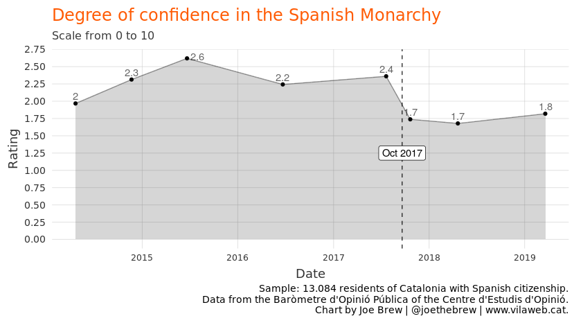

A score of 2 on a scale from 0 to 10 may seem low, and that's because it is. The below chart shows the aggregation of 4 years of surveys regarding Catalans' confidence in different institutions. The Monarchy ranks below all of them, even lower than banks.

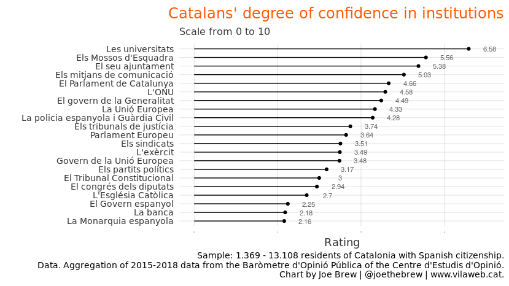

It's worth nothing that confidence has not fallen only in the Spanish Monarchy in recent years. It has also fallen in the National Police and Civil Guard.

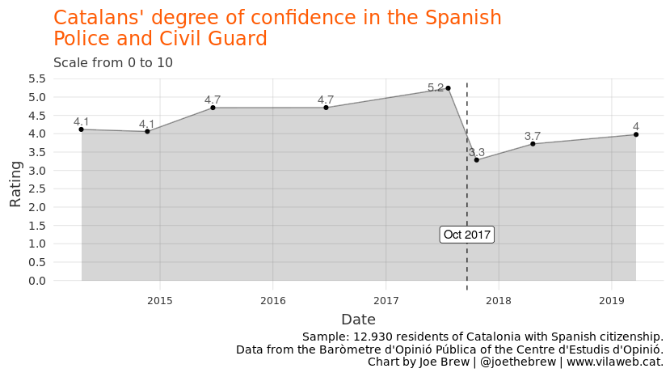

But how does (the rest of) Spain feel about its King?
-----------------------------------------------------

It's difficult to know if Catalans are alone in their dislike of the institution of the Monarchy, or if Spaniards feel similarly. An equivalent of the Catalan Barometer of Public Opinion (the data source for previous charts) does not exist in most Spanish regions, and the CIS (the State-level survey) stopped asking about the Monarchy in 2015.

That said, private polling suggests that most Spaniards do not share the anti-monarchical feelings of Catalans. A recently published [Vanitatis poll](https://www.vanitatis.elconfidencial.com/casas-reales/2019-06-19/encuesta-vanitatis-felipe-letizia-monarquia-republica-espana-cataluna_2075143/) showed that 74% of Catalans preferred a Republic, and only 21,6% preferred the Monarchy. This figure was nearly reversed in Madrid (62,0% in favor of the Monarchy and only 37,4% in favor of the Republic). The rest of Spain also showed larely pro-Monarchy sentiment. Only in the Valencian Community, Galicia, the Basque Country and Catalonia are there more Republicans than Monarchists.

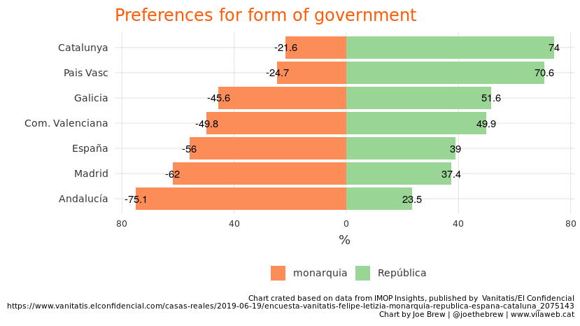

So, who likes the Monarchy?
---------------------------

The tri-annual BOP survey asks thousands of Catalans their degree of confidence in institutions on a regular basis. Since 2015, 13.804 Catalans have responded to the BOP's question on the Monarchy. Of those, more than half (6.662 or 50,6%) have given the Spanish Monarchy a score of 0 on a scale of 0-10. Only 1.638 of the 13.804 (12%) give the Monarchy a score of 6 or greater.

Who are these 12% of Catalans that approve of the Monarchy? Let's see.

### Monarchists by party

The below chart shows the percentage of Catalans of each political party who have a high degree of confidence (6 or more on a scale from 0 to 10) in the Spanish Monarchy. In only the conservative "People's Party" is it a majority.

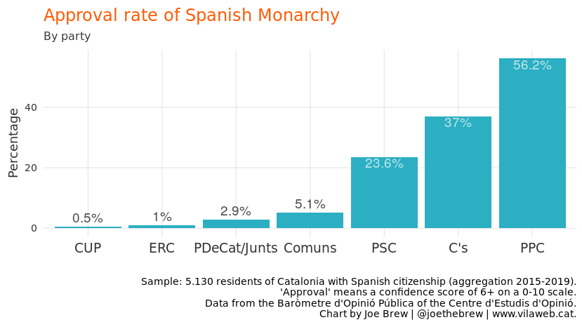

### Monarchists by ideology

The below chart shows the approval rate (score of 6 or more on a 0-10 confidence scale) of the Spanish Monarchy as a function of Catalans' political ideology (aggregated from numerical values into categories as follows: 0-2: far left, 3-4: left, 5: center, 6-7: right, 8-10: far right).

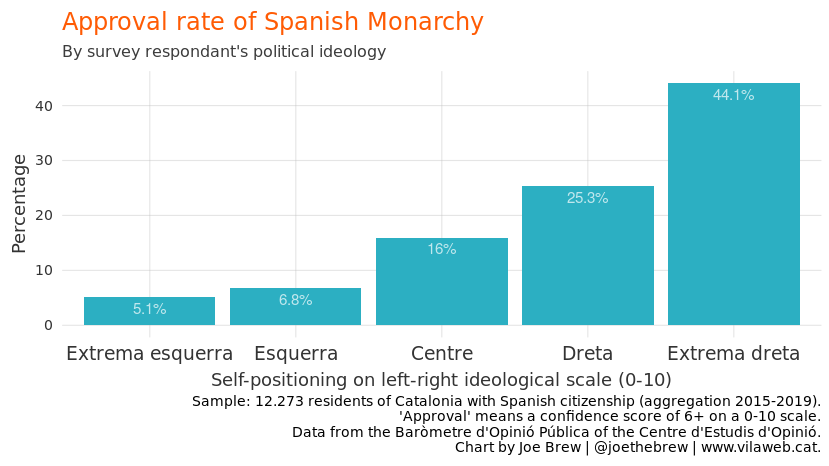

The above chart shows that the Monarchy's approval rating is linearly associated with the ideology of Catalans: the more to the far-right, the more support for the Monarchy.

This phenomenon is not specific to Catalonia. As documented in [a Twitter thread](https://twitter.com/LluisOrriols/status/1141431539441524736?s=19) by [Lluís Orriols](https://twitter.com/LluisOrriols), in Spain the confidence in the Spanish Monarch is much higher among those who are ideologically right-wing than left-wing, and the gap had been growing (at least up until the CIS stopped asking the question in 2015).

### Support for the monarchy and language

The below chart shows the association of the language Catalans consider to be their "own" and their confidence (again on a 0-10 scale) in the Spanish Monarchy.

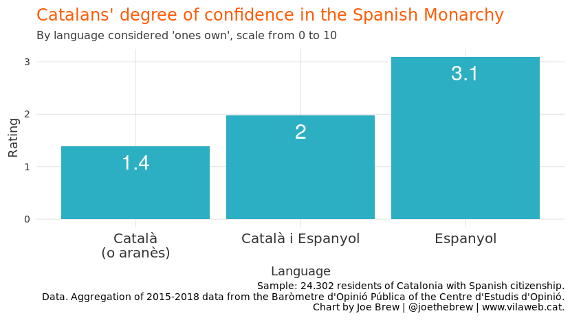

It's clear in the above that those who consider Catalan to be their language are far less confident in the Spanish Monarchy than those who consider Spanish to be their language. That said, it's worth paying attention to the scale of the y-axis. Even among Spanish-speakers, the average confidence score in the Monarchy is only about 3 of 10.

### Support for the Monarchy and age

The below chart shows the average degree of confidence in the Spanish Monarchy among Catalans, as a function of age. Either (a) young Catalans will become monarchical with time or (b) in the future the (already low) approval rate of Felipe Bourbon among Catalans will drop even further as the group with the highest level of support for him passes on.

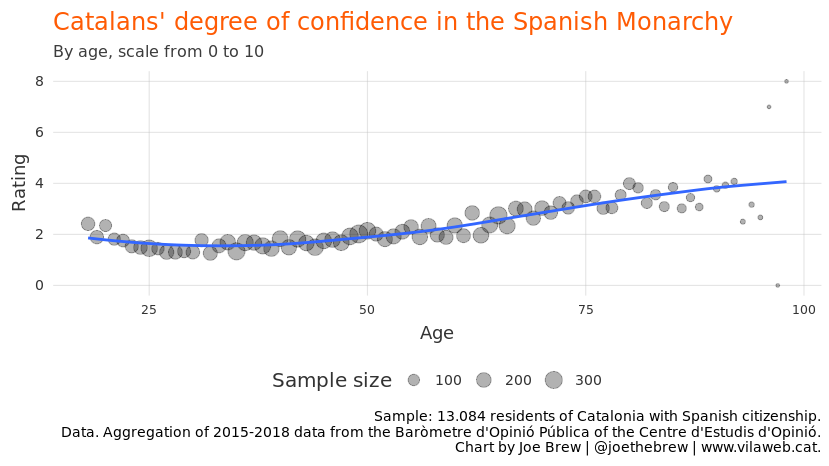

Conclusion
==========

There is a broad, anti-monarchy consensus in Catalonia. More than half of Catalans give the Spanish Monarchy a 0 out of 10 in terms of general confidence. Catalans have lower confidence in the Spanish Monarchy than any other institution (including the Spanish Government, banks, police, and the military). And the trend over the last few years is largely downward.

The very few Catalans (12%) that give the Monarchy a passing score are largely concentrated in the political far-right. The numbers of Monarchists on the Catalan left being virtually negligible (5% among the far-left and 7% among the left). In addition to being right-wing, the likelihood of being a pro-Monarchy Catalan is associated with (a) being older, (b) considering Spanish one's "own" language, and (c) being a voter of Spanish nationalist parties (PP, C's, and Socialists).

That the Spanish Monarchy gets most of its support from the political right should come as no surprise, given the close relationship between the Bourbon family and the former right-wing dictator, Francisco Franco. What is surprising is how *low* the levels of support for the Spanish Monarchy are *even among those groups most favorable to it*. Most Catalans - even those on the ideological right - still have low confidence in the Spanish Monarchy.

Regardless of how one personally feels about Mr. Felipe Bourbon, it is clear that the future viability of the Bourbon family's reign in Catalonia is doubtful. The Monarch's support in Catalonia is low across all sectors, and highest in groups who are in demographic decline. The trend, especially since October 2017, is downwards.

Catalan-language charts
=======================

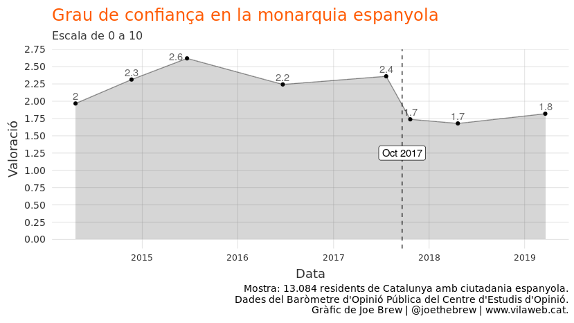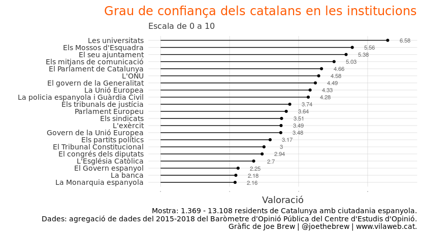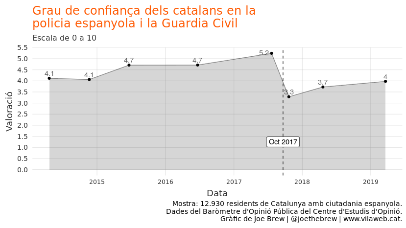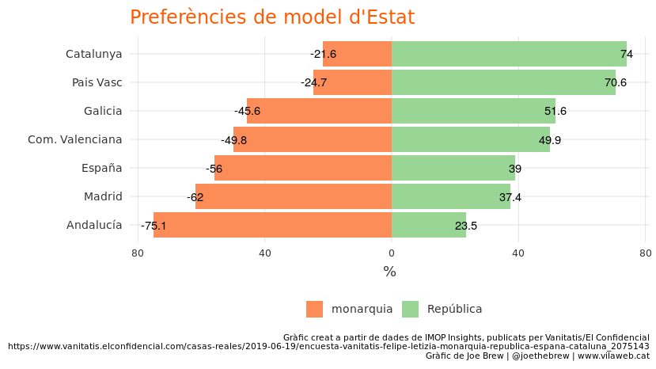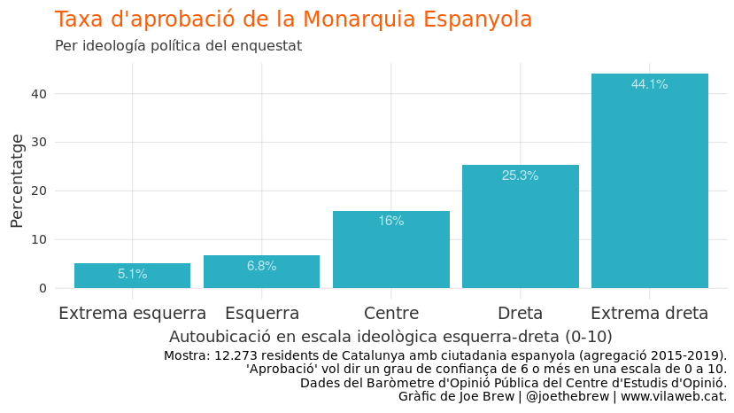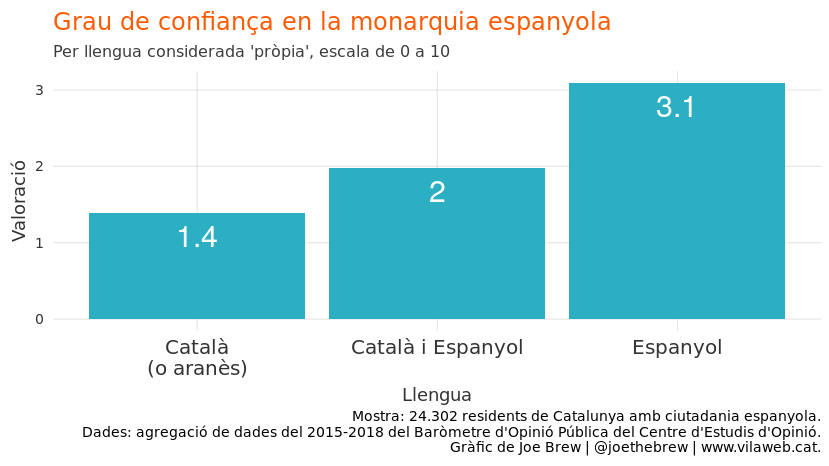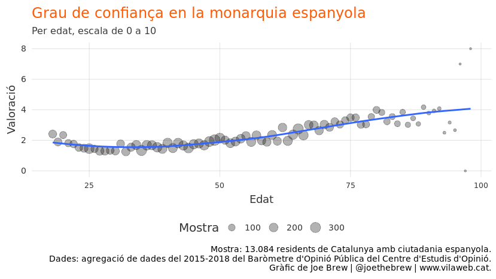
