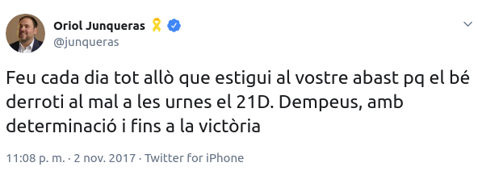
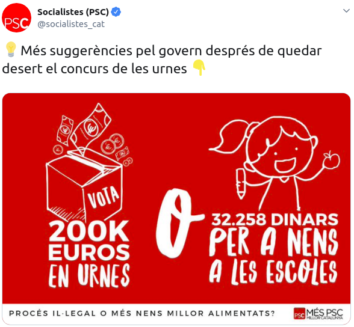
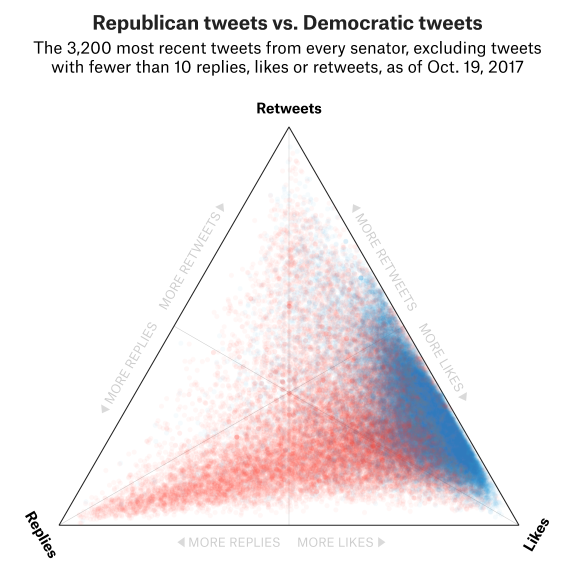
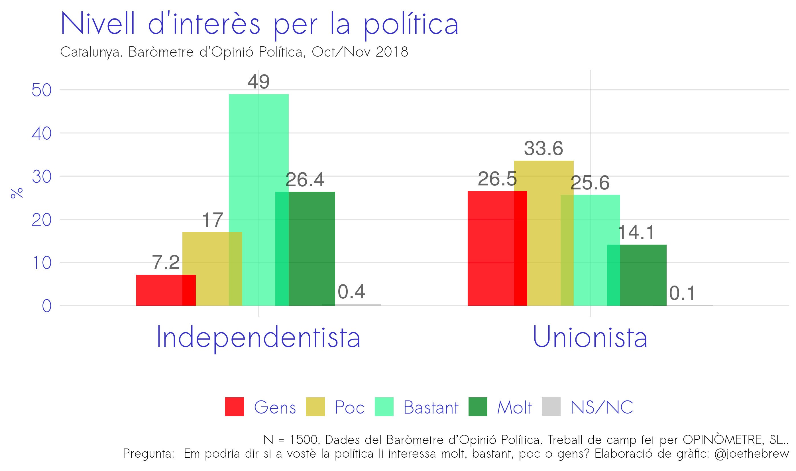
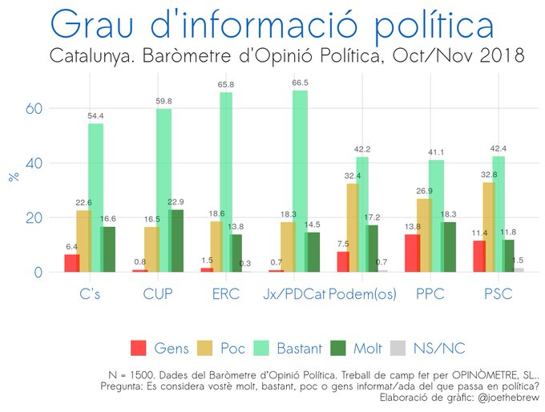

```{r setup, include=FALSE, echo = FALSE}
# Basic knitr options
library(knitr)
opts_chunk$set(comment = NA, 
               echo = FALSE, 
               warning = FALSE, 
               message = FALSE, 
               error = TRUE, 
               cache = FALSE,
               fig.path = 'figures/')
```


```{r}
# Libraries
library(vilaweb)
library(rtweet)
library(tidyverse)
library(databrew)
library(translateR)
library(sentimentr) # https://github.com/trinker/sentimentr
require(RPostgreSQL)
require(readr)  
library(ggrepel)
require(DBI)
library(ggtern)
  
```

```{r, fig.height = 8}
# # Get most recent tweets from our people of interest
people <- read_csv('people.csv')
people <- tolower(people$username)
people <- people[!people == 'gabrielrufian_']
people <- c(people, 'j_zaragoza_')
if(file.exists('tl.RData')){
  load('tl.RData')
} else {
  # Connect to the db
  pg = DBI::dbDriver("PostgreSQL")
  con = DBI::dbConnect(pg, dbname="twitter")
  tl <- RPostgreSQL::dbGetQuery(
    con,
    paste0("SELECT * FROM twitter")
  )
  save(tl, file = 'tl.RData')  
  dbDisconnect(con)
  }
tl_original <- tl

tl <- tl %>% filter(username %in% people)
# Remove replies
tl <- tl %>% filter(is_reply_to == 0)
tl <- tl %>% filter(date >= '2016-01-01',
                    date <= '2018-12-31')
tl$ratio <- tl$replies_count / tl$retweets_count 
tl$interactions <- tl$retweets_count + tl$replies_count + tl$likes_count
tl <- tl %>% filter(interactions >= 10)

# Read in google sheet with keys
library(gsheet)
if(!'goog.RData' %in% dir()){
  goog_people <- gsheet::gsheet2tbl(url = 'https://docs.google.com/spreadsheets/d/1k6_AlqojK47MMqzuFYAzBnDfYXysmUgSseaKvHTb3W4/edit#gid=1425313388')
  save(goog_people,
       file = 'goog.RData')
} else {
  load('goog.RData')
}

tl <- tl %>% filter(username %in% goog_people$username)

# Define the parties to remove
remove <- c('jeanmarcpujol')
tl <- tl %>% filter(!username %in% remove)

# Join the google data
tl <- tl %>%
  left_join(goog_people)
```

## The introduction

In 2017, Esquire Magazine's Luke O'Neil wrote [an article called "How to Know If You've Sent a Horrible Tweet"](http://www.esquire.com/news-politics/news/a54440/twitter-ratio-reply/). O'Neil argued that "The Ratio" - that is, the ratio of replies to retweets - is the perfect metric for measuring the badness of a tweet. The higher the ratio, the worse the tweet. When a politician writes a particularly offensive or stupid tweet, very few people retweet it, but very many reply to it.

FiveThirtyEight, a data journalism group in the United States, did [an analysis of American politicians' twitter ratio](https://fivethirtyeight.com/features/the-worst-tweeter-in-politics-isnt-trump/) in late 2017. They showed that, despite popular belief, there are American politicians who are even more inept at Twitter than Donald Trump. Hard to believe, but true.

Let's explore "The Ratio" among Catalan and Spanish politicians.

## The Question

Who are Catalonia and Spain's worst tweets and tweeters?

## The methods

We gathered tweets for `r length(unique(tl$username))` well-known Spanish and Catalan politicians, and calculated tweet-specific reply-to-retweet ratio, as well as a few aggregate statistics. We used all tweets for the three year period from 2016 through 2018, removing those with fewer than 10 interactions.

## The results

The below is a "ternary" diagram showing the overall relationship between replies, retweets, and likes. Each point is a tweet from one of the 57 politicians (ie, `r nrow(tl)` dots). A well-received tweet is situated to the right and top. A poorly received tweet is situated in the bottom left.

```{r}
the_caption <- 'www.vilaweb.cat | Joe Brew | @joethebrew'

make_tern <- function(language = 'catalan',
                      title = '',
                      data = NULL,
                      show_density = FALSE,
                      size = 0.3,
                      alpha = 0.6,
                      overall = FALSE,
                      label = FALSE){
  if(is.null(data)){
    data <- tl
  }
  if(language == 'english'){
    x = 'Replies'
       y = 'Retweets'
       z = 'Likes'
       subtitle = 'Tweets, 2016-2018'
  } else {
    x = 'Respostes'
       y = 'Retuits'
       z = 'Agradaments'
              subtitle = 'Piulades, 2016-2018'

  }
  if(overall){
      data <- data %>%
    group_by(person = username,
             party,
             eix_indepe_unio,
             eix_esquerra_dreta) %>%
    summarise(replies_count = sum(replies_count, na.rm = TRUE),
              retweets_count = sum(retweets_count, na.rm = TRUE),
              likes_count = sum(likes_count, na.rm = TRUE))
      data$replies_count <- percent_rank(data$replies_count)
      data$retweets_count <- percent_rank(data$retweets_count)
      data$likes_count <- percent_rank(data$likes_count)
      label_df <- data[which(order(data$replies_count) %in% 1:2 | order(data$retweets_count) %in% 1:2 | order(data$likes_count) %in% 1:2),]
  } else {
    subtitle <- ''
    # Jitter
      data$replies_count <- jitter(data$replies_count)
  data$retweets_count <- jitter(data$retweets_count)
  data$likes_count <- jitter(data$likes_count)
  }
  g <- ggtern(data = data,
       aes(x = replies_count,
           y = retweets_count,
           z = likes_count)) +
    labs(title = title)
  if(show_density){
    g <- g +
  geom_density_tern() +
  stat_density_tern(aes(fill=..level.., alpha=..level..), geom='polygon') +
    scale_fill_gradient2(high = "blue") +
  theme_showarrows() +
      guides(color = "none", fill = "none", alpha = "none")
  }
  g <- g +
  geom_point(alpha = alpha,
             size = size) +
  ggtern::theme_bvbw() +
  # theme_rgbw() +
  labs(x = x,
       y = y,
       z = z,
       title = title,
       subtitle = subtitle,
       caption = the_caption) +
  # theme_bw() +
  theme_notitles() +
  # theme_noticks() +
  ggtern::theme_showgrid_minor() +
  ggtern::theme_hidegrid_major() +
  ggtern::theme_nolabels() +
  theme(legend.position = 'none') +
      theme(plot.title = element_text(hjust = 0.5))

  if(label){
    g <- g +
      geom_text(data = label_df,
                       aes(label = person))
  }
  return(g)
}
make_tern(alpha = 0.1, size = 0.4)
```

Most tweets are well received; that is, they have a low ratio of replies to retweets. In fact, of the `r nrow(tl)` tweets examined, only `r length(which(tl$ratio > 1))` had a ratio of greater than 1 (ie, more replies than retweets) - that's just `r round(length(which(tl$ratio > 1)) / nrow(tl) * 100, digits = 1)`%.


### Percent of interactions which are replies

It's hard to make comparisons between politicians on three dimensions, so, let's reduce our analysis to just one. The below chart shows the percentage of all interactions (likes + retweets + replies) which are replies. A high percentage generally indicates a poorly received tweet, and a low percentage generally indicates a well received one.

```{r}
percent_plot <- function(language = 'catalan',
                         data = NULL,
                         return_table = FALSE){
  if(is.null(data)){
    data <- tl
  }
  if(language == 'catalan'){
    x = 'Usuari'
       y = 'Percentage'
    title = 'Percentage de interactions que són respostes'

  } else {
    x = 'Username'
       y = 'Percentage'
    title = 'Percentage of interactions which are replies'

  }
  
  agg <- data %>%
    group_by(person = username) %>%
    summarise(interactions = sum(interactions, na.rm = TRUE),
              replies = sum(replies_count, na.rm = TRUE)) %>%
    ungroup %>%
    mutate(p = replies / interactions * 100) %>%
    arrange(desc(p))
  agg$person <- factor(agg$person,
                       levels = agg$person)
  if(return_table){
    return(agg)
  }
  
  ggplot(data = agg,
         aes(x = person,
             y = p)) +
      geom_point() +
  geom_segment(aes(yend = 0,
                   xend = person)) +
    # geom_bar(stat = 'identity',
    #          alpha = 0.6,
    #          fill = 'darkorange') +
    theme_vilaweb() +
    labs(x = x,
         y = y,
         title = title,
         caption = the_caption) +
        theme(axis.text.x = element_text(angle = 90,
                                         hjust = 1,
                                         vjust = 0.5))# +
    # geom_text(aes(label = round(p, digits = 1)),
    #            nudge_y = 1,
    #           alpha = 0.4,
    #           size = 2)
}
percent_plot()
```

The top spots are dominated by members of mainstream Spanish parties: the Popular Party and the Socialists. The two worst performers are Miquel Iceta (PSC) and Xavier Garcia Albiol (PP), for whom 19.5% and 19% of all interactions are replies, respectively. At the other end of the spectrum, the most well received politician is Jaume Asens, for whom only 2.4% of interactions are replies.


```{r}

### Ratio Danger Zone

# The analysts at FiveThirtyEight call any Ratio above 1 (ie, more replies than retweets) the "danger zone". Which politicians have the most "danger zone" retweets?

danger_zone <- function(language = 'catalan',
                         data = NULL,
                         return_table = FALSE){
  if(is.null(data)){
    data <- tl
  }
  if(language == 'catalan'){
    x = 'Usuari'
       y = 'Percentage'
       title = 'Percentage of tweets in the "danger zone"'
  } else {
    x = 'Username'
       y = 'Percentage'
       title = 'Percentage de piulades en la "zona de perill"'
  }
  
  agg <- data %>%
    group_by(person = username) %>%
    summarise(p = length(which(ratio >=1)) / n()) %>%
    ungroup %>%
    arrange(desc(p))
  agg$person <- factor(agg$person,
                       levels = agg$person)
  if(return_table){
    return(agg)
  }
  
  ggplot(data = agg,
         aes(x = person,
             y = p)) +
    geom_bar(stat = 'identity',
             alpha = 0.6,
             fill = 'darkorange') +
    theme_vilaweb() +
    labs(x = x,
         y = y,
         title = title,
         caption = the_caption) +
        theme(axis.text.x = element_text(angle = 90,
                                         hjust = 1,
                                         vjust = 0.5))# +
    # geom_text(aes(label = round(p, digits = 1)),
    #            nudge_y = 1,
    #           alpha = 0.4,
    #           size = 2)
}
# danger_zone()

```

### The most impactful tweet?

Which tweet had the highest total number of interactions in the last 3 years from the politicians in question? That honor goes to Oriol Junqueras whose November 2 2017 (the day he entered prison) tweet garnered 43,096 retweets, 71,033 likes, and 5,950 replies (a total of 120,079 interactions).

```{r}
x <- tl %>%
  filter(interactions == max(interactions))
```



### Top 10 most impactful tweets

The below table shows the 10 tweets from 2016-2018 with the greatest number of interactions.

```{r}
x <- tl %>% arrange(desc(interactions))
x <- x[1:10,]
x$rank <- 1:10
x <- x %>% dplyr::select(rank, username, date, tweet, interactions, replies_count, retweets_count, likes_count)
kable(x)
```


### The most impactful tweeter?

The below chart shows the total number of interactions (retweets + replies + likes) between 2016 and 2018 of all politicians examined. Gabriel Rufian is by far the most impactful, followed by Carles Puigdemont. 

```{r}
impact_plot <- function(language = 'catalan'){
  if(language == 'catalan'){
    x <- 'User'
y <- 'Interactions'
title <- 'Interaccions totals (2016-2018)'
  } else {
    x <- 'User'
y <- 'Interactions'
title <- 'Total interactions (2016-2018)'
  }
  xx <- tl %>%
  group_by(username) %>%
  summarise(interactions = sum(interactions)) %>%
  arrange(desc(interactions))
xx$username <- factor(xx$username, levels = xx$username)


ggplot(data = xx,
       aes(x = username,
           y = interactions)) +
  geom_point() +
  geom_segment(aes(yend = 0,
                   xend = username)) +
  theme_vilaweb() +
    labs(x = x,
         y = y,
         title = title,
         caption = the_caption) +
        theme(axis.text.x = element_text(angle = 90,
                                         hjust = 1,
                                         vjust = 0.5))
}
impact_plot(language = 'english')
```


### The "worst" tweet?

Which tweet had the highest number of replies as a percentage of all interactions (excluding those with fewer than 500 interactions)? The honor goes to the Catalan Socialists whose May 2017 tweet called for a choice to be made between ballots and lunch for children. The tweet had 508 replies, with only 58 retweets and 45 likes (a reply-to-retweet ratio of 8.7).

```{r}
x <- tl %>% 
  filter(interactions > 500) %>%
  mutate(p = replies_count / interactions * 100,
         pp = ratio) %>%
  # arrange(desc(p)) %>%
  arrange(desc(p))
```




### The top 10 worst tweets

The below table shows the 10 tweets with thehighest number of replies as a percentage of all interactions (excluding those with fewer than 500 interactions).

```{r}
x <- tl %>%
    filter(interactions > 500) %>%
    mutate(p = replies_count / interactions * 100) %>%
  arrange(desc(p))
x <- x[1:10,]
x$rank <- 1:10
x <- x %>% dplyr::select(rank, username, date, tweet, p, replies_count, interactions) %>%
  dplyr::rename(`% replies of all interactions` = p)
kable(x)
```

### The "worst" tweeter?

The "honor" of "worst" tweeter (ie, the person whose replies-to-retweets ratio is highest) goes to Miquel Iceta. He is followed closely by Andrea Levy Soler, then Xavier Garcia Albiol, Ines Arrimadas, Pedro Sánchez, and Pablo Casado. Though our dataset had nearly as many sovereigntists (26) as unionists (30), the top spots in terms of the Ratio all went to unionists.

```{r}
best_plot <- function(language = 'catalan'){
  if(language == 'catalan'){
    x <- 'Usuari'
y <- 'Ràtio'
title <- 'Ràtio mitjà de respostes a retuits (2016-2018)'
  } else {
    x <- 'User'
y <- 'Interactions'
title <- 'Average ratio of replies to retweets (2016-2018)'
  }
  xx <- tl %>%
  group_by(username) %>%
  summarise(ratio = mean(ratio[is.finite(ratio)], na.rm = TRUE)) %>%
  arrange(desc(ratio))
xx$username <- factor(xx$username, levels = xx$username)


ggplot(data = xx,
       aes(x = username,
           y = ratio)) +
  geom_point() +
  geom_segment(aes(yend = 0,
                   xend = username)) +
  theme_vilaweb() +
    labs(x = x,
         y = y,
         title = title,
         caption = the_caption) +
        theme(axis.text.x = element_text(angle = 90,
                                         hjust = 1,
                                         vjust = 0.5)) +
  scale_y_continuous(breaks = seq(0, 2, by = 0.2))
}
best_plot(language = 'english')
```

## Summary

The twitter "Ratio" (the ratio of replies to retweets) is generally higher among pro-union politicians than pro-independence politicians. Socialists and members of the PP have the highest "Ratios" (replies to retweets). The most impactful tweet, as well as the most impactful tweeter, are both members of ERC. Despite having a far smaller base than Spanish national politicians, Catalan-specific and Barcelona politicians dominated the top 10 most "impactful" tweets (measured in terms of total number of interactions).

## Conclusion and interpretation

The "Ratio" is a fun metric to analyze, but of questionable scientific value. It reflects the "badness" of a tweet, but "badness" is a function of both (a) the tweet itself and (b) the engagement of the audience. It is a metric grounded in the "wisdom of crowds", but the extent to which crowds are wise - or not - is not entirely clear.

What is clear from this analysis is that among Spanish and Catalan politicians, unionists' tweets are particularly poorly received. Miquel Iceta had the highest ratio of replies-to-retweets, and his party (the PSC) had the tweet with the highest percentage of replies. Sovereigntists, on the other hand, had the most impactful tweet (Junqeras), the most impactful tweeter (Rufian) and - on average - much lower ratios of replies-to-retweets than unionists. 

The unionist-independentist divide is not unlike the Republican-Democratic divide identified by the analysis team at FiveThirtyEight. The below shows tweets from the two main American political parties.



If we compare this with tweets from Catalan and Spanish politicians, we find a similar pattern: like the American Republican party, Spanish unionists (red) tend to have a higher replies-to-retweets ratio and greater likes than retweets, whereas Catalan independentists (blue) - like the American Democratic party - tend to have a lower ratio of replies-to-retweets and more retweets than likes.

```{r}

make_tern_color <- function(language = 'catalan',
                      title = '',
                      data = NULL,
                      show_density = FALSE,
                      size = 0.3,
                      alpha = 0.6,
                      overall = FALSE,
                      label = FALSE){
  if(is.null(data)){
    data <- tl
  }
  if(language == 'english'){
    x = 'Replies'
       y = 'Retweets'
       z = 'Likes'
       subtitle = 'Tweets, 2016-2018'
  } else {
    x = 'Respostes'
       y = 'Retuits'
       z = 'Agradaments'
              subtitle = 'Piulades, 2016-2018'

  }
  if(overall){
      data <- data %>%
    group_by(person = username,
             party,
             eix_indepe_unio,
             eix_esquerra_dreta) %>%
    summarise(replies_count = sum(replies_count, na.rm = TRUE),
              retweets_count = sum(retweets_count, na.rm = TRUE),
              likes_count = sum(likes_count, na.rm = TRUE))
      data$replies_count <- percent_rank(data$replies_count)
      data$retweets_count <- percent_rank(data$retweets_count)
      data$likes_count <- percent_rank(data$likes_count)
      label_df <- data[which(order(data$replies_count) %in% 1:2 | order(data$retweets_count) %in% 1:2 | order(data$likes_count) %in% 1:2),]
  } else {
    subtitle <- ''
  }
  
  data <- data %>% filter(eix_indepe_unio != 'sobiranista')
  # Jitter
  data$replies_count <- jitter(data$replies_count)
  data$retweets_count <- jitter(data$retweets_count)
  data$likes_count <- jitter(data$likes_count)
  g <- ggtern(data = data,
       aes(x = replies_count,
           y = retweets_count,
           z = likes_count)) +
    labs(title = title)
  if(show_density){
    g <- g +
  geom_density_tern() +
  stat_density_tern(aes(fill=..level.., alpha=..level..), geom='polygon') +
    scale_fill_gradient2(high = "blue") +
  theme_showarrows() +
      guides(color = "none", fill = "none", alpha = "none")
  }
  g <- g +
  geom_point(alpha = alpha,
             size = size,
             aes(color = eix_indepe_unio)) +
  ggtern::theme_bvbw() +
  # theme_rgbw() +
  labs(x = x,
       y = y,
       z = z,
       title = title,
       subtitle = subtitle,
       caption = the_caption) +
  # theme_bw() +
  theme_notitles() +
  # theme_noticks() +
  ggtern::theme_showgrid_minor() +
  ggtern::theme_hidegrid_major() +
  ggtern::theme_nolabels() +
  theme(legend.position = 'none') +
      theme(plot.title = element_text(hjust = 0.5)) +
    scale_color_manual(name = '',
                      values = c('blue', 'red'))

  if(label){
    g <- g +
      geom_text(data = label_df,
                       aes(label = person))
  }
  return(g)
}
make_tern_color(alpha = 0.02, size = 0.2,
                language = 'english',
                title = 'Unionist (red) and independentist (blue) tweets')
```

Do twitter Ratios really matter? No. But perhaps they are relevant insofar as they touch on an underlying - and only infrequently discussed - subject in Spanish and Catalan politics: _who cares more?_ 

Much ado is made of the 50-50 union-independence split in Catalonia. But in the case of gridlock, the eventual victor is not necessarily decided by the marginal changes in majorities/minorities, but rather by the extent to which the constituency is _passionate_ about the topic. In other words, just because the population is split evenly on an issue does not mean that both sides of the split care evenly about that issue - and the side that cares more will generally win. 

In the case of Catalan independence, who cares more about the issue - those in favor or those opposed to independence? Measuring "care" is hard, but [those in favor of independence are _more interested_ in politics than those opposed](https://twitter.com/joethebrew/status/1066744957363474433), and interest is a good proxy for care.



By the same token, those in favor of independence exhibit higher levels of [engagement in politics](https://twitter.com/joethebrew/status/1067004922594508800) than those opposed. These two factors, combined with the fact that unionist politicians in Catalonia receive generally [lower ratings](https://twitter.com/joethebrew/status/1066030235823554566) than their independentist counterparts, suggests that those in favor of independence care about the subject more than those opposed. This may explain why unionists' tweets have such worse "Ratios" than those of independentists.

So, are Miquel Iceta's tweets so poorly received because he is a particularly bad tweeter? Probably not. Rather, his "Ratio" is so high because the population which is interested and paying attention is largely opposed to his political views (and opponents are more likely to reply than to retweet), and the people who agree with him (ie, PSC supporters) themselves say that they [are not very well-informed about what is happening in politics](https://twitter.com/joethebrew/status/1066790073633570817). 




### Politician-specific plots

```{r}
for(i in 1:length(people)){
  this_person <- people[i]
  these_data <- tl %>% filter(username == this_person)
  print(make_tern(data = these_data, show_density = T, title = this_person, alpha = 0.2, size = 0.2, language = 'english'))
}
```

## Catalan language plots

```{r}
make_tern(language = 'catalan', alpha = 0.1, size = 0.4)
percent_plot(language = 'catalan')
impact_plot(language = 'catalan')
best_plot(language = 'catalan')
make_tern_color(language = 'catalan', alpha = 0.02, size = 0.2,
                title = 'Piulades de independentistes (blau) i unionistes (vermell)')
```


```{r}
for(i in 1:length(people)){
  this_person <- people[i]
  these_data <- tl %>% filter(username == this_person)
  print(make_tern(data = these_data, show_density = T, title = this_person,
            language = 'catalan', alpha = 0.2, size = 0.2))
}
```
