The worst tweet. Quantified.
================

The introduction
----------------

In 2017, Esquire Magazine's Luke O'Neil wrote [an article called "How to Know If You've Sent a Horrible Tweet"](http://www.esquire.com/news-politics/news/a54440/twitter-ratio-reply/). O'Neil argued that "The Ratio" - that is, the ratio of replies to retweets - is the perfect metric for measuring the badness of a tweet. The higher the ratio, the worse the tweet. When a politician writes a particularly offensive or stupid tweet, very few people retweet it, but very many reply to it.

FiveThirtyEight, a data journalism group in the United States, did [an analysis of American politicians' twitter ratio](https://fivethirtyeight.com/features/the-worst-tweeter-in-politics-isnt-trump/) in late 2017. They showed that, despite popular belief, there are American politicians who are even more inept at Twitter than Donald Trump. Hard to believe, but true.

Let's explore "The Ratio" among Catalan politicians.

The Question
------------

Among Catalan and Spanish politicians, who is the "best tweeter" (according to "The Ratio")? And the worst?

The methods
-----------

We gathered tweets for 57 well-known Spanish and Catalan politicians, and calculated tweet-specific reply-to-retweet ratio, as well as a few aggregate statistics. We used all tweets for the three year period from 2016 through 2018, removing those with fewer than 10 retweets.

The results
-----------

The below is a "ternary" diagram showing the overall relationship between replies, retweets, and likes. Each point is a tweet from one of the 57 politicians (ie, 275738 dots). A well-received tweet is situated to the right and top. A poorly received tweet is situated in the bottom left.

Most tweets are well received; that is, they have a low ratio of replies to retweets. In fact, of the 275738 tweets examined, only 6918 had a ratio of greater than 1 (ie, more replies than retweets) - that's just 2.5%.

### Percent of interactions which are replies

It's hard to make comparisons between politicians on three dimensions, so, let's reduce our analysis to just one. The below chart shows the percentage of all interactions (likes + retweets + replies) which are replies. A high percentage generally indicates a poorly received tweet, and a low percentage generally indicates a well received one.

The top spots are dominated by members of mainstream Spanish parties: the Popular Party and the Socialists. The two worst performers are Miquel Iceta (PSC) and Xavier Garcia Albiol (PP), for whom 19.5% and 19% of all interactions are replies, respectively. At the other end of the spectrum, the most well received politician is Jaume Asens, for whom only 2.4% of interactions are replies.

### The most impactful tweet?

Which tweet had the highest total number of interactions in the last 3 years from the politicians in question? That honor goes to Oriol Junqueras whose November 2 2017 (the day he entered prison) tweet garnered 43,096 retweets, 71,033 likes, and 5,950 replies (a total of 120,079 interactions).

### The most impactful tweeter?

The below chart shows the total number of interactions (retweets + replies + likes) between 2016 and 2018 of all politicians examined. Gabriel Rufian is by far the most impactful, followed by Carles Puigdemont.

### The "worst" tweet?

Which tweet had the highest number of replies as a percentage of all interactions? The honor goes to the Catalan Socialists whose May 2017 tweet called for a choice to be made between ballots and lunch for children. The tweet had 508 replies, with only 58 retweets and 45 likes (a reply-to-retweet ratio of 8.7).

### The "worst" tweeter?

The "honor" of "worst" tweeter (ie, the person whose replies-to-retweets ratio is highest) goes to Miquel Iceta.

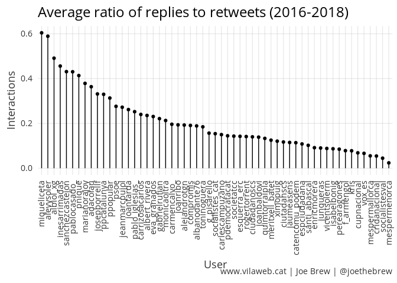

Conclusion
----------

The "Ratio" is a fun metric to analyze, but of questionable scientific value. It reflects the "badness" of a tweet, but "badness" is a function of both (a) the tweet itself and (b) the engagement of the audience. It is a metric grounded in the "wisdom of crowds", but the extent to which crowds are wise - or not - is not entirely clear.

What is clear from this analysis is that among Spanish and Catalan politicians, unionists' tweets are particularly poorly received. Miquel Iceta had the highest ratio of replies-to-retweets, and his party (the PSC) had the tweet with the highest percentage of replies. Sovereigntists, on the other hand, had the most impactful tweet (Junqeras), the most impactful tweeter (Rufian) and - on average - much lower ratios of replies-to-retweets than unionists.

The unionist-independentist divide is not unlike the republican-democratic divide identified by the analysis team at FiveThirtyEight. The below shows tweets from the two main American political parties.

If we compare this with tweets from Catalan and Spanish politicians, we find a similar pattern: like the American Republican party, Spanish unionists (red) tend to have a higher replies-to-retweets ratio and greater likes than retweets, whereas Catalan independentists (blue) - like the American Democratic party - tend to have a lower ratio of replies-to-retweets and more retweets than likes.

Do twitter Ratios really matter? No. But perhaps they are relevant insofar as they touch on an underlying - and only infrequently discussed - subject in Spanish and Catalan politics: *who cares more?*

Much ado is made of the 50-50 union-independence split in Catalonia. But in the case of gridlock, the eventual victor is not necessarily decided by the marginal changes in majorities/minorities, but rather by the extent to which the constituency is *passionate* about the topic. In other words, just because the population is split evenly on an issue does not mean that both sides of the split care evenly about that issue. In the case of Catalan independence, [those in favor of independence are *more interested* in politics than those opposed](https://twitter.com/joethebrew/status/1066744957363474433).

The level of interest in or passion about a topic matters. And this analysis, as frivolous as it may seem, is consistent with both (a) the higher levels of engagement in politics among independentists and (b) [survey data](https://twitter.com/joethebrew/status/1066030235823554566) in Catlonia showing that unionist politicians are rated more poorly than their independentist counterparts.

So, are Miquel Iceta's tweets so poorly received because they are particularly bad? Probably not. Rather, his tweets get such high rates of replies to retweets because the population which is interested and paying attention is largely opposed to his political views.

### Politician-specific plots

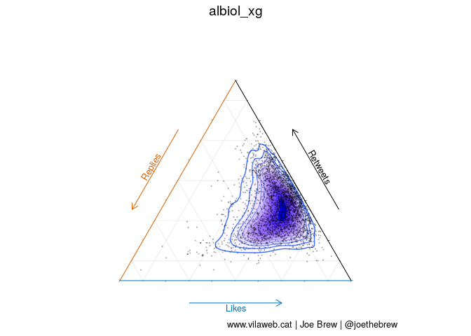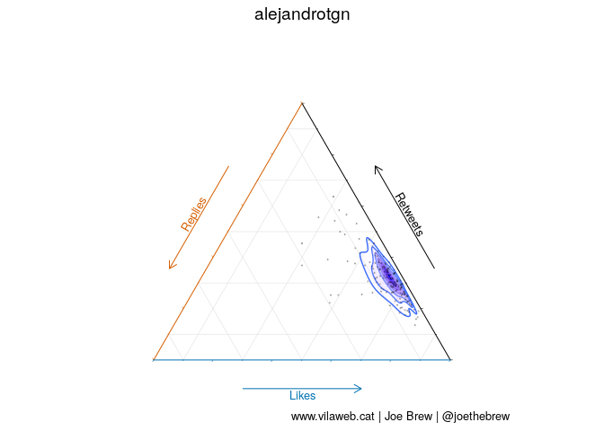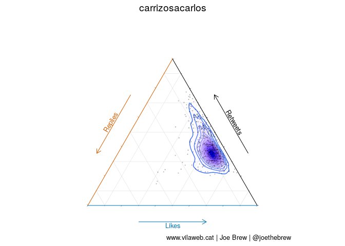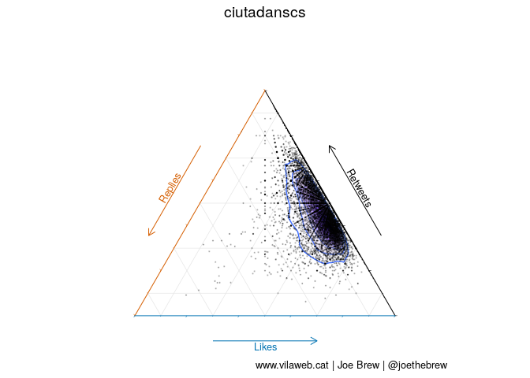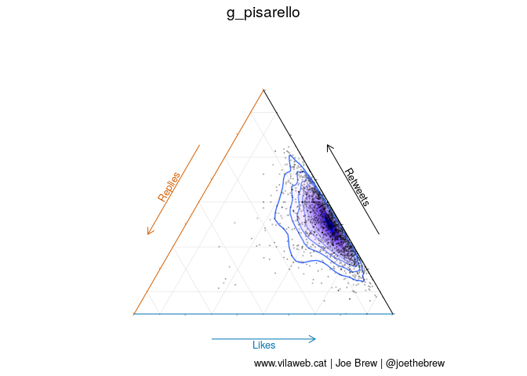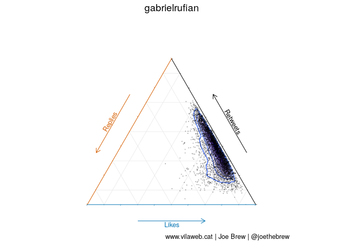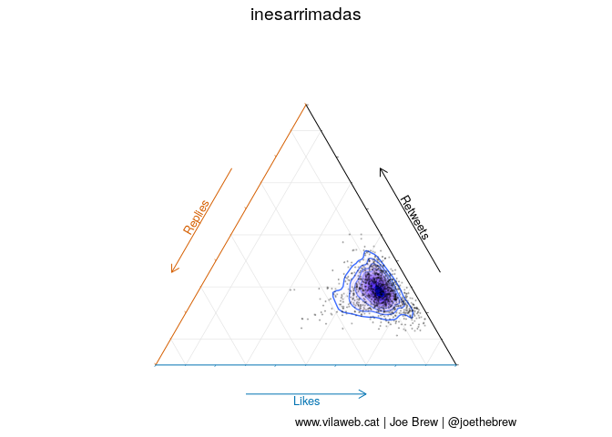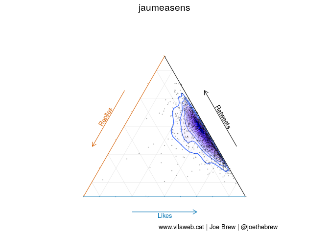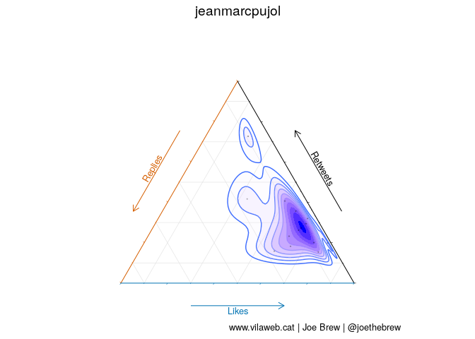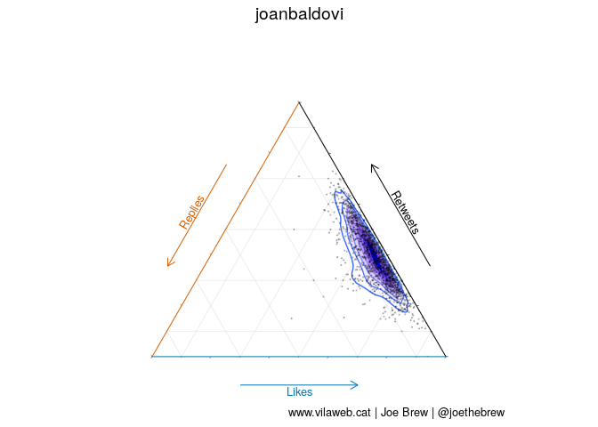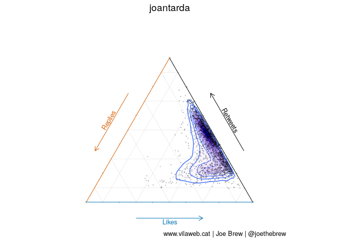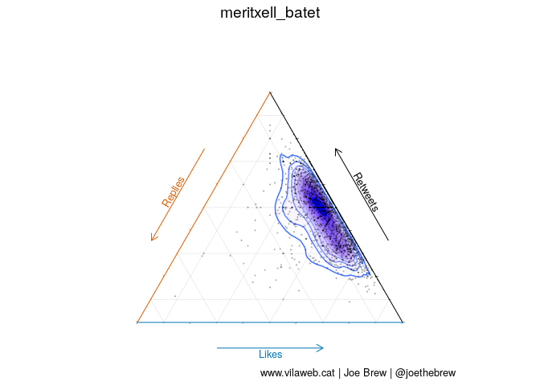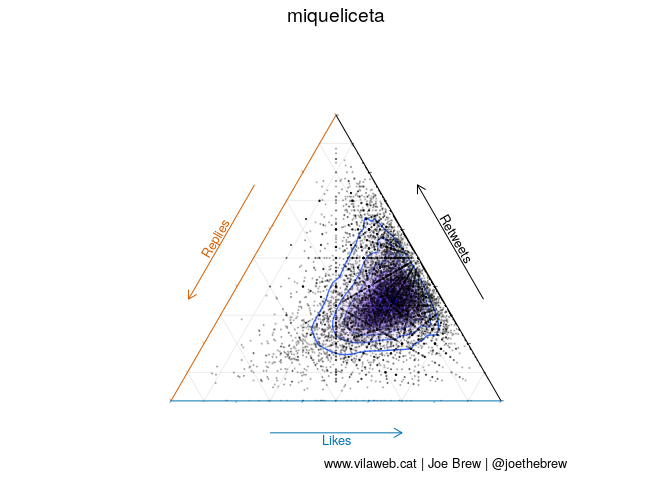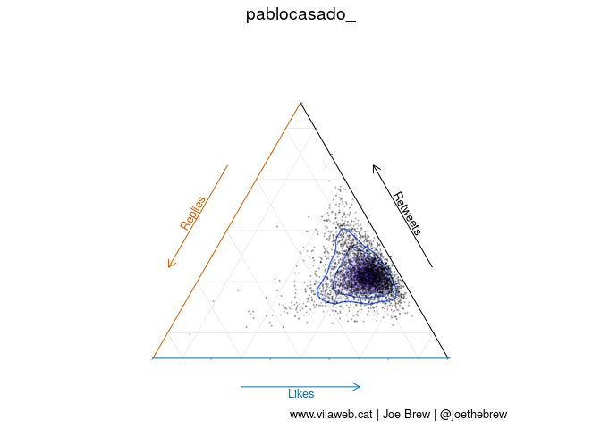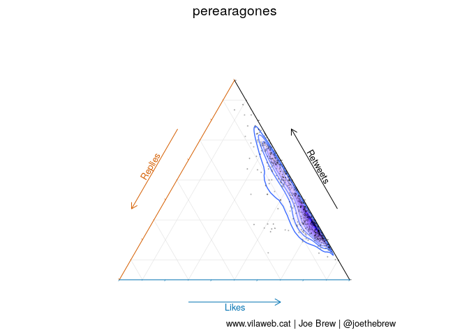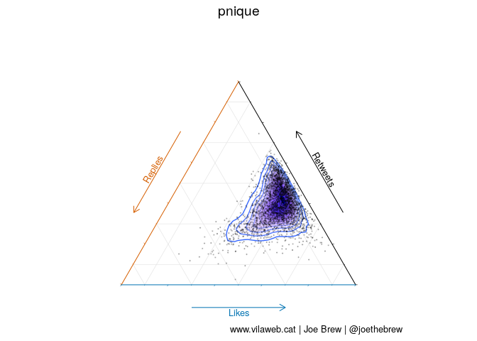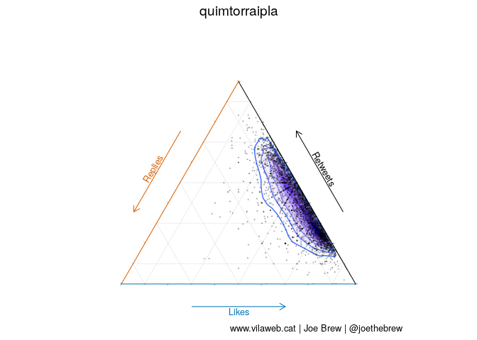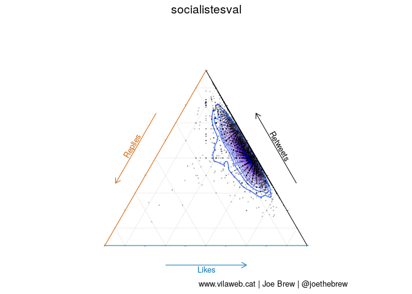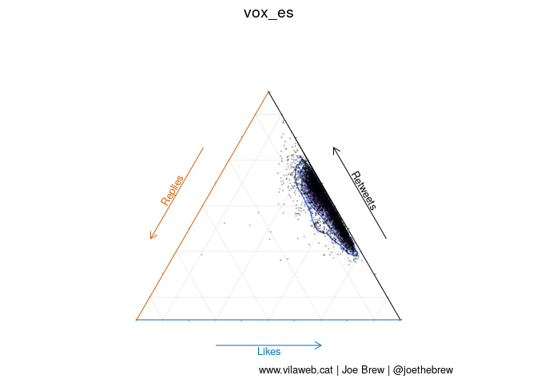

Catalan language plots
----------------------

