Who is Catalonia's worst tweeter?
================

The introduction
----------------

In 2017, Esquire Magazine's Luke O'Neil wrote [an article called "How to Know If You've Sent a Horrible Tweet"](http://www.esquire.com/news-politics/news/a54440/twitter-ratio-reply/). O'Neil argued that "The Ratio" - that is, the ratio of replies to retweets - is the perfect metric for measuring the badness of a tweet. The higher the ratio, the worse the tweet. When a politician writes a particularly offensive or stupid tweet, very few people retweet it, but very many reply to it.

FiveThirtyEight, a data journalism group in the United States, did [an analysis of American politicians' twitter ratio](https://fivethirtyeight.com/features/the-worst-tweeter-in-politics-isnt-trump/) in late 2017. They showed that, despite popular belief, there are American politicians who are even more inept at Twitter than Donald Trump. Hard to believe, but true.

Let's explore "The Ratio" among Catalan politicians.

The Question
------------

Among Catalan and Spanish politicians, who is the "best tweeter" (according to "The Ratio")? And the worst?

The methods
-----------

We gathered tweets for 57 well-known Spanish and Catalan politicians, and calculated tweet-specific reply-to-retweet ratio, as well as a few aggregate statistics. We used all tweets for the three year period from 2016 through 2018, removing those with fewer than 10 retweets.

The results
-----------

The below is a "ternary" diagram showing the overall relationship between replies, retweets, and likes. Each point is a tweet from one of the 57 politicians (ie, 275738 dots). A well-received tweet is situated to the right and top. A poorly received tweet is situated in the bottom left.

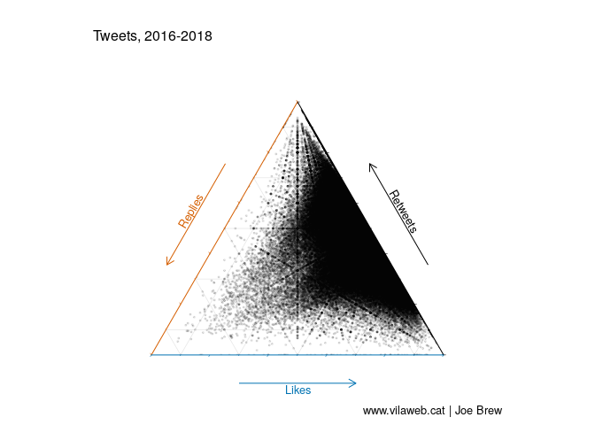

Most tweets are well received; that is, they have a low ratio of replies to retweets. In fact, of the 275738 tweets examined, only 6918 had a ratio of greater than 1 (ie, more replies than retweets) - that's just 2.5%.

### Percent of interactions which are replies

It's hard to make comparisons between politicians on three dimensions, so, let's reduce our analysis to just one. The below chart shows the percentage of all interactions (likes + retweets + replies) which are replies. A high percentage generally indicates a poorly received tweet, and a low percentage generally indicates a well received one.

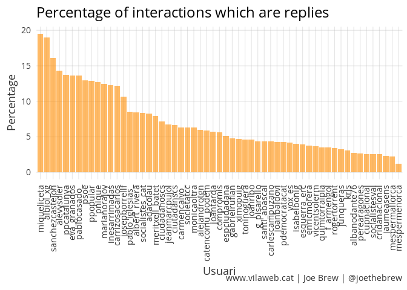

The top spots are dominated by members of mainstream Spanish parties: the Popular Party and the Socialists. The two worst performers are Miquel Iceta (PSC) and Xavier Garcia Albiol (PP), for whom 19.5% and 19% of all interactions are replies, respectively. At the other end of the spectrum, the most well received politician is Jaume Asens, for whom only 2.4% of interactions are replies.

### The most impactful tweet?

Which tweet had the highest total number of interactions in the last 3 years from the politicians in question? That honor goes to Oriol Junqueras whose November 2 2017 (the day he entered prison) tweet garnered 43,096 retweets, 71,033 likes, and 5,950 replies (a total of 120,079 interactions).

### The most impactful tweeter?

The below chart shows the total number of interactions (retweets + replies + likes) between 2016 and 2018 of all politicians examined. Gabriel Rufian is by far the most impactful, followed by Carles Puigdemont.

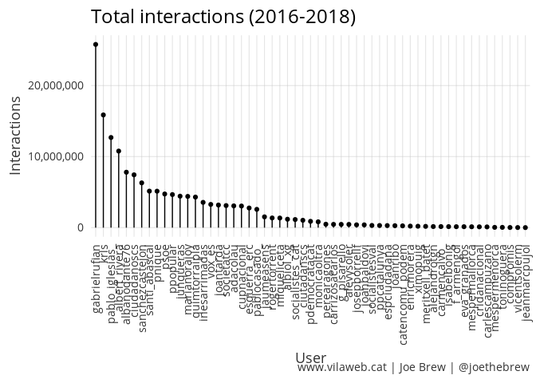

### The "worst" tweet?

Which tweet had the highest number of replies as a percentage of all interactions? The honor goes to the Catalan Socialists whose May 2017 tweet called for a choice to be made between ballots and lunch for children. The tweet had 508 replies, with only 58 retweets and 45 likes (a reply-to-retweet ratio of 8.7).

### A personal note: my worst tweet

Conclusion
----------

### Politician-specific plots

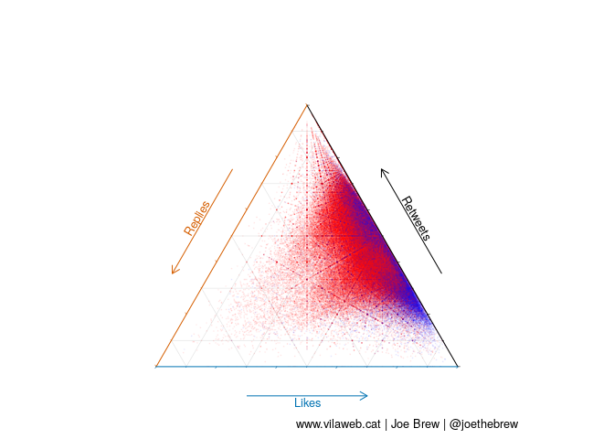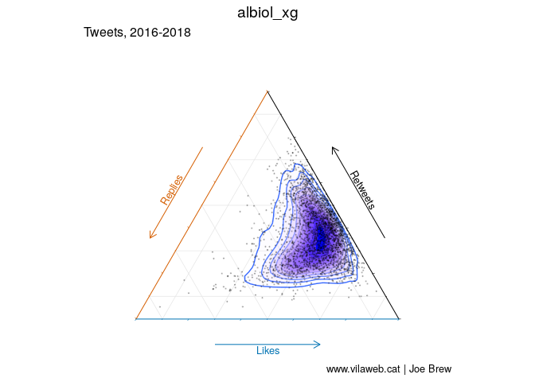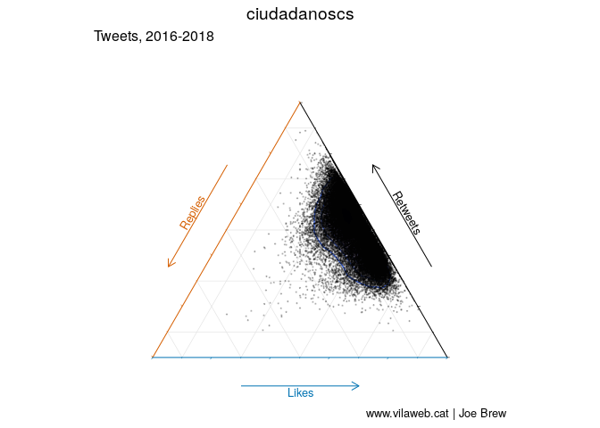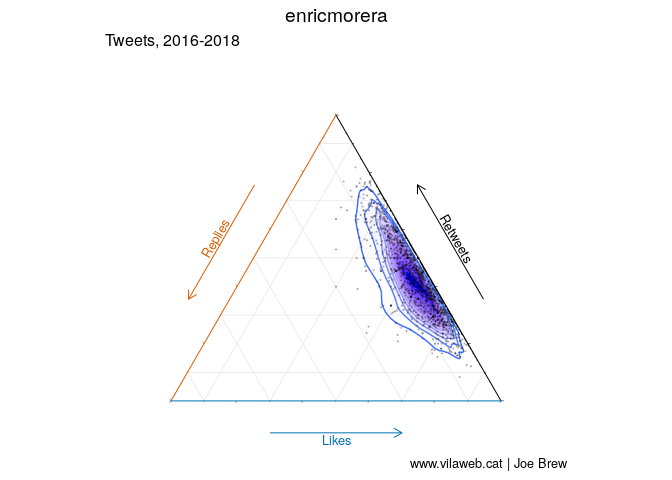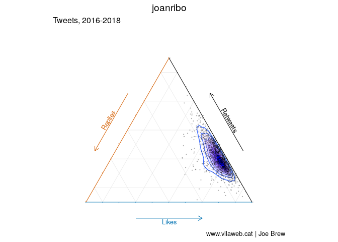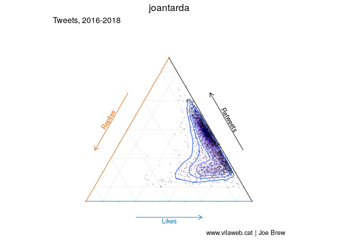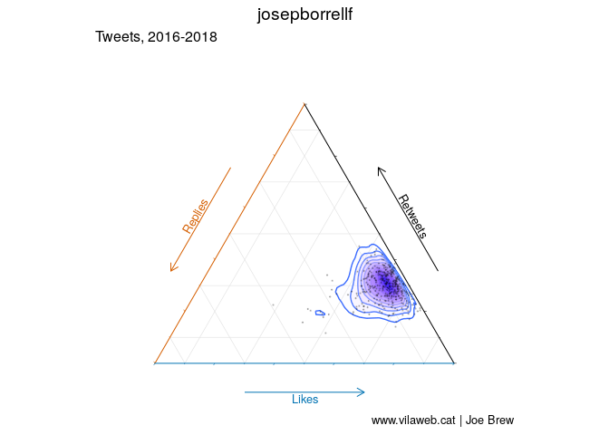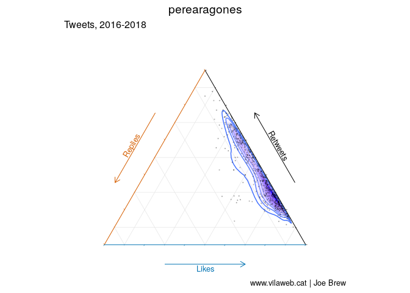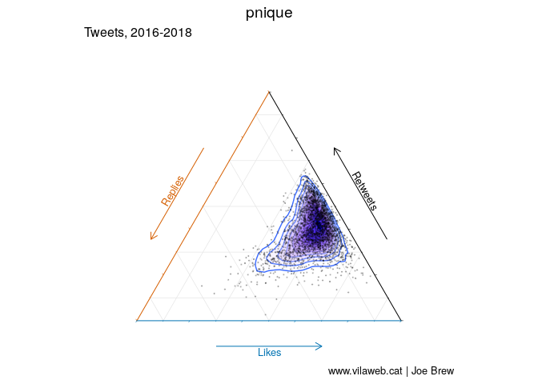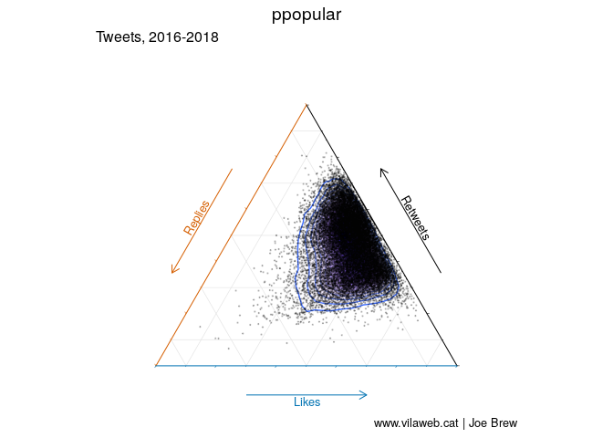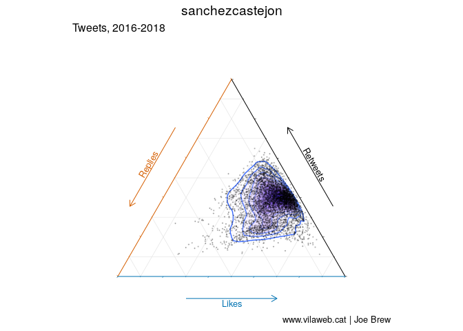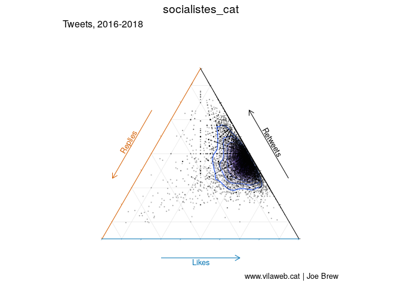

Catalan language plots
----------------------

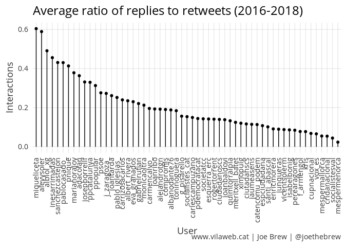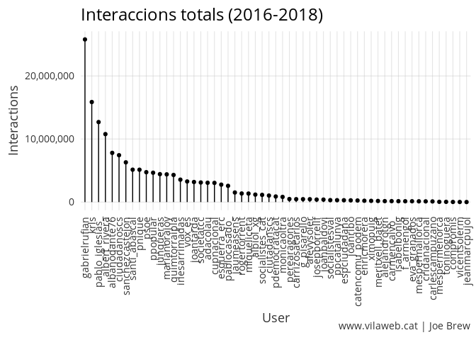

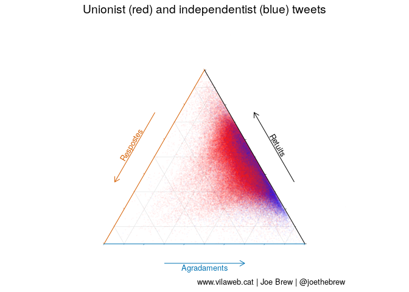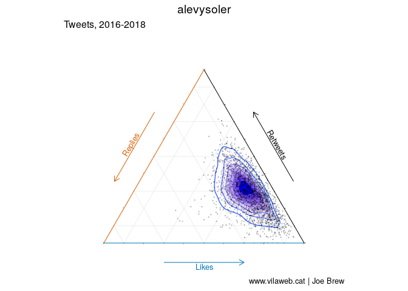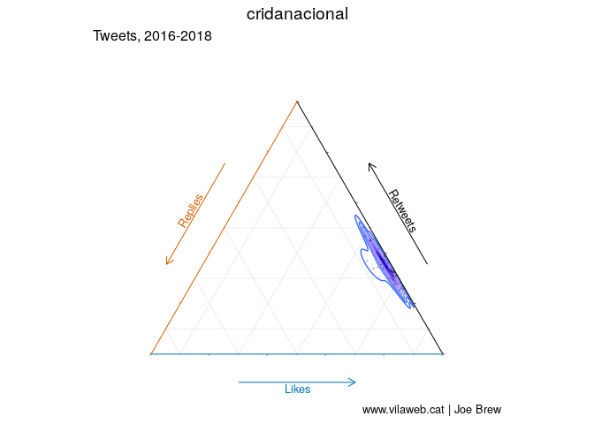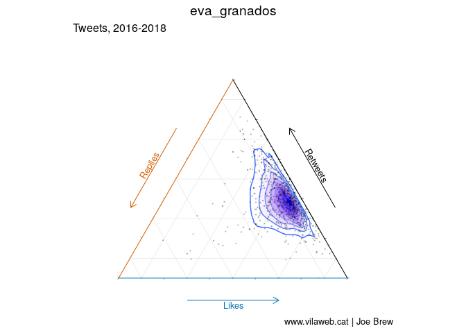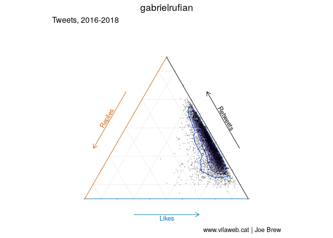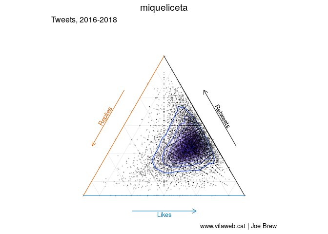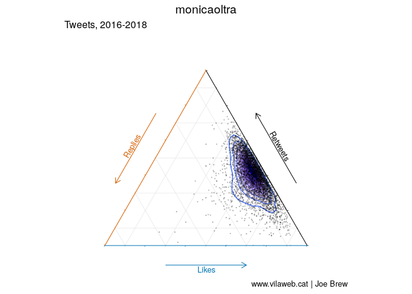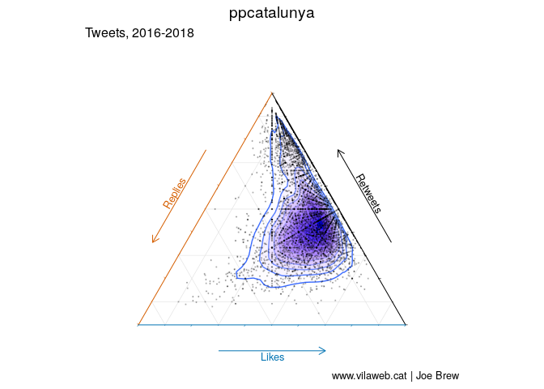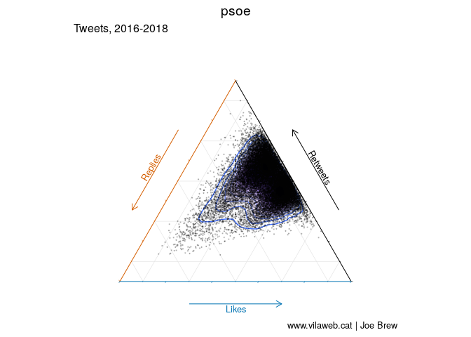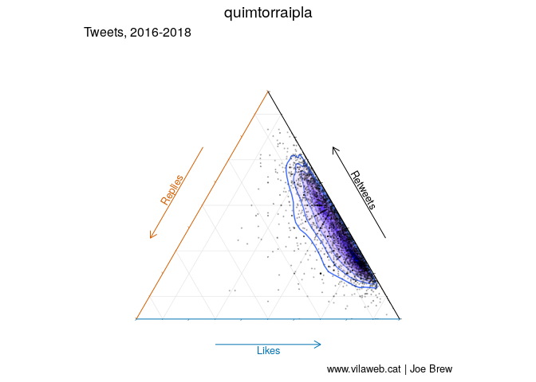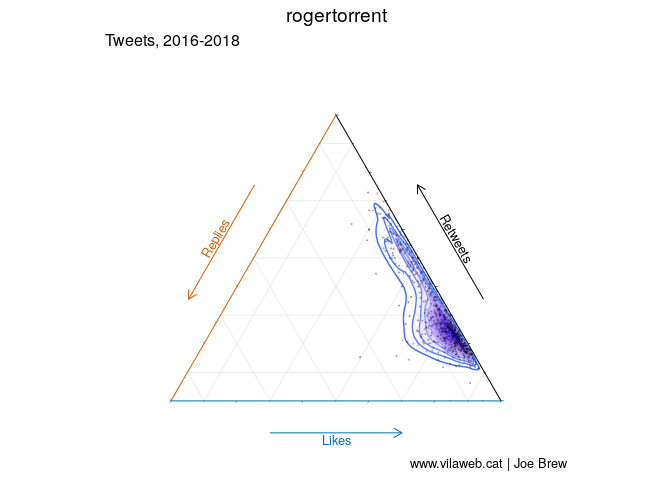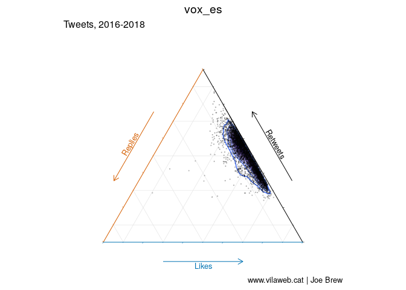
