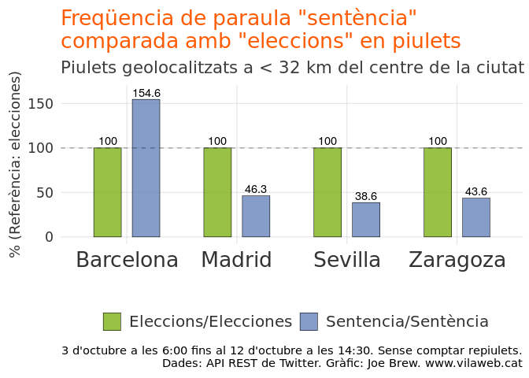
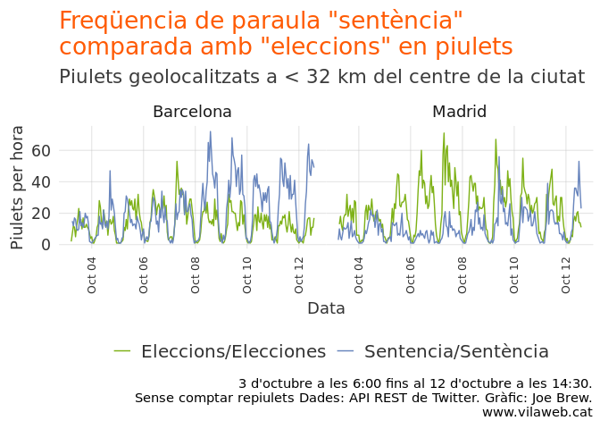

La desconnexió entre Espanya i Catalunya: la sentència i les eleccions
================

# Introducció

Al mes de març vaig escriure un article sobre [la poca atenció que es
feia a l’estat espanyol al judici del
procés](https://www.vilaweb.cat/noticies/desconnexio-espanya-catalunya-judici-eleccions-joe-brew/).
Tot i que fos considerat per molts com el judici més important de la
història de l’estat espanyol, s’en parlava poc fora de Catalunya.

Ara que la sentència està a punt per sortir, i que Espanya està (una
altre vegada) en pre-campanya, és interessant reproduir aquella anàlisi.
És a dir, fins quin punt es parla de la sentència a l’estat espanyol i a
Catalunya? I què en podem deduir de les diferències?

# Metodes

Mirarem tots el piulets geolocalitzats dels últims 10 dies que feien
servir les paraules “sentència” (o sentencia) a 4 ciutats de l’Estat
espanyol: Barcelona, Madrid, Sevilla, Zaragoza (a menys de 32 kilómetres
del centre de la ciutat). Per fer-ne un “control”, comparem-los amb els
tuits de les mateixes zones que contenen la paraula “eleccions” o
“elecciones”.

La hipòtesi és aquesta: si a Catalunya es preocupa pels mateixos temes
polítics que a la resta de l’estat espanyol, ens esperarem que la
propoció de piulets esmentant la sentència i les eleccions serà similar
a les diferents ciutats. En canvi, una diferència en la freqüència de
piulets esmentant la sentència i les eleccions indica una desconnexió
psicològica, i una diferència en la importància relativa que les
persones posen als esdeveniments polítics.

Vegem-ne els resultats

# Resultats

## Tots els piulets dels últims 10 dies

El gràfic següent mostra la diferència entre piulets sobre les
elecciones (vert) i la sentència (blau) en les 4 ciutats examinades. Les
dades han estat ajustades perquè el nombre de piulets sobre les
eleccions sigui la referència (100%) a cada ciutat, de manera que puguem
fer comparacions entre ciutats que no tenen el mateix nombre
d’habitants. És a dir, una barra blava al 100% voldria dir que en
aquella ciutat es fan exactament la mateixa quantitat de piulets sobre
la sentència que sobre les eleccions. Una barra blava més alta de 100%
vol dir que es parla més de la sentència, i una barra blava inferior a
100% vol dir que es parla més de les eleccions.

<!-- -->

Barcelona és la única ciutat on es parla més de la sentència que de les
eleccions. A les altres ciutats, la freqüencia (ajustada) de piulets
sobre la sentència és molt menor. A Madrid, la freqüencia ajustada de
piulets sobre el judici és 3,3 vegades menor que a Barcelona. La bretxa
és encara més a Sevilla (4 vegades menor) i a Zaragoza (3,5 vegades
menor).

La comparació Barcelona-Madrid és la més interessant perquè són de
dimensions més similars i comparteixen un nivell sociodemogràfic més
comparable. Mirem la freqüència de piulets per hora a cada ciutat:

<!-- -->

És clar que, a Madrid, la sentència contra el procés atreu molta menys
atenció que no pas les eleccions. I a Barcelona passa al revés.

# Conclusió

## Resume de resultats

A Catalunya es parla molt més de la sentència que no pas de les
eleccions espanyoles. A la resta de l’estat, es parla més de les
elecciones que no pas de la sentència.

Quan dues poblacions no comparteixen la mateixa opinió sobre la
importància relativa dels esdeveniments polítics, reflecteix una
‘desconnexió’. Els esdeveniments principals d’un lloc ja no es
consideren tan importants a l’altre. La confirmació d’aquesta
desconnexió la podem trobar també, anecdotalment, si donem un cop d’ull
als titulars dels principals diaris de Catalunya i de l’estat: en els
primers, la sentència; en els segons, les eleccions espanyoles.

Tot el codi per aquest análisi és publicament accessible a
<https://github.com/joebrew/vilaweb/tree/master/analyses/sentencia_vs_eleccions>.
