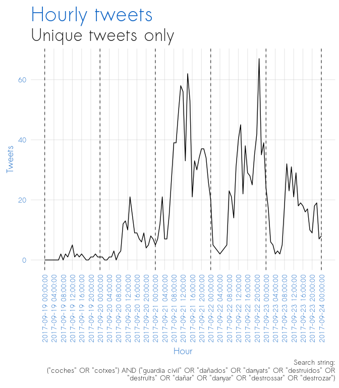
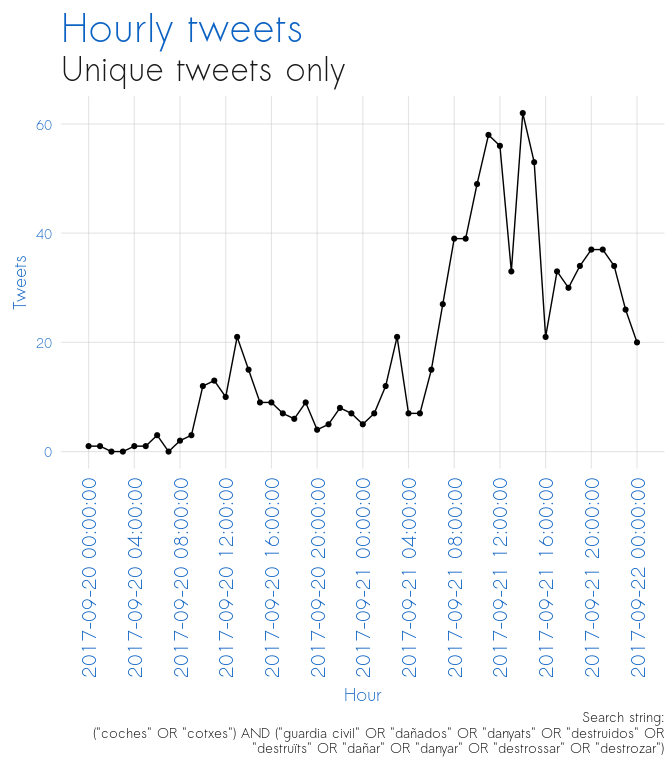
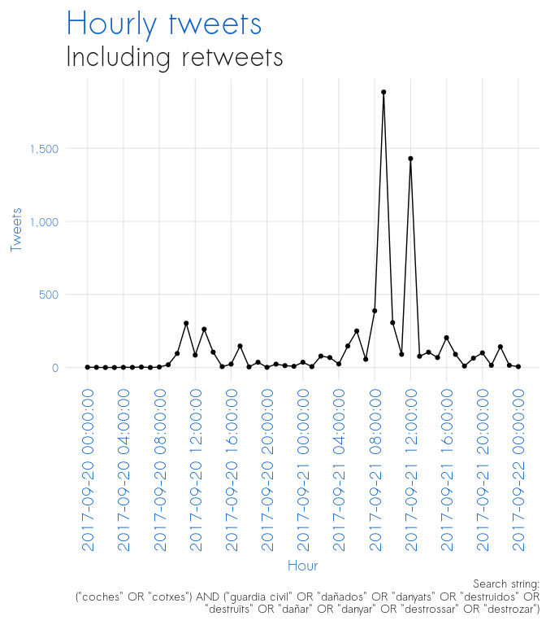
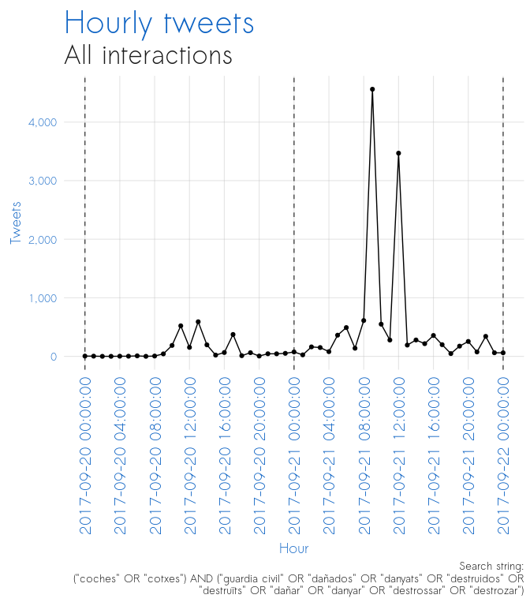

Cotxes
================

-   [Unique tweets](#unique-tweets)
-   [Zoom-in of the above](#zoom-in-of-the-above)
-   [Same as above but including retweets](#same-as-above-but-including-retweets)
-   [Same as above but including all interactions (tweet + number of retweets + number of likes)](#same-as-above-but-including-all-interactions-tweet-number-of-retweets-number-of-likes)
-   [Technical details](#technical-details)

Unique tweets
=============

Zoom-in of the above
====================

Same as above but including retweets
====================================

Same as above but including all interactions (tweet + number of retweets + number of likes)
===========================================================================================

Technical details
=================

-   Data scraped from twtiter on February 21, 2019 using the python twint library.
-   Data processed, aggregated, and visualized using R.
-   The number of retweets and likes are as of date of data retrieval
-   All code for this analysis at <https://github.com/joebrew/vilaweb/tree/master/analyses/sep20/cotxes.Rmd>
