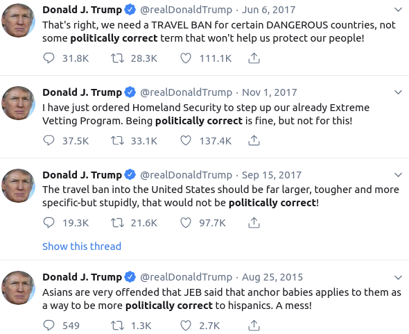
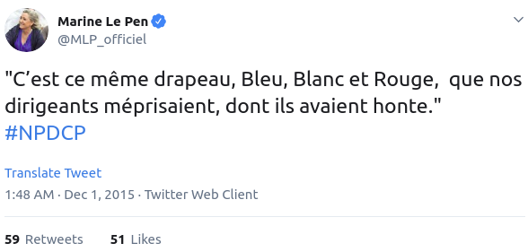
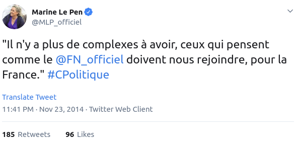
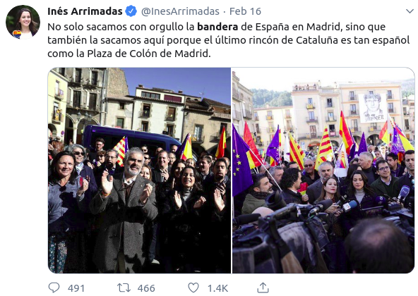
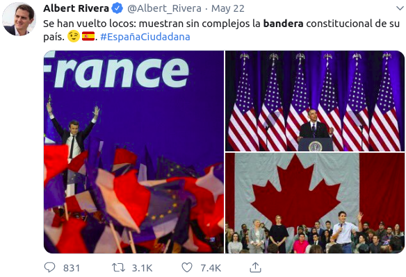
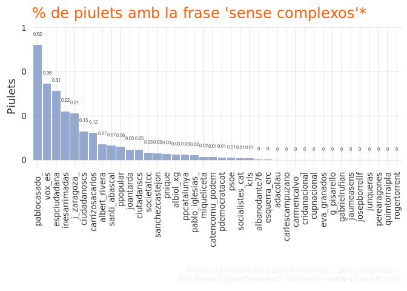
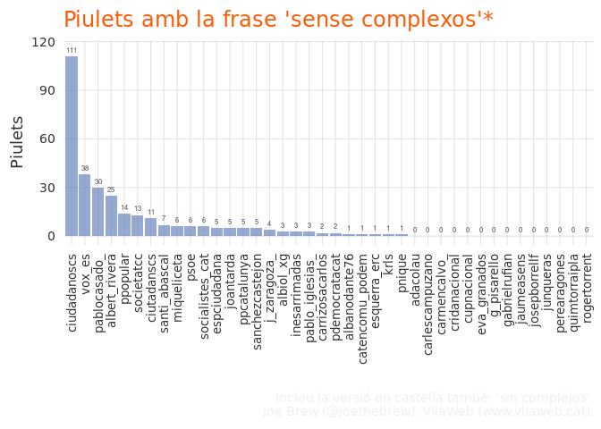
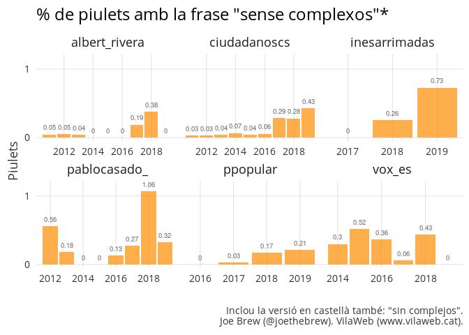
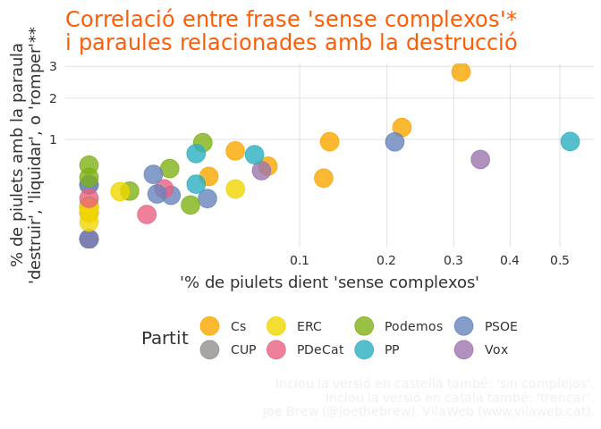
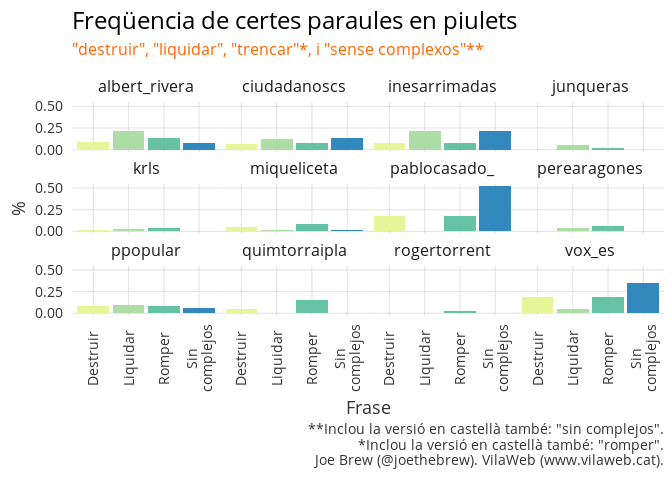

El Sincomplejómetro
================

Els índexs simples
==================

Des de 1986, el Economist publica el seu ['Big Mac Index'](https://en.wikipedia.org/wiki/Big_Mac_Index), una manera informal de mesurar la precisió de la valoració de diferentes monedes. És una mesura còmicament senzilla, gairebé absurda. Es pren la diferència en preu entre un hamburguesa en un pais i un altre, s'ajusta per el tipus de canvi de les monedes respectives segons el mercat, i la diferència que queda representa la infra o sobravaloració de la moneda en qüestió. Una cosa tan senzill per representar un concepte tan complicat.

I si tinguessim un índex senzill pel posicionament ideològic? En proposo un.

El SINCOMPLEJÓMETRO
===================

Les dretes polítiques en molts paisos demostren una obsessió curiosa amb 'els complexos'. Als Estats-Units, per exemple, el Donald Trump (i el partit Republicà en general) porten anys fent una guerra en contre de la 'political correctness'.

<table style="width:100%">
<tr>
    <td></td>
    <td></td>

</tr>
</table>
A França, la Marine Le Pen [critica als dirigents](https://twitter.com/MLP_officiel/status/671419369021431809) polítics per 'tenir vergonya' de la bandera francesa, i diu als seus seguidors que 'ja no cal tenir complexos'.

<table style="width:100%">
<tr>
    <td></td>
    <td></td>

</tr>
</table>
A Catalunya, Inés Arrimadas té un missatge similar sobre el fet de treure la bandera 'amb orgull'. I el líder del seu partit (Ciudadanos), Albert Rivera, també comparteix el desig d'expresar l'orgull nacional 'sense complexos'.

<table style="width:100%">
<tr>
    <td></td>
    <td></td>

</tr>
</table>
Aquesta última frase - 'sense complexos' - em va fer pensar. Els polítics d'esquerres també parlen dels 'complexos'? O és exclusivament proprietat oratoria de la dreta? Que hi ha darrere la obsessió amb els 'complexos' i l'orgull de no tenir-ne? Qui fa servir aquesta frase? I so només és la dreta, pot hi haver una relació qüantitativa - o sigui, quan 'menys' complexos, més a la dreta?

Vaig començar a buscar dades al Twitter. Vaig examinar tots els tweets (680227) dels 40 persones i grups polítics que considero més rellevants a la política catalana actual. Vaig buscar la frase 'sin complejos/sense complexos'. I vaig trobar que, en efecte, la quantitat de tuits amb la frase és una mesura bastant bona del posicionament a l'aix polític esquerra-dreta. Senzill, però bastant precís.

La majoria dels polítics i partits no fan servir la frase gaire. Però, ells que la fan servir, la fan servir molt. Aqui el mateix grafic qu'abans, però en piulets (en lloc de %).

111 'sin complejos' de Ciudadanos! 38 de VOX! 30 de Pablo Casado! Mitja dotzena dels del PSOE, 1 o 2 dels de Convergència, i cap de la CUP.

Em sembla que el sincomplejómetro funciona.

Mes exploració
==============

Examinem, al llarg del temps, els polítics més 'desacomplejados': els del PP, VOX i Ciudadanos. Si el sincomplejómetro funciona bé, hauriem de poder detectar moviments ideologics.

¡Eureka! Habemus índex. El sincomplejómetro reflecteix (a) la deriva a la dreta de Ciudadanos i els seus líders Albert Rivera i Inés Arrimadas, (b) que Vox és on sempre ha sigut - a la extrema dreta, i (c) com el PP competeix amb els altres dos partits mencionats per mantenir la seva predominancia a l'esfera de la dreta.

Aquest índex serveix per alguna cosa? Potser si. A vegades les eines més senzilles són les més útils. De la mateixa manera que una afirmació racista sol començar amb la frase 'no soc racista però...', un polític de dretes sol dir no tenir 'complexos'. I quan un partit o una persona es reposiciona més a la dreta (com ha sigut el cas del PP i de Ciutadans davant el 'reto separatista'), aquest resposicionament s'acompanya una pujada en la freqüència de la insistència de no tenir complexos.

Pel que sembla, tenir 'complexos' és d'esquerres.

### Postdata: Complexos i... destrucció?

Els polítics que no tenen 'complexos' comparteixen també una fascinació amb les paraules relacionades amb la destrucció: 'destruir', 'liquidar', 'trencar', etc. En el gràfic següent, en el qual cada punt és un polític, es demostra la correlació entre el percentage de piulets amb la frase 'sense complexos' i el percentage de piulets cque conté una d'aquestes 3 paraules *destructives*.

La relació és clara: els que més diuen 'sense complexos' (més a la dreta en el gràfic) són els mateixos que més parlen de la destrucció.

Si desagreguem les 3 paraules destructives, es pot observar unes diferències interessants entre els polítics: (i) que els polítics sobiranistes fan servir la paraula 'destruir' a una freqüència molt més baixa que els polítics unionistes i (ii) que la paraula 'liquidar' és molt més freqüent entre els polítics de Ciudadanos que altres partits.

