The demographic 'tic toc' and Catalonia's independence
================

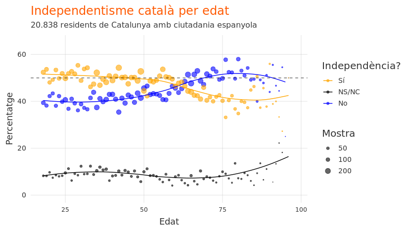

Introduction
============

A year ago, [José Luís Álvarez wrote in El País](https://elpais.com/elpais/2018/02/12/opinion/1518460090_294017.html) about Catalonia's demographic tic-toc ("tic-tac demográfico"). According to Álvarez, Jordi Pujol had designed a social engineering strategy to make indepenence inevitable by replacing old immigrants (largely anti-independence) with young separatists. Álvarez's language and writing is a bit absurd to my taste (he suggests that Pujol was political "maoist" and states that "constitutionalism is morally superior to coup-ism"), and his conclusion (that linguistic immersion was the source of all Catalonia's troubles) is somewhat of a non-sequiteur. But his basic point - that demography and the passing of time ("tic-toc") plays an important role in the Catalonia-Spain political conflict - is true.

In a recent article in the same newspaper, [Joaquím Coll expressed his fear that perhaps Álvarez was right about the demographic tic-toc](https://elpais.com/elpais/2019/05/09/opinion/1557414585_101214.html). Coll (whose opinions I rarely share, but whose writing and intelligence I admire) highlighted the electoral gains of pro-independence Catalan parties in the recent Spanish national elections, noting that most of the left-leaning voters who abandoned the "comuns" party ended up joining the pro-independence bloc. He ends the article, like Álvarez, with a call to action: "si no se empieza a actuar socialmente en una década el secesionismo puede ser mayoritario en las urnas".

The demographic tic-toc which so worries Coll and Álvarez can be summarized simply like this: Catalunya saw high levels of migration from the rest of Spain in the second half of the 20th century; these migrants brought their language and their preference for political unity with Spain; without migrants from the rest of Spain, Catalonia would have a clear pro-independence majority; now fewer migrants are arriving from the rest of Spain, and those that are already in Catalonia are getting old; in a few years, the old will die, and the young (who are far more pro-independence than the old) will replace them; this will push the pro-independence bloc into a clear, consistent majority.

The above is a list of simple facts. How one interprets them is a question of perception. I don't share Coll's diagnosis of changing demography as a threat, nor Álvarez's prognosis that eliminating linguistic immersion would be good for Catalonia or Spain, but I agree with them on the basic facts. Catalonia is changing, demographically, and these changes will have political effects.

Let's explore the facts a bit more.

Independence and age
====================

The last half-decade has seen only small changes in the percentage of Catalans who are for vs. against independence. Surveys generally show pro-independence Catalans to outnumber slightly those that are against, but the margin is small.

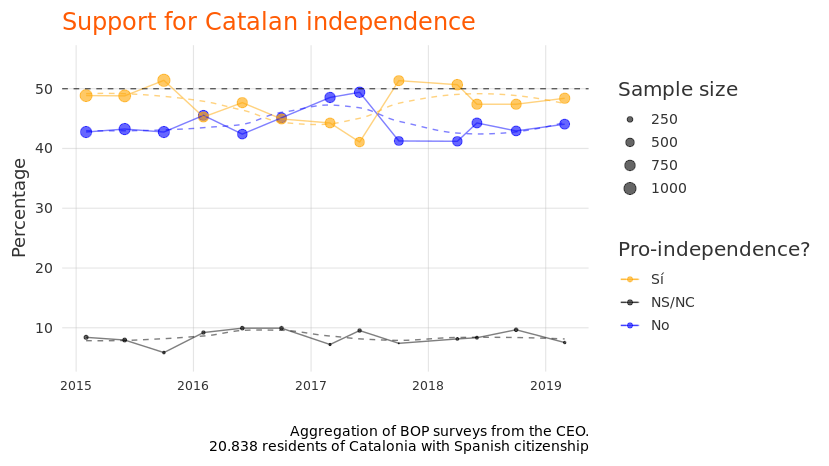

The overall numbers, however, mask significant variation by age. Young Catalans are more in favor of independence and older Catalans are more opposed. In fact, all age groups up until approximately 60 years of age are pro-independence, whereas the 60+ group is anti-independence.

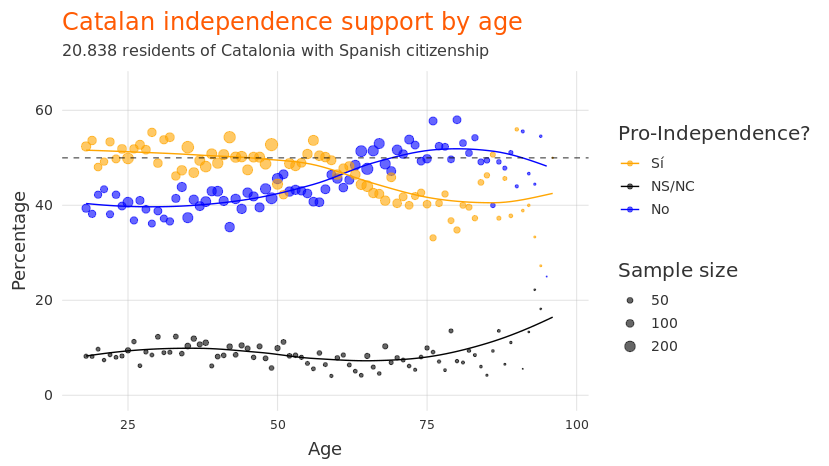

This explains, in part, the age profiles of Catalan political parties. The below chart shows the age-specific probability of expressing the most "sympathy" for each political party. With some exceptions, older Catalans have much higher sympathy for pro-union parties, whereas younger Catalans generally have higher sympathy for pro-independence parties.

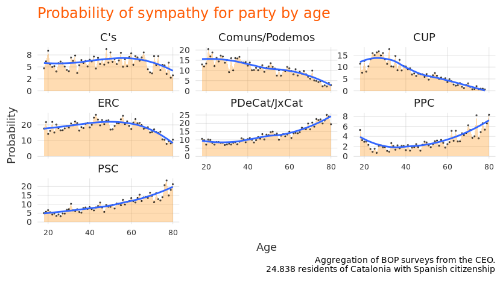

But because of "waves" of immigration to Catalonia, age should not be examined alone. It is intrisically tied up with place of birth.

Independence and place of birth
===============================

Catalans who were born in Catalonia are pro-independence by a rate of nearly 2-to-1. Catalans born elsewhere in Spain are, however, are largely (nearly three-quarters) opposed to independence.

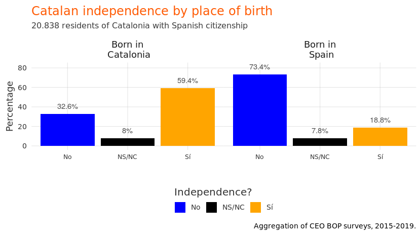

Why is this significant? Because far fewer migrants from the rest of Spain are coming to Catalonia now than decades ago. And those that came decades are growing older. The below plot shows the distribution of Catalonia's population by age and place of birth. Compare the left (the younger generation) with the right (the older generation), and note the difference in colors.

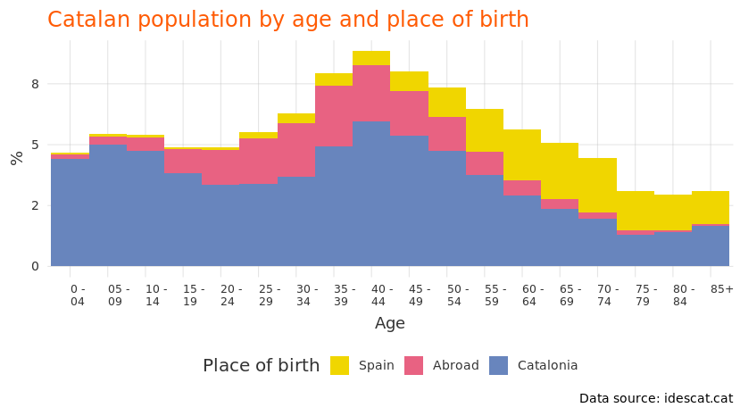

In 10 years, Catalans who are currently aged 8 will be able to vote, and many of the oldest Catalans (the right side of the chart) will, sadly, no longer vote. With every year that passes, the percentage of Catalans that were born in the rest of Spain decreases, the percentage born in Catalonia remains relatively stable, and the percentage born outside of Spain (many who do not have suffrage rights) increases.

Independence and language
=========================

Much of what has been described above simply cannot be changed. Perhaps this is why Álvarez takes aim at language to fix the "separatist problem". Language, like age and place of birth, is closely correlated with views on independence (below chart).

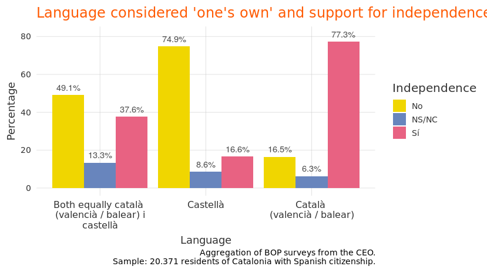

But is the mere consideration of Catalan as one's "own" language really a causal factor in wanting to get independence from Spain? Or is it simply an indicator of birthplace. This is where things get interesting.

The below chart shows Catalans whose first language at home was Spanish (top row) and whose first language at home was Catalan (bottom row). The x-axis is the language considered to be one's own, and the colors indicate feelings on percentages. It's a dense chart, but here's the take-away: there is cross-over!

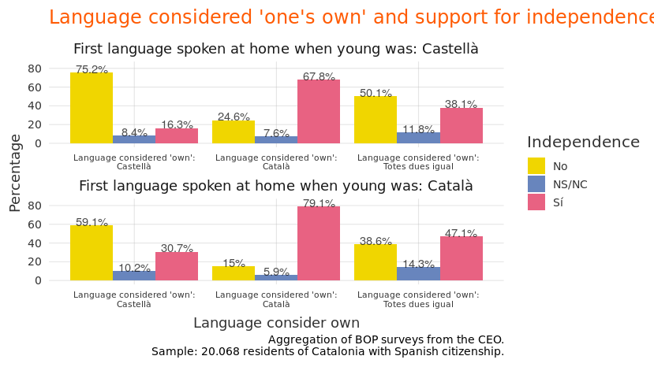

What is cross-over? This means that Catalans who grew up in a Spanish-speaking home (top row), but who consider Catalan to be their "own" language reduce their opposition to independence significantly. By the same token, Catalans who grew up speaking Catalan first (bottom row), but feel that Spanish is their only "own" language, have much more opposed to independence.

How does one interpret this? It's not entirely clear. On the one hand, perhaps there is some confounding variable, not analyzed in this article (very possible). On the other hand, maybe language has an effect on political opinions that goes beyond demography. Maybe making Catalan one's "own" language causally increases support for independence (and, by extension, making Spanish one's "own" language decreases support).

Conclusion
==========

Álvarez and Coll are correct to highlight the importance of demographic change in the Catalonia-Spain conflict. The population is changing in ways which make support for Catalan independence is likely to increase. The age imbalance between pro- and anti-independence Catalans works largely in favor of independence. Unless either (a) a new wave of migration from Spain to Catalonia begins soon or (b) a political or social reform causes those who are born in Catalonia to reduce their support for independence, then the pro-independence bloc will soon have a clear (and ever-growing) majority, and the anti-independence minority will continue to shrink.

Demographics are (mostly) uncontrollable. We cannot stop the aging (and dying) of the old, nor can we prevent the young from becoming adults (and voting). Perhaps it is the uncontrollable nature of demographics that leads Álvarez to conclude that something far more controllable needs to be intervened upon: Catalonia's program of linguistic immersion. And perhaps it is for the same reason - the importance of language to politics - that Coll advocates for "acting socially" (actuar socialmente), rather than politically, to stop independence.

Even if one did consider that independence were "morally" wrong (as Álvarez does), one might still ask if the (questionable) means proposed to stop it - eliminating linguistic immersion - was worth the cost. Fewer than 4 in 10 Catalans use the Catalan language "habitually", whereas virtually all Catalans speak Spanish fluently. Catalan is in danger of extinction. Even if speaking Catalan *causes* pro-independence sentiment, is this a real problem? Is the unity of Spain worth potential linguicide?

Spanish political leadership should face the facts: Catalonia in 2019 is not Catalonia in 1980. The population has changed, the social reality has changed, and preferences for forms of political oranization have changed. Catalan independence, viewed through the lens of demographics, appears very likely. The timeline is hard to estimate (how long can Spain refuse a referendum to a population with a 55% pro-independence majority; 60%?; 65%?), but the outcome may be inevitable.

Catalan-language plots
======================

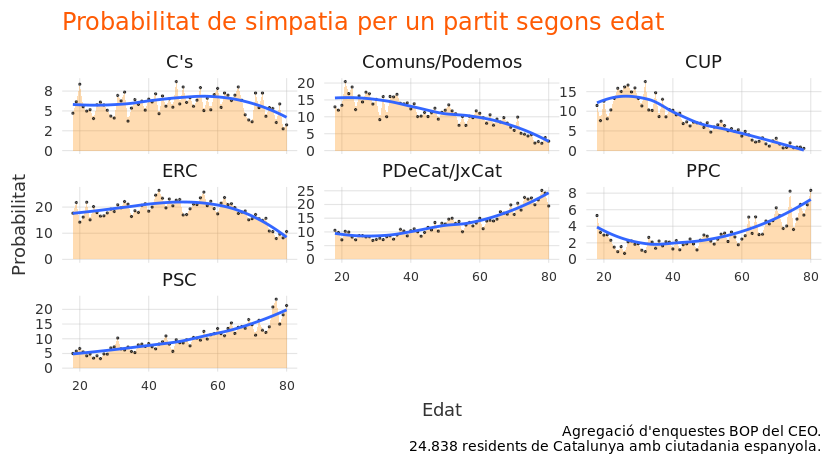

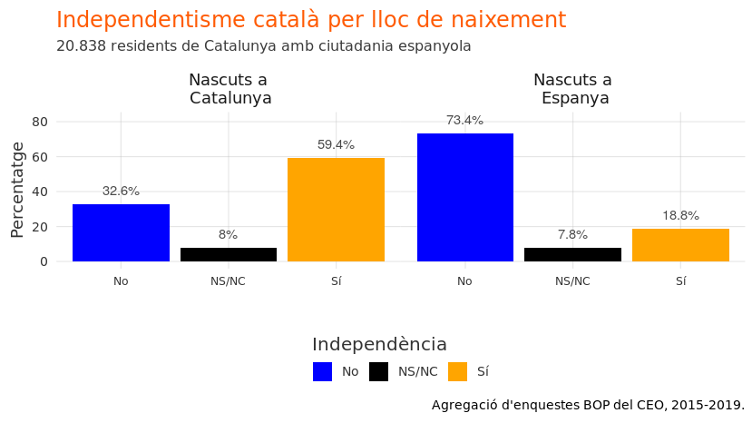

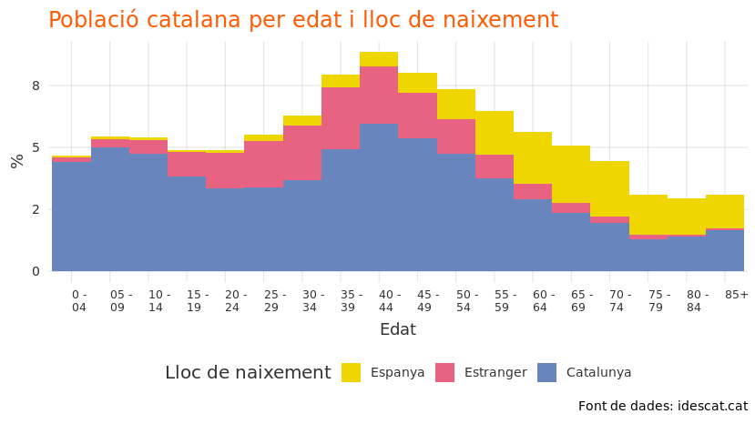

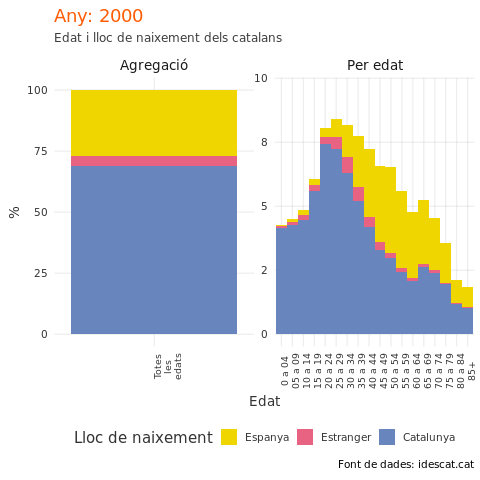

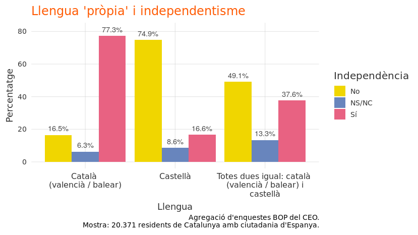

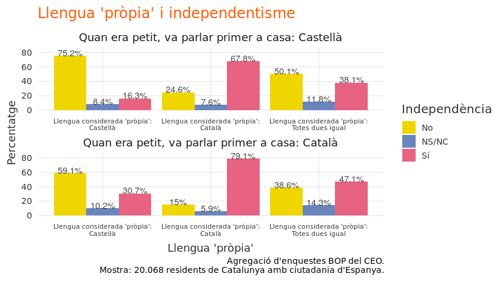
