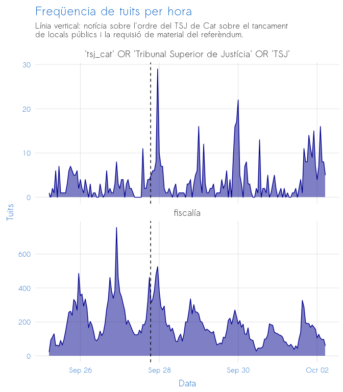
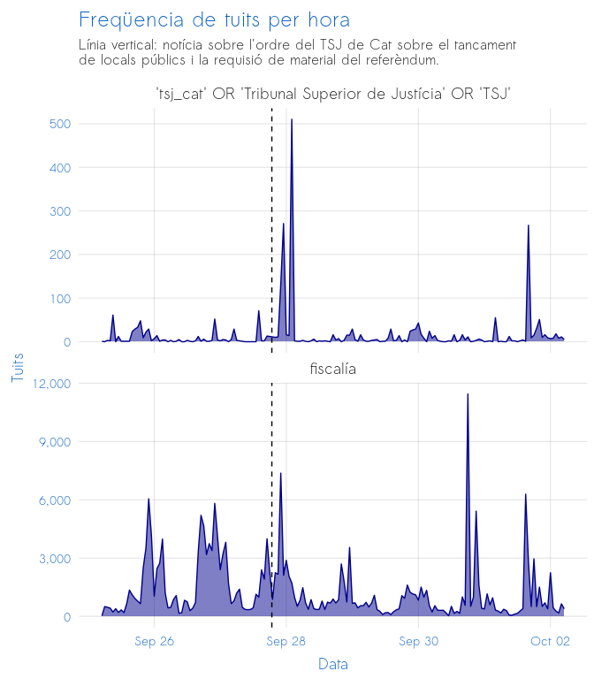

TSJ analysis for Andreu
================

-   [Preguntes](#preguntes)
-   [Mètodes](#mètodes)
    -   [Mètode A](#mètode-a)
    -   [Mètode B](#mètode-b)
-   [Hipòtesi](#hipòtesi)
-   [Resultats](#resultats)
    -   [Resultats A](#resultats-a)
    -   [Resultats B: Piulets de polítics](#resultats-b-piulets-de-polítics)
-   [Conclusió](#conclusió)
-   [Technical details](#technical-details)
-   [Appendix](#appendix)

Preguntes
=========

1.  La ciutadania es va adonar que el TSJ havia ordenat aturar el referèndum?

2.  La ciutadania es va adonar que aquesta ordre aturava les acutacions de la Fiscalía?

Mètodes
=======

Mètode A
--------

Recompte de freqüencia de piulets amb referències al TSJ (pregunta 1) i a la Fiscalía (pregunta 2), fent servir les búsquedes següents:

1.  "'tsj\_cat' OR 'Tribunal Superior de Justícia' OR 'TSJ'"
2.  '"Fiscalía" OR "Fiscalia"

Mètode B
--------

Referències (en piulets) al TSJ i/o la Fiscalía per part de 60 polítics catalans/espanyols de renom.

Hipòtesi
========

Si fossin notoris els fets que el (1) TSJ havia ordenat aturar el referèndum, i (2) que aquesta aturada implicava aturar les actuacions de la Fiscalía, s'esperaria a una pujada en la freqüencia de piulets sobre els dos temas just després de la noticia (a la vespra del 27 i el matí del 27 de setembre).

Resultats
=========

Resultats A
-----------

El gràfic següent mostra la freqüencia de tuits per les dues búsquedes.

El gràfic següent mostra el mateix, però incloent també retuits.

Resultats B: Piulets de polítics
--------------------------------

Vem recollir tots els tuits de 59 comptes de polítics/grups catalans/espanyols coneguts, dels qual 31 són "unionistes", 11 són "sobiranistes" (a favor de la autodeterminació de Catalunya però no la independència) i 17 són "independentistes". Aquests comptes són:

    adacolau
    albanodante76
    albert_rivera
    albiol_xg
    alejandrotgn
    alevysoler
    carlescampuzano
    carmencalvo_
    carrizosacarlos
    catencomu_podem
    ciudadanoscs
    ciutadanscs
    compromis
    cridanacional
    cupnacional
    enricmorera
    espciudadana
    esquerra_erc
    eva_granados
    f_armengol
    g_pisarello
    gabrielrufian
    inesarrimadas
    isabelbonig
    j_zaragoza_
    jaumeasens
    jeanmarcpujol
    joanbaldovi
    joanribo
    joantarda
    josepborrellf
    junqueras
    krls
    marianorajoy
    meritxell_batet
    mespermallorca
    mespermenorca
    miqueliceta
    miriamnoguerasm
    monicaoltra
    pablo_iglesias_
    pablocasado_
    pdemocratacat
    perearagones
    pnique
    ppcatalunya
    ppopular
    psoe
    quimtorraipla
    rogertorrent
    sanchezcastejon
    santi_abascal
    socialistes_cat
    socialistesval
    societatcc
    toninoguera
    vicentsolerm
    vox_es
    ximopuig

La taula següent mostra els 20 tuits d'aquests 59 comptes els dies 27-28 de setembre que feien alguna referència al TSJ o la Fiscalía (búsqueda = "'tsj' OR 'tribunal superior' OR 'fiscal').

| username         | date\_time          | tweet                                                                                                                                                                                                                                                               |
|:-----------------|:--------------------|:--------------------------------------------------------------------------------------------------------------------------------------------------------------------------------------------------------------------------------------------------------------------|
| catencomu\_podem | 2017-09-28 19:27:21 | Dilluns la fiscalia em cità. Una citació intimidatòria, desproporcionada i innecessària, amb un objectiu clar: la por \#Mobilitzemnos28S pic.twitter.com/Pnyo0TnHbt                                                                                                 |
| cupnacional      | 2017-09-27 14:02:08 | L'alcalde de @CUPCelra respon a l'avís de la fiscalia per l'1-O amb un vídeo <http://www.ccma.cat/tv3/alacarta/noticies-324/lalcalde-de-celra-respon-lavis-de-la-fiscalia-per-l1-o-amb-un-video/video/5690868> …                                                    |
| esquerra\_erc    | 2017-09-27 22:14:01 | "Lo que está haciendo la Fiscalía está bastante lejos de lo propio de un estado de derecho normal", explica @toni\_comin                                                                                                                                            |
| esquerra\_erc    | 2017-09-28 08:47:34 | .@toni\_comin: "Jo em faig responsable, de manera que si la Fiscalia en algun moment persegueix els consorcis, els gerents queden protegits"                                                                                                                        |
| esquerra\_erc    | 2017-09-28 11:19:01 | 📢Avui acompanyem @bernatsole, alcalde d’Agramunt, i @david\_drg alcalde de Solsona a la Fiscalia \#LaLlibertatNoEsJutja \#RajoyORepública pic.twitter.com/5gI2I4QH4Q                                                                                                |
| inesarrimadas    | 2017-09-28 16:13:20 | La tensión llega a las aulas: la comunidad educativa dividida, ante las presiones para colaborar en las ilegalidades del govern 👇🏻 <http://www.lavanguardia.com/politica/20170928/431604485796/directores-escuelas-institutos-govern-fiscalia-referendum-1o.html> … |
| jaumeasens       | 2017-09-28 01:29:49 | El TSJC aparta fiscalia de l' 1-O. Ara només falta q declari nul.litat seves actuacions il.legals. <http://www.ccma.cat/324/el-tsjc-ordena-el-tancament-de-locals-o-edificis-publics-on-sestigui-preparant-l1-o/noticia/2811396/#.Wcwwt78JY44.twitter> …            |
| pdemocratacat    | 2017-09-27 09:11:05 | 🎙️\#PresidentMas: "Fiscalia i jutges han de saber que la prioritat, diumenge, no és precintar Catalunya, sinó que no hi hagi aldarulls" pic.twitter.com/oD8dNl0Waa                                                                                                  |
| pdemocratacat    | 2017-09-27 09:40:06 | 🎙 @davidbonvehi a @radio4\_rne: "Creiem que la Fiscalia s'està extralimitant en les seves funcions" pic.twitter.com/UKu3tLtWYz                                                                                                                                      |
| pdemocratacat    | 2017-09-27 11:05:51 | ☑@joanbague: “Tenim 742 alcaldes amenaçats per la fiscalia pel simple fet de posar les urnes a disposició dels ciutadans el proper 1-O 🗳” pic.twitter.com/zsr0AgpRax                                                                                                |
| pdemocratacat    | 2017-09-27 20:16:49 | ☑️ @albertbatet: "Els alcaldes, que han rebut citacions de la Fiscalia, són l'exemple de la fermesa del Tarragonès i de tota Catalunya" pic.twitter.com/GR1hquYP9x                                                                                                  |
| pdemocratacat    | 2017-09-27 20:18:43 | ☑️ @albertbatet: "Davant les amenaces de la Fiscalia ens mantenem ferms al costat de les viles, defensant els drets dels seus ciutadans" pic.twitter.com/nLDaSM0Ydi                                                                                                 |
| ppcatalunya      | 2017-09-27 12:05:49 | ‘Nuestro apoyo a fuerzas de seguridad, jueces, fiscales, funcionarios, alcaldes, concejales y gobierno @marianorajoy’ @Albiol\_XG @Senadoesp                                                                                                                        |
| ppcatalunya      | 2017-09-28 09:20:11 | 'Ver a la presidenta \#Parlament manifestarse en el TSJC vulnera la separación de poderes' @Albiol\_XG en @NewEconomyForum \#TribunaBarcelona pic.twitter.com/igl8swxil6                                                                                            |
| quimtorraipla    | 2017-09-27 19:48:52 | Quin paperàs els fiscals i jutges de Catalunya, mare meva, quin paperàs.                                                                                                                                                                                            |
| santi\_abascal   | 2017-09-27 00:01:06 | Yo, en cambio, puedo imaginar la de Puigdemont y la tuya. De hecho se la hemos pedido al juez en la querella q VOX ha presentado en el TSJC <https://twitter.com/okdiario/status/912781037431934981> …                                                              |
| socialistes\_cat | 2017-09-28 09:16:17 | 📻 @miqueliceta: "L'actuació del fiscal Maza em sembla un horror. Els socialistes el vam reprovar al Congrés, no és apte pel càrrec". @rac1 pic.twitter.com/DJU9aSZ84b                                                                                               |
| societatcc       | 2017-09-27 19:27:55 | La Fiscalia dóna ara instruccions a les policies locals <http://societat.e-noticies.cat/la-fiscalia-dona-ara-instruccions-a-les-policies-locals-112665.html> …                                                                                                      |
| societatcc       | 2017-09-27 20:58:28 | El TSJC cita a ocho testigos por la compra de urnas del referéndum. Jesús García <https://elpais.com/ccaa/2017/09/27/catalunya/1506507559_219296.html> …                                                                                                            |
| societatcc       | 2017-09-27 22:36:14 | Inspectores piden Fiscalía de Menores investigue actos escolares en apoyo 1-0 <http://www.lavanguardia.com/politica/20170927/431597836138/inspectores-piden-fiscalia-de-menores-investigue-actos-escolares-en-apoyo-1-0.html> …                                     |

Conclusió
=========

La notícia sembla haver tingut un impacte relativament menor en Twitter.

-   Tuits fent referència al TSJ no van passar els 30 per hora en cap moment, i cap va tenir més de 600 retuits. Després del matí del 28 (on hi va haver una pujada en retuits), la freqüencia de tuits/retuits sobre el tema van tornar a ser molt baixa.

-   La freqüencia de tuits fent referència a la Fiscalía van ser dins del rang normal els dies 27-28 de setembre.

Technical details
=================

-   Data scraped from twtiter on May 8, 2019 using the python twint library.
-   Data processed, aggregated, and visualized using R.

Data processed on a Linux machine with OS \#49-Ubuntu SMP Wed Feb 6 09:33:07 UTC 2019 at 2019-05-08 20:53:05

Appendix
========

La taula següent mostra TOTS els 1162 tuits d'aquests 59 comptes els dies 27-28 de setembre.

| username          | date\_time          | tweet                                                                                                                                                                                                                                                                                                                                                                                                                 |
|:------------------|:--------------------|:----------------------------------------------------------------------------------------------------------------------------------------------------------------------------------------------------------------------------------------------------------------------------------------------------------------------------------------------------------------------------------------------------------------------|
| adacolau          | 2017-09-27 15:21:05 | La Asamblea de Zaragoza abre una puerta de esperanza: una Cat y una Esp q apuestan x diálogo y x un proyecto compartido. Aquí el manifiesto: <https://twitter.com/catencomu/status/912336916950978561> …                                                                                                                                                                                                              |
| adacolau          | 2017-09-28 08:07:42 | En este artículo pido a la UE mediación en la crisis Cat/Esp. Es una crisis democrática que también afecta a Europa <https://www.theguardian.com/commentisfree/2017/sep/27/europe-must-act-to-protect-rights-and-freedoms-of-catalans> …                                                                                                                                                                              |
| adacolau          | 2017-09-28 09:54:01 | He enviado esta carta a 27 alcaldes de ciudades europeas pidiendo apoyo a la petición de BCN para que la UE se implique en la crisi Cat/Esp pic.twitter.com/wZ4vDQFQAP                                                                                                                                                                                                                                                |
| adacolau          | 2017-09-28 09:55:13 | He enviat aquesta carta a 27 alcaldes de ciutats europees demanant suport a la petició de BCN perquè la UE s'impliqui en la crisi Cat/Esp pic.twitter.com/VxGWMsZrWx                                                                                                                                                                                                                                                  |
| adacolau          | 2017-09-28 11:02:14 | I've sent a letter to 27 European mayors asking them to support our call for the EU to mediate between the Catalan & Spanish governments pic.twitter.com/8HFBw6nzqG                                                                                                                                                                                                                                                   |
| adacolau          | 2017-09-28 14:40:45 | Crec que la gent a qui representeu els @socialistes\_cat està majoritàriament a favor d'un referèndum acordat. Per què vosaltres no? pic.twitter.com/w7ehKyxKAw                                                                                                                                                                                                                                                       |
| adacolau          | 2017-09-28 14:41:59 | Dit això, tots els ciutadans de Catalunya són poble català, però això és una evidència que compartim Miquel ;)                                                                                                                                                                                                                                                                                                        |
| adacolau          | 2017-09-28 18:36:14 | Gràcies @barcelona\_gub per la vostra vocació de servei i per una professionalitat que fa d Barcelona un ciutat més segura i també més humana <https://twitter.com/barcelona_gub/status/913431542533427200> …                                                                                                                                                                                                         |
| adacolau          | 2017-09-28 20:26:40 | Querido Odón, 1. todos los ciudadanos de Catalunya son pueblo de Catalunya. En eso estamos de acuerdo, no tengas ninguna duda.                                                                                                                                                                                                                                                                                        |
| adacolau          | 2017-09-28 20:29:35 | 2 Mi crítica a PSC y PSOE es por su negativa a q trabajemos juntos por un referéndum acordado, como sí querrían muchos votantes socialistas pic.twitter.com/eehX2t6duL                                                                                                                                                                                                                                                |
| albanodante76     | 2017-09-27 09:34:24 | Tot el meu recolzament a la @MontseMoronG. Erradiquem el masclisme de les nostres vides. Denunciant-lo. <http://podemosmataro.info/blog/2017/09/26/regidora-montse-moron-denuncia-insults-difamacions-atacs-masclistes-pp-maresme-pel-suport-participacio-ciutadana-l1/> …                                                                                                                                            |
| albanodante76     | 2017-09-27 09:43:13 | Quedan 4 dias para el 1-O. En @podem\_cat lo tenemos claro: <https://twitter.com/AlbanoDante76/status/905071857300320257> … \#FelizMiercoles                                                                                                                                                                                                                                                                          |
| albanodante76     | 2017-09-27 11:40:34 | Davant la repressió, la censura i l'autoritarisme apostem per espais de trobada i diàleg. Les amenaces no ens fan por. Ens veiem! pic.twitter.com/0JdZeJ2jSG                                                                                                                                                                                                                                                          |
| albanodante76     | 2017-09-27 15:10:53 | "La respuesta de Catalunya". La gente de @Fotomovimiento siempre poniendo la cámara para entender la sociedad. Nos vemos el 1-O. pic.twitter.com/u2L9wlBWR1                                                                                                                                                                                                                                                           |
| albanodante76     | 2017-09-27 21:36:10 | Mientras algunos dicen \#APorEllos nosotros decimos: la lucha del pueblo catalán es la de todos los pueblos hartos de imposiciones. pic.twitter.com/hJ7nfdtMYR                                                                                                                                                                                                                                                        |
| albanodante76     | 2017-09-28 00:15:22 | L'has engantxat!!! L'acomiadem!!😱😂😂😂😂... bueno, no... deu haver tingut un mal día! 😂😂😂😂 pic.twitter.com/1oAGduWqaO                                                                                                                                                                                                                                                                                                    |
| albanodante76     | 2017-09-28 08:03:23 | En todo el mundo, que una banda terrorista entienda que las urnas son la única vía,sería celebrado. Aquí sirve para criminalizar las urnas. pic.twitter.com/3S4YNGApXH                                                                                                                                                                                                                                                |
| albanodante76     | 2017-09-28 15:39:00 | Gracias Antonio por la memoria histórica en forma de ZASCA. pic.twitter.com/NXI7BnMaTR                                                                                                                                                                                                                                                                                                                                |
| albert\_rivera    | 2017-09-27 10:13:20 | Fueron muchos los que defendieron nuestra democracia; no vamos a permitir que unos pocos políticos acaben con nuestros derechos y libertades pic.twitter.com/ae9mWeaboV                                                                                                                                                                                                                                               |
| albert\_rivera    | 2017-09-27 11:54:39 | Ante el hundimiento, todos los demócratas que respetamos el estado de derecho somos 'enemigos' de la patria. Esto es el nacionalismo. <https://twitter.com/oneto_p/status/912953132329635840> …                                                                                                                                                                                                                       |
| albert\_rivera    | 2017-09-28 08:52:53 | 'El referéndum catalán es una burla democrática' | Opinión | Felipe Gonzalez <https://elpais.com/elpais/2017/09/27/opinion/1506533354_370350.amp.html> …                                                                                                                                                                                                                                                              |
| albert\_rivera    | 2017-09-28 12:06:46 | Arrimadas: "Veo factible que el Govern declare la independencia unilateral el miércoles" <http://www.20minutos.es/noticia/3146560/0/arrimadas-veo-factible-govern-declare-independencia-unilateral-miercoles/?utm_source=TwitterApp&utm_medium=Social&utm_campaign=Mobile-web> … vía @20m                                                                                                                             |
| albert\_rivera    | 2017-09-28 12:37:55 | Este es el Director de la Policia de Cataluña puesto por Puigdemont: 'Espero que nos vayamos ya, porque me dais pena todos los españoles'. <https://twitter.com/solercampins/status/790177249513316353> …                                                                                                                                                                                                             |
| albert\_rivera    | 2017-09-28 14:28:43 | Cs, PP y PSOE aprobamos el Pacto Nacional contra la violencia machista, 200 medidas para que miles de mujeres y familias dejen de sufrir. <https://twitter.com/ciudadanoscs/status/913338540536352769> …                                                                                                                                                                                                              |
| albert\_rivera    | 2017-09-28 14:43:20 | Con @AngelesRibes\_68 y el resto de valientes concejales @Cs\_Lleida. Todos los amenazados por defender la democracia en Cataluña sois héroes. pic.twitter.com/hDm64JVlET                                                                                                                                                                                                                                             |
| albert\_rivera    | 2017-09-28 14:49:17 | Un consejero autonómico impidiendo que los Mossos trabajen como policía judicial para la Justicia. Inaceptable que jueguen con la seguridad. <https://twitter.com/catalunyaradio/status/913383848846794752> …                                                                                                                                                                                                         |
| albert\_rivera    | 2017-09-28 14:53:37 | Todo vale en el procés. “Me llamaron desde mi centro de salud para recordarme que tengo que votar en el referéndum" <http://www.cope.es/amp/noticias/herrera-cope/llamaron-desde-centro-salud-para-recordarme-que-tengo-que-votar-referendum_158935> …                                                                                                                                                                |
| albert\_rivera    | 2017-09-28 15:34:33 | La libertad les molesta a los gobernantes fanáticos <http://www.lavanguardia.com/politica/20170928/431615547748/reporteros-sin-fronteras-acoso-independentistas-periodistas.html> …                                                                                                                                                                                                                                   |
| albert\_rivera    | 2017-09-28 16:51:14 | Y no se le ha escapado la risa ni nada, oye. <https://twitter.com/europapress/status/913409109902467072> …                                                                                                                                                                                                                                                                                                            |
| albert\_rivera    | 2017-09-28 21:52:01 | Bravo @Cs\_Andalucia, liderando la unidad constitucionalista para apoyar la democracia española y la legalidad ante el golpe separatista. <https://twitter.com/elmundoes/status/913478865191874566> …                                                                                                                                                                                                                 |
| albert\_rivera    | 2017-09-28 21:58:19 | Cs exige al Gobierno un pacto por escrito plurianual para equiparar sueldos a policías, guardias, mossos y ertzainas <http://m.europapress.es/nacional/noticia-rivera-exige-gobierno-pacto-escrito-equiparar-sueldos-policias-guardias-mossos-ertzainas-cinco-20170928111702.html> …                                                                                                                                  |
| albert\_rivera    | 2017-09-28 22:02:08 | Bravo Convergència y ERC, vuestro golpe a la democracia es un ejemplo a seguir ... para ETA. Sin comentarios. <http://www.elperiodico.com/es/amp/noticias/politica/eta-comunicado-insta-euskadi-iniciar-proceso-derecho-a-decidir-como-catalunya-6313669> …                                                                                                                                                           |
| albiol\_xg        | 2017-09-27 13:49:01 | Muy orgulloso de dos concejales del @PPCatalunya de \#badalona que defendiendo la democracia retiran del ayuntamiento de la CUP una pancarta👏 pic.twitter.com/LC5yXST9f3                                                                                                                                                                                                                                              |
| albiol\_xg        | 2017-09-27 13:57:59 | @JuanFernandezB y @daniel\_gracia felicítalos tú personalmente.                                                                                                                                                                                                                                                                                                                                                       |
| albiol\_xg        | 2017-09-27 15:42:15 | 🔵 Es necesario poner punto y final a la etapa más decadente que están viviendo las instituciones catalanas \#CatalunyaEsEspaña pic.twitter.com/eOSXJKB6IC                                                                                                                                                                                                                                                             |
| albiol\_xg        | 2017-09-28 08:46:17 | 🔜 A las 9:00h ofrezco una conferencia en el @NewEconomyForum. Voy a hablar claro de la situación de Catalunya \#CatalunyaEsEspaña pic.twitter.com/Znhr6A3QS7                                                                                                                                                                                                                                                          |
| albiol\_xg        | 2017-09-28 11:17:01 | Muy agradecido a @NewEconomyForum x permitirme expresar q el domingo nadie celebrará ningún referéndum para romper España \#TribunaBarcelona pic.twitter.com/b8ktOckkbK                                                                                                                                                                                                                                               |
| albiol\_xg        | 2017-09-28 16:29:20 | El PSC @socialistes\_cat no puede seguir, ni un minuto más gobernando en \#badalona con esta gente de la CUP <http://www.elperiodico.com/es/badalona/20170927/la-alcaldesa-de-badalona-anuncia-que-abrira-los-colegios-y-pondra-urnas-6315606> …                                                                                                                                                                      |
| albiol\_xg        | 2017-09-28 17:34:28 | Por sus gestos los conoceréis!!! @lavanguardia <http://www.lavanguardia.com/politica/20170928/431615547748/reporteros-sin-fronteras-acoso-independentistas-periodistas.html?utm_campaign=botones_sociales_app&utm_source=whatsapp&utm_medium=social&utm_campaign=botones_sociales&utm_source=twitter&utm_medium=social> …                                                                                             |
| albiol\_xg        | 2017-09-28 18:43:40 | Con el secretario de estado de seguridad, el delegado del gobierno @EnricMillo y el secretario general del @PPCatalunya @santirodriguez pic.twitter.com/2Qbni274B0                                                                                                                                                                                                                                                    |
| albiol\_xg        | 2017-09-28 19:28:01 | Muchas gracias!                                                                                                                                                                                                                                                                                                                                                                                                       |
| albiol\_xg        | 2017-09-28 20:00:33 | Genial iniciativa de los compañeros del @PPopular \#badalona. Los vecinos con ganas de poder expresarse a favor de la democracia. 👏👏👏 pic.twitter.com/X6dGyFxWH8                                                                                                                                                                                                                                                      |
| alevysoler        | 2017-09-27 09:40:01 | Gracias, Recaredo. Seguimos! Y seguro hay ocasión de verse de nuevo.                                                                                                                                                                                                                                                                                                                                                  |
| alevysoler        | 2017-09-27 11:15:08 | Se questo è un uomo (Vía @elmundoes ) pic.twitter.com/adfx17BmWi                                                                                                                                                                                                                                                                                                                                                      |
| alevysoler        | 2017-09-27 14:15:48 | Game over 👇🏼 <https://twitter.com/LaVanguardia/status/912964814162587648> …                                                                                                                                                                                                                                                                                                                                           |
| alevysoler        | 2017-09-27 16:13:43 | Y es evidente que de democracia saben mucho. Simplemente, repugnante. <https://twitter.com/elmundopv/status/912955918928744448> …                                                                                                                                                                                                                                                                                     |
| alevysoler        | 2017-09-27 17:31:31 | 📹 A pesar del momento de tensión emocional, no permitamos que se quiebre nuestra convivencia. Los mismos no nos convirtamos en diferentes. pic.twitter.com/cNCGh55vc7                                                                                                                                                                                                                                                 |
| alevysoler        | 2017-09-28 16:54:29 | 🔴 Periodistas locales y extranjeros denuncian campañas de ciberacoso en redes sociales y presiones propagandísticas de la Generalitat. <https://twitter.com/RSF_ES/status/913338919130943488> …                                                                                                                                                                                                                       |
| carlescampuzano   | 2017-09-28 23:21:49 | <https://www.facebook.com/carles.campuzano/videos/2644405605595358/> … la meva replica d'ahir al @Congreso\_Es a @Sorayapp \#votarem \#10ctubre                                                                                                                                                                                                                                                                       |
| carrizosacarlos   | 2017-09-27 19:20:25 | Hoy se ha cancelado la Comisión de Interior del Parlament centrada en los atentados del 17A por falta de asistencia de JxSí \#Prioridades <https://twitter.com/parlament_cat/status/913029575822729216> …                                                                                                                                                                                                             |
| catencomu\_podem  | 2017-09-27 10:20:30 | "Hi ha moments en què defensar el sentit comú esdevé un deure." \#Mobilitzemnos Dijous 28, Cotxeres de Sants Aquí 👉 <https://www.facebook.com/events/334576067015477/> … pic.twitter.com/Qcx36kOfd0                                                                                                                                                                                                                   |
| catencomu\_podem  | 2017-09-27 13:07:23 | Pólitica, diàleg, democràcia \#Mobilitzemnos \#HacerCosas @XavierDomenechs, @ierrejon, @Lucia\_\_\_M, @Elisendalamany... 👉 <https://www.facebook.com/events/334576067015477> … pic.twitter.com/F1abflUjaK                                                                                                                                                                                                             |
| catencomu\_podem  | 2017-09-27 13:38:29 | És l'hora de fer cas a Rajoy, és l'hora de \#HacerCosas 👉 <http://hacercosas.cat>  \#Mobilitzemnos pic.twitter.com/Vs5i0eynPL                                                                                                                                                                                                                                                                                         |
| catencomu\_podem  | 2017-09-27 13:54:11 | El 80% de la població de Catalunya vol \#HacerCosas 👉 <http://hacercosas.cat>  \#Mobilitzemnos pic.twitter.com/h2hVx7hgns                                                                                                                                                                                                                                                                                             |
| catencomu\_podem  | 2017-09-27 17:46:55 | Ara que res és com sempre, ens hem de mobilitzar com mai \#Mobilitzemnos \#HacerCosas \#1oct + info 👉 <https://www.facebook.com/events/334576067015477/> … pic.twitter.com/nJBJZOofoF                                                                                                                                                                                                                                 |
| catencomu\_podem  | 2017-09-27 18:11:48 | Si vols \#HacerCosas i \#Mobilitzemnos, el primer pas és seguir el nostre canal de @telegram 😉 Clica aquí 👇  <https://t.me/CatComu>                                                                                                                                                                                                                                                                                   |
| catencomu\_podem  | 2017-09-27 19:55:02 | Avui prendre lliurament la paraula per defensar el dret a trobar-nos a carrers i places pot ser considerat crim d'Estat. \#caputxinada2017 pic.twitter.com/R4otS7ooN1                                                                                                                                                                                                                                                 |
| catencomu\_podem  | 2017-09-27 19:58:24 | Veiem una degradació escandalosa de l'Estat de dret, que afecta a tots i a totes, independentistes i no independentistes. \#caputxinada2017 pic.twitter.com/ns44hY8IVS                                                                                                                                                                                                                                                |
| catencomu\_podem  | 2017-09-27 20:02:16 | Els qui avui intervenen econòmicament la Generalitat són els mateixos que ofeguen els ajuntaments de tot l'Estat \#caputxinada2017 pic.twitter.com/XWryu5DShP                                                                                                                                                                                                                                                         |
| catencomu\_podem  | 2017-09-27 20:04:00 | Ens hem de mobilitzar com mai, amb paperetes, pancartes, cassoles...amb la intel·ligència col·lectiva de la lluita pacífica \#caputxinada2017 pic.twitter.com/lSq8KlhJS3                                                                                                                                                                                                                                              |
| catencomu\_podem  | 2017-09-27 20:06:52 | Som un sol poble, divers i plural, que l'1-O sortirà al carrer per defensar les llibertats \#caputxinada2017 pic.twitter.com/LhHo8EpubO                                                                                                                                                                                                                                                                               |
| catencomu\_podem  | 2017-09-27 20:11:01 | Que l'1O els nostres anhels i esperances puguin més que la por i la intimidació, que ens ajudin a construir un futur juntes \#caputxinada2017 pic.twitter.com/zZre5XfebK                                                                                                                                                                                                                                              |
| catencomu\_podem  | 2017-09-27 21:31:10 | 📺Demà a partir de les 11.30h <l'@AdaColau> intervindrà a @elsmatins. Ho podreu veure en directe a 👉 <http://www.ccma.cat/tv3/directe/tv3/> … pic.twitter.com/djuyBf3QQS                                                                                                                                                                                                                                               |
| catencomu\_podem  | 2017-09-28 09:52:20 | 📰 "Europe must act to protect the rights and freedoms of Catalans" @AdaColau escriu avui al @guardian 👇 <https://www.theguardian.com/commentisfree/2017/sep/27/europe-must-act-to-protect-rights-and-freedoms-of-catalans> …                                                                                                                                                                                          |
| catencomu\_podem  | 2017-09-28 10:40:37 | 📰 \[CATALÀ\] "Europa ha de protegir els drets i les llibertats dels catalans" @AdaColau al @guardian 👇 <http://www.rac1.cat/programes/el-mon/20170928/431609321056/ada-colau-demana-a-europa-que-actui-en-el-conflicte-entre-catalunya-i-espanya.html> …                                                                                                                                                              |
| catencomu\_podem  | 2017-09-28 10:44:51 | 📝 Carta que ha enviat @AdaColau a 27 alcaldes de ciutats europees 👇 <https://twitter.com/AdaColau/status/913311118126403584> …                                                                                                                                                                                                                                                                                        |
| catencomu\_podem  | 2017-09-28 10:54:43 | ⏰ 11.30 h 📺 @AdaColau a @elsmatins de @tv3cat \#ElsMatinsTV3 🔴 Segueix-ho aquí 👉 <http://www.ccma.cat/tv3/directe/tv3/> … pic.twitter.com/7Oxwr4jHdC                                                                                                                                                                                                                                                                  |
| catencomu\_podem  | 2017-09-28 11:27:50 | 🔴 DIRECTE @AdaColau a @elsmatins de @tv3cat 📺 \#ElsMatinsTV3 No t'ho perdis❗️És aquí 👉 <http://www.ccma.cat/tv3/directe/tv3/> … pic.twitter.com/npNd5eRmny                                                                                                                                                                                                                                                            |
| catencomu\_podem  | 2017-09-28 11:30:23 | "Hi ha un salt qualitatiu en els últims dies, ja no és un conflicte territorial, sinó que hi ha hagut una retallada de drets" \#ElsmtinsTV3 pic.twitter.com/EOIndGZhBZ                                                                                                                                                                                                                                                |
| catencomu\_podem  | 2017-09-28 11:31:58 | "I el projecte europeu justament es va crear per garantir els drets fonamentals, així que ja no és només un conflicte intern" \#ElsMatinsTV3 pic.twitter.com/760ayofaM4                                                                                                                                                                                                                                               |
| catencomu\_podem  | 2017-09-28 11:35:56 | "La fortalesa de projectes comuns es visibilitza en els moments difícils, i ara té més sentit que mai que la UE es pronunciï" \#ElsMatinsTv3 pic.twitter.com/xj0MFABi9b                                                                                                                                                                                                                                               |
| catencomu\_podem  | 2017-09-28 11:37:23 | "Ens trobem en una situació d'excepció, amb l'autogovern intervingut, i el primer que hem de fer és revertir això" \#ElsMatinsTV3 pic.twitter.com/AXzrDS2GU0                                                                                                                                                                                                                                                          |
| catencomu\_podem  | 2017-09-28 11:39:40 | "L'1-O serà una mobilització massiva, exemplar, per dir que no permetrem aquesta retallada de drets i llibertats" \#ElsMatinsTV3 pic.twitter.com/CRXSMOFyt2                                                                                                                                                                                                                                                           |
| catencomu\_podem  | 2017-09-28 11:41:37 | "Més del 80% de la població vol que es faci un referèndum efectiu, hem de seguir-hi treballant" \#ElsMatinsTV3 pic.twitter.com/mJs7T7xaHx                                                                                                                                                                                                                                                                             |
| catencomu\_podem  | 2017-09-28 11:44:37 | "A Saragossa vam plantejar la necessitat de buscar una sortida negociada, amb aliances a tot arreu" \#ElsMatinsTV3 pic.twitter.com/XNFQl5VYEg                                                                                                                                                                                                                                                                         |
| catencomu\_podem  | 2017-09-28 11:51:26 | "On és el PSC que defensava el dret a decidir? S'alinearà amb la deriva autoritària del PP?" \#ElsMatinsTV3 pic.twitter.com/NGoK0XeV21                                                                                                                                                                                                                                                                                |
| catencomu\_podem  | 2017-09-28 11:56:15 | "He traslladat la meva voluntat de facilitar la participació, però també de preservar la institució" \#ElsMatinsTV3 pic.twitter.com/D911UZ7gKb                                                                                                                                                                                                                                                                        |
| catencomu\_podem  | 2017-09-28 12:00:01 | "La comunitat educativa té i tindrà tot el suport de l'Ajuntament" \#ElsMatinsTV3 pic.twitter.com/HAaxDWWAFK                                                                                                                                                                                                                                                                                                          |
| catencomu\_podem  | 2017-09-28 12:02:52 | "El que estem veient són senyals de feblesa. Quan només et queda el llenguatge de l'amenaça i la por, estàs perdent força" \#ElsMatinsTV3 pic.twitter.com/fzmbf2Xjbx                                                                                                                                                                                                                                                  |
| catencomu\_podem  | 2017-09-28 12:34:56 | "Ara que res és com sempre, \#Mobilitzemnos com mai" 🔴 ENS VEIEM AQUESTA TARDA Fem que corri🚲 el cartell 👇 Comparteix❗ <https://www.facebook.com/events/334576067015477> … pic.twitter.com/T8tLP6GUOD                                                                                                                                                                                                                 |
| catencomu\_podem  | 2017-09-28 12:44:15 | Per l'avortament legal i segur, avui \#28S dia d'acció mundial per la despenalització de l'avortament. \#Nosaltresdecidim                                                                                                                                                                                                                                                                                             |
| catencomu\_podem  | 2017-09-28 13:30:58 | Gràcies pel teu compromís amb la democràcia en un moment difícil per Catalunya. Esperem que no tinguis rovellat el català ;)                                                                                                                                                                                                                                                                                          |
| catencomu\_podem  | 2017-09-28 14:52:38 | 📺 "El projecte europeu té l'oportunitat per demostrar que té l'autoritat per defensar un marc de convivència comú i mediar en el conflicte" pic.twitter.com/MBNbIdACsf                                                                                                                                                                                                                                                |
| catencomu\_podem  | 2017-09-28 18:09:06 | Gràcies pel teu suport @OwenJones84! Aquesta tarda ens acompanyaran més suports internacionals \#Mobilitzemnos 👉 <https://www.facebook.com/events/334576067015477/> … <https://twitter.com/OwenJones84/status/913429428922970112> …                                                                                                                                                                                   |
| catencomu\_podem  | 2017-09-28 18:16:37 | A threat to rights anywhere is a threat to rights everywhere! Thanks, mate ;) \#Mobilitzemnos                                                                                                                                                                                                                                                                                                                         |
| catencomu\_podem  | 2017-09-28 19:15:43 | 🔴 COMENCEM a Cotxeres!!! Segueix-nos en directe amb l'etiqueta \#Mobilitzemnos28S pic.twitter.com/sumHFCo25d                                                                                                                                                                                                                                                                                                          |
| catencomu\_podem  | 2017-09-28 19:18:18 | "Gràcies per venir a compartir idees i reflexions, i gràcies a aquelles que veniu, vindreu o intervindreu des de lluny" \#Mobilitzemnos28S pic.twitter.com/gh2SUkTNcK                                                                                                                                                                                                                                                 |
| catencomu\_podem  | 2017-09-28 19:20:49 | Hem de mobilitzar-nos, hem de \#HacerCosas. Mostrar el rebuig frontal al PP, a l'autoritarisme i a l'atac frontal als drets \#Mobilitzemnos28S pic.twitter.com/8Rn14qRmkL                                                                                                                                                                                                                                             |
| catencomu\_podem  | 2017-09-28 19:22:37 | Si una cosa vam aprendre al 15M i a la PAH és que hi ha moments en que defensar el que és de sentit comú \#Mobilitzemnos28S pic.twitter.com/pqPVFWrbKV                                                                                                                                                                                                                                                                |
| catencomu\_podem  | 2017-09-28 19:22:50 | 📹 VÍDEO I @papadimoulis: "Europa ha d'apostar per la democràcia, la llibertat d'expressió, llibertat d'elecció i diàleg" \#Mobilitzemnos28s pic.twitter.com/eA4BaJoGZd                                                                                                                                                                                                                                                |
| catencomu\_podem  | 2017-09-28 19:27:21 | Dilluns la fiscalia em cità. Una citació intimidatòria, desproporcionada i innecessària, amb un objectiu clar: la por \#Mobilitzemnos28S pic.twitter.com/Pnyo0TnHbt                                                                                                                                                                                                                                                   |
| catencomu\_podem  | 2017-09-28 19:28:58 | Som i serem allò que democràticament els homes i dones de Catalunya decidim. De res serviran amenaces \#Mobilitzemnos28s pic.twitter.com/JEtQQwkRV6                                                                                                                                                                                                                                                                   |
| catencomu\_podem  | 2017-09-28 19:32:20 | Volem un país lliure d'imposicions i corrupció, més just i millor. Un país construit des dels nostres pobles i ciutats \#Mobilitzemnos28S pic.twitter.com/p7SeL0ZrdV                                                                                                                                                                                                                                                  |
| catencomu\_podem  | 2017-09-28 19:35:50 | Avui tenim l'obligació de recordar-li al Sr Rajoy: els nostres drets i llibertats no es toquen \#Mobilitzemnos28S pic.twitter.com/2nVhIwvqKX                                                                                                                                                                                                                                                                          |
| catencomu\_podem  | 2017-09-28 19:36:54 | L'1O us demano que sortiu amb el somriure al carrer, i que tingueu la força i la il.lusió de que el futur és nostre \#Mobilitzemnos28S pic.twitter.com/z1hOPzfylU                                                                                                                                                                                                                                                     |
| catencomu\_podem  | 2017-09-28 19:38:16 | 📹 VÍDEO I @SkaKeller: "Estoy muy preocupada por la represión del PP. Lo que se necesita ahora es diálogo entre las 2 partes" \#Mobilitzem-nos pic.twitter.com/qVv6nYfmOB                                                                                                                                                                                                                                              |
| catencomu\_podem  | 2017-09-28 19:39:45 | 📹 VÍDEO I @mmatias\_: "Es muy grave que el PP permanezca cerrado al diálogo en vez de abrirse a soluciones políticas" \#Mobilitzemnos28s pic.twitter.com/rZbEnXn8bM                                                                                                                                                                                                                                                   |
| catencomu\_podem  | 2017-09-28 19:40:07 | Avui participem d'un acte segurament històric, que hem d'afrontar amb determinació i sentit crític \#Mobilitzemnos28S pic.twitter.com/6xivoSQPyH                                                                                                                                                                                                                                                                      |
| catencomu\_podem  | 2017-09-28 19:43:02 | El full d ruta deixa enrere massa gent, pilotat per un partit massa corrupte, amb retallades i q a la tarda vota amb el PP \#Mobilitzemnos28S pic.twitter.com/F0pSg2Np6B                                                                                                                                                                                                                                              |
| catencomu\_podem  | 2017-09-28 19:44:52 | No podem romandre en silenci, aquest atac del PP és contra les llibertats de tothom, i a mig termini contra les més humils \#Mobilitzemnos28S pic.twitter.com/vs8Y3Y1pH8                                                                                                                                                                                                                                              |
| catencomu\_podem  | 2017-09-28 19:46:19 | Aquesta gent que considera sedició protestar al carrer, demà considerarà sedició una vaga o una manifestació \#Mobilització28S pic.twitter.com/A1wegvnpu6                                                                                                                                                                                                                                                             |
| catencomu\_podem  | 2017-09-28 19:47:21 | 📹 VÍDEO I @MarinaAlbiol: "Ens situem al costat de la democràcia i del dret a decidir front a un Govern del PP repressor" \#Mobilitzemnos28s pic.twitter.com/AQN0TWNV1L                                                                                                                                                                                                                                                |
| catencomu\_podem  | 2017-09-28 19:49:10 | Ens mobilitzem i agraïm el suport de la brigada internacional escandalitzada amb la repressió del PP contra Catalunya \#Mobilitzemnos28S pic.twitter.com/aBrEVnGPD3                                                                                                                                                                                                                                                   |
| catencomu\_podem  | 2017-09-28 19:51:47 | 📹 VÍDEO I @yanisvaroufakis. "Està clar que el pitjor enemic de la unitat d'Espanya és el Govern del PP" \#Mobilitzemnos28s pic.twitter.com/Llfl30jH03                                                                                                                                                                                                                                                                 |
| catencomu\_podem  | 2017-09-28 19:51:53 | Els i les comuns cridem a la mobilització amb fermesa i amb por de que l'imposició del PP sortís endavant \#Mobilització28S pic.twitter.com/0HgX2W0Svl                                                                                                                                                                                                                                                                |
| catencomu\_podem  | 2017-09-28 19:56:10 | Hem llançat la campanya \#HacerCosas per cridar a la mobilització, perquè ells també fan "cosas" gens democràtiques \#Mobilitzemnos28S pic.twitter.com/Tx5KpSguEH                                                                                                                                                                                                                                                     |
| catencomu\_podem  | 2017-09-28 19:57:58 | Un govern que s'amaga darrere la polícia i tribunals ha abandonat la política i no té cap projecte polític per Catalunya \#Mobilitzemnos28S pic.twitter.com/hiFtScHMG3                                                                                                                                                                                                                                                |
| catencomu\_podem  | 2017-09-28 19:59:38 | Són ells qui ens convoquen, amb l’estratègia de la por a places i carrers \#Mobilitzemnos28S pic.twitter.com/WOZCVNxpc2                                                                                                                                                                                                                                                                                               |
| catencomu\_podem  | 2017-09-28 19:59:57 | 📹 VÍDEO I @OwenJones84: "Catalunya ha de tenir el dret a decidir el seu propi futur igual que ho va fer Escòcia" \#Mobilitzemnos28s pic.twitter.com/jcY9p0KsY1                                                                                                                                                                                                                                                        |
| catencomu\_podem  | 2017-09-28 20:01:42 | Vull un país nou on no governin els mateixos que han governat 30 dels 37 anys \#Mobilitzemnos28S pic.twitter.com/dMGz6bgiVc                                                                                                                                                                                                                                                                                           |
| catencomu\_podem  | 2017-09-28 20:03:42 | Volem Governs valents, com les alcaldies del canvi, que no s’omplin la boca de sobirania i després vendre-la a multinacionals pic.twitter.com/C3g4m7r37x                                                                                                                                                                                                                                                              |
| catencomu\_podem  | 2017-09-28 20:05:13 | No acceptarem cap lliçó de qui fa 4 dies no defensava el dret d'autodeterminació de Catalunya, ni del Sàhara, Kurdistan... \#Mobilitzemnos28S pic.twitter.com/f3RojcfNSk                                                                                                                                                                                                                                              |
| catencomu\_podem  | 2017-09-28 20:06:29 | A Saragossa, érem més càrrecs públics dins l'assemblea per la democràcia i el diàleg, que els feixistes fora al carrer \#Mobilitzemnos28S pic.twitter.com/H4HX4Txbog                                                                                                                                                                                                                                                  |
| catencomu\_podem  | 2017-09-28 20:08:08 | Avui estic aquí perque sóc demòcrata. I això es demostra amb el compromis al costat del poble de Catalunya \#Mobilitzemnos28S pic.twitter.com/EE0awCZEvN                                                                                                                                                                                                                                                              |
| catencomu\_podem  | 2017-09-28 20:09:54 | Vull portar un missatge de solidaritat: sí Rajoy vol lluitar contra la democracia hi trobarà tots els democrates d'espanya \#Mobilitzemnos28S pic.twitter.com/u1wjpEL6Kp                                                                                                                                                                                                                                              |
| catencomu\_podem  | 2017-09-28 20:11:22 | Jo com a espanyol no vull viure en un país on un ministre pot suspendre l'autonomia només amb una ordre ministerial \#Mobilitzemnos28S pic.twitter.com/SEqWHBKSGX                                                                                                                                                                                                                                                     |
| catencomu\_podem  | 2017-09-28 20:14:04 | Las medidas de excepción del PP son anticatalanas pero también antiespañolas porqué van contra nuestra institucionalidad \#Mobilitzemnos28S pic.twitter.com/EmJNhokkq5                                                                                                                                                                                                                                                |
| catencomu\_podem  | 2017-09-28 20:16:44 | Les polítiques d'excepció quan arriben es queden, no només per Catalunya sinó per tota Espanya \#Mobilitzemnos28S pic.twitter.com/dnUAxQ5ft4                                                                                                                                                                                                                                                                          |
| catencomu\_podem  | 2017-09-28 20:18:22 | "Rajoy busca un escenari d'humiliació. Per això li diem que estem molt orgullosos de la tradició tumultuosa de Catalunya" \#mobilitzemnos28S pic.twitter.com/pUYYO03gSl                                                                                                                                                                                                                                               |
| catencomu\_podem  | 2017-09-28 20:20:13 | "Aquest diumenge no esteu sols. No és un combat només per Catalunya, és un combat per la democràcia" \#Mobilitzemnos28S pic.twitter.com/VZNJzx5nTw                                                                                                                                                                                                                                                                    |
| catencomu\_podem  | 2017-09-28 20:23:50 | Us vull donar les gràcies com a català, per la vostra calidesa, solidaritat, per estar més juntes i més junts que mai \#Mobilitzemnos28S pic.twitter.com/ZfO17rSa11                                                                                                                                                                                                                                                   |
| catencomu\_podem  | 2017-09-28 20:25:45 | Vull agrair com a català a les companyes de Podemos, IU, En Marea... per defensar els nostres drets i llibertats \#Mobilitzemnos28S pic.twitter.com/tCWKREa3wB                                                                                                                                                                                                                                                        |
| catencomu\_podem  | 2017-09-28 20:27:36 | El govern del PP no és un govern, és un partit que ha capturat un Estat, per interessos partidistes \#Mbilitzemnos28S pic.twitter.com/aoZjfWwavh                                                                                                                                                                                                                                                                      |
| catencomu\_podem  | 2017-09-28 20:30:09 | Vivint moments complexos, i hem de ser avantguarda de la defensa de llibertats i sobiranies, violentades pel govern del PP \#Mobilitzemnos28S pic.twitter.com/crMFSw7zgp                                                                                                                                                                                                                                              |
| catencomu\_podem  | 2017-09-28 20:31:35 | L'1-O li direm a Mariano Rajoy que ha arribat l'hora de marchar de la Moncloa \#Mobilitzemnos28S pic.twitter.com/FzLKakNkfG                                                                                                                                                                                                                                                                                           |
| catencomu\_podem  | 2017-09-28 20:35:10 | "A partir del 2 d'octubre hem de continuar treballant plegats, com vam fer a Saragossa" \#Mobilitzemnos28S pic.twitter.com/PtboSZnjyQ                                                                                                                                                                                                                                                                                 |
| catencomu\_podem  | 2017-09-28 20:39:16 | La potència del canvi a aquest país no està a la resposta a una pregunta, sinó en la diversitat \#Mobilitzemnos28S pic.twitter.com/68Wzh8OpCz                                                                                                                                                                                                                                                                         |
| catencomu\_podem  | 2017-09-28 20:44:42 | ✊ Dempeus per la defensa de drets i llibertats, avui i sempre \#Mobilitzemnos28S Moltes gràcies per venir i seguir-nos❗️ pic.twitter.com/XNp2TFRcvq                                                                                                                                                                                                                                                                   |
| ciudadanoscs      | 2017-09-27 08:24:14 | ¡Buenos días! Comenzamos la mañana con @Albert\_Rivera en @eslamananadeFJL. A partir de las 08:30 sintoniza en 📻 <http://esradio.libertaddigital.com/directo.html?utm_source=POR_D&utm_medium=directo&utm_campaign=menu> … pic.twitter.com/9Q9i988Lyq                                                                                                                                                                 |
| ciudadanoscs      | 2017-09-27 08:33:22 | 📻 @Albert\_Rivera "Sánchez ha dejado la política nacional y territorial en manos del PSC; el PSC ha secuestrado al PSOE" en @eslamananadeFJL                                                                                                                                                                                                                                                                          |
| ciudadanoscs      | 2017-09-27 08:33:46 | 📻 @Albert\_Rivera "El PSOE se está acercando peligrosamente a aquellos que quieren romper nuestra democracia" en @eslamananadeFJL                                                                                                                                                                                                                                                                                     |
| ciudadanoscs      | 2017-09-27 08:36:08 | 📻 @Albert\_Rivera "Si tú no puedes apoyar al Gobierno en un golpe a la democracia, es complicado que seas presidente" en @eslamananadeFJL pic.twitter.com/Gqn3aiNaDf                                                                                                                                                                                                                                                  |
| ciudadanoscs      | 2017-09-27 08:38:07 | 📻 @Albert\_Rivera "Algunos en vez de pensar cómo derrotar a los nacionalistas están intentando darles más privilegios" en @eslamananadeFJL                                                                                                                                                                                                                                                                            |
| ciudadanoscs      | 2017-09-27 08:39:17 | 📻 @Albert\_Rivera "Cs nació en Cataluña ante el abandono de los partidos nacionales de los catalanes institucionalistas" en @eslamananadeFJL                                                                                                                                                                                                                                                                          |
| ciudadanoscs      | 2017-09-27 08:39:59 | 📻 @Albert\_Rivera "No puede ser que partidos que quieren privilegios territoriales marquen la agenda política del país" en @eslamananadeFJL                                                                                                                                                                                                                                                                           |
| ciudadanoscs      | 2017-09-27 08:41:36 | 📻 @Albert\_Rivera "Todo el mundo da por roto el acuerdo presupuestario y nadie le pregunta al PSOE si se va abstener" @eslamananadeFJL                                                                                                                                                                                                                                                                                |
| ciudadanoscs      | 2017-09-27 08:43:48 | 📻 @Albert\_Rivera "No entendemos que en un momento tan delicado el PSOE ponga una pierna en cada barco" en @eslamananadeFJL                                                                                                                                                                                                                                                                                           |
| ciudadanoscs      | 2017-09-27 08:44:59 | 📻 @Albert\_Rivera "El 2-O habrá que explicar si vamos a seguir dando privilegios o lanzar un proyecto común español" en @eslamananadeFJL                                                                                                                                                                                                                                                                              |
| ciudadanoscs      | 2017-09-27 08:46:32 | 📻@Albert\_Rivera "Ahora lo que toca es hablar sin complejos de los valores constitucionales y defender un proyecto de país" @eslamananadeFJL                                                                                                                                                                                                                                                                          |
| ciudadanoscs      | 2017-09-27 08:47:36 | 📻 @Albert\_Rivera "En Cs llevamos muchos años en Cataluña defendiendo los valores contracorriente y así seguiremos" en @eslamananadeFJL                                                                                                                                                                                                                                                                               |
| ciudadanoscs      | 2017-09-27 09:03:08 | 📸 @Albert\_Rivera pregunta en \#SesiónDeControl a la Vicepresidenta la valoración del Gobierno sobre la situación en Cataluña pic.twitter.com/2B3ODIBuZo                                                                                                                                                                                                                                                              |
| ciudadanoscs      | 2017-09-27 09:09:55 | 🏛 @Albert\_Rivera "El 1-O algunos pretendían dar un golpe a la democracia y estoy convencido de que no lo van a lograr" \#SesiónDeControl                                                                                                                                                                                                                                                                             |
| ciudadanoscs      | 2017-09-27 09:10:49 | 🏛 @Albert\_Rivera "A concejales, cargos públicos, funcionarios... Gracias por defender nuestra democracia otra vez" \#SesiónDeControl pic.twitter.com/mhw8nGd6Lo                                                                                                                                                                                                                                                      |
| ciudadanoscs      | 2017-09-27 09:12:27 | 🏛 @Albert\_Rivera "Señorías, a pesar de nuestras discrepancias debemos estar juntos. Nuestro apoyo sin fisuras al Gobierno" \#SesiónDeControl pic.twitter.com/OZRkmnP6CJ                                                                                                                                                                                                                                              |
| ciudadanoscs      | 2017-09-27 09:12:39 | 🏛 @Albert\_Rivera "Les pido Sra.Vicepresidenta serenidad, proporcionalidad, pero también firmeza frente a este golpe" \#SesiónDeControl                                                                                                                                                                                                                                                                               |
| ciudadanoscs      | 2017-09-27 09:13:49 | 📽 @Albert\_Rivera "Fueron muchos los que defendieron nuestra democracia para llegar hasta aquí y nadie se la va a cargar" \#SesiónDeControl pic.twitter.com/oY4vycgg0v                                                                                                                                                                                                                                                |
| ciudadanoscs      | 2017-09-27 09:36:03 | 📸 @MGutierrezCs pregunta en \#SesiónDeControl cómo se va a garantizar el trabajo y dignidad de las FCS destinados estos días en Cataluña pic.twitter.com/539Wib4eiM                                                                                                                                                                                                                                                   |
| ciudadanoscs      | 2017-09-27 09:39:06 | 🏛 @MGutierrezCs "Estamos siendo testigos de cómo unos pocos quieren romper la leyes democráticas para imponer su voluntad" \#SesiónDeControl                                                                                                                                                                                                                                                                          |
| ciudadanoscs      | 2017-09-27 09:41:20 | 📽@MGutierrezCs "¿Cómo piensa el Gobierno garantizar el trabajo y dignidad de las FCS que trabajan estos días en Cataluña?" \#SesiónDeControl pic.twitter.com/ouFQA6FmXT                                                                                                                                                                                                                                               |
| ciudadanoscs      | 2017-09-27 09:42:11 | 🏛 @MGutierrezCs "Nuestras FCS son una de las instituciones más valoradas y respetadas por los españoles" \#SesiónDeControl                                                                                                                                                                                                                                                                                            |
| ciudadanoscs      | 2017-09-27 09:45:08 | 📽@MGutierrezCs "Señorías, vemos falta de lealtad en algunas ocasiones en la cúpula de los Mossos para con sus compañeros" \#SesiónDeControl pic.twitter.com/EbFJGo7jQv                                                                                                                                                                                                                                                |
| ciudadanoscs      | 2017-09-27 09:45:18 | 🏛 @MGutierrezCs "Sr.Ministro no permita que estas disfunciones pongan en riesgo la seguridad de todos los catalanes" \#SesiónDeControl                                                                                                                                                                                                                                                                                |
| ciudadanoscs      | 2017-09-27 09:55:13 | 🏛 @Albert\_Rivera "La declaración unilateral de independencia siempre ha estado en la hoja de ruta del separatismo" \#SesiónDeControl                                                                                                                                                                                                                                                                                 |
| ciudadanoscs      | 2017-09-27 10:46:37 | 📸 @Albert\_Rivera atiende a los medios desde el Hemiciclo en el @Congreso\_Es \#Pleno pic.twitter.com/PSGjJtzUNZ                                                                                                                                                                                                                                                                                                      |
| ciudadanoscs      | 2017-09-27 10:48:01 | 📡 @Albert\_Rivera "Hemos pactado \#ReformasNaranjas importantes para los PGE18: ⬇️impuestos, ⬆️permiso paternidad..." \#Pleno                                                                                                                                                                                                                                                                                         |
| ciudadanoscs      | 2017-09-27 10:48:43 | 📡 @Albert\_Rivera "Lo que no puede ser es que los PGE de un país queden bloqueados por aquellos que no creen en ese país" \#Pleno pic.twitter.com/NgbhgSUX7T                                                                                                                                                                                                                                                          |
| ciudadanoscs      | 2017-09-27 10:50:02 | 📡@Albert\_Rivera "Esperamos que los 8300M€ en \#ReformasNaranjas de los PGE no se queden en un cajón porque PSOE no quiera abstenerse" \#Pleno                                                                                                                                                                                                                                                                        |
| ciudadanoscs      | 2017-09-27 10:50:36 | 📡 @Albert\_Rivera "Pido al PSOE que haga un esfuerzo, que se abstenga, que tenga visión de Estado y se siente a negociar" \#Pleno pic.twitter.com/7KPtoFvtKe                                                                                                                                                                                                                                                          |
| ciudadanoscs      | 2017-09-27 10:51:01 | 📡 @Albert\_Rivera "No vamos a permitir que los que quieren dar un golpe a la democracia sean los árbitros de la economía de España" \#Pleno                                                                                                                                                                                                                                                                           |
| ciudadanoscs      | 2017-09-27 10:52:02 | 📡 @Albert\_Rivera "Le pido al Sr.Puigdmeont que para esta locura por la seguridad, libertad y convivencia en Cataluña" \#Pleno pic.twitter.com/rPS71nWWdW                                                                                                                                                                                                                                                             |
| ciudadanoscs      | 2017-09-27 10:52:23 | 📡 @Albert\_Rivera "Espero dejen a un lado los politiqueos y dejen a las FCS trabajar para defender nuestra seguridad y libertad" \#Pleno                                                                                                                                                                                                                                                                              |
| ciudadanoscs      | 2017-09-27 10:53:17 | 📡 @Albert\_Rivera "El Sr.Forn y el Govern de la Generalitat han perdido toda legitimidad y no nos van a enseñar qué es la democracia" \#Pleno pic.twitter.com/IY2NsyQts8                                                                                                                                                                                                                                              |
| ciudadanoscs      | 2017-09-27 10:53:30 | 📡 @Albert\_Rivera "En la democracia se está o no se está; no pueden estar entrando y saliendo del Estado de derecho cuando quieran" \#Pleno                                                                                                                                                                                                                                                                           |
| ciudadanoscs      | 2017-09-27 11:47:09 | 📅 Viernes 29 de Septiembre 🕰 A las 19h 📍 La Farga de L´Hospitalet de Llobregat 🍊 Acto No Nos Callarán ¡Te esperamos! pic.twitter.com/8VEXQM1vBk                                                                                                                                                                                                                                                                       |
| ciudadanoscs      | 2017-09-27 11:48:55 | ¡Gracias por tu apoyo y por tus palabras @Nanchinho! Un saludo 😉                                                                                                                                                                                                                                                                                                                                                      |
| ciudadanoscs      | 2017-09-27 12:42:45 | 📸 @CiudadanoVille atiende a los medios en pasillos del @Congreso\_Es para valorar la actualidad política \#CongresoCs pic.twitter.com/9wuZufdrUo                                                                                                                                                                                                                                                                      |
| ciudadanoscs      | 2017-09-27 12:43:01 | 📡@CiudadanoVille "El Sr Pedro Antonio Sánchez debería haber dimitido hace tiempo de todos sus cargos, tanto del PP como diputado"\#CongresoCs                                                                                                                                                                                                                                                                         |
| ciudadanoscs      | 2017-09-27 12:44:20 | 📡 @CiudadanoVille "Cs advirtió hace tiempo que un político con siete imputaciones manchaba las instituciones en las que estaba" \#CongresoCs pic.twitter.com/kGKt3YmOda                                                                                                                                                                                                                                               |
| ciudadanoscs      | 2017-09-27 12:45:27 | 📡 @CiudadanoVille "El PP de Murcia se enrocó y rompió el pacto de investidura manteniendo a PAS; al final ha tenido que dimitir" \#CongresoCs                                                                                                                                                                                                                                                                         |
| ciudadanoscs      | 2017-09-27 12:47:31 | 📡 @CiudadanoVille "El tiempo nos da la razón a quienes queremos regenerar la política; aunque el PP arrastre los pies" \#CongresoCs pic.twitter.com/A30E8WOJRH                                                                                                                                                                                                                                                        |
| ciudadanoscs      | 2017-09-27 12:48:39 | 📡 @CiudadanoVille "Si el PP de Murcia quiere hablar de nuevos presupuestos tendrá que cumplir lo pactado para PGE2017" \#CongresoCs                                                                                                                                                                                                                                                                                   |
| ciudadanoscs      | 2017-09-27 12:50:27 | 📡 @CiudadanoVille "Si cualquier cargo policial no puede garantizar la defensa de la ley debería dimitir e irse a casa" \#CongresoCs pic.twitter.com/FRk9bE9wbG                                                                                                                                                                                                                                                        |
| ciudadanoscs      | 2017-09-27 12:51:07 | 📡 @CiudadanoVille "Las FCS deben defender los derechos de todos los ciudadanos y garantizar el cumplimiento de la ley" \#CongresoCs                                                                                                                                                                                                                                                                                   |
| ciudadanoscs      | 2017-09-27 13:27:51 | Sigue \#EnDirecto la intervención de @Albert\_Rivera en @CEAPIconsejo en 📽  <https://congresoceapi.com/streaming/> 📲 \#CongresoCEAPI pic.twitter.com/eGQQL9KgTo                                                                                                                                                                                                                                                       |
| ciudadanoscs      | 2017-09-27 13:50:24 | 📡 @Albert\_Rivera "Es triste ver que en tu tierra hay una fractura social y algunos políticos sólo buscan lo que nos separa" \#CongresoCEAPI                                                                                                                                                                                                                                                                          |
| ciudadanoscs      | 2017-09-27 13:52:16 | 📡 @Albert\_Rivera "No podemos repetir el error del \#PPSOE: que cada una de sus decisiones dependan de partidos nacionalistas" \#CongresoCEAPI pic.twitter.com/6GCvvg0w72                                                                                                                                                                                                                                             |
| ciudadanoscs      | 2017-09-27 13:53:08 | 📡 @Albert\_Rivera "Necesitamos unas elecciones autonómicas en Cataluña para poder volver al diálogo democrático" \#CongresoCEAPI                                                                                                                                                                                                                                                                                      |
| ciudadanoscs      | 2017-09-27 13:59:33 | 📡 @Albert\_Rivera "Los valores democráticos deben ser una exigencia de convivencia y colaboración entre países iberoamericanos"\#CongresoCEAPI pic.twitter.com/OPVFDKmgMI                                                                                                                                                                                                                                             |
| ciudadanoscs      | 2017-09-27 14:00:58 | 📡 @Albert\_Rivera "Echo en falta liderazgo por parte de España en la aceleración de los tratados de libre comercio" \#CongresoCEAPI                                                                                                                                                                                                                                                                                   |
| ciudadanoscs      | 2017-09-27 14:03:00 | 📡 @Albert\_Rivera "Somos firmes defensores del libre comercio y creemos que se deben acelerar los tratados para favorecerlo" \#CongresoCEAPI pic.twitter.com/kFaq9IoYI0                                                                                                                                                                                                                                               |
| ciudadanoscs      | 2017-09-27 14:04:45 | 📡 @Albert\_Rivera "Debemos valorar y cuidar nuestra democracia; hoy día sigue habiendo muchos países que no gozan de ella" \#CongresoCEAPI                                                                                                                                                                                                                                                                            |
| ciudadanoscs      | 2017-09-27 14:06:58 | 📡 @Albert\_Rivera "Venezuela necesita diálogo pero con condiciones: democracia, canal humanitario y sin presos políticos" \#CongresoCEAPI pic.twitter.com/Ixvvz2FaQH                                                                                                                                                                                                                                                  |
| ciudadanoscs      | 2017-09-27 14:08:54 | 📡 @Albert\_Rivera "El libre comercio hay que defenderlo como un mecanismo de reparto de riqueza y creación de oportunidades" \#CongresoCEAPI                                                                                                                                                                                                                                                                          |
| ciudadanoscs      | 2017-09-27 14:09:56 | 📡 @Albert\_Rivera "Ayer presentamos en el Congreso una ley para despolitizar los mercados y los reguladores de los mercados" \#CongresoCEAPI pic.twitter.com/R6iHaO6k94                                                                                                                                                                                                                                               |
| ciudadanoscs      | 2017-09-27 14:10:41 | 📡 @Albert\_Rivera "Cs va a trabajar para que España sea un mercado con seguridad jurídica y libertad para competir" \#CongresoCEAPI                                                                                                                                                                                                                                                                                   |
| ciudadanoscs      | 2017-09-27 14:20:15 | 📡 @Albert\_Rivera "Cs va a poner todo de su parte para defender la democracia y mantener la estabilidad en nuestro país" \#CongresoCEAPI pic.twitter.com/0qM0kcjfRY                                                                                                                                                                                                                                                   |
| ciudadanoscs      | 2017-09-27 14:21:50 | 📡 @Albert\_Rivera "El español debe ser una de nuestras banderas para introducirnos económicamente en el mundo" \#CongresoCEAPI                                                                                                                                                                                                                                                                                        |
| ciudadanoscs      | 2017-09-27 14:30:18 | 📽 @Albert\_Rivera "Es triste ver una fractura social en tu tierra y que algunos políticos en vez de unir buscan lo que nos divide" pic.twitter.com/j6i4oiByiR                                                                                                                                                                                                                                                         |
| ciudadanoscs      | 2017-09-27 16:26:56 | 📽 @Albert\_Rivera "Los valores democráticos y el libre comercio deben ser una exigencia de colaboración entre países iberoamericanos" pic.twitter.com/6WOqADJAKI                                                                                                                                                                                                                                                      |
| ciudadanoscs      | 2017-09-27 17:00:25 | 📸 Interviene @MGutierrezCs en Comisión de Interior sobre el cumplimiento de los acuerdos de la Junta de Seguridad de Cataluña \#CongresoCs pic.twitter.com/hZcctnos8a                                                                                                                                                                                                                                                 |
| ciudadanoscs      | 2017-09-27 17:00:36 | 📡 @MGutierrezCs "La Junta de Seguridad no se ha reunido en 8 años porque a Puigdemont no le ha interesado" \#CongresoCs                                                                                                                                                                                                                                                                                               |
| ciudadanoscs      | 2017-09-27 17:19:06 | 📡@MGutierrezCs "Existe una falta de lealtad de la cúpula de los Mossos hacia el resto de compañeros de FCS, deben reconocerlo" \#CongresoCs pic.twitter.com/mCtn8PWZMy                                                                                                                                                                                                                                                |
| ciudadanoscs      | 2017-09-27 17:19:20 | 📡@MGutierrezCs "Desde aquí pedimos que el Sr. Forn y el Sr. Pere Soler dimitan porque es lo que necesita la sociedad catalana" \#CongresoCs                                                                                                                                                                                                                                                                           |
| ciudadanoscs      | 2017-09-27 17:38:57 | 📸 Interviene @Felisuco\_ en Comisión de Interior sobre la propuesta de Cs relativa a la regulación de la reventa online \#CongresoCs pic.twitter.com/f8KbZIsA6C                                                                                                                                                                                                                                                       |
| ciudadanoscs      | 2017-09-27 17:40:09 | 🏛[️@Felisuco](mailto:️@Felisuco)\_"El reglamento sobre la reventa es de 1982, época en la que no sospechábamos el futuro digital que estaba por venir" \#CongresoCs                                                                                                                                                                                                                                                   |
| ciudadanoscs      | 2017-09-27 17:42:28 | 🏛️ @Felisuco\_"Hemos sido el primer grupo parlamentario que ha abordado el asunto de la reventa online en el @Congreso\_Es" \#CongresoCs pic.twitter.com/kKamUjNbpJ                                                                                                                                                                                                                                                   |
| ciudadanoscs      | 2017-09-27 17:44:04 | 🏛[️@Felisuco](mailto:️@Felisuco)\_"Preguntamos al ministro de Educación, presentamos una propuesta en Comisión; sigue sin regularse la reventa online" \#CongresoCs                                                                                                                                                                                                                                                   |
| ciudadanoscs      | 2017-09-27 17:45:38 | 🏛️ @Felisuco\_"La reventa online pone en riesgo los derechos y la seguridad de los consumidores en los eventos de gran afluencia" \#CongresoCs pic.twitter.com/jy7NjJZKf3                                                                                                                                                                                                                                             |
| ciudadanoscs      | 2017-09-27 17:47:23 | 🏛️ @Felisuco\_ "La reventa online es especulativa y abusiva, se aprovecha de los ciudadanos y parasita el talento" \#CongresoCs                                                                                                                                                                                                                                                                                       |
| ciudadanoscs      | 2017-09-27 17:50:25 | 🏛️ @Felisuco\_ "Creemos que entre todas las fuerzas políticas tenemos que regular la reventa online para evitar la especulación" \#CongresoCs pic.twitter.com/jp8VDJ0h3z                                                                                                                                                                                                                                              |
| ciudadanoscs      | 2017-09-27 17:51:31 | 🏛️ @Felisuco\_ "Tenemos que regular la reventa online para garantizar los derechos de los consumidores, artistas, deportistas..." \#CongresoCs                                                                                                                                                                                                                                                                        |
| ciudadanoscs      | 2017-09-27 17:53:12 | 🏛️ @Felisuco\_ "Sabemos que regular la reventa online es complicado por la amalgama de regulaciones transversales que existen" \#CongresoCs pic.twitter.com/ByGQlWwcuV                                                                                                                                                                                                                                                |
| ciudadanoscs      | 2017-09-27 17:55:17 | 🏛[️@Felisuco](mailto:️@Felisuco)\_ "El ministro de Cultura se comprometió a realizar los trámites para regular la reventa online; pero no lo ha hecho" \#CongresoCs                                                                                                                                                                                                                                                   |
| ciudadanoscs      | 2017-09-27 17:56:34 | 🏛️ @Felisuco\_ "Es cierto que en algunos casos he visto continentes moverse más deprisa que el PP" \#CongresoCs pic.twitter.com/zG7VhAnwlq                                                                                                                                                                                                                                                                            |
| ciudadanoscs      | 2017-09-27 17:57:12 | 🏛️ @Felisuco\_ "Debemos regular la reventa online por el interés y la demanda que nos plantean los ciudadanos" \#CongresoCs                                                                                                                                                                                                                                                                                           |
| ciudadanoscs      | 2017-09-27 18:55:16 | 📰 @Albert\_Rivera 'El 1-O es una coartada para la declaración unilateral de independencia por parte de Puigdemont' <https://www.ciudadanos-cs.org/prensa/rivera-el-1-o-es-una-coartada-para-la-declaracion-unilateral-de-independencia-que-quiere-proclamar-puigdemont-el-proximo-lunes/9983> … pic.twitter.com/SxZbb9AMw2                                                                                            |
| ciudadanoscs      | 2017-09-27 19:29:03 | 📽 @Albert\_Rivera "España no puede cometer en el futuro los mismos errores que los últimos 30 años apoyándose en los nacionalistas" pic.twitter.com/tVeGOs7Qde                                                                                                                                                                                                                                                        |
| ciudadanoscs      | 2017-09-27 21:38:58 | ¡Feliz \#DiaMundialDelTurismo! Sigamos trabajando por un modelo turístico sostenible y de calidad para nuestro país 😊 pic.twitter.com/InIVBd4qJl                                                                                                                                                                                                                                                                      |
| ciudadanoscs      | 2017-09-28 09:02:28 | ¡Buenos días! En unos minutos comenzamos el desayuno informativo @europapress con @Albert\_Rivera 📲 \#EPDesayunoRivera pic.twitter.com/bnKNIUsuN0                                                                                                                                                                                                                                                                     |
| ciudadanoscs      | 2017-09-28 09:11:10 | ☕️ @Albert\_Rivera "Estamos viviendo el momento más importante y delicado de la democracia española desde el 23F" \#EPDesayunoRivera                                                                                                                                                                                                                                                                                  |
| ciudadanoscs      | 2017-09-28 09:16:10 | ☕️ @Albert\_Rivera "Hoy tenemos aquí a nuestros compañeros de Lleida que están siendo unos auténticos héroes estos días" \#EPDesayunoRivera pic.twitter.com/gLb5s2Jn5a                                                                                                                                                                                                                                                |
| ciudadanoscs      | 2017-09-28 09:16:44 | ☕️ @Albert\_Rivera "Los nacionalistas nos han obligado a dedicar tiempo y energía a lo que está sucediendo en mi tierra" \#EPDesayunoRivera                                                                                                                                                                                                                                                                           |
| ciudadanoscs      | 2017-09-28 09:17:04 | ☕️ @Albert\_Rivera "El problema que tenemos hoy en Cataluña es también de España, y consecuencia de los males de España" \#EPDesayunoRivera pic.twitter.com/bgBsJQplzf                                                                                                                                                                                                                                                |
| ciudadanoscs      | 2017-09-28 09:17:17 | ☕️ @Albert\_Rivera "En España hemos dejado el jardín de los valores constitucionales sin quitar las malas hierbas" \#EPDesayunoRivera                                                                                                                                                                                                                                                                                 |
| ciudadanoscs      | 2017-09-28 09:18:19 | ☕️ @Albert\_Rivera "El nacionalismo nunca será la solución; sí la ciudadanía, las libertades y el modelo constitucional" \#EPDesayunoRivera pic.twitter.com/k9uP7hiZBz                                                                                                                                                                                                                                                |
| ciudadanoscs      | 2017-09-28 09:20:48 | ☕️ @Albert\_Rivera "Debemos ganar al populismo y nacionalismo con más Europa, libertades, innovación y reformas" \#EPDesayunoRivera                                                                                                                                                                                                                                                                                   |
| ciudadanoscs      | 2017-09-28 09:23:28 | ☕[️@Albert\_Rivera](mailto:️@Albert_Rivera) "No se puede tener un pie en cada barco:aquí sólo hay uno, el de la democracia; el otro de los golpistas" \#EPDesayunoRivera pic.twitter.com/wR0Qyohyu8                                                                                                                                                                                                                   |
| ciudadanoscs      | 2017-09-28 09:24:34 | ☕️ @Albert\_Rivera "Si ustedes miran la Ley de transitoriedad encontrarán la declaración unilateral de independencia" \#EPDesayunoRivera                                                                                                                                                                                                                                                                              |
| ciudadanoscs      | 2017-09-28 09:26:22 | ☕️ @Albert\_Rivera "De diálogo no nos van a enseñar los golpistas, pero nosotros dialogamos dentro de las leyes" \#EPDesayunoRivera                                                                                                                                                                                                                                                                                   |
| ciudadanoscs      | 2017-09-28 09:28:38 | ☕️ @Albert\_Rivera "¿Quién dijo que no se les puede ganar a los nacionalistas en las urnas? Sí, en las democráticas" \#EPDesayunoRivera pic.twitter.com/Z6dxFnBDCy                                                                                                                                                                                                                                                    |
| ciudadanoscs      | 2017-09-28 09:29:55 | ☕️ @Albert\_Rivera "El día después del 1-O debe pasar por un nuevo Gobierno y un nuevo Parlamento en Cataluña" \#EPDesayunoRivera                                                                                                                                                                                                                                                                                     |
| ciudadanoscs      | 2017-09-28 09:30:53 | ☕️ @Albert\_Rivera "El Sr.Iglesias siempre elige la casilla 'liquidar la Constitución', con Puigdemont o quien sea" \#EPDesayunoRivera pic.twitter.com/7QpUXckFPZ                                                                                                                                                                                                                                                     |
| ciudadanoscs      | 2017-09-28 09:32:02 | ☕️ @Albert\_Rivera "Si Cs, PSC y PP se unen para hacer frente al nacionalismo, ¿el Sr.Iglesias de qué lado estará?" \#EPDesayunoRivera                                                                                                                                                                                                                                                                                |
| ciudadanoscs      | 2017-09-28 09:33:49 | ☕[️@Albert\_Rivera](mailto:️@Albert_Rivera) "Yo soy catalán pero no quiero más dinero para mi tierra, quiero que gestionen bien el dinero que tienen" \#EPDesayunoRivera pic.twitter.com/KRrNY7X9Tr                                                                                                                                                                                                                   |
| ciudadanoscs      | 2017-09-28 09:34:28 | ☕️ @Albert\_Rivera "No se puede regatear el apoyo al Gobierno ante un golpe a la democracia como está viviendo Cataluña" \#EPDesayunoRivera                                                                                                                                                                                                                                                                           |
| ciudadanoscs      | 2017-09-28 09:34:54 | ☕️ @Albert\_Rivera "A partir del 1-O debemos darnos la mano y trabajar por 30 años más de libertad y democracia" \#EPDesayunoRivera pic.twitter.com/tfSw73FxxV                                                                                                                                                                                                                                                        |
| ciudadanoscs      | 2017-09-28 09:38:20 | ☕️ @Albert\_Rivera "No podemos permitir que el futuro de España lo determinen los que quieren romper nuestro país" \#EPDesayunoRivera                                                                                                                                                                                                                                                                                 |
| ciudadanoscs      | 2017-09-28 09:38:30 | ☕[️@Albert\_Rivera](mailto:️@Albert_Rivera) "Las naciones Sr.Sánchez no son sentimientos, son entes jurídicos donde se garantizan dchos.y libertades" \#EPDesayunoRivera pic.twitter.com/e65GLm0Wfv                                                                                                                                                                                                                   |
| ciudadanoscs      | 2017-09-28 09:39:11 | ☕️ @Albert\_Rivera "Después del 1-O lo que toca es sumar entre los partidos que tenemos un proyecto común para España" \#EPDesayunoRivera                                                                                                                                                                                                                                                                             |
| ciudadanoscs      | 2017-09-28 09:41:49 | ☕️ @Albert\_Rivera "Los auténticos héroes son los que están defendiendo la democracia en Cataluña estos días" \#EPDesayunoRivera pic.twitter.com/HFNXilysaB                                                                                                                                                                                                                                                           |
| ciudadanoscs      | 2017-09-28 09:43:35 | ☕️ @Albert\_Rivera "Una cosa es tener cintura, dialogar, darse la mano, y otra no tener principios y no creer en nada" \#EPDesayunoRivera                                                                                                                                                                                                                                                                             |
| ciudadanoscs      | 2017-09-28 09:45:22 | ☕️ @Albert\_Rivera "España no es un país que se pueda trocear y no puede salir gratis intentar golpear su democracia" \#EPDesayunoRivera                                                                                                                                                                                                                                                                              |
| ciudadanoscs      | 2017-09-28 09:46:47 | ☕️ @Albert\_Rivera "Cataluña es mi tierra, España mi país y Europa es y seguirá siendo nuestro futuro" \#EPDesayunoRivera pic.twitter.com/MAm8Gxspm2                                                                                                                                                                                                                                                                  |
| ciudadanoscs      | 2017-09-28 09:55:02 | ☕️ @Albert\_Rivera "El Gobierno deberá actuar de forma proporcional y para garantizar la seguridad de los catalanes" \#EPDesayunoRivera                                                                                                                                                                                                                                                                               |
| ciudadanoscs      | 2017-09-28 09:57:46 | 📽 @Albert\_Rivera "El 1-O es sólo una coartada, la declaración de independencia siempre ha estado en su hoja de ruta" \#EPDesayunoRivera pic.twitter.com/GzuxtPqebd                                                                                                                                                                                                                                                   |
| ciudadanoscs      | 2017-09-28 09:58:53 | ☕️ @Albert\_Rivera "Los políticos separatistas están intentando distorsionar la imagen de la democracia española" \#EPDesayunoRivera                                                                                                                                                                                                                                                                                  |
| ciudadanoscs      | 2017-09-28 10:00:07 | 📽 @Albert\_Rivera "Para poder dialogar con Puigdemont tendrá que 'bajarse del tren' y volver a la Constitución y las leyes" \#EPDesayunoRivera pic.twitter.com/wlpSQ2Z8aj                                                                                                                                                                                                                                             |
| ciudadanoscs      | 2017-09-28 10:06:05 | ☕️ @Albert\_Rivera "La gente se está cansando de que los no cumplen las leyes tengan premio, y la clase media castigo" \#EPDesayunoRivera                                                                                                                                                                                                                                                                             |
| ciudadanoscs      | 2017-09-28 10:08:28 | 📽 @Albert\_Rivera "Iglesias no sé cómo lo hace pero siempre elige el camino de liquidar la Constitución, con quien sea" \#EPDesayunoRivera pic.twitter.com/6vwshPItw6                                                                                                                                                                                                                                                 |
| ciudadanoscs      | 2017-09-28 10:08:48 | ☕️ @Albert\_Rivera "El nacionalismo no es moderado, se ha ido radicalizando y mostrando su verdadera cara" \#EPDesayunoRivera                                                                                                                                                                                                                                                                                         |
| ciudadanoscs      | 2017-09-28 10:10:13 | 📽 @Albert\_Rivera "La mayoría de los catalanes queremos acabar con la locura que se está teniendo lugar en nuestra tierra" \#EPDesayunoRivera pic.twitter.com/8HtKlKxlod                                                                                                                                                                                                                                              |
| ciudadanoscs      | 2017-09-28 10:18:13 | 📽 @Albert\_Rivera "El PSOE y PSC apoyaron un consejo de justicia elegido por el Parlament y la mayoría nacionalista" \#EPDesayunoRivera pic.twitter.com/poKbqhVhUj                                                                                                                                                                                                                                                    |
| ciudadanoscs      | 2017-09-28 11:32:48 | 📸 Interviene @PatriciaReyesCs sobre el informe de Subcomisión para un Pacto de Estado en materia de violencia machista \#Pleno pic.twitter.com/4GizWlJv9J                                                                                                                                                                                                                                                             |
| ciudadanoscs      | 2017-09-28 11:33:15 | 🏛️ @PatriciaReyesCs "Esperamos que el Pacto de Estado contra la violencia machista sea el inicio de muchos más pactos en consenso" \#Pleno                                                                                                                                                                                                                                                                            |
| ciudadanoscs      | 2017-09-28 11:33:29 | 📽️ @PatriciaReyesCs "Por la Comisión de Igualdad han pasado muchos expertos, pero la enorme valentía de Casia ha sido ejemplar" \#Pleno pic.twitter.com/Nwf4bG9LJL                                                                                                                                                                                                                                                    |
| ciudadanoscs      | 2017-09-28 11:34:48 | 🏛️ @PatriciaReyesCs "Es fundamental que desde aquí demos un mensaje de seguridad y apoyo a todas las mujeres que sufren violencia" \#Pleno                                                                                                                                                                                                                                                                            |
| ciudadanoscs      | 2017-09-28 11:35:08 | 🏛️ @PatriciaReyesCs "Desde Cs hemos actuado con responsabilidad y lealtad, lo que hemos echado en falta por parte de varios grupos" \#Pleno pic.twitter.com/K5S0yXefYp                                                                                                                                                                                                                                                |
| ciudadanoscs      | 2017-09-28 11:35:42 | 🏛️ @PatriciaReyesCs "Este Pacto de Estado contra la violencia machista es un fin y no un medio partidista, como se creen algunos" \#Pleno                                                                                                                                                                                                                                                                             |
| ciudadanoscs      | 2017-09-28 11:36:36 | 🏛️ @PatriciaReyesCs "Le pido a Podemos que reconsidere su postura y que no se abstenga, así sólo conseguirán devaluar el Pacto" \#Pleno pic.twitter.com/tEsMKOfDTe                                                                                                                                                                                                                                                    |
| ciudadanoscs      | 2017-09-28 11:37:49 | 🏛️ @PatriciaReyesCs "Señorías, si no trabajamos en unidad, buscando el consenso entre todos los grupos no erradicaremos la violencia" \#Pleno                                                                                                                                                                                                                                                                         |
| ciudadanoscs      | 2017-09-28 11:40:02 | 🏛️ @PatriciaReyesCs "Desde Cs le pedimos al PSOE que sus intenciones no se queden en un papel, que aporten más al Pacto de Estado" \#Pleno pic.twitter.com/OsuvF2kttr                                                                                                                                                                                                                                                 |
| ciudadanoscs      | 2017-09-28 11:40:38 | 🏛️ @PatriciaReyesCs "No podemos permitir que las agresiones sexuales no se contemplen en este Pacto contra la violencia machista" \#Pleno                                                                                                                                                                                                                                                                             |
| ciudadanoscs      | 2017-09-28 11:42:02 | 🏛[️@PatriciaReyesCs](mailto:️@PatriciaReyesCs) "En Cs trabajaremos por la erradicación de todas las formas de violencia machista; el Gobierno debe comprometerse" \#Pleno pic.twitter.com/e3HzFDQ6sD                                                                                                                                                                                                                  |
| ciudadanoscs      | 2017-09-28 11:43:16 | 🏛️ @PatriciaReyesCs "Pedimos al Gobierno que destine partidas 💶para eliminar la violencia machista, sin preferencias partidistas" \#Pleno                                                                                                                                                                                                                                                                             |
| ciudadanoscs      | 2017-09-28 11:44:11 | 🏛️ @PatriciaReyesCs "Señorías, queremos enviar un mensaje de apoyo y esperanza para todas las mujeres que pasan momentos difíciles" \#Pleno pic.twitter.com/VfHEbMY59I                                                                                                                                                                                                                                                |
| ciudadanoscs      | 2017-09-28 13:57:02 | 📸 @ferdeparamo en rueda de prensa desde el @parlament\_cat \#ActualidadCs pic.twitter.com/OMONLIA1f0                                                                                                                                                                                                                                                                                                                  |
| ciudadanoscs      | 2017-09-28 14:22:59 | 📽 @ferdeparamo "Forn debe dimitir porque no está pensando en garantizar la seguridad de todos los catalanes sino la independencia" pic.twitter.com/Q7yFJklbzP                                                                                                                                                                                                                                                         |
| ciudadanoscs      | 2017-09-28 14:23:27 | 📽 @ferdeparamo "Las escuelas y los centros de salud están para servir a los ciudadanos, no a la independencia" \#ActualidadCs pic.twitter.com/SyCOOJBt4k                                                                                                                                                                                                                                                              |
| ciudadanoscs      | 2017-09-28 14:23:49 | 📽 @ferdeparamo "Puigdemont y Junqueras han precintado el Parlament de Cataluña, la legislatura está agotada" \#ActualidadCs pic.twitter.com/1yX7PnP5BY                                                                                                                                                                                                                                                                |
| ciudadanoscs      | 2017-09-28 14:37:08 | 📽 @Albert\_Rivera "El campo de negociación es la Constitución y la razón, no los sentimientos individuales impuestos a los demás" \#72HorasM4 pic.twitter.com/BHJpPrYxlO                                                                                                                                                                                                                                              |
| ciudadanoscs      | 2017-09-28 14:39:59 | 📽 @Albert\_Rivera "Unas elecciones autonómicas en Cataluña nos permitirían tener un interlocutor legitimado, no como Puigdemont" \#72HorasM4 pic.twitter.com/omzzZZL7Il                                                                                                                                                                                                                                               |
| ciudadanoscs      | 2017-09-28 17:25:16 | La regulación de la reventa online permitirá evitar la especulación y garantizar los derechos de los consumidores, artistas y promotores 👇🏻 pic.twitter.com/UQ4BW7YsKS                                                                                                                                                                                                                                                |
| ciudadanoscs      | 2017-09-28 20:25:34 | Mañana a partir de las 19h te esperamos con @InesArrimadas @Albert\_Rivera y @MiguelGardelVa en el Acto No Nos Callarán 🍊 pic.twitter.com/mlCdvyGjum                                                                                                                                                                                                                                                                  |
| ciutadanscs       | 2017-09-27 09:19:57 | Bon dia 🌞En uns minuts @Inesarrimadas serà a @elmonarac1 per comentar l'actualitat. Pots seguir-ho en directe a 👉🏻 <http://rac1.cat>  pic.twitter.com/pU2rpjWYr2                                                                                                                                                                                                                                                      |
| ciutadanscs       | 2017-09-27 10:02:35 | 🎙@InesArrimadas "Ser independentista és tan legítim com no ser-ho. El que no és legítim és ignorar lleis i vulnerar drets" @elmonarac1 pic.twitter.com/y1B6SsmSOK                                                                                                                                                                                                                                                     |
| ciutadanscs       | 2017-09-27 10:28:07 | 🎙@InesArrimadas "Com han tancat el Parlament, seguim amb la nostra activitat política amb un acte amb la militància el <divendres%22@elmonarac1> pic.twitter.com/eX3mu3zDYq                                                                                                                                                                                                                                           |
| ciutadanscs       | 2017-09-27 10:29:24 | 🎙@InesArrimadas "El referèndum és una eina adequada quan es té la competència i s'utilitza dintre de la legalitat. No és el cas" @elmonarac1 pic.twitter.com/dyq6f0iijG                                                                                                                                                                                                                                               |
| ciutadanscs       | 2017-09-27 10:30:44 | 🎙@InesArrimadas "Puigdemont no vol fer un referèndum, vol declarar la independència com deien al seu programa. L'1-O és un <frau%22@elmonarac1> pic.twitter.com/1rvsdty9oD                                                                                                                                                                                                                                            |
| ciutadanscs       | 2017-09-27 10:31:35 | 🎙@InesArrimadas "Catalunya necessita reformes per millorar la vida dels ciutadans, cal tornar al diàleg i als acords" @elmonarac1 pic.twitter.com/dUVxRYS4Zj                                                                                                                                                                                                                                                          |
| ciutadanscs       | 2017-09-27 10:32:14 | 🎙@InesArrimadas "Tenim un President que diu que el dia 3 declararà la independència de forma il·legal" @elmonarac1 pic.twitter.com/7VW47ep7nL                                                                                                                                                                                                                                                                         |
| ciutadanscs       | 2017-09-27 10:32:50 | 🎙@InesArrimadas "En democràcia, quan es cometen il·legalitats la justícia actua, tal com passaria a qualsevol país d'Europa" @elmonarac1 pic.twitter.com/VlAcdTp4mK                                                                                                                                                                                                                                                   |
| ciutadanscs       | 2017-09-27 10:34:41 | 🎙 @InesArrimadas "Seguirem treballant per una Catalunya plural i diversa que torni a aixecar admiració en la resta d'Espanya" @elmonarac1 pic.twitter.com/bhBuUY3FG1                                                                                                                                                                                                                                                  |
| ciutadanscs       | 2017-09-27 10:38:31 | Seguim amb l'actualitat amb el portaveu @carrizosacarlos participant a @BadalonaMati pic.twitter.com/8tTRaMvw0M                                                                                                                                                                                                                                                                                                       |
| ciutadanscs       | 2017-09-27 10:38:46 | 🎙 @carrizosacarlos "L’1-Oct no hi haurà cap referèndum ni consulta vinculant, és un frau" @BadalonaMati                                                                                                                                                                                                                                                                                                               |
| ciutadanscs       | 2017-09-27 10:40:40 | 🎙 @carrizosacarlos "No hi ha cap òrgan que vetlli per unes eleccions democràtiques i amb garanties" @BadalonaMati                                                                                                                                                                                                                                                                                                     |
| ciutadanscs       | 2017-09-27 10:41:42 | 🎙 @carrizosacarlos "Cal aturar el cop a la democràcia; Puigdemont és l'única persona que pot fer-ho" @BadalonaMati                                                                                                                                                                                                                                                                                                    |
| ciutadanscs       | 2017-09-27 10:43:16 | 🎙 @carrizosacarlos "En un Estat de Dret el respecte a les lleis protegeix la democràcia, si ens les saltem la justícia actua" @BadalonaMati                                                                                                                                                                                                                                                                           |
| ciutadanscs       | 2017-09-27 10:44:02 | 🎙 @carrizosacarlos "El nostre pla a CAT: aturar el cop i la bogeria de Puigdemont, convocar eleccions i dialogar" @BadalonaMati                                                                                                                                                                                                                                                                                       |
| ciutadanscs       | 2017-09-27 11:42:01 | Avui amb @Noemi\_delaCalle estem al costat de @FECETC per protestar contra les retallades en la inserció laboral de persones amb discapacitat <https://twitter.com/fecetc/status/911243860067659776> …                                                                                                                                                                                                                |
| ciutadanscs       | 2017-09-27 12:19:04 | Pel dret al treball de les persones amb discapacitat. Tot el suport als Centres de Treball @FECETC \#lesvostresretalladeselnostreatur pic.twitter.com/roUBVON7oX                                                                                                                                                                                                                                                      |
| ciutadanscs       | 2017-09-27 12:45:56 | La inserción laboral de las personas con discapacidad no es una prioridad para govern. Nuestro apoyo a las entidades que sufren los recortes pic.twitter.com/kqJdqJ3Hys                                                                                                                                                                                                                                               |
| ciutadanscs       | 2017-09-27 14:43:00 | ¿Aún no nos sigues en \#Telegram?📲 ¡Pincha aquí y conoce toda nuestra actividad! 👉 <https://t.me/ciutadansoficial> … pic.twitter.com/CzoWJ7PLhK                                                                                                                                                                                                                                                                       |
| ciutadanscs       | 2017-09-27 22:52:17 | En breus, la diputada @Lroldansu participarà al debat sobre l'actualitat política a @Realpolitik\_rne En directe 👉🏻 <http://rtve.es/alacarta/rne/radio-4/> … pic.twitter.com/U9ZqsqFhgK                                                                                                                                                                                                                               |
| ciutadanscs       | 2017-09-27 23:25:00 | 🎙@Lroldansu "L'1-O és un frau per poder declarar la independència tal i com portaven al programa electoral" @Realpolitik\_rne                                                                                                                                                                                                                                                                                         |
| ciutadanscs       | 2017-09-27 23:26:11 | 🎙@Lroldansu “La situació ha degenerat per les actuacions del Sr. Puigdemont que posen en risc l’autonomia de Catalunya @Realpolitik\_rne                                                                                                                                                                                                                                                                              |
| ciutadanscs       | 2017-09-27 23:30:01 | 🎙@Lroldansu "Govern per dedicar-se a la seva campanya il·legal ha tancat el Parlament ignorant els problemes dels catalans" @Realpolitik\_rne                                                                                                                                                                                                                                                                         |
| ciutadanscs       | 2017-09-27 23:41:35 | 🎙@Lroldansu "Hem de reformar la CE ha per millorar la vida de tots, no per agradar a qui dóna un cop a la democràcia" @Realpolitik\_rne                                                                                                                                                                                                                                                                               |
| ciutadanscs       | 2017-09-27 23:51:50 | 🎙@Lroldansu"Govern ignora problemes com retallades que afecten inserció de persones amb discapacitat, la prioritat és el <1O%22@Realpolitik_rne>                                                                                                                                                                                                                                                                      |
| ciutadanscs       | 2017-09-28 00:03:04 | 🎙@Lroldansu "Puigdemont és el responsable de tot el que està passant i l'únic que pot parar aquest cop a la democràcia" @Realpolitik\_rne                                                                                                                                                                                                                                                                             |
| ciutadanscs       | 2017-09-28 08:24:17 | Bon dia 🌞En uns minuts @carrizosacarlos serà a @elsmatins per comentar l'actualitat. Pots seguir-ho en directe a 👉🏻 <http://www.ccma.cat/tv3/directe/tv3/> … pic.twitter.com/3M8PPXC6Xv                                                                                                                                                                                                                               |
| ciutadanscs       | 2017-09-28 08:52:26 | 📺 @carrizosacarlos "Això no és un referèndum. On s’està dient votem, s’està dient volem declarar la independència " \#ElsMatinsTV3 pic.twitter.com/P0uWJ3uyvf                                                                                                                                                                                                                                                         |
| ciutadanscs       | 2017-09-28 08:54:29 | 📺 @carrizosacarlos "Puigdemont està mentint als ciutadans. Això no és el referèndum amb garanties que va prometre" \#ElsMatinsTV3                                                                                                                                                                                                                                                                                     |
| ciutadanscs       | 2017-09-28 08:55:09 | 📺 @carrizosacarlos "La llei del referèndum s’ha aprovat amb nocturnitat i amb només 72 escons, és una vergonya" \#ElsMatinsTV3 pic.twitter.com/qs43R05Itj                                                                                                                                                                                                                                                             |
| ciutadanscs       | 2017-09-28 08:56:17 | 📺 @carrizosacarlos "El govern ha de parar aquest cop a al democràcia i convocar després unes eleccions lliures de veritat" \#ElsMatinsTV3 pic.twitter.com/OSXh7KMM5M                                                                                                                                                                                                                                                  |
| ciutadanscs       | 2017-09-28 08:56:48 | 📺 @carrizosacarlos "Cs mai donarà suport a com ha portat el govern de Rajoy el tema de Catalunya des de l’any 2010" \#ElsMatinsTV3                                                                                                                                                                                                                                                                                    |
| ciutadanscs       | 2017-09-28 09:01:04 | 📺 @carrizosacarlos "Tant de bo el PSC estigui al costat del dret democràtic, no entenem que votessin ❌ d’això al Congrés" \#ElsMatinsTV3 pic.twitter.com/VLyZocmwCA                                                                                                                                                                                                                                                   |
| ciutadanscs       | 2017-09-28 09:03:53 | 📺 @carrizosacarlos "Espero que els catalans mantinguin la calma aquest dies i que el conflicte torni a la taula política" \#ElsMatinsTV3 pic.twitter.com/P4AORSTPKs                                                                                                                                                                                                                                                   |
| ciutadanscs       | 2017-09-28 09:06:58 | Seguimos con la actualidad, no te pierdas la entrevista a @InesArrimadas en @OndaCero\_es En directo 👉🏻 <http://ondacero.es/directo/>  pic.twitter.com/AwDEuuDAx6                                                                                                                                                                                                                                                     |
| ciutadanscs       | 2017-09-28 09:17:30 | 🎙@InesArrimadas "Puigdemont se ha inhabilitado él mismo al saltarse la Constitución, el Estatut y las resoluciones judiciales" @OndaCero\_es pic.twitter.com/gkA8rwobgn                                                                                                                                                                                                                                               |
| ciutadanscs       | 2017-09-28 09:23:12 | 🎙@InesArrimadas "Las declaraciones del Sr. Vila afirmando que violentaron el reglamento es una muestra de su respeto a la ley" @OndaCero\_es                                                                                                                                                                                                                                                                          |
| ciutadanscs       | 2017-09-28 09:26:59 | 🎙@InesArrimadas "El Govern tiene en su hoja de ruta la declaración de independencia. La democracia española debe defenderse" @OndaCero\_es                                                                                                                                                                                                                                                                            |
| ciutadanscs       | 2017-09-28 09:30:30 | 🎙 @InesArrimadas “Europa ha sido clara indicando que no hay lugar en la UE para quién se salta el orden constitucional” @OndaCero\_es pic.twitter.com/YWaMTbDe58                                                                                                                                                                                                                                                      |
| ciutadanscs       | 2017-09-28 09:33:19 | 🎙 @InesArrimadas “Alguien que aspire a gobernar España no puede permitirse ignorar el contenido de nuestra moción”@OndaCero\_es pic.twitter.com/IVu2e1z8XD                                                                                                                                                                                                                                                            |
| ciutadanscs       | 2017-09-28 09:40:42 | 🎙@InesArrimadas “Confiamos en los mossos; no en un Conseller más preocupado por la independencia que en la seguridad de todos” @OndaCero\_es                                                                                                                                                                                                                                                                          |
| ciutadanscs       | 2017-09-28 09:46:47 | 🎙@InesArrimadas “El Govern debe centrarse en acabar con los recortes en sanidad, no en abrir CAPS para ilegalidades” @OndaCero\_es                                                                                                                                                                                                                                                                                    |
| ciutadanscs       | 2017-09-28 09:52:41 | 🎙@InesArrimadas “La situación sólo tiene una salida, las elecciones donde Cs liderará una alternativa para todos los catalanes” @OndaCero\_es pic.twitter.com/UqHk5qjkh9                                                                                                                                                                                                                                              |
| ciutadanscs       | 2017-09-28 11:27:45 | 📰 "Más que choque de trenes es un golpe a la democracia. El único que está a tiempo de evitarlo es Puigdemont" @InesArrimadas hoy en @20m 👇🏻 <https://twitter.com/20m/status/913283568352231425> …                                                                                                                                                                                                                    |
| ciutadanscs       | 2017-09-28 13:05:48 | Empieza la rueda de prensa de @ferdeparamo en el \#Parlament para comentar la actualidad política. Te lo explicamos 📲\#ActualidadCs pic.twitter.com/0nRXZyA3fV                                                                                                                                                                                                                                                        |
| ciutadanscs       | 2017-09-28 13:13:21 | 🎙 @ferdeparamo “En la junta de portavoces hemos visto de nuevo una mayoría absolutista que pisotea los derechos de los catalanes” \#parlament pic.twitter.com/BgzeHhkPrg                                                                                                                                                                                                                                              |
| ciutadanscs       | 2017-09-28 13:13:51 | 🎙 @ferdeparamo “La división que vemos en la sociedad catalana es un reflejo de cómo el govern trata a la oposición en el \#Parlament"                                                                                                                                                                                                                                                                                 |
| ciutadanscs       | 2017-09-28 13:15:37 | 🎙 @ferdepáramo "Mundo al revés: los centros de salud se cierran para atender a los ciudadanos y se abren para la independencia" \#parlament pic.twitter.com/YNf2sH27Nj                                                                                                                                                                                                                                                |
| ciutadanscs       | 2017-09-28 13:18:44 | 🎙 @ferdeparamo “Las escuelas y los centros de salud deberían servir a los ciudadanos, no a la independencia” \#parlament pic.twitter.com/58daflEWhY                                                                                                                                                                                                                                                                   |
| ciutadanscs       | 2017-09-28 13:20:35 | 🎙 @ferdeparamo “La legislatura está agotada porque el Govern ha cerrado el Parlament y se ha cargado la autonomía de Cataluña” \#parlament                                                                                                                                                                                                                                                                            |
| ciutadanscs       | 2017-09-28 13:27:35 | 🎙@ferdeparamo “Forn debe dimitir por comportarse como el Sheriff del procés centrado en la independencia pero no en la seguridad” \#parlament pic.twitter.com/zODrqDzaCU                                                                                                                                                                                                                                              |
| cupnacional       | 2017-09-27 09:08:27 | Avui a la tarda, doble parada del tour \#prenpartit! A Girona \#mambo pic.twitter.com/WwxqCrybff                                                                                                                                                                                                                                                                                                                      |
| cupnacional       | 2017-09-27 09:10:09 | I també serem a Castelldefels! \#prenpartit \#mambo pic.twitter.com/EMXG4UhdYh                                                                                                                                                                                                                                                                                                                                        |
| cupnacional       | 2017-09-27 09:15:28 | I recorda que demà tindrem l'acte final de campanya al Poblenou! \#prenpartit \#mambo pic.twitter.com/kyNZxQl8FW                                                                                                                                                                                                                                                                                                      |
| cupnacional       | 2017-09-27 10:04:18 | "La única opción q nos dejan, x dignidad, es desobedecer. Pacíficamente, desde la resistencia ética de la no violencia": <http://bit.ly/2wVQiTL>  pic.twitter.com/EiaNWwIfRA                                                                                                                                                                                                                                          |
| cupnacional       | 2017-09-27 13:17:16 | Convocades concentracions de suport al dret a decidir del poble català. La solidaritat és la \#tendresadelspobles! \#prenpartit Moitas grazas! Mila esker! Muitas grazias! Munches gracies! pic.twitter.com/3UbbWDqtpX                                                                                                                                                                                                |
| cupnacional       | 2017-09-27 14:02:08 | L'alcalde de @CUPCelra respon a l'avís de la fiscalia per l'1-O amb un vídeo <http://www.ccma.cat/tv3/alacarta/noticies-324/lalcalde-de-celra-respon-lavis-de-la-fiscalia-per-l1-o-amb-un-video/video/5690868> …                                                                                                                                                                                                      |
| cupnacional       | 2017-09-27 14:15:57 | El moviment feminista desobeeix el règim del 78! La repressió´mai ens ha aturat! \#EntreTotesTot pic.twitter.com/91SPrYM3r0                                                                                                                                                                                                                                                                                           |
| cupnacional       | 2017-09-27 18:08:18 | També des de Madrid! Muchas gracias! \#latendresadelspobles \#prenpartit pic.twitter.com/sk7rwLIeRv                                                                                                                                                                                                                                                                                                                   |
| cupnacional       | 2017-09-27 20:17:38 | Des d'Andalusia! \#latendresadelspobles Muchas gracias! pic.twitter.com/LGG12909Ur                                                                                                                                                                                                                                                                                                                                    |
| cupnacional       | 2017-09-27 20:19:19 | Des de Caracas també ens arriba \#latendresadelspobles \#prenpartit pic.twitter.com/jnK8EOQiED                                                                                                                                                                                                                                                                                                                        |
| cupnacional       | 2017-09-27 22:46:11 | La Guàrdia Civil ha tancat la web de campanya <http://Prenpartit.cat> , demà l'haurem replicat. ;) Bona nit \#sensepor pic.twitter.com/ZHcChG3mFR                                                                                                                                                                                                                                                                     |
| cupnacional       | 2017-09-28 10:04:15 | Avui, ACTE FINAL de campanya \#prenpartit! Al Poblenou, parlaren de vida! I ens acompanyaran grans artistes! \#mambo pic.twitter.com/VOM3ZCJwzz                                                                                                                                                                                                                                                                       |
| cupnacional       | 2017-09-28 10:47:36 | "Molta gent petita, en llocs petits, fent coses petites, pot canviar el món". (Galeano). Idees per canviar el món. Educació (2) \#prenpartit pic.twitter.com/I6gJl8LICV                                                                                                                                                                                                                                               |
| cupnacional       | 2017-09-28 10:51:14 | Idees per canviar el món! Educació (vol. 2) \#prenpartit <https://twitter.com/cupnacional/status/913324299834060800> …                                                                                                                                                                                                                                                                                                |
| cupnacional       | 2017-09-28 11:47:27 | Manifest del 28 de setembre amb motiu del Dia Internacional de la despenalització de l'avortament. <http://cup.cat/document/manifest-del-28-de-setembre-amb-motiu-del-dia-internacional-la-despenalitzacio-de> … pic.twitter.com/wTlzOsq1a2                                                                                                                                                                           |
| cupnacional       | 2017-09-28 12:26:02 | "Molta gent petita, en llocs petits, fent coses petites, pot canviar el món". (Galeano). Idees per canviar el món. Educació (2) \#prenpartit pic.twitter.com/yRDcP6mDai                                                                                                                                                                                                                                               |
| cupnacional       | 2017-09-28 13:20:30 | 📸 Ens trobem preparant l'acte nacional de final de campanya al Poblenou de Barcelona! Aquesta tarda ens veiem a partir de les 18.30 h. a la plaça de Can Saladrigas \#prenpartit pic.twitter.com/ohOVWDR90C                                                                                                                                                                                                           |
| cupnacional       | 2017-09-28 15:42:21 | Seguim treballant per tenir-ho tot a punt, us esperem a totes a les 18.30h al Poblenou! Vine i \#prenpartit! \#SensePor pic.twitter.com/xQ1k4Np55i                                                                                                                                                                                                                                                                    |
| cupnacional       | 2017-09-28 17:48:31 | Provant, provant... i comença a venir gent a la plaça! En poc més de mitja hora comencem! \#prenpartit \#sensepor pic.twitter.com/aSu8Bogo4n                                                                                                                                                                                                                                                                          |
| cupnacional       | 2017-09-28 18:45:05 | Plaça de la Fàbrica de Can Saladrigas plena a vessar! Estem a punt de començar! \#prenpartit \#sensepor pic.twitter.com/KbXsoOTAjv                                                                                                                                                                                                                                                                                    |
| cupnacional       | 2017-09-28 18:55:29 | Comencem amb \#mambo al Poblenou! \#prenpartit <https://youtu.be/ZcaaJ6dGuZs>                                                                                                                                                                                                                                                                                                                                         |
| cupnacional       | 2017-09-28 19:06:47 | Imatges de la plaça de la Fàbrica de Can Saladrigas! Arreu s'escamparà la vida, com una dansa vegetal...! \#PrenPartit pic.twitter.com/GUQ0FWAqCe                                                                                                                                                                                                                                                                     |
| cupnacional       | 2017-09-28 19:36:03 | "En aquesta partida, els escocesos prendrem partit, estem amb vosaltres per defensar els vostres drets! Hem de lluitar per mantenir la democràcia, en un món on aquestà esta sotmesa a interessos aliens al poble" \#prenpartit pic.twitter.com/vvdtYav7tS                                                                                                                                                            |
| cupnacional       | 2017-09-28 19:40:52 | Fatima Ataar: "Som conscients que per canviar-ho tot hem de prendre partit, Catalunya l'hem construïda totes nosaltres, i no deixarem que el sistema colonialista i racista de l'Estat espanyol es mantingui" \#prenpartit pic.twitter.com/06wBZamrg7                                                                                                                                                                 |
| cupnacional       | 2017-09-28 19:45:39 | Rosa Peñafiel: "La Transició va ser una transacció on els franquistes se'n van anar a dormir feixistes i es van llevar demòcrates. El meu avi lluitava perquè ara puguem estar aquí, per aquests anhels que ara tenim arrelats en les seves dignitats" \#prenpartirt pic.twitter.com/M9CLCFiI9I                                                                                                                       |
| cupnacional       | 2017-09-28 19:52:08 | Fatima Taleb: "Volem el compromís que la República Catalana reconegui les seves arrels diverses, i el dret a la ciutadania a totes les persones que hi viuen! Hem d'incorporar totes les diversitats del nostre poble, i fer una República inclusiva i justa" \#prenpartit \#sensepor pic.twitter.com/hfyBmBelKO                                                                                                      |
| cupnacional       | 2017-09-28 20:42:27 | "Els pobles han decidit autodeterminar-se i l'Estat ha mostrat la repressió q és la seva essència. La nostra resposta: carrer, carrer i carrer! I si a algú li tremolen les cames, que tinguin clar que serem els ajuntaments qui proclamarem la República!" \#prenpartit pic.twitter.com/w8NGXRMhlz                                                                                                                  |
| cupnacional       | 2017-09-28 20:46:13 | "Hem decidit col•lectivament exercir la desobediència civil, pacífica, solidària: deixarem muts tots els seus crits amb el nostre suport mutu, els desarmarem amb la nostra calma quotidiana, des de l'ètica de la resistència, vencerem la seva por!" \#prenpartit pic.twitter.com/DNGjpidW7u                                                                                                                        |
| cupnacional       | 2017-09-28 20:50:46 | "El referèndum de l'1 octubre serà vinculant, no volem ni arribar a imaginar que el poble ha lluitat i que des de dalt se'ns tanquen les esperances. Si el dia 1 guanya el Sí, el dia 4 es proclamarà la independència!" \#prenpartit pic.twitter.com/r7drTeSj7c                                                                                                                                                      |
| cupnacional       | 2017-09-28 20:59:02 | Aquesta és la nostra consigna de cara al \#referèndumCAT! \#prenpartit pic.twitter.com/Uhqb7fBTH4                                                                                                                                                                                                                                                                                                                     |
| cupnacional       | 2017-09-28 21:16:44 | Finalitza l'acte polític de campanya al Poblenou amb molta vida! Perquè viure vol dir prendre partit! \#prenpartit \#sensepor pic.twitter.com/wnYnhxquiC                                                                                                                                                                                                                                                              |
| cupnacional       | 2017-09-28 22:38:08 | Anna Gabriel, adverteix al @govern: "Si guanya el sí, el 4 d'octubre es proclama la independència" <http://m.ara.cat/politica/marxa-lacte-campanya-CUP-referendum_0_1877812414.html> … \#1OCT pic.twitter.com/EFrryySVVB                                                                                                                                                                                              |
| cupnacional       | 2017-09-28 22:40:08 | La CUP demana a <l'@assemblea> i @omnium que cridin a "custodiar" els col·legis electorals \#1OCT \#HolaRepública \#prenpartit pic.twitter.com/iGtMGjjGul                                                                                                                                                                                                                                                             |
| cupnacional       | 2017-09-28 23:23:46 | Anna Gabriel: "Si guanya el sí, el 4 d'octubre es proclamarà la independència" \#1OCT \#prenpartit \#HolaRepública \#CatalanReferendum pic.twitter.com/bFUYIxBjr0                                                                                                                                                                                                                                                     |
| enricmorera       | 2017-09-27 23:45:34 | Els bisbes espanyols rebaixen el to i reconeixen "els drets propis dels pobles" <https://www.catalunyareligio.cat/ca/bisbes-espanyols-to-drets-pobles-referendum> …                                                                                                                                                                                                                                                   |
| enricmorera       | 2017-09-28 13:13:09 | Sr Ministro, si fué polémico el apoyo de Trump, continua la compra de armamento x 6.000 mil Millones € ? <https://politica.elpais.com/politica/2017/09/27/actualidad/1506524744_122141.html> …                                                                                                                                                                                                                        |
| enricmorera       | 2017-09-28 14:31:21 | És un plaer rebre a les Corts a la gent de @ElTempirdElx, grans defensors de la nostra llengua i dignitat. pic.twitter.com/v0hfuzEx9U                                                                                                                                                                                                                                                                                 |
| esquerra\_erc     | 2017-09-27 09:11:01 | 📺 Ara @gabrielrufian pregunta al govern espanyol sobre si preveu més detencions a Catalunya. En directe 👉🏼 <http://www.congreso.es/wc/wc/audiovisualEmisionSemiDirecto?codOrgano=400&codSesion=74> … pic.twitter.com/ap331ZLXZU                                                                                                                                                                                       |
| esquerra\_erc     | 2017-09-27 09:13:52 | .@gabrielrufian: "¿Tienen el gobierno previsto hacer algo para evitar más detenciones de cargos públicos catalanes?" pic.twitter.com/Tv3Kd2iHrI                                                                                                                                                                                                                                                                       |
| esquerra\_erc     | 2017-09-27 09:15:34 | "A ver si le sobra algún ferry y algún ‘a por ellos’ para ir a buscar a la buena gente que se está ahogando en el mediterráneo" pic.twitter.com/uJZ0bnwpaO                                                                                                                                                                                                                                                            |
| esquerra\_erc     | 2017-09-27 09:16:05 | "A ver si deja de detener a gente frente a sus hijos simplemente por sus ideas", diu @gabrielrufian al @Congreso\_Es pic.twitter.com/Ki2zNHoIQP                                                                                                                                                                                                                                                                       |
| esquerra\_erc     | 2017-09-27 09:17:21 | "Catalunya simplemente quiere recuperar el país que le robaron hace 80 años", afirma @gabrielrufian pic.twitter.com/9FouKfM92Q                                                                                                                                                                                                                                                                                        |
| esquerra\_erc     | 2017-09-27 09:18:28 | "El \#referéndum del próximo domingo no pide independentistas, ir a votar te hace demócrata, valiente y antifascista", clou @gabrielrufian pic.twitter.com/aNkGZeBgYu                                                                                                                                                                                                                                                 |
| esquerra\_erc     | 2017-09-27 09:34:40 | 🎥 @gabrielrufian: "A ver si les sobra algún ferry 🛳 y algún ‘a por ellos’ para ir a buscar gente que se está ahogando en el mediterráneo" pic.twitter.com/y7W6ElW2sr                                                                                                                                                                                                                                                  |
| esquerra\_erc     | 2017-09-27 10:32:54 | ⏳ 4⃣ DIES per votar en \#referèndum📩! 📣 Amb la determinació i força de la gent la democràcia i les urnes guanyaran l'\#1O! \#RajoyORepública pic.twitter.com/VLHM2rBZUy                                                                                                                                                                                                                                               |
| esquerra\_erc     | 2017-09-27 11:24:56 | ▶ @junqueras: "Uns fem tot el possible perquè la gent voti 📩 , altres fan de tot per intentar ❌ impedir-ho" 👉🏼 <http://bit.ly/JunquerasND>  pic.twitter.com/Tzezpvos4c                                                                                                                                                                                                                                                |
| esquerra\_erc     | 2017-09-27 12:26:27 | 🎥@CarlesMundo:"Tanquen webs com a Xina o Rússia i dediquen esforços ingents a perseguir paperetes, no ho havíem vist ni en els pitjors anys" pic.twitter.com/2gtj49IM5I                                                                                                                                                                                                                                               |
| esquerra\_erc     | 2017-09-27 13:28:43 | 🔴Ara @gabrielrufian és entrevistat a @mananascuatro. Segueix-lo en directe aquí 👉 <http://www.cuatro.com/en-directo/>  \#4díasM4 pic.twitter.com/7SVETHwHIs                                                                                                                                                                                                                                                           |
| esquerra\_erc     | 2017-09-27 13:31:15 | "Estamos al lado de la democracia, el problema lo tiene el Estado que está reprimiendo un pueblo por un asunto político" \#4díasM4 pic.twitter.com/TTzzZ1W7Rk                                                                                                                                                                                                                                                         |
| esquerra\_erc     | 2017-09-27 13:32:33 | .@gabrielrufian: "Nunca vamos a aceptar el argumento de que votar divide o fracciona, al revés" \#4díasM4 pic.twitter.com/mBsVttFBLU                                                                                                                                                                                                                                                                                  |
| esquerra\_erc     | 2017-09-27 13:33:40 | .@gabrielrufian: "Nos encantaría negociar, llevamos 6 años intentándolo y lo que siempre nos encontramos son amenazas y sentencias" \#4díasM4 pic.twitter.com/jtufGjKNki                                                                                                                                                                                                                                              |
| esquerra\_erc     | 2017-09-27 13:38:16 | .@gabrielrufian: "Ojalá hubieran cantado \#AporEllos cuando la Guardia Civil fue a investigar casos de corrupción en partidos" \#4díasM4 pic.twitter.com/ZDxWlabZbQ                                                                                                                                                                                                                                                   |
| esquerra\_erc     | 2017-09-27 13:39:33 | Fins aquí l'entrevista a @gabrielrufian a @mananascuatro. Gràcies per seguir-la! 😀\#4díasM4                                                                                                                                                                                                                                                                                                                           |
| esquerra\_erc     | 2017-09-27 16:01:05 | 📃 Denúncia contra l'Estat espanyol davant del Tribunal d'Estrasburg per les detencions a alts càrrecs del \#Govern ➡ [http://bit.ly/DenúnciaEstrasburg](http://bit.ly/DenúnciaEstrasburg) … pic.twitter.com/Vn57WFNGQw                                                                                                                                                                                                |
| esquerra\_erc     | 2017-09-27 16:46:06 | 🎥 @gabrielrufian: "Ojalá hubieran gritado "a por ellos" cuando la Guardia Civil fue a sedes de partidos a investigar casos de corrupción" pic.twitter.com/tkh0TyJVNZ                                                                                                                                                                                                                                                  |
| esquerra\_erc     | 2017-09-27 17:29:12 | ⚠ Convocar un \#referèndum no és delicte! ℹ \#ConeixElsTeusDrets si col·labores en l'execució de l'1 d'octubre 👇🏼 pic.twitter.com/bkAgQ3X4Dw                                                                                                                                                                                                                                                                          |
| esquerra\_erc     | 2017-09-27 18:11:03 | 🎥@JoanTarda: "Unamuno dijo: “venceréis pero no convenceréis”, hoy les digo que el 1 de octubre🗳 ni vencerán ni convencerán" \#RajoyORepública pic.twitter.com/ylLy1LnXST                                                                                                                                                                                                                                              |
| esquerra\_erc     | 2017-09-27 19:29:17 | Ara @lluis\_llach a \#caputxinada2017: "He vist com esteu ajudant a la gent, amb la vostra generositat esteu fent poesia democràtica" pic.twitter.com/VUsbP74ZkC                                                                                                                                                                                                                                                      |
| esquerra\_erc     | 2017-09-27 19:29:51 | "Venim de lluny i ens empenyen segles de cultura, allò que ens fa rics és que entre tots hem creat un projecte de futur" \#caputxinada2017 pic.twitter.com/F8LoMu2Y5I                                                                                                                                                                                                                                                 |
| esquerra\_erc     | 2017-09-27 19:30:36 | .@lluis\_llach: "Som un poble amb un tresor excepcional i farem una \#RepúblicaCatalana del segle XXI" \#caputxinada2017 pic.twitter.com/hPKNPPWcqJ                                                                                                                                                                                                                                                                   |
| esquerra\_erc     | 2017-09-27 19:31:23 | "Esteu trencant barreres i exercint el bé més preuat que es pot fer", explica @lluis\_llach a \#caputxinada2017 pic.twitter.com/YgEhnaMbYf                                                                                                                                                                                                                                                                            |
| esquerra\_erc     | 2017-09-27 19:32:25 | "També he vingut per dir-vos-ho que VOTAREM", clou @lluis\_llach \#caputxinada2017 pic.twitter.com/3pNHoUhcFE                                                                                                                                                                                                                                                                                                         |
| esquerra\_erc     | 2017-09-27 20:23:58 | Ara @junqueras a la \#caputxinada2017: "Bona tarda universitaris demòcrates i bona tarda universitaris antifeixistes" pic.twitter.com/aq5lqXGrB3                                                                                                                                                                                                                                                                      |
| esquerra\_erc     | 2017-09-27 20:24:33 | .@junqueras: "És una qüestió de democràcia, l'exercici del dret al vot, la defensa dels nostres drets civils i socials" \#caputxinada2017 pic.twitter.com/LwE8LdWfej                                                                                                                                                                                                                                                  |
| esquerra\_erc     | 2017-09-27 20:25:04 | "No ens podem deixar perdre ni la democràcia ni la llibertat pq són les millors eines q tenim per construir un país millor" \#caputxinada2017 pic.twitter.com/kOaM2FV1wO                                                                                                                                                                                                                                              |
| esquerra\_erc     | 2017-09-27 20:25:49 | "El país avui se sent orgullós de tots vosaltres, sou imprescindibles l'\#1O i en el futur", diu @junqueras \#caputxinada2017 pic.twitter.com/tE2zjjfRsN                                                                                                                                                                                                                                                              |
| esquerra\_erc     | 2017-09-27 20:26:33 | .@junqueras: "Estem fent coses extraordinàries, coses que molts pensàvem que no podríem fer" \#caputxinada2017 pic.twitter.com/ekk53Drif9                                                                                                                                                                                                                                                                             |
| esquerra\_erc     | 2017-09-27 20:27:17 | "Ens mantenim ferms i som fidels al mandat democràtic que ens han donat els ciutadans", explica @junqueras a \#caputxinda2017 pic.twitter.com/INAVTOELya                                                                                                                                                                                                                                                              |
| esquerra\_erc     | 2017-09-27 20:31:25 | "Aquesta comunió és imprescindible, ho va ser quan els companys detinguts van sentir els vostres crits des de les cel·les" \#caoutxinada2017 pic.twitter.com/Q5grtfRpho                                                                                                                                                                                                                                               |
| esquerra\_erc     | 2017-09-27 20:32:33 | .@junqueras: "Els vostres càntics formen part d'una cadena d'heroicitats en les quals el poble salva el poble" \#caputxinada2017 pic.twitter.com/TtwdkMvLUK                                                                                                                                                                                                                                                           |
| esquerra\_erc     | 2017-09-27 20:33:28 | "L'única cosa q dignifica la nostra actuació és que estem al vostre servei i estem aquí per fer allò que ens heu mandatat" \#caputxinada2017 pic.twitter.com/IFAcMpTdbt                                                                                                                                                                                                                                               |
| esquerra\_erc     | 2017-09-27 20:34:12 | .@junqueras: "El país està a les vostres mans i us necessita, segur que no fallareu" \#caputxinada2017 pic.twitter.com/BpuGlIltoG                                                                                                                                                                                                                                                                                     |
| esquerra\_erc     | 2017-09-27 20:34:56 | "Feu-vos dignes d'aquest moment, és una sort ser universitari i ser professor. Feu-vos dignes d'aquesta institució" \#caputxinada2017 pic.twitter.com/a42kW4MxEa                                                                                                                                                                                                                                                      |
| esquerra\_erc     | 2017-09-27 20:35:48 | "Sigueu dignes de la universitat, sigueu dignes de la història, del país i del futur que construïm", diu @junqueras \#caputxinada2017 pic.twitter.com/H6pDdKZyE8                                                                                                                                                                                                                                                      |
| esquerra\_erc     | 2017-09-27 20:38:06 | "Visca la universitat, la cultura, Catalunya lliure, la democràcia i l'Espanya democràtica que ajudarem a construir l'\#1O" \#caputxinada2017 pic.twitter.com/ubBEysXsrw                                                                                                                                                                                                                                              |
| esquerra\_erc     | 2017-09-27 20:52:01 | 📢Signem dignes d'aquest moment, estem fent història! Aquest diumenge, \#referèndum 🗳! \#caputxinada2017 \#RajoyORepública pic.twitter.com/ZaAMGTrFiZ                                                                                                                                                                                                                                                                  |
| esquerra\_erc     | 2017-09-27 21:31:45 | 📺 Ara el \#vicepresident Oriol @junqueras és entrevistat a @8aldia. Pots seguir-ho en directe aquí 👉🏼 <http://www.8tv.cat/directe/>  \#8aldia pic.twitter.com/4HKGvvoWWw                                                                                                                                                                                                                                              |
| esquerra\_erc     | 2017-09-27 21:35:12 | .@junqueras: "Fem tot el possible perquè la gent voti com sempre però hi ha qui s’encarrega de que això no sigui així" \#8aldia pic.twitter.com/wDnFJgr16d                                                                                                                                                                                                                                                            |
| esquerra\_erc     | 2017-09-27 21:37:19 | .@junqueras: "No és habitual que en una democràcia es detingui a una treballadora pública que acompanya als seus fills a l’escola" \#8aldia pic.twitter.com/Axb8pYoKBE                                                                                                                                                                                                                                                |
| esquerra\_erc     | 2017-09-27 21:39:12 | "Defensarem la democràcia perquè estem convençuts que l’èxit de la democràcia a CAT és una palanca de canvi per transformar Espanya" \#8aldia pic.twitter.com/mvxJqLKSi9                                                                                                                                                                                                                                              |
| esquerra\_erc     | 2017-09-27 21:40:23 | "La millor de les mocions de censura al PP és que els ciutadans de Catalunya puguin votar", diu @junqueras a \#8aldia pic.twitter.com/90sN4jh7V3                                                                                                                                                                                                                                                                      |
| esquerra\_erc     | 2017-09-27 21:41:46 | "És evident que ens volen posar problemes, per això van entrar a la conselleria d’Economia i es van emportar a la meitat de l’equip" \#8aldia pic.twitter.com/sUI5bt9WJj                                                                                                                                                                                                                                              |
| esquerra\_erc     | 2017-09-27 21:42:30 | .@junqueras: "La por no impedirà que nosaltres defensem un dret tan fonamental com és el dret a vot" \#8aldia pic.twitter.com/pylYKWFFCD                                                                                                                                                                                                                                                                              |
| esquerra\_erc     | 2017-09-27 21:43:18 | "Portem un munt d'advertiments del TC, querelles amunt i avall, però no puc deixar de fer el q faig perquè sé que és bo per la gent" \#8aldia pic.twitter.com/LiFf81yfjx                                                                                                                                                                                                                                              |
| esquerra\_erc     | 2017-09-27 21:44:40 | "Els q formen part del partit més corrupte són els q detenen a companys honestos q formen part d’1 partit sense cap cas de corrupció"\#8aldia pic.twitter.com/xTyabY7RGR                                                                                                                                                                                                                                              |
| esquerra\_erc     | 2017-09-27 21:45:55 | "Potser ens han tombat 420 webs, n’hem aixecat 421 de noves. Què hem de fer? Renunciar? No ho hem fet ni quan érem molt pocs" \#8aldia pic.twitter.com/JH0CYWfXdU                                                                                                                                                                                                                                                     |
| esquerra\_erc     | 2017-09-27 21:50:22 | "Fa molts anys que diuen que aquí hi ha deslocalització d’empreses però cada dia hi ha més empreses noves. Les xifres ho diuen" \#8aldia pic.twitter.com/Jvx8KYBZoE                                                                                                                                                                                                                                                   |
| esquerra\_erc     | 2017-09-27 21:53:05 | .@junqueras: "Estem aquí per treballar cada dia i posar més mestres i professors, tancar La Model o impulsar la Renda Garantida" \#8aldia pic.twitter.com/AEOuY0MIbC                                                                                                                                                                                                                                                  |
| esquerra\_erc     | 2017-09-27 21:53:33 | "Quant costa tot aquest desplegament de policies? Segur que aquests diners estarien molt més ben invertits en d’altres coses" \#8aldia pic.twitter.com/nXD4R4NCfz                                                                                                                                                                                                                                                     |
| esquerra\_erc     | 2017-09-27 21:55:37 | .@junqueras: "Estan cometent un munt d’abusos, s’ho salten tot, és al·lucinant. A quin país europeu passen aquestes coses?" \#8aldia pic.twitter.com/CTauQCqScL                                                                                                                                                                                                                                                       |
| esquerra\_erc     | 2017-09-27 22:00:17 | .@junqueras: "Aquest país ha superat coses extraordinàries i ho tornarà a fer. Aquest país serà independent perquè s’ho ha guanyat" \#8aldia pic.twitter.com/hQaYvPNcvl                                                                                                                                                                                                                                               |
| esquerra\_erc     | 2017-09-27 22:02:41 | "Quin mal hi ha en que la gent d’un país pugui votar? Jo estic convençut que cap i per tant mai hi renunciaré", diu @junqueras a \#8aldia pic.twitter.com/jTsWuL8I6k                                                                                                                                                                                                                                                  |
| esquerra\_erc     | 2017-09-27 22:04:32 | "Que la gent se senti orgullosa pq ja hem canviat moltes coses, ja hem canviat prou coses com perquè tornar enrere sigui impossible" \#8aldia pic.twitter.com/pdwoXhpxRh                                                                                                                                                                                                                                              |
| esquerra\_erc     | 2017-09-27 22:06:49 | I fins aquí l'entrevista al \#vicepresident Oriol @junqueras a @8aldia. Moltes gràcies per seguir-la! 😄 \#8aldia pic.twitter.com/uv6QebKcfv                                                                                                                                                                                                                                                                           |
| esquerra\_erc     | 2017-09-27 22:10:19 | 📻 Ara el \#conseller @toni\_comin és entrevistat a @hora25 de @La\_SER. En directe aquí 👇🏼  <http://play.cadenaser.com/?alternativa=alternativo_cadenaser_alt1&autoplay=true> …                                                                                                                                                                                                                                       |
| esquerra\_erc     | 2017-09-27 22:14:01 | "Lo que está haciendo la Fiscalía está bastante lejos de lo propio de un estado de derecho normal", explica @toni\_comin                                                                                                                                                                                                                                                                                              |
| esquerra\_erc     | 2017-09-27 22:14:24 | .@toni\_comin: "Nos parece impropia la querella por sedición. Se están cometiendo incontables irregularidades"                                                                                                                                                                                                                                                                                                        |
| esquerra\_erc     | 2017-09-27 22:17:14 | "Quiero proteger el derecho a voto de los trabajadores de la sanidad pública", clou @toni\_comin a @hora25                                                                                                                                                                                                                                                                                                            |
| esquerra\_erc     | 2017-09-28 08:37:52 | Bon dia! 😄 Ara, el \#conseller @toni\_comin és entrevistat al @maticatradio. 📻Escolta'l en directe a @CatalunyaRadio ⬇ <http://www.ccma.cat/catradio/directe/catalunya-radio/> …                                                                                                                                                                                                                                      |
| esquerra\_erc     | 2017-09-28 08:42:36 | .@toni\_comin: "Des de l’any 77 a Catalunya a totes les eleccions s'han fet servir els centres de salut com a col·legi electoral. És normal"                                                                                                                                                                                                                                                                          |
| esquerra\_erc     | 2017-09-28 08:46:17 | "Volem protegir el dret a vot de tothom, també dels milers de metges, infermeres, gerents, etc.", explica @toni\_comin a @maticatradio                                                                                                                                                                                                                                                                                |
| esquerra\_erc     | 2017-09-28 08:47:34 | .@toni\_comin: "Jo em faig responsable, de manera que si la Fiscalia en algun moment persegueix els consorcis, els gerents queden protegits"                                                                                                                                                                                                                                                                          |
| esquerra\_erc     | 2017-09-28 08:49:21 | "La primera obligació de la policia és no alterar l’ordre públic. És lamentable que una jutgessa ho hagi de recordar", diu @toni\_comin                                                                                                                                                                                                                                                                               |
| esquerra\_erc     | 2017-09-28 08:50:26 | I fins aquí l'entrevista al \#conseller @toni\_comin al @maticatradio. Gràcies per haver-la seguit! 😉                                                                                                                                                                                                                                                                                                                 |
| esquerra\_erc     | 2017-09-28 10:40:26 | 🔴 Ara mateix, @perearagones és entrevistat a @elsmatins. 📺Segueix-lo en directe a @tv3cat ➡ <http://www.ccma.cat/tv3/directe/tv3/> … \#ElsMatinsTV3 pic.twitter.com/s0gnM0646V                                                                                                                                                                                                                                        |
| esquerra\_erc     | 2017-09-28 10:44:27 | "L’Estat ha incomplert la seva pròpia llei a l'hora de reformar el model de finançament i, a més, no ha fet cap proposta" \#ElsMatinsTV3 pic.twitter.com/jM6N86y0Xk                                                                                                                                                                                                                                                   |
| esquerra\_erc     | 2017-09-28 10:46:45 | "El ministeri d’Hisenda ha impedit executar el pressupost al \#Govern en més de 400M destinats a recerca, cultura o indústria" \#ElsMatinsTV3 pic.twitter.com/PGruLi7kD7                                                                                                                                                                                                                                              |
| esquerra\_erc     | 2017-09-28 10:47:58 | "Han decidit tancar el pressupost de la Generalitat i ho han fet saltant-se la seva pròpia Llei d’estabilitat pressupostària" \#ElsMatinsTV3 pic.twitter.com/QrcybAiuh7                                                                                                                                                                                                                                               |
| esquerra\_erc     | 2017-09-28 10:49:58 | "Ens han intervingut les finances perquè volem fer un \#referèndum, no per risc en les finances, ja que tenim superàvit" \#ElsMatinsTV3 pic.twitter.com/IUcs98TtMY                                                                                                                                                                                                                                                    |
| esquerra\_erc     | 2017-09-28 10:54:27 | "El que fa l'Estat amb la intervenció de les finances és castigar els serveis públics de Catalunya", afirma @perearagones a \#ElsMatinsTV3 pic.twitter.com/lX1m7oNcVc                                                                                                                                                                                                                                                 |
| esquerra\_erc     | 2017-09-28 11:01:00 | "Els preocupen els vots del Sí, no l’estabilitat pressupostària. De fet, qui s'està desviant d'aquesta estabilitat són ells" \#ElsMatinsTV3 pic.twitter.com/unGTBCKAaw                                                                                                                                                                                                                                                |
| esquerra\_erc     | 2017-09-28 11:02:57 | "El \#Govern no acceptarà les humiliacions constants del ministeri d’Hisenda. Els diners pertanyen a la ciutadania de CAT" \#ElsMatinsTV3 pic.twitter.com/b2pRW3S4fH                                                                                                                                                                                                                                                  |
| esquerra\_erc     | 2017-09-28 11:03:42 | I fins aquí l'entrevista a @perearagones a @elsmatins de @tv3cat. Moltes gràcies per haver-la seguit! 😄 \#ElsMatinsTV3                                                                                                                                                                                                                                                                                                |
| esquerra\_erc     | 2017-09-28 11:19:01 | 📢Avui acompanyem @bernatsole, alcalde d’Agramunt, i @david\_drg alcalde de Solsona a la Fiscalia \#LaLlibertatNoEsJutja \#RajoyORepública pic.twitter.com/5gI2I4QH4Q                                                                                                                                                                                                                                                  |
| esquerra\_erc     | 2017-09-28 11:51:17 | ⏳3⃣ DIES per votar en \#referèndum📩! 📣Davant la repressió de l'Estat, anem massivament a votar! Mobilitzats som imparables! \#RajoyORepública pic.twitter.com/3qAgdHvSbY                                                                                                                                                                                                                                              |
| esquerra\_erc     | 2017-09-28 12:16:17 | "✊Guanyarem. Perquè tot ho fem per dignitat, justícia i set de llibertat" 📝La carta de @jmjovellado i @LlSalvado 👉🏼 [http://bit.ly/CartaGràcies](http://bit.ly/CartaGràcies)  pic.twitter.com/CNpgsZh8W2                                                                                                                                                                                                              |
| esquerra\_erc     | 2017-09-28 12:37:13 | 🔴Ara el \#conseller @toni\_comin és entrevistat a @mananascuatro. Segueix-lo en directe aquí 👉 <http://www.cuatro.com/en-directo/>  \#72HorasM4 pic.twitter.com/0fMRmj2NOf                                                                                                                                                                                                                                            |
| esquerra\_erc     | 2017-09-28 12:38:48 | .@toni\_comin: “En todas las elecciones desde el año 1977 se ha votado en ambulatorios, el \#1O también. No es ninguna novedad” \#72HorasM4 pic.twitter.com/T9LWeZm4Mt                                                                                                                                                                                                                                                |
| esquerra\_erc     | 2017-09-28 12:40:48 | "La tarjeta sanitaria no tiene nada que ver con este proceso electoral. Se votará con el DNI, como en las demás elecciones" \#72HorasM4 pic.twitter.com/O1Se7BibAb                                                                                                                                                                                                                                                    |
| esquerra\_erc     | 2017-09-28 12:47:38 | .@toni\_comin:"Todo este proceso en Catalunya es para proteger mejor los derechos sociales de la gente,como el derecho a la salud" \#72HorasM4 pic.twitter.com/KLxkm2KyJV                                                                                                                                                                                                                                             |
| esquerra\_erc     | 2017-09-28 12:50:28 | "El pacto del 78 saltó por los aires en 2010 al vulnerar lo que votó la ciudadanía en el \#referéndum del Estatut",diu @toni\_comin \#72HorasM4 pic.twitter.com/eQ4230hMZG                                                                                                                                                                                                                                            |
| esquerra\_erc     | 2017-09-28 12:51:39 | Fins aquí l'entrevista al \#conseller @toni\_comin a @mananascuatro. Gràcies per seguir-la!😀 \#72HorasM4                                                                                                                                                                                                                                                                                                              |
| esquerra\_erc     | 2017-09-28 13:25:24 | 🔴Ara mateix, @rogertorrent11 és entrevistat a @DebatAlRojoVivo. 📺Segueix-lo en directe a @laSextaTV ➡ <http://www.atresplayer.com/directos/television/lasexta/> … \#A3días1OctARV pic.twitter.com/HvnNRrayEX                                                                                                                                                                                                          |
| esquerra\_erc     | 2017-09-28 13:28:10 | "En todos los rincones del país, en calles y plazas, los ciudadanos dicen que, en una dirección u otra, quieren votar" \#A3días1OctARV pic.twitter.com/Uo75bHLZ76                                                                                                                                                                                                                                                     |
| esquerra\_erc     | 2017-09-28 13:29:59 | "La gente en Catalunya quiere decidir su futuro y no va a renunciar a su derecho a voto", afirma @rogertorrent11 \#A3días1OctARV pic.twitter.com/BPm9VCHuQ5                                                                                                                                                                                                                                                           |
| esquerra\_erc     | 2017-09-28 13:33:35 | "Ley del \#referéndum marca clarísimamente las consecuencias del Sí y del No. El \#1O la gente votará y decidirá la dirección" \#A3días1OctARV pic.twitter.com/E3F2Dmb2wO                                                                                                                                                                                                                                             |
| esquerra\_erc     | 2017-09-28 13:35:22 | "La ley es clara: si gana el Sí se proclama la independencia 48 horas después de los resultados; si gana el No, autonómicas" \#A3días1OctARV pic.twitter.com/U7WN2zrIaE                                                                                                                                                                                                                                               |
| esquerra\_erc     | 2017-09-28 13:38:33 | "En ningún estado de derecho, en ninguna democracia, votar es un delito. El \#referéndum no es ilegal", afirma @rogertorrent11 \#A3días1OctARV pic.twitter.com/1tj1sSDExw                                                                                                                                                                                                                                             |
| esquerra\_erc     | 2017-09-28 13:40:43 | "Tenemos derecho a la autodeterminación porque emana del derecho internacional, por encima de cualquier marco jurídico" \#A3días1OctARV pic.twitter.com/EdPHvaTga2                                                                                                                                                                                                                                                    |
| esquerra\_erc     | 2017-09-28 13:42:27 | "Estoy convencido que el \#1O los Mossos harán como siempre: garantizar los derechos fundamentales de los ciudadanos" \#A3días1OctARV pic.twitter.com/J2010Q0LyL                                                                                                                                                                                                                                                      |
| esquerra\_erc     | 2017-09-28 13:43:21 | I fins aquí l'entrevista a @rogertorrent11 a @DebatAlRojoVivo de @laSextaTV. Moltes gràcies per haver-la seguit! 😉 \#A3días1OctARV                                                                                                                                                                                                                                                                                    |
| esquerra\_erc     | 2017-09-28 14:11:58 | 📢 DEMOCRÀCIA! 📷 Defensem la democràcia i els nostres drets i llibertats davant del Congrés dels Diputats amb diverses formacions polítiques pic.twitter.com/yT8wUOYnya                                                                                                                                                                                                                                                |
| esquerra\_erc     | 2017-09-28 14:13:17 | "La democràcia sempre acaba triomfant. El més important és fer-ho a la catalana, cívicament i pacíficament, i no caure en cap provocació" pic.twitter.com/M3IpGmXJIE                                                                                                                                                                                                                                                  |
| esquerra\_erc     | 2017-09-28 14:13:46 | "Una societat que s'obliga a preguntar-se què és el millor per al seu futur no es fracciona mai, sinó que creix i madura", afirma @JoanTarda                                                                                                                                                                                                                                                                          |
| esquerra\_erc     | 2017-09-28 14:42:02 | 🎥\[VÍDEO\] Oriol @junqueras al @diariAra​: "Volien generar por i han sembrat una gran onada de solidaritat👫👫" 👉 <http://bit.ly/JunquerasDiariAra> … pic.twitter.com/DekRrj9wwd                                                                                                                                                                                                                                        |
| esquerra\_erc     | 2017-09-28 16:09:44 | 📰@ForcadellCarme a @politico: "The quality of democracy in the Spanish state is ❌not what it was said to be" 👉 <http://bit.ly/ForcadellPolitico> … pic.twitter.com/rMiZDnjge8                                                                                                                                                                                                                                         |
| esquerra\_erc     | 2017-09-28 16:39:40 | ❗"Spain must respect fundamental rights in response to Catalan referendum". Llegeix el comunicat de @UNHumanRights 👉🏼 <http://www.ohchr.org/SP/NewsEvents/Pages/DisplayNews.aspx?NewsID=22176&LangID=S> … pic.twitter.com/mgtLsJ5zGr                                                                                                                                                                                  |
| esquerra\_erc     | 2017-09-28 17:25:04 | 🎥@junqueras​ a la \#caputxinada2017:"Estem fent coses extraordinàries perquè ens mantenim ferms i fidels al mandat democràtic dels ciutadans" pic.twitter.com/MBRg5uw1aF                                                                                                                                                                                                                                              |
| esquerra\_erc     | 2017-09-28 18:11:22 | 📅 Avui acompanya'ns a \#Mataró amb @martarovira, @raulromeva, @gabrielrufian i @JoanTarda! \#RajoyORepública 🕖19 hores 📍Parc Central (antic) pic.twitter.com/BRJZwZVo5J                                                                                                                                                                                                                                               |
| esquerra\_erc     | 2017-09-28 18:43:12 | 📰 \[ENTREVISTA\] @ForcadellCarme a @naciodigital: "Europa🇪🇺 ja no pot dir que Catalunya és un afer intern" ➡ <http://bit.ly/ForcadellND>  pic.twitter.com/Xs8xFF3Btc                                                                                                                                                                                                                                                  |
| esquerra\_erc     | 2017-09-28 19:30:45 | 📸El Parc Central Vell de \#Mataró ple! Tot a punt per començar amb @JoanTarda, @gabrielrufian, @raulromeva i @martarovira! \#RajoyORepública pic.twitter.com/VetnvIf4ne                                                                                                                                                                                                                                               |
| esquerra\_erc     | 2017-09-28 19:39:15 | 🔴Ara @raulromeva intervé a l'acte de \#Mataró. Pots seguir-ho en directe aquí ⬇ \#RajoyORepública <https://www.pscp.tv/w/bJvZwzF6dktOb2t3VnFqZWR8MVlwS2ttZ09wYm1KavGIPm5cwWWUac7ZWzKGjwgNgLWPWpDaGYoezGHFuGwM> …                                                                                                                                                                                                      |
| esquerra\_erc     | 2017-09-28 19:39:18 | 🔴Comença l'acte de campanya a \#Mataró amb @JoanTarda, @gabrielrufian, @raulromeva i @martarovira! \#RajoyORepública pic.twitter.com/fA6OJR2ZPt                                                                                                                                                                                                                                                                       |
| esquerra\_erc     | 2017-09-28 19:42:10 | "Fa 2 anys del que avui estem concluent. Vam dir el dia de la presentació de la campanya que anàvem a totes i així ho fem" \#RajoyORepública pic.twitter.com/6GXSuvFJgP                                                                                                                                                                                                                                               |
| esquerra\_erc     | 2017-09-28 19:46:14 | "Demostrem que en l’ADN daquest país q la via és pacifica i que farà quedar en evidència aquells q la preferieien violenta" \#RajoyORepública pic.twitter.com/1LBPu1Ivke                                                                                                                                                                                                                                              |
| esquerra\_erc     | 2017-09-28 19:47:09 | "Ens provocaran, ens buscaran. No els regalarem la imatge de caure en la trampa, no ens ho mereixem", diu @raulromeva \#RajoyORepública pic.twitter.com/sX7ngCIlzY                                                                                                                                                                                                                                                    |
| esquerra\_erc     | 2017-09-28 19:48:39 | "Està despertant una bèstia q semblava amagada:el franquisme. Segueix allà,però s’equivoquen d’època, ara és la de la gent" \#RajoyORepública pic.twitter.com/tzU4qqPKtP                                                                                                                                                                                                                                              |
| esquerra\_erc     | 2017-09-28 19:50:00 | .@raulromeva: "La seva època és passada, anacrònica. No tenim por de plantar cara. Diumenge va de tombar el règim del 78" \#RajoyORepública pic.twitter.com/LqHqp5cOtb                                                                                                                                                                                                                                                |
| esquerra\_erc     | 2017-09-28 19:50:07 | 🔴No et perdis la intervenció de @dolorsbassac a l'acte de \#Mataró! \#RajoyORepública <https://www.pscp.tv/w/bJvcTzF6dktOb2t3VnFqZWR8MU95S0FyVlBBbmdHYtSMz7H0IxXumV8EwuYYN8YaCNnpgzvyWBzx6wFWDl9v> …                                                                                                                                                                                                                  |
| esquerra\_erc     | 2017-09-28 19:52:25 | "Diumenge omplim urnes i carrers, és la millor carta de presentació. La determinació és incontestable i no l’abandonarem" \#RajoyORepública pic.twitter.com/3ESnwbEuap                                                                                                                                                                                                                                                |
| esquerra\_erc     | 2017-09-28 19:54:12 | 🔴No et perdis el discurs de @gabrielrufian a \#Mataró. En directe aquí 👇🏼 \#RajoyORepública <https://www.pscp.tv/w/bJvdRDF6dktOb2t3VnFqZWR8MU93eFdvd2pQZE14Uf4GkrlJzj2tlJEzFRyT1ZziUMnkx5NhJ8w9DCRPQeID> …                                                                                                                                                                                                            |
| esquerra\_erc     | 2017-09-28 19:56:03 | .@dolorsbassac: "Diumenge es tracta d’escollir entre la R de Rajoy o República. L’\#1O tothom amb la papereta i a votar" \#RajoyORepública pic.twitter.com/vpqO3nERRU                                                                                                                                                                                                                                                 |
| esquerra\_erc     | 2017-09-28 19:58:07 | "Un mensaje para la brigada Piolín, a ver si les sobra un ferry para ir a buscar a la gente q se ahoga en el Mediterráneo" \#RajoyORepública pic.twitter.com/6vQkmbCnth                                                                                                                                                                                                                                               |
| esquerra\_erc     | 2017-09-28 20:00:44 | "No comemos de banderas por tricolores o esteladas q sean.Estamos en esto para recuperar el país q nos robaron hace 80 años"\#RajoyORepública pic.twitter.com/z2S5NycBWF                                                                                                                                                                                                                                              |
| esquerra\_erc     | 2017-09-28 20:02:55 | .@gabrielrufian: "Sois la única derrota q tiene en su horizonte el régimen del 78, la moción de censura victoriosa a Rajoy" \#RajoyORepública pic.twitter.com/bu9nbfLcI9                                                                                                                                                                                                                                              |
| esquerra\_erc     | 2017-09-28 20:04:33 | .@gabrielrufian: "Una urna no rompe nada y no permitáis que os lo digan aquellos que hacen políticas que sí que rompen" \#RajoyORepública pic.twitter.com/cl3SjodFfL                                                                                                                                                                                                                                                  |
| esquerra\_erc     | 2017-09-28 20:06:12 | .@gabrielrufian: "Ir a votar el domingo no te hace independentista, te hace demócrata, valiente y antifascista" \#RajoyORepública pic.twitter.com/96MF4Qbu0J                                                                                                                                                                                                                                                          |
| esquerra\_erc     | 2017-09-28 20:07:51 | "Desde hoy hasta el \#1O tenéis el deber de decir q esto ya no es una lucha x derechos nacionales, sino x derechos civiles" \#RajoyORepública pic.twitter.com/6Z1sjI24rp                                                                                                                                                                                                                                              |
| esquerra\_erc     | 2017-09-28 20:08:38 | 🔴Segueix en directe la intervenció de @JoanTarda a \#Mataró! \#RajoyORepública <https://www.pscp.tv/w/bJvgpjF6dktOb2t3VnFqZWR8MXlwSmRsZFJZQWpKV2U-Hc-bb1Z_ETqLSOtkMW094BKMvdxJImOwNi7R2JVN> …                                                                                                                                                                                                                         |
| esquerra\_erc     | 2017-09-28 20:10:45 | Torn per @JoanTarda: "Salut republicans, sento una flaire, sento olor de República!" \#RajoyORepública pic.twitter.com/DpKWbWZCgO                                                                                                                                                                                                                                                                                     |
| esquerra\_erc     | 2017-09-28 20:12:15 | "Pensàvem que havíem enterrat la bèstia, però ara resulta que el franquisme reviscola, la bèstia potser només dormia" \#RajoyORepública pic.twitter.com/0nUwtO8oof                                                                                                                                                                                                                                                    |
| esquerra\_erc     | 2017-09-28 20:13:56 | "Com pot ser que hi hagi persones que s'atreveixin, com Rajoy, a negar-nos que som ciutadans lliures del segle XXI?" \#RajoyORepública pic.twitter.com/dtg4XH4Dry                                                                                                                                                                                                                                                     |
| esquerra\_erc     | 2017-09-28 20:17:05 | .@JoanTarda: "Des de la \#RepúblicaCatalana farem una millora, des del nostre petit país al món, que el volem lliure" \#RajoyORepública pic.twitter.com/EzTNrmeWYJ                                                                                                                                                                                                                                                    |
| esquerra\_erc     | 2017-09-28 20:17:28 | 🔴 I per acabar no et perdis el discurs de @martarovira a \#Mataró! \#RajoyORepública <https://www.pscp.tv/w/bJviuDF6dktOb2t3VnFqZWR8MWt2S3BqbVBSamRKRSLf8khmCJpuliusbHrUTOE0dT2bM_jhxBZkkAz54MdS> …                                                                                                                                                                                                                   |
| esquerra\_erc     | 2017-09-28 20:19:41 | "Als amics espanyols els diem q el procés català serà palanca de canvi pq estimem la bandera de la III República espanyola" \#RajoyORepública pic.twitter.com/7q7zvnYZk4                                                                                                                                                                                                                                              |
| esquerra\_erc     | 2017-09-28 20:22:11 | "Respectem totes les banderes i algunes les duem al cor. La nostra bandera és la llibertat, fraternitat i igualtat" \#RajoyORepública pic.twitter.com/UJWIQEXieb                                                                                                                                                                                                                                                      |
| esquerra\_erc     | 2017-09-28 20:25:10 | "La generació de l’any q vaig néixer, el 77, són dels q van imprimir paperetes d’amagat, l’\#1O això ho acabarem per sempre" \#RajoyORepública pic.twitter.com/kl7x6zH9HX                                                                                                                                                                                                                                             |
| esquerra\_erc     | 2017-09-28 20:27:31 | "Venim de dies complicats, plens dabusos de lleis.S’han saltat les garanties aquells q ens exigeixen les garanties x votar" \#RajoyORepública pic.twitter.com/s9fmp9dIbE                                                                                                                                                                                                                                              |
| esquerra\_erc     | 2017-09-28 20:30:03 | "Cal q cada un de nosaltres repassi els seus contactes. Acompanyeu la gent a votar, és la garantia dels drets fonamentals" \#RajoyORepública pic.twitter.com/WffVDrLuMx                                                                                                                                                                                                                                               |
| esquerra\_erc     | 2017-09-28 20:33:49 | .@martarovira: "Arrenqueu a tots els demòcrates del sofà, rebentem les urnes, donem una lliçó de democràcia" \#RajoyORepública pic.twitter.com/imjN7ZtoHB                                                                                                                                                                                                                                                             |
| esquerra\_erc     | 2017-09-28 20:37:58 | "Hem estat perseguits i ara, des de les Nacions Unides, els estan dient que s’estan instal·lant un estat de repressió" \#RajoyORepública pic.twitter.com/lX3bqW8Vf0                                                                                                                                                                                                                                                   |
| esquerra\_erc     | 2017-09-28 20:40:22 | "Per què volem votar? És qüestió de justícia i dignitat, fa molt de temps q el nostre país està patint un bloqueig total" \#RajoyORepública pic.twitter.com/9896iSHEAP                                                                                                                                                                                                                                                |
| esquerra\_erc     | 2017-09-28 20:42:54 | "Cada vegada que aquest país vol avançar, ells amb les seves majories que no ens representen, ho bloquegen tot. Diem prou!" \#RajoyORepública pic.twitter.com/49yxYTJ1lT                                                                                                                                                                                                                                              |
| esquerra\_erc     | 2017-09-28 20:43:55 | "Comença a ser hora que les dones en aquest país tinguem els mateixos drets que els homes", diu @martarovira \#RajoyORepública pic.twitter.com/l9wUKchpNK                                                                                                                                                                                                                                                             |
| esquerra\_erc     | 2017-09-28 20:45:09 | "L’independentisme és el moviment més potent d’Europa en aquest moment, podem canviar les coses. Ara no pareu, no parem!" \#RajoyORepública pic.twitter.com/Y7CBfcni6r                                                                                                                                                                                                                                                |
| esquerra\_erc     | 2017-09-28 20:50:48 | "Jordi Carbonell em va dir: "Digueu q hi som, lluiteu x dignitat i justícia d’aquest país, i ho farem! Salut i República" \#RajoyORepública pic.twitter.com/fnegnhPq5s                                                                                                                                                                                                                                                |
| esquerra\_erc     | 2017-09-28 20:55:14 | I fins aquí l'acte de campanya a \#Mataró. Moltes gràcies per seguir-lo! 😀\#RajoyORepública pic.twitter.com/Fs9Vghdedy                                                                                                                                                                                                                                                                                                |
| esquerra\_erc     | 2017-09-28 21:55:27 | 🎥 \[VÍDEO\] @martarovira: "Nacions Unides acaba de dir que qui està trepitjant els drets fonamentals no som pas nosaltres" \#RajoyORepública pic.twitter.com/gDnY6yMVTn                                                                                                                                                                                                                                               |
| eva\_granados     | 2017-09-27 11:10:15 | Tribuna | El descarrilamiento del ‘procés’; por Eduardo Mendoza <https://elpais.com/elpais/2017/09/26/opinion/1506446793_326471.html?id_externo_rsoc=TW_CC> … vía @el\_pais                                                                                                                                                                                                                                           |
| eva\_granados     | 2017-09-27 19:49:40 | El secretario de la Comisión de Venecia dice que el referéndum no cumple estándares <http://m.eldiario.es/_29329943>  vía @eldiarioes                                                                                                                                                                                                                                                                                 |
| f\_armengol       | 2017-09-27 21:42:40 | Gaudim de la Nit del Turisme i celebram tot allò que el turisme aporta a la nostra societat i analitzam els reptes de futur. \#PremisIB17 pic.twitter.com/aZfYas2LOn                                                                                                                                                                                                                                                  |
| f\_armengol       | 2017-09-27 23:01:17 | La nostra aposta pel turisme té sentit com a motor de progrés social que beneficia els ciutadans. El turisme ha de contribuir al benestar. pic.twitter.com/6BdcNnvn9A                                                                                                                                                                                                                                                 |
| f\_armengol       | 2017-09-28 12:59:11 | Ens ha deixat el gran Antonio Isasi-Isasmendi, excel•lent creador i dtor. de cinema amb una trajectòria d'èxits i encerts. Descansi en pau. <https://twitter.com/Academiadecine/status/913335164603965440> …                                                                                                                                                                                                          |
| f\_armengol       | 2017-09-28 20:23:38 | A Llucmajor, @mmarbonet als ulls del gran Toni Catany. Instantànies que conten històries i emocions d'ambdues trajectòries artístiques. pic.twitter.com/x7QawiyGrx                                                                                                                                                                                                                                                    |
| f\_armengol       | 2017-09-28 21:13:30 | Dia important per a milers de treballadors de Balears. Diàleg, capacitat d'acord i una negociació responsable ha possibilitat un gran acord. pic.twitter.com/KFeVomSnJq                                                                                                                                                                                                                                               |
| g\_pisarello      | 2017-09-27 16:26:44 | Libertas perfundet omnia luce! Contra l'autoritarisme, ens trobem a la \#caputxinada2017. \#Mobilitzemnos \#HacerCosas <https://twitter.com/unisxrepublica/status/913043254358298625> …                                                                                                                                                                                                                               |
| g\_pisarello      | 2017-09-28 15:44:26 | Amb el talent de les nostres universitats, millorem les polítiques públiques a la ciutat. Impulsem \#BarcelonaGOV <http://www.lavanguardia.com/politica/20170928/431615514957/ayuntamiento-e-instituciones-universitarias-impulsan-plataforma-barcelonagov.html> … pic.twitter.com/c6Nv58SmFP                                                                                                                         |
| g\_pisarello      | 2017-09-28 15:58:32 | Lo intentamos. Pero su satánica majestad aguanta y se conserva mucho mejor 😉 <https://twitter.com/somcomuns/status/913314976865144832> …                                                                                                                                                                                                                                                                              |
| g\_pisarello      | 2017-09-28 15:59:37 | La lluita contra la precarietat no pot esperar. A Barcelona, promovem l'ocupació de qualitat i amb salaris dignes <http://www.elperiodico.com/es/politica/20170927/barcelona-activa-solo-publicara-empleos-de-mas-de-1000-euros-y-de-minimo-seis-meses-6314257> … pic.twitter.com/BxgohW9nTP                                                                                                                          |
| g\_pisarello      | 2017-09-28 22:58:59 | La izquierda, Catalunya, y la desobediencia civil. Interesante, como siempre, Boaventura de Sousa Santos <http://blogs.publico.es/espejos-extranos/2017/09/28/la-izquierda-y-catalunya/> …                                                                                                                                                                                                                            |
| g\_pisarello      | 2017-09-28 23:22:14 | .@PedroSantisteve: un alcalde honesto q siempre da la cara. Tb aquí, defendiendo con valentía el derecho a decidir <http://www.lavanguardia.com/politica/20170928/431614603261/entrevista-pedro-santiesteve-alcalde-zaragoza-catalunya-referendum-pactado.html> …                                                                                                                                                     |
| gabrielrufian     | 2017-09-27 07:47:31 | Dos noticias juntas se entienden mejor. pic.twitter.com/Adnw4beZo9                                                                                                                                                                                                                                                                                                                                                    |
| gabrielrufian     | 2017-09-27 12:10:17 | Hoy no hemos hablado para un Ministro, hoy hemos hablado para todos los demócratas. pic.twitter.com/td9lCp0pki                                                                                                                                                                                                                                                                                                        |
| gabrielrufian     | 2017-09-27 15:10:48 | \#280caracteres o 140 oportunidades más para que el fascismo cometa faltas de ortografía.                                                                                                                                                                                                                                                                                                                             |
| gabrielrufian     | 2017-09-27 15:23:49 | Eres un buen troll pero hoy te han pasado mal la info. Sorry. pic.twitter.com/biRSh6Mpkt                                                                                                                                                                                                                                                                                                                              |
| gabrielrufian     | 2017-09-27 19:03:24 | La democracia es imparable. <https://escolesobertes.eu/>                                                                                                                                                                                                                                                                                                                                                              |
| gabrielrufian     | 2017-09-28 11:36:23 | Entrevista para @ElHuffPost. Muchas gracias @arvaldivia. <http://www.huffingtonpost.es/2017/09/27/gabriel-rufian-los-mossos-jamas-iran-en-contra-del-pueblo-de-cataluna_a_23224929/> …                                                                                                                                                                                                                                |
| gabrielrufian     | 2017-09-28 14:16:26 | Se llama @TeresaJorda y es una de las mejores y más valientes personas que he conocido nunca. <https://twitter.com/teresajorda/status/913372081919807488> …                                                                                                                                                                                                                                                           |
| gabrielrufian     | 2017-09-28 15:36:42 | Sé que si esto es a un independentista es bromita pero lo dejo aquí por si acaso. pic.twitter.com/1vMEWmKu5s                                                                                                                                                                                                                                                                                                          |
| gabrielrufian     | 2017-09-28 18:08:01 | Mira qué rápido han entendido el tuit en catalán de Piqué. \#PiqueFueradelaSeleccion                                                                                                                                                                                                                                                                                                                                  |
| gabrielrufian     | 2017-09-28 18:22:53 | Piqué es ilegal. \#PiqueFueradelaSeleccion                                                                                                                                                                                                                                                                                                                                                                            |
| inesarrimadas     | 2017-09-27 11:10:16 | Catalunya necessita un govern que millori la vida dels catalans en lloc de dividir i tensar la societat. Gràcies @elmonarac1 per rebre'm                                                                                                                                                                                                                                                                              |
| inesarrimadas     | 2017-09-27 12:03:01 | Parece mentira que esta noticia sea del siglo XXI, pero lo es. Es una triste buena noticia. <https://twitter.com/lavanguardia/status/912978873490345984> …                                                                                                                                                                                                                                                            |
| inesarrimadas     | 2017-09-27 16:00:00 | Govern pone en riesgo empleos de miles de personas con discapacidad; las entidades llevan 9 meses sin cobrar. Pero lo importante es el 1O <https://twitter.com/entitatecom/status/913009250741387265> …                                                                                                                                                                                                               |
| inesarrimadas     | 2017-09-27 21:48:15 | El procés de Puigdemont y Junqueras es el ejemplo a seguir para ETA. No hace falta decir nada más. <http://www.elperiodico.com/es/politica/20170927/eta-comunicado-insta-euskadi-iniciar-proceso-derecho-a-decidir-como-catalunya-6313669> …                                                                                                                                                                          |
| inesarrimadas     | 2017-09-27 22:59:05 | La prioridad de Comín y el Govern no es acabar con los recortes, las listas de espera o las urgencias: es abrir CAPs para sus ilegalidades <https://twitter.com/LaVanguardia/status/913094426762690560> …                                                                                                                                                                                                             |
| inesarrimadas     | 2017-09-28 16:13:20 | La tensión llega a las aulas: la comunidad educativa dividida, ante las presiones para colaborar en las ilegalidades del govern 👇🏻 <http://www.lavanguardia.com/politica/20170928/431604485796/directores-escuelas-institutos-govern-fiscalia-referendum-1o.html> …                                                                                                                                                   |
| inesarrimadas     | 2017-09-28 21:25:01 | El rock and roll no sería lo mismo sin ellos @RollingStones 🤘🏻 lástima que no pudiera estar allí para vivir esto. Vídeo vía @mariskalrock pic.twitter.com/2dCOMGD6oB                                                                                                                                                                                                                                                  |
| isabelbonig       | 2017-09-27 13:48:33 | Hoy más alto y claro que nunca \#ElPPCVdiceNoALaTasa \#TasaTurística en defensa del motor económico, social y cultural \#diamundialdelturismo pic.twitter.com/CSWgFgiVA5                                                                                                                                                                                                                                              |
| isabelbonig       | 2017-09-27 23:51:53 | Profundamente lamentable. Seguiremos trabajando cada día por y para la libertad. Solo provoca tristeza. De pena. 👇🏼 <https://twitter.com/ppcv/status/913158782989062144> …                                                                                                                                                                                                                                            |
| j\_zaragoza\_     | 2017-09-27 13:27:25 | La política futbolizada que suplanta la batalla de las ideas por la lucha entre aficiones fanatizadas. \#1octubreARV <http://www.elperiodico.com/es/opinion/20170926/politica-futbolizada-referendum-independencia-cataluna-6312029> …                                                                                                                                                                                |
| j\_zaragoza\_     | 2017-09-28 15:02:05 | El atajo independentista nos lleva a una situación en que Catalunya tenía un problema ahora tiene dos @mercajordi <https://cronicaglobal.elespanol.com/pensamiento/cataluna-tenia-problema_89891_102.html#.WcyTVZa1l6Q.whatsapp> …                                                                                                                                                                                    |
| jaumeasens        | 2017-09-27 14:47:50 | Mientras el CIE siga abierto, no podemos cerrar los ojos ante barbarie. Exigimos investigación y responsabilidades <https://twitter.com/tanquemelscies/status/912920694790541312> …                                                                                                                                                                                                                                   |
| jaumeasens        | 2017-09-28 01:29:49 | El TSJC aparta fiscalia de l' 1-O. Ara només falta q declari nul.litat seves actuacions il.legals. <http://www.ccma.cat/324/el-tsjc-ordena-el-tancament-de-locals-o-edificis-publics-on-sestigui-preparant-l1-o/noticia/2811396/#.Wcwwt78JY44.twitter> …                                                                                                                                                              |
| jaumeasens        | 2017-09-28 10:48:05 | Es el que hauria de fer però dubto molt q ho faci ...                                                                                                                                                                                                                                                                                                                                                                 |
| jaumeasens        | 2017-09-28 15:43:58 | Buenas notícias! En libertad provisional el periodista de origen turco \#HamzaYalçin. Gana la libertad de expresión frente autoritarismo! 1/3 pic.twitter.com/2xJ1VzJyhX                                                                                                                                                                                                                                              |
| jaumeasens        | 2017-09-28 15:47:52 | La semana pasada como @bcn\_ajuntament presentamos en el Juzgado nuestro compromiso de acogerlo para que el Juez decretara su libertad 2/3 pic.twitter.com/IhYh98F9Ms                                                                                                                                                                                                                                                 |
| jaumeasens        | 2017-09-28 15:49:47 | Hay que seguir luchando. Exigimos a Gobierno España que no colabore en su extradición y a Erdogan que deje de perseguir a periodistas! 3/3 pic.twitter.com/F9mRnBgZOM                                                                                                                                                                                                                                                 |
| jaumeasens        | 2017-09-28 19:19:20 | On és la fractura social? Som un sol poble divers que \#volemvotar <https://twitter.com/well086/status/913408945129234432> …                                                                                                                                                                                                                                                                                          |
| jeanmarcpujol     | 2017-09-27 09:03:51 | La République déraillerait-elle ? <http://www.jeanmarcpujol.fr/2017/09/la-republique-deraillerait-elle.html> … <http://fb.me/6yPqkqLRM>                                                                                                                                                                                                                                                                               |
| jeanmarcpujol     | 2017-09-28 17:16:33 | Des engagements aux réalisations… <http://www.jeanmarcpujol.fr>  <http://fb.me/8EOozq2GT>                                                                                                                                                                                                                                                                                                                             |
| jeanmarcpujol     | 2017-09-28 17:28:55 | Des engagements aux réalisations... <http://www.jeanmarcpujol.fr/2017/09/des-engagements-aux-realisations.html> … <http://fb.me/8Z2isu7vh>                                                                                                                                                                                                                                                                            |
| joanbaldovi       | 2017-09-28 10:31:05 | PP prorroga \#PGE que més ens han castigat i marginat. Un govern incapaç que ens insulta. Volem \#TracteJust🤝 👉🏻 <http://tractejust.org>  pic.twitter.com/i1gTmHNx3f                                                                                                                                                                                                                                                  |
| joanbaldovi       | 2017-09-28 19:12:03 | I quan tot passe, els problemes dels valencians seguiran ahí. Nosaltres volem contribuir a la solució des del dialeg <http://www.eldiario.es/politica/grupo-mixto-partidos-comision-territorial_0_691531471.html> …                                                                                                                                                                                                   |
| joanbaldovi       | 2017-09-28 19:59:16 | Y cuando todo pase, los problemas valencianos seguirán ahí. Queremos contribuir a la solución desde el diálogo <http://m.eldiario.es/politica/grupo-mixto-partidos-comision-territorial_0_691531471.amp.html> …                                                                                                                                                                                                       |
| joantarda         | 2017-09-27 04:52:34 | Molt important que hi hagi gent tot el dia a tots els col.legis electorals d Cornellà. Entre tots hem d'aconseguir q es pugui votar VOTAREM!                                                                                                                                                                                                                                                                          |
| joantarda         | 2017-09-27 05:19:03 | sí y que sus cosechas padecerán plagas de langostas cada tres años.                                                                                                                                                                                                                                                                                                                                                   |
| joantarda         | 2017-09-27 19:11:55 | Gràcies valencians i valencianes! pic.twitter.com/Li6ouEsvde                                                                                                                                                                                                                                                                                                                                                          |
| joantarda         | 2017-09-28 08:05:59 | Ni un pas enrere! Tothom al seu lloc!                                                                                                                                                                                                                                                                                                                                                                                 |
| joantarda         | 2017-09-28 15:04:32 | Democràcia! pic.twitter.com/O8l2wCcsSI                                                                                                                                                                                                                                                                                                                                                                                |
| joantarda         | 2017-09-28 22:00:11 | A nuestros hermanos españoles les decimos q el Proceso Constituyente de la República Catalana será palanca d la III República española pic.twitter.com/Dj8QqfRPzP                                                                                                                                                                                                                                                     |
| junqueras         | 2017-09-27 10:49:29 | Hi ha jovent compromès amb el país i els drets civils, defensant la democràcia. Ens trobem a la Plaça Universitat de Barcelona pic.twitter.com/6PWFoW9tLU                                                                                                                                                                                                                                                             |
| junqueras         | 2017-09-27 14:01:40 | 1de4.- Actualitzats els col·legis electorals a la web oficial. Consulteu-los: <http://ipfs.io/ipns/QmZxWEBJBVkGDGaKdYPQUXX4KC5TCWbvuR4iYZrTML8XCR/> … 🏫                                                                                                                                                                                                                                                               |
| junqueras         | 2017-09-27 14:02:07 | 2de4- Habilitat un canal de Telegram per trobar on votar introduint el DNI i data de naixement. Aquest: <http://t.me/onVotar1Octbot>  📱                                                                                                                                                                                                                                                                               |
| junqueras         | 2017-09-27 14:02:44 | 3de4.- Hem creat un compte de Twitter per consultar on votar. Només cal enviar un DM amb DNI i data de naixement: <https://twitter.com/onvotar1oct>  📥                                                                                                                                                                                                                                                                |
| junqueras         | 2017-09-27 14:03:12 | 4de4.- I ja hi ha un correu des d'on s'atendran problemàtiques concretes. <onvotar@garantiesreferendum.net> ✉                                                                                                                                                                                                                                                                                                         |
| junqueras         | 2017-09-27 17:17:53 | Conseqüències pràctiques de la intervenció financera de la Generalitat (II) <https://comunicacio21.cat/noticies-cultura21/123900-hisenda-amplia-el-nombre-d-entitats-culturals-amb-els-comptes-bloquejats> … <https://twitter.com/junqueras/status/912741056420204544> …                                                                                                                                              |
| junqueras         | 2017-09-27 23:17:38 | Bloquejar la Recerca, l'Agricultura o la Renda Garantida és perjudicar tots els ciutadans. Pensin com pensin, votin el que votin. <https://twitter.com/naciopolitica/status/913133910602735616> …                                                                                                                                                                                                                     |
| junqueras         | 2017-09-28 00:03:37 | Tancant webs no es podrà silenciar la veu d'un poble.                                                                                                                                                                                                                                                                                                                                                                 |
| junqueras         | 2017-09-28 10:42:19 | "La vulneració de drets fonamentals i de les llibertats democràtiques que s'estan produint aquests dies" <http://www.elnacional.cat/ca/cultura-idees-arts/universitat-barcelona-ub-defensa-democracia_196080_102.html> …                                                                                                                                                                                              |
| junqueras         | 2017-09-28 11:30:41 | Endavant @bomberscat! <https://twitter.com/elnacionalcat/status/913328966634745856> …                                                                                                                                                                                                                                                                                                                                 |
| junqueras         | 2017-09-28 18:13:26 | Decide ser valiente! <https://twitter.com/sumate_asoc/status/913393290820640768> …                                                                                                                                                                                                                                                                                                                                    |
| junqueras         | 2017-09-28 19:08:49 | Certament important.                                                                                                                                                                                                                                                                                                                                                                                                  |
| junqueras         | 2017-09-28 19:33:02 | Per desgràcia no us podré acompanyar però la @martarovira, en @raulromeva, en @JoanTarda i en @gabrielrufian alçaran la seva veu per tots! <https://twitter.com/ercmataro/status/913444538240454656> …                                                                                                                                                                                                                |
| junqueras         | 2017-09-28 23:48:55 | El PP demana i el TC concedeix. A dos dies del Referèndum, l'Estat segueix seduint la ciutadania. \#democràcia <https://twitter.com/324cat/status/913497038460829696> …                                                                                                                                                                                                                                               |
| krls              | 2017-09-27 20:30:19 | Vols saber on has d'anar a votar? Baixa't l'app \#1Oct (per Android) i actualitza-la cada dia per rebre novetats <http://bit.ly/App1Oct>  pic.twitter.com/zWgZuMlveX                                                                                                                                                                                                                                                  |
| krls              | 2017-09-27 21:06:56 | Dessin du 27 septembre <https://www.tdg.ch/15117046>  via @tdgch                                                                                                                                                                                                                                                                                                                                                      |
| krls              | 2017-09-28 08:43:06 | Minerva contra Anubis <https://twitter.com/joanmariapique/status/913290496293863424> …                                                                                                                                                                                                                                                                                                                                |
| krls              | 2017-09-28 10:16:11 | En una setmana en què s'ha blocat l'accés a centenars de pàgines web... avui celebrem el Dia Internacional pel Dret d'Accés a la Informació <https://twitter.com/unesco/status/913303535789461504> …                                                                                                                                                                                                                  |
| marianorajoy      | 2017-09-27 12:57:49 | Creo en un turismo pujante, diverso y beneficioso para nuestra sociedad. Magnífica oportunidad para mostrar España \#DíaMundialDelTurismo. MR                                                                                                                                                                                                                                                                         |
| meritxell\_batet  | 2017-09-27 20:03:22 | El PSC defensa que s’agilitzi l’entrada dels Mossos a l’Europol @j\_zaragoza\_ <http://www.socialistes.cat/ca/noticia/el-psc-defensa-que-s-agilitzi-l-entrada-dels-mossos-a-l-europol> … @gpscongreso                                                                                                                                                                                                                 |
| meritxell\_batet  | 2017-09-28 13:28:19 | El ple del Congrés aprova el Pacte d'Estat contra la violència de gènere <http://www.socialistes.cat/ca/noticia/lidia-guinart> … @lidiaguinart @\_donesPSC pic.twitter.com/7Ihk9WpPgX                                                                                                                                                                                                                                 |
| mespermallorca    | 2017-09-27 12:48:48 | .@busquets\_bel a @IB3radio El decret d sanitat garantirà els drets dl pacient: 1 bona comunicació, sinònim d qualitat en l'atenció sanitària                                                                                                                                                                                                                                                                         |
| mespermallorca    | 2017-09-27 12:50:16 | .@busquets\_bel a @IB3radio "El català serà requisit a sanitat, en coherència amb la Llei de Funció Pública" ✊\#encatalà, \#ambnormalitat                                                                                                                                                                                                                                                                             |
| mespermallorca    | 2017-09-27 12:51:54 | .@busquets\_bel a @IB3radio: "Escarrer no dicta les polítiques turístiques del Govern del Canvi. Ecotaxa: una necessitat, un èxit" \#somMÉS                                                                                                                                                                                                                                                                           |
| mespermallorca    | 2017-09-27 13:05:04 | Amb determinació avançam cap un canvi de model per aconseguir unes Illes Balears \#MÉSverdes i \#MÉSsostenibles pic.twitter.com/NcME8V06Py                                                                                                                                                                                                                                                                            |
| mespermallorca    | 2017-09-27 16:37:11 | Ok. Rectificam tweet. Perdona'ns la confusió                                                                                                                                                                                                                                                                                                                                                                          |
| mespermallorca    | 2017-09-27 16:39:20 | Des de @MESperMallorca volem donar suport a @enmiquelangel, creador de @DinsAirbnb citat a declarar avui per donar suport al \#referèndum \#1O                                                                                                                                                                                                                                                                        |
| mespermallorca    | 2017-09-27 17:35:38 | ✊El referèndum del Kurdistan ha estat un èxit de participació i el resultat no deixa cap dubte de la voluntat del poble kurd \#DretaDecidir <https://twitter.com/eitbNoticias/status/913057994136485889> …                                                                                                                                                                                                            |
| mespermallorca    | 2017-09-28 09:49:39 | Ens reunim amb Jaume Casasnovas, president de l'ass. d jutges de \#Pau d les Illes. L'objectiu és evitar el seu desmantellament. \#SpainIsPain pic.twitter.com/rzVjP7iwrd                                                                                                                                                                                                                                             |
| mespermallorca    | 2017-09-28 11:42:23 | Ens reunim amb representants de l'assoc. Tramunta S.XXI per parlar de la \#Llei de \#CaminsPúblics i de com preservar la nostra estimada Serra pic.twitter.com/wvoL1FDZxn                                                                                                                                                                                                                                             |
| mespermallorca    | 2017-09-28 11:57:22 | Perquè això va de democràcia, llibertat i drets civils!! Ara més que mai, no hi pots faltar! Organitza Coord. d'Entitats x la \#Democracia pic.twitter.com/WcrHvofxHH                                                                                                                                                                                                                                                 |
| mespermallorca    | 2017-09-28 15:58:10 | Abril: «Algunos confunden caciquismo con libertad de expresión» <https://ultimahora.es/noticias/local/2017/09/27/294927/abril-algunos-confunden-caciquismo-libertad-expresion.html> … via @UHmallorca @abrildavid                                                                                                                                                                                                     |
| mespermallorca    | 2017-09-28 17:30:53 | ACNUDH | España debe garantizar el respeto a derechos fundamentales en su respuesta al referéndum catalán <https://shar.es/1VlY7O>                                                                                                                                                                                                                                                                                    |
| mespermallorca    | 2017-09-28 21:11:32 | ⏲️Avui a les 23,00 h 👉@busquets\_bel coordinadora de @MESperMallorca participarà a la 📺tertúlia política dl programa @DuesVoltesIB3 \#somMÉS pic.twitter.com/hZ22NuE1id                                                                                                                                                                                                                                               |
| mespermallorca    | 2017-09-28 23:07:26 | .@busquets\_bel a @DuesVoltesIB3: "Hi ha milions de persones a Catalunya q han estirat de la política pel \#DretaDecidir" \#MÉSdemocràcia pic.twitter.com/JkGFlGuJms                                                                                                                                                                                                                                                  |
| mespermallorca    | 2017-09-28 23:10:41 | .@busquets\_bel a @duesvoltes al @ppbalears: "No heu donat una resposta política a un problema polític. No és @KRLS, hi ha un poble darrere" pic.twitter.com/j2nwqWAstu                                                                                                                                                                                                                                               |
| mespermallorca    | 2017-09-28 23:34:06 | .@busquets\_bel a @DuesVoltesIB3: "Cap amagatall, nosaltres sempre hem estat sobiranistes" \#somMÉS pic.twitter.com/JL2kW0Rxp8                                                                                                                                                                                                                                                                                        |
| mespermallorca    | 2017-09-28 23:37:06 | .@busquets\_bel: "Al q està passant a Catalunya la gent respon amb flors, engrescada per votar" això va de \#democŕàcia \#1O pic.twitter.com/ic2UR38pK0                                                                                                                                                                                                                                                               |
| mespermallorca    | 2017-09-28 23:42:59 | .@busquets\_bel: Si l'estat espanyol continua ofegant les Illes i no podem tenir millor \#finançament, podem tenir un procés similar al català pic.twitter.com/owVscUJAmd                                                                                                                                                                                                                                             |
| mespermallorca    | 2017-09-28 23:54:53 | .@busquets\_bel a @DuesVoltesIB3 : "Per primera vegada el català serà un requisit en l'àmbit sanitari" \#enCatalà, amb normalitat                                                                                                                                                                                                                                                                                     |
| mespermallorca    | 2017-09-28 23:59:12 | Les Illes davant l’1-O: La política balear pren partit i la solidaritat surt al carrer - Público <http://www.publico.es/public/illes-balears-enfront-referendum-les-illes-davant-l-1-politica-balear-pren-partit-i-solidaritat-surt-carrer.html> … via @Neus\_St                                                                                                                                                      |
| mespermenorca     | 2017-09-27 09:41:08 | En una estona @pfontm demanarà que es publiquin els informes dels contractes menors que fa la \#CAIB \#Transparència                                                                                                                                                                                                                                                                                                  |
| mespermenorca     | 2017-09-27 11:41:33 | ⌛️Arriba l'hora de la \#Democràcia ❤️i hi serem representats per @nel\_marti @AlbertPonsBagur i @Mangelmaria \#1Oct \#1O \#MenorcaAmbCatalunya ✊ pic.twitter.com/BtJGmZdsju                                                                                                                                                                                                                                           |
| mespermenorca     | 2017-09-27 12:33:53 | @SomMesMenorca amb @refcatalonia @nel\_marti @Mangelmaria @AlbertPonsBagur @CarmeCRS \#MenorcaAmbCatalunya \#10octubre <http://www.mespermenorca.cat/ca/noticias/228/> … pic.twitter.com/Vst1ynouaK                                                                                                                                                                                                                   |
| mespermenorca     | 2017-09-27 12:45:25 | El Govern haurà publicar informes sobre els contractes menors des de 2012, a iniciativa de Més per Menorca \#transparència @pfontm pic.twitter.com/9NxVcUbdhS                                                                                                                                                                                                                                                         |
| mespermenorca     | 2017-09-27 19:29:25 | Satisfacció per dignificar la llengua pròpia a totes les instàncies. @goib @FuxaMarta @nel\_marti <http://www.mespermenorca.cat/ca/noticias/229/> … pic.twitter.com/LqOrqhkqJA                                                                                                                                                                                                                                        |
| mespermenorca     | 2017-09-28 18:42:54 | Volem aixecar el que el Gov Bauzá va tirar a terra @MesperMenorca @EntesaF @aramao2015 @EsquerraMNC @VolemSantLluis <http://www.mespermenorca.cat/ca/noticias/231/> … pic.twitter.com/lHzp1vz9l7                                                                                                                                                                                                                      |
| miqueliceta       | 2017-09-27 11:00:42 | Cada día, un haiku. Hoy os ofrezco un poema de Issa Kobayashi <https://poesiajaponesa.wordpress.com/2017/09/27/issa-kobayashi-126/> … via @miqueliceta                                                                                                                                                                                                                                                                |
| miqueliceta       | 2017-09-27 11:03:36 | J. Zaragoza: “Els independentistes no tenen raó, però tenen raons que els ha regalat el PP”, X.Xirgo <http://www.elpuntavui.cat/politica/article/-/1247645-els-independentistes-no-tenen-rao-pero-tenen-raons-que-els-ha-regalat-el-pp.html> … via @elpuntavui                                                                                                                                                        |
| miqueliceta       | 2017-09-27 11:06:59 | Manuel Cruz en @elconfidencial: ¿Y si hiciéramos tabla rasa de los agravios? <http://blogs.elconfidencial.com/espana/filosofo-de-guardia/2017-09-27/referendum-cataluna-tabla-rasa-agravios_1450355/> …                                                                                                                                                                                                               |
| miqueliceta       | 2017-09-27 11:49:09 | Instalados en el choque, ¿vamos hacia el terremoto?, @joantapia00 <http://www.elperiodico.com/es/opinion/20170925/instalados-en-el-choque-vamos-hacia-el-terremoto-joan-tapia-articulo-6310110> … vía @Elperiodico                                                                                                                                                                                                    |
| miqueliceta       | 2017-09-27 13:02:21 | El descarrilamiento del ‘procés’, Eduardo Mendoza <https://elpais.com/elpais/2017/09/26/opinion/1506446793_326471.html?id_externo_rsoc=TW_CC> … via @el\_pais                                                                                                                                                                                                                                                         |
| miqueliceta       | 2017-09-27 13:10:56 | Ausencia de gobierno, editorial de El País, 27.09.2017 <https://elpais.com/elpais/2017/09/26/opinion/1506449289_657026.html?id_externo_rsoc=TW_CC> … via @el\_pais                                                                                                                                                                                                                                                    |
| miqueliceta       | 2017-09-27 15:00:09 | 400 profesores de Derecho Internacional desmontan los fundamentos del referéndum catalán <https://politica.elpais.com/politica/2017/09/26/actualidad/1506424550_261561.html?id_externo_rsoc=TW_CC> … via @el\_pais                                                                                                                                                                                                    |
| miqueliceta       | 2017-09-27 16:05:22 | La novela del referéndum, Ernesto Ekaizer <https://politica.elpais.com/politica/2017/09/26/actualidad/1506451572_599370.html?id_externo_rsoc=TW_CC> … via @el\_pais                                                                                                                                                                                                                                                   |
| miqueliceta       | 2017-09-27 17:22:44 | Catalonia: A fight within a nation, Roger Senserrich <http://blogs.lse.ac.uk/europpblog/2017/09/27/catalonia-a-fight-within-a-nation/> … via @LSEEuroppblog                                                                                                                                                                                                                                                           |
| miqueliceta       | 2017-09-27 21:04:13 | El secretario de la Comisión de Venecia dice que el referéndum no cumple estándares, <http://eldiario.es/EFE>  <http://m.eldiario.es/_29329943>                                                                                                                                                                                                                                                                       |
| miqueliceta       | 2017-09-28 00:10:02 | Días confusos y tensos, Lluís Foix Compartido desde <http://foixblog.com>  <http://www.foixblog.com/2017/09/26/dias-confusos/> …                                                                                                                                                                                                                                                                                      |
| miqueliceta       | 2017-09-28 10:03:57 | ‘Bonjour tristesse’, Francisco Morente Valero <https://elpais.com/ccaa/2017/09/27/catalunya/1506532546_912869.html?id_externo_rsoc=TW_CC> … via @el\_pais                                                                                                                                                                                                                                                             |
| miqueliceta       | 2017-09-28 12:03:17 | Cada día, un haiku. Hoy os ofrezco un poema de Issa Kobayashi <https://poesiajaponesa.wordpress.com/2017/09/28/issa-kobayashi-127/> … vía @miqueliceta                                                                                                                                                                                                                                                                |
| miqueliceta       | 2017-09-28 13:37:19 | Alcaldessa, una pregunta senzilla: creus que la gent a la que representa @socialistes\_cat es part del poble de Catalunya o no? <https://twitter.com/elsmatins/status/913339959398060034> …                                                                                                                                                                                                                           |
| miqueliceta       | 2017-09-28 14:11:47 | ¿Hemos perdido la cabeza?, @joantapia00 <http://www.elperiodico.com/es/opinion/20170927/hemos-perdido-la-cabeza-joan-tapia-6315594> … vía @Elperiodico                                                                                                                                                                                                                                                                |
| miqueliceta       | 2017-09-28 14:12:54 | Contra el pesimismo, Antón Costas <http://www.elperiodico.com/es/opinion/20170927/contra-el-pesimismo-anton-costas-6315193> … vía @Elperiodico                                                                                                                                                                                                                                                                        |
| miqueliceta       | 2017-09-28 14:14:05 | El referéndum catalán es una burla democrática, Felipe González Márquez <https://elpais.com/elpais/2017/09/27/opinion/1506533354_370350.html?id_externo_rsoc=TW_CC> … via @el\_pais                                                                                                                                                                                                                                   |
| miqueliceta       | 2017-09-28 16:41:19 | Intel·lectuals davant l’1-O, Jordi Llovet <https://cat.elpais.com/cat/2017/09/27/actualidad/1506544475_041786.html?id_externo_rsoc=TW_CC> … via @elpaiscat                                                                                                                                                                                                                                                            |
| miqueliceta       | 2017-09-28 16:48:28 | Catalonia Dreaming? Guillem Vidal <https://www.socialeurope.eu/catalonia-dreaming> … via @socialeurope                                                                                                                                                                                                                                                                                                                |
| miqueliceta       | 2017-09-28 22:26:26 | Fuera de control, Lluís Foix Compartido desde <http://foixblog.com>  <http://www.foixblog.com/2017/09/28/fuera-de-control/> …                                                                                                                                                                                                                                                                                         |
| miriamnoguerasm   | 2017-09-27 04:17:22 | <miriamnogueras@gmail.com> escriu-me i et passo info                                                                                                                                                                                                                                                                                                                                                                  |
| miriamnoguerasm   | 2017-09-27 04:42:24 | Sí, SOM LA VEU QUE CANVIARÀ EL RUMB DE LA HISTÒRIA Brutal! Que corri el SÍ! <https://twitter.com/pepetimarieta/status/912590952367296512> …                                                                                                                                                                                                                                                                           |
| miriamnoguerasm   | 2017-09-27 04:46:42 | ❤️                                                                                                                                                                                                                                                                                                                                                                                                                    |
| miriamnoguerasm   | 2017-09-27 04:50:54 | Estamos en tuiter. Este vídeo me ha llegado tal cual lo he colgado. Y lo encuentras en Google en mil "resizes" diferentes. Pues eso: el dedo                                                                                                                                                                                                                                                                          |
| miriamnoguerasm   | 2017-09-27 04:56:35 | El vídeo me ha llegado tal cual lo he colgado. Ni logos ni nada. Qué logo me va a molestar? Otro día me lo pasas directamente tu Julio.                                                                                                                                                                                                                                                                               |
| miriamnoguerasm   | 2017-09-27 11:35:32 | El fracàs diplomàtic de la visita del president espanyol a la Casa Blanca, cinc dies abans del referèndum <https://www.vilaweb.cat/noticies/el-cop-demolidor-de-trump-a-rajoy-sobre-l1-o-en-set-punts-i-una-relliscada/> …                                                                                                                                                                                            |
| miriamnoguerasm   | 2017-09-27 15:09:57 | SÍ! <https://twitter.com/eloy0107/status/912758165585920002> …                                                                                                                                                                                                                                                                                                                                                        |
| miriamnoguerasm   | 2017-09-27 17:50:44 | INFORMACIÓ: m'informa @Montesjulio que aquest vídeo l'ha recuperat @laSextaTV . Gràcies i bona feina.                                                                                                                                                                                                                                                                                                                 |
| miriamnoguerasm   | 2017-09-27 19:12:46 | TENIM MOLT CLAR QUI INCITA A LA VIOLÈNCIA. Però per si hi havia dubtes, ELLS, ens refresquen la memòria. <https://twitter.com/radiolamina/status/913028949298618368> …                                                                                                                                                                                                                                                |
| miriamnoguerasm   | 2017-09-27 21:23:31 | Que emotiu! Quin crack!! Orgull de Monrós!❤️                                                                                                                                                                                                                                                                                                                                                                          |
| miriamnoguerasm   | 2017-09-27 21:50:23 | Hola @Correos Esto es DELITO. Que ruli! <https://twitter.com/sergimiquel/status/912997716153831424> …                                                                                                                                                                                                                                                                                                                 |
| miriamnoguerasm   | 2017-09-28 00:43:50 | Siiii! RT fer                                                                                                                                                                                                                                                                                                                                                                                                         |
| miriamnoguerasm   | 2017-09-28 00:43:55 | Fet\*                                                                                                                                                                                                                                                                                                                                                                                                                 |
| miriamnoguerasm   | 2017-09-28 01:00:30 | ‼️Art.38y42 de Ley de Fuerzas y Cuerpos xa movilizar a CAT a la @guardiacivil eran aplicables al Estatut dl 79, NO al del 2006 \#prevaricació                                                                                                                                                                                                                                                                         |
| miriamnoguerasm   | 2017-09-28 02:22:06 | Frente a la petición de un REF, Esp podia actuar como Inglaterra y Canadà o como Turquia. Escogió Turquia. Punto.                                                                                                                                                                                                                                                                                                     |
| miriamnoguerasm   | 2017-09-28 18:45:35 | El nostres bombers. Pell de gallina. \#ElsBombersSeremSempreVostres pic.twitter.com/1IkbGP2VWL                                                                                                                                                                                                                                                                                                                        |
| monicaoltra       | 2017-09-27 13:20:27 | TOTES les lleis han de cumplir-se <https://twitter.com/monicaoltra/status/911223893435797504> …                                                                                                                                                                                                                                                                                                                       |
| monicaoltra       | 2017-09-27 13:21:36 | <https://twitter.com/monicaoltra/status/911223893435797504> …                                                                                                                                                                                                                                                                                                                                                         |
| monicaoltra       | 2017-09-27 13:38:07 | 1- Mi agenda es pública 2- Supongo que no estarás sugiriendo que se vulnere el derecho fundamental de libertad de expresión, no?                                                                                                                                                                                                                                                                                      |
| monicaoltra       | 2017-09-27 13:42:08 | Hui a \#PleCorts el PP parlant de dependència i intentant donar lliçons➡️És la definició de cinisme <http://www.diarioinformacion.com/politica/2016/06/01/sindic-detecta-consell-pp-retraso/1768177.html> … pic.twitter.com/3X43YzMUBE                                                                                                                                                                                |
| monicaoltra       | 2017-09-27 13:51:14 | Falso                                                                                                                                                                                                                                                                                                                                                                                                                 |
| monicaoltra       | 2017-09-27 18:31:09 | Hui @IgnasiCandela, imprescindible ⚡️ “\#ReformaTerritorial Suspensió de normes CCAA del 161.2CE ” por @IgnasiCandela <https://twitter.com/i/moments/913033198032031744> …                                                                                                                                                                                                                                            |
| monicaoltra       | 2017-09-27 18:36:19 | El diàleg i la democràcia són essencials x resoldre els conflictes i sempre, sempre, hem de fer protagonista a la paraula \#DiàlegiDemocràcia                                                                                                                                                                                                                                                                         |
| monicaoltra       | 2017-09-27 18:52:00 | Hemos quitado copago a pensionistas, personas con diversidad funcional y menores con familias con rentas bajas 1/2 <https://elpais.com/ccaa/2017/02/06/valencia/1486388346_571413.html> …                                                                                                                                                                                                                             |
| monicaoltra       | 2017-09-27 18:53:22 | De todas maneras, si las medicinas son necesarias acude a servicios sociales y te aconsejarán o coméntale a tu médico                                                                                                                                                                                                                                                                                                 |
| monicaoltra       | 2017-09-27 19:08:31 | Lo que deberías hacer es informarte de lo que la Ley dice <http://www.europapress.es/comunitat-valenciana/noticia-fsmcv-consulta-gobierno-actos-debe-interpretarse-himno-espana-20150909132951.html> …                                                                                                                                                                                                                |
| monicaoltra       | 2017-09-27 19:16:50 | Una és excloent i l'altra convida a l'enfrontament i afegeix més llenya al foc. No és lloc Twitter per als matisos                                                                                                                                                                                                                                                                                                    |
| monicaoltra       | 2017-09-27 19:18:31 | <https://twitter.com/monicaoltra/status/913087971775143936> …                                                                                                                                                                                                                                                                                                                                                         |
| monicaoltra       | 2017-09-27 19:23:49 | Veus com no és lloc per als matidos i interpretes malamanet? L'excloent era allò de la Diada. Bé, sembla que és impossible...                                                                                                                                                                                                                                                                                         |
| monicaoltra       | 2017-09-27 19:26:25 | No sé a qué hora habrás ido y los detalles de tu caso. Si es imprescindible seguro que te la pueden ofrecer en farmacia u hospital                                                                                                                                                                                                                                                                                    |
| monicaoltra       | 2017-09-27 19:45:20 | Quan he dit q manifestar-se és excloent!? Mai Excloent és q locutor oficial diga "benvinguts a Diada del Sí"                                                                                                                                                                                                                                                                                                          |
| monicaoltra       | 2017-09-28 08:15:03 | En uns minuts entrevista en @HoyPorHoy de @La\_SER Que no t'ho conten! Ho pots seguir també online <http://play.cadenaser.com/?autoplay=true>  pic.twitter.com/6qnGM68r7O                                                                                                                                                                                                                                             |
| monicaoltra       | 2017-09-28 08:27:57 | Lo que sugerimos es que se ponga encima de la mesa el diálogo y la democracia, poner en el centro a la palabra y abandonar la confrontación pic.twitter.com/djncHJARmG                                                                                                                                                                                                                                                |
| monicaoltra       | 2017-09-28 08:31:02 | No se puede soslayar un problema político como ha hecho Rajoy con el tema catalán. Lo ha dejado pudrirse en un cajón - en @HoyPorHoy pic.twitter.com/CASQkIIWeb                                                                                                                                                                                                                                                       |
| monicaoltra       | 2017-09-28 08:32:51 | Con más policía no se va a solucionar el problema, hemos de abandonar la confrontación y poner más diálogo y democracia - en @HoyPorHoy pic.twitter.com/m8Vq8MjGzr                                                                                                                                                                                                                                                    |
| monicaoltra       | 2017-09-28 08:35:03 | No todo es Cataluña y la CV tiene un gravísimo problema d financiación. La solución al problema territorial ha de ser global - en @HoyPorHoy pic.twitter.com/bWSIall1gY                                                                                                                                                                                                                                               |
| monicaoltra       | 2017-09-28 08:41:22 | Más diálogo y democracia. En países civilizados se ponen urnas para decidir las cosas y con la palabra se puede llegar a una solución pic.twitter.com/cdqTD2P8wk                                                                                                                                                                                                                                                      |
| monicaoltra       | 2017-09-28 08:51:35 | Cuando oigo que no hay espacio para el diálogo algo ha fallado. Siempre hay tiempo para hablar y también para escuchar                                                                                                                                                                                                                                                                                                |
| monicaoltra       | 2017-09-28 09:40:17 | 😍                                                                                                                                                                                                                                                                                                                                                                                                                     |
| monicaoltra       | 2017-09-28 10:26:05 | ENTEVISTA en @HoyPorHoy | \#DiálogoYDemocracia, siempre hemos de hacer protagonista a la palabra <http://cadenaser.com/programa/2017/09/28/hoy_por_hoy/1506568744_383477.html> …                                                                                                                                                                                                                                      |
| monicaoltra       | 2017-09-28 12:42:05 | En uns minuts entrevista en @mananascuatro Que no t'ho conten! Ho pots seguir també online <http://www.cuatro.com/en-directo/>  pic.twitter.com/bDnu6b01y6                                                                                                                                                                                                                                                            |
| monicaoltra       | 2017-09-28 12:56:09 | Sólo con \#diálogoydemocracia se dará solución a un problema político como en Cataluña, no con furgones policiales \#72HorasM4 pic.twitter.com/6In63ZCc7a                                                                                                                                                                                                                                                             |
| monicaoltra       | 2017-09-28 12:57:05 | El día que crea que no hay espacio para el diálogo me iré de la política. Sólo hacen falta dos cosas: diálogo y democracia \#72HorasM4 pic.twitter.com/Kuu9lIGJKT                                                                                                                                                                                                                                                     |
| monicaoltra       | 2017-09-28 12:57:54 | La posición inamovible y de confrontación como la del gobierno de España no solucionará nada \#72HorasM4 pic.twitter.com/wUR8fNPqil                                                                                                                                                                                                                                                                                   |
| monicaoltra       | 2017-09-28 12:59:48 | El PP impugnó un Estatut en el TC que sí aprobaron las Cortes Generales y eso fue el principio de la confrontación \#72HorasM4 pic.twitter.com/BhgpWscyky                                                                                                                                                                                                                                                             |
| monicaoltra       | 2017-09-28 13:00:57 | El debate territorial no es sólo Cataluña, es más global. En CV tenemos un problema d infrafinanciación y eso se ha de solucionar \#72HorasM4 pic.twitter.com/aLNWJCjRYd                                                                                                                                                                                                                                              |
| monicaoltra       | 2017-09-28 13:02:50 | Dijimos que los problemas eran la emergencia social y territorial y ninguno los ha solucionado Rajoy, se revela como incapaz \#72HorasM4 pic.twitter.com/nDk4srueJV                                                                                                                                                                                                                                                   |
| monicaoltra       | 2017-09-28 14:24:00 | Diàleg, escolta i democràcia. Sempre                                                                                                                                                                                                                                                                                                                                                                                  |
| monicaoltra       | 2017-09-28 14:26:01 | <https://twitter.com/monicaoltra/status/913356649796112385> …                                                                                                                                                                                                                                                                                                                                                         |
| monicaoltra       | 2017-09-28 14:30:05 | Así es, y es una de las cosas que no tienen explicación...                                                                                                                                                                                                                                                                                                                                                            |
| monicaoltra       | 2017-09-28 14:32:55 | Lo tienes en el Facebook de Compromís ya <https://www.facebook.com/coaliciocompromis/videos/1725589230804308/> …                                                                                                                                                                                                                                                                                                      |
| monicaoltra       | 2017-09-28 14:33:28 | <https://twitter.com/monicaoltra/status/913357571100168192> …                                                                                                                                                                                                                                                                                                                                                         |
| monicaoltra       | 2017-09-28 14:33:48 | <https://twitter.com/monicaoltra/status/913357091410251776> …                                                                                                                                                                                                                                                                                                                                                         |
| monicaoltra       | 2017-09-28 14:34:05 | <https://twitter.com/monicaoltra/status/913356885188890625> …                                                                                                                                                                                                                                                                                                                                                         |
| monicaoltra       | 2017-09-28 14:37:34 | <https://twitter.com/monicaoltra/status/913356885188890625> …                                                                                                                                                                                                                                                                                                                                                         |
| monicaoltra       | 2017-09-28 14:39:24 | En su conjunto, TODO el texto del tweet es falso. Nunca he dicho eso                                                                                                                                                                                                                                                                                                                                                  |
| monicaoltra       | 2017-09-28 14:41:33 | Parlament catalán, Congreso de los diputados y Senado lo aprobaron                                                                                                                                                                                                                                                                                                                                                    |
| monicaoltra       | 2017-09-28 14:42:49 | Cuándo he dicho que se puede saltar la Ley? No entiendo...                                                                                                                                                                                                                                                                                                                                                            |
| monicaoltra       | 2017-09-28 14:45:02 | Potser et sobtes molt fàcilment <http://www.europapress.es/comunitat-valenciana/noticia-oltra-advierte-excusa-defender-constitucion-no-pueden-vulnerar-derechos-fundamentales-20170920145844.html> …                                                                                                                                                                                                                  |
| monicaoltra       | 2017-09-28 14:50:28 | A qué te refieres exactamente?                                                                                                                                                                                                                                                                                                                                                                                        |
| monicaoltra       | 2017-09-28 14:52:37 | Ni los no votantes ni los que sí lo hicieron. La responsabilidad es de los dirigentes que lo hicieron                                                                                                                                                                                                                                                                                                                 |
| monicaoltra       | 2017-09-28 14:54:58 | Diàleg i democràcia....per tots                                                                                                                                                                                                                                                                                                                                                                                       |
| monicaoltra       | 2017-09-28 14:58:48 | Parlar i escoltar, nosaltres sabem molt de treure corruptes del PP del govern                                                                                                                                                                                                                                                                                                                                         |
| monicaoltra       | 2017-09-28 15:48:39 | Lo que dijimos es que presentasteis demandas sin sentido, como que se construyan colegios...ya construidos😓 <http://valenciaplaza.com/peticiones-en-blanco-declarar-bic-castillos-que-no-existen-las-propuestas-mas-locas-del-pp-en-el-debate> … pic.twitter.com/JYmg78e2rx                                                                                                                                           |
| monicaoltra       | 2017-09-28 18:09:47 | Vaig dir el mateix, altra cosa és la interpretació que es va fer                                                                                                                                                                                                                                                                                                                                                      |
| monicaoltra       | 2017-09-28 18:10:37 | <https://twitter.com/monicaoltra/status/911223893435797504> …                                                                                                                                                                                                                                                                                                                                                         |
| monicaoltra       | 2017-09-28 18:13:02 | <http://www.europapress.es/comunitat-valenciana/noticia-oltra-advierte-excusa-defender-constitucion-no-pueden-vulnerar-derechos-fundamentales-20170920145844.html> …                                                                                                                                                                                                                                                  |
| monicaoltra       | 2017-09-28 18:13:50 | <http://www.europapress.es/comunitat-valenciana/noticia-oltra-advierte-excusa-defender-constitucion-no-pueden-vulnerar-derechos-fundamentales-20170920145844.html> …                                                                                                                                                                                                                                                  |
| monicaoltra       | 2017-09-28 18:16:47 | Los furgones no son la solución y nunca he dicho que se pueda saltar la Ley. Has inventado palabras. No he de desmentir algo que no he dicho                                                                                                                                                                                                                                                                          |
| monicaoltra       | 2017-09-28 18:29:02 | I quan he dit el contrari?                                                                                                                                                                                                                                                                                                                                                                                            |
| monicaoltra       | 2017-09-28 18:31:31 | Ya lo dije, la fecha no es importante. Que se sienten a hablar y lleguen a una solución pactada \#DiàlegiDemocràcia                                                                                                                                                                                                                                                                                                   |
| monicaoltra       | 2017-09-28 19:22:38 | Hay 6 zonas así en el antiguo cauce del Turia <https://www.valencia.es/ayuntamiento/infociudad_accesible.nsf/vDocumentosWebListado/0DDC6442A47084C3C1257C83002F3E52?OpenDocument&bdOrigen=ayuntamiento/playas&idapoyo>=&nivel=6&lang=1 … pic.twitter.com/wvhQIHeyrH                                                                                                                                                   |
| monicaoltra       | 2017-09-28 20:30:09 | Los conflictos políticos se solucionan con \#DiálogoYDemocracia y haciendo siempre protagonista a la palabra pic.twitter.com/C0r4zjwHaw                                                                                                                                                                                                                                                                               |
| monicaoltra       | 2017-09-28 20:50:06 | El día que piense que no hay espacio para el diálogo dejaré la política. Siempre se puede hablar,y también para escuchar \#DiálogoYDemocracia pic.twitter.com/h7yh9icjx2                                                                                                                                                                                                                                              |
| monicaoltra       | 2017-09-28 21:15:06 | El PP llevó al Trib. Constitucional Estatut que sí refrendó el Congreso, eso es alimentar el frentismo y siguen instalados en el conflicto pic.twitter.com/WhUdHaL1AH                                                                                                                                                                                                                                                 |
| monicaoltra       | 2017-09-28 21:40:24 | El debate territorial no es sólo Cataluña y la solución no queremos que vuelva a ser a costa de los intereses de <l@s> <valencian@s> pic.twitter.com/Vj5pL2BS1S                                                                                                                                                                                                                                                       |
| pablo\_iglesias\_ | 2017-09-27 09:17:10 | La vicepresidenta del Gobierno rechaza contestar a la pregunta de Irene Montero; pero al masaje de Rivera responde encantada. Poca vergüenza                                                                                                                                                                                                                                                                          |
| pablo\_iglesias\_ | 2017-09-27 10:13:31 | Estimado @Luisportoles, creo que le falla la memoria. Aquí👇dice usted que votó a Cs. Y parece que le tomaron el pelo. Mariano aguantó por Cs pic.twitter.com/CwfkUPTS0W                                                                                                                                                                                                                                               |
| pablo\_iglesias\_ | 2017-09-27 12:15:51 | Que Rajoy y el PP se plieguen al cien por cien ante Donald Trump es una desgracia tanto para España como para el mundo 👇 pic.twitter.com/Y08KaIdz7r                                                                                                                                                                                                                                                                   |
| pablo\_iglesias\_ | 2017-09-27 13:16:49 | Felix Población en @diariodelaire por la memoria del luchador Mariano de Cos. Emociona 👇 <https://twitter.com/diariodelaire/status/912968150890827776> …                                                                                                                                                                                                                                                              |
| pablo\_iglesias\_ | 2017-09-27 13:35:38 | Mientras a unos le preocupa que algún ciudadano vote el domingo, a otros nos preocupa que ocurra alguna desgracia ese día 👇 pic.twitter.com/HUC7yUDIQU                                                                                                                                                                                                                                                                |
| pablo\_iglesias\_ | 2017-09-27 14:25:06 | Emociona escuchar a @XavierDomenechs, ganador de 2 elecciones grales. en Catalunya. Cuánta sensatez y cordura frente al "a por ellos" del PP pic.twitter.com/js7IcBUF0B                                                                                                                                                                                                                                               |
| pablo\_iglesias\_ | 2017-09-27 14:59:13 | La mentira tiene las patas muy cortas. Este hilo de @CervantesFAQs lo explica muy bien 👇 <https://twitter.com/cervantesfaqs/status/913018626881593346> …                                                                                                                                                                                                                                                              |
| pablo\_iglesias\_ | 2017-09-27 15:47:03 | Quiero imaginar que el 1-O los catalanes se expresarán políticamente antes que imaginar cañones de agua, cargas o urnas en la calle 👇 pic.twitter.com/dvmBuaXR5Q                                                                                                                                                                                                                                                      |
| pablo\_iglesias\_ | 2017-09-28 08:53:53 | Lo que desprestigia a Interior son los aparatos parapoliciales paralelos (reconocidos por el Congreso) no que un documental lo cuente pic.twitter.com/blulqHJwh5                                                                                                                                                                                                                                                      |
| pablo\_iglesias\_ | 2017-09-28 10:20:32 | Al parecer esta es la Fundación que usa el PP para su campaña "a por ellos". Los enemigos de España y los antipatriotas son los corruptos pic.twitter.com/K3quYdztyQ                                                                                                                                                                                                                                                  |
| pablo\_iglesias\_ | 2017-09-28 11:18:51 | Esta campaña de odio la hace el partido que gobierna y que por tanto manda a las fuerzas policiales desplegadas en Catalunya. Irresponsables pic.twitter.com/JswHHOktvO                                                                                                                                                                                                                                               |
| pablo\_iglesias\_ | 2017-09-28 13:08:46 | 🖊️ Por el bien de Catalunya y España, hay que movilizarse contra las políticas antidemocráticas. De @VicencNavarro👇 <http://blogs.publico.es/vicenc-navarro/2017/09/28/la-necesaria-movilizacion-de-las-fuerzas-democraticas-frente-a-los-herederos-del-franquismo/> …                                                                                                                                                |
| pablo\_iglesias\_ | 2017-09-28 14:06:05 | Parece que el PP sigue en la lógica del "a por ellos" y la confrontación. Ojalá tuvieran responsabilidad de Estado y llamaran al diálogo 👇 pic.twitter.com/MgXG3LBznm                                                                                                                                                                                                                                                 |
| pablo\_iglesias\_ | 2017-09-28 15:55:03 | Otra mujer asesinada. Mientras no se asuma como \#CuestióndeEstado y con un \#PactoFeminista, no podremos hablar de democracia.                                                                                                                                                                                                                                                                                       |
| pablo\_iglesias\_ | 2017-09-28 17:00:19 | Aluciné con "El amante" y con la exhibición de talento actoral de "Ensayo". Qué alegrón que @teatrokamikaze gane el \#PremioNacionalDeTeatro pic.twitter.com/JPQOwDq4Hn                                                                                                                                                                                                                                               |
| pablo\_iglesias\_ | 2017-09-28 17:06:49 | A <vosotr@s>                                                                                                                                                                                                                                                                                                                                                                                                          |
| pablocasado\_     | 2017-09-27 09:54:47 | Con @d@, el robot para probar modelos de inteligencia artificial en el desarrollo empresarial. Innovación pionera de @EY\_Spain \#MarcaEspaña🤖 pic.twitter.com/7mZrJZsckA                                                                                                                                                                                                                                             |
| pablocasado\_     | 2017-09-27 11:02:52 | Coincido con \#FelipeGonzalez al comparar el golpe de Maduro a la Asamblea con el golpe de Puigdemont al Parlament. Sin ley no hay democracia pic.twitter.com/jZdPTuh0Yu                                                                                                                                                                                                                                              |
| pablocasado\_     | 2017-09-27 15:08:46 | El nuevo gobierno de @ccifuentes incorpora a @RosaliaGonzalo @eruizescudero @delossantosleal @IdiazAyuso Tienen todo el apoyo del @PPopular pic.twitter.com/iChoqUoZh6                                                                                                                                                                                                                                                |
| pablocasado\_     | 2017-09-27 18:57:56 | Hablando de competitividad y humanismo con JavierGomá y JGoirigolzarri en @deustoDBS Solo creando prosperidad se puede mantener el bienestar pic.twitter.com/3MATC3ko5S                                                                                                                                                                                                                                               |
| pablocasado\_     | 2017-09-27 20:21:23 | No hay nada que negociar con quienes quieren acabar con España. Los separatistas pisotean la ley y la democracia e instigan la \#Hispanofobia <https://twitter.com/ppopular/status/913075857920548864> …                                                                                                                                                                                                              |
| pablocasado\_     | 2017-09-28 08:17:52 | Estamos con la mayoría silenciosa frente a la minoría radical. Mi análisis de las provocaciones de los separatistas📹 <http://m.europapress.es/videos/video-casado-estamos-mayoria-silenciosa-20170927120230.html> …                                                                                                                                                                                                   |
| pablocasado\_     | 2017-09-28 15:03:55 | La Comisión de Asuntos Europeos de @Congreso\_Es recibimos al ministro turco @ABBakanligi para analizar las relaciones de la UE y Turquía🇪🇺🇹🇷 pic.twitter.com/ARAnd2F1Sb                                                                                                                                                                                                                                              |
| pablocasado\_     | 2017-09-28 18:03:27 | El Rey Simeón II ha presidido el 10°aniversario de la adhesión de Bulgaria a la UE. Fue un gran presidente de su país y amigo de España🇪🇸🇧🇬 pic.twitter.com/ZdJ4rKcvXo                                                                                                                                                                                                                                                |
| pdemocratacat     | 2017-09-27 08:18:28 | Bon dia! Comença l'entrevista a @martapascal a @HoyPorHoy. Seguiu-la en directe ⬇ <http://cadenaser.com>                                                                                                                                                                                                                                                                                                              |
| pdemocratacat     | 2017-09-27 08:20:31 | 🎙️ @martapascal a @HoyPorHoy: "Els nostre esforç i compromís sense fissures és celebrar el referèndum. Que la gent pugui votar l'1-O".                                                                                                                                                                                                                                                                                |
| pdemocratacat     | 2017-09-27 08:23:00 | 🎙️ @martapascal a @HoyPorHoy: "Volem conèixer quina és l'opinió dels catalans l'1-O. En funció del resultat complirem el full de ruta".                                                                                                                                                                                                                                                                               |
| pdemocratacat     | 2017-09-27 08:28:45 | 🎙️ @martapascal a @HoyPorHoy: "La millor manera de dirimir què volen els catalans és el referèndum.Tant si guanya el Sí com si ho fa el No".                                                                                                                                                                                                                                                                          |
| pdemocratacat     | 2017-09-27 08:56:04 | 🎙️\#PresidentMas a @maticatradio:"L'actitud a Madrid és 'a por ellos', ens tracten així. Davant d'això hem d'actuar amb mobilització-civisme" pic.twitter.com/aXQlfC4Of5                                                                                                                                                                                                                                              |
| pdemocratacat     | 2017-09-27 08:57:56 | 🎙️\#PresidentMas a @maticatradio:"No es pot precintar Catalunya. S'imagina el problema d'ordre públic q pot provocar?És passar-se de frenada" pic.twitter.com/0iZBmIJCG5                                                                                                                                                                                                                                              |
| pdemocratacat     | 2017-09-27 09:11:05 | 🎙️\#PresidentMas: "Fiscalia i jutges han de saber que la prioritat, diumenge, no és precintar Catalunya, sinó que no hi hagi aldarulls" pic.twitter.com/oD8dNl0Waa                                                                                                                                                                                                                                                    |
| pdemocratacat     | 2017-09-27 09:20:53 | 🎙️\#PresidentMas: "No només defensem la independència, la llengua i la cultura, estem defensant la democràcia, i la base s'amplia" pic.twitter.com/yX8sau1LqC                                                                                                                                                                                                                                                         |
| pdemocratacat     | 2017-09-27 09:34:15 | 🎙[️@jordixucla](mailto:️@jordixucla) a @ondavasca: "El moment és de determinació perquè es pugui votar i el dispositiu està preparat per part del @govern"                                                                                                                                                                                                                                                            |
| pdemocratacat     | 2017-09-27 09:36:18 | 🎙[️@jordixucla](mailto:️@jordixucla) a @ondavasca: "S’ha intentat prohibir drets bàsics com de reunió, això també va de qualitat democràtica i ens interpel·la"                                                                                                                                                                                                                                                       |
| pdemocratacat     | 2017-09-27 09:38:49 | 🎙[️@jordixucla](mailto:️@jordixucla) a @ondavasca: "Aquests últims dies s’ha mobilitzat molta gent, perquè genera repulsa el que està fent i com respon l'estat"                                                                                                                                                                                                                                                      |
| pdemocratacat     | 2017-09-27 09:40:06 | 🎙 @davidbonvehi a @radio4\_rne: "Creiem que la Fiscalia s'està extralimitant en les seves funcions" pic.twitter.com/UKu3tLtWYz                                                                                                                                                                                                                                                                                        |
| pdemocratacat     | 2017-09-27 09:46:20 | 🎙@davidbonvehi a @radio4\_rne: "La policia ha de garantir l'ordre públic però actuant sempre d'acord amb el principi de proporcionalitat" pic.twitter.com/YZhXb4uzan                                                                                                                                                                                                                                                  |
| pdemocratacat     | 2017-09-27 09:50:23 | 🎙 @davidbonvehi a @radio4\_rne: "Confiem que l'1-O votarem amb tota normalitat; i aniran a votar els del sí i els del no" pic.twitter.com/rC7YgYGw7h                                                                                                                                                                                                                                                                  |
| pdemocratacat     | 2017-09-27 09:53:01 | 🎙 @davidbonvehi a @radio4\_rne: "Fins a l'1-O només contemplem el referèndum. No contemplem cap altre escenari que no sigui aquest" pic.twitter.com/MPHVoCJdBg                                                                                                                                                                                                                                                        |
| pdemocratacat     | 2017-09-27 09:55:49 | 🎙 @davidbonvehi a @radio4\_rne: "A l'Estat espanyol hi ha una clara vulneració de la separació de poders" pic.twitter.com/1eguCETpBp                                                                                                                                                                                                                                                                                  |
| pdemocratacat     | 2017-09-27 10:54:18 | ☑@joanbague:“Des de sentència Estatut, des de CAT hem intentat obrir tots els canals de diàleg, però tots en va i sense proposta de l’Estat” pic.twitter.com/qKpTGPy9sk                                                                                                                                                                                                                                               |
| pdemocratacat     | 2017-09-27 10:56:10 | ☑@joanbague: “Durant anys PP i sovint amb suport PSOE, s’ha dedicat a legislar laminant competències per recentralitzar l’Estat espanyol” pic.twitter.com/GYCWvNHBJc                                                                                                                                                                                                                                                  |
| pdemocratacat     | 2017-09-27 10:59:47 | ☑@joanbague: “No és normal que pàgina web de Francisco Franco segueixi oberta i es tanquin les del \#referèndum,@assemblea, i tantes altres!” pic.twitter.com/Qjmj4qfNmL                                                                                                                                                                                                                                              |
| pdemocratacat     | 2017-09-27 11:02:26 | ☑@joanbague: “Reacció Govern PP ha estat d’extrema agressivitat, vulnerant drets fonamentals com llibertat d’expressió o de reunió” \#votarem pic.twitter.com/bzYXfIgm1d                                                                                                                                                                                                                                              |
| pdemocratacat     | 2017-09-27 11:05:51 | ☑@joanbague: “Tenim 742 alcaldes amenaçats per la fiscalia pel simple fet de posar les urnes a disposició dels ciutadans el proper 1-O 🗳” pic.twitter.com/zsr0AgpRax                                                                                                                                                                                                                                                  |
| pdemocratacat     | 2017-09-27 11:08:27 | Tot el suport a qui rep els atacs més indiscriminats de l'Estat per defensar el dret dels catalans a decidir 🗳️ 👉🏻 <http://caixadesolidaritat.cat>  pic.twitter.com/Q9OvgBrCdt                                                                                                                                                                                                                                        |
| pdemocratacat     | 2017-09-27 11:09:59 | ☑@joanbague: “Envien milers de policies a Catalunya per precintar la democràcia. Estem en un estat d’excepció encobert!” \#HolaDemocràcia pic.twitter.com/b4Gkj6h6E0                                                                                                                                                                                                                                                  |
| pdemocratacat     | 2017-09-27 11:43:27 | ☑@carlescampuzano: “Espanya ha triat ser Turquia i no Regne Unit o Canadà, amb tancament de webs i vulneració de drets fonamentals” pic.twitter.com/WTGNYJg5mC                                                                                                                                                                                                                                                        |
| pdemocratacat     | 2017-09-27 11:44:14 | ☑@carlescampuzano: “L’abús de poder que ha exercit el Govern del PP sobre Catalunya li ha fet perdre la batalla moral” pic.twitter.com/kQrcAhw2h4                                                                                                                                                                                                                                                                     |
| pdemocratacat     | 2017-09-27 11:45:32 | ☑@carlescampuzano: “La resposta penal desproporcionada de l’Estat espanyol ha estat la causant de l’enorme crisi que vivim ara” pic.twitter.com/MVL7Z7fHNu                                                                                                                                                                                                                                                            |
| pdemocratacat     | 2017-09-27 11:46:22 | ☑@carlescampuzano al PP: “Exigim que condemnin les expressions d’odi com els crits de “a por ellos”, que animen a la repressió” pic.twitter.com/QN6RobL1NM                                                                                                                                                                                                                                                            |
| pdemocratacat     | 2017-09-27 11:47:29 | ☑@carlescampuzano al PP: “Tracten la majoria del \#Parlament i @govern de delinqüents i colpistes. I nosaltres som els q volem posar urnes!” pic.twitter.com/XeV4DbdeFE                                                                                                                                                                                                                                               |
| pdemocratacat     | 2017-09-27 11:48:34 | ☑@carlescampuzano: “Han renunciat a convèncer, utilitzen la força de la repressió per imposar la seva voluntat i autoritat” \#HolaDemocràcia pic.twitter.com/paqwJm3U7G                                                                                                                                                                                                                                               |
| pdemocratacat     | 2017-09-27 11:49:19 | ☑@carlescampuzano:“Han liquidat l’autonomia que li quedava a CAT i ni tant sols s’han atrevit a passar-ho per votació al \#Congrés i \#Senat!” pic.twitter.com/h7tXMVWy71                                                                                                                                                                                                                                             |
| pdemocratacat     | 2017-09-27 11:50:34 | ☑@carlescampuzano al PP: “La humiliació sobre Catalunya i els catalans que vostès han causat ha obert unes ferides molt profundes” \#votarem pic.twitter.com/i0cat2jqua                                                                                                                                                                                                                                               |
| pdemocratacat     | 2017-09-27 11:51:47 | ☑@carlescampuzano al PP: “Han demostrat ser incompetents, negligents i amb nul·la sensibilitat. Malgrat tot, el dia 1-O \#votarem!” pic.twitter.com/V6dIVQBa5C                                                                                                                                                                                                                                                        |
| pdemocratacat     | 2017-09-27 12:46:02 | 🎥@carlescampuzano:"La voluntat de Catalunya d’arribar a la plenitud nacional persistirà i guanyarà. Guanyarà la llibertat i la democràcia!" pic.twitter.com/EUwGsf77r5                                                                                                                                                                                                                                                |
| pdemocratacat     | 2017-09-27 13:26:33 | 🎥 Per dir \#SíAlMillorPaís, dignitat, esperit de suma i gent que arrisca amb un somriure als llavis ✅😊 El vídeo del SÍ, aquí 👇🏻 pic.twitter.com/MhFp6GUZ0i                                                                                                                                                                                                                                                            |
| pdemocratacat     | 2017-09-27 14:23:28 | 🔵Gràcies x defensar la democràcia 🗳 Sempre amb vosaltres \#presidentMas, @joanaortega, Irene Rigau i @franceschoms 👉🏻 <http://caixadesolidaritat.cat>  pic.twitter.com/K5iyru8Dxy                                                                                                                                                                                                                                     |
| pdemocratacat     | 2017-09-27 19:19:57 | ❗Aprovada la iniciativa de \#PDeCAT @FeliuGuillaumes perquè @mossos tinguin accés a les bases de dades d'Europol! 👮⬇ <http://www.partitdemocrata.cat/blog/2017/09/27/el-congres-aprova-la-iniciativa-del-partit-democrata-perque-els-mossos-tinguin-acces-a-les-bases-de-dades-policials-internacionals/> … pic.twitter.com/wN8Z04KdMO                                                                                |
| pdemocratacat     | 2017-09-27 19:34:21 | 🎙A punt de començar l'entrevista de @carlescampuzano a @24horas\_rne. Segueix-la en directe aquí ⬇ <http://www.rtve.es/radio/radio-nacional/directo/> …                                                                                                                                                                                                                                                               |
| pdemocratacat     | 2017-09-27 19:45:48 | 🎙@carlescampuzano a @24horas\_rne:“Optar per l’estratègia judicial exclou la solució política per a Catalunya. Ha estat el gran error del PP” pic.twitter.com/JPPbGEGDY6                                                                                                                                                                                                                                              |
| pdemocratacat     | 2017-09-27 19:52:02 | 🎙@carlescampuzano a @24horas\_rne: "El crit “a por ellos” no és la millor estratègia perquè els catalans vulguin seguir sent espanyols" pic.twitter.com/H5SM5B5Cvp                                                                                                                                                                                                                                                    |
| pdemocratacat     | 2017-09-27 19:56:19 | 🎙@carlescampuzano a @24horas\_rne: "Si l’1-O guanya el SÍ, s’aplicarà la llei de transitorietat" \#HolaDemocràcia \#votarem \#SíAlMillorPaís pic.twitter.com/KUE2T4M3ea                                                                                                                                                                                                                                               |
| pdemocratacat     | 2017-09-27 20:12:58 | ☑️ Joan Miquel Nadal: "La Constitució espanyola no és la nostra, i els catalans \#votarem, ens expressarem i direm prou!" \#SíAlMillorPaís pic.twitter.com/UQMFeT6l6q                                                                                                                                                                                                                                                 |
| pdemocratacat     | 2017-09-27 20:16:49 | ☑️ @albertbatet: "Els alcaldes, que han rebut citacions de la Fiscalia, són l'exemple de la fermesa del Tarragonès i de tota Catalunya" pic.twitter.com/GR1hquYP9x                                                                                                                                                                                                                                                    |
| pdemocratacat     | 2017-09-27 20:18:43 | ☑️ @albertbatet: "Davant les amenaces de la Fiscalia ens mantenem ferms al costat de les viles, defensant els drets dels seus ciutadans" pic.twitter.com/nLDaSM0Ydi                                                                                                                                                                                                                                                   |
| pdemocratacat     | 2017-09-27 20:25:13 | ☑[️@albertbatet](mailto:️@albertbatet): "Han intentat de tot, han fet guerra bruta, però nosaltres hem fet passos endavant i tenim la llei del referèndum" \#votarem pic.twitter.com/cDQg8Fd3Y1                                                                                                                                                                                                                       |
| pdemocratacat     | 2017-09-27 20:29:13 | ☑️ @jordisendra: "@govern va dir que ens portaria a les portes de la independència. Hi som, ara depèn de nosaltres anar o no a votar l'1-O" pic.twitter.com/QeXTQV39Hr                                                                                                                                                                                                                                                |
| pdemocratacat     | 2017-09-27 20:32:26 | ☑️ @jordisendra: "Per molt que ens amenacin i persegueixin, tenim la millor arma, que és la vostra força, il·lusió i fermesa" \#votarem pic.twitter.com/V46JoZm6TV                                                                                                                                                                                                                                                    |
| pdemocratacat     | 2017-09-27 20:35:40 | ☑️ @jordisendra: "Cal que tots anem a votar, aquells que se senten espanyols i que tenen respecte a la democràcia, també. D'això es tracta!" pic.twitter.com/MNVep8Y7d7                                                                                                                                                                                                                                               |
| pdemocratacat     | 2017-09-27 20:42:19 | ☑️\#PresidentMas:"El 9N feia 25 anys q s’havia enderrocat el mur de Berlín, símbol de llibertat, fou la llavor q ens portaria a la llibertat" pic.twitter.com/CdCb324FSG                                                                                                                                                                                                                                              |
| pdemocratacat     | 2017-09-27 20:45:35 | ☑️\#PresidentMas: "El què no ha entès el govern espanyol és que quan vol arruïnar algú, es troba amb un país solidari que dona la cara" pic.twitter.com/VokloOtZdU                                                                                                                                                                                                                                                    |
| pdemocratacat     | 2017-09-27 20:50:23 | ☑️ \#PresidentMas: "Els catalans aquest diumenge ens oposarem de forma pacífica i cívica a qui vol prendre'ns drets que són elementals" pic.twitter.com/YUlxJuFENP                                                                                                                                                                                                                                                    |
| pdemocratacat     | 2017-09-27 20:56:27 | ☑️ \#PresidentMas: "Als que estan fent el discurs que sembra la llavor de la discòrdia, als de "a por ellos", els direm que "no tenim por"!" pic.twitter.com/BJmNFtg5tw                                                                                                                                                                                                                                               |
| pdemocratacat     | 2017-09-27 21:08:06 | ☑️\#PresidentMas:"L'1-O, la suma de molta gent votant, obrirà els ulls a molts que veuran una Catalunya decidida a defensar la democràcia" pic.twitter.com/EYSrvhse5e                                                                                                                                                                                                                                                 |
| pdemocratacat     | 2017-09-27 21:10:58 | 👍🏻 Moltes gràcies per acompanyar-nos, Tarragona! L'1-O \#votarem \#SíAlMillorPaís pic.twitter.com/AsqTEtm3ho                                                                                                                                                                                                                                                                                                          |
| pdemocratacat     | 2017-09-27 22:01:57 | ☝🏻Ho ha dit @jorditurull a Plaça Universitat: "L'1-O ha de ser un tsunami democràtic que desbordi aquesta repressió!" \#SíAlMillorPaís 🗳😉 pic.twitter.com/1jdquOSGlq                                                                                                                                                                                                                                                  |
| pdemocratacat     | 2017-09-27 22:54:26 | 🔵Que res aturi la \#democràcia! \#votarem \#1Oct \#SíAlMillorPaís ✅ pic.twitter.com/QEzbBmfEnU                                                                                                                                                                                                                                                                                                                        |
| pdemocratacat     | 2017-09-27 23:52:54 | 📌 \#presidentMas: “L’Estat espanyol ha perdut tota la mesura” ➡️  <http://bit.ly/2wWQ17T>  pic.twitter.com/fJB3uZgmzf                                                                                                                                                                                                                                                                                                 |
| pdemocratacat     | 2017-09-28 11:47:37 | ☑️ Lluís Corominas a @agenciaacn: "Des del punt vista del compromís polític estem allà on volíem estar" \#votarem \#SíAlMillorPaís pic.twitter.com/Dt0EeaqpEI                                                                                                                                                                                                                                                         |
| pdemocratacat     | 2017-09-28 11:52:18 | ☑️ Lluís Corominas a @agenciaacn: "Hem anat superant tots els obstacles, inclosa l'Operació Catalunya, aquest també el superarem" \#votarem pic.twitter.com/NSauhpukU6                                                                                                                                                                                                                                                |
| pdemocratacat     | 2017-09-28 11:56:37 | ☑️ Lluís Corominas a @agenciaacn: "L'Estat està escrivint una de les pàgines més negres de la història recent de la democràcia a Europa" pic.twitter.com/jvMaYnR9V6                                                                                                                                                                                                                                                   |
| pdemocratacat     | 2017-09-28 12:03:25 | ☑️ Lluís Corominas a @agenciaacn: "Deien que votar era una iniciativa de quatre però s’ha demostrat que no, el carrer ha estat sempre ple" pic.twitter.com/C89r0A6L1v                                                                                                                                                                                                                                                 |
| pdemocratacat     | 2017-09-28 12:09:59 | ☑️ Lluís Corominas a @agenciaacn: "No imagino cap escenari que no sigui la celebració del referèndum. L'1-O és inevitable per a tots" pic.twitter.com/LpDSevYuK4                                                                                                                                                                                                                                                      |
| pdemocratacat     | 2017-09-28 12:16:43 | ☑️ Lluís Corominas a @agenciaacn: "S'ha citat 700 alcaldes pq recapacitessin. A part d’humiliar-los, és un frau de llei des del propi Estat" pic.twitter.com/CL0t5h3nhx                                                                                                                                                                                                                                               |
| pdemocratacat     | 2017-09-28 12:20:19 | ☑️ Lluís Corominas a @agenciaacn: "No som mesells, aquest poble. No podem suportar aquest estat d’excepció i fer veure que no passa res" pic.twitter.com/a2ZZ86C6dP                                                                                                                                                                                                                                                   |
| pdemocratacat     | 2017-09-28 13:27:41 | 🔵 Des de la diferència i la pluralitat, som molts els qui volem votar 🗳 Al \#PDeCAT som dels qui estarem sempre amb la \#democràcia 🙂 \#votarem pic.twitter.com/8QfwoJYk68                                                                                                                                                                                                                                            |
| pdemocratacat     | 2017-09-28 13:51:26 | 🔵 Vols saber on has d'anar a votar l'1-O? \#votarem \#SíAlMillorPaís 😊 👉🏼 <http://bit.ly/2wWF0Dz>  pic.twitter.com/tvR4XoR45j                                                                                                                                                                                                                                                                                         |
| pdemocratacat     | 2017-09-28 16:33:50 | ❗Demà defensem la democràcia perquè el diumenge, \#votarem! 🗳 📢 A les 19.00h ens veiem Montjuïc! 😊 \#SíAlMillorPaís \#HolaDemocràcia pic.twitter.com/fCBgaXJd2q                                                                                                                                                                                                                                                       |
| pdemocratacat     | 2017-09-28 19:14:07 | ☑️ @morellsau: "Fem l’últim esforç, tinguem a la ment tota la gent que no hi és, perquè farem història, i la història és nostra" \#votarem pic.twitter.com/EShiksD7wn                                                                                                                                                                                                                                                 |
| pdemocratacat     | 2017-09-28 19:17:47 | ☑️ @jlcleries:"Com pot @marianorajoy parlar de llei i democràcia quan ell no va respectar l’Estatut de Catalunya recollint firmes en contra" pic.twitter.com/OK2oRW87RD                                                                                                                                                                                                                                               |
| pdemocratacat     | 2017-09-28 19:21:12 | ☑️ @jlcleries: "Aquí ve molta policia, però no tenim un disturbi, perquè aquí amb pau i civisme expressarem la nostra voluntat" \#votarem pic.twitter.com/WDGIzA1V8V                                                                                                                                                                                                                                                  |
| pdemocratacat     | 2017-09-28 19:23:26 | ☑️ @jlcleries:"No hi ha llei espanyola ni internacional que prohibeixi votar, votarem perquè el seny i la llei estan amb nosaltres" \#votarem pic.twitter.com/ilRU080Kms                                                                                                                                                                                                                                              |
| pdemocratacat     | 2017-09-28 19:27:11 | ☑️ @joanaortega: "Aquest és un país que davant d'un atac individual sempre té una resposta col·lectiva" \#SíAlMillorPaís \#votarem pic.twitter.com/B7OMJ3fA0w                                                                                                                                                                                                                                                         |
| pdemocratacat     | 2017-09-28 19:28:35 | ☑️ @joanaortega: "Hem estat condemnats injustament per donar veu al poble, per obeir un mandat, per exercir un acte democràtic" \#votarem pic.twitter.com/lXMZyF8psI                                                                                                                                                                                                                                                  |
| pdemocratacat     | 2017-09-28 19:31:03 | ☑[️@joanaortega](mailto:️@joanaortega): "Catalunya no serà allò que vol el Tribunal Constitucional, ni el @PPopular, serà allò que decidim els catalans i catalanes" pic.twitter.com/ps8bGT4pcD                                                                                                                                                                                                                       |
| pdemocratacat     | 2017-09-28 19:33:47 | ☑️ @joanaortega: "Vull que l’1-O la llibertat s'imposi a les prohibicions, el compromís a la indiferència i la democràcia a la força" pic.twitter.com/beYnRNbWS1                                                                                                                                                                                                                                                      |
| pdemocratacat     | 2017-09-28 19:36:45 | ☑️ @xaviertrias: "Això no va de broma, és l'hora de la veritat, d'exercir el dret a decidir" \#SíAlMillorPaís \#votarem pic.twitter.com/cg8cPZAK4Q                                                                                                                                                                                                                                                                    |
| pdemocratacat     | 2017-09-28 19:39:17 | ☑️ @xaviertrias: "El cop d’estat de Tejero, la LOAPA, l’Estatut, el mal finançament... Hem d’aconseguir canviar les coses!" \#votarem pic.twitter.com/jA9EEFYrPx                                                                                                                                                                                                                                                      |
| pdemocratacat     | 2017-09-28 19:41:31 | ☑️ @xaviertrias: "És la lluita eterna de David contra Goliat, no només volen guanyar sinó que ens volen humiliar. No podem continuar així!" pic.twitter.com/PR0KPTsAGN                                                                                                                                                                                                                                                |
| pdemocratacat     | 2017-09-28 19:48:03 | ☑️ @xaviertrias: "El govern espanyol és capaç d’inventar que tens diners a Suïssa. Ens intentaran enfonsar però nosaltres votarem l'1-O” pic.twitter.com/QQ8jXb6UzH                                                                                                                                                                                                                                                   |
| pdemocratacat     | 2017-09-28 19:56:27 | 👍🏻 Moltes gràcies per acompanyar-nos, Barcelona! Falten 3 dies! \#votarem \#SíAlMillorPaís 🗳️🙂 pic.twitter.com/ja94hqfl3T                                                                                                                                                                                                                                                                                             |
| pdemocratacat     | 2017-09-28 22:46:08 | 🔵Que res aturi la \#democràcia! \#votarem \#1Oct \#SíAlMillorPaís ✅ pic.twitter.com/K1hTDpQcfJ                                                                                                                                                                                                                                                                                                                        |
| pdemocratacat     | 2017-09-28 23:48:24 | ☝🏻Ho ha dit @martapascal a Ripoll: "Estem fent el que li toca fer a aquest país, decidir el seu futur amb esperança i il·lusió" \#votarem 😉 pic.twitter.com/IdfTuObmFG                                                                                                                                                                                                                                                |
| perearagones      | 2017-09-27 17:31:34 | Una prova més que volen quadrar el dèficit global fent-ho pagar als serveis públics de Catalunya <https://twitter.com/araeconomia/status/913063062781009921> …                                                                                                                                                                                                                                                        |
| perearagones      | 2017-09-28 12:04:16 | 1/2 El MinHacienda ha tardat 12 dies des que va intervenir les finances de la Generalitat a posar en marxa l'aplicatiu per les factures                                                                                                                                                                                                                                                                               |
| perearagones      | 2017-09-28 12:05:02 | 2/2 Des d'aleshores estem traspassant tots els fitxers i finalitzarem en les properes hores. Intervenció irregular i maldrestre.                                                                                                                                                                                                                                                                                      |
| perearagones      | 2017-09-28 12:27:31 | A continuació fil ben llarg de tuits amb tots els programes pressupostaris bloquejats per ordre del Ministerio de Hacienda:                                                                                                                                                                                                                                                                                           |
| perearagones      | 2017-09-28 12:28:39 | Òrgans superiors i control extern Impuls i coordinació de l'acció de govern Atenció ciutadana i difusió de serveis de Generalitat                                                                                                                                                                                                                                                                                     |
| perearagones      | 2017-09-28 12:31:18 | Transparència i Govern Obert Direcció i administració generals Formació i selecció del personal i recerca Regulació control i gestió del joc                                                                                                                                                                                                                                                                          |
| perearagones      | 2017-09-28 12:32:14 | Gestió d'equipaments i inversions públiques Relacions institucionals,memòria,pau i dretshumans Organització i gestió de processos electorals                                                                                                                                                                                                                                                                          |
| perearagones      | 2017-09-28 12:33:15 | Relacions exteriors Cooperació al desenvolupament Polítiques de joventut Polítiques de dones Acció cívica i voluntariat                                                                                                                                                                                                                                                                                               |
| perearagones      | 2017-09-28 12:34:30 | Relacions amb confessions religioses Formació professional agrària i pesquera Habitatge Barris nuclis antics Creadors i empreses culturals                                                                                                                                                                                                                                                                            |
| perearagones      | 2017-09-28 12:35:06 | Internacionalització de la cultura Patrimoni cultural Associacionisme Grans institucions culturals Promoció de la llengua catalana                                                                                                                                                                                                                                                                                    |
| perearagones      | 2017-09-28 12:35:49 | Ordenació, control i informació sobre el consum Activitat física i esport Cicle de l'aigua E-infraestructures Societat digital                                                                                                                                                                                                                                                                                        |
| perearagones      | 2017-09-28 12:36:18 | Mitjans de comunicació social Ordenació del territori i urbanisme Ordenació i promoció de sòl i edificis industrials i serveis                                                                                                                                                                                                                                                                                        |
| perearagones      | 2017-09-28 12:36:48 | Protecció i conservació del medi natural i la biodiversitat Polítiques i sensibilització ambientals Prevenció i control ambiental                                                                                                                                                                                                                                                                                     |
| perearagones      | 2017-09-28 12:37:27 | Infraestructures per al desenvolupament rural Infraestructures de regadius i ordenació parcel.lària Recerca i Desenvolupament                                                                                                                                                                                                                                                                                         |
| perearagones      | 2017-09-28 12:38:04 | R+D en ciència i tecnologia agroalimentària R+D Biomèdics i en ciències de la salut Innovació Cartografia, geologia i geofísica                                                                                                                                                                                                                                                                                       |
| perearagones      | 2017-09-28 12:38:43 | Meteorologia Estadística Avaluació de polítiques i estudis d'opinió Sanitat vegetal, animal i control de produccions                                                                                                                                                                                                                                                                                                  |
| perearagones      | 2017-09-28 12:39:21 | Ordenació, reconversió i suport als subsectors agraris i pesquers Suport a l'agroindústria, la comercialització i la regulació de mercats                                                                                                                                                                                                                                                                             |
| perearagones      | 2017-09-28 12:40:13 | Modernització i millora de les estructures empresarials agràries i pesqueres Diversificació econòmica i qualitat de vida al món rural                                                                                                                                                                                                                                                                                 |
| perearagones      | 2017-09-28 12:40:48 | Seguretat i prevenció del risc Suport a la indústria Energia Actuacions en mineria i protecció radiològica                                                                                                                                                                                                                                                                                                            |
| perearagones      | 2017-09-28 12:41:24 | Ordenació i promoció del comerç i l'artesania Ordenació, foment i promoció turística Emprenedoria i foment empresarial                                                                                                                                                                                                                                                                                                |
| perearagones      | 2017-09-28 12:41:50 | Internacionalització, promoció i foment del comerç exterior Foment i regulació del sector financer i tutela financera dels ens locals                                                                                                                                                                                                                                                                                 |
| perearagones      | 2017-09-28 12:42:41 | Promoció i defensa de la competència Fons de Contingència \[FI\]                                                                                                                                                                                                                                                                                                                                                      |
| pnique            | 2017-09-27 13:41:35 | He votado en <https://participa.podemos.info>  a @ekrica y @alaaragonesa para liderar @PodemosAragon. Aquí explico por qué 👉 <https://www.facebook.com/notes/pablo-echenique/por-qu%C3%A9-he-votado-a-erika-sanz-y-a-a-la-aragonesa/1991123751164732/> … pic.twitter.com/v8tbfO712s                                                                                                                                   |
| pnique            | 2017-09-27 18:40:15 | El PP acusa al 80% de los catalanes de odiar a España. Estamos gobernados por pirómanos irresponsables y peligrosos. <https://twitter.com/PPopular/status/913075857920548864> …                                                                                                                                                                                                                                       |
| pnique            | 2017-09-27 18:51:28 | Una pregunta, @sanchezcastejon: El apoyo del PSOE a las actuaciones del PP en Cataluña, ¿incluye campañas de odio? <https://twitter.com/PPopular/status/913075857920548864> …                                                                                                                                                                                                                                         |
| pnique            | 2017-09-27 19:38:43 | El PP ha echado tanta gasolina al fuego que se palpa la tragedia en el ambiente. Lo explica @rosamariaartal. <http://www.eldiario.es/zonacritica/fraguan-desastres_6_690890923.html> …                                                                                                                                                                                                                                |
| pnique            | 2017-09-28 08:45:32 | "Esto puede acabar mal", repite la gente. Para evitarlo, menos campañas de odio como \#Hispanofobia y más diálogo. <http://www.elperiodico.com/es/opinion/20170924/ustedes-que-pueden-dialoguen-jordi-evole-6308128> …                                                                                                                                                                                                |
| pnique            | 2017-09-28 10:59:25 | VÍDEO: @hecvio te enseña paso a paso cómo votar en <https://participa.podemos.info>  en las primarias de @PodemosAragon 🎥👉 <https://www.youtube.com/watch?v=pLBhZR7hWdg> …                                                                                                                                                                                                                                            |
| pnique            | 2017-09-28 11:19:32 | "¿Cómo conseguir que catalanes y españoles se odien y nuestro país sea tierra quemada?" Serie Manuales PPirómanos. <https://twitter.com/matthewbennett/status/913155456683724800> …                                                                                                                                                                                                                                   |
| pnique            | 2017-09-28 12:23:57 | ¿No es un poco loco que en las elecciones siga habiendo dos papeletas distintas; una naranja y otra azul gaviota? <https://twitter.com/ccifuentes/status/913307727681789952> …                                                                                                                                                                                                                                        |
| pnique            | 2017-09-28 17:19:31 | Expertos de la ONU advierten contra la violación de los derechos civiles fundamentales en Cataluña. <http://www.ohchr.org/EN/NewsEvents/Pages/DisplayNews.aspx?NewsID=22176&LangID=E> …                                                                                                                                                                                                                               |
| ppcatalunya       | 2017-09-27 10:38:37 | 🔊 En unos minutos @Albiol\_XG interviene en el pleno del @Senadoesp. Puedes seguirlo en directo en <http://www.senado.es/web/actividadparlamentaria/actualidad/video/index.html?s=12_S000040_022_01> … pic.twitter.com/eIv3ZUN99D                                                                                                                                                                                     |
| ppcatalunya       | 2017-09-27 12:01:02 | Interviene @Albiol\_XG en el @Senadoesp 'Me produce mucha pena ver como se está ofendiendo a nuestro país y a todos sus ciudadanos' pic.twitter.com/vLP2lfKt6t                                                                                                                                                                                                                                                        |
| ppcatalunya       | 2017-09-27 12:01:16 | 'Nuestro modelo constitucional se basa en el reconocimiento del derecho a la autonomía y la solidaridad entre ellas' @Albiol\_XG @Senadoesp                                                                                                                                                                                                                                                                           |
| ppcatalunya       | 2017-09-27 12:01:53 | ‘Las autonomías en España ejercen amplías competencias, con un techo más elevado q el d la mayoría d estados d Europa’ @Albiol\_XG @Senadoesp                                                                                                                                                                                                                                                                         |
| ppcatalunya       | 2017-09-27 12:02:11 | 'Todas las lenguas españolas diferentes del castellano también gozan de especial protección’ @Albiol\_XG @Senadoesp                                                                                                                                                                                                                                                                                                   |
| ppcatalunya       | 2017-09-27 12:02:32 | 'Las aspiraciones independentistas nos retrotraen a tiempos oscuros de imposiciones por la fuerza’ @Albiol\_XG @Senadoesp pic.twitter.com/QK0nRosh1Q                                                                                                                                                                                                                                                                  |
| ppcatalunya       | 2017-09-27 12:02:48 | ‘Lo que está sucediendo en Catalunya es una manipulación de la realidad social y de la historia de nuestra tierra’ @Albiol\_XG @Senadoesp                                                                                                                                                                                                                                                                             |
| ppcatalunya       | 2017-09-27 12:03:03 | 'Es una ofensa a todos los catalanes que nos sentimos profundamente orgullosos de ser ciudadanos de este país’ @Albiol\_XG @Senadoesp                                                                                                                                                                                                                                                                                 |
| ppcatalunya       | 2017-09-27 12:03:20 | 'Las declaraciones de independencia que desprecian el derecho interno son incompatibles con los principios de la @UN’ @Albiol\_XG @Senadoesp                                                                                                                                                                                                                                                                          |
| ppcatalunya       | 2017-09-27 12:03:39 | 'En Catalunya, en contra de nuestra voluntad, quieren convertirnos en extranjeros en nuestra propia tierra’ @Albiol\_XG @Senadoesp                                                                                                                                                                                                                                                                                    |
| ppcatalunya       | 2017-09-27 12:03:51 | 'La Generalitat lleva dos años gobernando solo para los catalanes que son independentistas’ @Albiol\_XG @Senadoesp                                                                                                                                                                                                                                                                                                    |
| ppcatalunya       | 2017-09-27 12:04:03 | 'Vivimos la peor crisis institucional, política y social desde el golpe de estado de 1981’ @Albiol\_XG @Senadoesp                                                                                                                                                                                                                                                                                                     |
| ppcatalunya       | 2017-09-27 12:04:58 | ‘El gobierno Catalunya incumple leyes, vulnera derechos de la oposición e ignora órganos consultivos del Parlament’ @Albiol\_XG @Senadoesp pic.twitter.com/OLmiqdvRK2                                                                                                                                                                                                                                                 |
| ppcatalunya       | 2017-09-27 12:05:13 | ‘Es necesario poner punto y final a esta etapa decadente que están viviendo las instituciones catalanas’ @Albiol\_XG @Senadoesp                                                                                                                                                                                                                                                                                       |
| ppcatalunya       | 2017-09-27 12:05:24 | ‘La Generalitat hace ya mucho tiempo que ha dejado de representar a la mayoría de los catalanes’ @Albiol\_XG @Senadoesp                                                                                                                                                                                                                                                                                               |
| ppcatalunya       | 2017-09-27 12:05:49 | ‘Nuestro apoyo a fuerzas de seguridad, jueces, fiscales, funcionarios, alcaldes, concejales y gobierno @marianorajoy’ @Albiol\_XG @Senadoesp                                                                                                                                                                                                                                                                          |
| ppcatalunya       | 2017-09-27 12:06:11 | ‘Tenemos la fuerza de la democracia para seguir defendiendo a los catalanes que no queremos dejar de ser españoles’ @Albiol\_XG @Senadoesp                                                                                                                                                                                                                                                                            |
| ppcatalunya       | 2017-09-28 08:53:46 | En unos minutos empieza la conferencia de @Albiol\_XG en @NewEconomyForum. Síguela en este TL \#TribunaBarcelona <https://twitter.com/Albiol_XG/status/913293771596541952> …                                                                                                                                                                                                                                          |
| ppcatalunya       | 2017-09-28 09:06:34 | Empieza @Albiol\_XG en @NewEconomyForum 'En catalunya estamos viviendo la peor crisis institucional y política desde 1981' \#TribunaBarcelona pic.twitter.com/amDn4tlh93                                                                                                                                                                                                                                              |
| ppcatalunya       | 2017-09-28 09:06:56 | 'Nunca las instituciones democráticas se habían tambaleado como está en la actualidad.' @Albiol\_XG en @NewEconomyForum \#TribunaBarcelona                                                                                                                                                                                                                                                                            |
| ppcatalunya       | 2017-09-28 09:08:37 | 'Una crisis más allá del ámbito político que ha provocado la fractura en sociedad catalana' @Albiol\_XG en @NewEconomyForum \#TribunaBarcelona                                                                                                                                                                                                                                                                        |
| ppcatalunya       | 2017-09-28 09:09:14 | 'Cataluña es una tierra de gente plural y tenemos un fuerte sentimiento de pertenencia' @Albiol\_XG en @NewEconomyForum \#TribunaBarcelona                                                                                                                                                                                                                                                                            |
| ppcatalunya       | 2017-09-28 09:10:45 | 'El pacto que planteó Artur Mas en 2012 es una de las mayores deslealdades que conozco' @Albiol\_XG en @NewEconomyForum \#TribunaBarcelona pic.twitter.com/VHcmBpkekP                                                                                                                                                                                                                                                 |
| ppcatalunya       | 2017-09-28 09:11:28 | 'La prioridad gobierno de España era sacar al país de un más que seguro rescate económico' @Albiol\_XG en @NewEconomyForum \#TribunaBarcelona                                                                                                                                                                                                                                                                         |
| ppcatalunya       | 2017-09-28 09:12:12 | 'En 2017 podemos decir que España ha sorteado con nota alta la crisis económica' @Albiol\_XG en @NewEconomyForum \#TribunaBarcelona                                                                                                                                                                                                                                                                                   |
| ppcatalunya       | 2017-09-28 09:12:42 | 'Aun hay familias y empresas que lo están pasando mal, pero el camino es el adecuado' @Albiol\_XG en @NewEconomyForum \#TribunaBarcelona                                                                                                                                                                                                                                                                              |
| ppcatalunya       | 2017-09-28 09:14:12 | 'Lo que ocurre en Catalunya es un problema d legitimidad: si España la tiene en Catalunya' @Albiol\_XG en @NewEconomyForum \#TribunaBarcelona pic.twitter.com/tezpYHO971                                                                                                                                                                                                                                              |
| ppcatalunya       | 2017-09-28 09:15:14 | 'Una parte importante de la sociedad catalana, apuesta x avanzar en más y mejores recursos' @Albiol\_XG en @NewEconomyForum \#TribunaBarcelona                                                                                                                                                                                                                                                                        |
| ppcatalunya       | 2017-09-28 09:16:20 | 'Lamentablemente hoy la principal influencia del Govern de Catalunya la ejerce la ANC' @Albiol\_XG en @NewEconomyForum \#TribunaBarcelona                                                                                                                                                                                                                                                                             |
| ppcatalunya       | 2017-09-28 09:17:01 | 'Desde hace tiempo, las instituciones catalanas están instaladas en un sinsentido' @Albiol\_XG en @NewEconomyForum \#TribunaBarcelona                                                                                                                                                                                                                                                                                 |
| ppcatalunya       | 2017-09-28 09:18:56 | 'Una sociedad que recibe como un héroe a Otegi evidencia el problema al q nos enfrentamos' @Albiol\_XG en @NewEconomyForum \#TribunaBarcelona pic.twitter.com/DQqFju6wNU                                                                                                                                                                                                                                              |
| ppcatalunya       | 2017-09-28 09:20:11 | 'Ver a la presidenta \#Parlament manifestarse en el TSJC vulnera la separación de poderes' @Albiol\_XG en @NewEconomyForum \#TribunaBarcelona pic.twitter.com/igl8swxil6                                                                                                                                                                                                                                              |
| ppcatalunya       | 2017-09-28 09:21:45 | 'Los Comuns y Podemos quieren sustituir la democracia representativa x algarada callejera' @Albiol\_XG en @NewEconomyForum \#TribunaBarcelona                                                                                                                                                                                                                                                                         |
| ppcatalunya       | 2017-09-28 09:23:23 | 'El gobierno de la Generalitat está trabajando en contra de los intereses de los catalanes' @Albiol\_XG en @NewEconomyForum \#TribunaBarcelona                                                                                                                                                                                                                                                                        |
| ppcatalunya       | 2017-09-28 09:25:22 | 'La educación se ha convertido en instrumento d adoctrinamiento y manipulación d la realidad' @Albiol\_XG @NewEconomyForum \#TribunaBarcelona                                                                                                                                                                                                                                                                         |
| ppcatalunya       | 2017-09-28 09:26:16 | 'Estamos frente a un proceso de perversión histórica, pero sobre todo moral de la sociedad' @Albiol\_XG en @NewEconomyForum \#TribunaBarcelona                                                                                                                                                                                                                                                                        |
| ppcatalunya       | 2017-09-28 09:27:26 | 'A tres días para el 1O, nadie celebrará un referéndum para separar Cataluña de España' @Albiol\_XG en @NewEconomyForum \#TribunaBarcelona                                                                                                                                                                                                                                                                            |
| ppcatalunya       | 2017-09-28 09:28:58 | 'Se tiene que negociar pero ni la sobiranía nacional ni la salida de Catalunya de España' @Albiol\_XG en @NewEconomyForum \#TribunaBarcelona pic.twitter.com/yRn8UNh9Gk                                                                                                                                                                                                                                               |
| ppcatalunya       | 2017-09-28 09:30:12 | 'La Constitución contempla que un parlamento autonómico pueda solicitar una reforma' @Albiol\_XG en @NewEconomyForum \#TribunaBarcelona                                                                                                                                                                                                                                                                               |
| ppcatalunya       | 2017-09-28 09:31:07 | 'Reformas para actualizar y mejorar, pero sin cuestionar los cimientos propios d la nación' @Albiol\_XG en @NewEconomyForum \#TribunaBarcelona                                                                                                                                                                                                                                                                        |
| ppcatalunya       | 2017-09-28 09:32:15 | 'La respuesta de las instituciones democráticas estará a la altura del momento histórico' @Albiol\_XG en @NewEconomyForum \#TribunaBarcelona                                                                                                                                                                                                                                                                          |
| ppcatalunya       | 2017-09-28 09:32:44 | 'Somos muchísimos los catalanes que necesitamos sentir a España en Catalunya' @Albiol\_XG en @NewEconomyForum \#TribunaBarcelona                                                                                                                                                                                                                                                                                      |
| ppcatalunya       | 2017-09-28 09:33:14 | 'España y lo que significa este gran país ha de estar presente en la vida de los catalanes' @Albiol\_XG en @NewEconomyForum \#TribunaBarcelona                                                                                                                                                                                                                                                                        |
| ppcatalunya       | 2017-09-28 09:34:00 | 'Los partidos independentistas llevan años fomentando el odio a España' @Albiol\_XG en @NewEconomyForum \#TribunaBarcelona                                                                                                                                                                                                                                                                                            |
| ppcatalunya       | 2017-09-28 09:35:26 | 'Este momento crítico solo puede enmendarse con una convocatoria de elecciones autonómicas' @Albiol\_XG en @NewEconomyForum \#TribunaBarcelona                                                                                                                                                                                                                                                                        |
| ppcatalunya       | 2017-09-28 09:36:38 | 'Desde el @PPopular vamos a seguir defendiendo la libertad y la convivencia en Catalunya' @Albiol\_XG en @NewEconomyForum \#TribunaBarcelona                                                                                                                                                                                                                                                                          |
| ppcatalunya       | 2017-09-28 09:43:09 | 'Negar que hay \#Hispanofobia entre el independentismo es negar la realidad' @Albiol\_XG en @NewEconomyForum \#TribunaBarcelona pic.twitter.com/CP6HHJtMA5                                                                                                                                                                                                                                                            |
| ppopular          | 2017-09-27 08:00:02 | 🗓 \#FelizMiércoles ¡Buenos días! Esta es nuestra agenda para hoy <http://www.pp.es/actualidad/agenda> … pic.twitter.com/znwC0qEei9                                                                                                                                                                                                                                                                                    |
| ppopular          | 2017-09-27 09:13:37 | ▶️ @SorayaPP: "La única unilateralidad que cabe en España es la de 47 millones de españoles" \#SesiónDeControl pic.twitter.com/kkIxjCxqnh                                                                                                                                                                                                                                                                             |
| ppopular          | 2017-09-27 09:13:46 | "Quieren separar a los españoles a costa de dividir a los catalanes" @Sorayapp \#SesiónDeControl pic.twitter.com/nvBd5iL01z                                                                                                                                                                                                                                                                                           |
| ppopular          | 2017-09-27 09:14:55 | "España 🇪🇸 es un gran país y defenderemos la libertad y la democracia" @Sorayapp \#SesiónDeControl                                                                                                                                                                                                                                                                                                                    |
| ppopular          | 2017-09-27 09:18:53 | ▶️ @RafaCatalaPolo: "Muchos regímenes fascistas han votado muchas veces y no por eso eran demócratas" pic.twitter.com/kSXltRsBy9                                                                                                                                                                                                                                                                                      |
| ppopular          | 2017-09-27 09:30:58 | ▶️ Esta es la democracia que le gusta a Irene Montero \#SesiónDeControl pic.twitter.com/kqmcRgMhxm                                                                                                                                                                                                                                                                                                                    |
| ppopular          | 2017-09-27 09:43:58 | ▶️ @ZoidoJI: "No se defiende a la @GuardiaCivil aplaudiendo a quienes los agreden y llamando a Otegi hombre de paz" pic.twitter.com/vZeI5JPPe6                                                                                                                                                                                                                                                                        |
| ppopular          | 2017-09-27 09:45:53 | pic.twitter.com/tfq88ASPXa                                                                                                                                                                                                                                                                                                                                                                                            |
| ppopular          | 2017-09-27 09:47:28 | ▶️ @ZoidoJI: "Los FCSE de Seguridad se dedican investigar todos los delitos, los haya cometido quien los haya cometido" \#SesiónDeControl pic.twitter.com/kYw5jGLctU                                                                                                                                                                                                                                                  |
| ppopular          | 2017-09-27 10:56:22 | ▶️ @FatimaEmpleo: "España hoy lidera la creación de \#empleo a tiempo completo en toda la UE" (según Eurostat) \#SesiónDeControl pic.twitter.com/FBYXfz6Esv                                                                                                                                                                                                                                                           |
| ppopular          | 2017-09-27 11:03:33 | ✈️ Hoy celebramos el \#DíaMundialDelTurismo🌍 ⛱🌞⛱ pic.twitter.com/9TYeMBOvBE                                                                                                                                                                                                                                                                                                                                           |
| ppopular          | 2017-09-27 11:43:14 | 👉 Rechazamos las declaraciones del portavoz municipal de Gibraleón <http://www.pp.es/actualidad-noticia/rechazamos-las-declaraciones-portavoz-municipal-gibraleon> …                                                                                                                                                                                                                                                  |
| ppopular          | 2017-09-27 12:01:20 | 👉 @Sorayapp a los independentistas: "El TC ha suspendido el referéndum porque es ilegal y vulnera los derechos de todos los españoles".                                                                                                                                                                                                                                                                               |
| ppopular          | 2017-09-27 12:13:00 | 👉 @Sorayapp a Campuzano: "Están a tiempo. Recapaciten. Regresen a la ley y a la democracia". pic.twitter.com/1Knvt22p9S                                                                                                                                                                                                                                                                                               |
| ppopular          | 2017-09-27 12:34:40 | ▶️ @SorayaPP le afea a Domènech que cite a Machado después de intentar quitarle una placa por "españolista y anticatalanista" pic.twitter.com/Gh3SwV2EKk                                                                                                                                                                                                                                                              |
| ppopular          | 2017-09-27 12:47:53 | ▶️ @SorayaPP le recuerda a Domenech su cambio de actitud respecto al referéndum \#SesiónDeControl pic.twitter.com/yoPlDc35j9                                                                                                                                                                                                                                                                                          |
| ppopular          | 2017-09-27 13:01:53 | ▶️ @SorayaPP: "El pensamiento único no existe, por mucho que ustedes lo quieran imponer con ese referéndum" \#SesiónDeControl pic.twitter.com/dVIJgRPvzh                                                                                                                                                                                                                                                              |
| ppopular          | 2017-09-27 13:02:04 | ▶️ @SorayaPP deja en evidencia a Domènech en \#SesiónDeControl pic.twitter.com/pwH7jElznk                                                                                                                                                                                                                                                                                                                             |
| ppopular          | 2017-09-27 13:10:36 | Votar sólo es democrático cuando se hace de acuerdo a la ley 👇 pic.twitter.com/6NI7PwLD8W                                                                                                                                                                                                                                                                                                                             |
| ppopular          | 2017-09-27 13:13:20 | 📺 @ALevySoler interviene en @DebatAlRojoVivo a partir de las 13:15h <http://www.atresplayer.com/directos/television/lasexta/> … pic.twitter.com/8ygHJKf06N                                                                                                                                                                                                                                                            |
| ppopular          | 2017-09-27 13:32:49 | "El Gobierno acudirá a la Junta de Seguridad: lo importante es mantener la convivencia pacífica en Cataluña" @ALevySoler \#A4días1OctARV pic.twitter.com/v7EyrqaUWv                                                                                                                                                                                                                                                   |
| ppopular          | 2017-09-27 13:34:23 | "Los únicos que pretenden dar instrucciones políticas en Cataluña es el gobierno de la Generalitat a los mossos" @ALevySoler \#A4días1OctARV pic.twitter.com/JtspwW3T4K                                                                                                                                                                                                                                               |
| ppopular          | 2017-09-27 13:38:54 | "Mi seguridad no debe depender de criterios ideológicos. Esto llevaría a la arbitrariedad y al caos" @ALevySoler \#A4días1OctARV pic.twitter.com/YWeiw51lkz                                                                                                                                                                                                                                                           |
| ppopular          | 2017-09-27 13:41:42 | "Todos los gobiernos de nuestro entorno han expresado que están a favor de una España fuerte y unida" @ALevySoler \#A4días1OctARV <https://twitter.com/PPopular/status/912596637163323392> …                                                                                                                                                                                                                          |
| ppopular          | 2017-09-27 13:43:26 | "En España no hay un sentimiento de odio hacia los catalanes, eso es una \#MentiraIndependentista" @ALevySoler \#A4dias1OctARV pic.twitter.com/n7ogQd2ypJ                                                                                                                                                                                                                                                             |
| ppopular          | 2017-09-27 14:06:19 | El separatismo catalán es nacionalismo obtuso, racista y excluyente 👇 <http://bit.ly/2xBg6GW>  pic.twitter.com/7RMnKQayua                                                                                                                                                                                                                                                                                             |
| ppopular          | 2017-09-27 18:20:23 | ▶️ No es democracia es \#Hispanofobia pic.twitter.com/BkrmXCKinc                                                                                                                                                                                                                                                                                                                                                      |
| ppopular          | 2017-09-27 18:22:45 | \#Hispanofobia contra los partidos que defendemos una Cataluña fuerte dentro de una España unida pic.twitter.com/buUSWyfMRD                                                                                                                                                                                                                                                                                           |
| ppopular          | 2017-09-27 18:26:02 | 👉 Junqueras cree en las diferencias genéticas "entre españoles y catalanes" 😶 <https://www.economiadigital.es/politica-y-sociedad/junqueras-cree-en-las-diferencias-geneticas-entre-espanoles-y-catalanes_174470_102.html> …                                                                                                                                                                                          |
| ppopular          | 2017-09-27 18:27:17 | El Govern disparó un 173% las multas a comercios por no usar el catalán \#Hispanofobia pic.twitter.com/Okheyh6670                                                                                                                                                                                                                                                                                                     |
| ppopular          | 2017-09-27 18:28:34 | Cuando Podemos permite la \#Hispanofobia pic.twitter.com/w1xpdLUJBb                                                                                                                                                                                                                                                                                                                                                   |
| ppopular          | 2017-09-27 18:30:36 | Atacan a la policía y a la guardia civil por defender la democracia en Cataluña \#Hispanofobia pic.twitter.com/FJfhu133JR                                                                                                                                                                                                                                                                                             |
| ppopular          | 2017-09-27 18:31:11 | El acoso a una madre que pidió más clases en español para sus hijos \#Hispanofobia <http://www.elmundo.es/cataluna/2017/09/27/59caadf9468aeb27098b4665.html> …                                                                                                                                                                                                                                                        |
| ppopular          | 2017-09-27 18:38:22 | ¿Qué piensan Puigdemont y Junqueras sobre España? \#Hispanofobia pic.twitter.com/k3cy3zQ7oO                                                                                                                                                                                                                                                                                                                           |
| ppopular          | 2017-09-27 19:00:40 | Rufián no necesita \#280caracteres para manifestar su \#Hispanofobia 👇 pic.twitter.com/XwOgdfYoha                                                                                                                                                                                                                                                                                                                     |
| ppopular          | 2017-09-27 19:10:48 | Los dirigentes independentistas irresponsables, que se saltan la ley, son los que fomentan la \#Hispanofobia pic.twitter.com/gugngx92wI                                                                                                                                                                                                                                                                               |
| ppopular          | 2017-09-27 19:12:55 | 🎙 Entrevista a @ALevySoler en @labruixola\_cat a partir de las 19:10h <http://www.ondacero.es/emisoras/catalunya/barcelona/directo/> … pic.twitter.com/ZFY8yV7DnJ                                                                                                                                                                                                                                                     |
| ppopular          | 2017-09-28 08:00:06 | ⏰ \#FelizJueves ¡Buenos días! Esta es nuestra agenda para hoy 👇 <http://www.pp.es/actualidad/agenda> … pic.twitter.com/Hw2MxpxlZA                                                                                                                                                                                                                                                                                     |
| ppopular          | 2017-09-28 08:27:57 | 👉 El Consejo de Europa asegura que el referéndum del 1-O no cumple con la legalidad <http://www.elmundo.es/espana/2017/09/27/59cbf51fe5fdea16378b4613.html> …                                                                                                                                                                                                                                                         |
| ppopular          | 2017-09-28 09:29:22 | "El 1-O nadie celebrará un referéndum para separar Cataluña de España" @Albiol\_XG en @NewEconomyForum \#TribunaBarcelona pic.twitter.com/bqsKbPA08h                                                                                                                                                                                                                                                                  |
| ppopular          | 2017-09-28 09:40:43 | "Esto sólo puede enmendarse con una convocatoria de elecciones autonómicas en Cataluña" @Albiol\_XG en @NewEconomyForum \#TribunaBarcelona                                                                                                                                                                                                                                                                            |
| ppopular          | 2017-09-28 09:42:18 | "Desde el PP vamos a seguir defendiendo la libertad y la convivencia en Cataluña" @Albiol\_XG en @NewEconomyForum \#TribunaBarcelona pic.twitter.com/E6Q04EkFXv                                                                                                                                                                                                                                                       |
| ppopular          | 2017-09-28 10:27:23 | 👉 El @Congreso\_Es aprueba hoy el Pacto Contra la \#ViolenciaDeGénero <http://www.abc.es/sociedad/abci-congreso-aprueba-pacto-contra-violencia-genero-aplicara-meses-201709271757_noticia.html> …                                                                                                                                                                                                                     |
| ppopular          | 2017-09-28 11:42:04 | Mandamos todo nuestro apoyo a los compañeros de \#SantPeredeRibes y \#Pontons por el \#AcosoIndependentista a sus sedes <https://twitter.com/PPBarcelona_/status/913320870629822464> …                                                                                                                                                                                                                                |
| ppopular          | 2017-09-28 13:02:14 | Hoy aprobamos en el @Congreso\_Es el Pacto de Estado contra la \#ViolenciaDeGénero 👏🏻👏🏻👏🏻 pic.twitter.com/FRX3tCOIU8                                                                                                                                                                                                                                                                                                  |
| ppopular          | 2017-09-28 13:41:55 | ▶️ ¿Por qué es importante que se haya aprobado el Pacto de Estado contra la \#ViolenciaDeGénero? 👇 pic.twitter.com/gZN4CQ0gGK                                                                                                                                                                                                                                                                                         |
| ppopular          | 2017-09-28 16:39:45 | Hoy hemos aprobado el Pacto de Estado contra la \#ViolenciaDeGénero en el Congreso. Una pena que os hayáis abstenido <https://twitter.com/mcduenas/status/913360792682188800> …                                                                                                                                                                                                                                       |
| ppopular          | 2017-09-28 16:44:34 | Esto <https://twitter.com/PPopular/status/911967006982893568> …                                                                                                                                                                                                                                                                                                                                                       |
| ppopular          | 2017-09-28 18:15:33 | ⚡️ Hilo sobre lo que NO dice la ONU acerca del referéndum. ❌Que no te engañen con \#MentirasIndependentistas 👇🏻 <https://twitter.com/naroh/status/913422368403546112> …                                                                                                                                                                                                                                               |
| psoe              | 2017-09-27 08:46:12 | 🏛️ A partir de las 9h (una hora menos en Canarias) sigue la \#sesiondecontrol al Gobierno. Estas serán nuestras preguntas 👇👇👇 pic.twitter.com/viSwYx0EMD                                                                                                                                                                                                                                                              |
| psoe              | 2017-09-27 11:00:49 | 🏛 @odonelorza2011 "El PP parece compartir las políticas migratorias de Trump y Juncker." \#sesiondecontrol pic.twitter.com/LGMYYsWPkX                                                                                                                                                                                                                                                                                 |
| psoe              | 2017-09-27 11:23:23 | 🏛 @CesarJRamos Pongo voz a miles de extremeños indignados por la situación del ferrocarril. ¡6 horas para recorrer 400 km! \#sesiondecontrol pic.twitter.com/yosiph4iw8                                                                                                                                                                                                                                               |
| psoe              | 2017-09-27 11:48:09 | 🏛 Cosas sobre la brecha salarial de género que Fátima Báñez no quiere escuchar. Y que @Adrilastra le deja bien claro. \#sesiondecontrol pic.twitter.com/pN8kIw6qCK                                                                                                                                                                                                                                                    |
| psoe              | 2017-09-27 12:01:07 | 🏛 @RociodeFrutos "¿Dónde quedó aquello de salir del trabajo a las 6 de la tarde, ministra Báñez?" \#sesiondecontrol \#conciliación pic.twitter.com/W7V0AJSgEe                                                                                                                                                                                                                                                         |
| psoe              | 2017-09-27 12:11:08 | 🏛 Amalia Rodríguez "La brecha de desigualdad en el reparto de rentas es inasumible y hasta de dudosa constitucionalidad." \#sesiondecontrol pic.twitter.com/CWD4qLkdMM                                                                                                                                                                                                                                                |
| psoe              | 2017-09-27 12:27:06 | 🏛 @AAlvarezAlvarez "Recuperen Obs. Salud de Mujeres. Corregirán: Exceso partos cesárea, episiotomías y Bombas hormonales" \#sesiondecontrol pic.twitter.com/XoHPiZlJAL                                                                                                                                                                                                                                                |
| psoe              | 2017-09-27 13:15:12 | ⛴️ Constituimos la mesa de la pesca para impulsar, formular y desarrollar las políticas del sector <http://www.psoe.es/actualidad/noticias-actualidad/el-psoe-constituye-la-mesa-de-la-pesca/> … pic.twitter.com/CsPDOM3s8y                                                                                                                                                                                           |
| psoe              | 2017-09-27 13:19:27 | 🏛️ Margarita Robles: es preocupante que el Ejecutivo sea incapaz de presentar los Presupuestos Generales del Estado y demuestra la soledad en la que se encuentra el Gobierno 👉 <http://www.socialistasdelcongreso.es/opencms/opencms/gps/elements/salaPrensa/noticias/listado/news_3726.html> … pic.twitter.com/T4AvfT0Ua5                                                                                           |
| psoe              | 2017-09-27 14:37:03 | 🌍 Vamos a crear una organización sectorial de Innovación Turística para impulsar una nueva estrategia turística para España, de acuerdo con los Objetivos del Desarrollo Sostenible <http://www.psoe.es/actualidad/noticias-actualidad/el-psoe-creara-una-organizacion-sectorial-de-innovacion-turistica-que-impulse-una-nueva-estrategia-turistica-para-espana/> … \#diamundialdelturismo pic.twitter.com/i4s12iFSTr |
| psoe              | 2017-09-27 14:40:04 | 📰"Los países que han incumplido con los refugiados deben ser multados" Lee la entrevista a @DioufLuc 👉 <https://www.cuartopoder.es/espana/2017/09/27/diouf-psoe-los-paises-que-han-incumplido-con-los-refugiados-deben-ser-multados/> …                                                                                                                                                                               |
| psoe              | 2017-09-27 15:56:27 | 😡 El Gobierno nunca ha tenido voluntad de acoger a las 17.337 personas refugiadas. El resultado es de fracaso y fraude 👉 <http://www.socialistasdelcongreso.es/opencms/opencms/gps/elements/salaPrensa/noticias/listado/news_3727.html> … pic.twitter.com/KHqOdaXIuP                                                                                                                                                  |
| psoe              | 2017-09-27 16:30:11 | Las sociedades laborales deben estar en el centro de nuestro proyecto para el crecimiento económico del país <http://www.psoe.es/actualidad/noticias-actualidad/el-psoe-remarca-la-importancia-de-las-sociedades-laborales-que-situa-en-el-centro-de-su-proyecto-para-el-crecimiento-de-la-economia-espanola/> …                                                                                                      |
| psoe              | 2017-09-27 17:00:54 | 🏛️ @odonelorza2011 denuncia el incumplimiento del compromiso de acogida de refugiados. Nos avergüenza ante el mundo. <http://www.psoe.es/actualidad/noticias-actualidad/odon-elorza-denuncia-el-incumplimiento-del-compromiso-de-acogida-de-refugiados-que-nos-averguenza-ante-el-mundo/> … pic.twitter.com/70WdO2vmpP                                                                                                |
| psoe              | 2017-09-27 17:25:10 | 📲 Entérate de toda la actualidad del Partido Socialista en nuestro Telegram. ¡Únete! 👉 <https://t.me/canalPSOE>  pic.twitter.com/Lgy3N1QEOK                                                                                                                                                                                                                                                                           |
| psoe              | 2017-09-27 18:45:13 | 💶 Es preocupante que el Gobierno sea incapaz de presentar los Presupuestos Generales del Estado <http://www.psoe.es/actualidad/noticias-actualidad/robles-considera-preocupante-que-el-ejecutivo-sea-incapaz-de-presentar-los-pge/> … pic.twitter.com/B3PH6j3qSh                                                                                                                                                      |
| psoe              | 2017-09-27 19:15:17 | 📸 ¿Nos seguimos en instagram? 👉 <https://www.instagram.com/psoe/>  pic.twitter.com/BSRtKlemsA                                                                                                                                                                                                                                                                                                                         |
| psoe              | 2017-09-28 10:20:05 | .@patxilopez, en @LasMananas\_rne: Referéndum no va a haber. Lo único que se conseguirá es seguir ahondado en la fractura social pic.twitter.com/QvWT4I7dgq                                                                                                                                                                                                                                                           |
| psoe              | 2017-09-28 10:24:16 | .@patxilopez, en @LasMananas\_rne: "Siempre nos tiene que quedar la palabra” porque es “con la política” con la que hay que “defender la democracia día a día"                                                                                                                                                                                                                                                        |
| psoe              | 2017-09-28 10:24:41 | 📰 "Nos queda la palabra" Tribuna de @patxilopez en @elmundoes <http://www.elmundo.es/opinion/2017/09/28/59cbd7c3e5fdea97678b45ed.html> …                                                                                                                                                                                                                                                                              |
| psoe              | 2017-09-28 10:30:02 | .@patxilopez, en @LasMananas\_rne: "El @psoe defiende con mucha firmeza la legalidad, que es la que da soporte al sistema, pero a la vez también tiende la mano para que hablemos entre todos y paremos este despropósito" pic.twitter.com/2AcQ14IQja                                                                                                                                                                 |
| psoe              | 2017-09-28 18:05:10 | 💪 El Pleno ha aprobado el informe del Pacto de Estado en materia de \#violenciadegenero. Venimos reclamando este pacto desde 2014. Porque la unidad frente a esta lacra no admite deserciones por cálculo político. pic.twitter.com/bdEjlCov8K                                                                                                                                                                        |
| psoe              | 2017-09-28 18:20:07 | 👉 Las 213 medidas propuestas mejoran la situación de las víctimas de \#violenciadegenero y la de sus hijas e hijos <http://www.socialistasdelcongreso.es/opencms/opencms/gps/elements/salaPrensa/noticias/listado/news_3733.html> … pic.twitter.com/uff0fYzzzb                                                                                                                                                        |
| psoe              | 2017-09-28 19:10:12 | Pacto de Estado contra la \#violenciadegenero: "Reclamaremos diligencia y habilitar los recursos comprometidos." <http://www.socialistasdelcongreso.es/opencms/opencms/gps/elements/salaPrensa/noticias/listado/news_3733.html> … pic.twitter.com/GiJSYSYbVT                                                                                                                                                          |
| psoe              | 2017-09-28 19:30:11 | 🌹 Manifestamos nuestro compromiso con las mujeres y con su derecho a decidir libremente sobre su maternidad <http://www.psoe.es/actualidad/noticias-actualidad/el-psoe-manifiesta-su-compromiso-con-las-mujeres/> … pic.twitter.com/m8kOhM9yvA                                                                                                                                                                        |
| psoe              | 2017-09-28 20:05:06 | 🎙️Vuelve a escuchar la entrevista a @patxilopez en @LasMananas\_rne <http://www.rtve.es/alacarta/audios/las-mananas-de-rne/mananas-rne-patxi-lopez-cataluna-mas-preocupante-division-fractura-social/4242477/> … pic.twitter.com/iwi1WSXmfn                                                                                                                                                                           |
| psoe              | 2017-09-28 20:13:59 | 📲 Cada día somos más en Telegram. Descubre por qué. <https://t.me/canalPSOE>  pic.twitter.com/EBZ8xUcbJ4                                                                                                                                                                                                                                                                                                              |
| psoe              | 2017-09-28 21:05:15 | Nuestra vía, el diálogo. Lee la tribuna de @patxilopez en @elmundoes <http://www.elmundo.es/opinion/2017/09/28/59cbd7c3e5fdea97678b45ed.html> … pic.twitter.com/YgndurIuDk                                                                                                                                                                                                                                            |
| psoe              | 2017-09-28 21:45:11 | 📲 Vendrás por las fotos. Te quedarás por los stories. <https://www.instagram.com/psoe/>  pic.twitter.com/xAW0akBC14                                                                                                                                                                                                                                                                                                   |
| psoe              | 2017-09-28 22:35:04 | 👉 @CristinaNarbona ve un éxito que se haya creado una comisión sobre el modelo territorial <http://www.psoe.es/actualidad/noticias-actualidad/narbona-ve-un-exito-que-se-haya-creado-comision-sobre-el-modelo-territorial/> …                                                                                                                                                                                         |
| quimtorraipla     | 2017-09-27 08:25:38 | Confio en una marató democràtica a les escoles en el cap de setmana i tallers de manualitats d'urnes i democràcia.                                                                                                                                                                                                                                                                                                    |
| quimtorraipla     | 2017-09-27 10:07:19 | un dels millors moments                                                                                                                                                                                                                                                                                                                                                                                               |
| quimtorraipla     | 2017-09-27 11:02:56 | "Si en el recompte dels vots vàlidament emesos n'hi ha més d'afirmatius q de negatius, el resultat implica la independència de CAT". I punt.                                                                                                                                                                                                                                                                          |
| quimtorraipla     | 2017-09-27 12:20:31 | Estibadors, estudiants, mestres, taxistes, pagesos, escriptors, impressors... està quedant una burgesia catalana molt arregladeta.                                                                                                                                                                                                                                                                                    |
| quimtorraipla     | 2017-09-27 12:26:36 | visca els bibliotecaris!                                                                                                                                                                                                                                                                                                                                                                                              |
| quimtorraipla     | 2017-09-27 12:40:16 | ALTO! Saskia Sassen \#letcatalansvote pic.twitter.com/Zyq1Za0a5N                                                                                                                                                                                                                                                                                                                                                      |
| quimtorraipla     | 2017-09-27 13:57:28 | Vergonya <https://twitter.com/FCBRAC1/status/912985733429899264> …                                                                                                                                                                                                                                                                                                                                                    |
| quimtorraipla     | 2017-09-27 19:41:16 | Jo votaré per \#AlfonsoGuerra pic.twitter.com/Ezel896gO1                                                                                                                                                                                                                                                                                                                                                              |
| quimtorraipla     | 2017-09-27 19:48:52 | Quin paperàs els fiscals i jutges de Catalunya, mare meva, quin paperàs.                                                                                                                                                                                                                                                                                                                                              |
| quimtorraipla     | 2017-09-27 19:56:03 | Bravo @toni\_comin , excel.lent jugada! <https://twitter.com/naciopolitica/status/913099314788003840> …                                                                                                                                                                                                                                                                                                               |
| quimtorraipla     | 2017-09-27 20:19:29 | La fatalitat? I vosaltres ens parleu de fatalitat? La fatalitat, senyors, sou vosaltres. <https://twitter.com/socialistes_cat/status/913088261215719425> …                                                                                                                                                                                                                                                            |
| quimtorraipla     | 2017-09-27 22:02:06 | Obriu la vostra Escola i el vostre col.legi electoral. Ens veiem allà <https://escolesobertes.eu>  @escolesobertes pic.twitter.com/CgmqpZD9yA                                                                                                                                                                                                                                                                         |
| quimtorraipla     | 2017-09-27 22:11:30 | Que els esperits dels seus avantpassats se li presentin cada nit, a les 4 de la matinada, per exemple. <https://twitter.com/elnacionalcat/status/913133394535608320> …                                                                                                                                                                                                                                                |
| quimtorraipla     | 2017-09-27 22:16:59 | Ja no sé a quantes llistes i coses m'he arribat a apuntar aquests dies.                                                                                                                                                                                                                                                                                                                                               |
| quimtorraipla     | 2017-09-27 22:32:56 | preciós. I elegantíssim.                                                                                                                                                                                                                                                                                                                                                                                              |
| quimtorraipla     | 2017-09-27 23:13:38 | transversalitat                                                                                                                                                                                                                                                                                                                                                                                                       |
| quimtorraipla     | 2017-09-27 23:18:42 | Ens acabaran prohibint utilitzar els polzes de les mans                                                                                                                                                                                                                                                                                                                                                               |
| quimtorraipla     | 2017-09-28 09:25:12 | Els cascos segueixen iguals. Abraçades                                                                                                                                                                                                                                                                                                                                                                                |
| quimtorraipla     | 2017-09-28 10:28:56 | oi tant                                                                                                                                                                                                                                                                                                                                                                                                               |
| quimtorraipla     | 2017-09-28 10:54:17 | 1. Estudiants. Aquí va un fil històric: El 1714 el gremi dels estudiants de lleis era la 8a companyia del batalló de la Santíssima Trinitat.                                                                                                                                                                                                                                                                          |
| quimtorraipla     | 2017-09-28 10:55:27 | 2. Les altres companyies del batalló incloïen adroguers i confiters, sastres, manyans, ferrers, agullers, molers, esparters, capsers, etc.                                                                                                                                                                                                                                                                            |
| quimtorraipla     | 2017-09-28 10:57:14 | 3. Conjuntament amb altres 5 batallons més de gremis i 4 de quarts, formaven la Coronela de Barcelona, això és el poble defensant el poble                                                                                                                                                                                                                                                                            |
| quimtorraipla     | 2017-09-28 10:58:01 | 4. El capità dels estudiants era el doctor en dret, Marià Bassons, mort a la batalla del baluard de Santa Clara.                                                                                                                                                                                                                                                                                                      |
| quimtorraipla     | 2017-09-28 10:58:47 | 5. El tinent de la companyia dels estudiants de lleis era en Salvi Mallol, mort l’11 de setembre de 1714.                                                                                                                                                                                                                                                                                                             |
| quimtorraipla     | 2017-09-28 10:59:35 | i 6. A la batalla del baluard de Santa Clara, guanyada pels catalans, la companyia dels estudiants de lleis fou essencial per la victòria.                                                                                                                                                                                                                                                                            |
| quimtorraipla     | 2017-09-28 11:28:09 | Però a veure, tot aquest debat sobre DUIs i quan es declara la indy. Què diu la Llei del Referèndum? Si guanya el Sí es proclama 4 octubre.                                                                                                                                                                                                                                                                           |
| quimtorraipla     | 2017-09-28 11:32:04 | sí, sí, però és que ja sento veus que parlen de setmanes... òndia, tu.                                                                                                                                                                                                                                                                                                                                                |
| quimtorraipla     | 2017-09-28 12:03:30 | "I si, doncs, no pots fer la teva vida com la vols, això almenys procura en tant que puguis: no l'abarateixis" K. P. Kavafis <https://twitter.com/elsmatins/status/913340937484537856> …                                                                                                                                                                                                                              |
| quimtorraipla     | 2017-09-28 13:31:50 | "Seres humanos fallidos". Aquesta té mèrit perquè ens han dit de tot, però aquesta encara no.                                                                                                                                                                                                                                                                                                                         |
| quimtorraipla     | 2017-09-28 16:40:54 | Defensem el referèndum a Santa Coloma de Farners pic.twitter.com/DniQgaGeHZ                                                                                                                                                                                                                                                                                                                                           |
| quimtorraipla     | 2017-09-28 17:09:21 | La ONU és inconstitucional.                                                                                                                                                                                                                                                                                                                                                                                           |
| quimtorraipla     | 2017-09-28 17:21:48 | Només per no tornar a sentir la veueta del portaveu del Gobierno, Méndez de Vigo, baró de Claret, paga la pena votar Sí.                                                                                                                                                                                                                                                                                              |
| quimtorraipla     | 2017-09-28 17:43:19 | Aquests dies hem ampliat el vocabulari d'espanyol com mai: abducidos, tumultuosos, seres humanos fallidos, deleznables... <https://twitter.com/expansioncom/status/913421562623164418> …                                                                                                                                                                                                                              |
| quimtorraipla     | 2017-09-28 17:48:08 | els pronoms febles ens faran lliures                                                                                                                                                                                                                                                                                                                                                                                  |
| quimtorraipla     | 2017-09-28 20:02:21 | De cap manera. Si no votem, hem perdut.                                                                                                                                                                                                                                                                                                                                                                               |
| quimtorraipla     | 2017-09-28 20:03:34 | jo també. Si no votem, no ha servit per res.                                                                                                                                                                                                                                                                                                                                                                          |
| quimtorraipla     | 2017-09-28 20:09:25 | Magnífic! Però diumenge votem sí o no a la independència de Catalunya. Gràcies. <https://twitter.com/naciodigital/status/913465333175988224> …                                                                                                                                                                                                                                                                        |
| quimtorraipla     | 2017-09-28 20:17:31 | No ens hem de mobilitzar davant de les escoles, hem de votar dins de les escoles.                                                                                                                                                                                                                                                                                                                                     |
| quimtorraipla     | 2017-09-28 20:25:12 | Gràcies. No trobo el Comitè de Defensa de Sarrià-Sant Gervasi per ocupar demà l'Escola Oficial d'Idiomes.                                                                                                                                                                                                                                                                                                             |
| quimtorraipla     | 2017-09-28 20:28:41 | Merci! Ja els segueixo                                                                                                                                                                                                                                                                                                                                                                                                |
| quimtorraipla     | 2017-09-28 20:41:41 | quina decisió es pren sobre què fer demà divendres a les escoles?                                                                                                                                                                                                                                                                                                                                                     |
| quimtorraipla     | 2017-09-28 20:47:21 | magnífic!                                                                                                                                                                                                                                                                                                                                                                                                             |
| quimtorraipla     | 2017-09-28 22:36:19 | Això ho decidiran els espanyols. Els catalans, diumenge, direm sí o no a la independència de Catalunya. <https://twitter.com/naciodigital/status/913471546345304064> …                                                                                                                                                                                                                                                |
| quimtorraipla     | 2017-09-28 23:00:16 | "Sense victòria no pot haver-hi supervivència" Winston Churchill                                                                                                                                                                                                                                                                                                                                                      |
| quimtorraipla     | 2017-09-28 23:27:51 | això és una novel·la                                                                                                                                                                                                                                                                                                                                                                                                  |
| rogertorrent      | 2017-09-28 11:11:00 | Censura d'internet, repressió política, persecució judicial, detencions... temes d'interès bilateral. <https://twitter.com/Defensagob/status/913027076969648128> …                                                                                                                                                                                                                                                    |
| rogertorrent      | 2017-09-28 19:23:36 | \#respect \#fundamental \#rights pic.twitter.com/fxkVd96WEg                                                                                                                                                                                                                                                                                                                                                           |
| sanchezcastejon   | 2017-09-27 15:58:01 | Crece la brecha salarial y un millón y medio de mujeres cobra menos de 645 € al mes. Este Gobierno no cree en la \#igualdad. <https://twitter.com/psoe/status/912977148880834560> …                                                                                                                                                                                                                                   |
| sanchezcastejon   | 2017-09-28 17:19:58 | ¡Gran trabajo, compañeras! Vigilaremos su estricto cumplimiento porque urge salvar vidas. \#NiUnaMenos <https://twitter.com/gpscongreso/status/913360259787436032> …                                                                                                                                                                                                                                                  |
| sanchezcastejon   | 2017-09-28 18:52:33 | Dos asesinatos esta semana y se investiga un tercero; casi 40 este año. No vamos a aceptar desidias o excusas en la aplicación del Pacto \#VG <https://twitter.com/elconfidencial/status/913374967814909952> …                                                                                                                                                                                                        |
| sanchezcastejon   | 2017-09-28 20:33:01 | Noticia que nos alegra muchísimo. Desde el @PSOE nos oponemos a que Yalçin sea extraditado. <https://twitter.com/iescolar/status/913389895879729152> …                                                                                                                                                                                                                                                                |
| santi\_abascal    | 2017-09-27 00:01:06 | Yo, en cambio, puedo imaginar la de Puigdemont y la tuya. De hecho se la hemos pedido al juez en la querella q VOX ha presentado en el TSJC <https://twitter.com/okdiario/status/912781037431934981> …                                                                                                                                                                                                                |
| santi\_abascal    | 2017-09-27 08:19:34 | Esta factura también habrá que pasársela a los golpistas y a sus cómplices. De forma económica y penal. <https://twitter.com/elmundoes/status/912887297263235072> …                                                                                                                                                                                                                                                   |
| santi\_abascal    | 2017-09-27 10:19:06 | Increíble y triste. Pero no pasa nada, esas banderas arrojadas al suelo, VOX las recogerá y enarbolará con orgullo. <http://www.abc.es/espana/abci-pp-no-quiere-banderas-201709270615_noticia_amp.html> …                                                                                                                                                                                                             |
| santi\_abascal    | 2017-09-27 11:06:30 | ¡Qué pena!Yo estaré como español y solo como español. Y también estarán muchos votantes del PP, PSOE, Cs y Podemos a pesar de sus dirigentes <https://twitter.com/hermanntertsch/status/912960337854509056> …                                                                                                                                                                                                         |
| santi\_abascal    | 2017-09-27 11:27:45 | Sin partidos. Sin siglas. Solo con nuestra bandera. Solo por España. Por nuestras Fuerzas de Seguridad y por la Ley. ¡ESPAÑA TE NECESITA! pic.twitter.com/x3HepxHUgW                                                                                                                                                                                                                                                  |
| santi\_abascal    | 2017-09-27 12:47:47 | Acude a respaldar a quienes nos defienden @guardiacivil @forogc @policia y defienden nuestra unidad. Todos tenemos una deuda de gratitud. pic.twitter.com/8t2Gq0elWt                                                                                                                                                                                                                                                  |
| santi\_abascal    | 2017-09-27 17:56:57 | Los @RollingStones tienen mas claro que Puigdemont donde están: en Barcelona, en España. 🇪🇸 <https://twitter.com/RollingStones/status/913016207468621824> …                                                                                                                                                                                                                                                           |
| santi\_abascal    | 2017-09-27 22:14:32 | A pesar de ello, estoy seguro de q miles de españoles con distintas ideas nos manifestaremos juntos el 30 a las 12h. <https://www.actuall.com/criterio/democracia/cuando-rajoy-convocaba-defender-la-nacion-viva-espana/> …                                                                                                                                                                                           |
| santi\_abascal    | 2017-09-27 23:44:54 | Miente Soraya. La unidad de España es la base de la Constitución; anterior y superior la misma.No todo es reformable <http://www.elmundo.es/espana/2017/09/27/59cb8e79e2704e8b188b4672.html> …                                                                                                                                                                                                                        |
| santi\_abascal    | 2017-09-28 09:43:36 | La sociedad civil se une para plantar cara al separatismo. El sábado 30 a las 12 horas Movilizaciones en toda España <https://www.actuall.com/democracia/la-sociedad-civil-se-une-plantar-cara-al-secesionismo-dia-30-las-12-los-ayuntamientos/> …                                                                                                                                                                    |
| santi\_abascal    | 2017-09-28 11:02:39 | 🎥 No es la hora de los partidos. ¡Es la hora de España! Acude a tu ayuntamiento el sábado 30 a las 12 horas pic.twitter.com/T1LqAJKDTe                                                                                                                                                                                                                                                                                |
| santi\_abascal    | 2017-09-28 13:25:38 | Esta mañana en la manifestación policial contra la discriminación salarial de policías y guardias civiles. \#EquiparacionYa @jusapol \#VOX pic.twitter.com/PfhgMl17zA                                                                                                                                                                                                                                                 |
| santi\_abascal    | 2017-09-28 20:07:53 | Mayor Oreja, San Sebastián y Tertsch: 'Por qué estaré en la manifestación por España' <https://gaceta.es/espana/mayor-oreja-tertsch-san-sebastian-manifestacion-espana-20170928-1410/amp/> …                                                                                                                                                                                                                          |
| santi\_abascal    | 2017-09-28 21:25:27 | T O N T O DEL D I A <https://twitter.com/elconfidencial/status/913463711737708544> …                                                                                                                                                                                                                                                                                                                                  |
| santi\_abascal    | 2017-09-28 22:13:47 | "España en la calle". Mi artículo en @libertaddigital <http://www.libertaddigital.com/opinion/santiago-abascal/espana-en-la-calle-83285/> …                                                                                                                                                                                                                                                                           |
| socialistes\_cat  | 2017-09-27 08:22:49 | 🎥 "No crec que en cap moment ni Puigdemont ni Junqueras pensessin que es podria votar amb normalitat." @miqueliceta pic.twitter.com/bNeH8sqmyN                                                                                                                                                                                                                                                                        |
| socialistes\_cat  | 2017-09-27 11:24:46 | 🎥 "No volem resoldre un empat per la mínima. Volem un nou acord d'ampli consens". @miqueliceta pic.twitter.com/sGVTuAgNKv                                                                                                                                                                                                                                                                                             |
| socialistes\_cat  | 2017-09-27 12:09:52 | 🗞“Els independentistes no tenen raó, però tenen raons q els ha regalat el PP” @J\_Zaragoza\_ entrevistat a @elpuntavui <http://www.elpuntavui.cat/politica/article/-/1247645-els-independentistes-no-tenen-rao-pero-tenen-raons-que-els-ha-regalat-el-pp.html> …                                                                                                                                                      |
| socialistes\_cat  | 2017-09-27 12:51:43 | 🎥"El gran error del Gobierno PP ha sido su incapacidad para dialogar. El gran error del independentismo, saltarse las leyes". @JoseMontillaA pic.twitter.com/uxExdr3k7W                                                                                                                                                                                                                                               |
| socialistes\_cat  | 2017-09-27 14:37:58 | 👨‍👩‍👧‍👦 Hem estat a la concentració en defensa de la inserció laboral de treballadors amb discapacitat. Volem garantir SMI a 6.000 persones. pic.twitter.com/BUDUuEADBO                                                                                                                                                                                                                                               |
| socialistes\_cat  | 2017-09-27 14:41:57 | El Govern desoye la moción del PSC aprobada por el @parlament\_cat y pone en peligro los CET’s y miles de puestos de trabajo en Catalunya. pic.twitter.com/fgQNU7feEJ                                                                                                                                                                                                                                                 |
| socialistes\_cat  | 2017-09-27 19:02:46 | "Lamentem que el @govern no acabi amb aquesta escalada de tensió. Li demanem a @KRLS que aturi aquest procés" @Eva\_Granados pic.twitter.com/hkCYAgUI1s                                                                                                                                                                                                                                                               |
| socialistes\_cat  | 2017-09-27 19:05:53 | "Els socialistes demanarem que la setmana vinent es faci un debat específic al @parlament\_cat sobre les conseqüències de <l'1-O%22@Eva_Granados> pic.twitter.com/4BoluErpJb                                                                                                                                                                                                                                          |
| socialistes\_cat  | 2017-09-27 19:09:40 | "Davant de la fatalitat hi ha esperança. La sortida és diàleg. La reforma constitucional i major autogovern per a <Catalunya%22@abalosmeco> pic.twitter.com/MQSPoaWHs0                                                                                                                                                                                                                                                |
| socialistes\_cat  | 2017-09-27 19:27:56 | 🔴🗞 "El secretario de la Comisión de Venecia dice que el referéndum no cumple estándares" <http://m.eldiario.es/_29329943>  via @eldiarioes                                                                                                                                                                                                                                                                            |
| socialistes\_cat  | 2017-09-27 20:26:02 | 🔴🗞 Indignación en el PSC por la apertura de ambulatorios el \#1O y no para "urgencias pediátricas" via @cronicaglobal <https://cronicaglobal.elespanol.com/politica/ambulatorios-cerrados-recortes-abriran-referendum_89654_102.html> …                                                                                                                                                                               |
| socialistes\_cat  | 2017-09-27 20:37:46 | 🔴📻 Ei! Demà a les 9h del matí en @miqueliceta serà entrevistat per Jordi Basté a @elmonarac1 👇🏻 pic.twitter.com/JjLo6Mn4NH                                                                                                                                                                                                                                                                                            |
| socialistes\_cat  | 2017-09-27 22:23:18 | 🔴📺 Si ets dels que va a dormir tirant cap al tard, no et perdis aquesta nit a la @MercePerea a @debatedela1\_tve! 👇 pic.twitter.com/Dfu7FgSckn                                                                                                                                                                                                                                                                        |
| socialistes\_cat  | 2017-09-28 08:48:50 | 📻 @miqueliceta: "El día 2 será complicado. Tendremos todos los problemas que ya tenemos, más los generados por el 1-O". @cope\_es                                                                                                                                                                                                                                                                                     |
| socialistes\_cat  | 2017-09-28 08:50:40 | 📻 @miqueliceta: "Para negociar hacen falta 2 cosas: saber ceder e intentar comprender la posición del otro". @cope\_es                                                                                                                                                                                                                                                                                                |
| socialistes\_cat  | 2017-09-28 08:54:24 | 📻 @miqueliceta: "Ya hubo la oportunidad de cambiar el gobierno de España en la investidura, y ni los independentistas ni Podemos quisieron".                                                                                                                                                                                                                                                                          |
| socialistes\_cat  | 2017-09-28 08:55:19 | 📻 @miqueliceta: "Desde el punto de vista político, la acción de Rajoy hacia CAT es una página en blanco. Su credibilidad está erosionada"                                                                                                                                                                                                                                                                             |
| socialistes\_cat  | 2017-09-28 09:07:46 | 📻 @miqueliceta: "El govern d'Espanya fa 5 anys que no hi és, i a sobre ha delegat la seva resposta en la justícia". @elmonarac1 @rac1 pic.twitter.com/nYasxm4mwm                                                                                                                                                                                                                                                      |
| socialistes\_cat  | 2017-09-28 09:16:17 | 📻 @miqueliceta: "L'actuació del fiscal Maza em sembla un horror. Els socialistes el vam reprovar al Congrés, no és apte pel càrrec". @rac1 pic.twitter.com/DJU9aSZ84b                                                                                                                                                                                                                                                 |
| socialistes\_cat  | 2017-09-28 09:21:09 | 📻 @miqueliceta: "L'estat està legitimat per impedir un referèndum <http://il.legal> , però no per vulnerar un sol dret ni llibertat". pic.twitter.com/sFnkqFdPwD                                                                                                                                                                                                                                                      |
| socialistes\_cat  | 2017-09-28 09:26:11 | 📻 @miqueliceta: "Caldrà temps i voluntat política per aconseguir l'acord d'ampli consens que demanem. I sotmetre'l a votació". @elmonarac1 pic.twitter.com/YMj5G5tXtJ                                                                                                                                                                                                                                                 |
| socialistes\_cat  | 2017-09-28 09:32:57 | 📻@miqueliceta:"Em molesta la generalització. Ni la majoria d catalans odia la resta d'espanyols ni la majoria d'espanyols odia els catalans" pic.twitter.com/ilDMPyT3KI                                                                                                                                                                                                                                               |
| socialistes\_cat  | 2017-09-28 09:35:32 | 📻 @miqueliceta: "Em preocupa que els dirigents independentistes utilitzin l'1-O per justificar una declaració d'independència". pic.twitter.com/V4sGMv4P9t                                                                                                                                                                                                                                                            |
| socialistes\_cat  | 2017-09-28 09:46:12 | 📻 @miqueliceta: "Alguns es pensaven que el PSC era mort, i ara han vist que estem ben vius, i que tenim 122 alcaldes i alcaldesses". pic.twitter.com/yCqq4vkTP8                                                                                                                                                                                                                                                       |
| socialistes\_cat  | 2017-09-28 16:56:14 | Gracias alcaldes y alcaldesas del @psoeex por vuestro apoyo! \#GràciesAlcaldes \#VolemDiàleg pic.twitter.com/E8VyEopIlj                                                                                                                                                                                                                                                                                               |
| socialistes\_cat  | 2017-09-28 19:40:00 | 🔵 Acte a Sant Andreu \#BCN amb @miqueliceta, @conjosepborrell, @carmenandres\_ i @FerranPedret. \#VolemDiàleg per trobar una solució! pic.twitter.com/c4N2X6Y6wn                                                                                                                                                                                                                                                      |
| socialistes\_cat  | 2017-09-28 19:43:30 | "El Governs d'Espanya i de Catalunya ens han portat de manera irresponsable fins a aquest punt d'esquinçament del país" @FerranPedret pic.twitter.com/wILpQChDSM                                                                                                                                                                                                                                                      |
| socialistes\_cat  | 2017-09-28 19:47:22 | "Saben que aquest 'referèndum' no servirà de res, però semblen disposats a estirar la corda fins al límit". @conjosepborrell pic.twitter.com/c1v3opT8Mz                                                                                                                                                                                                                                                               |
| socialistes\_cat  | 2017-09-28 20:01:45 | "Que no vagi ningú a votar 'no' perquè així no se'ls atura...al contrari! Els legitimes, els dones força!" @conjosepborrell pic.twitter.com/3pcuCfRkQO                                                                                                                                                                                                                                                                |
| socialistes\_cat  | 2017-09-28 20:09:12 | "Els i les socialistes som l'únic refugi del seny i de la defensa de la diversitat d'aquest país". @conjosepborrell pic.twitter.com/pPcE9n6yJ7                                                                                                                                                                                                                                                                        |
| socialistes\_cat  | 2017-09-28 20:27:57 | "L'1-0 no serà, com ells diuen, com sempre: serà de qualsevol manera, serà com mai! Un engany!" @miqueliceta pic.twitter.com/dL9vf58zX9                                                                                                                                                                                                                                                                               |
| socialistes\_cat  | 2017-09-28 20:37:26 | "Que ningú, ni uns ni altres, s'atreveixi a parlar en nom de tots: ni Espanya és el PP ni Catalunya són els independentistes" @miqueliceta pic.twitter.com/X3xatHtegd                                                                                                                                                                                                                                                 |
| socialistes\_cat  | 2017-09-28 21:56:15 | 🔴🗞 "El pleno de Viladecans pide de forma unánime diálogo". \#VolemDiàleg 👇🏻 <http://shr.gs/kuQhKvO>                                                                                                                                                                                                                                                                                                                   |
| socialistes\_cat  | 2017-09-28 22:03:45 | 📺 @nuriaparlon en @El\_Intermedio: "No me siento convocada para ir a votar el domingo.Ni hay garantías ni esto se resuelve con un sí o un no" pic.twitter.com/HBfbJh795D                                                                                                                                                                                                                                              |
| socialistes\_cat  | 2017-09-28 22:05:21 | 📺 @nuriaparlon en @El\_Intermedio: "Apostamos por la vía federal como solución a este conflicto. Hay que hacer política de una vez!". pic.twitter.com/fNxqZLAzZV                                                                                                                                                                                                                                                      |
| socialistes\_cat  | 2017-09-28 22:30:46 | "Sí que s'han vulnerat drets. D'entrada, el dels diputats de l'oposició al fatídic ple del 6 i 7 de setembre al Parlament". @salvadorilla pic.twitter.com/9Y5vizs5Ey                                                                                                                                                                                                                                                  |
| socialistes\_cat  | 2017-09-28 22:32:12 | "A nosaltres ens agradaria que s'obrís la via del diàleg, únic camí possible per cercar la solució". @salvadorilla pic.twitter.com/LgxwdyKQPF                                                                                                                                                                                                                                                                         |
| socialistes\_cat  | 2017-09-28 22:34:25 | "El PSC no només no s'amaga, sinó que està més present i més en marxa que mai". @salvadorilla \#Més324 pic.twitter.com/BkJpZvtKgZ                                                                                                                                                                                                                                                                                     |
| socialistes\_cat  | 2017-09-28 22:36:27 | "No volem un plantejament que divideix la societat en dos meitats iguals. Volem un acord d'ampli consens". @salvadorilla \#Mes324 pic.twitter.com/vsWgks9oTB                                                                                                                                                                                                                                                          |
| socialistes\_cat  | 2017-09-28 22:37:59 | "Ja es va fer un 9N sense efectes. Ens diuen que ara sí servirà. No és cert i ho saben". @salvadorilla \#Mes324 pic.twitter.com/JQhM6nf2Ze                                                                                                                                                                                                                                                                            |
| socialistes\_cat  | 2017-09-28 22:41:15 | "Cal reconduir la divisió i l'única manera possible és per la via del diàleg. Ni saltar-se les lleis ni només amb la llei". @salvadorilla pic.twitter.com/DthPz2ZhUm                                                                                                                                                                                                                                                  |
| socialistesval    | 2017-09-27 10:32:11 | 👥Ací està tot a punt per a començar \#PleCorts .Recorda que pots seguir-ho en directe 👉 <http://canal.gva.es/#./novedades/dsp_novedades.cfm> … pic.twitter.com/POJeL7quSr                                                                                                                                                                                                                                             |
| socialistesval    | 2017-09-27 11:07:12 | Convalidamos decreto-ley de modificación de ley de Presupuestos: 'Este Consell prima a las personas por encima de intereses partidistas' pic.twitter.com/g1xxVRQAYk                                                                                                                                                                                                                                                   |
| socialistesval    | 2017-09-27 11:11:53 | "Tenemos infrafinanciación sistémica del Gobierno del PP,pero aún asi trabajamos para garantizar derecho de los más desprotegidos" \#PleCorts pic.twitter.com/fngWHROXLO                                                                                                                                                                                                                                              |
| socialistesval    | 2017-09-27 12:00:32 | 🗣@ClaraTirado defiende la ley de Cooperación del Consell: "Tiene que ser un eje central de las políticas sociales de un gobierno decente" 👏🏻 pic.twitter.com/F131QVNnyg                                                                                                                                                                                                                                               |
| socialistesval    | 2017-09-27 12:03:03 | 🗣"El nacimiento de esta ley no lo inspira ser mejores que Blasco;lo inspira ser mucho mejores que los que lo protegieron 20 años" \#PleCorts                                                                                                                                                                                                                                                                          |
| socialistesval    | 2017-09-27 12:15:26 | 🗣@ferrangadea: "No podemos estar con el teatro de Las Naves cerrado sin que se haya explicado el motivo" <http://www.valenciaplaza.com/el-pspv-se-desmarca-y-cuestiona-la-gestion-de-las-naves> …                                                                                                                                                                                                                     |
| socialistesval    | 2017-09-27 12:25:25 | "La nova llei de Joventut del Consell busca ampliar els drets i recursos amb que compten els joves per a participar en la política"\#PleCorts pic.twitter.com/jqeiJVeCy6                                                                                                                                                                                                                                              |
| socialistesval    | 2017-09-27 12:29:04 | "Front a la llei del PP, la del Consell no condemna als joves a la invisibilitat, els fa protagonistes de la seua vida i història" \#PleCorts pic.twitter.com/fa2FfGyb5h                                                                                                                                                                                                                                              |
| socialistesval    | 2017-09-27 12:37:53 | Ignacio Subías, presidente Comisión investigación sobre la adjudicación de plazas de residencias al grupo \#Savia presenta dictámen \#PleCorts pic.twitter.com/tY1Q4Omd99                                                                                                                                                                                                                                             |
| socialistesval    | 2017-09-27 13:07:20 | En \#PleCorts @conchaandres recuerda que el dictamen presentado hoy es fruto de un gran trabajo de investigación para conocer la verdad <https://twitter.com/socialistesval/status/877811700782825473> …                                                                                                                                                                                                              |
| socialistesval    | 2017-09-27 13:12:23 | 🗣"El conseller Blasco fue el autor intelectual del negocio de las residencias y Cotino quien lo remató" @conchaandres en \#PleCorts pic.twitter.com/hReipClu5h                                                                                                                                                                                                                                                        |
| socialistesval    | 2017-09-27 13:44:37 | Ninguna novedad.El PP sigue sin asumir la nefasta gestión y el trato de favor que hubo a determinadas empresas como la familia Cotino \#Savia <https://twitter.com/socialistesval/status/879376871099650050> …                                                                                                                                                                                                        |
| socialistesval    | 2017-09-27 13:47:02 | Aprobado en \#PleCorts el dictamen de la Comisión de investigación de \#Savia con los votos en contra del PPCV pic.twitter.com/F96ixSW1nP                                                                                                                                                                                                                                                                             |
| socialistesval    | 2017-09-27 14:23:38 | Una reforma constitucional necesaria, @tonisuch <http://www.levante-emv.com/opinion/2017/09/27/reforma-constitucional-necesaria/1620407.html> … vía @levante\_emv                                                                                                                                                                                                                                                     |
| socialistesval    | 2017-09-27 16:46:02 | En la sesión de control al Consell el portavoz de Medio Ambiente @Davidcerdanpsoe pregunta por Programa de Ayudas Vitivinícolas y por la PAC pic.twitter.com/GCKGo0BmQi                                                                                                                                                                                                                                               |
| socialistesval    | 2017-09-27 16:59:52 | El portavoz adjnt @boixalfred pide al Consell que detalle todos los procedimientos de corrupción en los que está personada la GVA \#PleCorts pic.twitter.com/k3qUVVf0RH                                                                                                                                                                                                                                               |
| socialistesval    | 2017-09-27 17:03:18 | ⛪️ Visita del Papa 🏖FITUR 🏎 F1 ... Son muchos los casos en los que el PPCV empleó el dinero público para su beneficio. Y debemos recuperarlo pic.twitter.com/Zhl3A3Fisf                                                                                                                                                                                                                                               |
| socialistesval    | 2017-09-27 17:41:40 | Hoy se ha aprobado el dictamen de \#Savia. @conchaandres le ha dejado claro al PP que el Consell ya no trabaja para enriquecer a los Cotino! pic.twitter.com/FUNJrCSM6b                                                                                                                                                                                                                                               |
| socialistesval    | 2017-09-27 19:46:47 | Estas son las prioridades de César Sánchez:3 millones a dedo en menos de un mes a 3miembros del PP de la Diputación <http://m.eldiario.es/_293295a6>                                                                                                                                                                                                                                                                  |
| socialistesval    | 2017-09-27 21:11:53 | A Callosa @Zulima\_Perez explica que els valencians paguem com a rics encara que tenim renta per càpita inferior a la mitjana \#NiMésNiMenys pic.twitter.com/Rk0TNT5eHo                                                                                                                                                                                                                                               |
| socialistesval    | 2017-09-27 22:06:04 | 📅 \#AgendaPSPV Jueves 28 septiembre. La campaña \#NiMésniMenys llega a: Paterna, la Vall d'Uixó y Benidorm. En \#CortsVal sesión de \#PleCorts pic.twitter.com/G1r1fYx9qF                                                                                                                                                                                                                                             |
| socialistesval    | 2017-09-28 10:08:28 | 🙋🏻Bon dia! Comença sessió control a \#PleCorts, la pots seguir en directe a 👉🏼 <http://canal.gva.es/#./novedades/dsp_novedades.cfm> … pic.twitter.com/gUfsZ9NClv                                                                                                                                                                                                                                                      |
| socialistesval    | 2017-09-28 10:12:59 | 'Este és el govern de l'honradesa i diàleg, i això aporta estabilitat al Govern' @ximopuig a \#PleCorts pic.twitter.com/1d7gR6l7tS                                                                                                                                                                                                                                                                                    |
| socialistesval    | 2017-09-28 10:15:35 | \#PleCorts @ximopuig a Bonig 'Si vol ajudar a la CV el que ha de fer és no generar conflictes estèrils, no fer demagògia barata amb IVO pic.twitter.com/vXvHyRZbnn                                                                                                                                                                                                                                                    |
| socialistesval    | 2017-09-28 10:17:53 | 'Volem un acord amb IVO i garantisc a tots els malalts que seran tractats amb la dignitat que mereixen' @ximopuig amb \#PleCorts pic.twitter.com/aDSbWJRoCq                                                                                                                                                                                                                                                           |
| socialistesval    | 2017-09-28 10:19:21 | 'Este Gobierno funciona, está unido y cohesionado, si tuviera que cesar a alguien seria a la jefa de la oposición' @ximopuig \#PleCorts pic.twitter.com/fTBkzKBvwv                                                                                                                                                                                                                                                    |
| socialistesval    | 2017-09-28 10:35:17 | El PP, que ha tenido 5 consellers de Sanidad IMPUTADOS por CORRUPCIÓN, pretende dar lecciones de gestión sanitaria pic.twitter.com/kFFDLRVnOd                                                                                                                                                                                                                                                                         |
| socialistesval    | 2017-09-28 10:44:18 | 'És irresponsable no posar-se a treballar per la reforma del finançament, és una qüestió de voluntad política' @ximopuig \#PleCorts pic.twitter.com/gVhNjoH5Jl                                                                                                                                                                                                                                                        |
| socialistesval    | 2017-09-28 10:47:31 | 'El problema territorial d'Espanya no és només Catalunya, és de totes les autonomies, vivim en la pitjor asimetria possible' @ximopuig pic.twitter.com/2HtxxU0Slv                                                                                                                                                                                                                                                     |
| socialistesval    | 2017-09-28 11:55:44 | En \#PleCorts la consellera @mjsalvadorubert presenta el projecte de Llei del Taxi de la Comunitat pic.twitter.com/OC73IAAvqv                                                                                                                                                                                                                                                                                         |
| socialistesval    | 2017-09-28 12:02:04 | 🚕@mjsalvadorubert explica que \#LleiTaxi : ✔️Millora el servei ✔️El fa més eficient ✔️Profesionalitza el sector pic.twitter.com/q9sOYtf67o                                                                                                                                                                                                                                                                            |
| socialistesval    | 2017-09-28 12:07:01 | 🚕@SandraMartinAbg :"Esta \#LleiTaxi no se podía aplazar más porque dota al sector d un marco jurídico completo y ordenador" \#PleCorts pic.twitter.com/dvS8Goqh80                                                                                                                                                                                                                                                     |
| socialistesval    | 2017-09-28 12:10:21 | "La \#LleiTaxi reconoce por primera vez el servicio de caracter público que ofrece el sector" @SandraMartinAbg en \#PleCorts pic.twitter.com/ZTadjr5huX                                                                                                                                                                                                                                                               |
| socialistesval    | 2017-09-28 13:02:12 | Enhorabuena a M\* Carmen Pérez, Enrique Fliquete y J. Carles Carbonell por su nuevo nombramiento como miembros del Consell Jurídic Consultiu pic.twitter.com/t2bcAvplf6                                                                                                                                                                                                                                               |
| socialistesval    | 2017-09-28 17:03:46 | Esta vesprada contínua el treball parlamentari amb la Comissió de Política Social i Ocupació amb @conchaandres @aserna08 @FlordelTuria pic.twitter.com/KLncwVtSau                                                                                                                                                                                                                                                     |
| socialistesval    | 2017-09-28 17:08:56 | @conchaandres agraeix al @CERMICV la seua compareixença i aportacions al Projecte d Llei d GVA de renta valenciana d'inclusió \#ComissióCorts pic.twitter.com/GoIhta0NBD                                                                                                                                                                                                                                              |
| socialistesval    | 2017-09-28 17:46:40 | Queremos una financiación justa, reivindicamos los derechos de los valencianos y valencianas, \#NiMásNiMenos que nadie, queremos igualdad! pic.twitter.com/VSUls0Vkre                                                                                                                                                                                                                                                 |
| socialistesval    | 2017-09-28 18:23:07 | Hoy en el Congreso PSPV y Compromís hemos logrado el respaldo de todos los grupos excepto del PP al manifiesto por una financiación justa pic.twitter.com/hXoY4K55p3                                                                                                                                                                                                                                                  |
| socialistesval    | 2017-09-28 18:27:00 | El PP, con el diputado por Alicante Gerardo Camps a la cabeza, se ha negado a respaldar el texto en la Comisión de Hacienda😡                                                                                                                                                                                                                                                                                          |
| socialistesval    | 2017-09-28 18:47:46 | 📅\#AgendaPSPV 29 setembre. Campanya \#NiMésNiMenys a Alcoi i Mislata; estarem a festes d'Algemesí; amb @CruzRojaCV ; @calcsicova i molt més pic.twitter.com/2EjKbPU2Zu                                                                                                                                                                                                                                                |
| socialistesval    | 2017-09-28 20:56:04 | A Benidorm @estebanpspvpsoe i @jordi\_mayor expliquen com els valencians paguem molt i rebem poc, no volem \#NiMésNiMenys, volem igualtat pic.twitter.com/4y3sLGZLkk                                                                                                                                                                                                                                                  |
| socialistesval    | 2017-09-28 20:58:48 | En Paterna @MIllueca y @kayaya19 explican que lxs valencianxs no queremos ser más que nadie, pero tampoco menos \#NiMésNiMenys pic.twitter.com/hjFiUq3jJD                                                                                                                                                                                                                                                             |
| societatcc        | 2017-09-27 07:42:06 | 📰 Entrevista a nuestro Presidente @GomaMariano <https://politica.elpais.com/politica/2017/09/26/actualidad/1506459816_153417.html?id_externo_rsoc=TW_CC> … vía @el\_pais                                                                                                                                                                                                                                              |
| societatcc        | 2017-09-27 07:48:44 | Article de @Joanferrans: "Sonrisas y esquelas" <https://goo.gl/XWKsDP>                                                                                                                                                                                                                                                                                                                                                |
| societatcc        | 2017-09-27 09:19:18 | Estudiantes de la UAB: “Nos han llegado a escupir y a tirar piedras por no pensar como los independentistas” <https://okdiario.com/espana/2017/09/27/estudiantes-uab-nos-llegado-escupir-tirar-piedras-no-pensar-independentistas-1357366?utm_source=sharebuttons?utm_medium=twitter> …                                                                                                                               |
| societatcc        | 2017-09-27 10:36:42 | Opinión | Los columnistas tibios; por Francesc de Carreras <https://elpais.com/ccaa/2017/09/26/catalunya/1506439290_572653.html?id_externo_rsoc=TW_CC> … vía @el\_pais                                                                                                                                                                                                                                                |
| societatcc        | 2017-09-27 11:29:50 | El ex eurodiputado de Podemos, Jiménez Villarejo, se alza contra el referéndum <http://www.elmundo.es/cataluna/2017/09/26/59cab0bb468aebd4798b4674.html> … vía @elmundoes                                                                                                                                                                                                                                             |
| societatcc        | 2017-09-27 11:58:35 | ¡¡¡Important!!! Model denúncia funcionari obrir espai públic <http://llibertats.cat/ca/2017/09/18/espanol-model-denuncia-funcionari-obrir-espai-public/> …                                                                                                                                                                                                                                                            |
| societatcc        | 2017-09-27 12:01:53 | ¡Difunde! Cómo denunciar si te llega citación a una mesa para el 1-O Modelo denuncia ciudadanos sorteados <http://llibertats.cat/ca/2017/09/18/espanol-modelo-denuncia-ciudadanos-sorteados/> … pic.twitter.com/LcTmRxI0It                                                                                                                                                                                            |
| societatcc        | 2017-09-27 12:15:33 | Imprescindible mensaje de Paco Frutos Fue secretario general del Partido Comunista de España (PCE) entre 1998 y 2009. pic.twitter.com/wlzqXtnQP7                                                                                                                                                                                                                                                                      |
| societatcc        | 2017-09-27 13:51:43 | Entrevista a @GomaMariano Presidente de SCC en los desayunos de @tve\_tve <http://www.rtve.es/alacarta/videos/los-desayunos-de-tve/desayunos-tve-mariano-goma-presidente-sociedad-civil-catalana/4241695/> …                                                                                                                                                                                                          |
| societatcc        | 2017-09-27 14:36:20 | \#AgendaSCC pic.twitter.com/BOnXXNI3jl                                                                                                                                                                                                                                                                                                                                                                                |
| societatcc        | 2017-09-27 14:37:48 | \#AgendaSCC pic.twitter.com/SubD8miyL8                                                                                                                                                                                                                                                                                                                                                                                |
| societatcc        | 2017-09-27 19:27:55 | La Fiscalia dóna ara instruccions a les policies locals <http://societat.e-noticies.cat/la-fiscalia-dona-ara-instruccions-a-les-policies-locals-112665.html> …                                                                                                                                                                                                                                                        |
| societatcc        | 2017-09-27 19:46:15 | Mediapro gestionará el centro de prensa del referéndum ilegal. Alfonso L. Congostrina <https://elpais.com/ccaa/2017/09/27/catalunya/1506518693_214461.html> …                                                                                                                                                                                                                                                         |
| societatcc        | 2017-09-27 20:13:14 | 📲Un solo pueblo. pic.twitter.com/oZiq8VB0PT                                                                                                                                                                                                                                                                                                                                                                           |
| societatcc        | 2017-09-27 20:58:28 | El TSJC cita a ocho testigos por la compra de urnas del referéndum. Jesús García <https://elpais.com/ccaa/2017/09/27/catalunya/1506507559_219296.html> …                                                                                                                                                                                                                                                              |
| societatcc        | 2017-09-27 21:09:10 | Un observador holandés en el 1-O. Imane Rachidi <http://www.elmundo.es/cataluna/2017/09/27/59caaa33e2704eec4e8b45ad.html> …                                                                                                                                                                                                                                                                                           |
| societatcc        | 2017-09-27 21:25:33 | El Consejo de Europa asegura que el referéndum del 1-O "no cumple" con la legalidad <http://www.elmundo.es/espana/2017/09/27/59cbf51fe5fdea16378b4613.html> …                                                                                                                                                                                                                                                         |
| societatcc        | 2017-09-27 22:06:22 | La pregonera de las fiestas de la Mercé compara a los terroristas de Barcelona con las víctimas <http://www.larazon.es/espana/la-pregonera-de-las-fiestas-de-la-merce-compara-a-los-terroristas-de-barcelona-con-las-victimas-HH16226441?sky=Sky-Septiembre-2017#Ttt1Jn5IEm4hWEqc> …                                                                                                                                  |
| societatcc        | 2017-09-27 22:09:35 | Estos días todo parece haber perdido razón y sentido ¡ @fsancos tiene un mensaje para ti! \#RecuperemElSeny pic.twitter.com/LrXbhKFLfz                                                                                                                                                                                                                                                                                |
| societatcc        | 2017-09-27 22:36:14 | Inspectores piden Fiscalía de Menores investigue actos escolares en apoyo 1-0 <http://www.lavanguardia.com/politica/20170927/431597836138/inspectores-piden-fiscalia-de-menores-investigue-actos-escolares-en-apoyo-1-0.html> …                                                                                                                                                                                       |
| societatcc        | 2017-09-27 23:17:07 | Mañana nuestro Presidente @GomaMariano será entrevistado a las 8:15 en @HoyPorHoy !                                                                                                                                                                                                                                                                                                                                   |
| societatcc        | 2017-09-27 23:20:41 | El 61% de los catalanes considera que el referéndum no es válido. Miquel Noguer <https://elpais.com/ccaa/2017/09/23/catalunya/1506191226_220170.html> …                                                                                                                                                                                                                                                               |
| societatcc        | 2017-09-28 08:26:25 | DIRECTO |@GomaMariano: "Necesitamos más voces europeas que digan que este no es un tema baladí" <http://play.cadenaser.com/programa/hoy_por_hoy/?ssm=tw-hxh> … pic.twitter.com/55nsU2OFhk                                                                                                                                                                                                                             |
| societatcc        | 2017-09-28 08:41:17 | \#AgendaSCC pic.twitter.com/LiF1B0PNWX                                                                                                                                                                                                                                                                                                                                                                                |
| societatcc        | 2017-09-28 08:46:16 | Tribuna | El referéndum catalán es una burla democrática; por Felipe González Márquez <https://elpais.com/elpais/2017/09/27/opinion/1506533354_370350.html?id_externo_rsoc=TW_CC> … vía @el\_pais                                                                                                                                                                                                                     |
| societatcc        | 2017-09-28 08:56:46 | El Gobierno apercibe a la Generalitat tras detectar 10 casos de utilización de menores en pro del 1-O. <https://trib.al/qx2Khdg>                                                                                                                                                                                                                                                                                      |
| societatcc        | 2017-09-28 10:44:52 | 📺👍 A las 11:00 h sigue nuestra rueda de prensa en directo en @24h\_tve <http://www.rtve.es/directo/canal-24h/> …                                                                                                                                                                                                                                                                                                      |
| societatcc        | 2017-09-28 11:04:00 | Mariano Gomà: “Si quieren salir a la calle a gritar, que griten, pero no es nuestra cancha” <http://cadenaser.com/programa/2017/09/28/hoy_por_hoy/1506569334_848436.html?ssm=tw> … vía @HoyporHoy                                                                                                                                                                                                                     |
| societatcc        | 2017-09-28 11:13:53 | Comença la roda de prensa de la campanya \#Seny ! pic.twitter.com/mt2khHL5R0                                                                                                                                                                                                                                                                                                                                          |
| societatcc        | 2017-09-28 11:18:24 | Es hora de recuperar el seny, es hora de recuperar​ la sensatez @AlexRamosTorre vicepresidente de Societat Civil Catalana pic.twitter.com/Igf3lxp97V                                                                                                                                                                                                                                                                  |
| societatcc        | 2017-09-28 11:23:39 | Nuestro mensaje va en la línea de recuperar la convivencia, necesitamos seny por delante de la rauxa @SixtoJoseC vocal de SCC pic.twitter.com/oRhMPCZ8Xv                                                                                                                                                                                                                                                              |
| societatcc        | 2017-09-28 11:32:08 | Tendríamos que dejar de un lado los sentimientos y recuperar la razón. \#Seny @uceda\_oscar pic.twitter.com/x8j0GRfLUc                                                                                                                                                                                                                                                                                                |
| societatcc        | 2017-09-28 11:43:39 | Estem molt preocupats i dolguts per la utilització de nens i de joves. No els intoxiquem ni fem créixer l'odi \#Seny @AlexRamosTorre pic.twitter.com/5YY18dFYNC                                                                                                                                                                                                                                                       |
| societatcc        | 2017-09-28 12:42:39 | Abogados catalanes ofrecen asistencia legal gratuita a policías y funcionarios que quieren cumplir la ley <http://www.elmundo.es/cataluna/2017/09/28/59cccb8de2704e53668b4672.html> … @elmundoes                                                                                                                                                                                                                      |
| societatcc        | 2017-09-28 13:35:01 | Imprescindible mensaje de @fxaviermarin \#RecuperemElSeny pic.twitter.com/9L2rSMZVIE                                                                                                                                                                                                                                                                                                                                  |
| societatcc        | 2017-09-28 15:01:31 | Reporteros sin Fronteras denuncia presiones a periodistas por parte de la Generalitat <http://www.elperiodico.com/es/politica/20170928/reporteros-sin-fronteras-denuncian-presion-generalitat-por-referendum-6316881> … vía @Elperiodico                                                                                                                                                                              |
| societatcc        | 2017-09-28 15:19:55 | \#Seny pic.twitter.com/JG3zshdlYg                                                                                                                                                                                                                                                                                                                                                                                     |
| societatcc        | 2017-09-28 17:53:31 | El President de Societat Civil Catalana @GomaMariano estarà present a l'acte \#NoNosCallaran <https://twitter.com/CiutadansCs/status/912314808321630208> …                                                                                                                                                                                                                                                            |
| societatcc        | 2017-09-28 18:00:45 | La Físcalía investiga la presencia de menores en las protestas <http://bit.ly/2xILbdt>                                                                                                                                                                                                                                                                                                                                |
| societatcc        | 2017-09-28 19:22:26 | Nuestro apoyo absoluto a las fuerzas y cuerpos de seguridad del estado @GomaMariano pic.twitter.com/I9KzLviaCX                                                                                                                                                                                                                                                                                                        |
| societatcc        | 2017-09-28 19:48:34 | Diem sí a la convivencia a la solidaritat i a la pluralitat Diem prou a separar als catalans @AlexRamosTorre pic.twitter.com/Tugbu2gWGp                                                                                                                                                                                                                                                                               |
| societatcc        | 2017-09-28 19:49:29 | El referéndum es injusto desde el punto de vista de la fraternidad El nacionalismo es supremacista @fxaviermarin pic.twitter.com/MlhiTIA98s                                                                                                                                                                                                                                                                           |
| societatcc        | 2017-09-28 19:50:29 | Identitaris <https://twitter.com/CarmeCleries/status/913459408918720513> …                                                                                                                                                                                                                                                                                                                                            |
| societatcc        | 2017-09-28 19:52:33 | Si no hubiera sido por la incorruptibilidad de la Guardia Civil no se habría desarticulado la trama corrupta del 3% @fxaviermarin pic.twitter.com/lxD4JPdQXx                                                                                                                                                                                                                                                          |
| societatcc        | 2017-09-28 20:06:39 | El nacionalismo no es la salida a ningún problema La cultura catalana es cultura española @AlexRamosTorre pic.twitter.com/Jh5txApjyi                                                                                                                                                                                                                                                                                  |
| societatcc        | 2017-09-28 20:24:39 | La Guardia Civil requisa a Igualada 100 urnes i milions de paperetes i sobres <https://cat.elpais.com/cat/2017/09/28/actualidad/1506616619_770882.html> …                                                                                                                                                                                                                                                             |
| societatcc        | 2017-09-28 21:10:53 | Josep Borrell tacha la convocatoria del referéndum de "golpe de Estado" <https://www.elconfidencial.com/espana/cataluna/2017-09-28/referendum-cataluna-josep-borrell-golpe-de-estado_1451314/?utm_source=twitter&utm_medium=social&utm_campaign=BotoneraWeb> …                                                                                                                                                        |
| societatcc        | 2017-09-28 21:17:23 | Necessitem recuperar el \#Seny \#RecuperemElSeny \#RecuperemLaSenyera Escucha a @Lroldansu pic.twitter.com/XwVGlI2zW5                                                                                                                                                                                                                                                                                                 |
| societatcc        | 2017-09-28 21:38:56 | Els Mossos no tancaran col·legis si hi ha risc de desordres públics. Rebecca Carranco <https://cat.elpais.com/cat/2017/09/28/catalunya/1506599162_133827.html> …                                                                                                                                                                                                                                                      |
| societatcc        | 2017-09-28 21:43:54 | Empapelan Barcelona con banderas de España y Cataluña <http://www.larazon.es/espana/empapelan-barcelona-con-banderas-de-espana-y-cataluna-BH16335040?sky=Sky-Septiembre-2017#Ttt1mpZo0lql5oJ3> …                                                                                                                                                                                                                      |
| societatcc        | 2017-09-28 22:47:08 | ANC da instrucciones internas para madrugar el 1-O y lograr "colas gigantes" <http://www.elmundo.es/cataluna/2017/09/28/59ccc1bee2704ea6768b4698.html> …                                                                                                                                                                                                                                                              |
| societatcc        | 2017-09-28 23:08:09 | 48 horas de furia en TV3. José García Domínguez <http://www.elmundo.es/cataluna/2017/09/28/59cc0fdd46163f827a8b460b.html> …                                                                                                                                                                                                                                                                                           |
| toninoguera       | 2017-09-27 16:49:37 | Palma: la ciutat de l'estat amb més platges accessibles. Una Palma accessible és una ciutat igualitària i més estimada. Estem d'enhorabona. pic.twitter.com/VhtGNL2qti                                                                                                                                                                                                                                                |
| toninoguera       | 2017-09-27 19:49:41 | No. Els acords de govern del 2015 deien clarament que l'objectiu era posar-lo en marxa i que els ciutadans no paguessin ni un euro més                                                                                                                                                                                                                                                                                |
| toninoguera       | 2017-09-27 23:01:20 | Avui he compartit dinar amb la Comunitat Terapèutica d Ses Sitjoles de @projectehome\_ib. Un exemple i referent x Palma. Factor humà infinit.                                                                                                                                                                                                                                                                         |
| vox\_es           | 2017-09-27 18:57:16 | 📢 Mañana estaremos en las movilizaciones de @jusapol La \#EquiparacionYa es uno de nuestros compromisos inquebrantables con la GC y el CNP ⤵️ pic.twitter.com/JsneUWVMmz                                                                                                                                                                                                                                              |
| vox\_es           | 2017-09-28 13:47:51 | ➡ @Santi\_ABASCAL y @Ortega\_Smith en la concentración de @jusapol en Madrid exigiendo \#EquiparacionYa de @guardiacivil y @policia pic.twitter.com/cmmXt8Or5T                                                                                                                                                                                                                                                        |
| vox\_es           | 2017-09-28 17:04:59 | No. Pero la próxima vez incluiremos el adiestramiento de la cabra de la Legión para que os embista por ser cómplices del golpe separatista.                                                                                                                                                                                                                                                                           |
| vox\_es           | 2017-09-28 19:57:16 | 🔴 Es la hora de hacer cumplir la Ley y la Constitución contra los que quieren liquidar España, es hora de 👉 \#Articulo155YA ⤵️ pic.twitter.com/7qgMjKTMmE                                                                                                                                                                                                                                                             |
| vox\_es           | 2017-09-28 19:57:39 | 🔴Es la hora de garantizar que el referéndum ilegal sea impedido y los golpistas sean detenidos y juzgados 👉 \#Articulo155YA ⤵️ pic.twitter.com/u8IPA1oIlZ                                                                                                                                                                                                                                                             |
| vox\_es           | 2017-09-28 20:00:21 | 🔴Es la hora de aplicar el \#Articulo155YA y garantizar la libertad y el Estado de Derecho 👉 \#Articulo155YA ⤵️ pic.twitter.com/uTb3QXoPjx                                                                                                                                                                                                                                                                             |
| vox\_es           | 2017-09-28 23:28:49 | 📰 Artículo de @Santi\_ABASCAL sobre la manifestación del 30 de septiembre de @fdenaes ➡ "España en la calle" <http://www.libertaddigital.com/opinion/santiago-abascal/espana-en-la-calle-83285/> … pic.twitter.com/HlrHOmVcuw                                                                                                                                                                                         |
| ximopuig          | 2017-09-27 16:36:17 | Enhorabona al @valenciabasket per ser una de les millors imatges de la CV i per fer hui un pas més \#HolaLAlqueria pic.twitter.com/i7z6HJCenT                                                                                                                                                                                                                                                                         |
