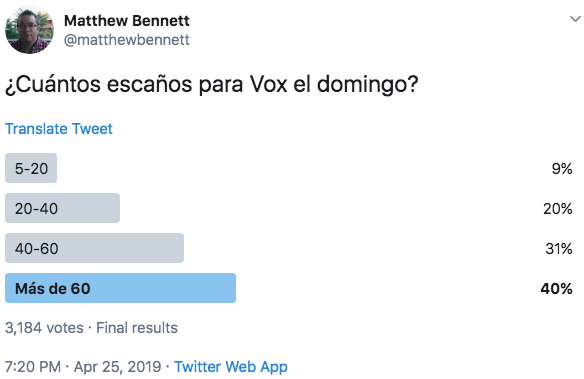

```{r setup, include=FALSE, echo = FALSE}
# Basic knitr options
library(knitr)
opts_chunk$set(comment = NA, 
               echo = FALSE, 
               warning = FALSE, 
               message = FALSE, 
               error = TRUE, 
               cache = FALSE,
               fig.width = 8.64,
               fig.height = 4.86,
               fig.path = 'figures/')
```


```{r}
# Libraries
library(vilaweb)
library(rtweet)
library(tidyverse)
library(databrew)
library(translateR)
library(sentimentr) # https://github.com/trinker/sentimentr
require(RPostgreSQL)
require(readr)  
require(DBI)
library(webshot)
```

```{r}
# Sin complejos general
library(tidyverse)
# Read in twitter credentials
library(yaml)

twitter_credentials <- yaml.load_file('../../credentials/credentials.yaml')
## load rtweet package
library(rtweet)
token <- create_token(
  app = "bcndata",
  consumer_key = twitter_credentials$twitter_api_key,
  consumer_secret = twitter_credentials$twitter_api_secret_key,
  access_token = twitter_credentials$twitter_access_token,
  access_secret = twitter_credentials$twitter_access_token_secret)

if(!'sc.RData' %in% dir()){
  puigdemont <- search_tweets(
    '"Puigdemont" OR "@KRLS"', 
    n = 1000000000, 
    include_rts = F, 
    retryonratelimit = TRUE
  )
  puigdemont <- puigdemont %>% mutate(key = 'Puigdemont')
  junqueras <- search_tweets(
    '"Junqueras" OR "@junqueras"', 
    n = 1000000000, 
    include_rts = F, 
    retryonratelimit = TRUE
  )
  junqueras <- junqueras %>% mutate(key = 'Junqueras')

  sc <- bind_rows(junqueras, puigdemont)
  save(sc,
       file = 'sc.RData')
} else {
  load('sc.RData')
}

library(lubridate)
sc$date_time <- as.POSIXct(paste0(sc$created_at))
Sys.setenv(TZ='CET')
```

# Introducció

No és cap novetat que Twitter és una cambra d'eco. La gent segueix a persones amb opinions similars, creant nuclis ideologics bastant aillats. Aquesta polarització és un fenomen ben conegut i estudiat, i té implicacions importants per la societat i la política.

Si tens Twitter (o un compte en qualsevol xarxa social), el que veus en el teu feed no és una representació de la societat, sinó una reflexió de tu. Les teves accions _actives_ d'inclusió (seguir, afegir com amic, etc.) i d'exclusió (bloquejar o "mute"), combinades amb la filtració _passiva_ per part dels algoritmes (t'ensenyen el contingut que té probabilitat de ser clicat) creen una bombolla d'informació dificil d'escapar-s'en.

És per això que les "enquestes" que es fan en les xarxes són de poc valor predictiu. Reflecten més bé la ideologia dels seguidors del creador de l'enquesta que la realitat mateixa. És per això que quan un piulaire espanyolista fa una enquesta sobre el 28-A, els votants sobrevaloren la probabilitat d'un exit electoral para VOX. 




Per la mateixa raó, quan un sobiranista fa una enquesta sobre el mateix tema, encara que la mostra sigui enorme (11,000 vots!), els resultats s'aproximen bastant malament a la realitat.


Però més enllà dels biaixos de selecció i de confirmació (que aftecten a totes les ideologies), he observat també un altre biaix. Em sembla que certes communitats en Twitter són (a) més grans i (b) més actives que altres. Sient conscient de que el meu "feed" també està afectat pels meus propis biaixos, volia investigar més. Twitter és representatiu de la societat?

# Mètodes

Per medir la representativitat de Twitter, utilitzo dos fonts de dades: (a) el Baròmetre d'Opinió Política del Centre d'Estudios d'Opinió (ronda 1, 2019, dades recollides en març 2019) i (b) dades de Twitter mateix.

Per entendre fins quin punt Twitter representa a la realitat social, em faig dues preguntes:

1. La probabilitat de fer servir Twitter és igual per votants de differentes ideologies?  

2. La popularitat al Twitter (medida en esmentades) dels actors políitcs corresponen amb la seva popularitat política (medida en vots)?


```{r}
source('prepare_ceo_data.R')

make_chart <- function(var = 'indy', df){
  pd <- df %>%
    group_by_(var, 'twitter') %>%
    summarise(n = n()) %>%
    ungroup
  names(pd)[1] <- 'var'
  pd <- pd %>%
    group_by(var) %>%
    mutate(p = n / sum(n) * 100) %>%
    ungroup %>%
    arrange(desc(twitter), p) %>%
    group_by(var) %>%
    mutate(pp = cumsum(p))
  
  cols <- rev(databrew::make_colors(n = 3, categorical = F))
  red <- RColorBrewer::brewer.pal(8, 'Oranges')[4]
  cols[1] <- red
  ggplot(data = pd,
         aes(x = var,
             y = p,
             fill = twitter)) +
    geom_bar(stat = 'identity',
             alpha = 1) +
    theme_vilaweb() +
    labs(x = '',
         y = '%',
         caption = "Dades del Baròmetre d'Opinió Política, març 2019. 1500 residents de Catalunya amb ciutadania espanyola.\nGràfic de Joe Brew | @joethebrew.") +
    scale_fill_manual('A través a quins mitjans\ns\'acostuma a informar\ndels temes polítics?',
                      values = cols) +
    guides(fill = guide_legend(title.position = "top",
                               reverse = FALSE)) +
    theme(#axis.text.x = element_text(size = 18),
          # legend.text = element_text(size = 13),
          legend.position = 'right',
          # plot.title = element_text(size = 8),
          legend.title = element_text(size = 10),
          plot.caption = element_text(hjust = 0)) +
    geom_text(
      data = pd %>% filter(twitter != 'No fa servir internet'),
      aes(label = round(pp, digits = 1)),
      position = position_stack(),
      vjust = 1,
      color = 'white'
    )
}

```


# Resultats


Twitter no és el món real. A Catalunya, els piulaires són més...

- Joves
- D'esquerres
- Sobiranistes
- Masculíns
- Catalanoparlants

... que la població general.


## Ús de Twitter a Catalunya

Només la meitat dels catalans fan servir internet per a informar-se de temes polítics. I menys de 16% fa servir Twitter. 

```{r}
# Overall
make_chart(var = 'Catalunya',
           df = df %>% mutate(Catalunya = 'Catalunya')) +
    labs(title = 'Catalunya: Ús de Twitter/internet per a\ninformar-se de la política')

```

## Independentisme i Twitter

L'ús del Twitter per a informar-se de temes polítics és el doble entre independentistes que unionistes.

```{r}
# Independentisme
make_chart(var = 'indy',
           df = df %>% filter(indy != 'NS/NC')) +
    labs(title = 'Independentisme i ús de Twitter/internet a Catalunya')

```

## Partits polítics i Twitter

La variació d'ús de Twitter per partit és alta. Els Cupaires són els més piulaires; els PPeros, els menys.

```{r}
# Partit
make_chart(var = 'partit',
           df = df %>% filter(partit != 'Altre/NS/NC')) +
    labs(title = 'Partits i ús de Twitter/internet a Catalunya')

```

## Edat i Twitter

Això no sorprèn gaire: els joves catalans fan servir Twitter molt més que els grans.

```{r}
# Edat
x <- df %>% mutate(EDAT_GR = as_factor(EDAT_GR))
x$EDAT_GR <- factor(x$EDAT_GR,
                    levels = levels(x$EDAT_GR),
                    labels = gsub('a ', 'a\n',gsub('de ', 'de\n', levels(x$EDAT_GR))))
make_chart(var = 'EDAT_GR',
           df = x) +
    labs(title = 'Edat i ús de Twitter/internet a Catalunya') 

```

## Ideologia i Twitter

Els Catalans d'esquerres fan servir Twitter molt més que els catalans de dretes.


```{r}
# Ideology
make_chart(var = 'axis_simple',
           df = df %>% filter(!is.na(axis_simple))) +
    labs(title = 'Ideologia política i ús de Twitter/internet a Catalunya') 
```

## Sexe i Twitter

L'ús de Twitter és més alt entre homes catalans que dones (però la bretxa és menys que al [nivell mundial](https://www.statista.com/statistics/828092/distribution-of-users-on-twitter-worldwide-gender/)).

```{r}
# Sex
make_chart(var = 'SEXE',
           df = df) +
    labs(title = 'Sexe i ús de Twitter/internet a Catalunya') 
```

## Llengua i Twitter

Els catalans que consideren només el espanyol com a llengua pròpia fan servir Twitter molt menys que els catalans que consideren altres llengues, el català, o el català i el espanyol com a llengues pròpies.

```{r}
# Language
make_chart(var = 'llengua',
           df = df) +
    labs(title = "Llengua considerada 'pròpia' i ús de Twitter/internet a Catalunya") 

```

## Més exploració

(Vicent, Josep, Assumpció: Estic pensant en treure la proxima secció perquè [a] no sé si cuadra amb l'anterior i [b] no sé si és interessant pel lector i [c] no tinc cap conclusió més enllà de les dades mateixes. Treiem, o deixem?)

Fins ara hem vist que Twitter no representa la població general. És una selecció petita (només 15,6%) dels catalans, i aquest 15,6% no és una selecció "aleatoria".

Però les diferències ens els perfils sociodemogràfiques dels piulaires no explica tot. Sembla que hi ha certs temes, i certes persones, més _piulables_ que altres.

Un exemple concret. En els 7 dies anteriors a les eleccions del 28-A (21-27 d'abril) (unes eleccions en les quals ERC va obtenir més del doble de vots que JxCAT, i unes eleccions en les quals Oriol Junqueras era cap de llista i Carles Puigdemont ni es presentava) el nombre de piulets esmentant a Carles Puigdemont va ser 8 vegades més que els que esmentaven a Oriol Junqueras.


```{r}
options(scipen = '999')
pd <- sc %>%
  mutate(date = as.Date(date_time)) %>%
  filter(date >= '2019-04-21',
         date <= '2019-04-27') %>%
  group_by(#date = as.Date(date_time),
           key) %>%
  summarise(n = n(),
            rt = sum(retweet_count, na.rm = T) + 1,
            fav = sum(favorite_count, na.rm = T)) %>%
  ungroup %>%
  mutate(interactions = rt + fav)

ggplot(data = pd,
       aes(x = key,
           y = n)) +
  geom_bar(stat = 'identity',
           aes(fill = key)) +
  geom_text(aes(label = n),
            nudge_y = -3000, color = 'white') +
  theme_vilaweb() +
  labs(x = '',
       y = 'Piulets',
       title = '21-27 d\'abril: esmentades a Twitter',
       subtitle = "Piulets originals, sense comptar 'retweets'") +
    scale_fill_manual(name = '',
                    values = as.character(vilaweb::colors_vilaweb()[c(1,5)])) +
  theme(legend.position = 'none') +
  theme(axis.text.x = element_text(size = 15))
```

Si incloem els 'retweets' també, la diferència és encara més gran.

```{r}
ggplot(data = pd,
       aes(x = key,
           y = rt)) +
  geom_bar(stat = 'identity',
           aes(fill = key)) +
  geom_text(aes(label = rt),
            nudge_y = -7000, color = 'white') +
  theme_vilaweb() +
  labs(x = '',
       y = 'Piulets',
       title = '21-27 d\'abril: esmentades a Twitter',
       subtitle = "Nombre de 'retweets'") +
  scale_fill_manual(name = '',
                    values = as.character(vilaweb::colors_vilaweb()[c(1,5)])) +
  theme(legend.position = 'none') +
  theme(axis.text.x = element_text(size = 15))
```

Com s'explica això? És veritat que JxCat té més gent en Twitter (26,4%) que ERC (16,8%), però aquesta diferència és relativament menor comparada amb la diferència en piulets i retweets entre els líders dels dos partits. Per què?

Si has llegit fins aquí esperant-te a una resposta, ho sento molt. No en tinc. Les dades són les que són - les conclusions, hauràs de fer tu, estimat lector.

# Reflexió

Twitter és una plataforma interessant, entretinguda, i utilíssima per a l'anàlisi polític. Però no és la realitat. La gran majoria dels catalans no fan servir Twitter. I la minoria petita que l'utilitza és una selecció "sesgada" (és a dir, no representativa) de la societat. Val la pena recordar-ho.

```{r}
# system("python3 ../../foreign/twint/Twint.py -s \"'Puigdemont' OR '@KRLS'\" --since 2019-04-01 --until 2019-04-28 -o data/Puigdemont --csv")
# # system("python3 ../../foreign/twint/Twint.py -s Junqueras --since 2019-04-01 --until 2019-04-28 -o data/Junqueras --csv")
# puigdemont <- read_csv('data/Puigdemont/tweets.csv') %>% filter(!duplicated(id)) %>% mutate(key = 'Puigdemont')
# junqueras <- read_csv('data/Junqueras/tweets.csv') %>% filter(!duplicated(id)) %>% mutate(key = 'Junqueras')
# df <- bind_rows(puigdemont, junqueras)
# 
# pd <- df %>%
#   group_by(key, date = as.Date(cut(date, 'day'))) %>%
#   tally %>%
#   ungroup
# 
# ggplot(data = pd,
#        aes(x = date,
#            y = n,
#            color = key)) +
#   geom_line()
```