No, V-Dem data does NOT show an improvement in liberal democracy in Spain. In fact, Spain just received its worst score in 40 years.
================

The V-Dem data
==============

[V-Dem](https://www.v-dem.net/en/) is an international academic consortium, based at the University of Gothenburg (Swedem), that measures democracy. Its annual ["Democracy Report"](https://www.v-dem.net/en/news-publications/democracy-reports/) is a reliable barometer of the democratic quality of different countries - across multiple dimensions and indicators - around the world. Unlike some indices of democracy, V-Dem's methods and data are completely transparent and available; anyone can [download the data](https://www.v-dem.net/en/data/data-version-9/) and examine each variable by herself.

Spain and the 2019 report
=========================

V-Dem recently published its [2019 report](https://www.v-dem.net/media/filer_public/99/de/99dedd73-f8bc-484c-8b91-44ba601b6e6b/v-dem_democracy_report_2019.pdf) and [raw data](https://www.v-dem.net/en/data/data-version-9/). Soon after publication, the Spanish Government marketing arm, [Global Spain](https://espanaglobal.gob.es/en) (a branch of the Spanish Government's [Ministry of Foreign Affairs](http://www.exteriores.gob.es/Portal/en/PoliticaExteriorCooperacion/MarcaEsp/Paginas/inicio.aspx)) began tweeting data and infographics based on V-Dem.

These tweets and charts, in both English and Spanish, claimed that Spain's rank and score in the "liberal democracy index" had improved over the last year.

<table style="width:100%">
<tr>
    <td>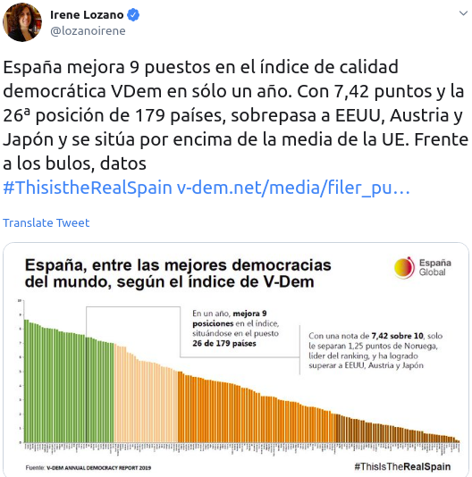</td>
    <td>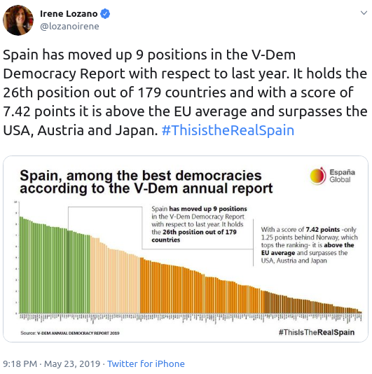</td>

</tr>
</table>
Global Spain (and its leader, [Irene Lozano](https://twitter.com/lozanoirene)) published other tweets and graphics related to V-Dem as well. For example, several tweets pointed out that Spain's "judicial independence" was among the "top 10" in the world.

<table style="width:100%">
<tr>
    <td>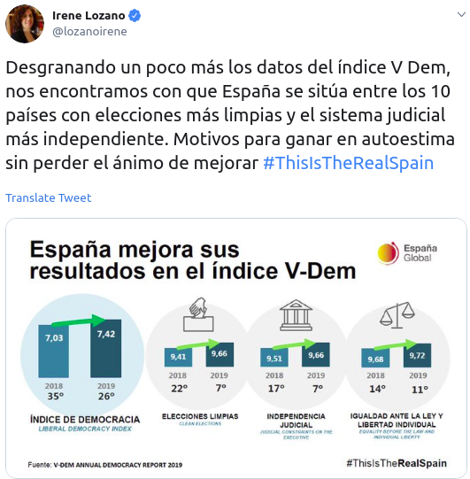</td>
    <td>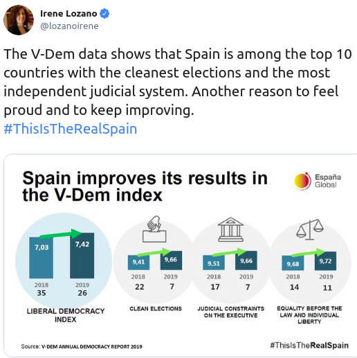</td>

</tr>
</table>
In addition to publishing on [its website](https://espanaglobal.gob.es/actualidad/sociedad/espa%C3%B1a-mejora-9-puestos-en-el-%C3%ADndice-de-democracia-de-v-dem), the official Spanish language account of "España Global" tweeted infographics and numbers, highlighting the the "improvement" from last year and the high score in "judicial independence".

<table style="width:100%">
<tr>
    <td>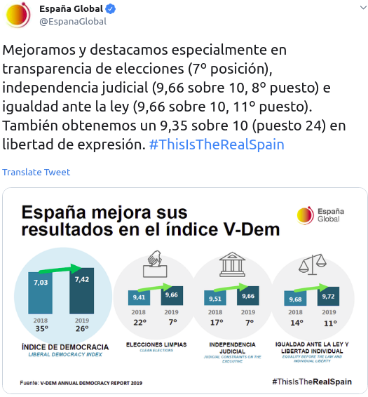</td>
    <td>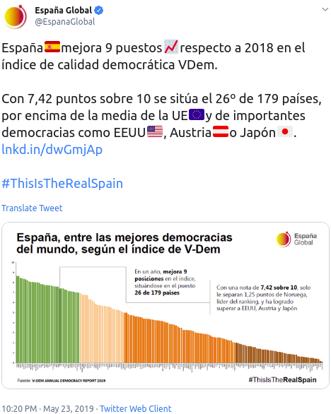</td>

</tr>
</table>
The campaign was picked up by others, too. Both private Twitter users and official government bodies like "España en la UE" tweeted about the "democratic improvements". And the Spanish Ministry of Foreign Affairs (as well as multiple politicians) retweeted.

<table style="width:100%">
<tr>
    <td>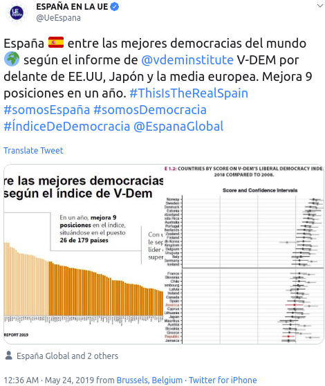</td>
    <td>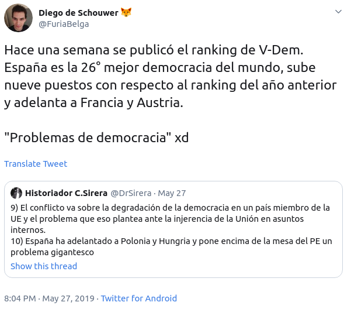</td>

</tr>
</table>
Reading all these tweets, it's clear that Spain's democracy improved last year, right?

But...
======

There's one problem with all these tweets and charts about Spain's big improvements in democratic quality and top-10 rankings in judicial independence. They're not true:

-   Spain's V-Dem score did not improve last year (in fact, it decreased slightly).
-   Spain's ranking did not change over the last year year.
-   And Spain's "judicial independence" is not ranked in the top 10 in the world by V-Dem.

It's simply false. It's a "bulo". It's "fake news"

The data
========

Global Spain made an honest mistake in interpreting the V-Dem data. Or rather, three mistakes

Mistake 1: Spain's "Liberal Democracy Index" did not increase over the last year; it decreased.
-----------------------------------------------------------------------------------------------

The V-Dem has an index measure (an aggregation of other measures) which they call the "Liberal Democracy Index". According to Global Spain, this measure improved from 7,03 to 7,42 over the last year.

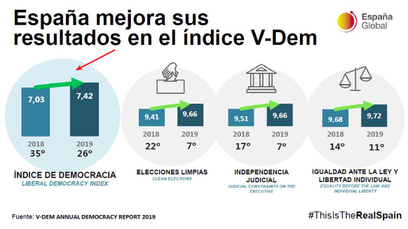

This is not true. The correct data are below.

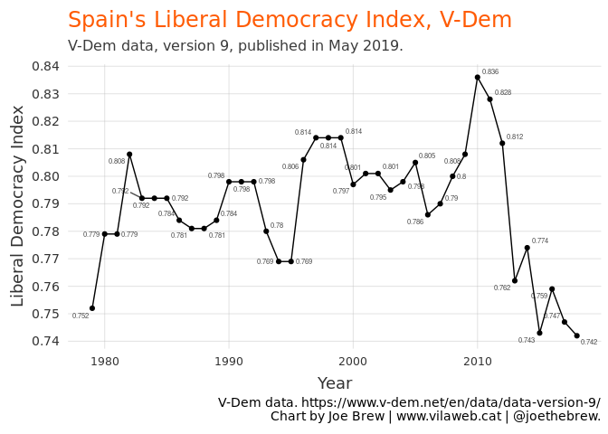

The above chart shows that Spain's Liberal Democracy Index score did not improve over the last year. In fact, it got worse, going from 0.747 to 0.742.

According to Global Spain's [blog post](https://espanaglobal.gob.es/actualidad/sociedad/espa%C3%B1a-mejora-9-puestos-en-el-%C3%ADndice-de-democracia-de-v-dem) on the V-Dem data, "La consolidación democrática de España durante 40 años de Constitución es indudable" ("The democratic consolidation of Spain during the 40 years of the Constitution is beyond doubt"). However, according to the V-Dem data, Spain's most recent score is its *worse* score in 40 years, the worst score since the Constitution came into effect.

Mistake 2: No, Spain's ranking in the "Liberal Democracy Index" did not improve over last year; it remained the same
--------------------------------------------------------------------------------------------------------------------

According to Global Spain, Spain improved 9 places (from 35th to 26th) in the ranking of world countries in terms of liberal democracy.

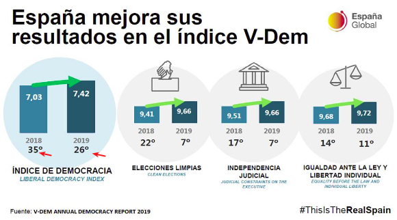

However, this is also false. Spain's rank in the 2019 report (with data collected in 2018) is 26th. Its rank the previous year was also 26th. There was no improvement.

The below is the correct data:

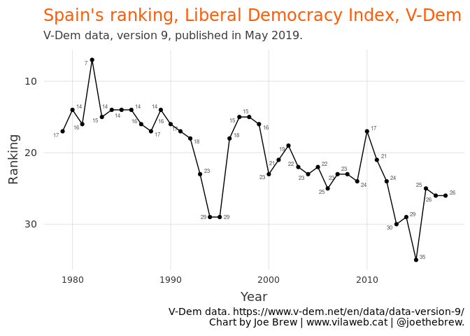

Mistake 3: Spain is not ranked 7th in the world in "judicial independence". It is ranked 17th or 18th.
------------------------------------------------------------------------------------------------------

In Global Spain's Spanish-language infographic, as well as multiple tweets on the subject, it was explicitly stated that Spain was a "top 10" country in terms of "judicial independence" (see below).

<table style="width:100%">
<tr>
    <td></td>
    <td>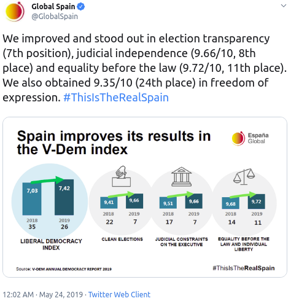</td>

</tr>
</table>
This, again, is false.

There are two variables in the V-Dem which directly measure judicial independence. These are (i) `v2juhcind` (high court independence) and `v2juncind` (low court independence). In these two variables, Spain ranks 17th and 18th, respectively, not 7th. The below chart shows the correct data.

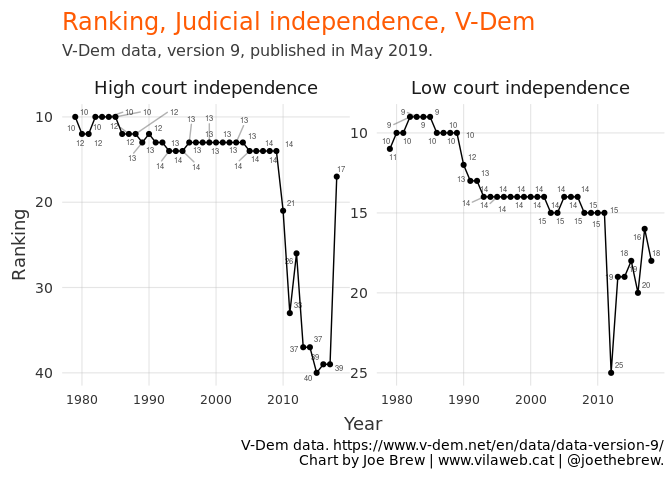

What Global Spain reported as "judicial independence" was actually a misleading translation of the "Judicial constraints on the executive" index. This index indeed *includes* some measures on judicial independence, but it also includes other measures (such as the executive's respect for the Constitution, compliance with courts, etc.). Here is Global Spain's infographic showing the misleading translation:

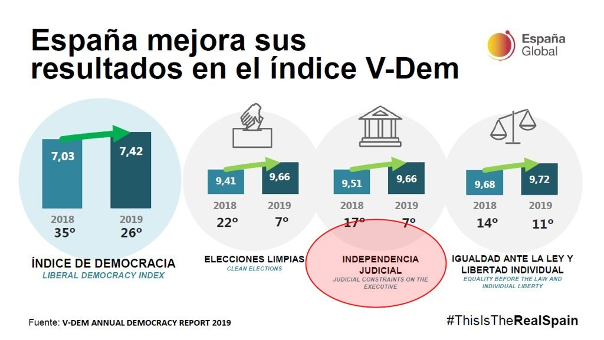

How did these mistakes happen?
==============================

Global Spain reported false information. But I call this a "mistake" and not a "lie" because it is entirely plausible that they simply were not aware that the information they were reporting was false.

Here is what I suspect happened: someone at Global Spain decided to compare the [2019 V-Dem democracy report](https://www.v-dem.net/media/filer_public/99/de/99dedd73-f8bc-484c-8b91-44ba601b6e6b/v-dem_democracy_report_2019.pdf) with the [2018 report](https://www.v-dem.net/media/filer_public/68/51/685150f0-47e1-4d03-97bc-45609c3f158d/v-dem_annual_dem_report_2018.pdf). They looked at the pdf files from two different years, saw the scores and rankings, and turned those into an infographic. Sounds fine, right? Wrong.

Whoever did this failed to examine [V-Dem methodology and raw data](https://www.v-dem.net/en/reference/version-9-apr-2019/). If they had examined this, they would have noted that the 2019 report was based on the version 9 methodology, whereas the 2018 report was based on the version 8 methodology. Given the two methodologies, one cannot compare V9 with V8. Rather, to make comparisons over time, one should use only the most recent methodology (V9), which includes historical data.

This is a bit confusing, right? When I examined the raw data, and saw the discrepancies with the historical pdf reports, I also got confused. So, I wrote to V-Dem and asked why it is that the 2018 pdf report contained different values than the V9 raw data.

Johannes von Römer, the Senior Data Manager at V-Dem, wrote back. He explained that "Comparing absolute index values between different versions of our datasets" (exactly what Global Spain had done) "can be misleading, due to several different factors". He then listed reasons, including:

1.  "Coders add data with every update".

2.  "We currently allow our coders to update and change their ratings back in time if they have come across new and more accurate information. This should lead to a continuous improvement of the data quality over time". So V9 should be considered "improved" relative to V8.

In other words, the more recent versions not only contain more recent data, but also more accurate data of the past. And because the statistical methods across different versions are different, one should not compare data across different versions (which is what Global Spain did). Rather, one should compare data across time, using the same version (which is what I've done in this article).

Von Römer explained further. "Users should always use our newest dataset since it has improved data quality over previous dataset versions". Since my question to V-Dem specifically pertained to data on Spain, Dr. Von Römer addressed the issue as well: "If Spanish State employees wanted to know if Liberal Democracy improved from 2017 to 2018 they should look at v9 data for both years in which Spain ranked 26 in both years, but reduced their scores from 0.747 in 2017 to 0.742 in 2018. However, this change is well inside confidence intervals so it cannot be considered much of a decrease."

In other words, Spain's "Liberal Democracy Index" score, like its ranking, did not improve last year. In the case of Global Spain's efforts to show an improvement, "if the government employees as described by you compare v8 2017 scores with either v9 2018 or v9 2017 scores that would be very misleading in both cases due to the V-Dem methodology."

Conclusion
==========

Global Spain published, and then heavily publicized, an "improvement" in its ranking and scores as a liberal democracy via the V-Dem data. It also stated, and publicized, that it was a top-10 country in the world according to V-Dem's in the area of "judicial independence". Both the improvement and the top-10 judicial independence scores are false. Spain's "Liberal Democracy Index" score did not improve over the last year, and Spain is not in the top 10 countries in the world in "judicial independence" according to the V-Dem.

Like I said, it is entirely plausible that this was a simple mistake on the part of Global Spain, and not an attempt to mislead. And if this was indeed a mistake, I hope that Global Spain will make as much of an effort to publish the *correct* comparison data (as I've reported in this article, and as is publicly available on [V-Dem's website](https://www.v-dem.net/en/)) as they did to publish the *misleading* data last week.

Appendix
========

For the sake of complete transparency, you can see the [code used for the production of charts in this paper](https://github.com/joebrew/vilaweb/tree/master/analyses/vdem). Also, my email to V-Dem as well as their full response is below.

### Email to V-Dem

*Sent by Joe Brew on May 24, 2019*

Dear Dr. Teorell (and V-Dem team),

I'm an admirer of your work with the V-Dem - thanks for what you do.

I have a question about a data discrepancy. The 2018 report ([here](https://www.v-dem.net/media/filer_public/68/51/685150f0-47e1-4d03-97bc-45609c3f158d/v-dem_annual_dem_report_2018.pdf)) show's Spain's year 2017 LDI score as 0.703 (rank = 36). However, in the raw data (downloaded from here both as R and .csv files), the 2017 LDI score (variable name = 'v2x\_libdem') is 0.747 (rank = 26).

A similar discrepancy exists with the clean elections variable. The 2018 report shows a 2017 value of 0.941 (rank = 22). However, in the raw data, the 2017 clean elections score (variable name = 'v2xel\_frefair') is 0.96 (rank = 12).

Can you explain the source of these disrepancies? Is the 2018 report incorrect, or are the raw datasets incorrect?

I ask because Spanish State employees are [actively publicizing](https://twitter.com/lozanoirene/status/1131821163708129280) how the V-Dem report shows an improvement in Spain's LDI (from the 2018 to 2019 reports, ie the 2017 to 2018 datasets), as suggested by the pdf reports. But the raw data tells a different story.

Many thanks. Cheers,

Joe Brew

### V-Dem's response to Joe Brew

*Sent from Johannes von Römer, Senior Data Manager, V-Dem Institute, on May 27 2019*

Hi,

Thank you for using V-Dem data!

To your question.

Can I compare index scores across versions, e.g. between version 9 and 8 of the V-Dem dataset?

No. Comparing absolute index values between different versions of our datasets can be misleading, due to several different factors;

First, coders add data with every annual update.

Second, we currently allow our coders to update and change their ratings back in time if they have come across new and more accurate information. This should lead to a continuous improvement of the data quality over time.

Third, there is some attrition of coders as well as recruitment of additional coders for every new release.

Fourth, we strive for full coverage and therefore continuously add new countries and expand our time-series. For each variable the input of our Bayesian Item Response Theory Measurement model contains the coder scores for that specific question across all countries and years (in reduced form, capturing changes only).

Because of all the factors mentioned above the input per variable changes with every annual release. Consequently, the output of the statistical model varies, and the scores are hence expected to change with new releases, even for older years.

Each index is an aggregation of several variables. However, an interpretation of index scores is only meaningful in comparison to other index scores across time or countries within the same index (e.g. rank orders).

Users should always use our newest dataset since it has improved data quality over previous dataset versions simply already by better assessing coder-thresholds due to additional data.

For the case of the Liberal Democracy Index for Spain this means that while in v8 Spain was ranked 35 for v2x\_libdem for the year 2017, in v9 Spain ranked 26 for the year 2017. Spain could thus celebrate that they thought they were ranked at around 35 in the year 2017, but newer data suggests that they were actually ranked around 26 in 2017.

If Spanish State employees wanted to know if Liberal Democracy improved from 2017 to 2018 they should look at v9 data for both years in which Spain ranked 26 in both years, but reduced their scores from 0.747 in 2017 to 0.742 in 2018. However, this change is well inside confidence intervals so it cannot be considered much of a decrease.

If the government employees as described by you compare v8 2017 scores with either v9 2018 or v9 2017 scores that would be very misleading in both cases due to the V-Dem methodology. To clarify, the 2019 report uses v9 data (data until 2018) and the 2018 report uses v8 data (data until 2017).

Please feel free to contact me for any further inquiries.

Best regards, Johannes von Römer Senior Data Manager V-Dem Institute <https://v-dem.net>

Catalan language plots
======================

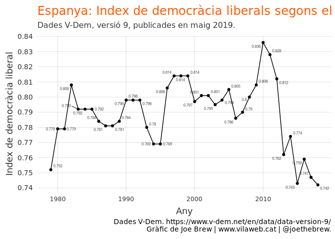

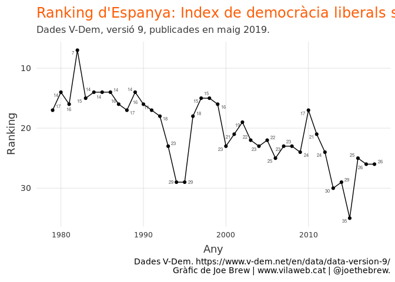

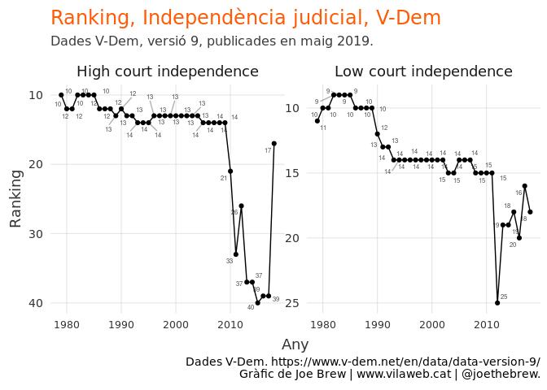
