```{r setup, include=FALSE, echo = FALSE}
# Basic knitr options
library(knitr)
opts_chunk$set(comment = NA, 
               echo = FALSE, 
               warning = FALSE, 
               message = FALSE, 
               error = TRUE, 
               cache = FALSE,
               fig.path = 'figures/')
```


```{r}
# Libraries
library(vilaweb)
library(rtweet)
library(tidyverse)
library(databrew)
library(translateR)
library(sentimentr) # https://github.com/trinker/sentimentr
require(RPostgreSQL)
require(readr)  
library(ggrepel)
require(DBI)
library(ggtern)
  
```

```{r, fig.height = 8}
# # Get most recent tweets from our people of interest

keep_names <- c('albert_rivera',
                'albiol_xg',
                'alejandro_tgn',
                'alevysoler',
                'carmencalvo_',
                'carrizosacarlos',
                'ciudadanoscs',
                'ciutadanscs',
                'eva_granados',
                'inesarrimadas',
                'j_zaragoza_',
                'josepborrellf',
                'marianorajoy',
                'meritxell_batet',
                'miqueliceta',
                'pablocasado_',
                'ppcatalunya',
                'ppopular',
                'psoe',
                'sanchezcastejon',
                'santi_abascal',
                'vox_es')

keep_names2 <- c('esquerra_erc',
                 'pnique',
                 'pdemocratacat',
                 'krls',
                 'adacolau',
                 'albanodante76',
                 'carlescampuzano',
                 'catencomu_podem',
                 'quimtorraipla',
                 'cupnacional',
                 'jaumeasens',
                 'joantarda',
                 'junqueras',
                 'miriamnoguerasm',
                 'pablo_iglesias_',
                 'perearagones')
people <- c(keep_names, keep_names2)
if(file.exists('tl.RData')){
  load('tl.RData')
} else {
  # Connect to the db
  pg = DBI::dbDriver("PostgreSQL")
  con = DBI::dbConnect(pg, dbname="twitter")
  tl <- RPostgreSQL::dbGetQuery(
    con,
    paste0("SELECT * FROM twitter")
  )
  save(tl, file = 'tl.RData')  
  dbDisconnect(con)
  }
tl_original <- tl

tl <- tl %>% filter(username %in% people)

# Read in google sheet with keys
library(gsheet)
if(!'goog.RData' %in% dir()){
  goog_people <- gsheet::gsheet2tbl(url = 'https://docs.google.com/spreadsheets/d/1k6_AlqojK47MMqzuFYAzBnDfYXysmUgSseaKvHTb3W4/edit#gid=1425313388')
  save(goog_people,
       file = 'goog.RData')
} else {
  load('goog.RData')
}

tl <- tl %>% filter(username %in% goog_people$username)

# Join the google data
tl <- tl %>%
  left_join(goog_people)
```

# Introducció: la "violència" al twitter

Fès una búsqueda al twitter per les paraules "violencia" o "violentos". És facil. Fès clic [aqui](https://twitter.com/search?q=%22viol%C3%A8ncia%22%20OR%20%22violencia%22%20OR%20%22violentos%22%20OR%20%22violento%22%20OR%20%22violenta%22%20OR%20%22violentas%22&src=typed_query) o simplement escriu "violencia" en la barra de búsqueda. Si vols veure piulades d'una persona específica, afegeix "from:" [aixi](https://twitter.com/search?q=from%3AAlbert_Rivera%20violentos&src=typed_query):

```
from:Albert_Rivera violentos
```

Trobaràs molts tuits. Moltíssims. Sobre tot de polítics. Mencions de violència, referències a persones violentes, descripcions d'esdeveniments violents, i sobre tot condemnes de la violència. Això és normal - quan hi ha violència, els polítics en parlen i en tuitejen, especialment quan l'autor de la violència és un adversari polític, o el víctima de la violència es un aliat polític.

# Un exemple: les últimes 24 hores

Per example, aqui alguns de les piulades mencionant "violència" o "violentos" de les ultimes 24 hores:

<table style="width:100%">
  <tr>
    <td>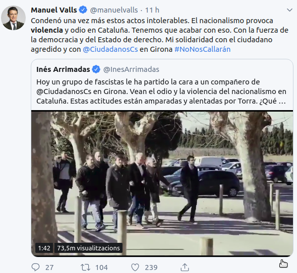</td>
    <td>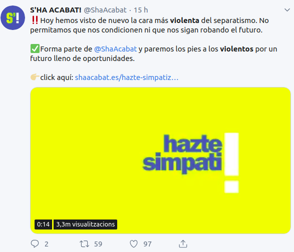</td>
  </tr>
    <tr>
    <td>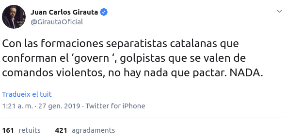</td>
    <td>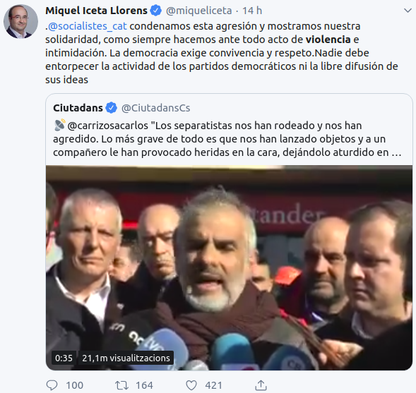</td>
  </tr>
    <tr>
    <td>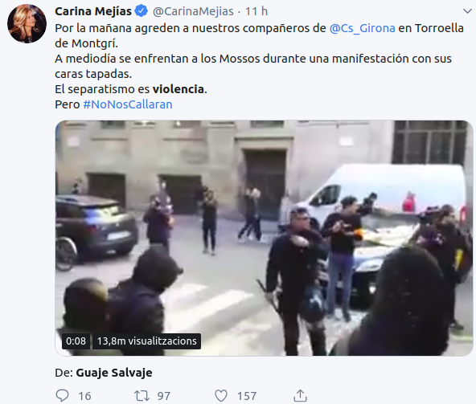</td>
    <td>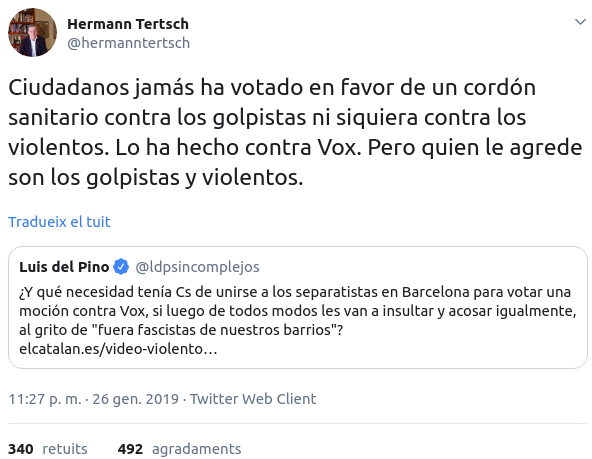</td>
  </tr>
    <tr>
    <td>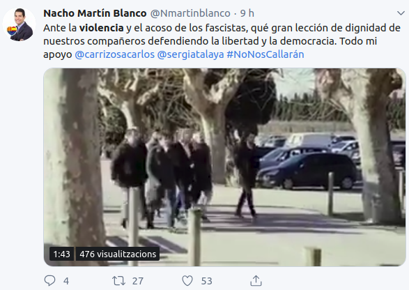</td>
    <td>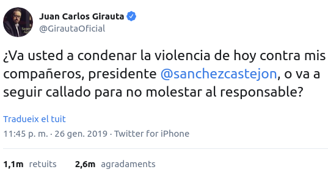</td>
  </tr>
    <tr>
    <td>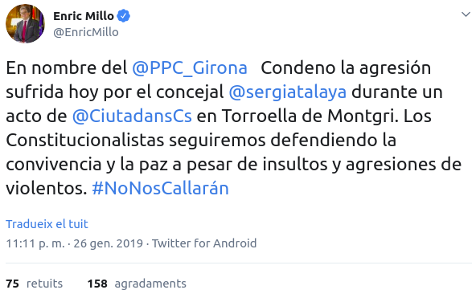</td>
    <td>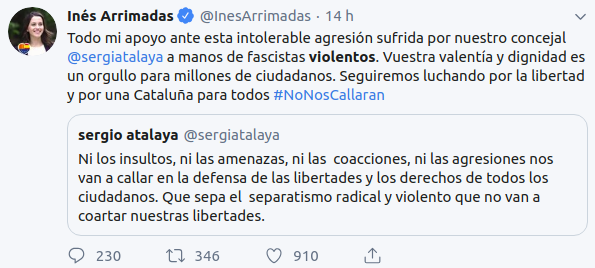</td>
</table>

.


# Els presos i exiliats

Ara mateix hi ha 9 líders polítics i socials catalans a la presó i 7 més a l'exili, acusats de "rebel-lió". Aquesta acusació requereix, segons el Codi Penal Espanyol, l'ús de la violència. Segons la Fiscalía de l'Estat, el Jutge Instructor del cas, i els liders dels principals partits espanyols, els empresonats/exiliats es van "alçar pública i violentament" (definició de rebel-lió) organitzant el referèndum d'autodeterminació l'1 d'octubre de 2017.

Hi va haver un alçament violent? Van promoure, recolzar, o fer servir la violència?

# L'analisi

Si una agressió pot provocar dotzenes de piulades de líders polítics (com en les últimes hores), s'esperaria a que una rebel-lió provocaria milers de condemnes de violència al twitter. Sobre tot dels adversaris dels autors de la violència, i de les seves víctimes. Mirem-lo.

El gràfic següent mostra el numero de piulades amb les paraules "violència" (violento/a/s, violencia, etc.) dels dies 1 al 7 d'octubre de 2017, o sigui el dia de la "rebel-lió" i la següenta setmana.


```{r}

searcher <- function(x){
  (grepl(' violèn', tolower(x), fixed = TRUE) |
    grepl(' violen', tolower(x), fixed = TRUE)) &
    !grepl('violen ', tolower(x), fixed = TRUE) &
    !grepl('violan ', tolower(x), fixed = TRUE) &
    !grepl('violentar', tolower(x), fixed = TRUE) &
    !grepl('violentad', tolower(x), fixed = TRUE) &
    !grepl('violentan', tolower(x), fixed = TRUE)
}

tl$violencia <- searcher(tl$tweet)
x <- tl %>%
  filter(date %in% seq(as.Date('2017-10-01'), as.Date('2017-10-07'), by = 1),
         violencia)
left <- data_frame(username = sort(unique(keep_names)))
pd <- left %>% left_join(x %>%
  group_by(username) %>%
  tally)
pd$n[is.na(pd$n)] <- 0
pd <- pd %>% arrange(desc(n))
pd$username <- factor(pd$username, levels = pd$username)
pd1 <- pd
g1 <- ggplot(data = pd1,
       aes(x = username,
           y = n)) +
  geom_bar(stat = 'identity',
           fill = 'darkorange',
           alpha = 0.6) +
  # geom_segment(aes(yend = 0,
  #                  xend = username)) +
  # geom_point() +
  theme_databrew() +
  theme(axis.text.x = element_text(angle = 90,
                                   hjust = 1,
                                   vjust = 0.5,
                                   size = 14),
        plot.caption = element_text(size = 11)) +
  labs(x = '',
       y = 'Tuits',
       title = 'Tuits con la palabra "violencia", 1-7 de octubre de 2017',
       subtitle = 'Unionistas',
       caption = '*Incluye variaciones: violència, violento, violentos') +
  geom_text(aes(label = n),
                nudge_y = 0.2,
            alpha = 0.5) 
# g1
# ggsave('~/Desktop/g1.png')

left <- data_frame(username = sort(unique(keep_names2)))
pd <- left %>% left_join(x %>%
  group_by(username) %>%
  tally)
pd$n[is.na(pd$n)] <- 0
pd <- pd %>% arrange(desc(n))
pd$username <- factor(pd$username, levels = pd$username)
pd2 <- pd
g2 <- ggplot(data = pd2,
       aes(x = username,
           y = n)) +
  geom_bar(stat = 'identity',
           fill = 'darkblue',
           alpha = 0.6) +
  # geom_segment(aes(yend = 0,
  #                  xend = username)) +
  # geom_point() +
  theme_databrew() +
  theme(axis.text.x = element_text(angle = 90,
                                   hjust = 1,
                                   vjust = 0.5,
                                   size = 14)) +
  labs(x = '',
       y = 'Tuits',
       title = 'Tuits con la palabra "violencia", 1-5 de octubre de 2017',
       subtitle = 'Independentistas + Podem(os)',
       caption = '*Incluye variaciones: violència, violento, violentos') +
  geom_text(aes(label = n),
                nudge_y = 1,
            alpha = 0.5) 
# g2
# ggsave('~/Desktop/g2.png')
# Rmisc::multiplot(g1, g2, cols = 2)


pdd <- bind_rows(
  pd2 %>% mutate(type = 'Sobiranistes'),
  pd1 %>% mutate(type = 'Unionistes')
)
pdd <- pdd %>% arrange(desc(n))
pdd$username<- factor(pdd$username, levels = pdd$username)
# pdd$username <- as.character(pdd$username)
g <- ggplot(data = pdd,
       aes(x = username,
           y = n)) +
  geom_bar(stat = 'identity',
           fill = 'darkblue',
           alpha = 0.6) +
  # geom_segment(aes(yend = 0,
  #                  xend = username)) +
  # geom_point() +
  theme_vilaweb() +
  theme(axis.text.x = element_text(angle = 90,
                                   hjust = 1,
                                   vjust = 0.5,
                                   size = 14),
        strip.text = element_text(size = 16),
        plot.caption = element_text(size = 12),
        plot.title = element_text(size = 20)) +
  labs(x = '',
       y = 'Piulades',
       title = 'Piulades amb la paraula "violència", 1-5 d\'octubre de 2017',
       caption = '*Inclou variacions en castellà/català: violència, violento, violentos, violents, violentes, etc.\nDades recollides el 27 de gener de 2019. Gràfic: Joe Brew | @joethebrew | www.vilaweb.cat') +
  geom_text(aes(label = n),
                nudge_y = 1,
            alpha = 0.5) +
  facet_wrap(~type,
             scales = 'free_x')
ggsave(plot = g,
       filename = 'img/violence.png')
```

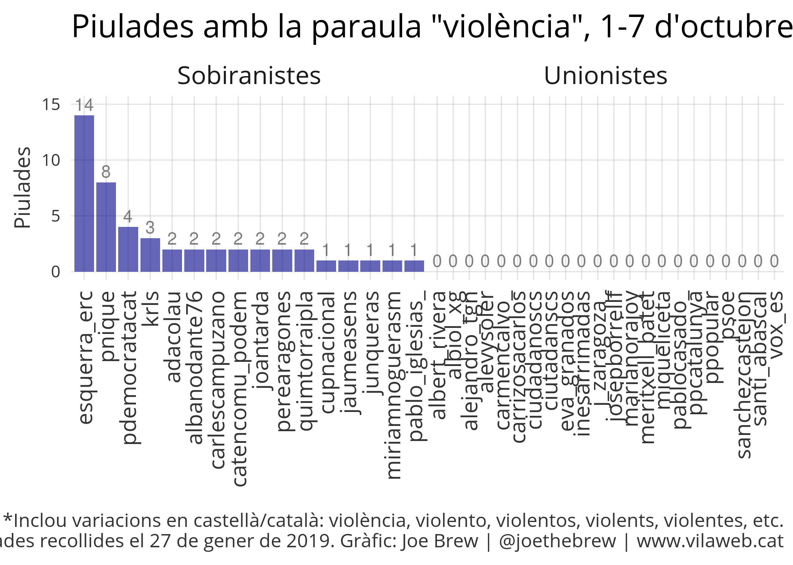

El gràfic no requereix molta explicació per entendre'l: durant i inmediatment desprès de la  "rebel-lió" de l'1 d'octubre, els únics que van parlar de la violència eran els sobiranistes. En van parlar per condemnar la violència de l'Estat.

Els polítics unionistes, tot i que va haver suposadament un "alçament violent" no en van dir res. Cap menció de "violència" o "violents" en la setmana de la rebel-lió. Ni una piulada amb la paraula "violent" de l'Inés Arrimadas. Ni una piulada amb la paraula "violència" d'el Miquel Iceta. Ni de l'Albert Rivera, ni del Xavier García Albiol, ni del Mariano Rajoy, ni tans sols de Santiago Abascal o el compte del partit de VOX.

Si els independentistes van fer servir la violència, per què no ho van condemnar els seus adversaris polítics? 

```{r}
x <- tl %>%
  filter(date >= '2017-10-08',
         date <= '2018-12-31',
         username %in% keep_names) %>%
  filter(violencia) %>%
  group_by(username) %>%
  tally
```

# Però...

Però, potser no van parlar de la violència durant la "rebel-lió" perquè no parlen mai de la violència al twitter. No?

No. Tot el contrari. Del 8 d'octubre de 2017 fins al 31 de desembre de 2018, els 22 comptes unionistes analitzats van fer servir les paraules "violència" (i variacions) `r sum(x$n)` vegades (gràfic següent).

```{r}

pdd <- x %>% arrange(desc(n))
pdd$username<- factor(pdd$username, levels = pdd$username)
# pdd$username <- as.character(pdd$username)
ggplot(data = pdd,
       aes(x = username,
           y = n)) +
  geom_bar(stat = 'identity',
           fill = 'darkblue',
           alpha = 0.6) +
  # geom_segment(aes(yend = 0,
  #                  xend = username)) +
  # geom_point() +
  theme_vilaweb() +
  theme(axis.text.x = element_text(angle = 90,
                                   hjust = 1,
                                   vjust = 0.5,
                                   size = 14),
        strip.text = element_text(size = 16),
        plot.caption = element_text(size = 9),
        plot.title = element_text(size = 13)) +
  labs(x = '',
       y = 'Piulades',
       title = 'Piulades amb la paraula "violència", 8 d\'octubre 2017 - 31 desembre 2018',
       caption = '*Inclou variacions en castellà/català: violència, violento, violentos, violents, violentes, etc.\nDades recollides el 27 de gener de 2019. Gràfic: Joe Brew | @joethebrew | www.vilaweb.cat') +
  geom_text(aes(label = n),
                nudge_y = 5,
            alpha = 0.5)
```

`r sum(x$n)` mencions de "violència" en poc més d'un any. Però 0 mencions de "violència" durant la setmana d'una suposada rebel-lió violenta. Té sentit?

El primer tuit dels 22 comptes unionistes analitzats que va mencionar "violència" desprès de la "rebel-lió" va ser 8 dies desprès, sobre una agressió a València.

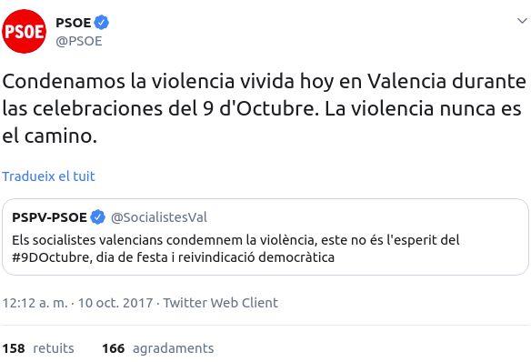

```{r}
x <- tl %>%
  filter(date >= '2017-10-01',
         violencia,
         username %in% keep_names) %>%
  arrange(date)
```

El primer tuit de Miquel Iceta mencionant "violència" desprès de la "rebel-lió" var ser 10 dies desprès. I va ser sobre la violència de gènere.

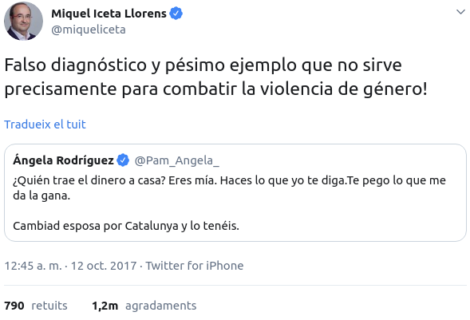

Xavier García Albiol va esperar tot un mes per mencionar una paraula relacionada amb violència, i llavors va ser de manera sarcàstica. Curiosa reacció a una rebel-lió violenta.

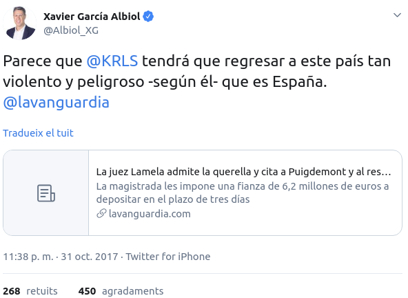

Desprès de la "rebel-lió", Albert Rivera no va mencionar "violència" al twitter fins al mes següent. I va ser sobre la violència machista.

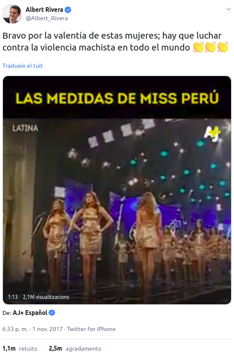


```{r, eval = FALSE}
y <- x %>%
  group_by(username) %>%
  filter(id == dplyr::first(id)) %>%
  ungroup %>%
  dplyr::select(date, name, username, tweet)
kable(y)
```

# Conclusió

És creïble que hi va haver una rebel-lió violenta duta a terme pels independentistes, i els seus adversaris polítics - que tuitejen les paraules "violència" i "violents" amb freqüencia - no van mencionar la violència d'aquesta rebel-lió fins setmanes (o mesos) més tard?

O és més creïble que aquests polítics no van parlar-ne durant i desprès del referèndum perquè la violència _real_ d'aquells dies - la violència d'un Estat exercida en contra de votants - els va provocar un sentiment de desorientació i culpa? Potser no van parlar de la violència durant la "rebel-lió" perquè els seus adversaris polítics (els independentistes) no van ser _autors_ de la violència, sino víctimes d'ella? Potser no van parlar de la violència de l'independentisme fins desprès perquè calia temps per reorientar-se i per construir una narrativa que justificava l'acció policial de l'1 d'octubre? Potser no van parlar de la violència durant la "rebel-lió" perquè hauria semblat simplement absurd, i calia més temps per que la gent oblidès del que va realment passar?


