Relat i realitat: la violència a Barcelona
================

If you are a reader of Spanish print newspapers, you might think that
Barcelona erupted into a civil war this month. The headlines refer, day
after day, to violent crime, homicide, robberies, riot police, and the
general issue of insecurity.

Politicians, particularly those from the political right, have hopped on
board as well, calling the situation in Barcelona an “emergency” and
denouncing the leftist mayor of Barcelona, Ada Colau.

<table style="width:100%">

<tr>

<td>

</td>

<td>

</td>

<td>

</td>

</tr>

</table>

So, are they right? Is the increase in cases of crime in Barcelona a
reflection of reality, or of a “relat” (narrative)? Let’s explore the
data.

## The reality

Reliable data on crime in Barcelona are available from two sources: the
Spanish Ministry of the Interior and the Catalan police (Mossos
d’Esquadra). The Ministry data are likely the most comprehensive
(including multiple police sources), but are only up to date through the
first trimester of 2019 (and therefore largely irrelevant to the
conversation about the *current* supposed crisis in security in
Barcelona). The below shows the number of crimes in Barcelona per
trimester, per the Ministry of the Interior:

<!-- -->

The data from the Mossos are more detailed (by month rather than
trimester) and slightly more up to date (going through the end of June).
The below shows crimes known to the Mossos over the last few years.

<!-- -->

As can be seen above, there is certainly a gradual increase over time,
but nothing extraordinary in the last few months. Let’s look more
specifically just at violent robbery (the crime that gets the most
attention in the media):

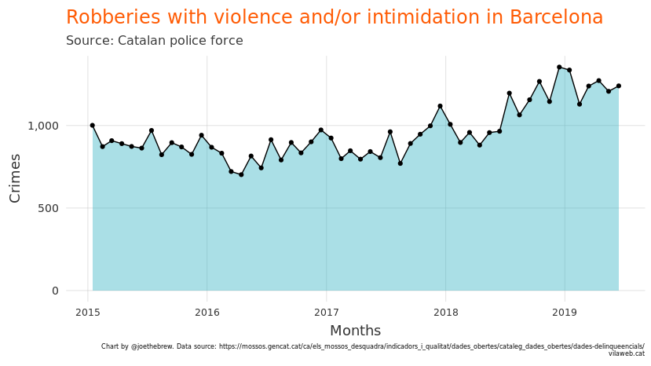<!-- -->

Again, there are notable increases over the last few years, but not
especially in the last few months.

## The relat (the narrative)

The data on criminality is pretty straightforward: crime is going up in
Barcelona, but there has been no particular change over the last few
months. And even with the increases this year, Barcelona remains safter
than most other European cities.

But the narrative, in both the news media and social media, is not in
close contact with reality. Whereas increases in crime in Barcelona have
been gradual, *talking about* crime in Barcelona has skyrocketed over
recent weeks.

For this analysis, we gathered 164175 tweets from 43 Catalan and Spanish
newspapers. The full list can be seen at the end of this article. We
identified all tweets which contained both the word “Barcelona” and a
word referring to violence and/or crime (“violència”, “inseguretat”,
“delictes”, “crim”) in both Spanish and Catalan.

The below chart shows the combined number of monthly tweets from these
43 newspapers mentioning the crime situation in Barcelona:

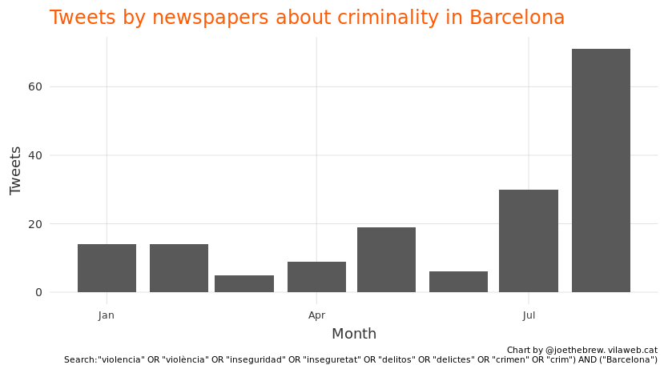<!-- -->

If we look by day over just the last few weeks, the rapid increase is
even more striking.

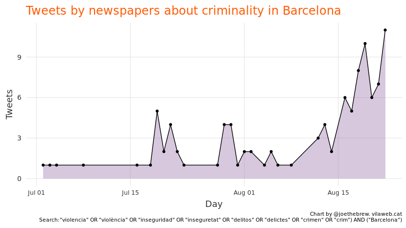<!-- -->

Let’s break it down by which newspapers.

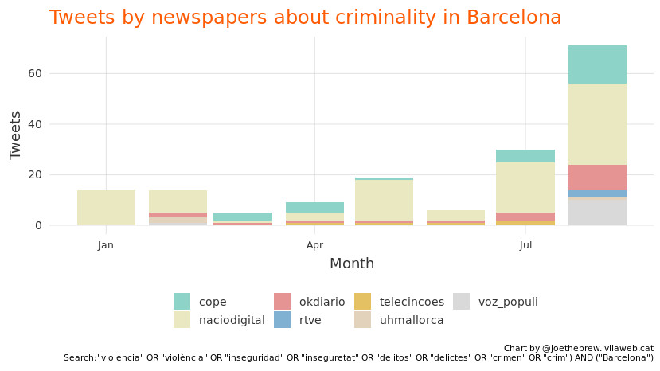<!-- -->

Finally, we can examine which newspapers by day:

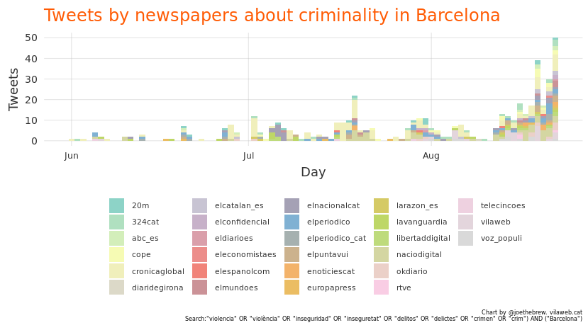<!-- -->

The increased newspaper coverage has had an effect. The below shows
unique tweets mentioning criminality (using the same search query as
above) about Barcelona in Twitter in general.

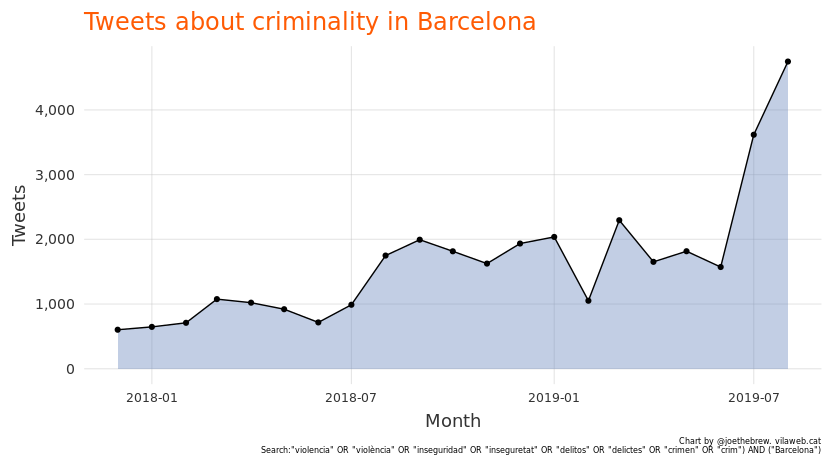<!-- -->

And the below shows tweets by day mentioning violence and Barcelona.

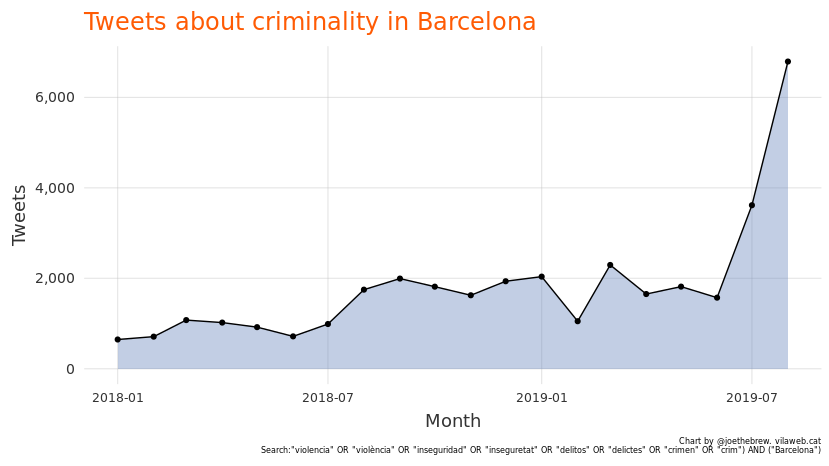<!-- -->

# Interpretation and Conclusion

Bla bla bla

## List of newspapers analyzed

20m 324cat abc\_es cadanaser\_espa ccmaa\_cat cope cronicaglobal
dbalears diariaara diaridegirona diarilaveu\_ diariomallorca
economiaed\_ elcatalan\_es elconfidencial eldiarioes eleconomistaes
elespanolcom elmundoes elnacionalcat elpais elpais\_espana elperiodico
elperiodico\_cat elpuntavui enoticiescat europapress larazon\_es
lavanguardia laverdad\_es le\_figaro lemondefr libertaddigital
lindependant naciodigital okdiario ondacero\_es publico rtve telecincoes
uhmallorca VilaWeb voz\_populi

# Catalan language charts

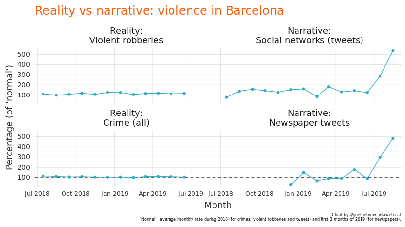<!-- -->

<!-- -->

<!-- -->

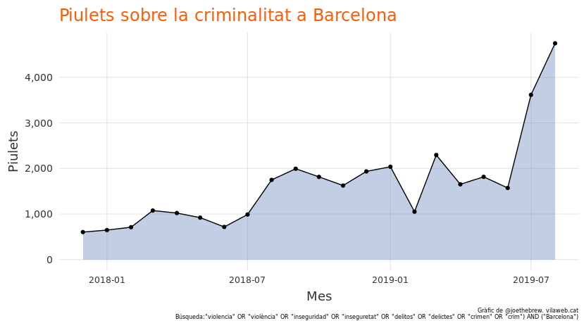<!-- -->

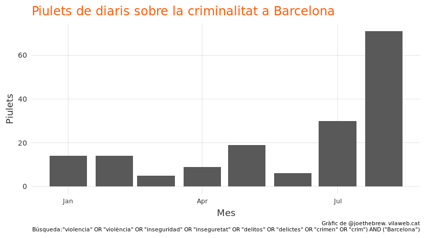<!-- -->

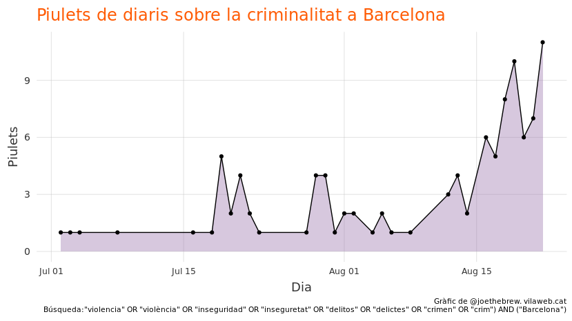<!-- -->

<!-- -->

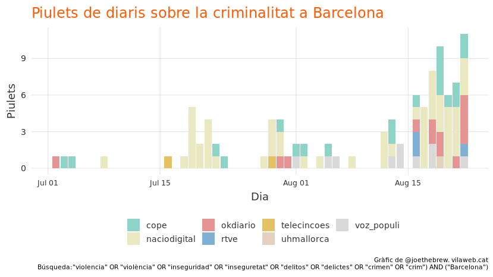<!-- -->
